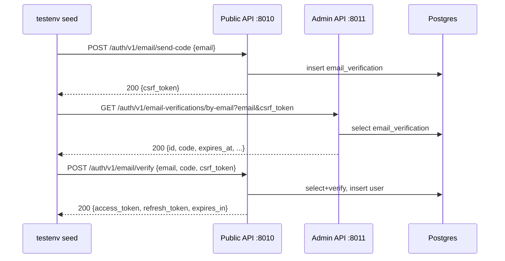

# Full-stack Local Test Environment — Stage 1c (Test Data Seed Helpers)

> Related issues: azents/azents#2327 (parent), azents/azents#2351 (implementation)
>
> Discussion: azents/azents#2358 (Phase 1·1.5 complete, 7 decisions agreed)
>
> Prior: [Stage 1a — Preflight](./local-260406-local-fullstack-test-env.md), Stage 1b merged (#2338)

## Overview

Stage 1a (preflight) and Stage 1b (devserver lifecycle) are complete, so an agent can start local infra + devserver to ready state in one line. However, DB is empty. Stage 1c provides seed building block library `testenv.nointern.seed` so an agent can **assemble different QA scenarios for each PR with short Python scripts**.

### Core reframe (Discussion #2358 §2)

> testenv is not e2e. e2e automatically verifies fixed scenarios with fixtures, but QA scenarios in testenv differ per PR. **Seed is not "one-shot bootstrap" but "building blocks that agent assembles as needed."**

From this reframe, six follow-up decisions naturally derive: "library (not CLI), explicit dependencies, coarse granularity, own code, unique() isolation, dummy key default." See #2358 §3 for detailed rationale.

## Usage Scenario

```python
from testenv.nointern import seed

# Scenario 1 — user + workspace
user = seed.auth.create_user()
ws = seed.workspace.create(user)

# Scenario 2 — up to agent (no real LLM call, dummy key)
seed.llm.register_model("gpt-4o-mini")
integration = seed.llm.create_integration(user, ws)
agent = seed.agent.create(user, ws, integration, model="gpt-4o-mini")

# Scenario 3 — two users, same workspace member
#   ※ Phase 3 feasibility result: current public API has no add_member endpoint.
#     It will be removed from first scope or changed to direct workspace join API
#     by second user. See §Feasibility Verification Results §4 for details.

# Scenario 4 — direct admin client use (internal network, no token required)
from testenv.nointern.seed._client import admin_client
admin = admin_client()

# Scenario 5 — QA needing real LLM call (after Stage 2)
import os
integration = seed.llm.create_integration(user, ws, api_key=os.environ["OPENAI_API_KEY"])
```

## Decision Summary

Detailed rationale in Discussion #2358 §3.

| # | Decision | One-line summary |
|---|---|---|
| 1 | shape | `import`-able library (not CLI). Pass objects through function return values |
| 2 | isolation | default is `unique()` pattern; use `devserver down --all && up` if clean DB needed |
| 3 | e2e utils reuse | **Option B (own code)** — separate due to dependency direction and granularity philosophy |
| 4 | granularity | one function = one domain object, dependencies as explicit args |
| 5 | LLM key | default `"sk-test-dummy"`; caller explicitly passes real key |
| 6 | module layout | `testenv/nointern/seed/{auth,workspace,agent,llm}.py` + internal helpers `_client/_types/_unique` |
| 7 | Admin auth | internal network assumption, admin client used without token (feasibility needed) |

Discarded items: CLI structure / output-storage style / preflight integration (Discussion #2358 §5).

## Module Layout

```
testenv/nointern/seed/
├── __init__.py       # expose auth, workspace, agent, llm submodules + core types
├── _client.py        # public_client(), admin_client() factory
├── _types.py         # User, Workspace, Agent, Integration dataclass
├── _unique.py        # unique() — uuid suffix helper
├── auth.py           # create_user
├── workspace.py      # create
├── agent.py          # create
└── llm.py            # register_model, create_integration
```

After `from testenv.nointern import seed`, access by namespace such as `seed.auth.create_user(...)`.

## Data Model

### `_types.py`

```python
from dataclasses import dataclass

@dataclass(frozen=True)
class User:
    """User created by testenv."""
    email: str
    access_token: str
    refresh_token: str

@dataclass(frozen=True)
class Workspace:
    """workspace created by testenv."""
    handle: str
    name: str
    owner: User

@dataclass(frozen=True)
class Integration:
    """LLM provider integration created by testenv."""
    id: str
    workspace: Workspace
    provider: str       # "openai", etc. — simplify as string instead of exposing OpenAPI Enum
    name: str

@dataclass(frozen=True)
class Agent:
    """agent created by testenv."""
    id: str
    workspace: Workspace
    integration: Integration
    name: str
    model_slug: str     # e.g. "gpt-4o-mini"
```

dataclasses are frozen value objects. Subsequent calls only pass them as arguments, so mutation is unnecessary.

### `_unique.py`

```python
import uuid

def unique() -> str:
    """8-char hex suffix."""
    return uuid.uuid4().hex[:8]
```

Same pattern as e2e `utils.py` `unique()`.

### `_client.py`

```python
"""OpenAPI client factories.

Base URL is read from environment variables, falling back to testenv defaults.
Since devserver is assumed to be running on same machine, localhost defaults are enough.
"""

import os
import nointernpublicclient
import nointernadminclient

DEFAULT_PUBLIC_URL = "http://localhost:8010"
DEFAULT_ADMIN_URL = "http://localhost:8011"


def public_client() -> nointernpublicclient.ApiClient:
    """Public API client (caller passes token via _headers)."""
    host = os.environ.get("TESTENV_NOINTERN_PUBLIC_URL", DEFAULT_PUBLIC_URL)
    return nointernpublicclient.ApiClient(
        configuration=nointernpublicclient.Configuration(host=host)
    )


def admin_client() -> nointernadminclient.ApiClient:
    """Admin API client.

    Discussion §3.7: assumes internal network, no token required. Finalized after
    Phase 3 feasibility verifies whether admin API actually works without auth.
    """
    host = os.environ.get("TESTENV_NOINTERN_ADMIN_URL", DEFAULT_ADMIN_URL)
    return nointernadminclient.ApiClient(
        configuration=nointernadminclient.Configuration(host=host)
    )
```

## Function Signatures

### `auth.py`

```python
def create_user(email: str | None = None) -> User:
    """Create new user through email auth flow and issue tokens.

    1. Call Public `auth/v1/send-code` → receive csrf_token
    2. Peek code through Admin `auth/v1/email-verifications/by-email`
    3. Public `auth/v1/verify-code` → access/refresh token

    Same 3-step flow as e2e `authenticate_user`. Difference is dataclass return
    and automatic email generation pattern.
    """
```

### `workspace.py`

```python
def create(owner: User, *, handle: str | None = None, name: str | None = None) -> Workspace:
    """POST `workspace/v1/workspaces`.

    If handle absent, use `ws-{unique()}`; if name absent, use "Test WS {unique()}".
    Use owner.access_token as `Authorization: Bearer ...` header.
    """
```

### `llm.py`

```python
def register_model(slug: str, *, vendor: str = "openai") -> None:
    """Register LLM model + provider model through Admin API (idempotent).

    Same pattern as e2e `_seed_llm_model`: ignore 409.
    In Stage 1c, provider is also registered with same key as vendor.
    """

def create_integration(
    user: User,
    workspace: Workspace,
    *,
    provider: str = "openai",
    api_key: str = "sk-test-dummy",
    name: str | None = None,
) -> Integration:
    """POST `workspace/{handle}/llm-provider-integrations`.

    api_key default is same dummy key as e2e. For real LLM call (Stage 2+),
    caller explicitly passes e.g. `api_key=os.environ["OPENAI_API_KEY"]`.
    """
```

### `agent.py`

```python
def create(
    user: User,
    workspace: Workspace,
    integration: Integration,
    *,
    model: str = "gpt-4o-mini",
    name: str | None = None,
    agent_type: str = "public",
) -> Agent:
    """POST `workspace/{handle}/agents`.

    model must be slug previously registered by register_model (since idempotent,
    it is safe for caller to call it again in same function).
    """
```

## Auth Flow

`auth.create_user` follows same 3-step flow as e2e `authenticate_user`:



Whether this flow is alive in testenv devserver (especially admin email-verification peek) is verified in Phase 3 feasibility item 3.

## External Dependencies

Add to `testenv/nointern/pyproject.toml`:

```toml
dependencies = [
    "typer==0.24.1",
    "python-dotenv==1.2.2",
    "nointern-public-client",
    "nointern-admin-client",
]

[tool.uv.sources]
nointern-public-client = { path = "../../python/libs/nointern-public-client", editable = true }
nointern-admin-client = { path = "../../python/libs/nointern-admin-client", editable = true }
```

e2e already imports both clients with same pattern, so there is no cost to introducing new dependencies.

## Infrastructure Changes

**None**. testenv compose, devserver, preflight unchanged. Only adds new module directory + two dependencies. Pure library addition on top of Stage 1a/1b foundation.

## Feasibility Verification Results

Executed the 5 items listed in Discussion #2358 §7 Phase 3 immediately after draft. Each item was verified with actual code/API call.

| # | Item | Result | Note |
|---|---|---|---|
| 1 | utils.py dependency | ✓ | imports only `nointernadminclient`, `nointernpublicclient`, `requests`, `websockets`. no conftest dependency — can separate-import in testenv |
| 2 | Admin API auth | ✓ | verified. `curl :8011/auth/v1/email-verifications/by-email?...` returns 200 without token + DB row as-is. `:8011/health/v1/readiness` also 200 |
| 3 | email auth backdoor | ✓ | verified. send-code → admin peek → verify all passed with 200 against testenv devserver (after `up --timeout 120`). `access_token`, `refresh_token`, `expires_in` issued normally |
| 4 | Workspace add_member API | ✗ | `workspace_v1_api.py` has only `create / get_by_handle / list / list_workspaces`. **No add_member** |
| 5 | LLM model registration idempotency | ✓ | utils.py `_seed_llm_model` already verified as 409-ignore pattern. Reuse same pattern in testenv (actual call in Phase 1 implementation PR) |

### Finding #4 — add_member absent → change Scenario 3

Current `nointern-public-client/.../workspace_v1_api.py` has no member invitation/add endpoint. Therefore usage scenario 3 (two users, same workspace member) is handled in first scope with one of these options:

- **A. Remove from first scope.** Start with 4 README scenarios, and add `seed.workspace.add_member` when member invitation API is added.
- **B. If flow exists where second user directly joins same workspace, use that.** Needs additional code investigation.

**Choice**: A. Without member invitation API in nointern-server, simulating it in testenv is meaningless. Move scenario 3 to future scenario 5, and first PR series starts with scenarios 1, 2, 4 (+ 5 placeholder).

### Live Verification Command Log (Reproducible)

```bash
cd testenv/nointern && cp .env.example .env
uv run devserver.py up --timeout 120

# 1) Admin API health (no auth)
curl -i http://localhost:8011/health/v1/readiness   # 200

# 2) Public send-code
curl -i -X POST http://localhost:8010/auth/v1/email/send-code \
  -H 'Content-Type: application/json' \
  -d '{"email":"feasibility-test@example.com"}'
#   200 {"csrf_token":"de93..."}

# 3) Admin email-verifications by-email (no auth → row as-is)
curl -i 'http://localhost:8011/auth/v1/email-verifications/by-email?email=feasibility-test@example.com&csrf_token=de93...'
#   200 {"id":"...","email":"...","code":"VT9L63",...}

# 4) Public verify
curl -i -X POST http://localhost:8010/auth/v1/email/verify \
  -H 'Content-Type: application/json' \
  -d '{"email":"feasibility-test@example.com","code":"VT9L63","csrf_token":"de93..."}'
#   200 {"access_token":"eyJ...","refresh_token":"...","expires_in":1800}
```

OpenAPI client uses exactly these paths, so wrapper guarantees same result as raw curl (`/auth/v1/email/send-code`, `/auth/v1/email-verifications/by-email`, `/auth/v1/email/verify` — path names `auth/v1/send-code`, `auth/v1/verify-code` in issue draft were confirmed incorrect, but there is no impact because OpenAPI client is used).

Decision 7 (Admin auth token unnecessary) was confirmed true in practice.

## Risks and Mitigations

| Risk | Likelihood | Impact | Mitigation |
|---|---|---|---|
| Admin API actually requires auth | ~~medium~~ ✗ | — | rejected by Feasibility §2/3 actual verification. testenv devserver returned 200 without token |
| import error due to OpenAPI client model class change | low | medium | e2e uses same classes and is verified in CI, so e2e breaks first and serves as alarm |
| `register_model` call order dependency | low | low | idempotent, so safe if caller calls it every time. Force in README examples |
| natural extension to `seed.chat.*` when WebSocket chat helper is added in Stage 2 | — | — | module namespace pattern makes adding `seed.chat` simple. no separate design needed |
| review asks for underscore prefix again like `_devserver/` | low | low | `_client/_types/_unique` are module-private, so underscore is appropriate — no external exposure |

## Implementation Plan

`/ship-feature` stack. Use the 6 steps from Discussion #2358 §7 Phase 4 as-is:

1. **Phase 1** — add client dependencies to `pyproject.toml` + skeleton `seed/_client.py`, `_types.py`, `_unique.py` + empty `__init__.py`. Start devserver, run follow-up feasibility items 2/3, then commit results to this PR.
2. **Phase 2** — `seed/auth.py` (`create_user`)
3. **Phase 3** — `seed/workspace.py` (`create`)
4. **Phase 4** — `seed/llm.py` (`register_model`, `create_integration`)
5. **Phase 5** — `seed/agent.py` (`create`)
6. **Phase 6** — seed section in `testenv/nointern/README.md` + run scenarios 1/2/4 once for verification
7. **cleanup** — remove temporary plan document

Each phase PR passes ruff/pyright strict + verifies corresponding function with one live call (no test code, live verification).

## Alternatives Considered

### 1. CLI (`seed.py bootstrap`)

**Rejected**: Discussion §3.1. CLI requires bash glue that parses tokens from stdout/json and injects into next command. Library solves same work in one Python line.

### 2. Direct import of e2e `utils.py`

**Rejected**: Discussion §3.3. Structure such as `create_chat_session` in utils.py bundles ws+integration+agent+WS session into one function, which is opposite of testenv building block philosophy. Dependency direction (testenv→e2e) is also unnatural.

### 3. Extract common lib (`python/libs/...`)

**Rejected**: Discussion §3.3. Extract naturally when second testenv appears. YAGNI now.

### 4. Global state ("last created user")

**Rejected**: Discussion §3.4. Debugging nightmare and violates essence of assembling short scripts.

### 5. One-shot `bootstrap()` function

**Rejected**: core reframe in Discussion §2. Seeding one fixed state in testenv where scenario differs per PR is e2e fixture imitation. It violates QA purpose.

## Out of Scope

- WebSocket chat helper (`seed.chat`) — Stage 2
- Agent tool execution, sandbox, MCP toolkit seed — Stage 3
- Browser / nointern-web seed — Stage 4
- Unit/integration tests for seed library itself — README scenarios are verification (Discussion §3.7)

## References

- Parent design: [`local-260406-local-fullstack-test-env.md`](./local-260406-local-fullstack-test-env.md)
- Discussion: azents/azents#2358
- 1c implementation issue: azents/azents#2351
- Original e2e seed pattern: `python/apps/nointern-e2e/src/tests/utils.py` (`authenticate_user`, `_seed_llm_model`, `create_chat_session`)
- OpenAPI clients: `python/libs/nointern-public-client/`, `python/libs/nointern-admin-client/`
- testenv infra: `testenv/nointern/{preflight.py,devserver.py,docker-compose.yaml}`
