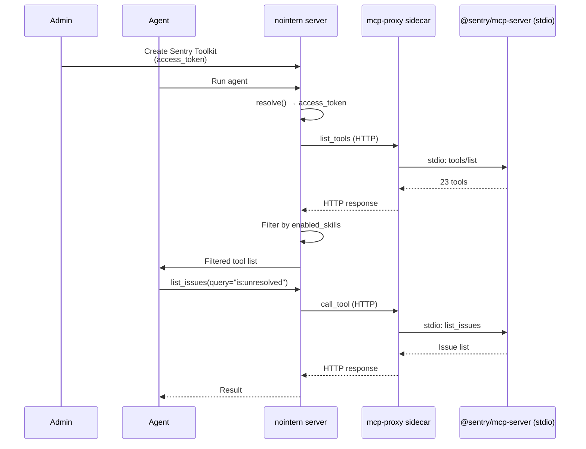

# Sentry Toolkit — access_token Mode (stdio via mcp-proxy)

Phase 2. Proceed after implementing [Phase 1 (per-user OAuth)](sentry-toolkit.md).

## Overview

Sentry User Auth Token (`sntryu_...`) does not work with remote endpoint (`mcp.sentry.dev`); only OAuth access tokens are allowed. Therefore, to use workspace-level API token, run `@sentry/mcp-server` via stdio and expose it over HTTP through mcp-proxy sidecar.

**Benefits of this mode:**
- Shared across entire workspace after admin configures once.
- Usable in autonomous behavior mode (system session).
- Individual users do not need Sentry OAuth authorization.

## Architecture



## Infrastructure Changes

### mcp-proxy Docker image

Pre-install `@sentry/mcp-server` (same pattern as analytics-mcp):

```dockerfile
# docker/nointern/mcp-proxy/Dockerfile
RUN npm install -g @sentry/mcp-server
```

### mcp-proxy config

```json
{
  "mcpServers": {
    "sentry": {
      "command": "sentry-mcp-server",
      "args": ["--access-token", "${SENTRY_ACCESS_TOKEN}"]
    }
  }
}
```

Environment variable `SENTRY_ACCESS_TOKEN` is injected from toolkit credentials.

## Data Model

Add `auth_mode` field to Phase 1 `SentryToolkitConfig`:

```python
class SentryToolkitConfig(BaseModel):
    auth_mode: Literal["per_user", "access_token"] = Field(default="per_user")
    timeout: float = Field(default=30.0)
    enabled_skills: list[str] = Field(default=["inspect", "seer"])
```

### Credential Model

| auth_mode | Storage type |
|-----------|-----------|
| `access_token` | `McpSecretsBearer(token="sntryu_...")` |

## Provider Changes

Add branch to `SentryToolkitProvider.resolve()`:

```python
async def resolve(self, config, context):
    if config.auth_mode == "per_user":
        mcp_config = _build_mcp_config_per_user(config)
        toolkit = await self._mcp_provider.resolve(mcp_config, context)
    else:
        mcp_config = _build_mcp_config_access_token(config, context.mcp_proxy_url)
        toolkit = await self._mcp_provider.resolve(mcp_config, context)
    return SentryToolkit(inner=toolkit, enabled_skills=config.enabled_skills)
```

## Frontend Changes

Add authentication mode selection UI:

```
┌─────────────────────────────────────────────┐
│  Authentication Mode                         │
│  ○ Per-user OAuth (recommended)              │
│  ○ API Token                                 │
│                                             │
│  ── when access_token selected ──             │
│  API Token                                  │
│  ┌─────────────────────────────────────────┐ │
│  │ sntryu_••••••••••••                     │ │
│  └─────────────────────────────────────────┘ │
└─────────────────────────────────────────────┘
```
