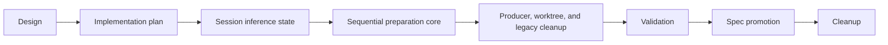

# Sequential Input Buffer Preparation Implementation Plan

## Feature Summary

Implement [Sequential Input Buffer Preparation](sequential-input-buffer-preparation.md) as a reviewable stack. The finished system processes one durable input at a time, prepares semantic events before a turn boundary, snapshots current resolved inference state from the Session for every turn, and removes obsolete queue and background-completion contracts.

## Stack

### 1. Design

Establish the approved design and ADRs. This phase contains no behavior change.

### 2. Implementation plan

Define review boundaries, dependencies, validation coverage, fixture needs, rollout, spec candidates, and cleanup.

### 3. Session inference state

Replace run-bound inference configuration with complete Session current inference state and per-turn snapshots.

- Add the Session inference columns and migration.
- Remove requested/resolved inference fields from AgentRun and associated contracts.
- Rename message requested profile to applied inference profile.
- Resolve and persist explicit or implicit profiles during model-bearing input preparation.
- Capture one immutable inference snapshot for each model-call boundary.
- Update repositories, recovery paths, subagent initialization, REST/live projections, and focused tests.

This phase must land before the drain orchestrator because processors need a stable state transition contract.

### 4. Sequential preparation core

Introduce the closed polymorphic processor registry and drain orchestration.

- Process one Buffer by UUIDv7 id order while holding the Session linearization lock.
- Add direct processors for user messages, goal continuations, and agent messages.
- Add Goal and Skill action processors.
- Implement `eligible`, `neutral`, and `failed` FIFO folding.
- Derive processor output identities from Buffer ids.
- Generate durable semantic events without persisting action envelopes.
- Integrate the atomic empty-boundary claim/continue/idle decision with the Session runner.
- Add processor, rollback, ordering, and concurrent acceptance tests.

### 5. Producer, worktree, and legacy cleanup

Move all producers to the new acceptance boundary and finish action behavior.

- Lock the Session before accepting messages, actions, mailbox inputs, and continuations.
- Replace generic Buffer idempotency with typed chat-write request payload validation.
- Make edits transactional without an edit buffer.
- Keep ordinary pending deletion state-neutral and reject deletion of claimed worktree inputs.
- Execute worktree actions through durable Buffer-id claims; treat preparation failure as final.
- Remove action retry/discard APIs and stale execution states.
- Remove `edited_user_message`, `background_completion`, and the deprecated Background pipeline.
- Regenerate public API clients and apply minimal frontend contract cleanup.
- Add focused API, service, worktree, and frontend tests.

### 6. Validation

Validate the integrated stack against real product boundaries and record evidence.

- Run backend Ruff, Pyright, and Pytest.
- Run TypeScript format, lint, typecheck, and relevant builds.
- Run testenv E2E quality checks and the primary E2E matrix.
- Exercise migration upgrade on a representative database.
- Verify FIFO, concurrent acceptance, handled failure recovery, worktree completion/failure, per-turn inference changes, edit, deletion, reconnect, and removed endpoint behavior.
- Record environment, commands, results, failures found, fixes, and implementation-versus-spec drift.

### 7. Spec promotion

Run spec review after implementation and validation.

- Update Conversation and Agent Execution Loop to the shipped behavior.
- Remove the obsolete Background Tool Call spec.
- Update Run Resume and other linked specs if their current behavior changed.
- Mark the feature design implemented only after all required validation passes.
- Regenerate documentation indexes.

### 8. Cleanup

Delete this temporary implementation plan and remove references that exist only to coordinate the stack. Do not include behavior changes.

## Dependencies

Each branch is based on the preceding branch. CI is evaluated per PR, but all planned PRs are opened before stack-wide CI monitoring.

## E2E Primary Validation Matrix

| Behavior | Primary assertion | Failure signal |
| --- | --- | --- |
| Mixed FIFO inputs | Semantic history and turns follow Buffer id order | Reordering, skipped item, or duplicate event |
| Per-turn inference | Consecutive turns in one AgentRun use their prepared Session snapshots | Run-level model pinning or wrong target/effort |
| Goal action | Goal state, `goal_updated`, and one user message are committed together | Durable action envelope or partial write |
| Skill action | `skill_loaded` and one user message reach the next turn | Duplicate user text or missing Skill instruction |
| Worktree success | Durable result and project registration complete before later input | Early model turn or lost claim |
| Worktree failure | Typed error is durable, Buffer is consumed, later eligible input can run | Retry state, stuck queue, or changed inference state |
| Preparation failure | Failed item is consumed and final fold controls turn continuation | Model run marked failed or infinite retry |
| Concurrent acceptance | A write arriving near empty-boundary processing is handled in the same or next valid cycle | Session becomes idle with stranded input |
| Edit | Durable transcript rewrite is atomic and no edit Buffer exists | Partial rewrite or legacy Buffer kind |
| Pending deletion | Delete is idempotent and does not force lifecycle state | Direct idle transition or no-op AgentRun |
| Reconnect | Pending and durable handoff renders one logical item | Duplicate/missing timeline item |
| Removed contracts | Background completion and action retry/discard endpoints are unavailable | Legacy API or queue kind remains usable |

## Fixture and Prerequisite Support

- Reuse deterministic inference fixtures for target/effort assertions; add multi-turn fixture cases only if existing fixtures cannot distinguish turn snapshots.
- Reuse Git fixture repositories and Runner worktree operations for success and deterministic failure coverage.
- Add a synchronization hook or test barrier for the empty-boundary race only in testenv code if normal E2E timing cannot assert the linearization point reliably.
- No live provider credentials are required for mandatory validation. Live-provider checks are optional diagnostics and must not replace deterministic CI coverage.
- Capture the server, worker, Runner, web, database migration revision, and fixture catalog revision in validation evidence.

Missing fixture behavior blocks the Validation PR, not the preceding unit-tested implementation PRs. A skipped mandatory deterministic scenario is a validation failure. Optional live-provider checks may skip only when credentials are absent and must report the reason.

## Test Strategy by Phase

- Session inference state: migration, repository, profile resolution, turn snapshot, recovery, and subagent unit/integration tests.
- Sequential core: processor contract, FIFO fold, transactional rollback, deterministic identity, Session-lock concurrency, and runner boundary tests.
- Producer/worktree cleanup: REST idempotency, edit/delete, action success/failure, removed endpoints, generated client, frontend state, and focused E2E tests.
- Validation: complete E2E matrix plus full affected-project quality suites.

## Spec Impact Candidates

- `docs/azents/spec/domain/conversation.md`
- `docs/azents/spec/flow/agent-execution-loop.md`
- `docs/azents/spec/flow/run-resume.md`
- `docs/azents/spec/flow/background-tool-call.md` (delete)
- `docs/azents/spec/flow/chat-session-resync.md`

## Rollout

The migration is an in-place replacement without compatibility readers. Deploy database migration and application code as one coordinated release. Existing pending legacy Buffer kinds and deprecated background operations are not migrated; pre-deploy operational checks must confirm no such work remains. Unexpected processor errors retain their Buffer for worker recovery, while handled semantic failures are committed and consumed.

## Cleanup

After validation and spec promotion:

- Remove this implementation plan in the final PR.
- Keep the implemented design and ADRs as historical rationale.
- Keep current behavior only in Living Specs and code.
