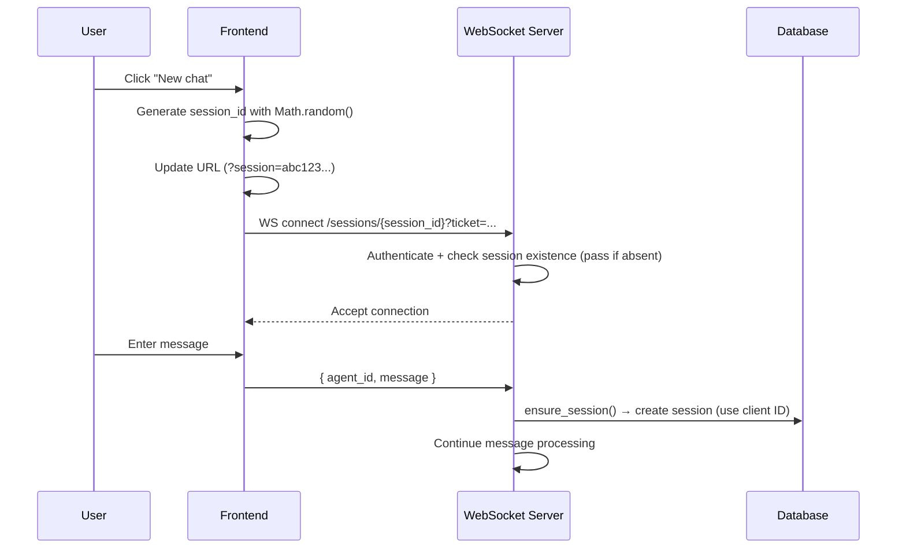
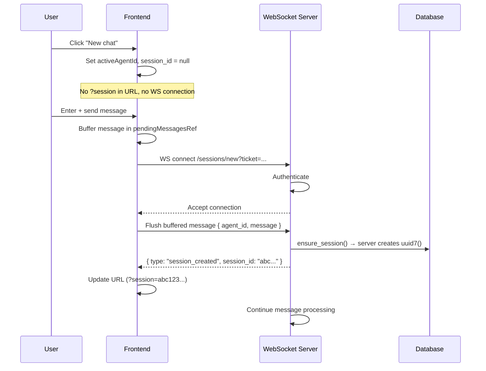
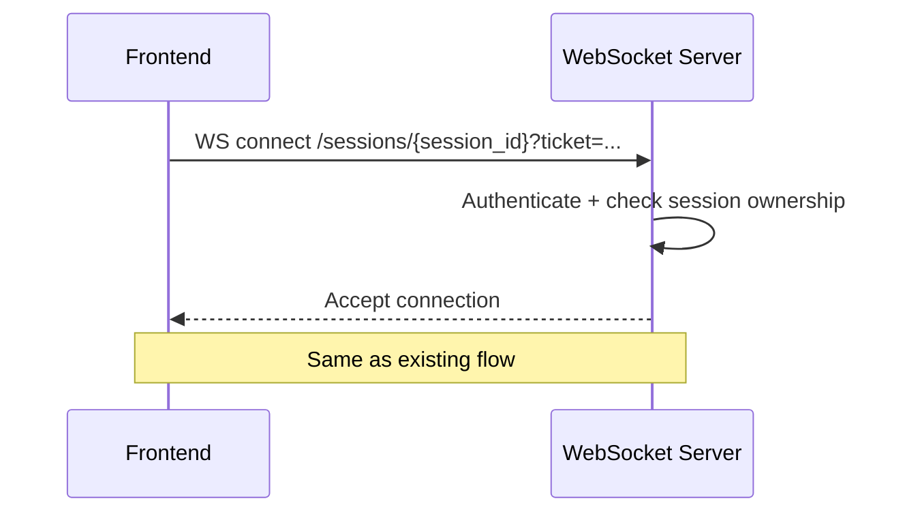

# Server-Side Session ID Generation

## Background

Currently, the web client directly generates `session_id` as a 32-character hex string based on `Math.random()` and sends it to the server. This creates security issues such as path traversal, S3 key pollution, and non-cryptographic randomness.

Slack/Discord integrations already generate session_id on the server. Web chat should move to server-issued IDs as well.

## Current Flow



### Problems

1. **Unvalidated session_id format** — client can pass arbitrary string.
2. **`Math.random()`** — not CSPRNG, theoretically predictable.
3. **Path traversal** — session_id is inserted directly into S3 key without validation.
4. **Empty session creation** — clicking "New chat" allocates session_id, causing ghost sessions without messages.

## Flow After Change



Existing session reconnect remains the same:



## Detailed Design

### 1. WebSocket route

Keep existing route and add route for new sessions.

```python
# Existing — session reconnect
@router.websocket("/sessions/{session_id}")
async def chat_websocket(websocket, session_id: str, ...): ...

# New — create new session
@router.websocket("/sessions/new")
async def chat_websocket_new(websocket, ...): ...
```

Both handlers call an internal common function, only differing by `session_id` argument:
- Existing: `session_id: str` (from path)
- New: `session_id = None` (server creates)

> **FastAPI route order**: `/sessions/new` must be registered before `/sessions/{session_id}` so "new" is not matched as a path parameter.

### 2. Change ensure_session

Change `EnsureSessionInput.session_id` to `str | None`.

```python
@dataclasses.dataclass(frozen=True)
class EnsureSessionInput:
    """Session ensure input."""
    session_id: str | None  # server creates when None
    agent_id: str
    user_id: str
```

Change `ensure_session()` logic:

```python
async def ensure_session(self, input: EnsureSessionInput) -> Result[...]:
    async with self.session_manager() as session:
        if input.session_id is not None:
            # Check existing session (same as current logic)
            existing = await self.conversation_session_repository.get_by_id(
                session, input.session_id
            )
            if existing is not None:
                if existing.user_id != input.user_id:
                    return Failure(SessionAccessDenied())
                return Success(existing)

        # Check Agent existence
        agent = await self.agent_repository.get_by_id(session, input.agent_id)
        if agent is None:
            return Failure(AgentNotFound())

        # Verify workspace member
        ...

        # Create session — if session_id=None, server generates uuid7
        conv_session = await self.conversation_session_repository.create(
            session,
            ConversationSessionCreate(...),
            session_id=input.session_id,  # None → uuid7().hex
        )
        return Success(conv_session)
```

`ConversationSessionRepository.create()` already uses `uuid7().hex` when `session_id=None`, so no change is needed.

### 3. session_created event

When new session is created, send `session_created` event to client.

```python
# Server → client event
{"type": "session_created", "session_id": "a1b2c3d4e5f6..."}
```

In WebSocket handler `receive_loop`, after `ensure_session` succeeds:

```python
result = await chat_service.ensure_session(input)
match result:
    case Success(conv_session):
        # Notify client if new session was created
        if session_id is None:
            session_id = conv_session.id
            await websocket.send_json({
                "type": "session_created",
                "session_id": session_id,
            })
            # Also switch broker subscription to new session_id
```

### 4. Broker subscription timing

Currently, WS calls `broker.subscribe_events(session_id)` at connection time. For new session, there is no session_id at connection time, so subscription timing must be adjusted.

**Approach**: In new session route, subscribe broker after first message processing (after session_id is finalized).

```python
# /sessions/new handler
await websocket.accept()

# Receive first message → ensure_session → finalize session_id
raw = await websocket.receive_json()
parsed = ...
result = await chat_service.ensure_session(...)
session_id = result.value.id
await websocket.send_json({"type": "session_created", "session_id": session_id})

# Now start broker subscription
async with broker.subscribe_events(session_id) as events:
    # Deliver first message to broker + subsequent receive/send loop
    await broker.send_message(SessionMessage(...))
    async with anyio.create_task_group() as tg:
        tg.start_soon(receive_loop)
        tg.start_soon(send_loop)
```

### 5. Frontend changes

#### types.ts

```typescript
/** Session creation completed — server assigned session_id */
export interface SessionCreatedEvent {
  type: "session_created";
  session_id: string;
}

// Add to ChatEvent union
export type ChatEvent =
  | ChatMessageEvent
  | SessionCreatedEvent
  | RunStartedEvent
  | ...;
```

#### useChatPageContainer.ts

```typescript
// Before: client generates session_id for new chat
const onNewChat = useCallback((agent: AgentResponse) => {
  const newSessionId = Array.from({ length: 32 }, () =>
    Math.floor(Math.random() * 16).toString(16),
  ).join("");
  setActiveSessionId(newSessionId);
  ...
}, []);

// After: prepare chat without session_id
const onNewChat = useCallback((agent: AgentResponse) => {
  setActiveSessionId(null);
  setActiveAgentId(agent.id);
  setMessages([]);
  setHasMore(false);
  setAuthorizationRequests([]);
  setChatViewState({ type: "READY" });
}, []);
```

#### useChatWebSocket.ts

```typescript
// Before: sessionId required
const url = `${wsUrl}/chat/v1/sessions/${encodeURIComponent(sessionId)}?ticket=...`;

// After: branch by sessionId existence
const sessionPath = sessionId ? encodeURIComponent(sessionId) : "new";
const url = `${wsUrl}/chat/v1/sessions/${sessionPath}?ticket=...`;
```

Handle `session_created` event:

```typescript
case "session_created": {
  // Pass server-assigned session_id through callback
  onSessionCreated?.(event.session_id);
  break;
}
```

Container callback handling:

```typescript
onSessionCreated: (sessionId) => {
  setActiveSessionId(sessionId);  // includes URL update
},
```

#### Change WS connection timing

Currently, connection info is fetched only when `activeSessionId !== null`:

```typescript
const connectionInfoQuery = trpc.chat.getConnectionInfo.useQuery(void 0, {
  enabled: activeSessionId !== null,  // no connection without session_id
});
```

After change, fetch connection info when `activeAgentId !== null` (new chat prepared state):

```typescript
const connectionInfoQuery = trpc.chat.getConnectionInfo.useQuery(void 0, {
  enabled: activeSessionId !== null || activeAgentId !== null,
});
```

#### Trigger WS connection from sendMessage

Currently, messages are sent when WS is already connected. After change, for new session, message send should start WS connection.

```typescript
const sendMessage = useCallback((agentId, message, attachments?) => {
  // If WS is not connected, store message in buffer and start connection
  if (!wsRef.current || wsRef.current.readyState !== WebSocket.OPEN) {
    pendingMessagesRef.current.push(request);
    connect();  // start connection → flush buffer after connection completes
    return;
  }
  ...
}, []);
```

> Current code already has message buffering logic using `pendingMessagesRef` (line 638-647), so use it.

## Changed File List

### Backend (Python)

| File | Change |
|------|----------|
| `api/public/chat/v1/__init__.py` | Add `/sessions/new` route, extract common handler |
| `services/chat/__init__.py` | `ensure_session` — handle optional session_id |
| `services/chat/data.py` | `EnsureSessionInput.session_id` → `str \| None` |

### Frontend (TypeScript)

| File | Change |
|------|----------|
| `features/chat/types.ts` | Add `SessionCreatedEvent` type |
| `features/chat/hooks/useChatWebSocket.ts` | URL branch, `session_created` handling, optional sessionId |
| `features/chat/containers/useChatPageContainer.ts` | Remove ID generation from `onNewChat`, change connection timing |

## Compatibility

- **Existing sessions**: keep `/sessions/{session_id}` route → no change
- **Slack/Discord**: keep server generation → no change
- **Existing S3 data**: path unchanged → no migration required
- **Mobile app (future)**: use server-issued IDs from the start

## Additional Considerations

### session_id format validation

Independently from server-issued ID migration, add format validation to existing `/sessions/{session_id}` route. Validate path parameter with `^[0-9a-f]{32}$` regex to block path traversal at source.

```python
import re

_SESSION_ID_PATTERN = re.compile(r"^[0-9a-f]{32}$")

# Validate on WebSocket connection
if not _SESSION_ID_PATTERN.match(session_id):
    await websocket.close(code=4400, reason="Invalid session ID format.")
    return
```

Apply the same to REST endpoints.
