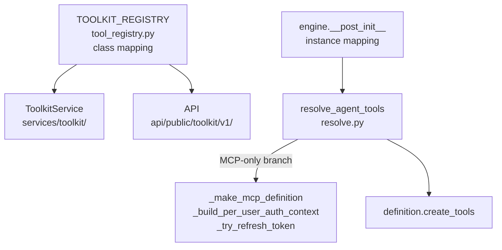
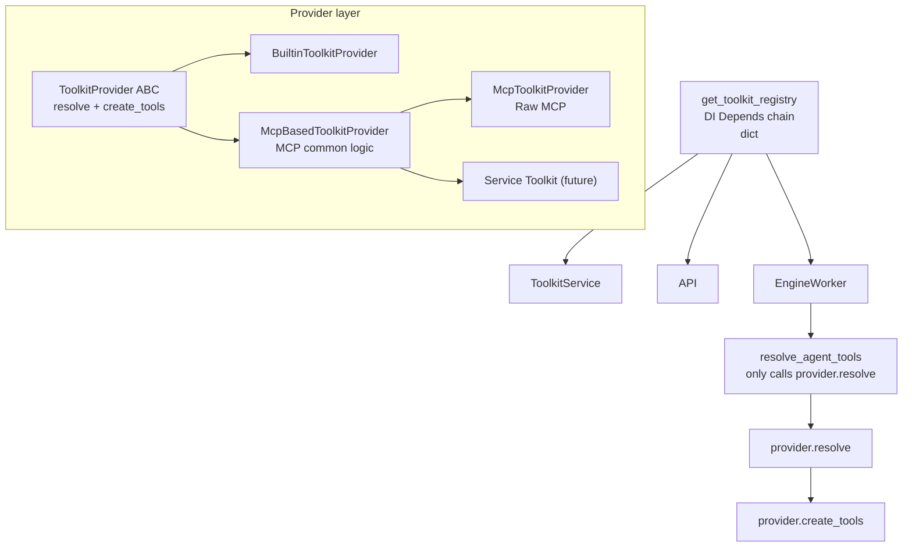

# Service Toolkit Base Implementation Plan

Foundation work for adding Service Toolkits. This extracts the `McpBasedToolkitProvider` base class and refactors the structure to be DI-based. Service-specific implementations such as Slack and GitHub proceed separately after this work is complete.

## Current Structure



**Problems:**
- Two registries exist (class vs instance).
- MCP credential logic is hardcoded in `resolve_agent_tools()` (~50 lines if/elif).
- `resolve_agent_tools()` receives 6 MCP-only parameters individually.
- `McpToolkitProvider` mixes shareable MCP logic and Raw MCP-specific logic.
- Provider instances are directly created in Engine `__post_init__`.

## Target Structure



## Phase 1: Add `resolve()` to ToolkitProvider ABC

### Changed File

- `core/tools.py`

### Work

Add `resolve()` method to `ToolkitProvider` ABC. This is the interface for delegating per-config credential resolution to Provider.

```python
@dataclasses.dataclass(frozen=True)
class ResolveContext:
    """Per-request context passed to resolve()."""
    toolkit_id: str
    toolkit_name: str
    credentials_json: str | None
    user_id: str | None
    session: AsyncSession
    web_url: str
    oauth_secret_key: str

class ToolkitProvider(ABC, Generic[ConfigT]):
    # keep existing methods

    async def resolve(
        self, config: ConfigT, context: ResolveContext,
    ) -> ToolkitProvider[ConfigT]:
        """Resolve per-config credentials and return executable Provider.

        Default implementation returns self as-is.
        Override this when per-config instance is needed, such as MCP.
        """
        return self
```

- `BuiltinToolkitProvider` does not need override (uses default implementation).
- `McpToolkitProvider` overrides in Phase 3.

## Phase 2: Extract `McpBasedToolkitProvider` base class

### Changed Files

- `engine/tools/mcp.py` (split)
- New file: `engine/tools/mcp_base.py`

### Work

Extract MCP common logic from `McpToolkitProvider` into `McpBasedToolkitProvider`.

#### `McpBasedToolkitProvider` (mcp_base.py)

```python
class McpBasedToolkitProvider(ToolkitProvider[ConfigT], ABC):
    """Common base for MCP-protocol-based Toolkits."""

    # constructor: secret, per_user_auth, and other state needed for MCP connection

    @abstractmethod
    def resolve_mcp_params(self, config: ConfigT) -> ResolvedMcpParams:
        """Convert service-specific config into MCP connection parameters."""
        ...

    async def create_tools(self, config: ConfigT, context: ToolkitContext) -> list[Tool]:
        """Connect to MCP server and create tool list. Common implementation."""
        # decide URL/headers with resolve_mcp_params()
        # fetch tool list with mcp_list_tools()
        # wrap Tool objects with _wrap_mcp_tool()
        # return request_authorization tool when per-user OAuth2 unauthenticated
        ...
```

Moved items (mcp.py → mcp_base.py):

| Function/method | Role |
|-------------|------|
| `mcp_list_tools()` | Fetch tool list from MCP server |
| `_wrap_mcp_tool()` | Wrap MCP tool into nointern Tool |
| `_build_auth_headers()` | Build auth headers |
| `_make_request_authorization_tool()` | Per-user OAuth2 authorization request tool |
| `McpPerUserAuthContext` | Per-user OAuth2 context dataclass |
| per-user OAuth2 branch logic | Branch by auth state inside create_tools() |
| `_resolve_oauth_credentials()` | On-demand discovery + DCR |

#### `McpToolkitProvider` (mcp.py)

Keep only Raw MCP-specific logic:

| Item | Role |
|------|------|
| `McpToolkitConfig` | URL-based config (server_url, auth_type, etc.) |
| `resolve_mcp_params()` | Return URL/secret from config as-is |
| Credential parsing | `_McpSecretsUnion` → secret extraction |

## Phase 3: Implement `resolve()` — move MCP credential logic

### Changed Files

- `engine/tools/mcp_base.py` or `engine/tools/mcp.py`
- `engine/run/resolve.py`

### Work

Move MCP-specific credential logic in `resolve.py` to `McpToolkitProvider.resolve()`.

#### Items moved (resolve.py → McpToolkitProvider.resolve())

| Function | Current location | After move |
|------|----------|---------|
| `_make_mcp_definition()` | resolve.py | inside `McpToolkitProvider.resolve()` |
| `_build_per_user_auth_context()` | resolve.py | inside `McpToolkitProvider.resolve()` |
| `_try_refresh_token()` | resolve.py | `McpBasedToolkitProvider` method |
| `_is_token_expired()` | resolve.py | `McpBasedToolkitProvider` method |
| `_mcp_secrets_adapter` | resolve.py | `engine/tools/mcp.py` |

#### resolve_agent_tools() after change

```python
async def resolve_agent_tools(
    agent_id: str,
    context: ToolkitContext,
    *,
    toolkit_registry: dict[str, ToolkitProvider[Any]],
    agent_toolkit_repository: AgentToolkitRepository,
    toolkit_repository: ToolkitRepository,
    session: AsyncSession,
    # remove 6 MCP-only parameters
    web_url: str = "",
    oauth_secret_key: str = "",
) -> list[ResolvedToolkit]:
    for at in agent_toolkits:
        definition = toolkit_registry.get(at.toolkit_type)
        toolkit = await toolkit_repository.get_by_id(session, at.toolkit_id)
        validated_config = type(definition).validate_config(toolkit.config)

        # Same call for all Provider types
        resolve_ctx = ResolveContext(
            toolkit_id=at.toolkit_id,
            toolkit_name=toolkit.name,
            credentials_json=toolkit.credentials,
            user_id=context.user_id,
            session=session,
            web_url=web_url,
            oauth_secret_key=oauth_secret_key,
        )
        resolved_definition = await definition.resolve(validated_config, resolve_ctx)

        tools = await resolved_definition.create_tools(validated_config, context)
        ...
```

Remove four parameters: `token_repository`, `auth_request_repository`, `session_manager`, and `toolkit_repository`. They are injected into Provider constructor and used inside `resolve()`.

## Phase 4: Registry unification and DI migration

### Changed Files

- `core/tool_registry.py` (delete or shrink)
- `worker/engine.py`
- `worker/deps.py`
- `engine/tools/deps.py` (new)
- `services/toolkit/__init__.py`
- `api/public/toolkit/v1/__init__.py`
- `worker/subagent.py`

### Work

#### 4-1. Register Provider DI

Declare `Annotated[..., Depends()]` in each Provider constructor so FastAPI resolves dependencies automatically.

```python
# engine/tools/builtin.py
class BuiltinToolkitProvider(ToolkitProvider[ShellToolConfig]):
    def __init__(
        self,
        sandbox_manager: Annotated[SandboxManager, Depends(get_sandbox_manager)],
    ) -> None:
        self._sandbox_manager = sandbox_manager

# engine/tools/mcp.py
class McpToolkitProvider(McpBasedToolkitProvider[McpToolkitConfig]):
    def __init__(
        self,
        token_repo: Annotated[MCPOAuth2TokenRepository, Depends()],
        auth_request_repo: Annotated[MCPAuthRequestRepository, Depends()],
        session_manager: Annotated[SessionManager[AsyncSession], Depends(get_session_manager)],
        toolkit_repository: Annotated[ToolkitRepository, Depends()],
    ) -> None:
        ...
```

#### 4-2. Registry assembly function

```python
# engine/tools/deps.py (new)
def get_toolkit_registry(
    shell: Annotated[BuiltinToolkitProvider, Depends()],
    mcp: Annotated[McpToolkitProvider, Depends()],
) -> dict[str, ToolkitProvider[Any]]:
    return {
        "shell": shell,
        "mcp": mcp,
    }
```

When adding Service Toolkit, add parameters to this function.

#### 4-3. EngineWorker changes

- Remove `__post_init__`.
- Change `_toolkit_registry` into constructor parameter.
- Remove MCP-only parameters when calling `resolve_agent_tools()`.

```python
@dataclasses.dataclass
class EngineWorker:
    toolkit_registry: dict[str, ToolkitProvider[Any]]  # injected by DI
    # remove MCP-only fields such as token_repository, auth_request_repository
```

#### 4-4. Change get_engine_worker()

```python
def get_engine_worker(
    ...
    toolkit_registry: Annotated[dict[str, ToolkitProvider[Any]], Depends(get_toolkit_registry)],
) -> EngineWorker:
    return EngineWorker(
        ...
        toolkit_registry=toolkit_registry,
        # remove individual passing of token_repository, auth_request_repository, etc.
    )
```

#### 4-5. Migrate TOOLKIT_REGISTRY usages

| Usage | Current | After |
|--------|------|---------|
| `services/toolkit/` | Lookup class via `TOOLKIT_REGISTRY[tt]` | Lookup instance via `toolkit_registry[tt]` (DI injected) |
| `api/public/toolkit/v1/` | Iterate `TOOLKIT_REGISTRY.values()` | Iterate `toolkit_registry.values()` (DI injected) |

Inject `toolkit_registry: dict[str, ToolkitProvider[Any]]` into `ToolkitService` and API endpoints with `Depends(get_toolkit_registry)`.

#### 4-6. Clean up TOOLKIT_REGISTRY and ToolkitType enum

- Delete `TOOLKIT_REGISTRY` module variable from `core/tool_registry.py`.
- Keep `ToolkitType` enum (used as DB column values).

## Phase 5: Clean up SubagentToolContext

### Changed File

- `engine/tools/subagent.py`

### Work

Unify `SubagentToolContext.toolkit_registry` to receive the same `dict[str, ToolkitProvider[Any]]`. No separate changes are needed if the registry passed from engine is changed to DI.

## Execution Order

Proceed in Phase 1 → 2 → 3 → 4 → 5 order. Each Phase can be committed independently, and existing tests must pass after each phase.

| Phase | Core change | Impact scope |
|-------|----------|----------|
| 1 | Add `resolve()` to ABC | `core/tools.py` |
| 2 | Extract `McpBasedToolkitProvider` | `engine/tools/` |
| 3 | Move credential logic | `resolve.py`, `engine/tools/` |
| 4 | Unify Registry + DI | `engine.py`, `deps.py`, `services/`, `api/` |
| 5 | Subagent cleanup | `subagent.py` |
