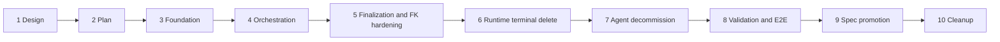

# Extensible Session Lifecycle Implementation Plan

- Requirements: [session-260721/REQ](../requirements/session-260721-lifecycle-extensibility.md)
- ADR: [session-260721/ADR](../adr/session-260721-lifecycle-extensibility.md)
- Design: [session-260721/DESIGN](./session-260721-lifecycle-extensibility.md)
- Document reference: `session-260721/PLAN`

## Purpose

This plan delivers the approved extensible session lifecycle architecture through
one reviewable stacked series. It preserves archive-backed session removal,
retention purge as the only permanent-session deletion owner, and the established
external-cleanup-before-final-delete safety boundary.

The series changes the session lifecycle, parent aggregate deletion, PostgreSQL
ownership graph, runtime-control protocol, generated API clients, and E2E
coverage. Each implementation PR has one coherent ownership boundary and must pass
its relevant CI before merge.

## Stack Summary

| PR | Title | Base | Primary outcome |
| --- | --- | --- | --- |
| 1/10 | `session lifecycle [1/10]: Design baseline` | `main` | Confirmed Requirements, ADR, and primary Design |
| 2/10 | `session lifecycle [2/10]: Implementation plan` | 1/10 | This delivery plan and validation contract |
| 3/10 | `session lifecycle [3/10]: Lifecycle foundation` | 2/10 | Participant contracts, registry, purge progress, installed-schema validator |
| 4/10 | `session lifecycle [4/10]: Session lifecycle orchestration` | 3/10 | Archive/restore/purge participant cutover without restrictive-FK activation |
| 5/10 | `session lifecycle [5/10]: Explicit session finalization` | 4/10 | Finalizer-only deletion, context/worktree ordering, restrictive FK hardening |
| 6/10 | `session lifecycle [6/10]: Runtime terminal deletion` | 5/10 | Provider terminal-delete protocol and runtime deletion verification |
| 7/10 | `session lifecycle [7/10]: Agent decommission` | 6/10 | Durable Agent decommission, Workspace Delete removal, parent-FK hardening |
| 8/10 | `session lifecycle [8/10]: Validation and E2E` | 7/10 | Full PostgreSQL, deterministic E2E, runtime-provider E2E evidence and fixes |
| 9/10 | `session lifecycle [9/10]: Spec promotion` | 8/10 | `/spec-review`, current spec updates, implemented snapshot marking |
| 10/10 | `session lifecycle [10/10]: Cleanup` | 9/10 | Remove this temporary plan and stale implementation-only references |

PRs are created before CI monitoring begins. They merge from front to back only.
Dependent branches rebase with the stacked-PR workflow if an earlier phase changes.

## Phase Boundaries

### 1. Design baseline

Contains only the confirmed snapshot documents and generated documentation index.
It establishes immutable product intent and accepted architecture decisions before
code changes begin.

### 2. Implementation plan

Contains this temporary supporting plan. It fixes phase boundaries, migration
dependencies, verification responsibilities, and rollout gates without changing
runtime behavior.

### 3. Lifecycle foundation

Add the reusable, non-authoritative foundation:

- lifecycle participant types, immutable registry assembly, dependency validation,
  and policy-version support;
- durable participant execution records and job-level participant/phase failure
  attribution;
- participant and decommission enum/model/repository foundations that do not yet
  change public behavior;
- an installed PostgreSQL `pg_constraint` and `pg_trigger` graph reader;
- ownership manifest validation and dense graph fixture support; and
- unit and PostgreSQL tests for registry, progress, diagnostics, and unsafe-path
  detection.

This phase does not route archive, restore, purge, or Agent Delete through new
orchestration. Existing production behavior remains authoritative.

### 4. Session lifecycle orchestration

Move existing archive, restore, and purge behavior behind the participant
orchestrator:

- execution, broker, ModelFile, Artifact, bound ExchangeFile, Git worktree,
  context, conversation-data, and toolkit-state participants;
- participant prepare, external cleanup, verification, retry, lease, and
  post-commit notification behavior;
- archive and restore participant transactions;
- existing-purge job materialization on fencing; and
- participant-level failure attribution and continuation to later due jobs.

This phase preserves existing schema delete actions while proving that
participant-owned cleanup and verification are complete before finalization. It
does not activate the restrictive constraint migration or remove the old
final-delete repository surface until Phase 5.

### 5. Explicit session finalization

Replace implicit final deletion with explicit lifecycle finalization:

- finalizer-only AgentSession deletion repository;
- worktree allocation metadata deletion before context and SessionAgent
  finalization;
- explicit context/project/SessionAgent finalizer ordering;
- restrictive lifecycle-root constraints;
- removal of redundant mutating foreign-key paths;
- single-path cascade policy for pure database children; and
- direct-deletion bypass tests plus fresh-migration catalog validation.

This phase is the controlled schema boundary. It requires Phase 4's authoritative
orchestrator and lease-drain rollout behavior.

### 6. Runtime terminal deletion

Extend runtime control with an authoritative terminal delete operation:

- runtime lifecycle command, protocol messages, durable state, and generation
  fencing;
- Control service dispatch, provider acknowledgement, and already-absent
  idempotency;
- Docker and Kubernetes Provider implementations;
- Agent Runtime repository/service finalization preconditions; and
- protocol, provider, and runtime-control integration tests.

The operation is not publicly exposed as a standalone user action. It exists for
Agent decommission finalization in Phase 7.

### 7. Agent decommission

Replace direct Agent deletion with durable decommission and remove Workspace
deletion:

- Agent lifecycle state and durable decommission job;
- finite-retention admission guard returning `409 Conflict` for Unlimited
  retention;
- decommission admission fencing for session creation, execution, recovery, and
  restore;
- retirement of every Agent root tree, including team-primary, through the session
  lifecycle;
- Agent Runtime, avatar, remaining ExchangeFile, and pure Agent-child
  finalization;
- restrictive Agent/Workspace parent foreign keys;
- public Agent Delete contract and generated-client update; and
- Admin Workspace Delete route, service path, OpenAPI operation, and generated
  client removal.

The decommission coordinator never invokes session final deletion or applies a
request-specific purge deadline.

### 8. Validation and E2E

Run the required complete verification matrix against the merged stack head and
fix implementation drift in this PR or the responsible preceding branch:

- fresh PostgreSQL migration and installed-schema graph validation;
- dense lifecycle contract tests;
- deterministic public API E2E;
- runtime-provider E2E for physical worktree and runtime deletion;
- generated OpenAPI/client drift validation;
- structural direct-delete and public-surface guards; and
- behavior-versus-current-spec comparison.

The PR body records commands, environment, result summaries, and CI evidence.

### 9. Spec promotion

Run `/spec-review` after validation. Update affected living specs, including at
least conversation, agent, runtime control, workspace, worktree, file lifecycle,
and API-facing specs that changed. Add the same `implemented: 2026-07-21` date to
the Requirements and primary Design only after all implementation and validation
work is complete. The ADR remains append-only.

### 10. Cleanup

Remove this temporary implementation plan and any phase-only references after
current specs, implemented snapshot documents, and code become the complete source
of truth. No behavior change belongs in this PR.

## Dependency and Migration Order

- Participant progress persistence must exist before a fence materializes a
  required participant set.
- Orchestration must become authoritative before restrictive lifecycle-root
  constraints are installed.
- Runtime terminal deletion must be provider-complete before Agent decommission
  can delete Agent Runtime metadata.
- Agent/Workspace restrictive foreign keys must be installed with decommission
  admission and finalization in the same controlled boundary.
- Existing purge workers may finish their unexpired lease. New workers claim only
  expired or unowned work and materialize the current participant set before new
  cleanup.
- Rollback after restrictive constraint activation is a forward fix; no direct
  legacy deletion path is restored.

## Data, API, and Runtime Impact

| Area | Planned change | Phase |
| --- | --- | --- |
| PostgreSQL | participant progress, Agent decommission state/job, lifecycle and parent FK changes | 3, 5, 7 |
| Session services | participant-driven archive, restore, purge, and finalization | 4, 5 |
| Scheduler | participant checkpoint retry and Agent decommission worker | 4, 7 |
| Runtime protocol | terminal runtime delete command and provider acknowledgement | 6 |
| Public API | Agent Delete becomes decommission request/progress contract | 7 |
| Admin API | Workspace Delete operation removed | 7 |
| Generated clients | regenerated from public/admin OpenAPI after route/schema changes | 7 |
| Main Web | preserve archive-backed session Delete; adapt Agent Delete only if an existing UI consumes it | 7 |

## Verification Strategy

### E2E primary matrix

| User or operator scenario | Primary evidence | Phase |
| --- | --- | --- |
| Archive populated inactive root tree | Public API archive/list behavior preserves purge-owned resources | 4, 8 |
| Restore before fence | Public API restores full tree and cancels unstarted purge | 4, 8 |
| Restore after fence | Public API returns conflict | 4, 8 |
| Zero-day retention purge | Scheduler removes session only after participant cleanup | 4, 8 |
| Participant cleanup failure/retry | Session stays archived; retry resumes and another due job proceeds | 4, 8 |
| Worktree physical cleanup | Runtime-provider E2E removes worktree and branch before finalization | 5, 8 |
| Direct delete bypass | PostgreSQL rejects direct SessionAgent, context, AgentSession, Agent, and Workspace deletion | 5, 7, 8 |
| Runtime terminal deletion | Provider confirms removal and repeated deletion is idempotent | 6, 8 |
| Agent Delete with finite retention | Decommission fences Agent, retires roots, waits for purge, then deletes Agent | 7, 8 |
| Agent Delete with Unlimited retention | `409 Conflict`; Agent remains unchanged | 7, 8 |
| Workspace Delete | Admin route and generated operation are absent | 7, 8 |
| Session Delete in Main Web | Delete continues to call archive and no permanent-delete control appears | 7, 8 |

### PostgreSQL contract coverage

The existing PostgreSQL 17 testcontainer fixture upgrades Alembic to head. Dense
fixtures must include root and nested SessionAgents, shared context/projects,
worktree provenance, runs and bridge rows, file metadata and pins, ExchangeFile
source/preview resources, retention jobs, and participant progress.

Every migration phase runs:

- backend Ruff and format checks;
- Pyright;
- relevant unit and repository tests;
- fresh-migration PostgreSQL contract tests; and
- OpenAPI drift checks when API models or routes change.

### Fixture and prerequisite support

Deterministic API E2E uses the existing credential-free devserver/container
fixture. It must create state through product APIs and scheduler triggers rather
than direct database writes.

Runtime-provider E2E needs the existing local provider, Runner, and Git repository
fixture for worktree and runtime-delete behavior. It requires no live external
credential. No required lifecycle assertion is allowed to be optional or marked
`live_external`.

## CI and Rollout Gates

| Gate | Required phase boundary |
| --- | --- |
| Pre-commit documentation validation | 1, 2, 9, 10 |
| Python lint, format, Pyright, pytest | 3 through 8 |
| OpenAPI and generated client drift | 7 and 8 |
| TypeScript format, lint, typecheck, build | 7 and 8 if Web/client code changes |
| Deterministic E2E | 4, 5, 7, 8 |
| Runtime-provider E2E | 5, 6, 7, 8 |
| `/spec-review` | 9 |

Create all planned PRs before waiting on CI. After all PRs exist, inspect each
stack PR's checks through `gh` and resolve failures in the responsible branch.

## Rollout Risks and Responses

| Risk | Response |
| --- | --- |
| Old purge worker reaches schema-hardening boundary | Let its lease expire; restrictive FK failure is retried and new worker resumes |
| External cleanup succeeds before checkpoint | Require idempotent cleanup and authoritative domain-row verification |
| Provider unavailable during Agent decommission | Retain runtime metadata and decommission job for retry |
| Team-primary normal archive prohibition conflicts with decommission | Allow only system-owned decommission retirement through the same lifecycle registry |
| Unlimited retention makes decommission non-convergent | Reject Agent Delete with `409 Conflict` before any state mutation |
| Workspace cascade bypasses lifecycle | Remove Workspace Delete route and install restrictive parent relationships |
| FK migration discovers invalid historical rows | Fail preflight with exact rows and constraints; repair through a forward migration or operational remediation before constraint replacement |

## Spec Impact Candidates

- `docs/azents/spec/domain/conversation.md`
- `docs/azents/spec/domain/agent.md`
- `docs/azents/spec/domain/workspace.md`
- `docs/azents/spec/domain/toolkit.md`
- `docs/azents/spec/flow/agent-runtime-control.md`
- `docs/azents/spec/flow/agent-runtime-persistence.md`
- session Git worktree and file lifecycle specs identified by `/spec-review`

## Completion Criteria

The feature is complete only when:

1. all ten stack PRs are created and mergeable in order;
2. the complete CI matrix passes at the stack head;
3. deployed-schema validation has no unapproved mutating session-delete paths;
4. Agent and Workspace deletion cannot bypass retention purge;
5. session archive-backed Delete remains reversible;
6. current specs match implemented behavior; and
7. the Requirements and primary Design are marked implemented and this temporary
   plan is removed.
