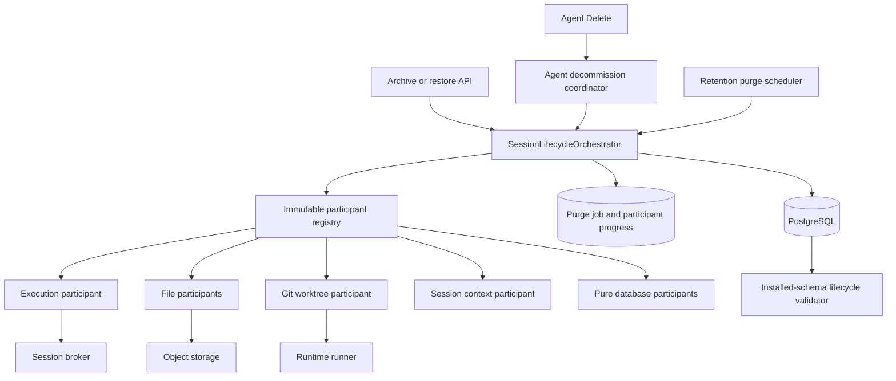
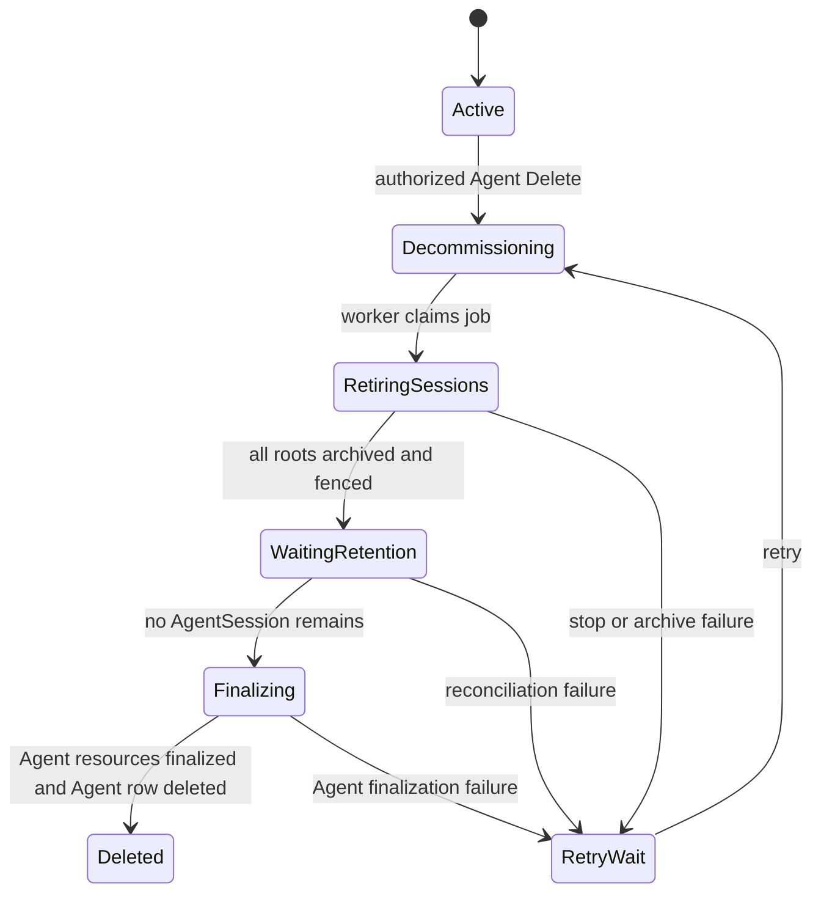
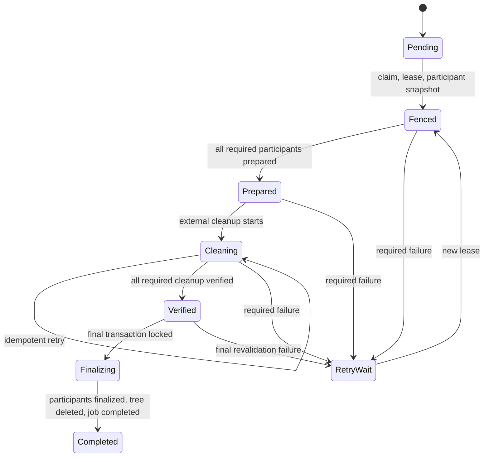

# Extensible Session Lifecycle Design

- Requirements: [session-260721/REQ](../requirements/session-260721-lifecycle-extensibility.md)
- ADR: [session-260721/ADR](../adr/session-260721-lifecycle-extensibility.md)
- Document reference: `session-260721/DESIGN`

## Current Behavior and Gap

### Archive and restore

`ChatSessionService.archive_agent_session()` and
`ChatSessionService.restore_agent_session()` currently own the complete archive and
restore transactions. They lock the root SessionAgent tree, validate session and
AgentRun state, update every linked AgentSession, and create or cancel the durable
retention purge job.

This behavior already provides the correct root-tree transaction boundary, but new
session-bound domains have no required integration contract. A domain with
archive-specific state must be added directly to the central service or can be
omitted without an automated coverage failure.

### Purge

`ArchivedSessionPurgeService` currently coordinates all purge domains directly. It:

- claims a durable per-root job and crosses the irreversible fence;
- increments owner generations, requests stop, and emits broker stop signals;
- clears broker state;
- cleans Git worktrees;
- marks ModelFile, Artifact, and bound ExchangeFile metadata terminal;
- deletes their object-storage blobs and records `blob_deleted_at`;
- re-locks and validates the root-tree boundary;
- deletes purged file metadata;
- deletes the AgentSession subtree; and
- completes the purge job in the same final transaction.

The service already preserves several required properties: external cleanup occurs
before root deletion, cleanup failure retains retry metadata, finalization rechecks
the subtree, one failed job does not stop later due jobs, and final root deletion
and job completion share a transaction. The extensible lifecycle design decomposes
this behavior into participants rather than replacing these safety properties.

### Permanent-delete surface audit

The current public contract contains archive and restore routes but no
`DELETE /chat/v1/sessions/{session_id}` route. Generated public clients contain no
permanent AgentSession deletion operation. Main Web's action labeled Delete invokes
the `archiveAgentSession` mutation and remains the intended reversible removal
action.

In production source, the only caller of
`AgentSessionRepository.delete_by_id()` is `ArchivedSessionPurgeService`. The
repository method is nevertheless available from the general AgentSession
repository and does not express the retention-finalizer precondition. The cutover
must move this SQL operation into a finalizer-specific repository boundary and
remove the general deletion method.

The direct AgentSession call-site audit is not the complete deletion graph. The
public Agent Delete route calls `AgentService.delete_by_id()`, which deletes the
Agent row and reaches AgentSession through `agents -> agent_sessions CASCADE`.
The Admin Workspace Delete route deletes the Workspace row and reaches AgentSession
through both `workspaces -> agent_sessions CASCADE` and
`workspaces -> agents -> agent_sessions CASCADE`. These are indirect request-path
permanent-session deletion authorities and must not remain.

### Installed PostgreSQL relationship graph

The installed PostgreSQL catalog is authoritative. The current graph contains
multiple mutating paths from `agent_sessions` to several tables:

| Target | Current paths | Risk |
| --- | --- | --- |
| `session_agent_context_git_worktrees` | direct creator `SET NULL`; SessionAgent creator `SET NULL`; context ownership `CASCADE`; action and project provenance `SET NULL` | Conflicting trigger order can validate a surviving worktree after its context was removed |
| `session_agents` and `session_agent_contexts` | direct AgentSession ownership plus root, parent, and context cascades | Cyclic and repeated delete propagation |
| `agent_runs` | session `CASCADE` plus parent-run `SET NULL` | Mixed mutation paths |
| `action_execution_events` | direct session `CASCADE` and action-execution `CASCADE` | Repeated ownership paths |
| `agent_run_input_events` | paths through AgentRun and Event | Repeated ownership paths |
| `agent_session_unread_runs` | direct session and AgentRun cascades | Repeated ownership paths |
| `model_file_pins` | ModelFile, AgentSession, and AgentRun cascades | Three ownership paths |
| `exchange_files` | retention-root `SET NULL` and preview self-reference `SET NULL` | Ownership metadata can disappear before required blob cleanup |

The observed purge failure is the worktree instance of this broader graph problem.
ORM declarations alone cannot prove a safe PostgreSQL trigger sequence.

## Proposed Architecture

`SessionLifecycleOrchestrator` is the only cross-domain coordinator. It owns root
tree locking, transition transaction boundaries, participant scheduling, purge
leases, final root deletion, and post-commit notification timing. It does not own
domain-specific cleanup queries or external resource behavior.

Every session-bound resource is classified as one of:

1. **Lifecycle root** — requires cleanup, verification, retry metadata, or an
   observable finalization result. Its participant explicitly finalizes it.
2. **Pure database child** — has no independent lifecycle work and may be removed
   through one declared ownership cascade.
3. **Independent reference** — remains meaningful outside the session lifecycle
   and uses a non-mutating or explicitly reviewed relationship.

The registry and installed-schema validator require exactly one classification and
one owner for every session-bound table or external resource.

## Lifecycle Participant Contract

Each participant supplies immutable metadata and phase-specific operations:

| Contract element | Purpose |
| --- | --- |
| `key` | Stable domain identity persisted in purge progress |
| `policy_version` | Immutable implementation contract for already fenced jobs |
| `owned_resources` | Database tables and external resource kinds owned by the participant |
| `archive_policy` / `restore_policy` | Required mutation, validation-only, or explicit preserve behavior |
| `purge_policy` | Required prepare, external cleanup, verify, and database-finalize behavior |
| `dependencies` | Stable participant keys required by resource ownership |
| phase operations | Domain-owned operations invoked only inside orchestrator-defined boundaries |

Archive and restore operations receive the locked root-tree identity and the
orchestrator-owned database transaction. They cannot commit, open an independent
transaction, or perform destructive external I/O.

Purge operations receive a job identity, stable subtree snapshot, lease identity,
and participant progress. Domain resource rows remain the source of truth for
cleanup targets. Participant progress stores orchestration checkpoints and bounded
counts or summaries, not file names, transcript content, storage keys, prompts, or
other session content.

Participant implementations are constructor-injected and use their domain services
and repositories. The orchestrator does not reach into participant tables.

## Registry Composition and Versioning

Add a `SessionLifecycleRegistry` assembled by a deterministic dependency factory at
the application composition root. The registry stores an immutable tuple and
precomputes a validated dependency order.

Registration has no import-time side effects and no mutable global registry.
Startup validation rejects:

- duplicate participant keys or `(key, policy_version)` pairs;
- missing dependencies or dependency cycles;
- overlapping database or external-resource ownership;
- missing archive, restore, or purge policy declarations;
- asymmetric archive and restore mutations;
- lifecycle roots without cleanup, verification, and finalization operations; and
- resources declared by a participant but absent from the installed-schema
  coverage manifest.

A fenced purge persists each participant's policy version. A deployment must retain
the corresponding implementation while an incomplete job references that version,
or include an explicit forward progress migration before removing it. Startup and
deployment validation report unsupported active versions. This is participant
contract continuity, not a fallback to the previous central purge workflow.

## Initial Participant Inventory

The first registry covers the existing AgentSession root-tree lifecycle:

| Participant | Archive / restore | Purge responsibility | Owned resources |
| --- | --- | --- | --- |
| `session.execution` | Validate no active runs; preserve durable run history | Fence owner generations, persist stop intent, verify no active AgentRun | execution admission and fencing behavior |
| `session.broker-state` | Preserve | Send stop signals and idempotently clear session broker keys | queues, ownership, heartbeat, and activity state |
| `session.model-files` | Preserve | Terminal transition, object deletion, verification, metadata deletion | `model_files` and owned blobs |
| `session.artifacts` | Preserve | Terminal transition, object deletion, verification, metadata deletion | `artifacts` and owned blobs |
| `session.exchange-files` | Preserve | Clean bound source and preview resources, verify, delete metadata | bound `exchange_files` and blobs |
| `session.git-worktrees` | Preserve | Mark pending, remove worktree and Azents branch, verify cleaned, delete allocation rows | `session_agent_context_git_worktrees` and physical worktrees |
| `session.context` | Preserve | Explicitly finalize the SessionAgent tree, context, and context projects after worktrees | `session_agents`, `session_agent_contexts`, `session_agent_context_projects` |
| `session.conversation-data` | Preserve | Declare the safe ownership cascade | events, inputs, action state, snapshots, unread state, and run-linked bridge rows |
| `session.toolkit-state` | Preserve | Declare the safe ownership cascade | `toolkit_states` |

The orchestrator core owns `agent_sessions`, retention job fencing, subtree
identity, and the final root-tree delete statement. These are lifecycle boundary
responsibilities rather than a replaceable domain participant.

The execution participant and broker-state participant have an explicit dependency:
broker cleanup follows durable execution fencing. The context participant depends
on Git worktree finalization. File participants are otherwise independent and may
be parallelized later, but the initial implementation may execute them
sequentially for simpler lease and error handling.

## Archive Flow

Archive remains one database transaction:

1. Resolve the requested root, authorize access, and lock the complete root tree in
   stable order.
2. Reject team-primary, non-active, running, or otherwise ineligible trees.
3. Build the immutable transition context containing root identity, subtree session
   IDs, one transition ID, and retention policy snapshot.
4. Invoke every participant's archive validation in dependency order.
5. Apply every participant's archive database operation in dependency order.
6. Apply the core AgentSession tree transition and create finite retention work.
7. Commit once.
8. Emit optional best-effort post-commit notifications.

Validation runs before mutation where possible, but every participant operation
remains in the same transaction. A participant failure rolls back participant
state, AgentSession state, and purge scheduling together.

The initial participants explicitly preserve file, broker, worktree, context,
conversation, and toolkit resources. Execution validation retains the existing
active-run guard.

## Restore Flow

Restore also remains one database transaction:

1. Resolve and lock the archived root tree and its purge job.
2. Reject restore when `fencing_started_at` is non-null.
3. Build the transition context using the stored archive boundary.
4. Invoke every participant's restore validation.
5. Apply participant restore operations in reverse dependency order where an
   archive mutation has an inverse.
6. Cancel unstarted purge work and restore the complete AgentSession tree.
7. Commit once and emit optional post-commit notifications.

The initial participant set has no destructive archive mutation, so most restore
policies are explicit preserve operations. The contract nevertheless ensures a
future archive-specific domain cannot be added without defining restore symmetry.

## Agent Decommission

Agent decommission is a parent-aggregate coordinator that invokes the session
lifecycle; it is not a second permanent-session deletion implementation.

Add an Agent lifecycle state with at least `active` and `decommissioning`, plus a
durable `agent_decommission_jobs` record. The job retains the Agent identity,
requester, status, retry and lease fields, bounded error attribution, and lifecycle
timestamps. It does not copy session content.

The delete request transaction:

1. authorizes the existing Agent-management permission;
2. locks the Agent and current archived-session retention setting;
3. returns `409 Conflict` without mutation when retention is Unlimited;
4. changes the lifecycle state to `decommissioning`;
5. creates or returns the idempotent decommission job; and
6. commits before asynchronous retirement begins.

Every Agent admission boundary rejects a decommissioning Agent: session creation,
team-primary recovery, input, wake-up, execution recovery, and restore. Read
surfaces may return a decommissioning projection required to observe progress, but
the Agent is no longer operational.

The decommission worker repeatedly:

1. locks and enumerates every Agent-owned root tree;
2. requests stop and waits for active work to become terminal;
3. invokes a system-owned session retirement transition through the same
   participant registry;
4. allows the transition to retire team-primary roots under the decommission
   boundary;
5. preserves existing archive retention snapshots and snapshots the current policy
   for newly retired roots;
6. waits while retention purge owns permanent session deletion; and
7. finalizes Agent-owned non-session resources and deletes the Agent only after no
   AgentSession remains.

The decommission job never calls the session finalization repository and cannot
make a purge job immediately eligible. There is no cancellation after session
retirement begins.

### Agent-owned resource finalization

The installed catalog and service audit classify the initial Agent-owned resources:

| Resource | Classification | Decommission behavior |
| --- | --- | --- |
| AgentSession trees and their files, contexts, worktrees, and toolkit state | Session lifecycle roots | Wait for retention purge; never delete through Agent cascade |
| `agent_runtimes` and physical Agent Workspace | Agent lifecycle root | Request provider runtime deletion, verify provider absence, then delete runtime metadata |
| published Agent avatar | Agent lifecycle root | Delete every deduplicated S3 thumbnail key and clear avatar metadata |
| remaining Agent ExchangeFiles | Agent lifecycle root | Complete blob cleanup and metadata deletion, including unbound uploads not owned by a session purge |
| Agent admins and memories | Pure database children | Delete in the Agent final transaction |
| project defaults, presets, and catalog projection | Pure database children after runtime cleanup | Delete in the Agent final transaction |
| AgentToolkit associations | Pure database children | Delete in the Agent final transaction without deleting workspace-owned ToolkitConfig rows |

ModelFile and Artifact rows must already be absent because every row is
session-owned. Bound ExchangeFiles must already be absent through session purge;
the Agent finalizer handles only remaining Agent-owned files whose independent TTL
has not yet completed.

The current Runtime control plane supports stop and reset but has no authoritative
provider-runtime deletion command. Add a terminal Runtime delete command that:

1. fences new start, restart, reset, and recovery commands;
2. asks the provider to remove the runtime and Agent Workspace without preserving
   home data;
3. records desired generation and provider acknowledgement durably;
4. treats already-absent provider state as successful;
5. retries provider unavailability without deleting the `agent_runtimes` row; and
6. permits runtime-row finalization only after provider absence is verified.

Agent decommission finalization is one database transaction after all external
roots are verified. It deletes remaining pure database children, the runtime row,
the Agent row, and marks the decommission job completed. The job remains as a
content-free tombstone and does not use an Agent foreign key.

When the current archive-retention setting is Unlimited, Agent Delete returns
`409 Conflict` with an operator-safe explanation that finite retention is required.
It does not create a decommission job or mutate the Agent. The request does not
silently convert Unlimited retention, select a request-specific deadline, or
trigger immediate purge.

## Workspace Deletion Removal

Remove the Admin Workspace `DELETE /workspace/v1/workspaces/{handle}` route,
service/repository request path, OpenAPI operation, and generated admin-client
operation. No Workspace decommission workflow is introduced in this snapshot.

Database constraints must reject direct Workspace deletion while Agents,
AgentSessions, or other restrictive lifecycle roots remain. Any future Workspace
decommission requires a separate Requirements snapshot.

## Purge Persistence

Add `archived_session_purge_participant_executions` with:

| Field | Purpose |
| --- | --- |
| `purge_job_id` | Foreign key to the durable purge job |
| `participant_key` | Stable participant identity |
| `policy_version` | Exact participant contract selected at fencing |
| `phase` | Last durable checkpoint: `pending`, `prepared`, `cleanup_completed`, or `verified` |
| `attempt_count` | Count of actual participant attempts |
| `blocked_by_participant_key` | Current unmet prerequisite, if any |
| `last_error_kind` / `last_error_summary` | Bounded operator-safe failure |
| `operational_summary` | Bounded JSON counts and non-content diagnostics |
| phase timestamps | Prepared, cleanup-completed, verified, and last-attempt times |
| `created_at` / `updated_at` | Audit timestamps |

The primary key is `(purge_job_id, participant_key)`. Participant rows reference
the purge job, not AgentSession rows, so the completed purge tombstone remains
valid after root deletion.

The existing job retains aggregate status, lease, retry, and resource counters.
Add `last_error_participant_key` and `last_error_phase` for direct job-level
diagnosis. Participant records contain detailed progress. Error and summary fields
remain content-free.

The participant set is inserted in the same transaction that first establishes
the purge fence. If rows already exist, their key and version set is immutable.
Jobs created before cutover materialize the current registry when first fenced.
An incomplete pre-cutover job whose old worker already crossed the fence but has no
participant rows materializes the current registry only after the old lease
expires and before the new orchestrator performs more external cleanup.

## Purge Flow

### 1. Claim and fence

The repository claims one due job using the existing `FOR UPDATE SKIP LOCKED`
ordering and lease rules. In the claim transaction, the orchestrator:

- revalidates the archived root and retention snapshot;
- locks the subtree;
- materializes the participant set if absent;
- increments durable owner generations;
- persists stop intent; and
- records `fencing_started_at`.

Only the lease owner may update the job or its participant records. Long cleanup
renews the lease between participant or bounded-resource batches. Lease loss stops
new work and leaves completed checkpoints available to the next owner.

### 2. Prepare

Each participant prepares in dependency order. Preparation and its participant
checkpoint commit in the same database transaction.

Examples:

- file participants list their domain rows and mark them terminal;
- the worktree participant validates subtree ownership and marks allocations
  cleanup-pending;
- broker state declares its stable subtree session ID set;
- the context participant confirms that all worktree allocation rows are still
  present and owned by the tree.

A crash cannot commit a preparation mutation without its `prepared` checkpoint.

### 3. External cleanup

Participants with external resources run idempotent cleanup outside the final
database transaction:

- broker keys are purged per session;
- ModelFile, Artifact, and bound ExchangeFile objects are deleted;
- worktrees and Azents-created branches are removed through typed runner
  operations.

Each external item records completion in its authoritative domain row. A
participant advances to `cleanup_completed` only after all of its required items
are complete. A process may stop after an external side effect and before its
database checkpoint, so missing objects and already-removed worktrees must be
treated as successful idempotent outcomes when ownership validation still passes.

An unmet dependency records `blocked_by_participant_key` without incrementing the
dependent participant's attempt count.

### 4. Verify

Verification re-reads authoritative domain rows. It does not trust only the
participant progress row.

- file metadata must be terminal and have `blob_deleted_at`;
- no active ModelFile pin may remain;
- every worktree allocation must be cleaned;
- no AgentRun may be active;
- broker cleanup must have completed through its idempotent abstraction; and
- the subtree and participant ownership boundary must remain unchanged.

Verification and the `verified` participant checkpoint commit together.

### 5. Atomic database finalization

The orchestrator opens one final transaction and:

1. locks the purge job and complete root tree;
2. verifies lease ownership, the immutable participant snapshot, the archived
   state, and the original subtree identity;
3. requires every participant row to be `verified`;
4. runs participant database finalizers in dependency order;
5. invokes the context finalizer after worktree allocation deletion;
6. executes the final AgentSession tree deletion through the dedicated
   finalization repository;
7. marks the purge job completed and clears its lease; and
8. commits once.

Any failure rolls back every participant finalizer, root deletion, and job
completion. External cleanup remains safely complete and the job retries
verification and finalization.

### 6. Post-commit notification

After commit, the orchestrator may emit lifecycle notifications carrying
transition ID, root ID, transition kind, and completion time. Publication is
best-effort. Consumers must refetch or reconcile canonical state and cannot become
a completion dependency. The initial cutover does not require a transactional
outbox or a new notification consumer.

## Database Ownership and Foreign-Key Hardening

### Lifecycle roots

Change lifecycle-root ownership constraints so a direct parent delete fails until
the owning participant explicitly removes the row:

| Relationship | Target behavior |
| --- | --- |
| `model_files.session_id -> agent_sessions` | `RESTRICT` |
| `artifacts.session_id -> agent_sessions` | `RESTRICT` |
| `exchange_files.retention_root_session_id -> agent_sessions` | `RESTRICT`; unbound rows remain null |
| `session_agent_context_git_worktrees.session_agent_context_id -> session_agent_contexts` | `RESTRICT` |
| worktree creator and provenance references | non-mutating `NO ACTION` or `RESTRICT`; participant deletes the allocation first |
| `session_agents.agent_session_id -> agent_sessions` | `RESTRICT`; context participant removes SessionAgent rows first |
| `agent_sessions.agent_id -> agents` | `RESTRICT`; Agent decommission waits for session purge |
| `agent_sessions.workspace_id -> workspaces` | `RESTRICT`; Workspace deletion is unavailable |
| `agents.workspace_id -> workspaces` | `RESTRICT`; Workspace deletion is unavailable |
| `agent_runtimes.agent_id -> agents` | `RESTRICT`; runtime provider deletion completes first |
| `exchange_files.agent_id -> agents` | `RESTRICT`; remaining blobs and metadata are finalized first |
| `model_files.agent_id -> agents` | `RESTRICT`; session purge must have removed every row |
| `artifacts.agent_id -> agents` | `RESTRICT`; session purge must have removed every row |
| `session_agent_contexts.agent_id -> agents` | `RESTRICT`; session context finalization completes first |
| `toolkit_states.agent_id -> agents` | `RESTRICT`; session purge must have removed every row |

Restrictive lifecycle-root constraints are deliberate bypass guards. They make
uncoordinated AgentSession, SessionAgent, context, project, action, or creator
deletion fail before cleanup metadata disappears.

### SessionAgent and context finalization

Remove mutating cycles from the SessionAgent/context graph:

- convert `session_agents.root_session_agent_id` and
  `session_agents.parent_session_agent_id` to non-mutating, deferrable references;
- convert `session_agents.context_id` to restrictive ownership;
- convert `session_agent_contexts.root_session_agent_id` to a non-mutating,
  deferrable reference; and
- retain pure context-project ownership only after worktree provenance no longer
  mutates on project deletion.

The context participant finalizer:

1. confirms that no worktree allocation remains;
2. clears the nullable context-to-root back-reference explicitly;
3. deletes all subtree SessionAgent rows in one statement;
4. deletes context-project rows; and
5. deletes the context row.

The final AgentSession deletion therefore does not start SessionAgent or context
cascades.

### Pure database children

Retain one cascade owner for each pure child and convert redundant ownership or
provenance paths to non-mutating, deferrable references:

| Table | Single cascade owner | Non-mutating references |
| --- | --- | --- |
| `action_execution_events` | `action_execution_id` | direct `session_id` |
| `agent_run_input_events` | `agent_run_id` | `event_id` |
| `agent_session_unread_runs` | direct `session_id` | `run_id` |
| `model_file_pins` | `model_file_id` | `session_id`, `run_id` |
| `agent_runs` hierarchy | direct session owns each run | `parent_agent_run_id` |

Direct, single-path session cascades may remain for `events`,
`action_executions`, `agent_runs`, system-prompt snapshots, input buffers,
chat-write requests, unread projections, and toolkit state after their secondary
mutating paths are removed.

Every final choice is asserted by the installed-schema validator. Migration review
must use exact constraint names from a fresh migrated PostgreSQL database rather
than assuming model declarations match production.

## Installed-Schema Lifecycle Validator

Add a backend validation module and CI test that:

1. starts PostgreSQL 17 through the existing testcontainer fixture;
2. applies the complete Alembic chain to head;
3. reads foreign keys and referential-action triggers from `pg_constraint` and
   `pg_trigger`;
4. builds all mutating paths reachable from `agent_sessions`;
5. joins the graph to the registry ownership manifest; and
6. fails with complete constraint and table paths for uncovered or unsafe
   relationships.

Validation rejects:

- an unclassified reachable table;
- a lifecycle root reached by a mutating parent action;
- more than one mutating path to the same table;
- mixed `CASCADE`, `SET NULL`, or `SET DEFAULT` paths;
- a participant declaration that disagrees with installed constraints;
- a pure child without exactly one cascade owner; and
- a non-mutating reference whose finalization contract has no executable
  PostgreSQL test.

An exception identifies exact constraint names, the complete path, owning
participant, rationale, and test node ID. Any path or constraint rename invalidates
the exception. Wildcards and table-wide ignores are not supported.

The validator is not a startup dependency for every production process. It runs in
CI against a fresh migrated database and may also be exposed through a diagnostic
CLI for release verification.

## Final-Delete Encapsulation and Surface Guards

Move the `DELETE FROM agent_sessions` operation out of
`AgentSessionRepository`. Add a narrow finalization repository used only by the
retention lifecycle orchestrator's final transaction. Its method requires the
purge job ID, lease owner, root ID, and exact subtree session IDs; it revalidates
the locked job and deletes only that set.

Add structural and contract tests that:

- fail if production code issues `DELETE` against `RDBAgentSession` outside the
  finalization repository;
- fail if a public session hard-delete route appears in OpenAPI;
- fail if generated clients expose a permanent AgentSession delete operation;
- verify Main Web's Delete action still invokes archive; and
- verify Agent Delete creates decommission state without deleting AgentSession
  rows;
- fail if the Admin Workspace Delete route or generated operation exists; and
- verify direct repository-level root deletion fails while any lifecycle root
  remains.

The intended archive-backed UI action is retained.

## Failure Handling and Concurrency

- Participant failures record participant key, phase, exception kind, bounded
  summary, attempt count, and retry time.
- `asyncio.CancelledError` propagates without converting shutdown into a retry side
  effect.
- One failed job is released to retry wait and does not stop the scheduler from
  claiming later due jobs.
- A dependent participant blocked by a prerequisite records the dependency without
  being counted as an independent cleanup failure.
- External cleanup is sequential initially and bounded where domain repositories
  can contain many rows. Lease renewal occurs before the remaining lease falls
  below the configured safety margin.
- Finalization re-locks the original subtree and rejects added, removed, restored,
  or active sessions.
- Restore uses `fencing_started_at`, not a transient job status, as the irreversible
  boundary.
- Missing roots complete only when the job has no unverified participant work. A
  missing root with incomplete participant state is a consistency failure, not an
  automatic success.

## Observability

Structured logs and metrics include:

- purge job ID, root session ID, lease owner, attempt, and transition ID;
- participant key, policy version, phase, and blocking dependency;
- claimed, completed, retried, and failed job counts;
- participant phase duration and retry counts;
- remaining cleanup resource counts; and
- schema-validator failure paths.

The durable purge job and participant rows provide the operator-readable retry
state required by session-260721/REQ-9. No session content or storage key is copied
into orchestration records.

## Migration and Cutover

### Additive preparation

1. Add participant contracts, immutable registry, graph model, and validator.
2. Add participant execution persistence and job-level failure-attribution fields.
3. Implement participants by decomposing the current purge service's existing
   repositories and services.
4. Add PostgreSQL lifecycle fixtures and surface guards.

These changes do not create a second production lifecycle authority.

### Authoritative cutover

One release changes archive, restore, and purge entry points to the orchestrator
and removes:

- domain-specific branches from the central chat and purge services;
- `AgentSessionRepository.delete_by_id()`;
- any discovered request-path permanent-delete operation; and
- the old monolithic purge execution path.

The same cutover changes public Agent Delete from direct row deletion to durable
decommission and removes the Admin Workspace Delete route. Generated public and
admin clients are regenerated from the resulting OpenAPI contracts.

The schema-hardening migration ships at the same controlled boundary or immediately
after the new finalizer is available. If an old scheduler worker reaches final
deletion against restrictive constraints, deletion fails safely, PR #717-style job
isolation records a retry, and the new worker resumes after the old lease expires.
Old and new workers cannot own the same unexpired job lease.

Pending jobs and retryable jobs without participant rows adopt the current
registry when claimed by the new orchestrator. Completed and cancelled tombstones
are unchanged.

No feature flag, dual write, fallback deletion path, or user hard-delete trigger is
retained. After restrictive constraints are installed, rollback uses a forward fix
and does not restore the old direct-delete path.

### Migration safety checks

Before replacing constraints, the migration or release check reports:

- worktree allocations with missing contexts or creators outside their root tree;
- bound ExchangeFiles whose retention root is missing;
- file lifecycle roots with missing AgentSession owners;
- SessionAgent/context cycles or cross-root references;
- active or leased purge jobs and their lease owners; and
- constraint names and delete actions that differ from the expected source graph.

The migration does not modify an already executed revision. It creates new Alembic
revisions and updates the revision pointer.

## Security and Permissions

Public authorization remains unchanged:

- workspace members may archive or restore only accessible non-primary roots;
- restore is rejected after fencing;
- no public permanent-delete permission or route exists; and
- scheduler/service identity owns purge.

Agent-management authorization continues to guard Agent Delete, but success starts
decommission rather than granting permission to delete sessions. Workspace
deletion has no API authorization surface because the route is removed.

Participant operations receive only the already authorized or scheduler-owned
transition context. They do not repeat user authorization or accept arbitrary
session IDs. External cleanup validates recorded ownership before using runner or
storage operations.

## Test Strategy

### Primary E2E verification matrix

| Scenario | Expected result |
| --- | --- |
| Archive a populated inactive root tree | Complete tree disappears from active lists; files, worktrees, and other purge-owned resources remain |
| Required archive participant failure | Root tree and participant state remain active |
| Restore before fencing | Complete tree and reversible participant state return active; pending purge work is cancelled |
| Restore after fencing | Conflict response; no participant or session state is restored |
| Zero-day retention purge | Scheduler alone performs permanent deletion after participant cleanup |
| Cleanup failure followed by retry | Session remains archived after failure; retry resumes incomplete participant work and eventually completes |
| One root repeatedly fails | A later eligible root still completes |
| Public hard-delete request | Route remains absent with 404 or 405 |
| Main Web Delete action | Calls archive and exposes no permanent-delete action |
| Authorized Agent Delete | Agent becomes decommissioning; sessions remain until lifecycle retirement and retention purge |
| Agent Delete under Unlimited retention | Returns 409; Agent and sessions remain unchanged |
| Agent decommission with active work | New work is rejected; durable retry waits for stop and retirement |
| Agent finalization | Agent row remains until every AgentSession is gone |
| Admin Workspace Delete | Route and generated client operation are absent |

Extend the existing credential-free
`test_archived_session_retention.py` flow for archive, restore, hard-delete absence,
zero-day purge, and cross-job progress. Create resources through public product
paths; E2E setup must not write lifecycle state directly to PostgreSQL.

Git worktree physical cleanup uses the runtime-provider E2E lane because it needs a
real local runner and repository. It requires no live external credential. The
deterministic lane still verifies database worktree ownership and finalization
through backend PostgreSQL contract tests.

### PostgreSQL contract matrix

Use the existing PostgreSQL 17 testcontainer and Alembic-to-head fixture to populate
a dense root tree containing:

- root and nested SessionAgents with shared context and projects;
- worktrees created by root and child sessions with action/project provenance;
- AgentRuns with parent links, events, run-input bridges, and unread projections;
- action executions and action-execution events;
- ModelFiles with pins, Artifacts, bound ExchangeFile source and preview rows;
- input buffers, chat-write requests, system-prompt snapshots, and toolkit state;
- finite retention job and participant progress.

Required tests:

- archive and restore transaction rollback on participant failure;
- installed graph matches the ownership manifest;
- validator reports every current multi-path graph before hardening and no
  unapproved path after hardening;
- direct AgentSession, SessionAgent, context, and project deletion is blocked while
  lifecycle roots remain;
- direct Agent and Workspace deletion is blocked while AgentSessions remain;
- Agent finalization is blocked while Runtime, remaining ExchangeFile, avatar, or
  other Agent lifecycle-root cleanup is incomplete;
- provider Runtime deletion is idempotent and an unavailable provider keeps
  decommission retryable;
- external cleanup completion with finalization rollback remains retryable;
- process-stop windows between external side effect and checkpoint are idempotent;
- subtree change, active-run reappearance, lease loss, and unsupported participant
  version prevent finalization;
- participant finalization, root deletion, and job completion roll back together;
- missing root with incomplete progress is not marked complete; and
- one failed purge job does not block the next due job.

### Unit and service tests

- registry duplicate, ownership, policy, dependency, cycle, and version validation;
- deterministic topological order independent of registration order;
- participant phase checkpoint and blocked dependency behavior;
- bounded retry and lease renewal;
- failure attribution fields and content-free summaries;
- structural final-delete ownership guard; and
- post-commit notification timing.

### Fixture and prerequisite policy

No new live credential snapshot is required. Reuse the existing Azents E2E
containers, generated clients, scheduler trigger helper, object storage, and local
runtime provider. Add only API-created seed helpers needed to populate the dense
session resource set.

Required CI lanes fail when their infrastructure is unavailable. Local backend
tests may retain the existing Docker-unavailable skip behavior. No required
lifecycle assertion may be marked `live_external` or silently skipped in CI.

### Evidence

Implementation PRs record:

- Ruff, format, Pyright, and pytest results;
- deterministic and runtime-provider E2E results;
- installed `pg_constraint`/`pg_trigger` validation output;
- an expected direct-delete restriction failure;
- successful dense-fixture purge and retry evidence; and
- OpenAPI/client diff proving no permanent AgentSession delete operation.

## Traceability

| Requirement | ADR decisions | Design mechanisms |
| --- | --- | --- |
| session-260721/REQ-1 | ADR-D3, ADR-D8 | Participant ownership manifest, immutable registry, installed-schema coverage validation |
| session-260721/REQ-2 | ADR-D1, ADR-D2, ADR-D3 | One archive transaction with all participant validation and mutation; preserve policies |
| session-260721/REQ-3 | ADR-D1, ADR-D2, ADR-D3 | Symmetric participant restore in one transaction before `fencing_started_at` |
| session-260721/REQ-4 | ADR-D2, ADR-D4, ADR-D6, ADR-D7 | Durable participant checkpoints, idempotent cleanup, authoritative verification, atomic finalization |
| session-260721/REQ-5 | ADR-D3, ADR-D7 | Domain-owned participants, fixed phases, explicit dependency graph |
| session-260721/REQ-6 | ADR-D5, ADR-D10 | One orchestrator cutover, finalizer-only delete repository, legacy path removal |
| session-260721/REQ-7 | ADR-D6, ADR-D8 | Restrictive lifecycle roots, single-path cascades, catalog graph validator, dense PostgreSQL fixtures |
| session-260721/REQ-8 | ADR-D1, ADR-D9 | Canonical participant completion and best-effort post-commit notifications |
| session-260721/REQ-9 | ADR-D4, ADR-D7 | Per-participant phase, retry, blocking dependency, structured logs and metrics |
| session-260721/REQ-10 | ADR-D5, ADR-D10, ADR-D11 | Durable Agent decommission, team-primary retirement, restrictive parent FKs, Workspace Delete removal |

## Feasibility

| Scope | Result | Repository evidence |
| --- | --- | --- |
| REQ-1 coverage contract | Feasible | Existing immutable registry patterns in System Settings and Toolkit composition can be adapted without import-time discovery |
| REQ-2 atomic archive | Feasible | Current chat service already locks and commits the complete archive transition in one transaction |
| REQ-3 atomic restore | Feasible | Current restore already locks the tree, checks `purge_fencing_started`, cancels work, and commits once |
| REQ-4 durable purge | Feasible | Current purge already provides fencing, external cleanup, revalidation, retry, and final delete/job completion transaction |
| REQ-5 domain-local extension | Feasible | Existing service/repository layering allows current file and worktree branches to become injected participants |
| REQ-6 authoritative migration | Feasible | Direct AgentSession deletion is isolated to purge; indirect Agent and Workspace cascade paths are identified for decommission or removal |
| REQ-7 unsafe graph detection | Feasible | PostgreSQL 17 testcontainers and Alembic-to-head fixtures exist; production catalog query confirms the exact graph categories the validator must detect |
| REQ-8 completion authority | Feasible | Current archive, restore, and purge canonical state is synchronous; no required event consumer must be migrated |
| REQ-9 failure visibility | Feasible | Existing durable job errors, scheduler summaries, and structured job logging can be extended with participant and phase fields |
| REQ-10 safe parent deletion | Feasible | Public Agent Delete and Admin Workspace Delete are isolated service/repository paths; scheduler and lifecycle primitives support durable Agent decommission; Unlimited retention has a deterministic 409 admission rule |
| Agent resource finalization | Feasible with new Runtime protocol work | Avatar and ExchangeFile cleanup services are reusable; the catalog identifies pure DB children; Runtime requires a new terminal provider-delete command and acknowledgement |
| FK hardening | Feasible with controlled cutover | Current lifecycle-root metadata supports explicit deletion; restrictive constraints may make old finalizers retry safely until new workers take over |
| Full local reproduction | Conditional, non-blocking | The current runtime lacks Docker, but CI and repository fixtures provide PostgreSQL 17 and full migration execution |

No requirement or design blocker remains. Agent-owned resource inventory is
complete; terminal Runtime provider deletion is required implementation scope. The
controlled release must preserve the lease-drain and constraint-ordering rules
described above.

## Alternatives Rejected

- **Asynchronous lifecycle consumers as completion authorities** — introduces a
  distributed completion saga and weakens atomic archive/restore behavior.
- **Continue extending the monolithic purge service** — preserves the omission and
  cross-domain branching problem.
- **Use registry order or numeric priorities** — makes resource dependencies
  implicit and permits accidental reorderings.
- **Track only job-level purge progress** — repeats completed cleanup and cannot
  identify the blocking domain.
- **Keep lifecycle-root cascades and fix only the current worktree FK** — leaves the
  same failure class available to future domains.
- **Validate ORM metadata only** — does not validate the installed PostgreSQL
  trigger graph.
- **Add a public hard-delete or immediate-purge request** — conflicts with the
  archive-backed user removal contract and sole retention-purge ownership.
- **Keep direct Agent or Workspace cascade deletion** — creates a request-path
  permanent-session deletion authority outside retention purge.
- **Add Workspace decommission in this snapshot** — expands the aggregate scope
  without a confirmed Workspace deletion scenario.
- **Retain the old deletion path behind a feature flag** — creates a second
  permanent-deletion authority and bypasses participant verification.

## Implementation Shape

The change is large enough for stacked delivery:

1. participant contracts, registry, persistence, and installed-schema validator;
2. file, worktree, execution, broker, context, and pure-child participants;
3. Agent decommission foundation and Agent-owned resource finalization;
4. archive/restore/purge cutover, Agent Delete conversion, Workspace Delete
   removal, finalizer-only deletion, and FK hardening;
5. E2E completion, operational evidence, and living-spec synchronization.

Preparatory pull requests must not activate a parallel lifecycle path. Create the
complete stack before CI monitoring, and do not merge any pull request without
explicit approval.

When implemented, update the current conversation/session lifecycle spec and any
worktree or file lifecycle spec whose `code_paths` and behavior change. Requirements
and this Design receive the same `implemented` date only after the complete stack
is deployed and verified.
