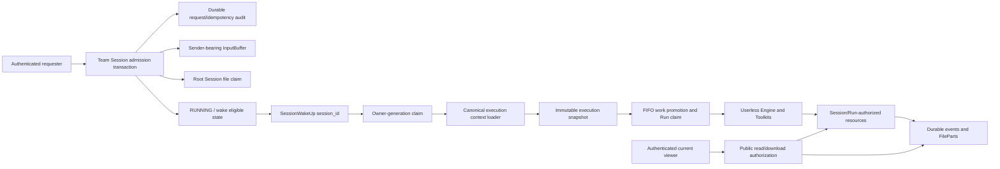

# Team Session Execution Boundaries Design

- Requirements: [session-260724/REQ](../requirements/session-260724-team-session-execution-boundaries.md)
- ADR: [session-260724/ADR](../adr/session-260724-team-session-execution-boundaries.md)
- Document reference: `session-260724/DESIGN`

## 1. Scope

This Design defines how the currently implemented AgentSession product becomes a Team Session
execution model with no ambient User identity. It applies the complete `session-260724/REQ` snapshot
and `session-260724/ADR-D1` through `session-260724/ADR-D7`.

The change preserves authenticated user-facing access, per-input Human sender provenance, External
Channel principal provenance, Session tree and Run authority, Team-scoped Toolkit credentials,
Agent Memory, file retention, recovery, and subagent behavior. It does not implement User Session
persistence, routing, visibility, or UX.

The supporting
[Team Session User Dependency Audit](./session-user-dependency-audit-2026-07-24.md) is the current-code
evidence inventory. This Design converts those findings into implementable boundaries.

## 2. Executive Summary

A user-facing request and an internal execution are separate operations:

1. A public boundary authenticates the current requester and authorizes access to the target Team
   Session.
2. One admission transaction stores durable work, Human sender provenance when applicable, claimed
   input resources, idempotency state, and wake-up eligibility.
3. A post-commit `SessionWakeUp(session_id)` only signals that durable work may exist.
4. The Worker claims Session ownership, loads one canonical execution snapshot from Postgres, and
   executes through Session, Run, tree, and resource authority without a User.
5. Internal resources are created and resolved through validated workload lineage. Public view,
   download, delete, and control operations authorize their current requester independently.

The application removes `user_id` from generic Engine, Run, Toolkit, Tool, Worker, broker, recovery,
continuation, and subagent contexts. A Human User ID appears in Team Session runtime data only where
it describes the sender of one admitted Human input or the requester audit for one public control
operation.

## 3. Current Behavior and Requirement Gaps

| Requirement | Current behavior | Gap to close |
| --- | --- | --- |
| `session-260724/REQ-1` | Most public chat routes authorize the requester before calling services. Exchange download and delete check current Workspace access. | Authorization and admission are often separate transactions. The TurnAction path does not enforce the same service-level membership check. A membership change can occur between route validation and durable side effects. |
| `session-260724/REQ-2` | `SessionWakeUp`, `InvokeInput`, `RunContext`, `ToolkitContext`, `ResolveContext`, `TurnContext`, built-in Tool factories, Toolkit instances, subagents, recovery, and file services carry or derive a User. | One Run can process inputs from different Users, while recovery and External Channel work have none. The borrowed User changes behavior and capability availability. |
| `session-260724/REQ-3` | Human `InputBuffer.actor_user_id` exists only until promotion. `UserMessagePayload` and `ActionMessagePayload` do not retain it. Agent and External Channel payloads already have type-specific source identity. | Human sender provenance is lost when the buffer is deleted. The generic `actor` name also invites authorization and execution use. |
| `session-260724/REQ-4` | Broker wake-ups carry Agent, User, Workspace, interface, handle, and prompt fields. RunExecutor mixes those values with independent database reads. | A broker producer supplies execution facts, and different subsystems can observe different Session snapshots. |
| `session-260724/REQ-5` | Exchange input claim already binds source and preview rows to the root Session. ModelFile and Artifact tables already carry Session lineage. Internal services still require Workspace membership through a User. ExchangeFile requires `created_by_user_id`. | Accepted or generated resources cannot be promoted, imported, presented, or retained from a Userless path. |
| `session-260724/REQ-6` | Workspace Toolkit configs, attached Toolkits, toolkit OAuth, LLM integrations, Runtime files, and Agent Memory are shared. Session Toolkit keys and many Tool constructors still depend on the wake-up User. | Shared capabilities are recreated, disabled, or denied by invocation source. User Memory is mixed into the generic Memory Toolkit path. |
| `session-260724/REQ-7` | The current product has only Team-like AgentSessions. User-scope Memory exists, but no durable User Session association exists. | Generic nullable User fields are incorrectly acting as the future personalization hook. |
| `session-260724/REQ-8` | Provider output materialization is transactionally robust and deterministically retryable, but it requires a User to create Exchange output. MCP Artifact and `present_file` sinks are disabled or denied without a User. | Valid output can fail the Run or be retried solely because ambient User context is absent. |

## 4. Design Invariants

The implementation must maintain these invariants across every code path:

1. **Requester authorization is local to one user-facing operation.** It is never execution authority.
2. **Human sender provenance belongs to one input.** It is never a Run or Session User.
3. **Team Session execution has no User carrier.** Absence is represented by absence of the field, not
   `None`, an empty string, or a synthetic principal.
4. **Broker messages provide routing only.** Postgres provides execution facts and work authority.
5. **The owner-generation claim is the first execution fence.** Every mutable work claim revalidates
   that canonical Session boundary.
6. **Accepted resources survive sender changes.** Internal access follows Session and workload
   lineage; public access follows the current requester.
7. **Provenance never grants authority.** User, Agent, Run, Tool, provider, and system source metadata
   is descriptive.
8. **No runtime compatibility path remains after cutover.** Historical unavailable provenance is
   represented honestly and is not converted into an inferred User.

## 5. Proposed Architecture



### 5.1 Principal boundaries

The runtime recognizes five separate concepts:

| Concept | Source | Lifetime | Allowed use |
| --- | --- | --- | --- |
| Current requester/viewer | Authenticated public request or WebSocket | One operation/connection | Authorize public send, mutate, control, view, subscribe, upload, download, or delete. |
| Human message sender | Authenticated admission transaction | One durable Human input | Preserve sender provenance and project it to history/UI. |
| External provider principal | Verified External Channel records | One provider message/revision | Preserve provider source provenance. |
| Session workload authority | Active Session/tree, owner generation, InputBuffer/command/Run claims | One execution boundary | Execute models, Tools, recovery, continuation, subagents, and internal resource operations. |
| Future associated User | Future root User Session association | Session lifetime | Construct only explicitly User-owned capabilities. Not implemented in this snapshot. |

No conversion exists between these concepts.

## 6. Public Authorization and Admission

### 6.1 Transactional admission service

All Human composer writes use one Team Session admission service. Public route validation may still
produce early `404`, `403`, or `409` responses, but the service repeats authoritative validation
inside the transaction that creates durable side effects.

The transaction performs the following ordered work:

1. Lock the target `AgentSession`.
2. Validate active Session status, root/read-write eligibility, Agent identity and lifecycle,
   Workspace identity, and root `SessionAgent` lineage.
3. Validate the current requester through `WorkspaceUserRepository` against the locked Session's
   canonical Workspace.
4. Resolve or create the durable `ChatWriteRequest` idempotency record.
5. Create the Human InputBuffer with `sender_user_id`.
6. Claim every referenced Exchange source and preview row to the resolved root Session.
7. Apply write-specific durable changes such as message edit reversion, action admission, or pending
   command state.
8. Mark the Session `RUNNING` or otherwise execution-eligible.
9. Commit all effects together.

A failure at any step rolls back the request audit, InputBuffer, file claim, transcript mutation, and
run-state transition.

### 6.2 Durable idempotency

`chat_write_requests` becomes the durable idempotency source for normal messages and TurnActions in
addition to edit, command, and failed-run retry operations. New `ChatWriteRequestType` values cover
at least `message` and `action`.

The record stores the authenticated requester as `requester_user_id`, client request ID, write type,
accepted target ID, history-reload requirement, and a canonical request payload. The canonical
payload contains only admission-relevant stable values: normalized message text, action, inference
request, ordered attachment URIs, client-supplied metadata, and authenticated sender identity.
Server timestamps and other retry-varying values are excluded.

For a normal message or TurnAction, the accepted target ID is the stable InputBuffer ID. Promotion
continues to derive durable event `external_id` values from that ID, and operation actions continue
to retain it on `ActionExecution`. The retry resolver therefore follows this durable source
identity:

- when the InputBuffer still exists, return the accepted buffered projection;
- when it has been promoted, resolve the deterministic event or ActionExecution identity and require
  a history reload as appropriate; and
- when committed work is temporarily between projections, return the accepted request identity and
  a reload/retry indication rather than creating another buffer.

Promotion does not need to keep a deleted InputBuffer row solely for idempotency. The durable request
record plus deterministic promotion identities form the post-promotion lookup path.

A repeated `(session_id, requester_user_id, client_request_id)`:

- returns the original accepted result when write type and canonical payload match;
- never recreates a promoted/deleted InputBuffer;
- fails as conflict when write type or payload differs; and
- still reauthorizes the current retrying requester before revealing the accepted result.

The InputBuffer idempotency index remains useful for internal producer identities and concurrent
insert serialization, but it is not the only durable Human request record.

### 6.3 Public control audit

`RDBChatWriteRequest.user_id`, pending-command `user_id`, `stop_requested_by`, and similar fields
remain public-operation audit data. They are renamed to explicit requester-oriented names such as
`requester_user_id` or `stop_requester_user_id` instead of retaining `actor` or an unqualified
`user`.

A pending command that does not create an input message has requester audit, not message sender
metadata. If a command or action creates a durable Human-authored event, that event separately stores
`sender_user_id`.

### 6.4 Post-commit notification

The producer sends `SessionWakeUp(session_id)` only after the admission transaction commits. A broker
failure is a delivery delay, not an admission rollback. The accepted request remains queryable by its
idempotency record, and retry/recovery may send another wake-up without duplicating the work.

The exact HTTP response implementation may return the accepted snapshot while recording a delayed
notification, or use a retryable transport response that resolves to the same accepted record. It
must not delete or recreate the committed input.

## 7. Durable Input and Sender Model

### 7.1 InputBuffer

`input_buffers.actor_user_id` is renamed to `sender_user_id` in a new forward migration and in every
repository/service/domain type.

- `USER_MESSAGE` and Human `ACTION_MESSAGE` buffers require non-null `sender_user_id`.
- Agent, External Channel, continuation, recovery, and system buffers keep it null.
- Producers do not populate it from a parent Run, latest Human message, root owner, or fallback.

The schema uses explicit constraints for buffer kinds whose source is unambiguously Human. Any
buffer kind with mixed source semantics must be split or validated by its closed producer before a
non-null constraint is added; it must not retain an ambiguous generic actor field.

### 7.2 Durable event payloads

`UserMessagePayload` and `ActionMessagePayload` gain `sender_user_id: str | None`.

- New Human events always write a non-null value.
- Pre-cutover historical events whose sender is unavailable write explicit null during migration.
- The field is copied directly from the claimed InputBuffer during promotion.
- `input_buffer_to_live_event` includes the same sender so optimistic/live and reloaded projections
  do not disagree.
- Read projections may join the current Workspace member profile for a display name, but the durable
  source remains the User ID stored in the event payload.

Agent and External Channel events retain their existing concrete source fields. They do not receive
`sender_user_id`.

### 7.3 Operation TurnActions

An operation action can delete its source InputBuffer before external execution completes.
`ActionExecution` therefore captures the Human `sender_user_id` when it is created. Terminal action
history copies the same sender into any durable `ActionMessagePayload` or action-history projection.
The sender does not participate in owner-generation validation or side-effect admission.

### 7.4 Historical sender migration

The migration derives a sender only from an authoritative durable relation. Potential evidence may
include an existing request audit row that deterministically identifies the promoted buffer/event.
The migration never uses attachment uploader, Agent creator, Workspace owner, current member, current
viewer, or temporal proximity.

All remaining pre-cutover Human events receive explicit null sender provenance. New writes are
validated before append so that null cannot be introduced after cutover.

## 8. Broker and Canonical Execution Loading

### 8.1 Pure broker contracts

The broker types become:

```text
SessionWakeUp(session_id)
SessionStopSignal(session_id)
```

The following fields are removed from broker encoding, decoding, producers, testenv injection, and
Worker handling:

- `agent_id`
- `user_id`
- `workspace_id`
- `workspace_handle`
- `interface`
- `additional_system_prompt`

Redis routing, sticky ownership, owner heartbeat, per-session queues, direct streams, and global
streams continue to use only `session_id`.

A stop signal is an immediate process notification only. Durable stop intent retains its requester
audit in Postgres and is the source used during recovery.

### 8.2 Canonical execution snapshot

A new canonical loader runs after `claim_owner_generation(session_id)` and before RunExecutor resolves
models, Toolkits, commands, inputs, or resources.

A representative immutable contract is:

```text
SessionExecutionSnapshot
├── session
├── agent
├── workspace
├── current_session_agent
├── root_session_agent
├── session_agent_context
├── owner_generation
├── execution_mode: root | subagent
├── workspace_handle
└── work_expectation
    ├── FIFO InputBuffer head identity, if present
    ├── pending command identity, if present
    ├── recoverable AgentRun identity, if present
    └── pending idle-continuation identity, if present
```

The exact class may compose domain-specific loader results rather than becoming one large repository.
The Worker receives one validated snapshot and does not accept identity overrides from a broker
message.

The loader verifies:

- the Session exists, is active, and matches the claimed owner generation;
- the Agent exists and is active;
- Session, Agent, and Workspace relationships agree;
- exactly one current `SessionAgent` and valid root lineage exist;
- the root `SessionAgentContext` belongs to that tree;
- subagent parent/tree relationships are valid;
- pending commands, InputBuffers, AgentRuns, and idle-continuation pointers belong to the Session;
- archived, decommissioned, stale-generation, and cross-Workspace state fails closed.

The snapshot records expected identities. Mutable processors still lock and revalidate the exact
InputBuffer, Run, command, action execution, or resource row in their own transaction before commit.

### 8.3 RunExecutor boundary

RunExecutor accepts `SessionExecutionSnapshot` rather than a rich `SessionWakeUp`. Agent lookup,
Workspace lookup, workspace-handle resolution, root-tree validation, and initial work selection move
behind the canonical loader.

Request-specific inference profile, input metadata, External Channel source, and Tool/Skill action
come from the claimed InputBuffer or other durable work row. Agent prompt and stable configuration
come from Agent/Session durable state. No transient additional system prompt path remains.

## 9. Engine, Toolkit, and Capability Contexts

### 9.1 Generic context cleanup

The following fields are removed:

| Type | Removed fields |
| --- | --- |
| `InputMessage` | `user_id` |
| `InvokeInput` | `user_id` |
| `RunContext` | `user_id` |
| `ToolkitContext` | `user_id`, `session_type`, unused `interface_type`, unused `interface_channel_id` |
| `ResolveContext` | `user_id` |
| `TurnContext` | `user_id` |

`SessionType.USER/SYSTEM` is removed from Team Session runtime classification. MCP and other Toolkit
behavior is determined by available Session/Run capability authority and stable Toolkit
configuration, not by whether a wake-up carried a User.

Workspace handle remains available to runtime Toolkit resolution when a Toolkit needs to construct a
settings URL, but it comes from the canonical Workspace row.

### 9.2 Session-managed Toolkit lifecycle

`SessionToolkitScope.prepare` no longer accepts a User. Registered Toolkit keys use stable source
identity and revision, for example Toolkit type plus `toolkit_config_id`. They do not include
`:actor:{user-or-system}`.

Dynamic built-in Toolkits remain keyed by their stable role within the Session runner. Source revision
continues to replace an instance when the attached Toolkit configuration changes.

Different Human senders, External Channel wake-ups, recovery, and continuation therefore reconcile
to the same Session-managed Team Toolkit instances.

### 9.3 Team capability projection

Team Session Toolkit preparation projects only:

- Workspace Toolkit configs and admitted shared credentials;
- Agent Toolkit attachments;
- Workspace LLM integrations;
- Runtime and Session file capabilities;
- Agent-scope Memory;
- Session, Goal, Todo, Skill, subagent, and system capabilities; and
- External Channel capabilities derived from durable binding/work state.

User-scope Memory tools and summaries are not registered in Team Sessions. Public Memory settings
APIs continue to support the current authenticated User's own User-scope Memory, but Team execution
never selects one.

No User capability resolver is implemented in this snapshot. A future User Session design will add a
separate resolver supplied only with the root Session's durable associated User.

### 9.4 Management paths remain requester-aware

Toolkit create/update/delete, connection setup, OAuth start/exchange, credential validation, Agent
settings, and Memory settings remain authenticated management operations. Their requester parameters
stay in management services and do not enter runtime `ResolveContext` or Toolkit instances unless the
capability is explicitly defined as User-owned in a future User Session.

## 10. Workload Authority by Execution Source

| Source | Admission authority | Durable source | Execution claim |
| --- | --- | --- | --- |
| Human message/action | Current Workspace membership and active Team Session inside admission transaction | ChatWriteRequest, sender-bearing InputBuffer, root file claim | Owner generation, FIFO buffer lock, AgentRun claim |
| Public command/stop/retry | Current requester authorization and durable request audit | Pending command, stop intent, failed Run state, ChatWriteRequest | Owner generation and matching command/Run/stop state |
| External Channel | Provider authenticity, connection, route, grant, binding, invocation batch, Session association | External Channel work/invocation records and reference-only InputBuffer | Owner generation, batch projection, Session binding lineage |
| Recovery/continuation | No public requester | Running Session, recoverable Run, idle-continuation pointer, pending InputBuffer | Owner generation and matching durable state |
| Subagent | Parent SessionAgent, parent Run, target tree node, durable mailbox/result lineage | Agent-message InputBuffer and SessionAgent/Run fields | Target owner generation and FIFO/Run claim |
| Scheduled/system operation | Scheduler lease and task-specific durable state | Scheduled task or Session lifecycle record | Session owner generation and task/work claim |

No row in this table uses a Human sender as execution authority.

## 11. Session-Owned Resource Design

### 11.1 Internal authority contract

Internal file services accept a validated workload contract instead of `user_id`. A representative
contract contains:

```text
SessionResourceAuthority
├── workspace_id
├── agent_id
├── session_id
├── root_session_id
├── run_id
├── run_index
└── owner_generation
```

Input promotion also supplies the claimed InputBuffer identity. Services revalidate the relevant
Session, root, Run, owner generation, and resource ownership in a short database transaction before
metadata commit or object download. The object is not a cryptographic bearer token and cannot bypass
repository checks.

Public methods remain separate, for example requester-authorized upload, download, and delete versus
execution-authorized create, resolve, import, and materialize. Internal code cannot call a public
method with an empty or borrowed User.

### 11.2 ExchangeFile ownership and provenance

Canonical ownership remains:

- `workspace_id`
- `agent_id`
- nullable `retention_root_session_id` before Human upload admission
- non-null root retention owner for accepted input and generated Session output

The schema replaces required `created_by_user_id` with typed source provenance. The exact migration
may use an `exchange_file_source_kind` enum and source-specific nullable columns with CHECK
constraints. Required source kinds cover:

- Human upload;
- Agent output;
- Tool output;
- provider output;
- system-derived output such as previews; and
- historical migration provenance.

Applicable typed fields include uploader User ID, creating Session ID, creating Run ID, Tool name,
call ID, output/part index, and derived source ExchangeFile ID. Source-specific constraints require
the fields that make that variant authoritative. Generated source and preview rows are root-bound at
creation.

The uploader/source User field is provenance only. Public download and delete authorize the current
requester through the file's canonical Workspace/Session visibility.

### 11.3 ModelFile

ModelFile retains Workspace, exact Session, Agent, Run index, storage identity, normalization, hash,
and lifecycle fields. The schema adds exact `created_run_id` lineage for new resources. Existing rows
are backfilled by `(session_id, created_run_index)` when a unique Run exists and otherwise retain
explicit migration-era unavailable Run provenance.

Input-promotion, Runtime `read_image`, provider output, and client-tool output supply the current
validated Run authority. Source-kind, input-buffer, call, and provider details remain bounded typed
metadata where they are descriptive rather than access-authorizing.

ModelFile creation and internal download no longer check Workspace membership through a User.
`ModelFileMaterializer` validates exact Session/Agent/Run ownership and current transcript references.

### 11.4 Artifact

Artifact already stores Workspace, Session, Agent, `created_run_id`, `created_run_index`, and optional
Tool-call provenance. Its persistence model remains.

`ArtifactService.create` and internal `artifact://` resolution accept Session workload authority.
`McpArtifactSink` is created whenever valid Session/Run authority exists, independent of User.

There is currently no public Artifact download route. A future public route must authenticate and
authorize its current requester separately; internal `import_file` is not reused as public
authorization.

### 11.5 FilePart and transcript references

A FilePart is not an owner. Before lower/materialization, the referenced ModelFile must match the
current event's Session and valid Run/model-input lineage. Recovery, continuation, and a different
Human sender use the same check.

The existing degradation behavior for deleted or unavailable ModelFiles and subagent context forks is
preserved.

### 11.6 Tool and provider paths

- `present_file` creates root-bound Exchange output with Session/Run/Tool provenance.
- `import_file` resolves Exchange and Artifact URIs through Session/root/Run authority.
- `read_image` creates ModelFile from current Run authority.
- MCP binary/text resources create Artifact output whenever Session/Run authority exists.
- provider and client generated images keep deterministic Run/call/output identities and their
  existing upload-compensation transaction, but no longer require a User.
- a valid provider file is admitted with the owning model/tool event and does not convert the result
  into an authentication failure.

External Channel file transfer remains its existing explicit provider-to-Runtime flow and does not
implicitly create ExchangeFile, Artifact, or ModelFile.

## 12. API and Projection Changes

### 12.1 Public chat models

History, live InputBuffer, and action projections add Human `sender_user_id` where applicable.
Generated OpenAPI clients are regenerated through repository generators only.

Frontend code may display the current Workspace profile name when available and a bounded
"sender unavailable" state for pre-cutover historical messages. It must not infer sender from the
current viewer or uploader.

No execution API accepts a client-provided sender User ID. The server derives sender from the
authenticated requester.

### 12.2 Broker/testenv contracts

Testenv broker injection accepts only `session_id` and creates a pure wake-up. Existing tests that
construct rich wake-ups are rewritten rather than supported through a deprecated decoder.

### 12.3 Internal service separation

Service method names and parameter types make the boundary explicit:

- requester-authorized public upload/download/delete/control methods;
- admission methods that require authenticated requester identity;
- execution-authorized internal create/resolve/materialize methods; and
- management methods for Toolkit and User-owned settings.

A generic optional `user_id` parameter is not retained as a compatibility switch.

## 13. Failure Handling and Concurrency

### 13.1 Admission failures

Unauthorized, inactive, archived, cross-Agent, cross-Workspace, invalid root, file conflict, expired
file, and idempotency mismatch failures occur before commit. No InputBuffer, claim, running state, or
wake-up is visible.

### 13.2 Broker failure

Post-commit broker failure leaves accepted work durable. Logging records the Session and request audit
identity without treating the sender as execution context. Idempotent retry and stale-running recovery
may re-notify the Session.

### 13.3 Snapshot and claim staleness

The canonical loader fails closed on owner-generation or identity mismatch. Input promotion, command
consumption, Run recovery, action execution, and resource access re-lock exact rows. A changed FIFO
head or Run state restarts preparation rather than using stale snapshot data.

### 13.4 Attachment preparation failure

Object download and ModelFile normalization occur outside the promotion transaction. Failure keeps
the InputBuffer and root Exchange claim. Any newly created uncommitted ModelFiles are marked for
cleanup. Promotion later revalidates the FIFO head and can retry safely.

### 13.5 Provider output failure

Object uploads are compensated only when no committed metadata protects them. Deterministic
Run/call/output identities preserve retry idempotency. Missing User context is never an error
category.

### 13.6 User membership changes

Membership loss before admission rejects the request. Membership loss after admission:

- does not alter stored sender provenance;
- does not revoke accepted resources or work;
- does not stop internal execution; and
- denies later public view/download/control attempts by that User.

### 13.7 Shutdown and recovery

Shutdown closes foreground admission and persists current recovery state as today. A takeover claims
a new owner generation, rebuilds the canonical snapshot, reuses pending buffers and Runs, and
recreates stable Team Toolkit instances without a User-qualified key.

## 14. Security Model

### 14.1 Public boundaries

All public Team Session routes continue to authenticate. Authorization is based on current Workspace,
Agent, Session, root-tree, and resource visibility, not identifiers or historical participation.

The implementation audits at least:

- messages and TurnActions;
- edit, command, retry, stop, title, archive, restore, and project mutations;
- history, live state, WebSocket subscription, Session context, and subagent tree reads;
- upload, Exchange list, download, and delete; and
- External Channel management and access decisions.

### 14.2 Internal boundaries

Internal execution validates Session state, owner generation, Run/work claim, tree lineage, resource
scope, and Toolkit source. Invalid or stale state fails before model or Tool execution.

### 14.3 Credential isolation

Workspace Toolkit credentials and LLM integrations remain shared admitted configuration. Legacy MCP
per-user OAuth and GitHub per-user PAT runtime paths are not restored. Future personal credentials
require a separate User-brought Tool design.

### 14.4 Provenance privacy and integrity

Sender and source IDs are exposed only in authorized Team Session projections. Provenance does not
change resource access. Historical unknown source stays unknown.

## 15. Migration and Coordinated Cutover

### 15.1 Migration artifacts

Create new Alembic revisions through `alembic revision` or `alembic revision --autogenerate`. Do not
modify executed migrations.

The migration set covers:

- InputBuffer sender column rename and constraints;
- ChatWriteRequest requester-column rename and enum expansion for message/action writes;
- Human event JSON payload sender backfill;
- ActionExecution sender preservation where required;
- pending-command requester-audit naming;
- ExchangeFile source enum/columns/checks and `created_by_user_id` removal;
- ModelFile exact Run lineage;
- indexes and FK deletion behavior; and
- removal of any remaining live schema residue for already-removed personal credential models, if
  repository verification finds such residue.

### 15.2 Data backfill

Backfill rules are deterministic and fail closed:

- pending Human buffer `actor_user_id` becomes `sender_user_id`;
- promoted Human events use only authoritative durable request linkage;
- unresolved pre-cutover Human event sender becomes explicit null;
- upload-origin Exchange rows preserve the uploader;
- generated Exchange rows use durable Session/Run/Tool/provider evidence when available;
- unresolved generated source becomes migration provenance;
- ModelFile Run ID is joined from exact Session and Run index when unique; and
- no migration selects a User from Agent creator, Workspace owner, current member, viewer, approver,
  or attachment relationship.

Migration tests use representative pre-migration rows, including pending buffers, promoted events,
root/subagent resources, provider output, previews, active Runs, and historical ambiguous rows.

### 15.3 Operational sequence

1. Announce and enter a write maintenance window.
2. Pause public and External Channel admission.
3. Drain Workers and scheduler to durable recovery boundaries.
4. Take and verify a database backup.
5. Stop old API/Worker processes that can write old contracts.
6. Apply forward migrations.
7. Deploy only the new API, Worker, scheduler, and generated client-compatible Web application.
8. Discard old Redis broker message payloads and ownership state.
9. Scan Postgres for pending InputBuffers, pending commands, running Sessions, recoverable Runs,
   pending idle continuations, and durable stop intent.
10. Re-enqueue pure wake-ups and resume ordinary ownership recovery.
11. Re-enable External Channel and public admission after health and invariant checks pass.

No old/new mixed Worker population is supported.

### 15.4 Rollback

Rollback after migration restores the pre-cutover database backup and previous application images,
then reconstructs broker routing from restored durable state. The old application is not run against
newly written sender/provenance data.

The operator records migration start/end, row counts by backfill classification, unresolved
historical provenance counts, replay counts, recovery failures, and final health evidence.

## 16. Observability

Structured logs use boundary-specific names:

- `requester_user_id` only for public admission/control/read logs;
- `sender_user_id` only for input provenance and promotion logs;
- `session_id`, `root_session_id`, `session_agent_id`, `agent_id`, `workspace_id`, `run_id`, and
  `owner_generation` for execution;
- resource `source_kind`, Tool/call identity, and storage entity ID for resource operations.

No `execution_user_id` field exists. Logging and existing logging-based Sentry delivery are used;
runtime code does not call the Sentry SDK directly.

Metrics avoid high-cardinality identity labels and cover:

- admission authorize/commit/rollback outcomes;
- idempotency hit/conflict;
- broker post-commit notification failure;
- stale-running recovery delay;
- canonical loader rejection category;
- FIFO snapshot restart;
- internal resource authority rejection;
- provider/resource compensation;
- historical sender/source migration classification; and
- cutover replay success/failure.

## 17. Implementation Sequence

The following are logical implementation phases. No partially migrated runtime is deployable.
Preparatory refactors may land separately only when they preserve current behavior and schema.
Behavior-changing phases are released together under `session-260724/ADR-D7`.

### Phase 1. Durable admission and provenance

- Extend ChatWriteRequest to normal messages and TurnActions.
- Move requester reauthorization into the admission transaction.
- Rename InputBuffer sender field and propagate it into live/durable payloads and ActionExecution.
- Add sender-aware projections and generated clients.
- Add idempotency conflict and post-promotion retry tests.

### Phase 2. Pure signals and canonical execution snapshot

- Reduce wake-up and stop contracts to Session routing identity.
- Add the canonical loader and immutable execution snapshot.
- Change SessionRunner and RunExecutor to consume the snapshot.
- Remove broker-supplied Agent, Workspace, interface, handle, prompt, and User values.

### Phase 3. Userless Engine and Team capability projection

- Remove User fields from generic input, Run, Toolkit, resolve, and turn contexts.
- Remove User-qualified Session Toolkit keys and `SessionType` inference.
- Separate Agent Memory from unavailable User capability projection.
- Remove subagent User propagation and fallback buffer actors.
- Update shared Toolkit and built-in Tool factories.

### Phase 4. Session-owned resources and output

- Add Exchange source provenance and internal Session authority methods.
- Add ModelFile Run lineage and Userless materialization.
- Convert Artifact, `import_file`, `present_file`, `read_image`, MCP output, and provider output.
- Preserve public requester-authorized Exchange operations.
- Verify archive purge and periodic cleanup with the new provenance columns.

### Phase 5. Migration, replay, specs, and cutover verification

- Generate and test forward migrations.
- Add cutover replay tooling or an idempotent operator command that derives work only from Postgres.
- Complete E2E coverage and negative authorization matrices.
- Update living specs.
- Execute the coordinated cutover and capture evidence.

## Test Strategy

### 18.1 E2E primary verification matrix

| Scenario | Primary assertion | Required lane |
| --- | --- | --- |
| Two Workspace members send to one Team Session | Each history/live message retains its own `sender_user_id`; the same Team capabilities and Session state are used. | Deterministic API/WS E2E |
| Unauthorized member or removed member writes | Message, TurnAction, command, retry, stop, upload claim, view, subscription, and download fail before durable side effects. | Deterministic API E2E |
| Sender removed after attachment admission | Accepted buffer and claimed attachment still promote; another current member can view/download; removed sender cannot. | Deterministic API/Worker E2E |
| Worker restart between admission and promotion | Recovery processes the same buffer and FilePart without original sender context or duplication. | Focused Runtime Provider or deterministic container restart E2E |
| Different member continues a file-bearing Session | Existing transcript FilePart remains model-visible and does not require the first sender. | Deterministic AIMock file E2E |
| External Channel invocation | Verified provider principal executes through the same Team Toolkit/resource path with no Azents User. | Deterministic Slack fake E2E |
| Subagent and terminal result | Spawn, mailbox delivery, recovery, and result projection work with source SessionAgent/Run lineage and no User. | Deterministic E2E |
| Agent Memory versus User Memory | Agent-scope Memory remains available; User-scope Memory is not exposed in Team execution. | Deterministic AIMock Tool E2E |
| `present_file`, MCP Artifact, `read_image` | Generated outputs succeed under Session/Run authority and remain importable after recovery. | Deterministic Runtime Provider E2E |
| Provider/client generated image | Valid response creates Exchange and ModelFile output without User; retry identity remains idempotent. | Existing deterministic OpenAI/xAI proxy E2E |
| Public resource access | Current member can download; non-member cannot; stored creator/source does not grant access. | Deterministic API E2E |
| Broker notification failure | Input remains accepted and an idempotent retry/recovery executes it once. | Deterministic broker-failure E2E or focused integration when broker fault injection is unavailable |
| Coordinated migration fixture | Pre-cutover pending work and resources upgrade, replay, and execute under new contracts. | Migration integration plus cutover smoke E2E |

### 18.2 E2E plan

Use `testenv/azents/e2e/` pytest journeys and public APIs. Extend existing file upload, file resource
lifecycle, provider image generation, execution persistence, and External Channel suites rather than
creating isolated test-only behavior.

A new reusable Team Session fixture creates two Users, one Workspace membership relationship, one
Agent, and one shared root Session through public APIs. Membership removal also uses public/admin
product APIs. Product scenario tests do not write database rows directly.

Worker restart and broker failure scenarios require bounded testenv controls that stop/restart the
Worker or fail one notification after the admission commit. These controls expose no direct product
data mutation and return safe evidence only.

### 18.3 Fixture and seed requirements

Required deterministic fixtures:

- AIMock response sequences capable of identifying message order and invoking Memory/file/subagent
  Tools;
- local object storage with image and non-image upload bodies;
- Slack provider fake and existing External Channel connection/grant setup;
- local Runtime Provider for `present_file`, `read_image`, MCP output, and Worker restart scenarios;
- two public Users with managed Workspace membership; and
- a pre-migration SQL fixture used only by migration integration tests, not by product E2E scenarios.

### 18.4 Credential and prerequisite policy

The primary matrix uses local AIMock, local object storage, Slack fake, and locally enrolled Docker
Runtime Provider. It requires no external credentials and belongs in required CI.

Existing live-provider workflows may add observational coverage, but live credentials are not needed
to prove this feature. Optional live tests follow the repository prerequisite snapshot policy: a
maintainer-requested live run fails when required credentials are unavailable; optional/nightly runs
report prerequisite-not-ready as skip rather than a fake pass.

### 18.5 Unit and integration coverage

Required lower-level coverage includes:

- schema migration upgrade tests and row-classification counts;
- admission transaction rollback and concurrent idempotency tests;
- payload mismatch and post-promotion retry tests;
- sender propagation through UserMessage, ActionMessage, ActionExecution, live, history, and fork
  projections;
- canonical loader cross-Session, cross-Workspace, inactive, archived, stale-generation, and broken
  tree negative matrices;
- pure broker encoding/decoding and old-payload rejection;
- Session Toolkit lifecycle stability across different sender and recovery paths;
- Agent-only Memory resolution in Team Sessions;
- internal versus public resource authorization matrices;
- Exchange source CHECK constraints and migration provenance;
- ModelFile/Artifact/Exchange recovery, compensation, GC, and archived-root purge; and
- provider output admission without User and deterministic retry collision checks.

### 18.6 Evidence format and CI policy

PR evidence records:

- exact pytest targets and results for deterministic, Runtime Provider, and Web Surface lanes;
- migration upgrade/downgrade or documented forward-only restore evidence as applicable;
- row-count classification from migration fixtures;
- generated OpenAPI/client diff verification;
- screenshots only when sender presentation changes visibly; and
- a cutover dry-run report with replay and recovery counts.

Deterministic feature E2E must run in the required `ci-python-e2e` aggregate. Optional/live failures
follow the existing `live_external` policy. Tests do not skip for a missing deterministic local
fixture; fixture readiness failures fail the required lane.

## 19. Living Spec Updates

Implementation updates these current-behavior specs with new `last_verified_at` and incremented
`spec_version`:

- `docs/azents/spec/domain/conversation.md`
  - Team Session identity, sender-bearing events, admission transaction, canonical execution
    snapshot, and pure broker signals.
- `docs/azents/spec/flow/agent-execution-loop.md`
  - Userless Run/Toolkit contexts, canonical loader, owner-generation boundary, sender promotion, and
    provider output authority.
- `docs/azents/spec/flow/run-resume.md`
  - pure wake-up routing, Postgres replay, and Userless recovery/toolkit lifecycle.
- `docs/azents/spec/flow/file-exchange-storage.md`
  - internal Session resource authority, Exchange provenance, ModelFile Run lineage, Artifact and
    import/present behavior, public read separation, and purge implications.
- `docs/azents/spec/domain/toolkit.md`
  - stable Team Toolkit keys, runtime ResolveContext, MCP Artifact sink, and management/runtime User
    separation.
- `docs/azents/spec/domain/memory.md`
  - Team Session Agent-only Memory projection and future User capability boundary.
- `docs/azents/spec/domain/external-channel.md`
- `docs/azents/spec/flow/external-channel-authorization.md`
  - provider provenance and execution through pure Session workload authority.
- `docs/azents/spec/flow/periodic-execution.md`
  - resource cleanup and recovery scans if schema/query behavior changes.

## 20. Traceability Matrix

| Requirement | ADR decisions | Design mechanisms | Primary verification |
| --- | --- | --- | --- |
| `session-260724/REQ-1` | D5, D6 | Transactional requester reauthorization, durable ChatWriteRequest, separate public resource APIs | Unauthorized matrix, membership loss, no-side-effect assertions |
| `session-260724/REQ-2` | D1, D2, D4, D7 | Pure signals, canonical snapshot, removal of User fields and SessionType inference, stable Toolkit keys | Context/type tests, recovery, multi-sender E2E |
| `session-260724/REQ-3` | D3, D5, D7 | `sender_user_id` on buffers/events/actions, Agent/External concrete payloads, historical null policy | Multi-member history/live, promotion/reload/recovery tests |
| `session-260724/REQ-4` | D4, D5, D7 | Owner-generation fence, canonical loader, exact work reclaims, Postgres replay | Loader negative matrix, broker spoof/removal tests, takeover E2E |
| `session-260724/REQ-5` | D5, D6, D7 | Root claims, SessionResourceAuthority, typed Exchange provenance, ModelFile Run lineage, separate public reads | Attachment-after-removal, internal/public resource matrix, purge tests |
| `session-260724/REQ-6` | D2, D6 | Team capability projection, Agent Memory only, shared Toolkit credential resolution, no actor key | Toolkit lifecycle, Memory, Runtime and provider output E2E |
| `session-260724/REQ-7` | D1, D2, D3 | No current User Session schema; no generic User hook; documented future root association boundary | Schema/type assertions and Team behavior regression |
| `session-260724/REQ-8` | D5, D6, D7 | Userless Artifact/ModelFile/Exchange/provider paths, deterministic compensation and retry | present/import/read/MCP/provider output and retry E2E |

## 21. Feasibility Assessment

| Item | Result | Repository evidence and condition |
| --- | --- | --- |
| `REQ-1` | Feasible | Current public authentication, WorkspaceUser repositories, Session locks, and caller-owned DB transactions already exist. The work is consolidation and service-level revalidation. |
| `REQ-2` | Feasible | User carriers are explicit and enumerable. Recovery already sends `None`, proving that durable execution facts exist independently. Removal is broad but centralized around broker, executor, resolve, and Tool factories. |
| `REQ-3` | Feasible | InputBuffer already stores the authenticated Human ID and event payloads are JSONB/Pydantic variants. Promotion is the correct copy boundary. Historical exact sender is conditionally unavailable and is resolved by D7's explicit null policy. |
| `REQ-4` | Feasible | Owner generation, active Session state, SessionAgent tree/context, FIFO buffer lock, pending command, AgentRun recovery, and action owner generation already exist. No new generic work table is required. |
| `REQ-5` | Feasible | Exchange root retention claims, exact Session ModelFiles, exact Run Artifacts, output compensation, and archived-root purge already exist. Exchange creator schema and internal service authorization require migration/refactor. |
| `REQ-6` | Feasible | Workspace Toolkit configs, toolkit OAuth, LLM integrations, Runtime files, and Agent Memory already have shared canonical sources. Session actor keys and generic context propagation are removable. |
| `REQ-7` | Feasible | The snapshot deliberately adds no User Session storage. Removing ambient User fields prevents encoding the wrong ownership model and does not block a future root association. |
| `REQ-8` | Feasible | Provider output already persists Exchange and ModelFile metadata with deterministic identity in the owning event transaction. Artifact and Tool output tables already contain Session/Run lineage. Removing User checks preserves the existing compensation model. |
| Coordinated cutover | Conditional but not blocked | Requires an operational maintenance window, verified backup/restore, Worker drain, generated migration, and Postgres-derived replay command. No repository evidence requires mixed-version runtime compatibility. |
| E2E verification | Feasible | Existing deterministic suites cover uploads, file lifecycle, provider images, execution persistence, External Channel, and local Runtime Provider. A two-member fixture and bounded Worker/broker fault controls must be added. |

No unresolved requirement or design blocker remains. The cutover operational procedure and historical
provenance classification are non-trivial but have explicit implementation and verification paths.

## 22. Alternatives and Non-Blocking Risks

Rejected architecture alternatives are recorded in `session-260724/ADR`. Remaining implementation
risks are:

- the User carrier removal touches many tests and Tool constructors, so type-driven incremental
  cleanup is required;
- historical Human sender and generated-file source may be unavailable for some rows and must be
  counted rather than guessed;
- the final deploy requires coordinated API/Worker downtime and restore rehearsal;
- canonical loader scope must remain composed from domain resolvers instead of becoming an
  unmaintainable repository facade;
- public sender display may require a graceful profile-missing state when the User no longer belongs
  to the Workspace; and
- cutover replay must be idempotent and bounded for large running-session populations.

These risks do not change the approved Requirements or ADR decisions.
