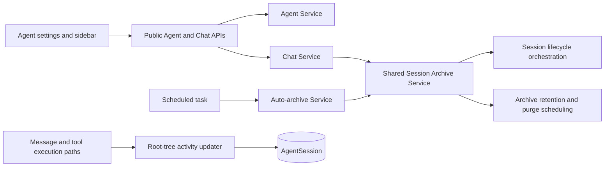

# Session Auto-Archive Design

- Requirements: [`session-260726/REQ`](../requirements/session-260726-auto-archive.md)
- ADR: [`session-260726/ADR`](../adr/session-260726-auto-archive.md)
- Document reference: `session-260726/DESIGN`

## Current Behavior and Gaps

Manual archive is exposed through Chat service and operates on an active,
non-primary root Session tree. It locks the tree, rejects running work, invokes
lifecycle participants, snapshots archived-session retention, schedules purge,
and performs post-commit cleanup. The web sidebar lists active and archived
Sessions and already has a session overflow menu, but it has neither pin state
nor automatic archive behavior.

There is no Agent-level inactivity setting, no explicit activity timestamp
covering user/Agent/tool activity, and no scheduler task that archives eligible
Sessions.

## Proposed Boundaries

### Persistence

The migration adds:

| Table | Field | Purpose |
| --- | --- | --- |
| `agents` | `auto_archive_ttl_days INTEGER NOT NULL DEFAULT 30` | Per-Agent positive inactivity period |
| `agent_sessions` | `pinned BOOLEAN NOT NULL DEFAULT false` | User preservation state for visible root Sessions |
| `agent_sessions` | `last_activity_at TIMESTAMPTZ NOT NULL` | Canonical qualifying activity time |

The migration backfills `last_activity_at` from the best existing historical
activity-related timestamp, then adds an index supporting active root,
non-pinned due-session scans. Application validation rejects TTL values below
one day.

`pinned` is stored on all rows for schema simplicity but API mutation and
automatic eligibility only permit/use active root Sessions. The API does not
expose a user-managed activity timestamp.

### Activity Recording

Introduce one repository operation that advances the affected Session's
`last_activity_at` monotonically. It updates that local Session only when the
new activity time is later and preserves status and other lifecycle fields.

Call it at the durable boundaries that record:

- admitted user messages;
- persisted Agent messages;
- persisted tool execution activity.

Pin, title, archive/restore, run heartbeat, and other operational mutations do
not update the activity clock. The scheduler calculates a root tree's effective
activity under its archive lock as the maximum `last_activity_at` among the root
and descendants; it therefore protects descendant work without child-to-root
writes or lock-order inversion.

### Shared Archive Transition

Extract the state-changing section of manual archive into a dedicated service
that accepts an already-authorized root session and an archive reason/source.
It owns:

1. loading and locking the root tree;
2. validating active/non-primary/non-running eligibility;
3. invoking lifecycle archive participants;
4. applying `archive_tree`;
5. locking retention settings, taking the retention snapshot, and scheduling
   purge;
6. committing the transaction; and
7. running the existing post-commit Git-worktree and external-channel cleanup.

Chat service continues to check caller authorization and delegates to this
service. Auto-archive supplies system ownership, adds pin and TTL-cutoff
rechecks, then invokes the same transition. This preserves all manual archive
effects without a separate automatic state transition.

### Automatic Archive Scheduler

Register a scheduler task with a bounded-backoff retry policy. Its service:

1. reads a fixed-size batch of active root Sessions joined to their Agent;
2. excludes primary, pinned, and running candidates;
3. selects records whose canonical activity timestamp is at or before
   `now - auto_archive_ttl_days`;
4. passes each identity and observed cutoff to the shared archive service; and
5. records counts for scanned, archived, skipped, and failed candidates.

The transaction-time archive check reloads the root tree under lock and repeats
all eligibility checks. A candidate that received new activity, was pinned,
became running, became primary, or was manually archived is skipped without
error. Unexpected failures fail the scheduled attempt so the existing retry
policy provides visibility and retry.

### Public API

Extend public API schemas and generated clients:

| Contract | Change |
| --- | --- |
| `AgentResponse` | Add `auto_archive_ttl_days` |
| Agent create/update | Accept positive `auto_archive_ttl_days`; create may omit it to use 30 |
| `AgentSessionResponse` and list items | Add `pinned` |
| Chat session action API | Add active-root `pin`/`unpin` action or a boolean update operation with normal session authorization |

Manual archive accepts pinned Sessions unchanged. Archived Sessions are not
pin-editable in this feature.

### Web Experience

The existing Agent settings form includes a labeled numeric day input for the
Agent's auto-archive TTL. It displays the effective 30-day default and saves
through the existing Agent update mutation.

The active-session sidebar:

- renders a pin icon next to a pinned Session title;
- provides Pin or Unpin in the existing overflow menu;
- disables neither manual archive nor rename because of pin state; and
- invalidates the active session list after a successful pin mutation.

The session list's existing polling picks up scheduler-driven archive changes;
the archived-session query is also invalidated by manual archive behavior as
today.

## State and Failure Handling

| Condition | Result |
| --- | --- |
| TTL elapsed and Session eligible | Shared archive transition completes |
| Session pinned before lock | Skip; remains active |
| New qualifying activity before lock | Skip; remains active |
| Root tree running or has active run | Skip; remains active |
| Primary Session | Skip; remains active |
| Concurrent manual/automatic archive | One lock holder archives; the other observes non-active state and skips |
| Post-commit cleanup failure | Preserve existing manual archive behavior: archive remains committed and failure is logged/handled by existing cleanup path |
| Scheduler failure | Existing scheduled-task retry policy retries the bounded batch |

## Security and Permissions

The settings update uses existing Agent-admin authorization. Pin/Unpin uses the
same Workspace membership and active-root Session authorization as title/archive
actions. The scheduler has no user identity and cannot bypass lifecycle
eligibility; it only invokes the system-owned shared archive transition after
the locked recheck.

## Migration, Rollout, and Rollback

Deploy the database migration before application code. Defaults and backfills
make current Agents use 30 days and current Sessions unpinned. The scheduler is
registered enabled by default after the application code is present.

Rollback disables/removes the task before rolling back the application. New
columns are additive and can remain safely until a later schema cleanup; no
archive data rollback is attempted.

## Observability

The auto-archive scheduled-task summary reports scanned, eligible, archived,
skipped, and failed counts. Structured logs for unexpected candidate failures
include root session and Agent identifiers. Existing archive cleanup logs remain
the source of cleanup outcome observability.

## Test Strategy

### E2E Primary Verification Matrix

| Requirement | Primary verification |
| --- | --- |
| `REQ-1` | Agent settings shows/saves TTL and a reload preserves the value |
| `REQ-2` | Controlled scheduler run archives only an inactive eligible Session; user, Agent, and tool activity postpone eligibility |
| `REQ-3` | Automatically archived Session appears in archived list and has the same lifecycle-visible behavior as manual archive |
| `REQ-4` | Sidebar Pin/Unpin menu updates icon and persists after reload |
| `REQ-5` | Pinned stale Session survives a scheduler run; unpinning makes it eligible |

### E2E Plan

Add deterministic E2E coverage using a short test TTL or controlled activity
timestamps and an explicit scheduler-task trigger. The test creates root
Sessions through public flows, pins through the web UI, triggers the task, and
asserts active/archived list state through the UI and public API.

### Testenv and Fixtures

Testenv support is required only if the existing scheduler trigger cannot
deterministically invoke one task run. Fixtures need an Agent with a configurable
TTL and Sessions with controlled activity records. No live credentials are
required.

### Evidence and CI Policy

Backend repository/service/API tests cover migration defaults, activity
recording, scheduler races, and shared archive equivalence. Web unit/story tests
cover the Pin/Unpin states. E2E is the product-behavior gate; focused backend and
web quality checks run before PR creation. CI failure blocks completion; skipped
optional/live tests must be explicitly reported and cannot substitute for the
deterministic E2E path.

## Traceability

| Requirement | ADR | Design mechanism |
| --- | --- | --- |
| `session-260726/REQ-1` | ADR-D1, ADR-D5 | Agent TTL field, CRUD contract, settings input |
| `session-260726/REQ-2` | ADR-D2, ADR-D3 | Canonical root-tree activity clock and scheduled scan |
| `session-260726/REQ-3` | ADR-D4 | Shared archive transition service |
| `session-260726/REQ-4` | ADR-D1, ADR-D5 | Root pin field, API action, sidebar menu/icon |
| `session-260726/REQ-5` | ADR-D1, ADR-D3 | Pinned candidate exclusion and locked recheck |

## Feasibility

| Requirement | Status | Evidence |
| --- | --- | --- |
| `REQ-1` | Feasible | Agent CRUD model/API and embedded settings form already support additive settings fields |
| `REQ-2` | Feasible | Scheduler registry and Session repository provide bounded task and indexed-query patterns; explicit activity field closes the current timestamp gap |
| `REQ-3` | Feasible | Manual archive is already centralized in Chat service and can be extracted behind a shared transition boundary |
| `REQ-4` | Feasible | Sidebar already has a per-session overflow menu and mutation-driven cache invalidation |
| `REQ-5` | Feasible | Root-tree lock and lifecycle eligibility checks provide a safe recheck point |

No blocking feasibility issue remains. The main implementation risk is ensuring
every durable message/tool path updates the root-tree activity clock; focused
tests must enumerate those paths.
