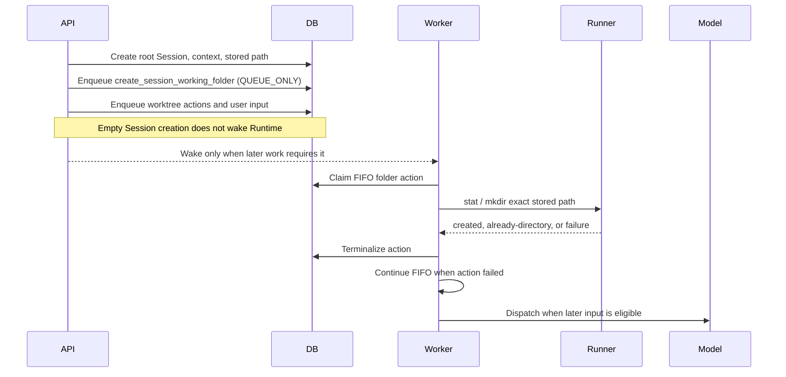

# Session Working Folder Design

- Snapshot: `session-260803`
- Requirements: [`session-260803/REQ`](../requirements/session-260803-session-working-folder.md)
- ADR: [`session-260803/ADR`](../adr/session-260803-session-working-folder.md)
- Design reference: `session-260803/DESIGN`

## Current Behavior and Requirement Gaps

One `SessionAgentContext` already owns the shared Project and Git-worktree context
for a root `SessionAgent` tree. Root Session creation writes the root
`AgentSession`, root `SessionAgent`, context, and initial Project rows in the
caller's database transaction without Runtime I/O. The context currently stores no
general filesystem allocation for ordinary Session work.

Runtime shell commands pass a nullable `workdir` to Runner. Runner defaults a null
value to the Agent Workspace root, and the Runtime prompt describes
`/workspace/agent` as the default durable working location. Registered Projects are
loaded separately and receive Project-scoped instructions.

Projects mode currently projects only `session_agent_context_projects`. Its
manifest already contains backend-owned source, filesystem-status, and capability
metadata, but a Session with no registered Projects has an empty Projects mode.
Agent Workspace mutation APIs protect only the Agent Workspace root.

Azents-created worktrees currently allocate paths below
`/workspace/agent/.azents/worktrees/{session_handle}`. Archive commits the complete
Session tree first and then runs one best-effort Git-worktree cleanup pass.
Retention purge removes database state only.

The current Runner delete path resolves symlinks before its `lstat`-based delete
implementation. That behavior is not sufficient for deleting a possibly symlinked
Session-folder root without following the root target.

| Requirement | Current gap |
| --- | --- |
| `session-260803/REQ-1` | No exact context-owned general working-folder path or directory exists. |
| `session-260803/REQ-2` | Runtime prompt and implicit command working directory point to Agent Workspace root. |
| `session-260803/REQ-3` | Projects mode contains only registered Project rows and can be empty. |
| `session-260803/REQ-4` | Product guidance does not distinguish Session-lifetime files from cross-Session Agent Workspace files. |
| `session-260803/REQ-5` | Archive has no whole-Session-folder cleanup attempt or context-level cleanup result. |
| `session-260803/REQ-6` | Project registration is the only current filesystem allocation metadata, and generic delete resolution can follow a root symlink. |
| `session-260803/REQ-7` | New worktrees remain outside a Session working folder, while no forward-adoption path exists for pre-feature contexts. |

## Architecture

### Ownership and source of truth

`SessionAgentContext` becomes the sole ownership record for the Session working
folder. It stores:

- `working_folder_path`: the exact absolute path;
- `working_folder_cleanup_status`: `not_attempted`, `pending`, `succeeded`, or
  `failed`;
- `working_folder_cleanup_summary`: a bounded safe summary; and
- `working_folder_cleanup_at`: the terminal attempt timestamp, or null before a
  terminal attempt.

The path is immutable for the lifetime of the context. Root and descendant
`AgentSession` executions resolve the same path through their shared context ID.
No Project row, filesystem scan, action result, Session handle reconstruction, or
current naming convention becomes a second cleanup authority.

The canonical generated path is:

```text
/workspace/agent/.azents/sessions/{root_session_handle}
```

The globally unique root `AgentSession.handle` supplies the filesystem-safe leaf.
Path generation occurs while the root Session and context are created, before
Runtime I/O. Code performing setup, browsing, default-workdir selection, worktree
allocation, or cleanup reads the stored path after creation.

Every destructive or materializing operation validates that the stored lexical
path is an absolute direct child of `/workspace/agent/.azents/sessions` and is
inside the Provider-reported Agent Workspace root. Validation is a safety
boundary, not permission to reconstruct or substitute another target.

### Session creation and folder setup

Root Session creation enqueues one system-authored
`create_session_working_folder` operation TurnAction before worktree setup actions
and the first user message.



The action contains only its discriminator. It accepts no target path, context ID,
or user-supplied payload. The worker resolves the current Session, shared context,
stored path, bound Runtime, and current owner generation.

The setup operation is idempotent:

- an existing non-symlink directory succeeds;
- a missing path is created with parents;
- a concurrent creator is re-statted and succeeds only if the result is a
  non-symlink directory;
- a file, symlink, malformed path, workspace-root mismatch, unavailable Runtime,
  or Runner failure terminalizes as failed.

Failure returns `context_invalidated = false`. The worker therefore continues to
later setup actions, user input, and model dispatch under the existing operation
TurnAction FIFO contract. The action has no automatic retry.

The persisted action model is readable through action-execution projections but is
not accepted by user-authored action write contracts. Public request unions retain
their existing actions; internal mailbox/action-execution decoding adds the system
action. Pending and terminal UI presentation renders it as a system operation, not
as an empty human message.

### Adoption, retry, and restore

New root Sessions receive the setup action in the same transaction as their other
initial mailbox inputs.

For an active context created before this feature, the next Session input enqueue
ensures one adoption setup action is inserted immediately before that new wake
input. The insertion uses a deterministic context-scoped idempotency key, does not
reorder older pending mailbox items, and is not repeated after its first accepted
insertion. An already pending older item therefore remains ahead of the adoption
action; this is an explicit forward-adoption limitation rather than a FIFO rewrite.

Projects mode also exposes a `Prepare session files` retry. The retry endpoint:

- requires access to the active root Session;
- resolves the context-owned target server-side;
- enqueues the same system action with `WAKE_SESSION`;
- uses the request identity for duplicate submission convergence; and
- does not treat a prior failed action as a prerequisite or permanent filesystem
  truth.

Restore keeps the stored path and previous cleanup summary, restores no bytes, and
enqueues a fresh queue-only setup action in the restore transaction. The next
ordinary wake or explicit retry may create an empty folder.

Runtime reset does not bulk-enqueue actions across every active Session. Reset
retains database paths and Project Browser entries while deleting Agent Workspace
bytes under its existing authority. The next Agent-guided repair or explicit
Projects retry recreates a missing folder. This avoids a new Agent-wide
reset-completion coordinator and does not add a hidden preflight to Runtime
operations.

### Runtime prompt and default working directory

Runtime instruction context includes the exact `working_folder_path` in addition
to registered Projects. The Runtime prompt distinguishes four storage categories:

| Storage | Guidance |
| --- | --- |
| Session working folder | Preferred for ordinary Session outputs; disposable on archive |
| Registered Project path | Required for work belonging to that Project |
| `/workspace/agent/` outside the Session folder | Cross-Session retention within the current Agent Runtime; not protected from reset or terminal Runtime deletion |
| `/tmp/` | Short-lived Runtime scratch |

The prompt tells the Agent that when the Session folder is absent it must create
the exact path before use with `/workspace/agent` as the explicit command working
directory. It also tells the Agent not to rename or delete the Session-folder root.

`exec_command` computes its effective working directory as:

```text
explicit workdir ?? context.working_folder_path
```

The backend passes this effective value to Runner. Generic Runner process behavior
continues to default a null workdir to its workspace root for non-Session callers,
but Session tool construction no longer sends null for an omitted user argument.
No other Runtime file or process operation performs a Session-folder ensure or
preflight.

### Projects Browser

The existing-session Projects manifest prepends one `session_folder` entry before
registered Project entries. The source has no `project_id` and never creates a
`SessionWorkspaceProject` row.

The entry uses:

- the exact context-owned path;
- a fixed Session-files label and Session-lifetime description;
- `open = true`;
- `remove_project = false`;
- `delete_worktree = false`;
- root `filesystem_delete`, `filesystem_move`, and `filesystem_rename` set to
  false; and
- `prepare_session_folder = true` while the Session is active.

The existing Agent Project catalog may hold a staleable filesystem-status
projection for the path. That catalog row remains a read model, not ownership,
setup completion, or deletion authority. Manifest construction remains
non-blocking. Expanding or refreshing the entry uses actual Runner stat/list
results, so an Agent-created repair becomes visible even after an earlier setup
action failed.

When the folder is missing, the root entry remains visible with missing or
unchecked status and the retry interaction. A missing-root directory read does not
remove the manifest entry. When the folder exists, descendants use the same
ordinary file browsing and mutation surfaces as All-files mode.

An Azents-created worktree inside the Session folder appears:

1. as a truthful descendant in the Session-folder filesystem tree; and
2. as its separate registered top-level Git Project.

Only the top-level Project entry supplies Project-scoped instructions, Skills, Git
metadata, registry removal, and explicit worktree cleanup controls.

Preview manifests before a Session exists remain Project-only because no context
or Session folder exists yet.

### Session-folder root mutation guard

Agent-scoped workspace mutation services load all non-purged context-owned working
folder paths for the Agent before delete or move operations.

Ordinary delete and move requests are rejected when a source:

- equals a protected Session-folder root; or
- is an ancestor whose recursive deletion or move would remove a protected root.

Move destinations are rejected when they equal a protected root or would overwrite
one. Bulk operations apply the same validation to the complete request before any
side effect. Descendant files and directories remain eligible for ordinary
operations, including moving selected outputs outside the Session folder.

Project Browser capabilities prevent the same root actions in the UI. Backend
validation remains authoritative and protects All-files mode and direct API use.
The Session Runtime file-storage adapter applies the same protected-root policy to
the dedicated `delete` file tool. Other dedicated file tools cannot rename or move
the root. An unrestricted shell command remains outside this product mutation
boundary.
Dedicated archive cleanup bypasses the ordinary mutation surface only after
validating its stored ownership path.

### New and legacy Git worktrees

New worktree allocation reads the stored Session folder and chooses a unique
repository leaf below:

```text
{working_folder_path}/worktrees/{repository_leaf}
```

The allocation persists the exact chosen worktree path before Runner Git
operations, as it does today. The worktree is then registered as a normal
context-owned Project.

Existing allocations are never rewritten. Cleanup classifies each allocation by
its recorded path:

- a new allocation must be lexically inside the stored Session folder;
- a legacy allocation may remain inside
  `/workspace/agent/.azents/worktrees/{session_handle}` under its existing
  ownership validation; and
- any other path fails safe without expanding deletion authority.

The legacy session-worktree parent cleanup helper remains only for recorded legacy
allocations. New worktree cleanup removes the recorded worktree and branch but
does not remove the enclosing Session-folder root.

### Archive cleanup

Archive remains database-first. Inside the archive transaction it:

1. archives the complete root Session tree;
2. records the current retention snapshot and purge schedule;
3. sets the context folder cleanup state to `pending`; and
4. commits.

After commit, one bounded cleanup coordinator:

1. lists the archived tree's Azents-owned worktree allocations;
2. makes one typed Git cleanup attempt for each non-cleaned eligible allocation;
3. validates the exact stored Session-folder path;
4. makes one lexical recursive delete attempt for that exact path regardless of
   Git cleanup outcomes; and
5. records `succeeded` or `failed`, a bounded summary, and the terminal timestamp.

Missing folder deletion is successful `already_absent`. Runtime unavailability,
path validation failure, a root that is not a directory or symlink, and Runner
failure are recorded as failed. A process loss after the archive commit and before
terminal state may leave `pending`; no Session-lifecycle recovery job consumes that
state.

The archive response remains successful after any cleanup degradation. Restore
does not recover deleted bytes. Retention purge neither inspects the cleanup state
for retry nor accesses Runtime, Git, or filesystem state.

### Symlink-safe recursive deletion

Runner file deletion is changed to preserve the lexical target through `lstat`.
For a Session-folder cleanup target:

- if the lexical root is a symlink, Runner unlinks that symlink;
- if the lexical root is a real directory, Runner recursively removes it;
- descendant symlinks are unlinked by recursive deletion and are not traversed;
  and
- a path escaping the validated managed root is rejected before Runner I/O.

This replaces the current delete-specific use of `Workspace.resolve()`, which
resolves the root symlink before `lstat`. Other file operations retain their
existing resolution behavior unless independently changed by their own contract.

## Interfaces and Contracts

### Persistence

`session_agent_contexts` adds the exact path and cleanup fields described above.
`working_folder_path` has a uniqueness constraint so two root contexts cannot own
the same generated folder.

Repository projections used by execution, Project Browser, archive, worktree
allocation, and prompt construction expose the stored path without copying it onto
each `AgentSession` or Project row.

### TurnAction and action execution

The internal persisted TurnAction discriminator adds:

```json
{
  "type": "create_session_working_folder"
}
```

Action-execution result data contains a bounded phase, outcome, and safe reason.
The target path may be shown in the trusted Session UI but is never accepted from a
client action payload.

Mailbox processor and worker dispatch registries treat the action as an operation
TurnAction. It uses the existing action-execution claim, owner-generation fence,
terminal handover, WebSocket projection, cancellation, and takeover semantics.

### Public API and generated clients

Existing-session Project Browser responses add:

- `source.type = "session_folder"`; and
- `capabilities.prepare_session_folder`.

A new active-root-Session retry route enqueues the system action. The route returns
the same accepted mailbox/action projection shape used by other queued Session
work and never accepts a path.

OpenAPI specifications and Python/TypeScript generated public clients are
regenerated. Public user-authored action request schemas do not add
`create_session_working_folder`.

### Frontend

Azents Web:

- maps and renders the `session_folder` source;
- orders it before Project roots;
- communicates archive-disposable lifetime;
- keeps it visible for missing and failed states;
- disables Project removal and root filesystem mutation controls;
- renders retry only from backend capability;
- renders system setup mailbox/execution state without a human-authored bubble;
  and
- refreshes the manifest and folder listing after terminal setup actions and
  ordinary workspace mutations.

## State Transitions

### Folder cleanup state

```mermaid
stateDiagram-v2
    [*] --> not_attempted: Context created
    not_attempted --> pending: Archive transaction
    pending --> succeeded: Deleted or already absent
    pending --> failed: Validation, Runtime, Git-independent delete, or Runner failure
    pending --> pending: Process loss; no automatic recovery
    succeeded --> pending: Re-archive after restore
    failed --> pending: Re-archive after restore
```



Git cleanup failure does not determine the folder cleanup state. The folder state
records the recursive folder-delete outcome; the bounded summary may also report
the count of degraded Git cleanup attempts.

### Physical folder state

Physical existence is deliberately not represented by a durable setup-state enum.
It may change through setup action, Agent shell repair, UI file operations,
Runtime reset, archive cleanup, or external Runtime access. Runner stat/list is the
current truth; action history and catalog status are observations.

## Concurrency and Idempotency

- Context path uniqueness prevents two root trees from receiving one generated
  folder.
- Initial, adoption, restore, and retry enqueue paths use distinct deterministic
  idempotency scopes.
- Action execution uses the existing mailbox FIFO and owner-generation claim.
- Setup uses stat/create/re-stat so concurrent Agent or UI creation converges on a
  real non-symlink directory.
- Archive obtains the existing root-tree lifecycle lock before committing
  `pending`.
- The existing worktree path claims continue to serialize typed Git cleanup.
- Session-folder recursive deletion is attempted once by the successful archive
  request and has no retry claim or purge participant.
- Ordinary workspace bulk mutations validate all protected roots before the first
  side effect.

## Security and Permission Boundaries

- Only an authenticated workspace member with access to the active root Session
  can request prepare/retry.
- System setup and archive cleanup resolve the target from the shared context,
  never from request data.
- Stored paths must pass lexical managed-root and current Agent Workspace
  containment validation.
- Root symlinks and descendant symlinks are never followed during recursive
  cleanup.
- Registered Projects outside the Session folder and other Agent Workspace paths
  receive no deletion authority from Session archive.
- Project registration remains an instruction/browser scope and is not generalized
  into filesystem ownership.
- Bounded action and cleanup summaries exclude command output, file contents,
  credentials, and unbounded exception text.
- Arbitrary shell commands remain an Agent capability; prompt guidance tells the
  Agent not to remove the Session-folder root. Backend root protection governs
  Project Browser, direct Workspace API, and dedicated file-tool paths, not
  unrestricted shell semantics.

## Migration, Rollout, and Rollback

### Database migration

The expand migration:

1. adds nullable path and cleanup columns plus the cleanup enum;
2. backfills every context by joining its root `SessionAgent` to the root
   `AgentSession.handle`;
3. fails migration on a missing root link, malformed handle, or duplicate generated
   path rather than inventing a target;
4. adds a unique index for populated paths; and
5. initializes cleanup state to `not_attempted`.

Application code writes the path for every new context and treats a missing path as
an invariant failure, not as permission to derive one at use time. After deployment
verification finds zero null paths, the contract migration makes
`working_folder_path` non-null and replaces the transitional index with the final
unique constraint.

No migration creates directories, moves worktrees, starts Runtimes, or inserts
Project rows.

### Rollout

1. Apply persistence expansion and backfill.
2. Deploy backend action, prompt, Project Browser, worktree, mutation guard, and
   archive behavior.
3. Regenerate and deploy public clients and Azents Web.
4. Verify active legacy contexts receive their adoption action on the next input or
   explicit retry.
5. Verify zero null paths and apply the persistence contract migration.
6. Update living Specs after implementation verification.

### Rollback

Before archive cleanup is enabled, application rollback may leave additive path and
cleanup columns unused. After archive cleanup has deleted a Session folder,
rollback cannot restore bytes or legacy worktree placement. A rollback therefore
disables new action enqueue, default-workdir use, system entry, new worktree path
allocation, and folder deletion while retaining the stored metadata until a later
forward fix. Database columns are not dropped during an emergency application
rollback.

## Failure, Retry, and Recovery

| Failure | Result | Retry or recovery |
| --- | --- | --- |
| Runtime unavailable during setup | Action fails terminally; later FIFO work continues | Agent repair or explicit UI retry |
| Stored path malformed or outside current workspace | Action/cleanup fails before I/O | Operational correction; no fallback target |
| Setup target is a file or symlink | Action fails | User/Agent removes conflict, then explicit retry |
| Setup action cancelled during takeover | Existing cancelled action history | Agent repair or explicit retry |
| Default command starts while folder is absent | Runner returns invalid workdir | Agent runs `mkdir -p` with explicit `/workspace/agent` workdir |
| Git cleanup fails during archive | Allocation records failure; folder deletion still runs | No archive or purge retry |
| Folder recursive delete fails | Archive remains successful; context records failed | No Session-lifecycle retry |
| Process exits after archive commit before cleanup terminalization | Cleanup may remain pending | No automatic recovery by design |
| Runtime reset removes active folders | Stored paths and manifest entries remain | Agent repair or explicit retry |
| Restore follows successful archive deletion | No files are restored | Queue-only setup may create a new empty folder |

## Observability

- Setup uses ordinary action-execution pending/running/terminal projections and
  durable `action_execution_result` history.
- Structured setup logs include action execution ID, Agent ID, Session ID, context
  ID, Runtime ID, stage, and bounded reason code.
- Archive logs include root Session ID, context ID, Git target counts, folder-delete
  outcome, and bounded reason code.
- Context cleanup state supplies the latest bounded operational diagnosis without
  becoming a retry queue.
- Metrics count setup success/failure, already-existing folder success, archive
  delete success/already-absent/failure, path validation failure, and root-symlink
  deletion.
- No metric or log includes file contents, directory listings, credentials, or
  raw unbounded Runner output.

## Requirement and ADR Traceability

| Requirement | Design mechanisms | Primary verification |
| --- | --- | --- |
| `session-260803/REQ-1` | Context-owned path, setup action, migration/adoption | Persistence/integration tests plus root/subagent E2E |
| `session-260803/REQ-2` | Runtime instruction context, effective command workdir, Agent repair guidance | Toolkit/Runner integration and chat E2E |
| `session-260803/REQ-3` | `session_folder` manifest entry, capabilities, status refresh, retry UI | Public API and Web E2E |
| `session-260803/REQ-4` | Four-category prompt and UI lifetime copy | Prompt snapshots and Web assertions |
| `session-260803/REQ-5` | Post-commit cleanup coordinator and bounded context result | Archive service integration and E2E |
| `session-260803/REQ-6` | Stored-path validation, root mutation guard, typed Git cleanup followed by lexical recursive delete | Runner symlink tests and archive integration |
| `session-260803/REQ-7` | Migration without filesystem movement, new stored-path worktree allocation, dual legacy/new cleanup | Migration and worktree lifecycle E2E |
| `session-260803/ADR-D1` | Exact immutable context path and bounded cleanup fields | Model/repository/migration tests |
| `session-260803/ADR-D2` | System entry plus independent registered Project entries | Manifest API and duplicate-navigation E2E |
| `session-260803/ADR-D3` | Folder deletion after all Git outcomes with no later repair loop | Failure-injection archive tests |
| `session-260803/ADR-D4` | Queue-only system action, non-blocking failure, prompt repair, no Runtime-operation preflight | Mailbox/executor tests and chat E2E |

## Test Strategy

### E2E primary verification matrix

| Journey | Required evidence |
| --- | --- |
| New Session without Projects | Session entry is first, exact path is stable, setup does not create a human message, folder becomes browsable |
| Default non-Project work | An omitted-workdir command runs in the Session folder and a created file appears under the Session entry |
| Root and subagent sharing | Root and child executions observe the same exact folder path and files |
| Session plus worktree | New worktree path is under the Session folder and appears both nested and as a top-level Git Project |
| Missing/setup failure | Entry remains visible, later input proceeds, retry or Agent repair makes the folder browsable |
| Root protection | Projects and All-files UI cannot delete, move, rename, or remove the Session root; descendant file operations work |
| Archive success | Session tree archives before cleanup, Session folder disappears, external sentinel targets remain, and archive response succeeds |
| Restore | Deleted bytes do not return; restored Session retains its path and may create a new empty folder on the next wake |
| Legacy worktree | Recorded legacy path remains unchanged and is still accessible/cleanable while new worktrees use the Session folder |

### E2E plan

Extend the existing deterministic Project Browser and Session Git worktree
lifecycle journeys in `testenv/azents/e2e`. Use the existing Agent/basic Runtime
fixture and current generated public client. Create filesystem sentinels through
Runtime tools rather than direct product-database writes.

The archive symlink journey creates a Session-folder symlink pointing to an
Agent-Workspace file outside the folder, archives the Session, and verifies the
link is gone while the external target remains. Git-failure and Runtime-unavailable
branches may use service integration tests when deterministic provider fault
injection is not available through the public E2E environment.

### Lower-level verification

- Migration tests cover existing active and archived contexts, duplicate/missing
  roots, non-null contract, and unchanged legacy worktree paths.
- Repository tests cover path uniqueness and root/subagent resolution.
- Mailbox tests cover initial ordering, queue-only scheduling, system provenance,
  idempotency, adoption ordering, restore enqueue, and user-write rejection.
- Executor/action tests cover existing directory, create, concurrent create,
  missing Runtime, malformed path, file target, symlink target, cancellation, and
  `context_invalidated = false` on failure.
- Toolkit tests cover prompt text, exact path injection, explicit Project guidance,
  explicit-workdir precedence, and omitted-workdir default.
- Project Browser tests cover source/capability contracts, first ordering, missing
  status, no Project row, duplicate nested/top-level worktree representation, and
  preview behavior.
- Workspace mutation tests cover exact root, ancestor, destination overwrite, bulk
  atomic validation, descendant operations, and purged-context release.
- Runner tests cover lexical root symlink unlink, descendant symlink non-following,
  already-absent classification, and recursive directory deletion.
- Archive tests cover commit-before-I/O, one attempt, Git failure followed by
  folder deletion, Runtime unavailable, cleanup-state bounds, process interruption,
  restore, and purge absence.

### Fixtures and prerequisites

No new external credentials are required. The existing deterministic Agent,
workspace member, Docker Runtime, and Git repository fixtures are sufficient. Add
fixture helpers for:

- a root Session with no Projects;
- a root/subagent tree;
- a Session folder with external symlink sentinel;
- a recorded legacy worktree allocation; and
- controlled Runner/Git failure injection for service integration tests.

Prerequisite snapshots continue to validate only the existing Web/Runtime/Git
environment. No live-provider optional test is required.

### Evidence, CI, and skip policy

- E2E evidence consists of API responses, action-execution history, rendered Web
  assertions, Runtime filesystem stat results, and archive/restore responses.
- Deterministic E2E, backend tests, Runner tests, frontend tests, generated-client
  checks, and migration validation run in CI.
- Required deterministic tests fail rather than skip when their fixture or Runtime
  prerequisite is absent.
- No credentialed or live-provider test gates this feature.

## Feasibility Validation

| Requirement or mechanism | Status | Repository evidence |
| --- | --- | --- |
| Context-owned exact path and cleanup state | `feasible` | `RDBSessionAgentContext` already owns one root tree and is created in `AgentSessionRepository._create_root_session_agent_tree`. |
| DB-only path assignment | `feasible` | Root `AgentSession.handle` is globally unique and generated before context completion; no Runtime call is required. |
| Queue-only non-blocking setup | `feasible` | `MailboxSchedulingMode.QUEUE_ONLY`, operation-action claims, owner fencing, and failed-action FIFO continuation already exist. |
| System-only action contract | `feasible` | Action storage uses typed discriminators; public request and internal persisted unions can be separated while projections remain readable. |
| Context default workdir | `feasible` | `exec_command` currently passes nullable `workdir`; the backend can substitute the loaded context path before `start_process`. |
| Always-visible system entry | `feasible` | `ProjectBrowserManifestService` already owns source/status/capability projection and does not require Runner access on its response path. |
| Root mutation protection | `feasible` | Agent Workspace mutations already centralize path normalization and root checks; context path queries can extend that boundary. |
| New worktree placement with legacy retention | `feasible` | Worktree paths are persisted allocations; target naming and legacy cleanup validation are localized in `session_git_worktree`. |
| Post-commit whole-folder cleanup | `feasible` | `ChatSessionService.archive_agent_session` already commits before invoking one best-effort cleanup service. |
| Symlink-safe deletion | `feasible` | Runner already uses `lstat` and `shutil.rmtree`; delete-specific lexical resolution removes the root-symlink gap. |
| Restore setup without byte recovery | `feasible` | Restore is a caller-owned transaction and can enqueue queue-only mailbox work after lifecycle validation. |
| Forward adoption | `feasible` | All root input writes already enqueue mailbox items transactionally; one context-scoped ensure can precede the next new input. |

No requirement or accepted ADR is blocked. The supported Docker and Kubernetes
providers and the existing Project Browser contract use `/workspace/agent`. A
deployment reporting another Agent Workspace root causes setup and cleanup to fail
safe rather than target a guessed path; supporting a different canonical root
would require a separate product snapshot.

## Alternatives and Rejected Implementation Shapes

- A Project registry row for the Session folder is rejected by
  `session-260803/ADR-D2`.
- Reconstructing cleanup paths from current naming is rejected by
  `session-260803/ADR-D1`.
- Per-operation folder ensure, mandatory worker admission, and worktree-only setup
  are rejected by `session-260803/ADR-D4`.
- A second filesystem-allocation table is rejected by
  `session-260803/ADR-D1`.
- Filtering worktrees out of the Session tree and hiding their top-level Project
  entries are rejected by `session-260803/ADR-D2`.
- Stopping folder deletion after Git failure, selective recursive exclusion, and
  post-delete Git repair are rejected by `session-260803/ADR-D3`.
- Bulk setup-action insertion on every Runtime reset is not selected because the
  approved prompt/UI repair path satisfies missing-folder recovery without a new
  Agent-wide reset coordinator.

## Assumptions and Non-Blocking Risks

- Users understand that archived Session-folder content is immediately
  disposable.
- A process loss after archive commit can leave both physical data and `pending`
  cleanup state with no later Session-lifecycle retry.
- Git metadata may remain stale after Git cleanup failure even when recursive
  folder deletion succeeds.
- Action cancellation or setup failure may make the first implicit-workdir command
  fail before Agent repair.
- Arbitrary Agent shell commands can bypass product-level file-action controls.
- Agent Project catalog status may briefly lag physical state; Runner stat/list
  remains current truth.
- The canonical `/workspace/agent` root matches current supported providers and
  Project Browser behavior.

## Design Authority

- Design revision: `1`

| ID | Material design mechanism | Authority | Classification |
| --- | --- | --- | --- |
| M1 | `SessionAgentContext` owns the exact immutable path and bounded cleanup state | `session-260803/REQ-1`, `session-260803/REQ-5`, `session-260803/REQ-6`; `session-260803/ADR-D1` | `decided` |
| M2 | Context creation and migration assign a unique path under `/workspace/agent/.azents/sessions` without Runtime I/O | `session-260803/REQ-1`, `session-260803/REQ-4`, `session-260803/REQ-7`; `session-260803/ADR-D1` | `derived` |
| M3 | A system-only queue-first setup TurnAction materializes the folder and fails without blocking FIFO continuation | `session-260803/REQ-1`, `session-260803/REQ-2`; `session-260803/ADR-D4` | `decided` |
| M4 | Runtime prompt and omitted `exec_command` workdir prefer the exact Session folder, with explicit Agent repair guidance | `session-260803/REQ-2`, `session-260803/REQ-4`; `session-260803/ADR-D4` | `derived` |
| M5 | Projects mode prepends a fixed `session_folder` system entry while registered Projects remain independent roots | `session-260803/REQ-3`; `session-260803/ADR-D2` | `decided` |
| M6 | Backend mutation policy protects every non-purged Session-folder root and its ancestors while allowing descendant operations | `session-260803/REQ-3`, `session-260803/REQ-6`; `session-260803/ADR-D2` | `derived` |
| M7 | New worktrees allocate beneath the stored Session folder while recorded legacy allocations retain their paths and cleanup rules | `session-260803/REQ-6`, `session-260803/REQ-7`; `session-260803/ADR-D1`, `session-260803/ADR-D2` | `derived` |
| M8 | Archive commits first, attempts typed Git cleanup, then always attempts exact whole-folder deletion and records the bounded result | `session-260803/REQ-5`, `session-260803/REQ-6`, `session-260803/REQ-7`; `session-260803/ADR-D1`, `session-260803/ADR-D3` | `decided` |
| M9 | Recursive cleanup uses managed-root validation and lexical symlink-safe deletion | `session-260803/REQ-6`; `session-260803/ADR-D1`, `session-260803/ADR-D3` | `derived` |
| M10 | Adoption, explicit retry, and restore enqueue the same idempotent setup action; Runtime reset relies on prompt/UI repair | `session-260803/REQ-1`, `session-260803/REQ-3`, `session-260803/REQ-7`; `session-260803/ADR-D4` | `derived` |
| M11 | Retention purge remains database-only and never retries folder cleanup | `session-260803/REQ-5`; unchanged Agent execution-loop and retention Specs | `existing` |

## Removal and Replacement

| Existing unit or behavior | Removal authority | Replacement or remaining authority | Removal boundary | Absence verification |
| --- | --- | --- | --- | --- |
| Runtime prompt and implicit Session command default describe `/workspace/agent` as the ordinary output location | `session-260803/REQ-2`, REQ-4 | Exact Session-folder default plus separate cross-Session Agent Workspace guidance, M4 | Session Runtime toolkit prompt and `exec_command` construction | Prompt snapshots contain the four storage categories and omitted workdir reaches Runner as the context path |
| Existing-session Projects mode can be empty and contains only Project rows | `session-260803/REQ-3`; `session-260803/ADR-D2` | Fixed Session entry plus Project rows, M5 | Existing-session manifest/API/UI only; pre-session preview remains unchanged | No empty Projects mode for an active Session; no Session-folder Project row exists |
| New worktree target naming always uses `/workspace/agent/.azents/worktrees/{handle}` | `session-260803/REQ-7`; `session-260803/ADR-D1`, ADR-D2 | Stored Session-folder child path for new allocations, M7; legacy allocations remain authoritative | Allocation target generation only | New allocation tests use the Session folder; existing rows and legacy tests retain their recorded paths |
| New-allocation cleanup may remove an empty legacy session-worktree parent | `session-260803/REQ-6`, REQ-7 | Legacy-only parent cleanup; new cleanup retains the Session root, M7 | Worktree cleanup path classification | New-path cleanup never calls legacy parent removal; legacy-path coverage remains |
| Delete operations resolve the target symlink before `lstat` | `session-260803/REQ-6` | Delete-specific lexical resolution and symlink unlink, M9 | Runner file-delete path resolution | Root-symlink tests prove external target preservation |
| Agent Workspace mutation guards protect only Agent Workspace root | `session-260803/REQ-3`, REQ-6 | Agent Workspace root plus all non-purged Session-folder roots/ancestors, M6 | Delete, move, and bulk mutation services | Direct API tests reject exact root and ancestor operations |
| Archive invokes only Git-worktree cleanup after commit | `session-260803/REQ-5`, REQ-6; `session-260803/ADR-D3` | Combined bounded Git and whole-folder cleanup coordinator, M8 | Post-commit archive side effect | Archive tests observe recursive delete after Git success and failure |
| Durable physical setup truth would be inferred from action completion or catalog status | `session-260803/REQ-3`; `session-260803/ADR-D4` | Actual Runner stat/list remains truth; action/catalog are observations | Project Browser refresh and setup result handling | Agent-created repair becomes visible after failed action without DB setup-state mutation |
| Retention purge has no filesystem cleanup participant | None; retained by `session-260803/REQ-5` | Unchanged database-only purge, M11 | No removal | Purge tests assert no Runtime/Git/file operation |

## Design Approval

- Mode: `Collaborative`
- Decision owner: `Requester`
- Approval status: `Approved`
- Approved on: `2026-08-03`
- Approved Design revision: `1`
- Approved authority IDs: `M1, M2, M3, M4, M5, M6, M7, M8, M9, M10, M11`
- Approved scope: `Context-owned Session working folders, non-blocking setup, Session-default Runtime guidance and command workdir, fixed Projects entry and root protection, forward-only worktree placement, post-archive Git and whole-folder cleanup, symlink-safe deletion, adoption/retry/restore recovery, and database-only retention purge.`
