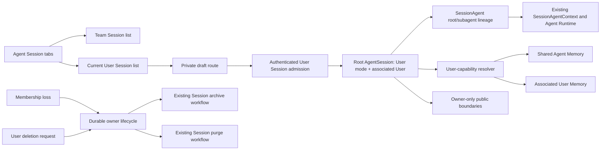

# Private User Sessions Design

- Requirements: [session-260806/REQ](../requirements/session-260806-user-sessions.md)
- ADR: [session-260806/ADR](../adr/session-260806-user-sessions.md)
- Document reference: `session-260806/DESIGN`

## 1. Scope

This Design adds private User Sessions while preserving the current Team Session contract. It covers root Session classification, associated-User ownership, tab-separated discovery, private public-boundary authorization, first-message creation, User Memory capability projection, and durable owner-lifecycle handling. It does not add a User Session primary, change Team primary behavior, route External Channel traffic to User Sessions, add personal credentials, or claim filesystem-level isolation inside the shared Agent Runtime.

## 2. Current Behavior and Requirement Gaps

| Requirement | Current behavior | Gap |
| --- | --- | --- |
| `session-260806/REQ-1` | Agent-scoped APIs list all active root Sessions as Team Sessions, and the web sidebar has one Session list. | Root product mode is absent; API projections and UI need separate Team and current-user User Session lists. |
| `session-260806/REQ-2` | Root creation supports non-primary Team Sessions and first-message Team Session creation. | A User Session creation path must associate the authenticated requester, set no primary role, and keep draft creation side-effect free. |
| `session-260806/REQ-3` | Public Session boundaries authorize Workspace membership but do not distinguish a private owner. | Every read, write, control, subscription, archive/restore, tree, and resource boundary must apply the root User Session owner check. |
| `session-260806/REQ-4` | Runtime Memory tools hard-code `user_id=None` and expose Agent Memory only. | User Session resolution must construct a user-owned Memory capability for the root associated User while retaining shared Agent Memory. |
| `session-260806/REQ-5` | Team Session routing, Team primary, and Team capability projection are current behavior. | User Session work must not enter Team primary or External Channel routing paths. |
| `session-260806/REQ-5` lifecycle | Membership and User deletion currently remove ownership rows directly; Session archive/purge is a separate lifecycle workflow. | Owner loss/deletion needs durable orchestration that revokes access first and completes Session lifecycle cleanup before final User deletion. |

## 3. Traceability and Architecture

| Requirement | Design mechanism | Authority |
| --- | --- | --- |
| REQ-1 | Separate Team/User list projections and tab state; Team projection remains unchanged. | Required by REQ-1; existing Team Session Spec |
| REQ-2 | User draft route; atomic first-message User Session admission; no primary role; multiple owner sessions. | Required by REQ-2; ADR-D1 |
| REQ-3 | Root owner authorization applied at every public Session/resource boundary; private identifiers return not-found semantics. | Required by REQ-3; ADR-D1 |
| REQ-4 | Dedicated User-capability resolver supplies associated User only to User Memory tools; shared Agent Memory remains available. | Required by REQ-4; ADR-D1 and unchanged Team execution boundary |
| REQ-5 | Existing Team routes, Team primary, External Channel mapping, and Userless Engine remain unchanged. | Required by REQ-5; existing Conversation/Agent/External Channel Specs |
| REQ-2/3 lifecycle | Durable owner-lifecycle workflow revokes access immediately, archives on membership loss, purges on User deletion, and finalizes User deletion after purge. | ADR-D2 and ADR-D3; existing Session lifecycle workflow |

## 4. Root Session Ownership and Data

The root `AgentSession` becomes the authoritative product aggregate for Session mode and ownership.

- Add a PostgreSQL enum-backed root product mode with `team` and `user` values.
- Add nullable `associated_user_id` referencing `users.id` with restrictive lifecycle behavior while a User Session exists.
- Enforce the following constraints:
  - root Team Session: associated User is null;
  - root User Session: associated User is non-null;
  - subagent Session rows: mode and associated User are null and derive from the root tree;
  - User Session: `primary_kind` is null;
  - existing Team primary unique index remains limited to Team mode.
- Add an index for `(agent_id, associated_user_id, status)` to support the current user's User Session list. No uniqueness constraint is added because multiple User Sessions per Agent/User are required.
- Extend repository/domain/API projections with mode and associated-user visibility only where the current requester is authorized. The associated User ID is not a client-selectable field and is not exposed to other Workspace members.

Existing `session_kind = root|subagent` remains the tree/listing classification. Existing Team `primary_kind` remains the Team primary role and is not overloaded.

## 5. Admission and Public API Boundaries

### 5.1 Session lists and tabs

The Agent session surface obtains two independently authorized projections:

- Team Sessions: existing list query and ordering, including Team primary first.
- My Sessions: active User Sessions where root `associated_user_id` equals the authenticated requester and the requester remains a member of the Session's Workspace.

A User Session is excluded from the Team list at the repository query boundary, not only in the frontend. The frontend stores the selected tab in route/query state or equivalent local navigation state and renders the corresponding list. Team tab mutations continue to invalidate existing Team queries; User tab mutations invalidate only the User Session query.

### 5.2 User draft and first-message creation

The User tab's create action navigates to a draft route. The draft has no Session ID and does not create a database row. Its first-message request uses one atomic service operation that:

1. authenticates and authorizes the current Workspace member for the Agent;
2. resolves the requested User Session workspace/project intent under the existing Runtime/Project rules;
3. creates one root `AgentSession` with User mode, the authenticated associated User, null `primary_kind`, and existing root SessionAgent/Context rows;
4. admits the first Human input with the authenticated requester as message sender;
5. claims referenced input resources under the new root Session;
6. commits the Session and input together; and
7. publishes the existing routing-only Session wake-up after commit.

A retry with the same client idempotency identity returns the same accepted User Session/input. It cannot select another associated User or mutate the Session type.

Team draft and first-message paths remain unchanged and continue to call Team-specific creation services.

### 5.3 Owner authorization contract

The public Session access helper becomes mode-aware:

- Team root or Team subagent: current Workspace/Agent access rules remain unchanged.
- User root or descendant subagent: resolve the root Session, require the current requester to equal the root associated User, and require current Workspace membership.

The same check is applied before side effects or private data disclosure for:

- Session list item retrieval and direct Session reads;
- history, context, live state, WebSocket ticket registration, and subagent tree;
- message, action, command, retry, stop, title, pin, archive, restore, and project mutations;
- ExchangeFile, ModelFile, Artifact, and workspace resource list/download/delete boundaries tied to the Session.

Private failures use the existing not-found-safe public semantics. No endpoint returns the title, status, owner, run state, file metadata, or membership-specific error for a User Session the requester does not own.

## 6. User Memory Capability Projection

Generic Engine, Run, Worker, broker, and ordinary Toolkit contexts remain Userless. The canonical execution snapshot resolves the root Session mode and associated User as durable Session metadata. A separate User-capability resolver is called only for a User Session.

The resolver constructs:

- existing Agent-scope Memory read/write tools for `agent_id`;
- User-scope Memory read/write tools bound to the root associated User and `agent_id`.

The User Memory toolkit captures the associated User internally and does not add `user_id` to `RunRequest`, `RunContext`, `ToolkitContext`, `TurnContext`, or generic provider contracts. It rejects any attempt to select a different User. Subagent execution receives the same root-derived capability projection; a subagent cannot replace or widen the associated User.

Team Sessions continue to bind only the existing Agent-scope Memory tools. The latest message sender, current viewer, wake-up source, or requester of a later read never determines User Memory scope.

## 7. Lifecycle: Membership Loss and User Deletion

### 7.1 Membership loss

The Workspace membership delete transaction removes the membership immediately, so all subsequent public User Session authorization fails. It also creates or enqueues one durable owner-lifecycle operation for the affected `(workspace_id, user_id)`.

The owner-lifecycle worker enumerates active User Session roots for that Workspace/User, requests safe stop for active trees, and invokes the existing archive transition once the tree reaches an archive-safe boundary. Archive records the normal retention policy and reuses existing participant cleanup. The operation is idempotent and retryable. A later Workspace rejoin does not automatically restore Sessions; the associated User can explicitly restore an archived User Session through the owner-only archived-session boundary.

### 7.2 User deletion

The User deletion request first marks the account unavailable for authentication and public access, then creates a durable owner-lifecycle purge operation for all User Session roots owned by that User. The account row remains until all purge operations complete. The workflow:

1. fences and stops active User Session trees through the existing purge boundary;
2. runs Session lifecycle participants, including broker, External Channel, ModelFile, Artifact, ExchangeFile, and worktree cleanup as applicable;
3. verifies cleanup and finalizes the root Session tree through `SessionLifecycleFinalizerRepository`; and
4. deletes the User row and remaining User-scoped Memory only after all owned User Session purge work is complete.

A failed operation retains durable retry state and leaves the User inaccessible. No database cascade bypasses Session lifecycle cleanup. Existing Team Sessions, Agent Memory, and Workspace-owned Toolkits are not included in User Session owner purge.

## 8. Persistence, Migration, and Rollout

Create forward Alembic migrations only. The migration adds the root product mode enum, associated User FK/indexes, and constraints. Existing rows are deterministically classified as Team root/subagent rows with null associated User. Existing Team primary rows remain Team mode. No existing Session becomes a User Session by inferring its creator, latest sender, current viewer, or Workspace owner.

Deployment is a coordinated application/schema cutover for Session classification and public projections:

1. deploy the forward migration and backend code that reads the new Team defaults;
2. regenerate public OpenAPI clients after route/model changes;
3. deploy backend and web code that supports both Team and User tab projections;
4. enable User Session creation and User Memory capability only after migration invariant checks pass; and
5. verify that all existing Sessions are Team mode and all subagent rows derive mode from a Team root.

The lifecycle workflow is introduced before enabling User deletion/membership-loss archive behavior. Rollback uses the pre-cutover database backup and previous images; old application images are not run against User-mode rows.

## 9. Failure, Concurrency, and Recovery

- Two concurrent first-message User Session requests with different client IDs create two independent User Sessions; the same idempotency key cannot create a second Session.
- A concurrent duplicate request with changed associated-user or Session-mode data fails as an idempotency conflict.
- A membership deletion racing with first-message admission is serialized by the existing membership/session admission locks. If membership is no longer present at admission, no Session or input side effect is committed.
- A membership deletion racing with User Session execution revokes public access first; accepted internal work may finish or be stopped by the lifecycle workflow according to the existing owner-generation and stop/recovery rules.
- A User deletion racing with restore or new input fails closed because the account is unavailable and owner authorization no longer succeeds.
- A failed archive/purge step remains durable and retryable. No partial object-storage cleanup is treated as completed without the existing verification boundary.
- A broker notification failure does not roll back an accepted Session/input; existing durable Session recovery re-enqueues work.
- A stale or malformed root mode/associated-user combination fails closed during canonical Session loading and migration validation.

## 10. Security and Privacy

- Associated User ownership is authoritative only on the root Session; subagents cannot be individually shared.
- Current requester authorization and message sender provenance remain separate. Sender metadata never grants access to another User Session.
- Private list and direct-resource queries apply owner predicates in the repository/service layer, not only in UI filtering.
- Private failures use non-disclosing not-found responses.
- User Memory queries always include the root associated User ID and Agent ID. User-scope Memory API behavior outside execution remains governed by the current user's own visibility rules.
- Shared Agent Runtime and Agent Workspace storage remain unchanged; this Design does not promise filesystem-level private isolation.
- Logging uses requester/owner lifecycle fields for operational audit without adding an execution User to generic runtime contexts. Runtime code continues to rely on logging integration for Sentry delivery.

## 11. Observability and Operations

Emit structured lifecycle metrics and logs for:

- User Session first-message admission success/conflict;
- owner authorization denial without private-data disclosure;
- Team/User session list counts by mode without User ID metric labels;
- User Memory capability resolve and scope rejection;
- membership-loss archive queued/running/completed/failed;
- User deletion purge queued/running/completed/failed;
- active-run stop delay and purge retry reason;
- final User deletion blocked by incomplete owned Session purge; and
- migration invariant violations.

The owner-lifecycle operation exposes bounded status for operator diagnosis. It does not expose private transcript content or User Memory bodies.

## 12. Test Strategy

Product behavior verification is E2E-first.

### Primary E2E matrix

1. One Workspace member creates two User Sessions for one Agent through the My Sessions tab; both appear in My Sessions, neither appears in Team Sessions, and neither has a primary badge.
2. The associated User can reopen, send a message, view history/live state, inspect subagents, archive, restore, and download an authorized Session resource.
3. A second Workspace member, including an Owner/Manager fixture, cannot list, open by direct URL, subscribe, send, control, inspect, archive/restore, or download the first member's User Session; responses do not reveal private metadata.
4. Two members continue to use the existing Team Session flow and confirm Team primary/list ordering, shared visibility, sender provenance, and External Channel behavior are unchanged.
5. A User Session reads/writes Agent Memory and its own User Memory; a different user's User Memory is absent and inaccessible; Team Session runtime still rejects User scope.
6. The draft route alone creates no Session row; the first accepted message creates exactly one User Session and replaces the URL with its concrete route.
7. Membership removal makes the User Session inaccessible immediately, queues owner lifecycle, and archives after active work reaches a safe boundary; rejoin plus explicit owner restore makes it available again.
8. User deletion makes the account inaccessible, completes owned User Session purge, removes private User Memory, and only then removes the User row. Team Sessions and Agent Memory remain.

### Unit/integration support

- Repository tests for mode/associated-user constraints, Team/User list predicates, root/subagent derivation, and no-primary validation.
- Service/API tests for owner-only access across every public boundary and non-disclosing failures.
- Admission tests for first-message idempotency and membership races.
- Memory tool tests for dual Agent/User scope projection and cross-user rejection.
- Lifecycle tests for active-run stop, archive retry, purge participant verification, and delayed User deletion.
- Migration tests for all existing rows classified as Team and invalid combinations rejected.

### Fixtures and CI

The E2E fixture creates two Workspace members with distinct User Sessions and a Team Session through public APIs. Testenv does not write product state directly to the database. Credential-free deterministic E2E runs cover Team/User API behavior; Runtime Provider E2E covers Session file/resource lifecycle; optional live tests are not required for this feature. Evidence includes response status/body redaction assertions, session list projections, event history, and lifecycle completion summaries.

## 13. Removal and Replacement

| Existing unit or behavior | Removal authority | Replacement or remaining authority | Removal boundary | Absence verification |
| --- | --- | --- | --- | --- |
| Single Team-only Session list projection | `session-260806/REQ-1` | Separate Team and current-user User Session projections | API/service query and web Agent rail | E2E verifies no User Session appears in Team list and no other user's list |
| Team-only root Session classification | `session-260806/REQ-2`, `session-260806/ADR-D1` | Explicit root Team/User mode with associated User constraints | New migration and repository/domain mapping | Migration test verifies all old rows are Team and invalid pairs fail |
| Workspace-membership-only authorization for private-capable boundaries | `session-260806/REQ-3`, `session-260806/ADR-D1` | Mode-aware owner authorization while preserving Team membership rules | Public chat/resource service boundary | Cross-member E2E covers list, URL, live, mutation, control, tree, and download |
| Team-only Memory toolkit projection | `session-260806/REQ-4`, `session-260806/ADR-D1` | User Session resolver projecting Agent + associated User Memory | Runtime capability resolution | Team E2E/unit tests prove User scope remains unavailable in Team Sessions |
| Direct User deletion with no Session lifecycle coordination | `session-260806/ADR-D3` | Durable owner-lifecycle archive/purge workflow before final User deletion | User/membership deletion service and scheduler | Lifecycle tests verify no User row deletion before owned purge completion |

No existing Team primary, Team External Channel route, generic Userless Engine context, personal credential path, or filesystem isolation contract is removed by this Design.

## 14. Design Authority

- Design revision: `1`

| ID | Material design mechanism | Authority | Classification |
| --- | --- | --- | --- |
| M1 | Root Team/User product mode with associated User constraints; subagents derive from root | `session-260806/REQ-2`, `session-260806/REQ-3`, `session-260806/ADR-D1` | `decided` |
| M2 | Separate Team and current-user User Session list projections and tabs | `session-260806/REQ-1`, `session-260806/REQ-5` | `required` |
| M3 | Atomic User Session first-message admission without primary role | `session-260806/REQ-2`, `session-260806/ADR-D1`, existing Team admission Spec | `derived` |
| M4 | Owner-only authorization at all public Session/resource boundaries | `session-260806/REQ-3`, `session-260806/ADR-D1` | `required` |
| M5 | User-capability resolver for associated User Memory without generic User context | `session-260806/REQ-4`, `session-260806/ADR-D1`, existing Team execution boundary ADR | `decided` |
| M6 | Existing Team Session behavior retained without routing changes | `session-260806/REQ-5`, existing Conversation/Agent/External Channel Specs | `existing` |
| M7 | Durable owner lifecycle for membership-loss archive and account-deletion purge | `session-260806/ADR-D2`, `session-260806/ADR-D3`, existing Session lifecycle workflow | `decided` |
| M8 | Forward migration, deterministic Team backfill, coordinated rollout, and E2E-first verification | project migration constraints, existing Session lifecycle/Spec rules, `session-260806/REQ` | `derived` |

## 15. Feasibility

| Area | Status | Evidence |
| --- | --- | --- |
| Root mode/owner persistence | feasible | `RDBAgentSession` already owns root lifecycle fields and has root/subagent constraints; Alembic forward migration path exists. |
| Private list and boundary authorization | feasible | `ChatSessionService` centralizes Session reads/lists and public chat routes already pass current User; repository queries can add root mode/owner predicates. Resource/public methods already have Session access boundaries to extend. |
| First-message User admission | feasible | Existing `create_team_session_with_buffered_input` atomically creates a Team root and first input; User mode can reuse its transaction with a separate explicit creation intent. |
| Dual Memory capability | feasible | `MemoryRepository` already accepts exact `user_id`; current Memory tool factories hard-code `None`, making projection extension localized to capability resolution. |
| User tab frontend | feasible | `AgentFocusedShell`, `AgentFocusedSidebar`, draft route, and tRPC list/create invalidation already implement Team session list and draft URL replacement. |
| Membership-loss archive | conditional | Existing membership deletion is immediate and existing archive blocks active Runs. Requires the new durable owner-lifecycle operation and integration at membership deletion; no product contradiction remains. |
| Account deletion after purge | conditional | Existing User deletion is immediate and Session purge is durable/retryable. Requires delaying final User row deletion behind owner purge completion and an account-unavailable state; this is a material implementation change authorized by ADR-D3. |
| Filesystem privacy | out of scope | Current Runtime/Agent Workspace is shared across Sessions; Design does not claim this guarantee. |

No blocker contradicts the approved Requirements or ADRs. Conditional lifecycle items require implementation of M7 before enabling membership/User deletion behavior for User Session owners.

## 16. Non-Blocking Risks and Assumptions

- Existing Agent-level auto-archive policies must not silently archive User Sessions through Team-only list logic; User Session owner lifecycle and explicit user actions need separate predicates.
- The current User deletion API contract may need an asynchronous accepted response or status projection; exact HTTP response shape is an agent-owned contract detail only if it does not weaken the approved lifecycle behavior.
- User Session resource retention follows existing Session root lifecycle; it does not create a second private-resource owner aggregate.
- The shared Runtime means a future filesystem privacy requirement would require a new Requirements/ADR snapshot.

## 17. Design Approval

- Mode: `Collaborative`
- Decision owner: `Requester`
- Approved on: `2026-08-06`
- Approved Design revision: `1`
- Approved authority IDs: `M1, M2, M3, M4, M5, M6, M7, M8`
- Approved scope: Private User Sessions with Team/User root mode, owner-only access, My Sessions tabs, first-message User Session creation, Agent+User Memory capability projection, and durable owner-lifecycle archive/purge without changing Team Session behavior.
