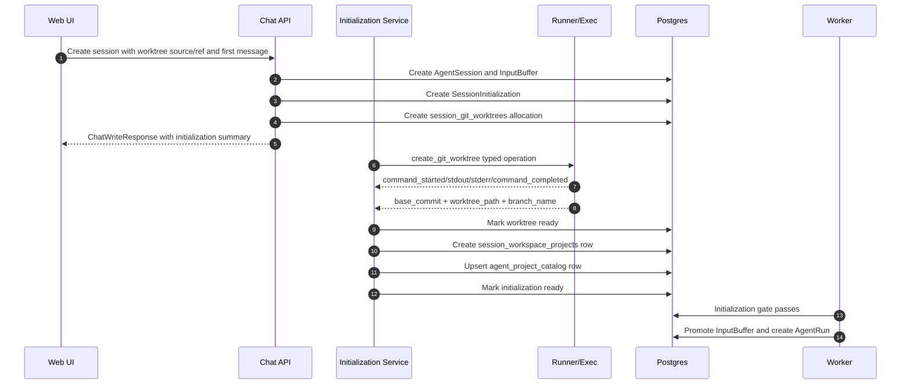

# Session Git Worktree Lifecycle

## Problem

Azents currently creates non-primary AgentSessions with explicit Project paths selected under the Agent Workspace. Those Projects are normal path registrations. They are not isolated Git workspaces and they do not carry ownership or cleanup semantics.

The new worktree flow should let a new AgentSession start in an Azents-owned Git worktree created from a selected source Project and starting ref. The worktree must be registered as the session Project only after Git setup succeeds, and it must be cleaned up when the session is archived or deleted.

This design depends on [Session Initialization Steps](session-initialization-steps.md). Git worktree creation is a blocking initialization step. The first user input is stored normally, but run dispatch is gated until initialization becomes ready.

## Goals

- Create an isolated Git worktree for a new session from an explicit source Project and starting ref.
- Make worktree creation visible through the session initialization UI and streamed command output.
- Keep `session_workspace_projects` as the session Project registry, not the Git ownership model.
- Add an authoritative worktree allocation model for ownership, retry, and cleanup.
- Register the created worktree path as a session Project after allocation succeeds.
- Upsert `agent_project_catalog` so Project Browser manifests can show the created worktree path.
- Avoid updating Project presets/defaults for ephemeral worktree Projects.
- Remove Azents-owned worktrees, branches, and catalog entries during archive/delete cleanup.
- Preserve safety by deleting only resources with explicit Azents ownership records.

## Non-Goals

- Do not replace explicit Project selection for normal sessions.
- Do not make every Project a Git worktree.
- Do not make `session_workspace_projects` store Git metadata.
- Do not support multiple worktrees per session in the MVP.
- Do not create detached worktrees by default.
- Do not add a `/workspace/agent/.azents/**` user registration validator in the MVP.
- Do not fail archive/delete solely because cleanup failed in the MVP.
- Do not make Worktree setup an agent tool call.

## Current Behavior

`ChatSessionService.create_team_session()` accepts explicit `project_paths`, creates an `AgentSession`, creates `session_workspace_projects`, refreshes Project presets/defaults, and upserts the Agent Project catalog.

`AgentSessionInputService.create_team_session_with_buffered_input()` creates the same non-primary session shape, registers Projects, enqueues the first `USER_MESSAGE` input buffer, and returns a `ChatWriteResponse`.

`ChatSessionService.archive_agent_session()` validates access, rejects team-primary/running sessions, and transitions the session to archived. It does not perform filesystem cleanup. The current archive model is soft: transcript, run rows, exchange files, and Project registry rows remain.

`agent_project_catalog` is an Agent-scoped Project path/status read model. ADR-0090 states that prompt Project eligibility remains based on session Project bindings, not catalog status.

## Proposed Design

New-session worktree mode adds a worktree request to session creation. Backend creates the AgentSession, stores the first input buffer, creates `SessionInitialization`, creates a `session_git_worktrees` allocation row, and adds a blocking `create_git_worktree` initialization step. The first run does not start until initialization succeeds.



The worktree flow uses the generic initialization live contract. The first-message REST response returns the pending input buffer plus `live.initialization`; subsequent progress is delivered on the existing session WebSocket subscription through initialization live-state updates and durable initialization event append notifications. Git stdout/stderr is not stored as conversation history; it is stored in initialization events and rendered in the initialization detail panel.

## User Flow

1. User starts a new session and chooses `New worktree` mode.
2. User selects one source Project and one explicit starting ref.
3. User sends the first message.
4. The chat timeline shows the user message and a `Preparing session` initialization summary.
5. The worktree step shows an expandable command details panel with Git command, stdout, stderr, exit code, and failure summary.
6. On success, the first agent run starts inside the created worktree Project.
7. On failure, the session remains active, input remains pending, and the UI offers retry/delete/manual cleanup guidance.
8. On archive, Azents attempts best-effort cleanup and does not block archive if cleanup fails.

## Data Model

### `session_git_worktrees`

Authoritative worktree allocation and cleanup model.

| Field | Notes |
| --- | --- |
| `id` | UUID7 hex primary key |
| `session_id` | FK to `agent_sessions.id`, unique for MVP |
| `initialization_id` | FK to `session_initializations.id` |
| `step_id` | FK to the `create_git_worktree` step |
| `source_project_path` | Existing source Project path under Agent Workspace |
| `starting_ref` | User-selected starting branch/tag/ref/commit string |
| `base_commit` | Runner-resolved commit SHA, nullable until ready |
| `worktree_path` | Allocated Azents-managed worktree path |
| `branch_name` | Azents-created branch name |
| `branch_created_by` | Enum: `azents`, future `user` |
| `status` | Enum: `pending`, `creating`, `ready`, `failed`, `cleanup_pending`, `cleaned`, `cleanup_failed` |
| `failure_summary` | User-safe nullable failure text |
| `cleanup_summary` | User-safe nullable cleanup text |
| `created_at` / `ready_at` / `failed_at` / `cleaned_at` | Timezone-aware timestamps |

Expected indexes:

- `ix_session_git_worktrees_session_id`
- `ix_session_git_worktrees_status`
- `ix_session_git_worktrees_worktree_path`
- `ix_session_git_worktrees_branch_name`

`session_git_worktrees` is the cleanup source of truth. Initialization step `resource_descriptors` store only a snapshot/reference:

```json
{
  "type": "git_worktree",
  "worktree_id": "...",
  "worktree_path": "/workspace/agent/.azents/worktrees/abcd/repo",
  "branch_name": "azents/abcd"
}
```

### Status Relationship

| Worktree status | Initialization effect |
| --- | --- |
| `pending` / `creating` | `create_git_worktree` step running or waiting |
| `ready` | Downstream registration/catalog steps can run |
| `failed` | Blocking initialization failure, run remains gated |
| `cleanup_pending` | Archive/delete cleanup has been requested |
| `cleaned` | Resource cleanup completed |
| `cleanup_failed` | Archive/delete can still complete; manual cleanup is shown |

## Source and Base Ref Selection

MVP supports exactly one source Project per worktree session. The session creation request must provide:

- `source_project_path`: an existing Project path under the Agent Workspace.
- `starting_ref`: explicit user-selected ref, branch, tag, or commit.

The runner resolves `starting_ref` in `source_project_path` and returns `base_commit`. The backend stores both the user-selected ref and resolved commit.

The API must not infer the worktree source from the first selected Project. Multi-project sessions can still exist through normal explicit Project selection, but worktree mode has one source Project.

## Path and Branch Naming

Worktrees live under an Azents-owned management directory:

```text
/workspace/agent/.azents/worktrees/{session_handle}/{repo_leaf}
```

Naming policy:

- `session_handle` is the durable `agent_sessions.handle` value.
- Session handles are generated from a vendored BIP-39 English wordlist snapshot by randomly selecting three words and joining them with hyphens.
- Existing sessions are backfilled with handles during migration.
- `repo_leaf` is a sanitized basename of `source_project_path`.
- If the leaf collides within the session directory, suffix the repo leaf: `repo`, `repo-2`, `repo-3`.
- Do not suffix the session directory for repo leaf collisions.

Default branch name:

```text
azents/{session_handle}
```

If the branch name collides, suffix the branch name independently:

```text
azents/{session_handle}
azents/{session_handle}-2
```

Raw UUIDs should not be the primary visible path or branch component. The allocation row stores exact path and branch names so cleanup never reconstructs them from current naming rules.

## Initialization Steps

Worktree mode uses at least these initialization steps:

| Step key | Blocking | Executor | Behavior |
| --- | --- | --- | --- |
| `create_git_worktree` | true | runner | Create branch-backed worktree and stream Git output |
| `register_workspace_project` | true | backend | Add worktree path to `session_workspace_projects` |
| `upsert_project_catalog` | true | backend | Upsert catalog row for the created worktree Project |
| `refresh_project_status` | false | backend | Request filesystem status sync for the catalog projection |

Future optional steps may include setup scripts or dependency bootstrap, but they should use the generic initialization step model.

## Runner Git Operation API

Runner exposes typed Git worktree operations that internally execute argv-based Git commands and stream command output using the generic initialization event shape.

### `create_git_worktree`

Request:

```json
{
  "source_project_path": "/workspace/agent/repo",
  "worktree_path": "/workspace/agent/.azents/worktrees/abcd/repo",
  "branch_name": "azents/abcd",
  "starting_ref": "main"
}
```

Runner responsibilities:

- Validate that `source_project_path` exists and is a Git repository.
- Resolve `starting_ref` to `base_commit`.
- Ensure `worktree_path` is not already an unrelated directory.
- Ensure `branch_name` is not already an unrelated branch.
- Execute an argv equivalent of `git worktree add -b <branch_name> <worktree_path> <starting_ref>`.
- Stream command start, stdout, stderr, and command completion.
- Return `base_commit`, `worktree_path`, `branch_name`, and semantic failure code where possible.

Semantic failure examples:

- `not_git_repo`
- `invalid_ref`
- `branch_exists`
- `worktree_path_exists`
- `git_command_failed`
- `runner_unavailable`

### Cleanup Operations

Cleanup uses typed operations too:

```json
{
  "source_project_path": "/workspace/agent/repo",
  "worktree_path": "/workspace/agent/.azents/worktrees/abcd/repo",
  "force": true
}
```

```json
{
  "source_project_path": "/workspace/agent/repo",
  "branch_name": "azents/abcd"
}
```

Operations:

- `remove_git_worktree`
- `delete_git_branch`

Both stream command output and return semantic failure when possible.

## Project Registration and Catalog Projection

On worktree ready:

- Create a `session_workspace_projects` row for `worktree_path`.
- Upsert `agent_project_catalog` for `agent_id + worktree_path` as part of the ready success path.
- Request or trigger Project filesystem status sync using the same boundary-triggered mechanism described by ADR-0090.
- Do not update `agent_project_presets`.
- Do not update `agent_project_defaults`.

Rationale:

- The worktree path is eligible for the current session's prompt/tool Project scope.
- The worktree path should be visible to backend-owned Project Browser manifests.
- The worktree path is ephemeral and should not become a reusable default for future sessions.

On cleanup success:

- Remove or mark inactive the session Project binding according to the session archive/delete implementation phase.
- Delete the `agent_project_catalog` entry for the worktree path.
- No preset/default cleanup is needed because they were never updated.

## Archive and Delete Cleanup

Archive/delete cleanup is asynchronous and best-effort in the MVP. Cleanup failure must not block archiving.

Archive request behavior:

1. Validate access and reject team-primary/running sessions as today.
2. Mark owned worktree allocations `cleanup_pending`.
3. Soft-archive the session.
4. Enqueue worktree cleanup work.
5. Return without waiting for Git cleanup to finish.

Background cleanup attempts:

1. Validate ownership and cleanup eligibility from `session_git_worktrees`.
2. Run `remove_git_worktree(force=true)` for the allocated path.
3. Run `delete_git_branch` for the Azents-created branch.
4. Delete the `agent_project_catalog` entry for the worktree path.
5. Mark worktree `cleaned` on success.

If any cleanup step fails:

- Mark worktree `cleanup_failed`.
- Store a user-safe `cleanup_summary`.
- Leave enough allocation metadata for manual cleanup guidance.
- Do not retry indefinitely in the background in the MVP.
- Do not unarchive or fail the session archive transition.

Manual cleanup guidance should include the worktree path and branch name only when the user has session access and the values are safe to show.

## Safety Rules

Deletion is allowed only when all of these are true:

- A matching `session_git_worktrees` row exists.
- The path matches the recorded `worktree_path`.
- The path is under the expected Azents worktree root.
- The branch matches the recorded `branch_name`.
- `branch_created_by = azents`.
- The cleanup operation is archive/delete/manual cleanup for the owning session.

Reserved-root membership alone is never sufficient to delete a path. User registration under `/workspace/agent/.azents/**` is not specially rejected in the MVP, so cleanup must never infer ownership from path prefix alone.

## Error Handling

Worktree creation failure:

- Marks `session_git_worktrees.status = failed`.
- Marks `create_git_worktree` step failed.
- Marks `SessionInitialization` failed because the step is blocking.
- Leaves the first input buffer pending.
- Creates no `agent_runs` row.
- Shows command output, semantic failure, and retry/delete/manual cleanup actions.

Retry:

- Reuses the existing allocation row when safe.
- Validates existing partial worktree/branch state before attempting creation again.
- Keeps previous initialization events grouped by attempt.
- Resets downstream registration/catalog steps to pending.

Catalog row upsert failure:

- `upsert_project_catalog` is blocking because the backend-owned Project Browser manifest depends on catalog candidates for worktree-created Projects.
- Worktree initialization does not become ready until the catalog row exists.
- Retry should reattempt the catalog upsert before running the agent.

Project filesystem status sync failure:

- `refresh_project_status` is non-blocking.
- Worktree initialization can become ready after Project registration and catalog row upsert succeed.
- UI shows a warning and future manifest reads may enqueue status sync.

Project registration failure:

- `register_workspace_project` is blocking.
- Worktree may already exist; allocation remains ready or cleanup-required depending on implementation detail.
- Initialization fails and retry should reattempt registration before running the agent.

## API Changes

Session create request needs a worktree mode. Exact schema should follow existing route naming, but conceptually:

```json
{
  "message": { "text": "..." },
  "project_paths": [],
  "workspace_mode": {
    "type": "git_worktree",
    "source_project_path": "/workspace/agent/repo",
    "starting_ref": "main"
  }
}
```

A separate session-without-message create path may accept the same `workspace_mode`, but the first-run UX is primarily exercised by first-message creation.

Read projections:

- Session live/history responses include initialization summary from the generic initialization model.
- Worktree details are available through initialization detail or a session worktree detail endpoint.
- Project Browser manifests derive Project roots from `session_workspace_projects` after worktree registration succeeds.

Actions:

- Retry failed initialization.
- Archive session with best-effort cleanup.
- Future manual cleanup action for `cleanup_failed` worktrees.

## Security and Permissions

- Worktree requests require the same Workspace/session membership checks as session creation.
- `source_project_path` must be an existing Project candidate under Agent Workspace and must not be an arbitrary host path.
- Runner operations must use argv execution, not shell string interpolation.
- Runner must not execute arbitrary backend-provided commands through the typed worktree operation API.
- Git command output shown in UI should follow normal command-output secret safety expectations.
- Cleanup must validate allocation ownership before deleting files or branches.
- Branch deletion is allowed only for Azents-created branches recorded on the allocation row.

## Migration and Rollout

1. Implement generic session initialization tables and worker gate.
2. Add `session_git_worktrees` table and enums.
3. Add backend step discovery for `workspace_mode.type = git_worktree`.
4. Add typed runner Git operation protocol and event streaming.
5. Add UI initialization summary/details rendering.
6. Enable worktree creation for first-message session create behind a feature flag.
7. Add archive cleanup best-effort behavior.
8. Add manual cleanup guidance/action for cleanup failures.
9. Update specs after implementation: conversation, workspace, agent execution loop, run resume, and runtime control as needed.

## Implementation Feasibility Notes

Validation against the current codebase found the design feasible, with these implementation constraints:

- Current session Project creation helpers also update `agent_project_presets`, `agent_project_defaults`, and `agent_project_catalog`. Worktree registration must not call those helpers as-is unless they are split or parameterized, because worktree-created Projects must update `session_workspace_projects` and `agent_project_catalog` but must not update presets/defaults.
- `agent_project_catalog` currently stores only `agent_id`, `path`, filesystem status, and timestamps. Cleanup ownership must remain in `session_git_worktrees`. If the browser needs to badge or filter worktree-created catalog entries, add an explicit catalog metadata/source design; do not infer ownership from catalog rows.
- Typed Git operations are a real runtime-control change. Current runner operations use an `operation_type` string, but the gRPC protocol has typed oneof request/result payloads and conversion code in the runtime-control client/server. Implementing `create_git_worktree`, `remove_git_worktree`, and `delete_git_branch` therefore requires proto, generated client/server mapping, backend operation client, runner adapter, and runner handler changes.
- Current foreground runner operation reading accumulates `stdout`/`stderr` for `bash` and exposes callbacks only for `process_output`. Worktree setup needs either operation-specific streaming callbacks or a generic stdout/stderr event callback so initialization events can be appended while Git runs.
- Runner `Workspace.resolve()` already accepts absolute runtime paths, so `/workspace/agent/.azents/worktrees/...` is reachable by runner operations. Safety must come from backend allocation ownership and typed Git operation validation, not from path resolver restrictions.
- `archive_agent_session()` currently only soft-archives after blocking primary/running sessions, and `delete_session()` deletes the session row. Worktree cleanup needs an explicit service invoked before or around archive/delete. For hard delete, cleanup must run before cascade removes ownership rows, or the ownership/audit row must be retained somewhere that survives deletion.
- No existing `session_handle` model was found. The implementation must add `agent_sessions.handle`, a global uniqueness constraint, collision retry, and a migration that backfills existing sessions from the fixed BIP-39 English wordlist source.
- Source Project selection currently accepts path lists and the Project Browser manifest does not enumerate Git refs. Worktree creation needs a separate Git ref discovery API backed by a typed `list_git_refs` runner operation. The create request still sends an explicit `starting_ref`, and `create_git_worktree` revalidates it.

## Additional Design or ADR Needed

Before implementation, resolve these items explicitly:

- Resolved: ADR-0092 records the Azents-owned worktree ownership and cleanup policy.
- Resolved: `session_handle` is stored on `agent_sessions.handle`, generated as a three-word slug from a vendored BIP-39 English wordlist snapshot, globally unique, and backfilled for existing sessions.
- Resolved: Git source/ref discovery uses a separate backend preview/discovery API backed by a typed `list_git_refs` runner operation. The UI preselects the repository default branch and the create request still sends explicit `starting_ref`.
- Resolved: Archive marks cleanup pending, soft-archives immediately, and enqueues background cleanup. Hard delete must preserve ownership metadata until cleanup has completed or recorded failure state. Manual cleanup retries the same cleanup worker from `cleanup_failed`.
- Resolved: `agent_project_catalog` gets no worktree ownership/source metadata in the MVP. It remains a path/status projection. Worktree badge/filter/cleanup status, if needed in Project Browser, is projected by joining `session_git_worktrees` in the manifest service.

## Test Strategy

E2E is the primary product behavior verification path.

Primary E2E matrix:

| Scenario | Expected result |
| --- | --- |
| New worktree session from valid source/ref | Initialization logs show Git setup, worktree Project appears, first run starts after ready |
| Invalid starting ref | Initialization fails, first run does not start, user sees Git stderr and retry/delete guidance |
| Branch name collision | Backend/runner picks suffixed branch and records exact branch name |
| Repo leaf path collision | Worktree path uses repo leaf suffix under the same session directory |
| Catalog status warning | Non-blocking filesystem status refresh failure does not block first run |
| Archive clean worktree | Worktree removed, branch deleted, catalog entry deleted |
| Archive dirty worktree | Force removal succeeds and branch/catalog cleanup happens |
| Archive cleanup failure | Session archive still succeeds and manual cleanup guidance appears |
| Reconnect during worktree setup | Initialization summary/details reconstruct from durable events |

E2E plan:

- Use a temporary Git repository fixture inside the Agent Workspace.
- Seed at least two starting refs for valid/invalid branch selection tests.
- Use deterministic branch/path collision fixtures.
- Add a fixture mode to make runner cleanup fail without deleting unrelated files.

Testenv support:

- Required for deterministic Git repository creation, ref setup, branch collision, dirty worktree creation, and runner cleanup failure injection.
- Testenv should expose safe fixture helpers rather than relying on a developer's local repositories.

Fixture and seed requirements:

- Workspace, Agent, Runtime, and source Project registered under `/workspace/agent`.
- Git repository with known commits and branches.
- Optional dirty-file fixture inside the created worktree.

Credential/prerequisite snapshot:

- Evidence should include Git version, fixture repository path, selected starting ref, resolved commit, and runner/provider mode.
- Evidence must not include credentials or runtime-control tokens.

Evidence format:

- UI screenshots or traces for timeline summary and details panel.
- REST/live snapshots for initialization summary and worktree status.
- DB or API evidence that `session_workspace_projects` and `agent_project_catalog` changed as expected.
- Git evidence from runner-safe inspection: worktree list, branch existence, and cleanup result.

CI execution policy:

- Deterministic local Git fixture E2E should run in required CI once runner Git operations are available.
- Provider-specific live tests can be optional/nightly until stable.

Skip/fail criteria:

- Missing Git binary in required CI is a failure for deterministic worktree tests once the feature is enabled.
- Optional provider live tests may skip only when provider prerequisites are explicitly unavailable.

Backend/unit tests:

- Worktree request creates allocation and initialization steps.
- Runner success marks allocation ready and registers Project/catalog.
- Runner failure blocks run dispatch and preserves input buffer.
- Retry reuses allocation and appends attempt events.
- Archive cleanup validates ownership before deletion.
- Cleanup failure does not fail archive.

Frontend tests:

- New-session UI can select source Project and starting ref.
- Initialization summary/details render Git command output.
- Failure states render retry/delete/manual cleanup actions.
- Project Browser shows the worktree Project after ready.

## Alternatives Considered

- Detached worktree by default: rejected. Azents uses branch-backed worktrees so commits and future PR workflows have a natural branch from the start.
- Infer source Project from first selected Project: rejected because it is unsafe in multi-project sessions.
- Store worktree ownership only in initialization descriptors: rejected because cleanup and worktree-specific queries should not depend on JSON interpretation.
- Update presets/defaults for worktree paths: rejected because worktree paths are ephemeral and should not become reusable defaults.
- Fail archive when cleanup fails: rejected for MVP. Archive should not be blocked by transient Git/process cleanup issues; users get manual cleanup guidance.
- Generic command exec only for Git operations: rejected as the target design because semantic validation and cleanup safety belong in typed runner operations.

## Open Questions

- Resolved: `session_handle` is stored on `agent_sessions.handle`, generated as a three-word slug from a vendored BIP-39 English wordlist snapshot, globally unique, and backfilled for existing sessions.
- Resolved: `source_project_path` may be selected from backend Project Browser/catalog candidates before target session creation. It does not need to be registered on the new session yet, but it must be under the Agent Workspace and is validated as a Git repository by `list_git_refs` and `create_git_worktree`.
- Resolved: Manual cleanup is an explicit action for `cleanup_failed` worktrees and enqueues the same background cleanup worker after ownership revalidation.
- Resolved: Worktree-created catalog entries do not get `source = worktree` metadata in the MVP; Project Browser worktree display is projected from `session_git_worktrees` when needed.
- Resolved: ADR-0092 records the persistent worktree ownership and cleanup policy.
