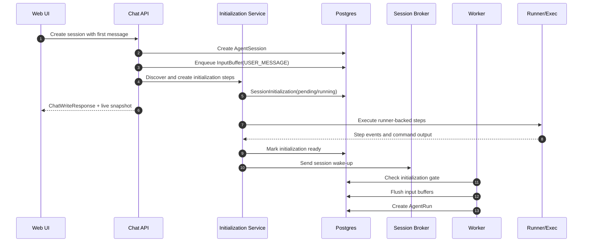

# Session Initialization Steps

## Problem

Some AgentSession startup work must happen after the session and first input are accepted but before the first agent run begins. Git worktree creation is the motivating case, but the same lifecycle also applies to runtime warmup, credential checks, workspace setup scripts, Project registration, catalog upsert, and catalog status refresh.

Today the first-message path creates an `AgentSession`, registers explicit Projects, enqueues the first `InputBuffer`, and wakes the worker. The worker promotes pending input buffers into a run. There is no generic pre-run initialization gate, so any setup that must happen before the first run becomes a one-off special case.

## Goals

- Introduce a generic `SessionInitialization` lifecycle that exists for every AgentSession.
- Keep the first user message as a normal input buffer and gate run dispatch until initialization is ready.
- Represent initialization as typed internal steps, not as arbitrary user-defined workflows.
- Make initialization progress visible in the chat UI through a timeline summary and expandable details.
- Let backend own step orchestration while runner/exec surfaces command execution, stdout/stderr, and exit status.
- Support blocking and non-blocking steps with explicit failure behavior.
- Provide retry and cleanup semantics for partially created resources.
- Make Git worktree creation the first consumer of this generic model, not a bespoke session path.

## Non-Goals

- Do not build a general-purpose workflow engine.
- Do not let users or agents define arbitrary initialization steps in the MVP.
- Do not execute initialization as an agent tool call.
- Do not block HTTP session creation until long-running setup completes.
- Do not add legacy fallback behavior for sessions that bypass initialization.
- Do not solve the full Git worktree lifecycle in this document; that design depends on this one.

## Current Behavior

`POST /chat/v1/agents/{agent_id}/sessions` creates an active non-primary AgentSession with explicit `project_paths`. `POST /chat/v1/agents/{agent_id}/sessions/messages` creates a non-primary AgentSession, registers explicit Projects, enqueues the first `USER_MESSAGE` input buffer, and returns a `ChatWriteResponse`.

The worker wakes up for session input, flushes pending input buffers, appends durable event transcript entries, creates or resumes an `agent_runs` row, and executes the normal agent run loop. `AgentSession.run_state` is a coarse idle/running recovery signal. Detailed run state lives on `agent_runs`.

Agent Workspace Projects are currently explicit user-selected path registrations. `session_workspace_projects` is the prompt/tool Project boundary, while `agent_project_catalog` is an Agent-scoped browser/read model.

## Proposed Design

Every AgentSession receives a `SessionInitialization` record. Step discovery runs immediately after the session is created and before the first wake-up can dispatch a run. If no steps are required, initialization transitions to `ready` immediately.



The first user message is not given a special pending-message state. It is stored as the same durable input buffer used by normal session writes. The worker run path treats initialization as a pre-dispatch gate: if initialization is not ready, the input buffer remains pending and no `agent_runs` row is created.

## Data Model

### `session_initializations`

One row per AgentSession.

| Field | Notes |
| --- | --- |
| `id` | UUID7 hex primary key |
| `session_id` | Unique FK to `agent_sessions.id`, cascade delete |
| `status` | PostgreSQL enum: `pending`, `running`, `ready`, `failed`, `canceled`, `cleanup_required`, `cleaned` |
| `failure_summary` | User-safe nullable text |
| `retry_count` | Number of user/system retry attempts |
| `created_at` / `started_at` / `completed_at` / `failed_at` / `canceled_at` / `cleaned_at` | Timezone-aware lifecycle timestamps |

### `session_initialization_steps`

Ordered typed steps for an initialization.

| Field | Notes |
| --- | --- |
| `id` | UUID7 hex primary key |
| `initialization_id` | FK to `session_initializations.id` |
| `session_id` | Denormalized FK for session-scoped queries |
| `sequence` | Stable execution order |
| `step_key` | Stable key within one initialization, for example `create_git_worktree` |
| `step_type` | PostgreSQL enum of typed internal step kinds |
| `status` | PostgreSQL enum: `pending`, `running`, `completed`, `failed`, `skipped`, `canceled` |
| `blocking` | Whether failure blocks first run dispatch |
| `retryable` | Whether UI/API may retry this step |
| `attempt` | Current attempt number |
| `depends_on_step_keys` | JSON array for downstream invalidation |
| `resource_descriptors` | JSON array of resources created or claimed by this step |
| `failure_reason` | User-safe nullable text |
| `started_at` / `completed_at` / `failed_at` | Timezone-aware timestamps |

### `session_initialization_events`

Append-only event stream for UI summaries and details.

| Field | Notes |
| --- | --- |
| `id` | UUID7 hex primary key |
| `initialization_id` | FK to initialization |
| `step_id` | Nullable FK; null for initialization-level events |
| `session_id` | Denormalized FK for session-scoped streaming |
| `sequence` | Monotonic sequence within initialization |
| `kind` | PostgreSQL enum: `info`, `command_started`, `stdout`, `stderr`, `command_completed`, `warning`, `failed` |
| `command_argv` | JSON array for command events |
| `content` | Text content or output chunk |
| `exit_code` | Nullable integer for command completion |
| `created_at` | Timezone-aware timestamp |

Indexes must be named explicitly. Expected indexes include `ix_session_initializations_session_id`, `ix_session_initialization_steps_initialization_sequence`, and `ix_session_initialization_events_initialization_sequence`.

## Step Model

MVP steps are typed internal steps discovered by backend code. The first known step types are:

| Step type | Blocking | Executor | Purpose |
| --- | --- | --- | --- |
| `noop_ready` | false | backend | Empty initialization for sessions with no setup work |
| `create_git_worktree` | true | runner/exec | Create an Azents-owned session worktree |
| `register_workspace_project` | true | backend | Register successful setup output into `session_workspace_projects` |
| `upsert_project_catalog` | true | backend | Create the catalog candidate required by Project Browser manifests |
| `refresh_project_status` | false | backend | Request filesystem status sync for the catalog projection |
| `run_workspace_setup_script` | true | runner/exec | Execute configured workspace setup commands |
| `verify_required_credentials` | true | backend/runner | Fail early when required credentials are unavailable |

Step discovery must be deterministic from session create input, Agent configuration, workspace/runtime state, and future worktree request fields. The MVP should not allow user-supplied arbitrary step definitions.

## Execution Boundary

Backend owns orchestration:

- Creates initialization and step records.
- Determines ordering, blocking behavior, and retry policy.
- Controls the run dispatch gate.
- Publishes initialization live events and REST projections.
- Starts retries and cleanup actions.

Runner/exec owns filesystem and command execution:

- Executes argv-based commands.
- Streams stdout/stderr chunks.
- Reports exit codes and command completion.
- Performs runtime filesystem observations.
- Does not mutate session lifecycle state directly.

Runner-backed steps should use the same operational shape as Codex's visible command setup: command begins are visible, output is streamed, and completion/failure is authoritative. Azents does not need to reuse agent tool-call schemas internally, but frontend projections should resemble command execution items enough that the UI can render a familiar expandable command/output block.

## Run Dispatch Gate

The worker must check initialization status before it promotes input buffers or creates an `agent_runs` row.

| Initialization status | Worker behavior |
| --- | --- |
| `ready` | Continue normal input buffer promotion and run creation |
| `pending` / `running` | Leave input buffers pending and do not mark session running |
| `failed` | Leave input buffers pending and expose blocked-by-initialization state |
| `cleanup_required` | Leave input buffers pending until retry or cleanup resolves |
| `canceled` / `cleaned` | Do not dispatch first run; session should be deleted or archived by caller action |

This gate applies to the first run. Follow-up input for a session whose initialization is already `ready` should not pay extra cost beyond reading the ready row. If future features add post-ready reinitialization, that must be a separate design.

## UI and API Behavior

The chat timeline uses the existing session live subscription transport. Initialization is not a durable conversation transcript item, so it should not be persisted as normal history and should not be forced into `partial_history_events`. Instead, it becomes a first-class live-state taxonomy beside `run`, `input_buffers`, `todo`, and `goal`.

The user-visible timeline shape is:

- The first user message appears immediately as the existing pending input-buffer live projection.
- A compact initialization card is rendered next to that pending input while initialization is `pending`, `running`, `failed`, or `cleanup_required`.
- The card title is a product label such as `Preparing session`.
- The card summary shows the current step, blocking/failure state, retry/cleanup availability, and warning count.
- Step details are expandable and show status, timing, command argv, stdout/stderr chunks, exit code, semantic failure code, and failure summary when present.
- When initialization becomes `ready`, the worker can promote the input buffer and create the first run. The initialization card may be removed from the live timeline once the first run begins unless a warning or failure still needs user attention.
- Blocking failure leaves the pending input visible and shows retry, cleanup, delete-session, and manual cleanup guidance as applicable.
- Non-blocking failure shows a warning but does not block the first run.

REST live additions:

- `GET /chat/v1/sessions/{session_id}/live` includes `initialization: null | SessionInitializationLiveProjection`.
- REST write snapshots include the same `initialization` projection so first-message session create can render the committed pending input and preparation card from the authoritative response.
- The projection is built from durable `session_initializations`, `session_initialization_steps`, and `session_initialization_events`, not from Redis-only live state.
- A detail endpoint fetches the full initialization step/event history for expanded logs.
- Retry and cleanup endpoints operate on failed or cleanup-required initialization state.

WebSocket additions on the existing session subscription channel:

| Type | Meaning |
| --- | --- |
| `session_initialization_updated` | Upsert the compact initialization projection in live state. |
| `session_initialization_event_appended` | Append one durable initialization event to the expanded detail stream. |
| `session_initialization_events_compacted` | Optional future notification that old output chunks were summarized or truncated. |

The WebSocket actions are transport updates for session live state, similar to `todo_state_changed` and `input_actions_updated`. They are not durable transcript events and do not use `history_event_appended`.

Reconnect/resync behavior:

- The client follows the existing resync rule: wait for `subscribed`, fetch `/history` and `/live`, then replay buffered WebSocket events.
- `/live.initialization` restores the current compact card after refresh or reconnect.
- The detail endpoint restores command logs from durable initialization events, so Redis TTL expiry does not hide a failed initialization.
- WebSocket event append order follows DB event sequence. The frontend dedupes detail events by initialization event id.

Streaming and batching:

- Runner-backed steps append stdout/stderr as durable initialization events.
- The backend publishes appended output through `session_initialization_event_appended` on the existing session WebSocket subscription.
- stdout/stderr chunks use a batching policy analogous to chat partial batching: short time window, size threshold, and mandatory flush before command completion, step terminal state, initialization terminal state, retry boundary, and cleanup boundary.
- Redis live projection should store only the latest compact initialization projection; durable initialization tables store the log source of truth.

## Failure and Retry

Blocking step failure:

- Marks the step `failed`.
- Marks initialization `failed`.
- Leaves input buffers pending.
- Does not create an `agent_runs` row.
- Shows logs and recovery actions.

Non-blocking step failure:

- Marks the step `failed` or `skipped` with warning semantics.
- Allows initialization to become `ready` if all blocking steps completed.
- Surfaces a warning in the summary/details UI.

Retry policy:

- MVP retries from the failed step.
- Completed upstream steps are not rerun unless the failed step declares them `rerun_required` through dependency metadata.
- Downstream dependent steps are reset to `pending` and rerun.
- Previous attempt events remain append-only and grouped by attempt.
- Retrying a runner-backed step must be idempotency-aware and validate existing resource descriptors before creating new resources.

## Cleanup and Rollback

Initialization does not perform destructive rollback automatically at the moment a step fails. Steps record resource descriptors for resources they created or claimed. Cleanup runs through explicit user action, session delete, or archive lifecycle.

Resource descriptors are typed JSON records. Examples:

```json
{
  "type": "git_worktree",
  "worktree_path": "/workspace/agent/.azents/worktrees/abcd/project",
  "branch_name": "azents/abcd",
  "created_by": "azents"
}
```

Cleanup behavior:

- Initialization failure may mark `cleanup_required` when partial resources exist.
- `Delete session` and future archive cleanup consume resource descriptors.
- Worktree cleanup still requires a matching allocation/resource descriptor and ownership validation.
- Reserved-root membership alone is never sufficient for deletion.
- Cleanup event output should be recorded under the initialization or later cleanup lifecycle so users can diagnose failures.

## Security and Permissions

- Initialization steps run as backend-owned lifecycle operations, not as agent tool calls.
- Runner-backed commands must be argv-based and avoid shell interpolation unless a typed setup-script step explicitly requires shell execution.
- User-visible output must be sanitized the same way as command execution output. Secrets from credentials, environment variables, and provider tokens must not be logged intentionally.
- Access to initialization details follows session workspace membership checks.
- Cleanup may delete only resources with explicit descriptors and ownership validation.
- Failure summaries must be user-safe and avoid stack traces, internal paths outside the workspace contract, raw provider responses, and credentials.

## Migration and Rollout

1. Add DB enums and tables for initialization, steps, and events.
2. Backfill or lazily create `ready` initialization rows for existing active sessions.
3. Add read projections to session live/history APIs without changing run dispatch.
4. Create initialization rows for new sessions with empty `ready` steps.
5. Add worker run dispatch gate. Since all existing/new ordinary sessions are `ready`, this should be behavior-preserving.
6. Add the first real blocking consumer, `create_git_worktree`, in the Git worktree lifecycle feature.
7. Add retry/cleanup endpoints and UI actions before enabling blocking worktree initialization by default.

## Implementation Feasibility Notes

Validation against the current codebase found the design feasible, with these implementation constraints:

- The first-message REST path currently creates the `AgentSession`, Project bindings, and input buffer in `AgentSessionInputService.create_team_session_with_buffered_input()`, then `_finalize_message_write_response()` publishes the pending input live event and sends the `SessionWakeUp`. Initialization records must be created before that final wake-up boundary, and the write snapshot must include the initialization projection from the same committed state.
- `RunExecutor.execute()` currently calls `poll_run_inputs()` before creating the run projection. Because `poll_run_inputs()` promotes pending input buffers, the initialization gate must run earlier, in `SessionRunner._process_wake_up()` or an equivalent pre-`RunExecutor` orchestration layer. Adding the gate later inside the run executor would be too late.
- The existing chat live model is already taxonomy-based (`partial_history`, `input_buffers`, `run`, `todo`, `goal`). Adding `initialization` as another live-state field and WebSocket update family fits the current transport model, but it requires backend response models, OpenAPI/client generation, frontend wire types, and reducer/rendering changes.
- The existing `LivePartialBatcher` is specific to model/chat partial transcript events. Initialization stdout/stderr should use a separate durable initialization event appender and optional batching layer rather than being forced into `partial_history` or `history_event_appended`.
- The migration must ensure every session has an initialization row before the worker gate is enforced. Missing initialization after rollout should be treated as an invariant violation, not as an ongoing legacy bypass.
- Retry and cleanup endpoints should route through service/repository layers and publish the same live projection updates as automatic step execution.

## Additional Design or ADR Needed

Before implementation, resolve these items explicitly:

- Resolved: ADR-0091 records the durable initialization table/status contract, run dispatch gate, live taxonomy, and session handle policy.
- Specify retry concurrency semantics: whether retry runs through the session broker/worker owner or through a separate initialization worker, and how it interacts with an already-owned session runner.
- Resolved: Title generation waits for initialization readiness. Pending/running/failed initialization sessions may keep `title = null`; clients render contextual fallback copy such as source repo label or `Preparing session`.
- Resolved: Frontend timeline contract includes a compact `Preparing session` initialization card from `/live.initialization` plus an expanded detail view backed by durable initialization step/event logs.

## Test Strategy

E2E is the primary product behavior verification path.

Primary E2E matrix:

| Scenario | Expected result |
| --- | --- |
| New session with no initialization steps | First message appears and first run starts normally |
| New session with a slow blocking step | User message appears, `/live.initialization` shows progress, WebSocket updates the card, no run starts until ready |
| Blocking step failure | User message remains visible, run is not created, failure logs and retry/delete actions appear |
| Retry after blocking failure | Failed step and downstream steps rerun, pending input dispatches after success |
| Non-blocking step failure | Warning appears and first run still starts |
| Reconnect during initialization | Existing subscribed → history/live baseline → buffered WebSocket replay reconstructs summary and event details |
| Delete/cleanup after partial setup | Resource descriptors drive cleanup and no unrelated Project/catalog path is deleted |

E2E plan:

- Add a deterministic test-only initialization step provider that can sleep, fail, stream stdout/stderr, and succeed without relying on Git.
- Use that provider for UI and API gating tests.
- Add Git worktree E2E later in the worktree-specific design using the generic initialization assertions.

Testenv support:

- Required for deterministic live initialization scenarios where browser tests need controlled step timing and streaming output.
- Testenv should expose fixture switches for `no_steps`, `slow_blocking_success`, `blocking_failure_then_success`, and `non_blocking_warning`.
- Fixture state must not require real external credentials.

Fixture and seed requirements:

- Workspace with one Agent and a Runtime ready enough for normal chat.
- Test-only initialization step provider enabled only in test configuration.
- Seeded user membership and Agent session list state.

Credential/prerequisite snapshot:

- E2E evidence should record whether the deterministic initialization fixture is enabled, but must not record secrets, runtime-control tokens, or provider credentials.

Evidence format:

- Capture UI timeline states, initialization detail panel contents, relevant REST response snapshots, and backend event rows where available.
- For failure tests, evidence must include user-safe failure summary and hidden raw diagnostic exclusion checks.

CI execution policy:

- Deterministic fixture-backed E2E runs in required CI.
- Git worktree live E2E can be optional until the worktree feature is enabled by default.

Skip/fail criteria:

- Missing deterministic fixture support is a CI failure.
- Optional live Git worktree prerequisites may skip only in explicitly marked optional/nightly jobs.

Backend/unit tests:

- Step discovery creates exactly one initialization per session.
- Empty step discovery marks initialization ready.
- Worker wake-up leaves input buffers pending when initialization is not ready.
- Worker creates no `agent_runs` row for failed initialization.
- `/live` includes initialization projection from durable initialization tables.
- WebSocket publishes `session_initialization_updated` after summary changes.
- WebSocket publishes `session_initialization_event_appended` after durable initialization event append.
- stdout/stderr batching flushes before command completion and terminal initialization state.
- Retry resets failed and downstream steps while preserving previous attempt events.
- Cleanup validates descriptors before deleting resources.

Frontend tests:

- Timeline summary renders pending/running/ready/failed states.
- Details panel renders command argv, stdout/stderr, exit code, and attempt grouping.
- Retry/delete/cleanup actions appear only for allowed states.
- Reconnect/resync restores initialization UI state.

## Alternatives Considered

- Worktree-only setup state: rejected because runtime warmup, setup scripts, credential checks, Project registration, and catalog upsert need the same first-run gate; catalog status refresh still benefits from the same visible lifecycle surface.
- Pending-message state: rejected because existing input buffers already model pending user input; gating run dispatch avoids message-model churn.
- Backend-only execution: rejected because command output streaming and filesystem authority belong near runner/exec.
- Runner-owned orchestration: rejected because backend must own session lifecycle, retry, API, audit, and run dispatch.
- Automatic destructive rollback on failure: rejected because cleanup should be explicit and descriptor-driven.

## Open Questions

- Resolved: Initialization status is surfaced through the one-to-one initialization projection, not as a duplicated `AgentSession` status field.
- Resolved: Title generation waits for initialization readiness. Accepted first input remains pending and does not trigger a separate title-generation LLM call before the first run.
- Resolved: Retry routes through the existing session broker wake-up path. The retry API records intent/resets eligible steps and returns; the session runner executes initialization retry under the same per-session ownership model.
- Resolved: Initialization events are stored only in initialization tables and delivered through initialization-specific WebSocket actions; they are not mirrored into durable conversation transcript events.
- Resolved: ADR-0091 records the persistent initialization lifecycle contract before implementation.
