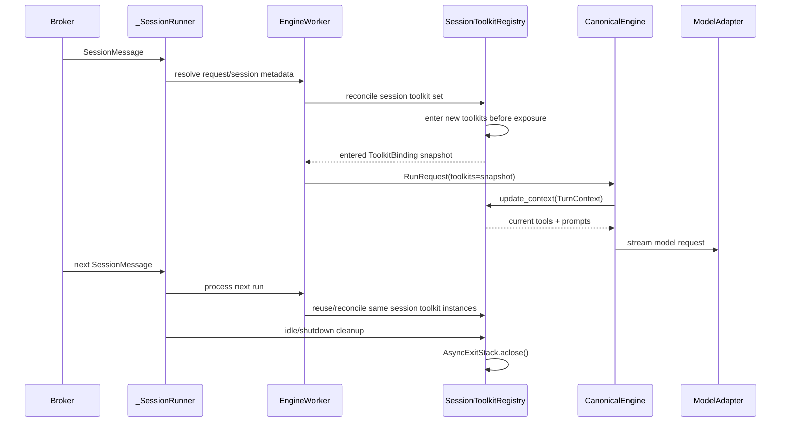

# Session-scoped Toolkit Lifecycle Design

## Overview

This design moves Toolkit background lifecycle in the azents agent execution loop from run/request scope to `AgentSession` active lifetime scope.

When user sends a message, worker must not wait for MCP/remote toolkit connection until immediately before LLM request. While session runner is alive, Toolkit manages connection, tool listing, retry, token refresh through background state machine, and engine immediately reads current state every turn through `update_context()`.

Basis decisions:

- [dynamic-260329/ADR: Dynamic Tool Management — Toolkit State Machine](../adr/dynamic-260329-dynamic-tools.md)
- [hook-260518/ADR: Adopt Runtime Hook System](../adr/hook-260518-hook.md)
- [execution-260527/ADR: Agent Execution Transcript Normalization](../adr/execution-260527-execution-transcript-normalization.md)
- [toolkit-260529/ADR: Manage Toolkit Lifecycle as AgentSession Lifecycle](../adr/toolkit-260529-toolkit-lifecycle.md)

Current related specs:

- [Toolkit spec](../spec/domain/toolkit.md)
- [Agent Execution Loop spec](../spec/flow/agent-execution-loop.md)
- [Subagent Delegation spec](../spec/flow/subagent-delegation.md)
- [MCP OAuth spec](../spec/flow/mcp-oauth.md)

## Problem

Current worker flow contradicts the toolkit state machine decision.

1. `EngineWorker.process_message()` resolves toolkit anew for every message.
2. canonical engine creates tool catalog and calls `update_context()` first.
3. `_SessionRunner` calls `__aenter__()` on toolkit list returned after first run completes.
4. Next run creates new toolkit instance, so the instance entered earlier does not enter engine.
5. Even on session end, only the toolkit kept from first run is target of `__aexit__()`.

For MCP-based toolkit, `__aenter__()` starts background `list_tools` task, and `update_context()` immediately returns loading/ready/error state. But when `update_context()` is called first, backward-compatible sync fallback runs and delays LLM request start by several seconds.

Simply moving `__aenter__()` before run is not enough. Some toolkits capture run-scoped values in constructor or resolve result. Reusing such toolkit throughout session creates stale `run_id`, stale `publish_event`, stale actor credential.

## Goals

- `_SessionRunner` becomes toolkit lifecycle owner during session-active period.
- Session-managed toolkit passed to Engine is entered before `update_context()`.
- Toolkit heavy I/O moves to background lifecycle, and `update_context()` performs only bounded/lightweight operation.
- Do not capture run-scoped values such as `run_id`, `publish_event`, `check_stop`, current actor `user_id` in toolkit constructor/provider resolve result.
- Explicitly separate session-stable toolkit state and per-turn handler state.
- Runtime hook provider snapshot uses session-scoped provider instance, but hook context is created with latest values per run/turn/tool.
- MCP/OAuth/GitHub per-user credentials are selected by current actor and stale token is not reused.
- Cleanup is structurally guaranteed on session end, idle timeout, shutdown, partial enter failure.
- General chat, tool call, MCP loading, subagent, schedule, runtime shell/env, compaction/manual command are regression-verified by E2E.

## Non-goals

- Restore OpenAI Agents SDK path.
- Restore legacy `runtime/llm.py` path.
- Introduce generic model request IR.
- Change transcript/table migration.
- Rename Toolkit or introduce separate RuntimeCapabilityProvider base class.
- Revive stdio MCP sidecar. Keep [ambiguous historical ADR reference](../notes/legacy-docid-migration-ambiguity-manifest-2026-07-21.md#ambiguity-ref-268) decision removing dormant per-agent stdio.
- Make engine own retry/wait loop waiting for MCP readiness.

## Current State

### Worker and runner

`_SessionRunner` owns per-session queue and idle timeout. However, toolkit lifecycle is handled by return value known only after process_message. Therefore runner appears to be session lifecycle owner, but actual engine input is a newly created toolkit instance for every run.

### Toolkit API

`Toolkit.update_context(TurnContext)` returns current tools/prompt every turn. `Toolkit.__aenter__()`/`__aexit__()` are hooks for starting/cleaning session-level background work.

Current `ToolkitContext` mixes session-stable values and run-scoped values. `TurnContext` has `user_id`, `workspace_id`, `model`, `run_id`, `publish_event`, but lacks `session_id`, `agent_id`, interface identity, stop checker.

### Toolkit-specific risks

MCP/AWS/GCP families are suitable for background task and cached tools as session state.

`ScheduleToolkit` stores whole `ToolkitContext` in constructor. When tool handler creates schedule owner, interface, publish path, current run/user and stale values may mix.

Subagent tool wrapper captures parent `run_id`, `parent_check_stop`, `publish_event`, `user_id` in `SubagentToolContext`. These values must be per-run.

GitHub per-user PAT and MCP per-user OAuth select token based on actor at resolve time. Web chat usually has stable session actor, but actor drift must not be allowed in external/system entrypoint or future shared session.

Runtime hooks are registered from Toolkit instance, but hook context must be created at current run/turn/tool dispatch time.

## Target State

The runner owns a session toolkit registry. The registry maps stable toolkit keys to entered toolkit instances. For each run, worker resolves the desired toolkit configuration and asks the registry to reconcile it. Reconcile returns an ordered `ToolkitBinding` snapshot for this run. New bindings are entered before they can be returned. Removed bindings are exited after they are no longer visible to the next run.

Stable keys are explicit. DB registered toolkit uses `(toolkit_type, toolkit_id or slug/version)`. Builtin/runtime/schedule/background/subagent use dedicated keys that include the session-stable identity needed to avoid cross-session reuse. Dynamic run-scoped wrappers are not stored as opaque closures with stale run state; they are session-scoped providers whose `update_context()` returns handlers bound to the current `TurnContext`.

Cleanup is stack-based. If the third toolkit fails during enter, the first two are exited in reverse order before the failure surfaces. Session shutdown and idle timeout call the same close path. Cancellation propagates; non-cancellation cleanup failures are logged once and do not hide the original cancellation.

## Context Boundary

Session-scoped toolkit state may contain:

- session id, workspace id, agent id, session type;
- interface type/channel identity when it is stable for the session;
- static toolkit config and decrypted workspace credential;
- service clients, background tasks, cached tool specs, retry state;
- provider-owned session state used by hooks or prompts.

Per-turn/run state must not be stored in session-scoped toolkit fields:

- run id;
- model;
- current actor user id;
- publish event callback;
- stop checker;
- active tool call id;
- hook contexts;
- subagent parent run id.

If a tool handler needs per-turn state, `update_context()` creates the handler or handler context for that turn. If the existing `TurnContext` lacks a required field, the field is added explicitly and tested. Type bypass patterns such as `Any`, `typing.cast()`, `type: ignore`, `hasattr`/`getattr` narrowing are not used for this migration.

## Toolkit Migration Rules

MCP-based toolkits keep their background state machine. The sync fallback remains only for direct unit tests or transitional callers and must not be hit from production agent execution.

GitHub and MCP per-user auth move actor-sensitive token lookup/refresh to current turn context. Session-scoped instances may cache provider metadata and static config, but not a user token that can outlive the actor it belongs to.

Runtime/Builtin toolkit peer references are reconciled from the session registry snapshot. A runtime shell env exposure call sees the current session toolkit instances, including EnvVar/GitHub token providers.

Schedule toolkit becomes session-stable shell plus per-turn schedule handler context. Schedule creation uses current actor and publish path from turn context, not stale constructor state.

Subagent toolkit becomes a session-stable provider that receives static parent session/agent/workspace dependencies once. The actual subagent tool handler is produced per turn with current parent run id, publish callback, stop checker, and actor.

Background task toolkit stays session-scoped because it already keys behavior by registry and session id.

Slack/Discord toolkit may remain session-scoped when the interface channel is session-stable. If an entrypoint can change channel identity inside one `agent_sessions.id`, that entrypoint must force registry reconciliation or create a new session.

## Runtime Hooks

Hook providers are the session-managed toolkit instances in the ordered run snapshot.

`on_session_start` still uses `agent_sessions.lifecycle_started_at` conditional claim. The hook is dispatched once per `agent_sessions.id`, after the session toolkit registry has entered the snapshot needed by the first run.

`on_run_start`, `on_run_end`, `on_turn_start`, `on_turn_end`, `on_before_tool_call`, and `on_after_tool_call` use contexts built at dispatch time. No hook context is cached on toolkit instances.

Hook exception policy remains [hook-260518/ADR](../adr/hook-260518-hook.md): cancellation propagates, non-cancellation exceptions follow lifecycle-specific fail-open/log policy.

## User-visible Behavior

When a user sends a normal chat message, the input should be promoted and the LLM request should start without waiting for slow MCP tool listing. If a toolkit is still loading, the model sees the current loading prompt and wait/retry tools instead of blocking the whole run.

When a toolkit finishes loading while the session remains active, the next turn sees the ready tool list without reconnecting from scratch.

Tool calls, schedule creation, subagent delegation, shell env injection, and runtime hooks use the current run context. A second message in the same session must not reuse the previous run id, publish callback, stop checker, or actor credential.

When the session runner idles out or worker shuts down, toolkit background tasks are closed once and do not leak.

## Data, API, Permission, and External System Changes

No DB schema change is required for the core lifecycle migration.

No public API change is expected. Internal runtime contracts change around `ToolkitContext`, `TurnContext`, toolkit resolution, and worker/session runner collaboration.

Permission behavior becomes stricter for actor-sensitive credentials. Per-user token lookup must use the current actor. Missing actor in a user-token toolkit should expose the existing authorization-required/disabled state rather than reusing a prior token.

External systems affected are MCP servers and provider APIs. The expected change is fewer repeated list/connect calls per active session and no synchronous list/connect on the first model request path.

## Operational Prerequisites

No external migration is required.

Implementation prerequisites:

- Identify all production toolkit classes and classify captured fields as session-stable or per-turn.
- Add explicit context fields before moving run-scoped behavior; do not infer through duck typing.
- Preserve current session idle timeout cleanup behavior.
- Preserve `agent_sessions.lifecycle_started_at` session start claim semantics.
- Keep #4100 builtin/provider hosted tool stability out of scope.

## Rollout and Failure Modes

The rollout is code-only and can be shipped behind normal PR review/CI.

If toolkit enter fails, the failing toolkit should be represented as unavailable or the run should fail transparently depending on the current provider contract. Already entered toolkit instances are cleaned up before the error path exits.

If a background MCP list task fails, `update_context()` returns retry/error prompt as today. The model call path does not block waiting for recovery.

If worker crashes, session runner memory is lost. A later worker resolves and enters a fresh session registry. This matches current in-process lifecycle guarantees; durable exactly-once toolkit enter/exit is not a goal.

If a session changes agent/toolkit configuration while active, registry reconcile must enter newly required toolkits and exit removed ones. The next run snapshot is the source of truth.

## Test Strategy

E2E is the primary behavior validation layer. Unit tests cover lifecycle invariants and context safety; integration tests cover worker/engine collaboration.

E2E primary checks:

- general chat persists user and assistant messages and shows the LLM running indicator only during `waiting_for_model`/`streaming_model`;
- runtime bash command executes through tool call path and returns durable result;
- MCP-backed toolkit loading does not block first LLM request and becomes available on later turns;
- GitHub/EnvVar shell env injection works through runtime toolkit peer refs;
- subagent delegation uses current parent run id and stop checker;
- schedule creation uses current actor/session context;
- manual compaction command still appends compaction events and moves the model input head;
- stop during model stream and stop during tool execution cleanly end run state;
- file attachment path still creates durable attachment events and projected UI;
- session idle/shutdown cleans up toolkit background tasks without leaking.

Fixture/seed requirements:

- a web chat test agent with no remote toolkit for baseline latency;
- a test agent with runtime shell enabled;
- a test agent with at least one fake/controllable MCP toolkit that can delay `list_tools`;
- a test agent with subagent relation;
- a test agent or command path for manual compaction;
- local credentials or fake provider fixtures for optional live provider checks.

Credential/prerequisite snapshot:

- E2E logs must record which local compose stack, agent ids, toolkit fixtures, and credential availability were used.
- Live provider tests are optional and skip without credentials. Deterministic fake MCP and runtime tests must not skip in CI.

Evidence:

- pytest command and result for azents worker/runtime unit tests;
- pyright result for azents;
- E2E command and result with trace or screenshot artifact paths;
- targeted latency evidence that first run reaches `waiting_for_model` without waiting for delayed MCP `list_tools`.

CI policy:

- deterministic unit/integration/E2E tests run in CI;
- live provider tests are opt-in and skipped by default without credentials;
- no raw provider traces containing credentials or user data are committed.

## Acceptance Criteria

- Production agent execution enters session-managed toolkits before the first `update_context()` call.
- Same active session reuses session-scoped toolkit instances across multiple runs.
- Session idle/shutdown closes entered toolkits exactly once in reverse enter order.
- Partial enter failure unwinds already-entered toolkits.
- `ScheduleToolkit` and subagent tool no longer capture stale run-scoped fields in session-scoped state.
- Per-user credential toolkit does not reuse a token for a different current actor.
- Runtime hook dispatch uses session-managed provider instances and current per-run context.
- MCP/GCP/AWS background state machine path is exercised in production, not sync fallback.
- E2E covers chat, tool call, compaction command, subagent, runtime bash, file attachment, stop/cancel, and delayed MCP readiness.
- Spec promotion updates Toolkit and Agent Execution Loop specs after implementation.

## Known Spec Drift To Resolve During Promotion

`spec/domain/toolkit.md` still contains a `toolkit-hook-observation-only` statement in one section, while [hook-260518/ADR](../adr/hook-260518-hook.md) allows before-tool deny and after-tool text replacement. Spec promotion must remove or qualify the stale wording.

The same spec glossary still references stdio + mcp-proxy sidecar support, while [ambiguous historical ADR reference](../notes/legacy-docid-migration-ambiguity-manifest-2026-07-21.md#ambiguity-ref-269) removed dormant per-agent stdio MCP sidecar. Spec promotion must align this with the current remote HTTP/Streamable HTTP direction.

`design/mcp-260228-mcp-toolkit.md` predates the current `update_context()` state machine and should not be treated as the governing design for this migration.

Subagent multi-hop cycle prevention, subagent memory write restrictions, shared-scope routing, and shutdown resume idempotency are existing known gaps. They are not prerequisites for toolkit lifecycle migration unless implementation touches the affected path.

## QA Checklist

### First run does not block on delayed toolkit loading

What to check: A session with a delayed fake MCP toolkit reaches model `waiting_for_model`/`streaming_model` before MCP `list_tools` completes.

Why it matters: This is the original regression caused by `update_context()` sync fallback.

How to check: Run E2E with fake MCP `list_tools` delay and capture phase timestamps.

Expected result: User input is persisted, run phase reaches model wait/stream quickly, and the toolkit appears as loading/wait-ready instead of blocking.

Execution result: TBD

Fixes applied: TBD

### Toolkit instances are session-scoped

What to check: Two runs in the same active session use the same session-managed toolkit instance and do not call `__aenter__()` twice.

Why it matters: Reusing background state is the core lifecycle change.

How to check: Worker integration test with tracking toolkit and two queued messages.

Expected result: `enter_count == 1`, both runs observe current turn context, and `exit_count == 1` after runner shutdown.

Execution result: TBD

Fixes applied: TBD

### Run-scoped context does not go stale

What to check: Schedule and subagent tool handlers use the current run id, publish callback, stop checker, and actor on the second run.

Why it matters: Session-scoped toolkit reuse is unsafe unless per-run values are created per turn.

How to check: Unit/integration tests execute two runs with different run ids and actors, then inspect emitted events and handler inputs.

Expected result: No handler sees the first run's context during the second run.

Execution result: TBD

Fixes applied: TBD

### Actor-sensitive credential lookup is current-turn based

What to check: Per-user OAuth/PAT toolkit selects credential using current `TurnContext.user_id`.

Why it matters: A session-scoped toolkit must not leak one user's credential into another actor's turn.

How to check: Unit tests with two users in one session-managed toolkit instance and separate fake tokens.

Expected result: Each turn uses only the token for its current actor; missing token returns authorization-required state.

Execution result: TBD

Fixes applied: TBD

### Runtime shell/env peer refs stay current

What to check: Runtime toolkit exposes environment variables from the session-managed peer toolkit snapshot.

Why it matters: GitHub/EnvVar shell integration depends on peer toolkit refs and token refresh semantics.

How to check: E2E runtime bash command reads a fake env var and a GitHub token fixture after toolkit reconciliation.

Expected result: Shell command receives expected env values without stale or missing peer refs.

Execution result: TBD

Fixes applied: TBD

### Cleanup is structured and cancellation-safe

What to check: Idle timeout, explicit runner shutdown, and partial enter failure close entered toolkits once in reverse order.

Why it matters: Long-lived background tasks must not leak across session runners.

How to check: Worker unit tests with tracking toolkit and failing enter toolkit.

Expected result: Cleanup order is deterministic; cancellation propagates; cleanup errors are logged once.

Execution result: TBD

Fixes applied: TBD

### Canonical runtime behavior remains intact

What to check: General chat, foreground tool call, background task initial result, manual compaction command, stop during model, stop during tool, file attachment, and subagent delegation still persist canonical events.

Why it matters: Lifecycle migration must not regress the agent execution redesign.

How to check: Run the azents E2E suite plus targeted unit/integration tests listed in the implementation plan.

Expected result: Durable transcript, `agent_runs.phase`, UI projection, and command behavior match existing specs.

Execution result: TBD

Fixes applied: TBD
