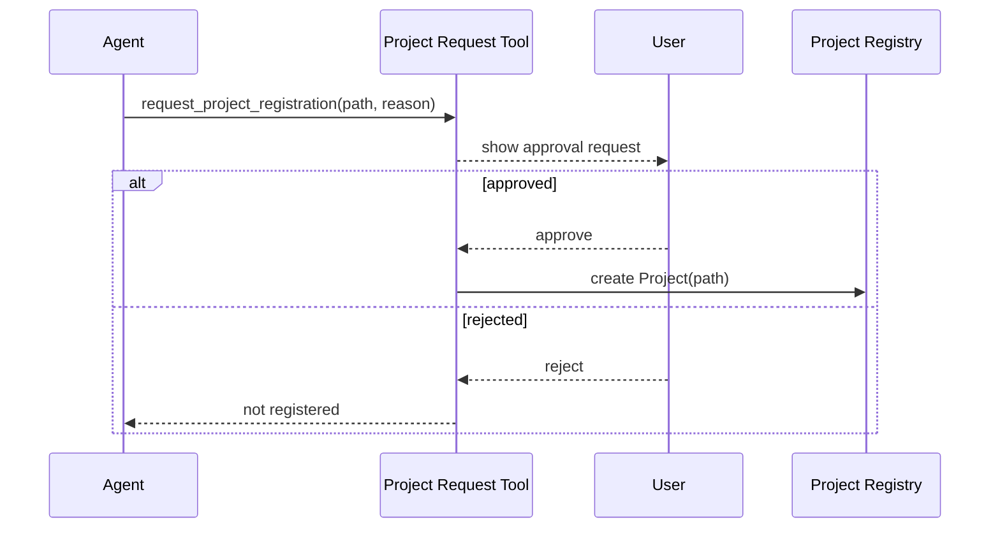
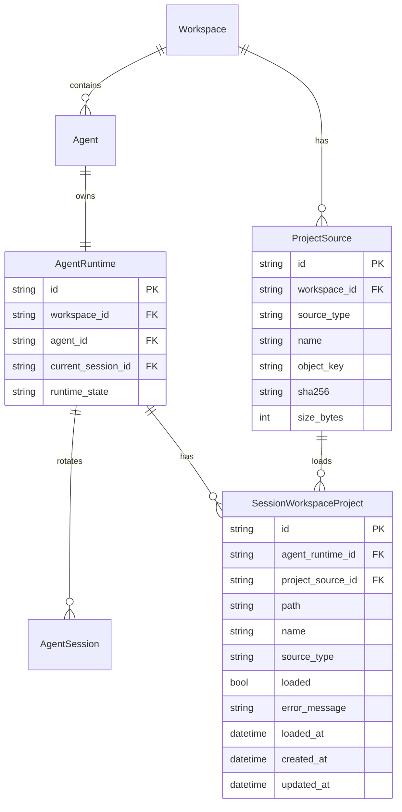
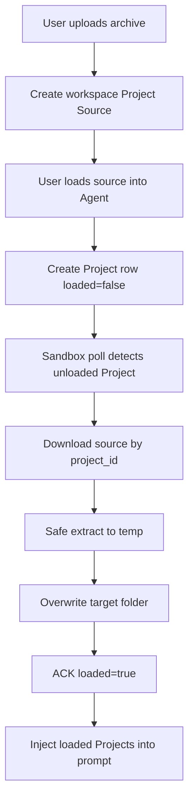

# Session Workspace Project Contract

## Overview

This document organizes Session Workspace / Project contract finalized in #3367 and Discussion #3541 into implementable form. Terminology cleanup (#3532) is assumed to proceed in separate session, and this document uses following definitions.

- **Workspace**: top-level unit of NoIntern service. Space where users create agents and collaborate.
- **Session Workspace**: storage space where Agent works in a session. Current root is `/home/sandbox`.
- **Project Source**: reusable source uploaded to Workspace that Agent can load as Project. MVP supports only archive upload.
- **Project**: actual result of a Project Source or empty-folder request being loaded into specific Agent's Session Workspace. DB row tracks load request and status, but Project injected into prompt is only row with `loaded=true`.

Goal is to keep `/home/sandbox` as Agent long-term workspace, but limit active configuration discovery scope, such as `AGENTS.md` and future skills, to registered Projects. Detailed AGENTS.md load method and hook system are separated into #3542.

## User Scenarios

1. Each Agent has long-term Session Workspace root.
   - root is `/home/sandbox`.
   - Agent stores important data and files for continued use under this path.
2. `/home/sandbox` can contain multiple work folders.
   - git repository, normal folder, and artifact folder can coexist.
   - One Agent manages multiple repos and work folders long-term.
3. Explicitly designated long-term work folder is called Project.
   - `/home/sandbox` itself is not a Project.
   - project-scoped active configuration is discovered/loaded only inside folder designated as Project.
4. User can upload archive as Project Source and repeatedly load it into multiple Agents in same Workspace.
5. User can request loading Project Source archive or empty folder as Project during Agent creation or active Agent UI/API.
6. Agent can request user to register specific folder as Project through tool.
7. If Project folder is deleted from filesystem, it is also removed from Project registry.
8. Git repository source is enabled in follow-up phase that introduces Temporal-based external ingest. MVP public API supports only archive upload and empty folder.

## Current Code Baseline

- `AgentRuntime` is one row per agent and owns long-term runtime identity and sandbox lifecycle state.
- `AgentSession` is current UI/API boundary rotated by reset/new/compact/recovery.
- shell/file tool prompt already describes `/home/sandbox` as durable working directory.
- Workspace File API uses `/home/sandbox` as root and does not start implicit restore on read/list.
- `sandbox_checkpoints` + S3/RustFS object are checkpoint artifacts for long-term recovery of `/home/sandbox/**`.
- Project registry, Project Source, prompt Project list injection, and Project registration request tool/API do not exist yet.

## Decisions

### 1. Session Workspace ownership

Durable owner of Session Workspace is `AgentRuntime`. `AgentSession` is current UI/API view boundary.

| Concept | Responsibility |
|---|---|
| `AgentRuntime` | Session Workspace durable owner, sandbox lifecycle, checkpoint/restore state |
| `AgentSession` | current conversation and UI/API access boundary |
| `/home/sandbox` | Session Workspace root materialized in active sandbox |
| S3 checkpoint | long-term persistence backend for `/home/sandbox/**` |

Session reset/new/compact/recovery does not delete Session Workspace. File deletion or initialization happens only through separate explicit action.

### 2. Project Source / Project model

Project Source is Workspace scoped reusable source, and Project is AgentRuntime scoped loaded result.

- `ProjectSource` belongs to Workspace.
- MVP `ProjectSource` is created by archive upload.
- One `ProjectSource` can be repeatedly loaded into multiple Agents in same Workspace.
- Project Source deletion is hard delete. If referenced by `loaded=false` Project, reject deletion. If referenced only by `loaded=true` Project, deletion is allowed and already loaded Project is maintained.

Project is single-root model with one folder root under `/home/sandbox`.

- `/home/sandbox` itself is not a Project.
- Each Project has single root path such as `/home/sandbox/<project-folder>`.
- Project includes folder loaded from archive, empty folder, and normal folder created by Agent.
- If UX becomes complex later due to many worktree/related Projects, consider separate Project Group feature. Do not introduce multi-root Project now.
- nested Project is prohibited in MVP.
- symlink root is not allowed.

### 3. Project registry / load state

Project registry is DB canonical. filesystem is loaded state.

- DB row can be created with `loaded=false`. It transitions to `loaded=true` when sandbox pulls/applies and ACKs.
- Prompt Project list injects only `loaded=true` Project.
- UI can display `loaded=false` Project as loading/failed state.
- If Project folder is deleted from filesystem, reconcile also removes it from DB registry.
- Do not keep missing path as stale Project.
- missing-path reconcile runs only when sandbox is materialized/READY and `/home/sandbox` can be actually inspected. Do not remove DB Project simply because mount is absent in inactive/hibernated/pause state.

### 4. Project Source upload / Project load lifecycle

Archive upload uses Project-dedicated multipart API. `exchange://` is chat/session exchange data, so it is not used as Project Source.

```text
POST /api/v1/chat/agents/{agent_id}/project-sources/archive
→ create workspace scoped ProjectSource
```

Project load request reuses existing `/projects/bootstrap` route, but meaning is Project load row creation to be pulled/ACKed by sandbox, not server-side job.

```text
POST /api/v1/chat/agents/{agent_id}/projects/bootstrap
source_type = archive_upload | empty_folder
source_ref = project_source_id  # for archive_upload
```

Server validates Agent Workspace matches ProjectSource Workspace, and creates `session_workspace_projects` row with `loaded=false`. Regardless of active/inactive state, actual filesystem apply is performed by sandbox daemon.

States:

| State | Meaning |
|---|---|
| `loaded=false`, `load_error_message=null` | sandbox has not loaded Project yet |
| `loaded=false`, `load_error_message!=null` | sandbox apply failed. not injected into prompt |
| `loaded=true` | sandbox apply complete. exposed as prompt/UI Project |

Sandbox daemon queries `loaded=false` Project on execution start and periodically during execution. source download is allowed only by project id, not source id.

```text
GET  /runtime/projects/{project_id}/source
POST /runtime/projects/{project_id}/ack
```

Server validates runtime credential `agent_runtime_id` matches `project.agent_runtime_id`. Even if sandbox knows arbitrary source id, it cannot download source not registered to that Agent.

### 5. Agent-initiated registration

Folders directly created/discovered by Agent through shell do not automatically become Project. Agent can send Project registration request to user through tool.



Before approval, folder is normal folder and not target of project-scoped active configuration discovery. For repeated request UX, consider suppression/rate-limit during implementation.

### 6. Git source / Temporal follow-up

`git_repo` is disabled in MVP. Because private repo authentication, clone/fetch, package, retry, and cancel are external ingest needs, implement as separate phase with Temporal workflow/activity introduction. MVP does not pass external Git credential to sandbox.

### 7. Prompt injection

Project list is injected into agent system/tool prompt. This helps Agent continuously recognize Session Workspace structure and registered Project boundary.

Example:

```markdown
## Session Workspace

Your durable Session Workspace is `/home/sandbox`.

Registered Projects:

- `azents` — `/home/sandbox/azents`
- `azents-wt-issue-123` — `/home/sandbox/azents-wt-issue-123`

`/home/sandbox` itself is not a Project. Project-scoped instructions are only
loaded inside registered Projects. Important durable files should be stored under
`/home/sandbox`.
```

### 8. Separate AGENTS.md and skill

Detailed AGENTS.md loading implementation is separated into #3542. This contract assumes only the following.

- `/home/sandbox/AGENTS.md` is workspace-wide instruction.
- Project boundary can be used for future project-scoped `AGENTS.md` and skill discovery.
- How to load root AGENTS.md in pause/hibernated state and how to load child AGENTS.md with tool hook are decided in #3542.

Skill DB snapshot and skill load details are handled in #3334 or separate skill design issue.

## Architecture





## Data Model

### `session_workspace_project_sources`

| Field | Type | Note |
|---|---|---|
| `id` | str(32) | uuid7 hex |
| `workspace_id` | FK `workspaces.id` | reuse scope |
| `name` | str | UI display name |
| `source_type` | enum | MVP: `archive_upload` |
| `object_key` | text | archive object storage key |
| `filename` | str | original file name |
| `media_type` | str nullable | upload content type |
| `size_bytes` | int | size limit validation result |
| `sha256` | str | integrity/audit |
| `created_by_user_id` | FK `users.id` | audit |
| `created_at` / `updated_at` | timestamptz | audit |

Project Source is hard deleted. On deletion, delete object storage artifact and DB row together. Reject deletion if same source is referenced by `loaded=false` Project. `loaded=true` Project is already loaded result in sandbox and remains after source deletion.

### `session_workspace_projects`

| Field | Type | Note |
|---|---|---|
| `id` | str(32) | uuid7 hex |
| `agent_runtime_id` | FK `agent_runtimes.id` | Session Workspace owner |
| `project_source_id` | FK nullable | archive upload source. empty folder/agent request can be null |
| `name` | str | prompt/UI display name |
| `path` | str | absolute path under `/home/sandbox` |
| `source_type` | enum | `empty_folder` / `archive_upload` / `agent_request` |
| `loaded` | bool | whether sandbox apply completed |
| `load_error_message` | text nullable | sandbox apply failure message |
| `loaded_at` | timestamptz nullable | sandbox ACK time |
| `created_at` / `updated_at` | timestamptz | audit |

`loaded=false` row is desired load to be processed by sandbox. Product-meaning Project and prompt injection target are only `loaded=true` row. When Project folder is deleted, registry row is removed.

Constraints:

- `(agent_runtime_id, path)` unique
- `path` must be under `/home/sandbox/` prefix.
- `path = /home/sandbox` is prohibited.
- Must not be nested relation with another Project path.
- Project root must be real directory, not symlink. This check is performed in service layer during active sandbox materialization/reconcile.

## API / Tool contract

Initial implementation keeps backend API and engine tool contract at following level.

### Public API

- `GET /api/v1/chat/agents/{agent_id}/projects`
  - Query Project list by AgentRuntime. Prompt use only uses `loaded=true`.
- `POST /api/v1/chat/agents/{agent_id}/project-sources/archive`
  - Upload multipart archive as workspace scoped Project Source.
- `GET /api/v1/chat/agents/{agent_id}/project-sources`
  - Query reusable Project Source list for Agent Workspace.
- `DELETE /api/v1/chat/project-sources/{source_id}`
  - Hard delete Project Source. Reject if referenced by `loaded=false` Project.
- `POST /api/v1/chat/agents/{agent_id}/projects/bootstrap`
  - Create Project row as `loaded=false` to load `empty_folder` or `archive_upload` source into Agent. `archive_upload.source_ref` is Project Source ID.
- `DELETE /api/v1/chat/agents/{agent_id}/projects/{project_id}`
  - Remove from Project registry.
  - Filesystem folder deletion is destructive action, so not included in default behavior of this API. If user wants file deletion too, handle as separate explicit delete action.

### Engine tool

- `request_project_registration(path, reason)`
  - Agent requests user approval.
  - If approved, add to Project registry.

### Runtime API

- `GET /api/v1/runtime/projects`
  - Query `loaded=false` Project belonging to AgentRuntime of runtime credential.
- `GET /api/v1/runtime/projects/{project_id}/source`
  - Download source archive by project id. There is no direct source id download.
- `POST /api/v1/runtime/projects/{project_id}/ack`
  - Report sandbox apply success/failure. On success store `loaded=true`; on failure store `load_error_message`.

## Feasibility Verification

| Item | Result |
|---|---|
| `AgentRuntime` owner | already exists as one row per agent |
| `/home/sandbox` root | exists in shell prompt / Workspace File API / checkpoint lifecycle |
| Project Source storage | existing S3/RustFS service and upload hash/size calculation pattern reusable. `exchange://` not used |
| DB registry | can add Project Source and loaded Project state with existing repository/service/API pattern |
| Sandbox pull/ACK | sandbox-control stream is for push-based exec/file. MVP implements with sandbox daemon polling + runtime API |
| Project prompt injection | `SandboxToolkit._render_config_prompt()` already injects Session Workspace guidance. possible by adding Project service query |
| AGENTS.md loading | separated into #3542 |

## testenv QA Scenarios

1. `TC-SW-PROJ-001`: empty folder Project load
   - seed: create user/workspace/agent
   - action: call Project load API → sandbox poll/apply/ACK
   - expect: Project `loaded=true`, path shown in Project list, folder exists in sandbox
2. `TC-SW-PROJ-002`: archive Project Source reuse
   - seed: create one archive upload source
   - action: request loading same source into two Agents → each sandbox poll/apply/ACK
   - expect: both Agents have `loaded=true` Project, source is not deleted
3. `TC-SW-PROJ-003`: Project Source hard delete guard
   - action: try deleting source referenced by `loaded=false` Project
   - expect: deletion rejected. After apply completes, deletion deletes source object/row and keeps loaded Project
4. `TC-SW-PROJ-004`: Project folder delete reconcile
   - action: delete Project folder in active sandbox and run reconcile
   - expect: Project registry row removed and disappears from prompt list
5. `TC-SW-PROJ-005`: Agent registration request approval
   - action: create tool request → approval API
   - expect: `loaded=true` Project registry added

## testenv Impact

- new seed helper: Project Source archive upload/helper
- new TC handler: Session Workspace Project lifecycle scenarios
- no devserver infra change
- git repo source is handled as separate QA after Temporal introduction.

## Implementation Plan

1. **Phase 1 — DB registry and repository/service**
   - Add Project Source / Project load state enum, RDB model, Alembic migration, repository, service.
2. **Phase 2 — API and prompt injection**
   - Add Project Source archive upload/list/delete API, Project load API, prompt injection.
3. **Phase 3 — Sandbox pull/ACK and reconcile**
   - Implement runtime project polling/source download/ACK API and sandbox puller.
   - Implement missing Project folder reconcile.
4. **Phase 4 — Agent registration request tool/API**
   - Implement Agent initiated request lifecycle and approval API.
5. **Phase 5 — frontend UI**
   - Add Project control surface to agent chat screen.
6. **Phase 6 — testenv QA**
   - Write and run scenarios above.
7. **Phase 7 — spec impact + promotion**
   - Finalize spec impact scope and reflect spec based on documented QA scenarios and implementation diff.
8. **Phase 8 — cleanup**
   - design archive, update workspace/conversation spec.

## Alternatives Considered

### Project registry source of truth

- **DB canonical** — adopted. Can provide Project list reliably to prompt/UI even in inactive state. folder missing is removed by reconcile.
- filesystem marker canonical — rejected. difficult to query list when sandbox inactive.
- DB + marker dual canonical — rejected. sync/reconcile complexity increases.

### Project path model

- **Single root Project** — adopted. Model is simple, and worktree can be solved by auto-registering separate Project on tool/API creation.
- Multi-root Project — rejected. Decided not to store git metadata in Project contract, and repo-level grouping has little benefit. Consider Project Group separately if UX becomes complex.

### Bootstrap lifecycle

- Async bootstrap job + server-side active sandbox exec — rejected. If active sandbox is already running, AFTER_START does not reoccur, and inactive vs active semantics diverge.
- Separate Project Inbox delivery table — rejected. `loaded=false` desired state can be expressed with Project Source and Project row alone, so concept is excessive.
- **Project Source + Project `loaded=false/true`** — adopted. Project Source is Workspace scoped reusable source, and Project row has AgentRuntime scoped load state.

### Archive upload source

- Reuse `exchange://uploads/{id}` — rejected. ExchangeFile is chat/session exchange data, so it does not match Project Source lifecycle, hard delete, or reuse semantics.
- **Project Source dedicated multipart upload** — adopted. Sufficient for MVP, and existing upload/storage patterns are reused while URI/lifecycle are separated.

### Git source

- Support public/private git clone in MVP — rejected. Requires external auth, clone/fetch, retry/cancel, artifact packaging.
- **follow-up implementation with Temporal introduction** — adopted. Git source remains future source type of Project Source but disabled in public MVP.

### AGENTS.md loading

- Detailed implementation in #3367 — rejected. Root AGENTS.md inactive load and child AGENTS.md tool hook require separate design.
- **Separate into #3542** — adopted.

## Related Links

- Issue #3367: workspace definition, bootstrap, save, load criteria
- Discussion #3541: Session Workspace Project contract design
- Issue #3542: AGENTS.md loading criteria and hook system design
