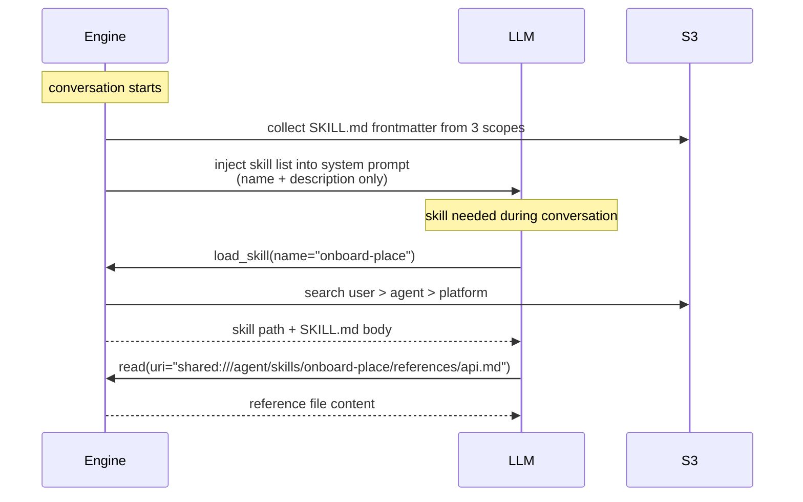

# Shared Storage & Skill System Design

## Overview

Provide agent with **persistent filesystem** across sessions. Skills (procedural knowledge), memory (long-term memory), settings, and similar data are implemented as **folder conventions** on this filesystem.

## Implementation Status (2026-04-24)

This body remains original design document. Actual implementation differs from original design at points below. When reading code, interpret this document based on this section.

- **URI scheme not adopted**: `shared:///` URI scheme was not introduced. Actual code uses only absolute paths (`engine/tools/load_skill.py:18` `_SEARCH_PREFIXES = ("/data/user", "/data/agent", "/platform")`, `engine/tools/shell.py:299-302` `"/data/agent/memories/MEMORIES.md"`, `f"/data/user/{user_id}/memories/MEMORIES.md"`). Read `shared:///agent/`, `shared:///user/`, `shared:///platform/` in body as `/data/agent/`, `/data/user/{user_id}/`, `/platform/` respectively.
- **`shared:///session/` scope not adopted**: session scope continues to be handled by separate layer (`LazySandboxStorage`, sandbox daemon), not Shared Storage. Fourth scope is currently not part of skills/memory system.
- **Storage medium**: It is not "S3 (RustFS)" but **EFS + sandbox-daemon File-API facade**.
  - K8s: PVC `agent-home-efs` subPath `agents/{agent_id}/data` is mounted at `/data` (`runtime/sandbox/agent_home_k8s.py:463-474`).
  - Docker: host bind `{data_dir}:/data` (`runtime/sandbox/agent_home_docker.py:89`).
  - Main container and sandbox-daemon container share same mount. daemon exposes same path externally as HTTP File-API (`agent_home_docker.py:15, 285`).
  - Therefore `FileApiClient` (`services/file_api_client.py`) is not a separate remote S3 service but **HTTP facade to daemon inside agent-home pod**. File bytes are on EFS.
- **FileApiClient arguments**: only `agent_id` is required. `workspace_id / session_id / user_id / SharedScope` enum-based resolve in design was not adopted. Path itself is scope, so caller assembles absolute path and passes it.
- **`/platform`**: not actually mounted inside container, served as virtual path by daemon side. S3 deployment section for Platform skills (§ Phase 5) is currently planned state, and production deployment method needs separate decision.
- **`shared-data` API / `session-data` renaming**: `shared-data` endpoint and `SessionExplorer` 4-scope extension in § API Design and § Frontend Design are not yet confirmed as adopted. Read them as original plan, not current code baseline.
- **`sharedfs` CLI**: `sharedfs ls shared:///...` examples in § sharedfs CLI section are original design state. Current agent directly calls file tools (read/write/edit/glob/grep/delete) with absolute paths.

### Core Principles

- **Filesystem + prompt**: works with file tools + prompt guide, without separate skill loader or memory system.
- **EFS only**: EFS (sandbox-daemon File-API facade) is the only storage without DB model. There are no RDB tables dedicated to memory/skills; only `RDBAgent.memory_enabled` flag exists.
- **Use existing infrastructure**: extend SessionDataStorage, File Gateway, sharedfs CLI patterns.

### References

- Agent Skills standard: https://platform.claude.com/docs/ko/agents-and-tools/agent-skills/overview

## Shared Storage

### Scope

Provide four isolated scopes through single `shared:///` URI scheme.

| Scope | URI | Isolation unit | Permission | Lifecycle |
|--------|-----|----------|------|----------|
| **platform** | `shared:///platform/` | shared globally | read-only | permanent |
| **agent** | `shared:///agent/` | one per agent | read/write | permanent |
| **user** | `shared:///user/` | one per agent×user | read/write | permanent |
| **session** | `shared:///session/` | one per session | read/write | session |

- `platform`: built-in skills and common guides provided by NoIntern.
- `agent`: agent knowledge, skills, settings (shared across sessions for all users).
- `user`: per-user memory and preference (not visible to other users).
- `session`: current session files (existing SessionDataStorage).

### Write Permission

- `platform`: technically read-only (agent cannot write).
- `agent`, `user`, `session`: no technical restriction, read/write.
- Writing to `agent` scope can affect all users — this is **guided in prompt**.

### URI Scheme Migration

Unify existing `session:///` scheme into `shared:///session/`.

```
# Before
session:///file.txt

# After
shared:///session/file.txt
```

### S3 Path Mapping

```
shared:///platform/{path}
→ s3://{bucket}/{prefix}/platform/{path}

shared:///agent/{path}
→ s3://{bucket}/{prefix}/{workspace_id}/agents/{agent_id}/{path}

shared:///user/{path}
→ s3://{bucket}/{prefix}/{workspace_id}/agents/{agent_id}/users/{user_id}/{path}

shared:///session/{path}
→ s3://{bucket}/{prefix}/{workspace_id}/{session_id}/session/{path}
```

Engine resolves URI to actual S3 path using current context (workspace_id, agent_id, user_id, session_id).

## File Tools (Engine Level)

Engine-level tools that let agent manipulate files directly without sandbox. Modeled after Claude Code file tools.

### Tool List

| Tool | Description | Note |
|------|------|------|
| `read` | read text file (offset/limit) | rename existing `read_text` |
| `write` | create/overwrite file | new |
| `edit` | string replacement (old_string → new_string) | new |
| `glob` | pattern-based file search | new |
| `grep` | content search | new |
| `delete` | delete file | rename existing `delete_file` |
| `read_image` | read image (for LLM visual inspection) | keep existing |
| `present_file` | share file with user | keep existing |

### edit Tool Spec

Same behavior as Claude Code Edit tool:

- **Input**: `uri`, `old_string`, `new_string`, `replace_all` (default false)
- **Behavior**: find `old_string` in file and replace with `new_string`
- **Constraint**: fail if `old_string` is not unique in file (when `replace_all=false`)
- Not regex, plain string match

### URI for All Tools

All file tools use `shared:///` URI:

```
read(uri="shared:///agent/skills/onboard/SKILL.md")
write(uri="shared:///user/memories/prefs.md", content="...")
edit(uri="shared:///agent/config.yaml", old_string="v1", new_string="v2")
glob(pattern="shared:///agent/skills/*/SKILL.md")
grep(pattern="deploy", path="shared:///agent/skills/")
```

## sharedfs CLI Extension

CLI used by agent inside sandbox also supports new scheme.

```bash
# Before (session only)
sharedfs ls session:///
sharedfs cat session:///file.txt

# After (4 scopes supported)
sharedfs ls shared:///agent/skills/
sharedfs cat shared:///platform/guides/coding-style.md
sharedfs cp shared:///agent/skills/analyze/scripts/run.py ./
python ./run.py
```

Add scope-specific path resolve logic to File Gateway sidecar.

## Skill System

Implemented as **folder convention** on Shared Storage.

### Definition of Skill

Agent's **long-term memory + procedural knowledge**. Knowledge module loaded when needed because everything cannot fit in system prompt.

### Skill Storage Location

```
shared:///platform/skills/{name}/SKILL.md    # built-in skill
shared:///agent/skills/{name}/SKILL.md       # agent skill
shared:///user/skills/{name}/SKILL.md        # user skill
```

### SKILL.md Format

YAML frontmatter + Markdown instructions:

```markdown
---
name: onboard-place
description: Onboard a place from Google Map URL and create menus.
---

# Place Onboarding Skill

## Tools to Use
...

## Usage
...
```

### Progressive Disclosure



1. **Conversation start**: Inject skill list (name + description) from three scopes (user, agent, platform) into system prompt.
2. **load_skill call**: Search skill by name (user → agent → platform order), return body.
3. **Additional exploration**: Use generic file tools such as `read`, `glob` to explore reference files.

### load_skill Tool

Only this dedicated skill tool is provided:

- **Input**: `name` (skill name)
- **Search order**: `shared:///user/skills/` → `shared:///agent/skills/` → `shared:///platform/skills/`
- **Output**: skill path + SKILL.md body
- **Name collision**: At conversation start, collect skill lists from three scopes and warn in system prompt if same name exists. Structure where user overrides agent/platform.

### Skill Management

Initially, agent creates/updates directly with `write` tool:

```
write(uri="shared:///agent/skills/new-skill/SKILL.md", content="---\nname: new-skill\n...")
```

Web UI-based skill management will be implemented later.

### Prompt Guide Example

```markdown
## Shared Storage

You have persistent file storage across sessions:

- shared:///platform/ — Built-in knowledge (read-only)
- shared:///agent/ — Agent-wide storage (shared across all users and sessions)
- shared:///user/ — Your memory about the current user (private per user)
- shared:///session/ — Current session files

Use `read`, `write`, `edit`, `glob`, `grep`, `delete` tools to interact.

### Important

- Writing to shared:///agent/ affects ALL users of this agent.
  Be careful when modifying agent-level data.
- shared:///user/ is private to the current user.
  Use it for user preferences, conversation history summaries, etc.
- shared:///platform/ is read-only.

### Skills

Skills are stored in {scope}/skills/{name}/SKILL.md.
Use `load_skill` to load a skill by name.
```

## API Design

### Endpoints

Extend existing `session-data` API to `shared-data`. All scopes are accessible with one session ID.

```
GET    /sessions/{session_id}/shared-data/{scope}/{path}   # file download
GET    /sessions/{session_id}/shared-data/{scope}/          # file list
DELETE /sessions/{session_id}/shared-data/{scope}/{path}   # file delete
POST   /sessions/{session_id}/upload                        # file upload (existing)
```

`{scope}` is one of `session`, `agent`, `user`, `platform`.

### Permission Check

Unify all scopes with **session ownership check** only:

1. Extract `user_id` from JWT.
2. Query session by `session_id` → verify owner.
3. Extract `agent_id`, `workspace_id` from session → resolve S3 path.

| Scope | Additional permission check |
|--------|---------------|
| session | none (session owner) |
| user | none (confirm user_id from session) |
| agent | none (confirm agent_id from session) |
| platform | allow read only |

### Existing API Migration

```
# Before
GET /sessions/{session_id}/session-data/{filename}

# After
GET /sessions/{session_id}/shared-data/session/{filename}
```

Deprecate then remove existing `session-data` endpoint.

## Frontend Design

### SessionExplorer Extension

Extend existing `SessionExplorer` component to show four scopes as root folders:

```
📁 session/       ← current session files
📁 agent/         ← agent shared data
📁 user/          ← per-user data
📁 platform/      ← built-in (read-only)
```

Use existing explorer UI as-is without separate page or component.

## Implementation Order

### Phase 1: Shared Storage Infrastructure (complete)

1. ~~Extend `SessionDataStorage` → `SharedDataStorage` (resolve 4 scopes)~~
2. ~~Implement `shared:///` URI parser~~
3. ~~Migrate existing `session:///` → `shared:///session/`~~
4. ~~Add new scope support to File Gateway~~
5. ~~Add `shared:///` scheme to sharedfs CLI~~

### Phase 2: File Tools (complete)

1. ~~Rename `read_text` → `read`~~
2. ~~Rename `delete_file` → `delete`~~
3. ~~Implement `write` tool~~
4. ~~Implement `edit` tool~~
5. ~~Implement `glob` tool~~
6. ~~Implement `grep` tool~~

### Phase 3: Skill System (complete)

1. ~~Implement `load_skill` tool (search user > agent > platform)~~
2. ~~Inject skill list into system prompt~~
3. ~~Detect and warn name collisions~~
4. ~~Write prompt guide~~

### Phase 4: API & Frontend

1. Implement `shared-data` API endpoints.
2. Deprecate existing `session-data`.
3. Extend SessionExplorer (4-scope root folders).
4. Update tRPC router.

### Phase 5: Platform Skills

1. Write platform skill contents.
2. Decide and implement S3 deployment method.

## Platform Skill Management

### Source Location

Built-in skills are managed in codebase:

```
python/apps/nointern/platform-skills/
├── skill-creator/
│   └── SKILL.md
└── (additional built-in skills)
```

### S3 Deployment

How to upload this folder's content to `shared:///platform/skills/` will be decided later. (deployment script, CI/CD pipeline, manual sync, etc.)
