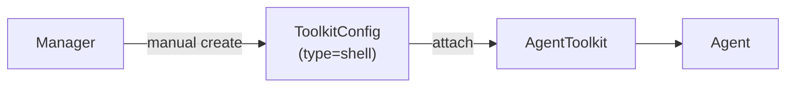
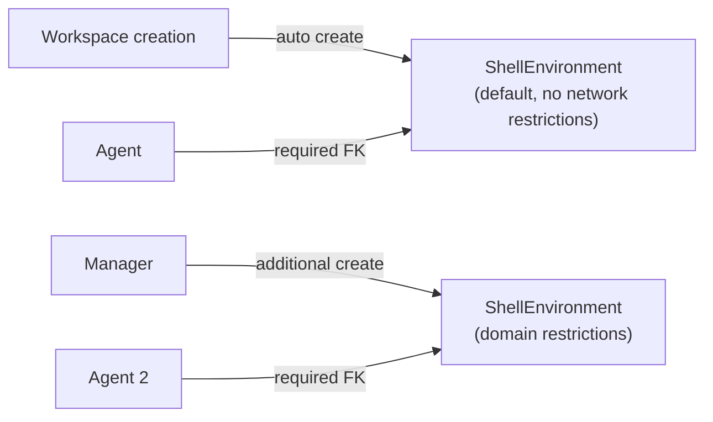
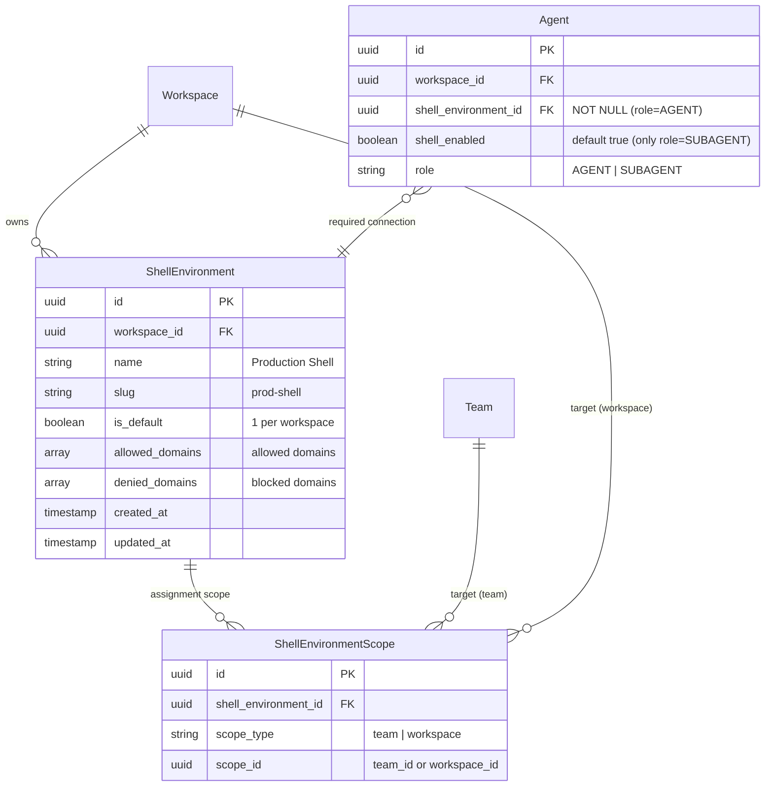
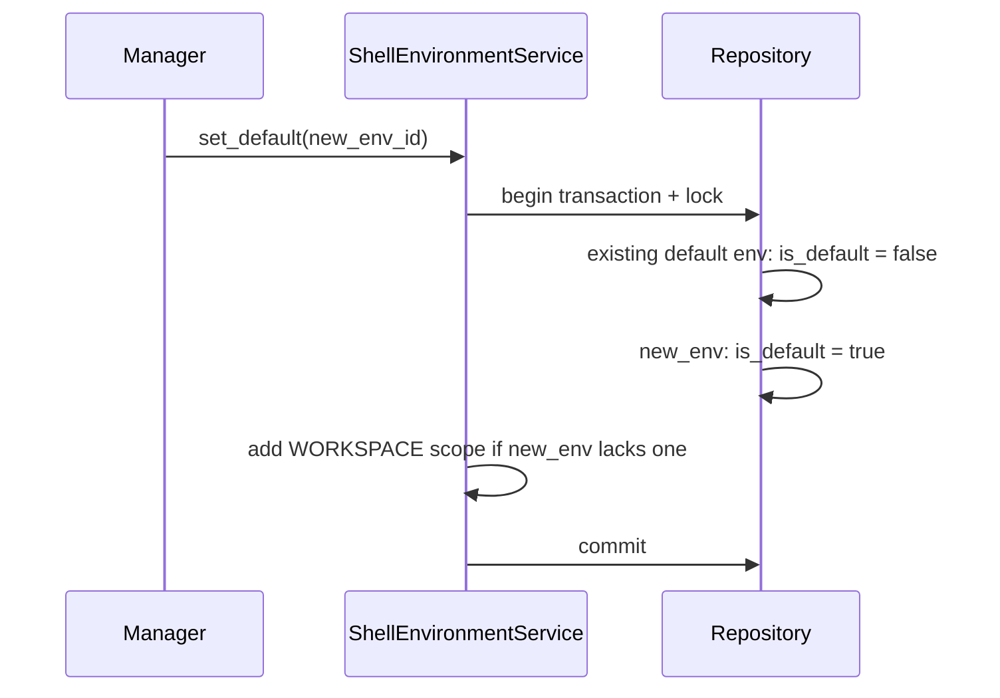
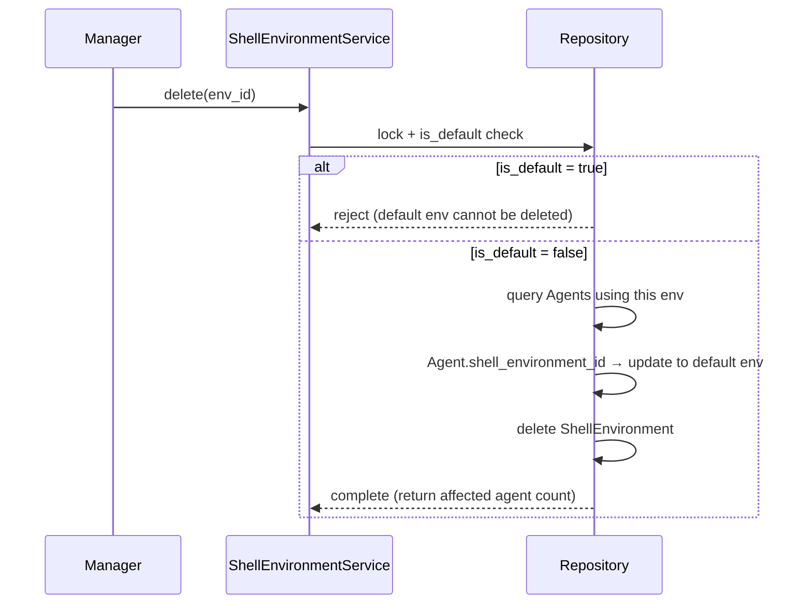
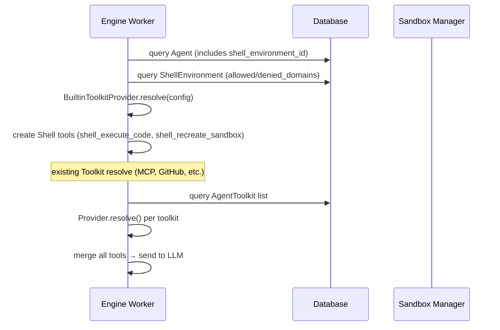
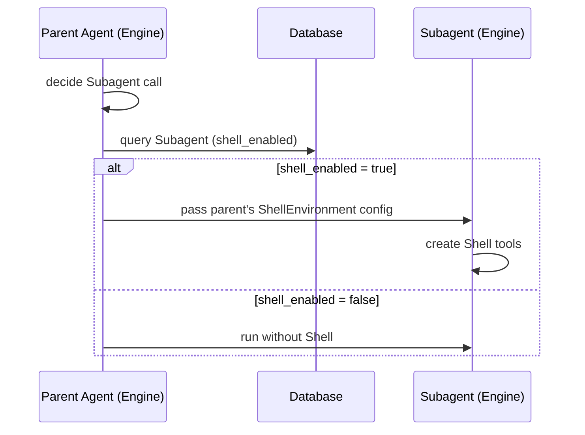
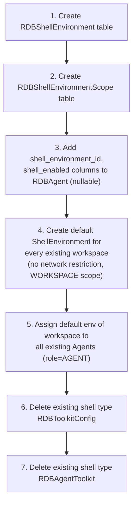

# ShellEnvironment Design

## Overview

Separate Shell toolkit execution environment settings (domain restrictions, etc.) into separate entity named **ShellEnvironment**. Shell is core agent feature and is provided by default, while environment settings are managed as reusable units.

### Motivation

Currently Shell is managed as toolkit config, same as MCP and GitHub. This creates two problems:

1. **Unnecessary setup step**: Without Shell, agent capabilities are greatly limited, but using it requires manually creating toolkit config.
2. **Concept mismatch**: Slack/Discord are auto-bound based on interface and do not require toolkit config creation, while Shell requires manual creation.

Introducing ShellEnvironment makes Shell available by default like Slack/Discord while flexibly managing settings such as domain restrictions.

### Core Design Principles

| Principle | Description |
|------|------|
| **Provided by default** | create default ShellEnvironment automatically on workspace creation, immediately usable |
| **Required connection** | Agent (`role=AGENT`) must have ShellEnvironment |
| **Reuse** | one ShellEnvironment can be shared by multiple agents |
| **Default env protection** | default ShellEnvironment cannot be deleted, and is fallback target on deletion |

## Current Structure vs After Change

### Current: Shell = Toolkit Config



- Manager manually creates Shell toolkit config.
- Managed by attach/detach to agent.
- Agent without Shell is possible (unintentionally).

### After Change: Shell = ShellEnvironment (provided by default)



- Default ShellEnvironment automatically created on workspace creation.
- ShellEnvironment required selection on Agent creation (default: default env).
- toolkit config creation/attach step unnecessary.

## Domain Model

### Entity Relationship



### ShellEnvironment

```python
class RDBShellEnvironment(Base):
    """Shell execution environment settings. Manages domain restrictions etc."""

    __tablename__ = "shell_environments"

    id: Mapped[uuid.UUID]
    workspace_id: Mapped[uuid.UUID]              # FK → workspaces
    name: Mapped[str]                            # "Production Shell", "Open Shell"
    slug: Mapped[str]                            # unique within workspace
    is_default: Mapped[bool]                     # exactly 1 per workspace
    allowed_domains: Mapped[list[str]]           # allowed domains (empty means allow all)
    denied_domains: Mapped[list[str]]            # blocked domains (always priority)
    created_at: Mapped[datetime]
    updated_at: Mapped[datetime]

    # Constraints
    UQ_WORKSPACE_SLUG = UniqueConstraint("workspace_id", "slug")
    IX_WORKSPACE_DEFAULT = Index(
        "workspace_id",
        unique=True,
        postgresql_where=text("is_default = true"),
    )  # exactly one default env per workspace
```

> `allowed_domains`, `denied_domains` are defined as individual columns. ShellEnvironment has single type and does not need polymorphism, so use explicit columns instead of JSON column. Future settings are handled by adding columns through migration.

### Agent Model Change

```python
class RDBAgent(Base):
    # ... existing fields ...

    # ShellEnvironment connection (required when role=AGENT)
    shell_environment_id: Mapped[uuid.UUID | None]  # FK → shell_environments
    # Whether Subagent Shell is enabled (meaningful only when role=SUBAGENT)
    shell_enabled: Mapped[bool] = mapped_column(default=True)
```

**Shell behavior by role:**

| Role | `shell_environment_id` | `shell_enabled` | Shell behavior |
|------|----------------------|----------------|-----------|
| AGENT | required (NOT NULL service-layer validation) | ignored | use specified ShellEnvironment |
| SUBAGENT | NULL (always) | True (default) | inherit parent Agent env at runtime |
| SUBAGENT | NULL | False | Shell disabled |

> Reason not to put `shell_environment_id` on Subagent: Agent:Subagent is N:M relationship, so each parent can have different env. Subagent Shell setting inherits env of calling parent at runtime.
>
> Subagent Shell disable use case: Some LLM APIs (e.g. Gemini Google Search) reject API calls if tools other than specific tool exist. Set `shell_enabled=False` in this case.

### ShellEnvironmentScope

Same pattern as existing `RDBToolkitScope`.

```python
class RDBShellEnvironmentScope(Base):
    """Available scope of ShellEnvironment."""

    __tablename__ = "shell_environment_scopes"

    id: Mapped[uuid.UUID]
    shell_environment_id: Mapped[uuid.UUID]     # FK → shell_environments
    scope_type: Mapped[ToolkitScopeType]        # TEAM | WORKSPACE
    scope_id: Mapped[uuid.UUID]                 # team_id or workspace_id
```

## Default ShellEnvironment

### Creation Time

Automatically created when workspace is created:

```python
async def create_with_owner(self, name, handle, user_id):
    workspace = await self._create_workspace(name, handle)
    await self._create_workspace_user(workspace.id, user_id, role=OWNER)

    # automatically create default ShellEnvironment
    default_env = await self._create_shell_environment(
        workspace_id=workspace.id,
        name="Default",
        slug="default",
        is_default=True,
        allowed_domains=[],   # no network restrictions
        denied_domains=[],
    )
    # default env must have WORKSPACE scope
    await self._create_shell_environment_scope(
        shell_environment_id=default_env.id,
        scope_type=WORKSPACE,
        scope_id=workspace.id,
    )
```

### Protection Policy

| Policy | Description | Implementation location |
|------|------|----------|
| **Cannot delete** | reject deletion for env with `is_default=True` | Repository layer (lock + check) |
| **Config editable** | allow domain setting change on default env | Service layer (return affected agent count) |
| **Default change allowed** | designate another env as new default | Service layer |
| **Guarantee WORKSPACE scope** | default env must have WORKSPACE scope | Service layer |

### Default env change flow



### Invariants

- **"default always has WORKSPACE scope"**: enforced in service layer
  - on default env creation: automatically grant WORKSPACE scope
  - on default change: automatically add WORKSPACE scope if new default env lacks it
  - attempt to delete WORKSPACE scope of default env: reject

### fallback on env deletion



## Permissions

### Permission Definition

```python
SHELL_ENVIRONMENTS_READ = Permission(Resource.SHELL_ENVIRONMENTS, Action.READ)
SHELL_ENVIRONMENTS_WRITE = Permission(Resource.SHELL_ENVIRONMENTS, Action.WRITE)
```

Same role mapping as Toolkit permissions, but managed independently:

| Operation | Owner | Manager | Member |
|------|-------|---------|--------|
| **Create/update/delete ShellEnvironment** | O | O | X |
| **Assign/unassign Scope** | O | O | X |
| Query ShellEnvironment list (available) | O | O | O |
| Select ShellEnvironment on Agent creation | O | O | O |

## API Design

### ShellEnvironment CRUD (Manager+)

```
POST   /workspaces/{handle}/shell-environments
GET    /workspaces/{handle}/shell-environments
GET    /workspaces/{handle}/shell-environments/available
GET    /workspaces/{handle}/shell-environments/{id}
PATCH  /workspaces/{handle}/shell-environments/{id}
DELETE /workspaces/{handle}/shell-environments/{id}
```

**POST /workspaces/{handle}/shell-environments**

```json
{
  "name": "Production Shell",
  "slug": "prod-shell",
  "allowed_domains": ["pypi.org", "registry.npmjs.org"],
  "denied_domains": []
}
```

WORKSPACE scope is automatically granted on creation.

**PATCH /workspaces/{handle}/shell-environments/{id}**

```json
{
  "name": "Production Shell (updated)",
  "allowed_domains": ["pypi.org", "registry.npmjs.org", "api.github.com"]
}
```

Response includes affected agent count.

**DELETE /workspaces/{handle}/shell-environments/{id}**

- `400 Bad Request` if `is_default=true`
- agents using that env fallback to default env
- response includes number of fallback agents

### Scope Management (Manager+)

```
POST   /workspaces/{handle}/shell-environments/{id}/scopes
GET    /workspaces/{handle}/shell-environments/{id}/scopes
DELETE /workspaces/{handle}/shell-environments/{id}/scopes/{scope_id}
```

Same pattern as existing Toolkit scope API.

### Agent API Change

Add `shell_environment_id` field to Agent create/update:

**POST /workspaces/{handle}/agents** (Agent creation)

```json
{
  "name": "Backend Bot",
  "llm_provider_integration_id": "...",
  "llm_provider_model": { "provider": "anthropic", "identifier": "claude-sonnet-4-6" },
  "shell_environment_id": "se_abc",
  "role": "agent"
}
```

- `shell_environment_id` required when `role=agent`
- if omitted, use workspace default ShellEnvironment
- validate requester can access that ShellEnvironment (scope based)

**POST /workspaces/{handle}/agents** (Subagent creation)

```json
{
  "name": "Google Search",
  "llm_provider_integration_id": "...",
  "llm_provider_model": { "provider": "google", "identifier": "gemini-2.5-flash" },
  "shell_enabled": false,
  "role": "subagent"
}
```

- ignore `shell_environment_id` when `role=subagent`
- `shell_enabled` (default true): whether Shell is enabled

## Runtime Integration

### Separate from existing Toolkit resolve path

Shell is no longer resolved through `RDBAgentToolkit`:



### Subagent Shell resolve



### Sandbox settings mapping

Existing `resolve_sandbox_config()` reads config from ShellEnvironment instead of AgentToolkit:

```python
def resolve_sandbox_config(shell_env: ShellEnvironment) -> SandboxConfig:
    """Derive Sandbox settings from ShellEnvironment."""
    return SandboxConfig(
        allowed_domains=shell_env.allowed_domains,
        denied_domains=shell_env.denied_domains,
    )
```

## Tool Naming

### Current problem

Current tool name prefix is generated as `{slug}__{tool_name}` based on toolkit config `slug`. This slug prevents duplicates with unique constraint within workspace.

However, Shell, Slack, Discord do not go through toolkit config, so if someone creates toolkit config with slug `"shell"`, prefix collides.

### Change: built-in tools include prefix in original name

Tools from built-in toolkits (Shell, Slack, Discord) **include prefix in name at definition time**:

```python
# Shell tools — shell_ included in original name
ToolSpec(name="shell_execute_code", ...)
ToolSpec(name="shell_recreate_sandbox", ...)

# Slack tools
ToolSpec(name="slack_read_channel_history", ...)
ToolSpec(name="slack_send_message", ...)

# Discord tools
ToolSpec(name="discord_read_channel_history", ...)
ToolSpec(name="discord_send_message", ...)
```

Only user-created toolkit configs (MCP, GitHub) apply `Tool.with_prefix(f"{slug}__")` at runtime:

```python
# MCP toolkit config (slug="weather")
ToolSpec(name="get_forecast", ...)  # original
# → with_prefix("weather__") → "weather__get_forecast"
```

| Category | Prefix method | Separator | Example |
|------|-----------|-------|------|
| built-in (Shell, Slack, Discord) | included in name at definition time | single `_` | `shell_execute_code` |
| user-created (MCP, GitHub) | runtime `with_prefix()` | double `__` | `weather__get_forecast` |

### ToolkitType enum cleanup

`ToolkitType.SHELL`, `ToolkitType.SLACK`, `ToolkitType.DISCORD` are currently defined in enum but not actually referenced by code. It operates only with each provider's `slug` string.

```python
class ToolkitType(enum.StrEnum):
    # TODO: SHELL, SLACK, DISCORD do not pass through toolkit config,
    # so they have no usage. Review whether to remove.
    SHELL = "shell"
    MCP = "mcp"
    SLACK = "slack"
    DISCORD = "discord"
    GITHUB = "github"
```

## UI Changes

### Workspace Settings

Remove Shell from Toolkit settings page and separate Shell Environments into independent section:

```
Settings
├── Shell Environments    ← new section
│   ├── Default (default, cannot delete)
│   ├── Production Shell
│   └── + Create new environment
├── Toolkits              ← Shell removed
│   ├── MCP Servers
│   └── GitHub
├── Teams
└── Members
```

**Shell Environment list:**

- Show "Default" badge on default env.
- Show number of agents using each env.
- Disable delete button for default env.

**Shell Environment deletion confirmation:**

- Show message: "N agents using this environment will switch to the default environment."

### Agent Create/Edit Form

```
Create Agent
├── Name: [          ]
├── LLM Model: [Claude Sonnet 4.6 ▾]
├── Shell Environment: [Default ▾]     ← new field (required, default selected)
├── Toolkits: [MCP, GitHub ▾]         ← Shell removed
└── ...
```

- `role=AGENT`: Shell Environment dropdown required (default env selected)
- `role=SUBAGENT`: show "Enable Shell" toggle instead of Shell Environment dropdown

## Migration

### Data Migration Order



> Individual domain settings from existing Shell toolkit config are not migrated. There are no actually customized settings, and every agent uses default env.

### Block Toolkit Config Creation

After migration completes, toolkit config creation API rejects `toolkit_type=shell`:

```python
async def create(self, toolkit_type: str, ...):
    if toolkit_type == "shell":
        raise BadRequest("Shell is managed as ShellEnvironment.")
    ...
```

## Related Documents

- [Agent Sandbox design](./agent-sandbox.md) — Sandbox isolation, network security, domain filtering
- [Toolkit assignment design](./toolkit-assignment.md) — Toolkit domain model, permissions, scope
