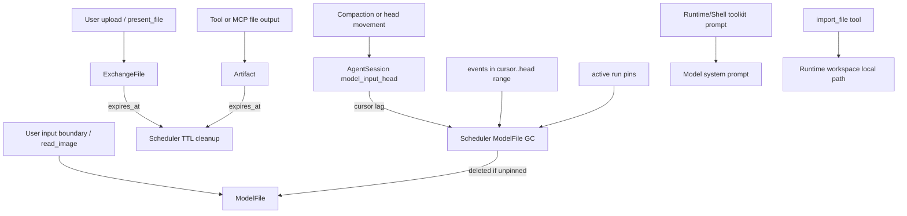

# Simplified File Lifecycle Policy Design

## Overview

This design implements [simplified-260627/ADR: Simplified File Lifecycle Policy](../adr/simplified-260627-simplified-file-lifecycle-policy.md). It replaces the current run-age Artifact cleanup and persistent ModelFile degradation lifecycle with a simpler split:

- **ModelFile** is context-owned. It is deleted after it falls behind the AgentSession model-input head and no active run pin protects it.
- **Artifact** is TTL-owned. It expires by configurable `expires_at`, default 7 days.
- **ExchangeFile** is TTL-owned. It keeps TTL semantics, but the retention duration becomes configurable instead of hard-coded.
- **Toolkit prompt** owns temporary file URI guidance. Runtime/import guidance is not global because future agents may not have a runtime.

The implementation should simplify existing code at the same time as it changes policy. The goal is not to move old complexity into a scheduler. The goal is to remove domain states and run-loop hooks that are no longer part of the policy.

## Requirements

### REQ-1. Remove synchronous file cleanup from Agent run input preparation

Agent run input preparation must not call Artifact, ExchangeFile, or ModelFile cleanup. File cleanup runs through the scheduler.

Related decisions: `[simplified-260627/ADR-D1](../adr/simplified-260627-simplified-file-lifecycle-policy.md)`, `[simplified-260627/ADR-D9](../adr/simplified-260627-simplified-file-lifecycle-policy.md)`

Acceptance criteria:

- `AgentRunExecution` no longer accepts or invokes `artifact_expirer`, `model_file_expirer`, or `exchange_file_expirer` hooks.
- `AgentEngineAdapter` no longer wires cleanup services into the ReAct loop.
- Existing normal chat run tests prove cleanup hooks are absent from `PREPARING_INPUT`.

### REQ-2. Artifact expires by configurable TTL

Artifact creation stores `expires_at`, calculated from configuration. Default Artifact TTL is 7 days.

Related decisions: `[simplified-260627/ADR-D2](../adr/simplified-260627-simplified-file-lifecycle-policy.md)`, `[simplified-260627/ADR-D9](../adr/simplified-260627-simplified-file-lifecycle-policy.md)`

Acceptance criteria:

- `artifacts.expires_at` exists and is indexed by status/expiration time.
- `ArtifactCreate` and `Artifact` domain models use `expires_at` as lifecycle source of truth.
- Artifact lower metadata shows expiry/status facts and does not show run-age remaining count.
- `expires_after_run_index` is removed from current domain/API shapes unless retained temporarily only for migration.

### REQ-3. ExchangeFile retention is configurable

ExchangeFile keeps TTL semantics and the current default behavior, but retention duration is configuration-owned.

Related decisions: `[simplified-260627/ADR-D3](../adr/simplified-260627-simplified-file-lifecycle-policy.md)`, `[simplified-260627/ADR-D9](../adr/simplified-260627-simplified-file-lifecycle-policy.md)`

Acceptance criteria:

- The hard-coded `_EXCHANGE_FILE_RETENTION_DAYS = 30` service constant is removed.
- Config exposes ExchangeFile TTL with a default equivalent to the current 30-day behavior.
- ExchangeFile creation computes `expires_at` from config.
- ExchangeFile expiration remains indexable by `(status, expires_at)`.

### REQ-4. ModelFile GC uses session-level head cursor

ModelFile deletion follows a durable per-session GC cursor, not run age and not per-file head-update enqueue.

Related decisions: `[simplified-260627/ADR-D4](../adr/simplified-260627-simplified-file-lifecycle-policy.md)`, `[simplified-260627/ADR-D5](../adr/simplified-260627-simplified-file-lifecycle-policy.md)`, `[simplified-260627/ADR-D6](../adr/simplified-260627-simplified-file-lifecycle-policy.md)`

Acceptance criteria:

- AgentSession stores current `model_input_head_model_order` and `model_file_gc_cursor_model_order` or equivalent scheduler-queryable state.
- Scheduler finds sessions where GC cursor lags behind the current model-input head.
- Scheduler scans bounded event ranges `(cursor_order, head_order]`, extracts FilePart `model_file_id`s, and deletes eligible ModelFiles after checking active pins.
- Cursor advances only after the scanned range is fully processed.

### REQ-5. ModelFile is single-event referenced

A ModelFile is referenced by exactly one durable FilePart event. Reuse of a `model_file_id` across durable events is not supported.

Related decisions: `[simplified-260627/ADR-D5](../adr/simplified-260627-simplified-file-lifecycle-policy.md)`

Acceptance criteria:

- FilePart materialization paths create a new ModelFile for each new durable FilePart event.
- Tests cover user input creation, edit/input-buffer promotion, `read_image`, and tool-result FilePart creation paths so they do not reuse a `model_file_id` across durable events.
- Design and spec state that reusing source bytes later requires new ModelFile materialization.

### REQ-6. ModelFile persistent degradation lifecycle is removed

ModelFile no longer has persistent run-age degradation/unreachable lifecycle as cleanup behavior.

Related decisions: `[simplified-260627/ADR-D7](../adr/simplified-260627-simplified-file-lifecycle-policy.md)`

Acceptance criteria:

- `ModelFileService.expire_for_run_boundary`, `model_file_retention_age_for_kind`, `_target_image_edge`, and persistent `degrade_image_model_file_body` cleanup usage are removed or reduced to request-local helper usage only.
- DB/domain fields used only for persistent degradation/run-age lifecycle are removed in the cleanup phase: `expires_after_run_index`, `degraded_at`, `unreachable_run_index`, `unreachable_at`.
- `ModelFileStatus` no longer needs `DEGRADED` or `UNREACHABLE` for current lifecycle. Target current statuses are `available | deleted`.
- Request-local lowering still handles provider capability, byte limits, and placeholders.

### REQ-7. Active run pins protect ModelFile during execution

A ModelFile already materialized or still needed by an active run must not be deleted by scheduler GC.

Related decisions: `[simplified-260627/ADR-D6](../adr/simplified-260627-simplified-file-lifecycle-policy.md)`

Acceptance criteria:

- Active run pin storage exists, keyed by `model_file_id`, `session_id`, and `run_id`.
- Pins are created around request-local materialization for a run.
- Pins are released when the run reaches a terminal state.
- Scheduler checks for pins before deleting a ModelFile.
- A stale-pin repair path can clear pins whose run is already terminal.

### REQ-8. Toolkit prompt owns temporary URI and import guidance

Temporary URI guidance is provided by the toolkit that exposes/consumes those capabilities, not by a global prompt.

Related decisions: `[simplified-260627/ADR-D8](../adr/simplified-260627-simplified-file-lifecycle-policy.md)`

Acceptance criteria:

- Runtime/Shell toolkit prompt states `exchange://` and `artifact://` URIs are temporary and may expire.
- Runtime/Shell toolkit prompt includes `import_file` guidance only when the tool is available in that toolkit state.
- `import_file` tool description explains copying temporary file resources into runtime workspace and returning a local path.
- Artifact/Attachment lower metadata does not repeat policy guidance; it only includes state such as status and `expires_at`.

### REQ-9. Blob deletion retry remains access-independent

Access denial is controlled by metadata state, not by physical blob deletion success.

Related decisions: `[simplified-260627/ADR-D9](../adr/simplified-260627-simplified-file-lifecycle-policy.md)`

Acceptance criteria:

- Artifact, ExchangeFile, and ModelFile terminal access states deny resolver/materializer access even when the S3 object still exists.
- Blob delete success is recorded with `blob_deleted_at` or equivalent marker.
- Scheduler retries terminal resources whose blob delete marker is missing.
- Delete failure is logged and does not fail unrelated user-visible Agent runs.

## Decision Table

| ADR decision | Requirements |
| --- | --- |
| `[simplified-260627/ADR-D1](../adr/simplified-260627-simplified-file-lifecycle-policy.md)` Split file lifecycle into context-owned and TTL-owned classes | REQ-1 |
| `[simplified-260627/ADR-D2](../adr/simplified-260627-simplified-file-lifecycle-policy.md)` Artifact TTL default 7 days | REQ-2 |
| `[simplified-260627/ADR-D3](../adr/simplified-260627-simplified-file-lifecycle-policy.md)` Configurable ExchangeFile TTL | REQ-3 |
| `[simplified-260627/ADR-D4](../adr/simplified-260627-simplified-file-lifecycle-policy.md)` ModelFile GC cursor | REQ-4 |
| `[simplified-260627/ADR-D5](../adr/simplified-260627-simplified-file-lifecycle-policy.md)` ModelFile single-event reference | REQ-4, REQ-5 |
| `[simplified-260627/ADR-D6](../adr/simplified-260627-simplified-file-lifecycle-policy.md)` Active run pins | REQ-4, REQ-7 |
| `[simplified-260627/ADR-D7](../adr/simplified-260627-simplified-file-lifecycle-policy.md)` Remove persistent ModelFile degradation | REQ-6 |
| `[simplified-260627/ADR-D8](../adr/simplified-260627-simplified-file-lifecycle-policy.md)` Toolkit prompt guidance | REQ-8 |
| `[simplified-260627/ADR-D9](../adr/simplified-260627-simplified-file-lifecycle-policy.md)` Retryable blob deletion/access separation | REQ-1, REQ-2, REQ-3, REQ-9 |

## Discussion Points and Decisions

### 1. Artifact TTL

Decision: Artifact TTL is configurable with default **7 days**.

Rejected options:

- 24 hours: storage-friendly but too short for normal follow-up work.
- 30 days: convenient but blurs the temporary-resource contract.

### 2. ExchangeFile TTL

Decision: ExchangeFile TTL remains independent and configurable. Keep the existing default behavior initially. Current code uses 30 days.

Rejected option:

- Force Artifact and ExchangeFile to share one TTL. This is simpler, but ExchangeFile is user-facing and already has established TTL behavior.

### 3. ModelFile GC mechanism

Decision: Use session-level GC cursor.

Each session tracks how far ModelFile cleanup has processed behind the model-input head. Scheduler scans `(cursor, head]` event ranges and deletes ModelFiles found there after checking active run pins. This avoids head-update-time per-file enqueue and gives a durable retry/progress marker.

Rejected options:

- Per-file candidate enqueue during head update: more eager but easier to miss if head update side effects fail.
- Current active-ref index: not needed because ModelFile is single-event referenced.
- Re-scan current active range before deletion: expensive and unnecessary under the single-event invariant.

### 4. Prompt guidance placement

Decision: Put TTL/import guidance in toolkit prompt, not global prompt and not lower metadata.

Runtime-less agents are expected in the future, so global runtime assumptions are invalid. Toolkits own capability-specific instructions.

## Architecture



## Existing Code Research and Simplification Plan

### Agent run loop cleanup hooks

Current code:

- `python/apps/azents/src/azents/engine/events/execution.py`
  - Defines `ArtifactExpirer`, `ModelFileExpirer`, `ExchangeFileExpirer` protocols.
  - `AgentRunExecution.__init__` accepts expirer hooks.
  - `run()` invokes all three during `PREPARING_INPUT`.
- `python/apps/azents/src/azents/engine/events/engine_adapter.py`
  - Wires `artifact_service.expire_for_run_boundary`, `model_file_service.expire_for_run_boundary`, and `exchange_file_service.expire_due_files` into execution.

Simplification:

- Delete expirer protocols and constructor parameters from `AgentRunExecution`.
- Delete PREPARING_INPUT cleanup calls.
- Delete adapter wiring.
- Keep request-local `pre_model_lower_hook` because ModelFile materialization remains request-local and not cleanup.

### Artifact domain and service

Current code:

- `services/artifact.py`
  - Has `_ARTIFACT_RETENTION_COMPLETED_RUNS = 2`.
  - `create()` computes `expires_after_run_index = created_run_index + 2`.
  - `expire_for_run_boundary()` marks expired based on current run index and deletes blobs.
- `repos/artifact/__init__.py`
  - `create()` stores `expires_after_run_index`.
  - `expire_for_run_boundary()` queries `expires_after_run_index < current_run_index`.
- `rdb/models/artifact.py`
  - Has `expires_after_run_index` and `ix_artifacts_expiration(session_id, status, expires_after_run_index)`.
- `engine/events/types.py`
  - `ArtifactOutputPart` exposes `expires_after_run_index`.
- `engine/events/output_parts.py`
  - Artifact lower text prints run-index expiration and hardcodes `Use import_file to inspect this artifact.`.

Simplification:

- Replace `_ARTIFACT_RETENTION_COMPLETED_RUNS` with config-driven TTL.
- Add `artifacts.expires_at` and index `(status, expires_at)`.
- Remove `expire_for_run_boundary()` from service/repository.
- Add scheduler-owned `expire_due(now, limit)` and `list_expired_with_blob`/`mark_blob_deleted` or equivalent retry path.
- Change `ArtifactOutputPart` from `expires_after_run_index` to optional `expires_at`.
- Lower metadata shows `Status: expired` or `Expires at: ...`; it does not include policy guidance.

### ExchangeFile domain and service

Current code:

- `services/exchange_file/__init__.py`
  - Uses hard-coded `_EXCHANGE_FILE_RETENTION_DAYS = 30`.
  - `_exchange_file_expires_at()` returns `now + 30 days`.
  - `expire_due_files()` marks due rows expired and attempts blob delete.
- `rdb/models/exchange_file.py`
  - Already has `expires_at` and `ix_exchange_files_status_expires_at(status, expires_at)`.
  - DB default is `now() + interval '30 days'`.
- `repos/exchange_file/__init__.py`
  - `expire_due()` is already indexable and bounded.

Simplification:

- Move retention duration into `Config`, preserving 30-day default.
- Keep `expires_at` as source of truth.
- Move `expire_due_files()` execution to scheduler instead of Agent run input preparation.
- Add or preserve retry marker for blob deletion success. If `blob_deleted_at` is added in implementation, resolver access still depends on `status`, not marker.
- Keep preview thumbnail expiry tied to the source file family.

### ModelFile domain and service

Current code:

- `services/model_file.py`
  - Has persistent lifecycle constants: `_MODEL_FILE_DEGRADE_1024_AGE`, `_MODEL_FILE_DEGRADE_300_AGE`, `_MODEL_FILE_NON_IMAGE_REMOVE_AGE`, `_MODEL_FILE_REMOVE_AGE`, `_MODEL_FILE_UNREACHABLE_GRACE_RUNS`.
  - `model_file_retention_age_for_kind()` encodes run-age retention.
  - `create()` stores `expires_after_run_index`.
  - `expire_for_run_boundary()` degrades images, marks unreachable, then deletes after grace.
  - `_mark_degraded`, `_mark_unreachable`, `_target_image_edge`, and `degrade_image_model_file_body()` support persistent lifecycle.
- `repos/model_file/__init__.py`
  - `list_for_run_boundary()` queries by session and current run index.
  - Has `mark_degraded`, `mark_unreachable`, `mark_deleted`.
- `rdb/models/model_file.py`
  - Has `expires_after_run_index`, `status`, `degraded_at`, `unreachable_run_index`, `unreachable_at`, `deleted_at`.
  - Indexes run-age lifecycle fields.
- `core/enums.py`
  - `ModelFileStatus` is `available | degraded | unreachable | deleted`.
- `engine/events/model_file_materializer.py`
  - Downloads ModelFiles request-locally into a `RequestLocalModelFileResolver`.
  - Already deduplicates ModelFile IDs within one transcript.

Simplification:

- Keep ModelFile creation and normalized storage.
- Remove run-age retention fields from create/domain once migration allows.
- Remove persistent degradation/unreachable service methods and repository methods.
- Target `ModelFileStatus` current lifecycle can shrink to `available | deleted`.
- Keep request-local image normalization at creation and request-local capability fallback. Persistent resize stages are not lifecycle states.
- Add scheduler-facing GC by event range and pin check.

### AgentSession head state

Current code:

- `rdb/models/agent_session.py`
  - Stores `model_input_head_event_id` only.
- `repos/agent_session/__init__.py`
  - `move_model_input_head()` validates event id and stores only the event id.
- `rdb/models/event.py`
  - Events have unique `(session_id, model_order)`.
- `engine/events/filters.py`
  - `EventCompactor.compact()` inserts marker/summary, updates model orders, then moves head to the summary event.

Simplification:

- Store `model_input_head_model_order` next to `model_input_head_event_id` when moving the head.
- Add `model_file_gc_cursor_event_id` and `model_file_gc_cursor_model_order` or a separate one-row-per-session GC state table.
- The repository should update head event id and head order together so scheduler does not join every candidate session to events just to compare cursor lag.
- Cursor starts at the initial head order, or zero/null for existing sessions that need backfill. Backfill must be conservative and can let scheduler process older pruned ranges.

### ModelFile GC extraction

Current reusable logic:

- `engine/events/model_file_materializer.py` already has `_model_file_ids(transcript)` and `_file_parts(event)` helper logic for UserMessage, AssistantMessage, ClientToolResult, and ProviderToolResult payloads.

Simplification:

- Move FilePart extraction into a shared helper, for example `engine/events/model_file_refs.py`.
- Use it in both request-local materialization and scheduler GC range processing.
- This avoids duplicating typed payload traversal across engine and scheduler.

### Toolkit prompt and lower metadata

Current code:

- `engine/tools/builtin.py`
  - RuntimeToolkit `_render_config_prompt()` already emits a `## Runtime Files` toolkit prompt.
  - BuiltinToolkitProvider `system_prompt` contains runtime file guidance and `import_file` instructions.
- `engine/tools/import_file.py`
  - Tool description already says `exchange://` and `artifact://` are supported and imports into runtime workspace.
- `engine/events/output_parts.py`
  - `_artifact_text()` currently includes `Use import_file to inspect this artifact.` in lower metadata.

Simplification:

- Move policy guidance into Runtime/Shell toolkit prompt and `import_file` description.
- Remove hardcoded `Use import_file...` from Artifact lower metadata.
- Lower metadata should show URI, status, and expiry only.
- Runtime-less agents will not receive runtime workspace guidance unless their toolkit provides an equivalent capability.

### Scheduler infrastructure

Current code:

- `scheduler/registry.py` has code-owned scheduled task definitions.
- [periodic-260620/ADR](../adr/periodic-260620-periodic-execution-infrastructure.md) and `spec/flow/periodic-execution.md` define the scheduler role and row lease infrastructure.
- Existing registered tasks are heartbeat and model catalog projection.

Simplification:

- Add a `file_lifecycle_cleanup` scheduled task as the cleanup owner.
- Handler delegates to a service that processes three bounded work classes:
  1. due Artifact TTL rows,
  2. due ExchangeFile TTL rows,
  3. ModelFile GC cursor sessions,
  4. pending blob deletion retry if implemented as a separate sub-pass.
- Do not add file cleanup loops to AgentWorker.

## Data Model

### Configuration

Add a file lifecycle config group or explicit fields in `Settings`/`Config`:

```text
AZ_ARTIFACT_RETENTION_DAYS=7
AZ_EXCHANGE_FILE_RETENTION_DAYS=30
```

Prefer duration-like helper properties in `Config`:

```python
class FileLifecycleConfig(BaseModel):
    artifact_retention_days: int = 7
    exchange_file_retention_days: int = 30

    @property
    def artifact_ttl(self) -> datetime.timedelta: ...
    @property
    def exchange_file_ttl(self) -> datetime.timedelta: ...
```

### Artifact

Target columns:

```text
id
workspace_id
session_id
agent_id
created_run_id
created_run_index
name
media_type
size_bytes
storage_key
status available|expired
expires_at
expired_at
blob_deleted_at
sha256
source_tool_name
source_call_id
source_part_index
description
metadata
created_at
```

Target indexes:

```text
ix_artifacts_status_expires_at(status, expires_at)
uq_artifacts_storage_key(storage_key)
```

Remove or deprecate:

```text
expires_after_run_index
ix_artifacts_expiration(session_id, status, expires_after_run_index)
```

### ExchangeFile

Existing model mostly fits. Target changes:

- Keep `expires_at`.
- Keep `ix_exchange_files_status_expires_at(status, expires_at)`.
- Add `blob_deleted_at` if implementing idempotent delete retry in the same phase.
- Compute default expiration from config, not hard-coded service constant or DB default alone.

### AgentSession head/GC cursor

Target columns on `agent_sessions` or equivalent state table:

```text
model_input_head_event_id
model_input_head_model_order
model_file_gc_cursor_event_id
model_file_gc_cursor_model_order
model_file_gc_updated_at
```

Using columns keeps the query simple. A separate state table is acceptable only if it materially simplifies migration/locking.

Target index:

```text
ix_agent_sessions_model_file_gc_lag(model_file_gc_cursor_model_order, model_input_head_model_order)
```

The implementation can use a partial or expression index if needed, but the scheduler query must be index-friendly.

### ModelFile

Target current lifecycle columns:

```text
id
workspace_id
session_id
agent_id
name
media_type
kind
size_bytes
created_run_index
storage_key
status available|deleted
normalized_format
sha256
metadata
created_at
deleted_at
blob_deleted_at
```

Remove or deprecate after migration:

```text
expires_after_run_index
degraded_at
unreachable_run_index
unreachable_at
```

Target deleted rows are still retained as metadata/history support. Blob access is denied when status is deleted.

### ModelFile pins

Possible table:

```text
model_file_pins
- model_file_id
- session_id
- run_id
- created_at
```

Indexes:

```text
ix_model_file_pins_model_file_id(model_file_id)
ix_model_file_pins_run_id(run_id)
```

The table can use `ON DELETE CASCADE` to ModelFile and AgentRun where possible.

## Provider/Service Implementation

### `FileLifecyclePolicy`

Add a small policy module to centralize TTL calculation and policy constants. It should not perform DB or S3 work.

Responsibilities:

- `artifact_expires_at(now, config)`.
- `exchange_file_expires_at(now, config)`.
- Document ModelFile as head-owned; no run-age calculation.

### `ArtifactService`

Target responsibilities:

- Create Artifact metadata and blob.
- Resolve/download Artifact if `status=available`.
- No run-boundary expiration method.

Move cleanup to `FileLifecycleCleanupService` or equivalent scheduler service.

### `ExchangeFileService`

Target responsibilities:

- Create ExchangeFile/preview metadata and blobs.
- Resolve/download/delete user-facing files.
- No Agent-run-triggered `expire_due_files()` call.

The scheduler cleanup service can still use `ExchangeFileRepository.expire_due()`.

### `ModelFileService`

Target responsibilities:

- Create normalized ModelFile blob for FilePart.
- Download available ModelFile for request-local materialization.
- Mark ModelFile deleted for scheduler GC.
- No persistent degrade/unreachable/run-age cleanup.

### `ModelFileGCService`

New scheduler-facing service:

1. Claim a bounded set of sessions whose GC cursor lags behind current head.
2. For each session, load events in `(cursor_order, head_order]` bounded by event count.
3. Extract FilePart `model_file_id`s through shared typed helper.
4. For each id, skip if active pin exists; otherwise mark deleted and try blob delete.
5. Advance cursor to the last fully processed event order, or to current head when complete.

Pseudo-flow:

```python
async def cleanup_model_files_once(limit_sessions: int, limit_events: int) -> Summary:
    sessions = await session_repo.list_model_file_gc_lagging(limit=limit_sessions)
    for state in sessions:
        events = await event_repo.list_model_file_gc_range(
            session_id=state.session_id,
            after_order=state.gc_cursor_order,
            to_order=state.head_order,
            limit=limit_events,
        )
        model_file_ids = extract_model_file_ids(events)
        await model_file_repo.mark_deleted_if_unpinned(model_file_ids)
        await delete_blobs_and_record_success(...)
        await session_repo.advance_model_file_gc_cursor(
            session_id=state.session_id,
            cursor_order=events[-1].model_order if events else state.head_order,
        )
```

### Active run pins

Pin creation should happen after request-local materialization identifies the ModelFiles used for the native request and before the model stream/tool path can depend on them. Release pins in the same terminal-state paths that mark the run completed, failed, or interrupted.

If a run fails before release, stale pin repair can clear pins for terminal AgentRun rows.

### Scheduler task

Add a code-registered scheduled task:

```text
key: file_lifecycle_cleanup
interval: short fixed interval, e.g. 5 minutes
retry policy: bounded_backoff or next_interval
handler: FileLifecycleCleanupService.cleanup_once
```

The handler summary should include counts:

```text
artifacts_expired
exchange_files_expired
model_files_deleted
blob_delete_retried
blob_delete_failed
sessions_advanced
```

## API

No new public API is required for the policy change.

Expected API-visible changes:

- Artifact metadata may expose `expires_at` instead of `expires_after_run_index`.
- Expired Artifact/ExchangeFile access continues to return expired/unavailable errors.
- History still contains metadata for expired/deleted file references.

## Frontend

No new UI surface is required in the first implementation.

Expected UI behavior:

- Attachment cards continue to show expired/unavailable state.
- Artifact display should avoid run-age wording and can show TTL expiry if currently shown in context inspector or debug views.
- ModelFile deletion should not remove historical message metadata; unavailable FileParts lower/render as bounded placeholders.

## Infrastructure

No new infrastructure component is required.

This design uses the existing scheduler role from [periodic-260620/ADR](../adr/periodic-260620-periodic-execution-infrastructure.md). It only adds a new scheduler task definition and related backend services/migrations.

## Feasibility Verification

| Area | Current evidence | Feasibility judgment |
| --- | --- | --- |
| Scheduler role | `scheduler/registry.py` and [periodic-260620/ADR](../adr/periodic-260620-periodic-execution-infrastructure.md) already support code-owned periodic tasks | Add `file_lifecycle_cleanup` task without new infra |
| Exchange TTL | `exchange_files` already has `expires_at` and `(status, expires_at)` index | Mostly straightforward; move hard-coded TTL to config and scheduler |
| Artifact TTL | Artifact currently lacks `expires_at` and uses run-age index | Requires migration but simplifies service/repository after conversion |
| ModelFile head cursor | AgentSession stores head event id; events have `model_order` | Add head order + cursor order columns; scheduler can scan event ranges by `(session_id, model_order)` |
| FilePart extraction | `ModelFileMaterializer` already traverses typed payloads to collect FileParts | Move extraction to shared helper and reuse in GC |
| Active run safety | AgentRun terminal paths already centralize status updates in execution loop | Add pin release to terminal paths and stale repair for terminal runs |
| Prompt location | RuntimeToolkit already renders a `## Runtime Files` toolkit prompt; `import_file` already has description | Add temporary URI policy there and remove repeated lower metadata guidance |

## Risks and Mitigations

| Risk | Impact | Mitigation |
| --- | --- | --- |
| Cursor advances before all blobs are safely handled | ModelFile leak or premature progress | Advance only to last fully processed event; terminal status denies access independent of blob delete success |
| Active pin leak | ModelFile blobs retained too long | Release pins on every terminal path; add stale pin repair for terminal runs |
| Single-event invariant violation | Scheduler could delete a ModelFile still referenced by a later event | Add write-path tests and optional DB-level reference audit test; materialize a new ModelFile for reuse |
| Artifact TTL surprises users | Old artifacts expire by time rather than run count | Toolkit prompt guidance; display `expires_at`; default 7 days |
| Removing persistent image degradation increases request-time work | Repeated resize/materialization cost | Request-local resize first; derivative cache later if metrics require it |
| Migration of old fields | Backfill/compat complexity | Use phased migration; remove legacy fields only after code no longer reads them |

## Test Strategy

### E2E primary verification matrix

| Behavior | Primary path | Expected result |
| --- | --- | --- |
| Artifact TTL guidance through toolkit prompt | Start a runtime-enabled session and inspect system prompt/request journal | Runtime toolkit prompt includes temporary URI/import guidance |
| No runtime assumption for runtime-less agent | Start or simulate an agent without runtime/import_file toolkit | No runtime workspace/import_file instruction is injected |
| Artifact expiration | Create Artifact with past `expires_at`, run scheduler, call `import_file artifact://...` | Tool returns expired/unavailable; history metadata remains |
| ExchangeFile expiration | Upload or present file with past `expires_at`, run scheduler, download/import | Access fails as expired; attachment metadata remains |
| ModelFile cursor GC | Create FilePart before head, move head past it, run scheduler | ModelFile status becomes deleted and blob deletion is attempted |
| ModelFile cursor partial batch | Create multiple pruned events exceeding batch size | Cursor advances only to processed order and finishes in later pass |
| Active run pin safety | Pin a ModelFile, move head past it, run scheduler | ModelFile is not deleted until pin release |
| Single-event invariant | Exercise user input/edit/input buffer/read_image paths | No durable duplicate reference to the same `model_file_id` is produced |

### E2E plan

Use product/testenv E2E for user-visible upload/import/runtime prompt paths where fixtures exist. Use deterministic backend integration tests for scheduler cursor range processing, pin races, blob delete retry, and time-controlled TTL expiration.

### Seed/fixture requirements

- Workspace, user, agent, session.
- Runtime-enabled session with file tools.
- Runtime-less or file-tool-disabled session fixture.
- Seeded Artifact and ExchangeFile rows with past/future `expires_at`.
- Seeded events containing FileParts before and after a model-input head.
- Active AgentRun row and ModelFile pin row.
- Mock object storage that can assert delete attempts and simulate delete failure.

### Credential/prerequisite snapshot requirements

No live external credentials are required. Model provider request journal and object storage should use local test doubles or existing testenv services.

### Evidence format

Implementation PRs should include:

- Commands and summaries for E2E/testenv scenarios.
- Scheduler task summary output for TTL and ModelFile GC counts.
- DB assertions for cursor advancement, status transitions, and pin protection.
- Prompt/request journal excerpt showing toolkit-scoped guidance.
- Evidence that expired/deleted access is denied even before blob deletion success.

### CI execution policy

- Unit and backend integration tests run in normal Python CI.
- Product E2E runs in the existing E2E job once fixtures are available.
- If fixture support is incomplete, deterministic backend integration tests are blocking and product E2E enablement is tracked in the implementation issue/PR.

### Optional/live skip and fail criteria

- Live external-provider tests are optional and skipped without credentials.
- Scheduler, resolver/materializer, and prompt tests are not optional.
- Any failure that allows expired/deleted file access is blocking.
- Any prompt test that instructs a runtime-less agent to use `import_file` is blocking.

## QA Checklist

### QA-1. Runtime/toolkit prompt guidance

#### What to check

The runtime/file toolkit prompt contains temporary URI guidance and `import_file` guidance only when that toolkit exposes `import_file`.

#### Why it matters

This prevents runtime-less agents from receiving invalid instructions while still teaching runtime-enabled agents the TTL contract.

#### How to check

Run an E2E or request-journal scenario for a runtime-enabled session and a runtime-less/file-tool-disabled session.

#### Expected result

Runtime-enabled session includes toolkit-scoped guidance. Runtime-less/file-tool-disabled session does not mention `import_file`.

#### Execution result

TBD — E2E/testenv verification phase.

#### Fixes applied

TBD — E2E/testenv verification phase.

### QA-2. Artifact TTL expiration

#### What to check

Artifact expires by `expires_at` and `import_file artifact://...` fails after scheduler cleanup.

#### Why it matters

Artifact run-age semantics are being removed; TTL must become the actual access contract.

#### How to check

Seed Artifact rows with past and future `expires_at`, run scheduler, then call `import_file` for each.

#### Expected result

Past Artifact is expired/unavailable. Future Artifact remains importable. Metadata remains available for history/debug display.

#### Execution result

TBD — E2E/testenv verification phase.

#### Fixes applied

TBD — E2E/testenv verification phase.

### QA-3. ExchangeFile TTL expiration

#### What to check

ExchangeFile continues to expire by `expires_at` with configurable TTL.

#### Why it matters

ExchangeFile is user-facing and must preserve existing TTL behavior while moving cleanup out of the run loop.

#### How to check

Create upload/present_file ExchangeFiles with controlled expiry, run scheduler, then test download/import/preview access.

#### Expected result

Expired files deny access. Available files remain accessible. Preview/source family behavior remains consistent.

#### Execution result

TBD — E2E/testenv verification phase.

#### Fixes applied

TBD — E2E/testenv verification phase.

### QA-4. ModelFile cursor GC

#### What to check

ModelFile referenced only in pruned event range is deleted when scheduler catches the session cursor up to the head.

#### Why it matters

This is the main replacement for run-age ModelFile lifecycle.

#### How to check

Seed or produce FilePart events before the current head, run scheduler, inspect ModelFile status/blob delete attempts and cursor advancement.

#### Expected result

ModelFiles in `(cursor, head]` are deleted when unpinned. Cursor advances only after processing.

#### Execution result

TBD — E2E/testenv verification phase.

#### Fixes applied

TBD — E2E/testenv verification phase.

### QA-5. Active run pin safety

#### What to check

Pinned ModelFile is not deleted even when it falls behind head.

#### Why it matters

Compaction/head movement can happen while a run still depends on materialized file bytes.

#### How to check

Seed active run pin, move head past the FilePart, run scheduler, release pin, run scheduler again.

#### Expected result

First scheduler pass skips deletion. After pin release, a later pass deletes the ModelFile.

#### Execution result

TBD — E2E/testenv verification phase.

#### Fixes applied

TBD — E2E/testenv verification phase.

### QA-6. Single-event ModelFile reference invariant

#### What to check

No durable event path reuses the same `model_file_id` in more than one event.

#### Why it matters

The cursor GC design depends on this invariant to avoid active-ref index complexity.

#### How to check

Exercise user message, edit, input buffer promotion, `read_image`, and tool result FilePart paths. Query durable events for duplicate `model_file_id` references.

#### Expected result

Each `model_file_id` appears in exactly one durable event. Reusing the same source file materializes a new ModelFile.

#### Execution result

TBD — E2E/testenv verification phase.

#### Fixes applied

TBD — E2E/testenv verification phase.

## Implementation Plan

### Phase 1. ADR/design and policy module

- Add [simplified-260627/ADR](../adr/simplified-260627-simplified-file-lifecycle-policy.md) and this design.
- Add `FileLifecyclePolicy` config-oriented helper.
- Add config fields for Artifact and ExchangeFile TTL.

### Phase 2. Artifact TTL conversion

- Add `artifacts.expires_at` and index.
- Backfill existing Artifacts conservatively from `created_at + artifact TTL`.
- Change Artifact create/domain/output part/lower metadata to use `expires_at`.
- Remove run-boundary Artifact cleanup from service/repository.

### Phase 3. Scheduler TTL cleanup

- Add scheduler task `file_lifecycle_cleanup`.
- Expire Artifact and ExchangeFile by `expires_at` in bounded batches.
- Add idempotent blob delete markers/retry where missing.
- Remove run-loop cleanup wiring.

### Phase 4. AgentSession head order and ModelFile cursor

- Store `model_input_head_model_order` when moving model input head.
- Add ModelFile GC cursor state.
- Add event range repository query by `(session_id, model_order)`.
- Extract FilePart ids through shared typed helper.

### Phase 5. ModelFile pins and GC

- Add `model_file_pins`.
- Pin request-local materialized ModelFiles during active runs.
- Release pins on terminal run paths and add stale repair.
- Scheduler deletes unpinned ModelFiles found in pruned cursor ranges.

### Phase 6. Remove persistent ModelFile lifecycle states

- Remove run-age degradation/unreachable cleanup code.
- Simplify ModelFile status/domain/schema to current lifecycle.
- Keep request-local lower/materialization fallback behavior.

### Phase 7. Toolkit prompt and spec sync

- Move temporary URI/import guidance into runtime/file toolkit prompt and `import_file` description.
- Remove repeated lower metadata guidance.
- Update living specs for file exchange, agent execution loop, context compaction, and periodic execution.

## Alternatives Considered

### Keep current policy and only move cleanup to scheduler

Rejected. It keeps policy complexity and scheduler discovery cost.

### Add unified `file_resources` table first

Rejected for now. The domain can be simplified without a generic base table. A base table can be revisited later if duplicated blob delete retry code becomes the main problem.

### ModelFile active-ref index

Rejected for current design. The single-event reference invariant is simpler. If product later supports ModelFile reuse across durable events, active-ref index becomes necessary.

### Global prompt guidance

Rejected. Runtime-less agents are planned, so runtime/file instructions must be capability/toolkit scoped.
