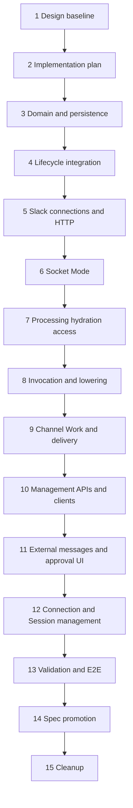

# External Channel Agent Conversation Implementation Plan

## Feature Summary

Implement the approved [`slack-260721/REQ`](../requirements/slack-260721-external-channel-conversation.md), [`slack-260721/ADR`](../adr/slack-260721-external-channel-conversation.md), and [`slack-260721/DESIGN`](./slack-260721-external-channel-conversation.md).

The feature introduces a provider-generic External Channel domain with Slack as the first adapter. It supports Workspace-owned dedicated App connections, Agent routes, durable HTTP and Socket Mode admission, attributed external messages, participant approval, binding-scoped Channel Work, explicit one-attempt provider delivery, lifecycle-safe disconnect, and operational Web management.

## Stack Prefix

`External channels`

## Delivery Shape

This feature uses 15 stacked PRs. The boundaries isolate persistence and lifecycle risk, provider transports, model execution contracts, public API generation, frontend surfaces, and final validation. Every implementation PR is based on the preceding branch. Create the complete PR stack before monitoring CI.

1. `External channels [1/15]: Design baseline`
2. `External channels [2/15]: Implementation plan`
3. `External channels [3/15]: Phase 1 — Domain and persistence foundation`
4. `External channels [4/15]: Phase 2 — Session and Agent lifecycle integration`
5. `External channels [5/15]: Phase 3 — Slack connections and HTTP admission`
6. `External channels [6/15]: Phase 4 — Slack Socket Mode`
7. `External channels [7/15]: Phase 5 — Event processing, hydration, and access`
8. `External channels [8/15]: Phase 6 — Invocation projection and model lowering`
9. `External channels [9/15]: Phase 7 — Channel Work and explicit delivery`
10. `External channels [10/15]: Phase 8 — Management APIs and generated clients`
11. `External channels [11/15]: Phase 9 — External messages and approval UI`
12. `External channels [12/15]: Phase 10 — Connection and Session channel management`
13. `External channels [13/15]: Validation and E2E`
14. `External channels [14/15]: Spec promotion`
15. `External channels [15/15]: Cleanup`

## Phase Dependencies



The stack is intentionally linear for review and branch management. Individual modules may be internally independent, but later phases must compile and test against the complete preceding contract.

## PR 1 — Design Baseline

Add the approved Requirements, accepted ADR-D1 through ADR-D13, and complete Design.

Completion criteria:

- all three primary documents use the `slack-260721` snapshot and shared basename;
- every requirement is traced to accepted decisions and implementation mechanisms;
- lifecycle, Slack platform, UI, and verification feasibility have no unresolved blocker; and
- documentation validation passes.

## PR 2 — Implementation Plan

Add this plan with phase boundaries, dependency order, validation matrix, fixture requirements, rollout constraints, and spec candidates.

Completion criteria:

- every Design mechanism has one implementation or validation owner;
- generated clients, migrations, lifecycle cutover, Web work, and cleanup are assigned to explicit phases; and
- real Slack credentials remain a rollout prerequisite rather than a normal CI dependency.

## PR 3 — Phase 1: Domain and Persistence Foundation

Introduce provider-generic External Channel persistence and domain contracts without activating provider ingress.

Scope:

- add PostgreSQL enums, models, repositories, and domain data for connections, Agent routes, resources, provider events, principals, messages and revisions, bindings, pending context, invocation batches, access requests, grants, blocks, Channel Work, actions, and delivery attempts;
- generate migrations through Alembic and update the RDB revision pointer;
- encrypt Slack signing, bot, and App-level credentials through the existing credential cipher;
- add named uniqueness, restrictive lifecycle-root foreign keys, and explicit indexes;
- classify Workspace/connection-owned canonical provider state separately from Session-owned binding, batch, work, action, and delivery state;
- register ownership-manifest metadata for the future `session.external-channel` participant without activating archive behavior; and
- add repository, encryption, uniqueness, and installed-schema graph tests.

The phase does not add webhook routes, Socket owners, model-visible events, public management APIs, or provider network calls.

## PR 4 — Phase 2: Session and Agent Lifecycle Integration

Complete the lifecycle framework extension and make External Channel state authoritative under archive, restore, purge, and Agent decommission.

Scope:

- add an explicit terminal-on-archive transition policy while retaining symmetric restore requirements for ordinary mutable participants;
- compose executable lifecycle participants and dispatch archive and restore validation/mutation within the existing locked transaction;
- implement `session.external-channel` archive termination, restore preservation, purge preparation, cleanup, verification, and database finalization;
- commit progress-delete intents during archive and perform provider attempts only after commit;
- ensure archive succeeds despite failed, unknown, or not-attempted provider cleanup;
- integrate Session finalizer ordering and restrictive FK validation;
- fence External Channel activity when an Agent becomes decommissioning;
- terminate route-owned bindings during ordinary root retirement, remove Agent routes explicitly, preserve Workspace-owned connections, and extend Agent finalizer absence checks; and
- add dense archive, restore, purge, retry, rollback, and decommission tests.

This is the authoritative lifecycle cutover. Do not introduce a feature flag, parallel cleanup path, or foreign-key cascade fallback.

## PR 5 — Phase 3: Slack Connections and HTTP Admission

Implement dedicated Slack App connection configuration and durable HTTP Events API admission.

Scope:

- add provider-neutral connection activation and health services;
- validate dedicated App credentials and provider identity without exposing secrets;
- add Slack Web API transport using the existing HTTP client stack;
- add a connection-specific opaque callback selector and raw-body timestamp/HMAC verification;
- verify `url_verification`, App identity, and tenant identity before durable acceptance;
- mount the provider callback for reachability without exposing it as a generated authenticated public-client operation;
- atomically admit or deduplicate provider events before acknowledgement;
- keep hydration, authorization, Session creation, and Agent wake-up outside the callback request; and
- add signed callback, stale request, selector, duplicate, App/tenant mismatch, and database-failure tests.

No ordinary Agent output is relayed to Slack.

## PR 6 — Phase 4: Slack Socket Mode

Add Socket Mode as a connection-selected alternative to HTTP.

Scope:

- add the direct runtime WebSocket dependency through the Python dependency workflow when no existing supported abstraction is available;
- implement App-level token connection opening, envelope acknowledgement after durable admission, refresh, reconnect, heartbeat, shutdown, and degraded state;
- run Socket ownership in one designated connection-manager process with a durable DB lease rather than in every API replica;
- support multiple Slack connections without assuming connection affinity;
- share the HTTP admission contract and event identity;
- expose transport capability and gap state without HTTP fallback; and
- test lease fencing, duplicate envelopes, commit failure, reconnect reasons, degraded gaps, and clean shutdown with a fake Socket server.

The implementation uses the provider protocol directly and does not add the Slack SDK unless repository feasibility changes.

## PR 7 — Phase 5: Event Processing, Hydration, and Access

Implement the durable claimed-event processor and provider normalization.

Scope:

- claim accepted events at least once and apply idempotent domain effects;
- normalize eligible public/private App-member channels, threads, principals, messages, edits, and deletes;
- exclude Slack Connect guarantees, DMs, GDMs, shortcuts, reactions, slash commands, and independent bot invocation;
- implement provisional mention tracking and hydration reconciliation through a recorded boundary;
- hydrate accessible thread history with pagination and inbound-only rate-limit recovery;
- enforce seven-day, 100-message, and 256-KiB pending-context limits;
- distinguish admission dedupe, message lifecycle identity, access-request identity, and invocation identity;
- implement unknown-participant approval requests, Session and Agent grants, Deny, Block, revocation, and control-message delivery;
- handle uninstall, token revocation, invalid authentication, and provider-resource loss; and
- test concurrent events, out-of-order events, duplicate Slack event shapes, incomplete hydration, truncation, blocked/bot context, and revocation.

## PR 8 — Phase 6: Invocation Projection and Model Lowering

Project authorized external turns into AgentSession without losing provider identity.

Scope:

- add the external invocation InputBuffer kind and dedicated canonical external-message event payload;
- promote complete invocation batches contiguously through the existing Session input boundary;
- preserve message, revision, resource, binding, batch, sender, authorization, lifecycle, and permalink references;
- add model-visible value/text filtering, token accounting, compaction input, Recent Transcript continuity, and shared source rendering;
- aggregate one contiguous invocation batch into an explicit source-labeled external turn;
- update every supported model lowerer and exhaustive event/payload unions;
- implement live/durable semantic replacement and correction-root identities; and
- add promotion, token, compaction, continuity, lowering, edit/delete, and duplicate-projection tests.

## PR 9 — Phase 7: Channel Work and Explicit Delivery

Implement model-visible Channel Work, the generic `channel_action` tool, continuation, and one-attempt delivery.

Scope:

- add binding-scoped Channel Work and ordered task transitions independently from Session Todo;
- auto-bind one root-only `channel_action` tool when an active binding exists;
- commit Channel Work, desired progress, action identity, and delivery intents before network calls;
- attempt reply, progress create/update/delete, and control operations at most once;
- record delivered, failed, unknown, and not-attempted outcomes without rollback or automatic retry;
- recover incomplete durable client-tool calls without executing provider operations;
- inject bounded current Channel Work into turn-time context and compaction;
- emit one generic idle continuation for the complete active work set; and
- test finish, continue, no reply, task-only changes, multiple bindings, drift, crash windows, Goal/Todo coexistence, and stale continuation.

## PR 10 — Phase 8: Management APIs and Generated Clients

Expose stable provider-neutral management APIs after the domain contracts are complete.

Scope:

- add Agent connection and route listing, setup, manifest guidance, credential validation, activation, transport switching, reconnect, disconnect, Agent grant, and block APIs;
- add Session binding, Channel Work, delivery outcome, Session grant, source metadata, and binding disconnect APIs;
- add authenticated opaque approval request and idempotent Allow Session, Allow Agent, Deny, and Block APIs;
- preserve routes → services → repositories layering and server-side authorization;
- keep raw provider callbacks out of generated public clients;
- dump OpenAPI and regenerate Python and TypeScript public clients through the generation workflow; and
- add API authorization, redaction, lifecycle status, idempotency, and generated-schema tests.

## PR 11 — Phase 9: External Messages and Approval UI

Implement source-aware conversation presentation and the dedicated approval flow.

Scope:

- render external messages as compact left-aligned source items rather than Azents user bubbles;
- support accessible expansion, safe Markdown, source metadata, authorization/lifecycle state, and validated original-message links;
- preserve live-to-durable replacement and append-only correction roots;
- add an authenticated approval page for Session Allow, Agent Allow, Deny, and Block;
- handle already-decided, expired, disconnected, unauthorized, missing, loading, error, mobile, keyboard, focus, and unavailable-link states; and
- add pure component tests and stories before browser integration.

## PR 12 — Phase 10: Connection and Session Channel Management

Implement operational management surfaces.

Scope:

- add Agent Settings External Channels list/detail views for connection health, transport, capabilities, route, grants, blocks, setup, reconnect, and disconnect;
- add the AgentSession Channels tab or inspector for active/terminated bindings, Channel Work, progress drift, delivery outcomes, pending-context truncation, retention, and terminal disconnect;
- keep Session, connection, binding, delivery, and drift states visually distinct;
- show archive consequences without blocking archive and keep archived projections read-only;
- preserve compact desktop/mobile layouts and accessible destructive actions; and
- add container tests, stories, query invalidation tests, and browser-ready selectors.

## PR 13 — Validation and E2E

Add deterministic provider infrastructure and run the complete verification matrix.

Scope:

- add fake Slack HTTP, WebSocket, history, membership, permalink, delivery, failure, timeout, and revocation behavior under `testenv/azents/`;
- seed connections, routes, resources, principals, bindings, pending context, work, and delivery outcomes through supported setup and API paths;
- add required API and Web Surface E2E journeys;
- validate installed PostgreSQL FK graphs and dense Session lifecycle fixtures;
- run backend, engine, generated-client, TypeScript, and hermetic E2E checks;
- record commands, environment, outcomes, and any fixes applied; and
- compare the implemented behavior strictly against the approved Design and current specs.

Optional live Slack verification runs only when protected disposable credentials are available. Missing live credentials skip the optional lane and do not block ordinary CI.

## PR 14 — Spec Promotion

Run spec review after implementation and validation are complete.

Scope:

- update current conversation, toolkit, execution-loop, and chat-resync specs;
- add External Channel domain, provider ingress, authorization, delivery, and lifecycle specs;
- update code paths, verification dates, and spec versions;
- resolve every implementation/spec drift found by validation; and
- add the same `implemented` date to the Requirements and Design only after all required verification passes.

## PR 15 — Cleanup

Remove this implementation plan and stale delivery-only references after specs become the current behavior source of truth.

The cleanup PR contains no behavior change, refactor, compatibility layer, or unrelated documentation rewrite.

## E2E Primary Validation Matrix

| Behavior | Required deterministic evidence | Optional live evidence |
| --- | --- | --- |
| Dedicated connection setup | Redacted credentials, activation, transport and capability state | Real App setup |
| HTTP admission | Signed raw body, URL verification, fast ACK, duplicate event ID | Real callback |
| Socket Mode | Ack after commit, lease fencing, reconnect and degraded state | Real Socket App |
| Unknown participant | Durable request and approval link without Agent wake | Real channel mention |
| Access decisions | Session/Agent Allow, Deny, Block, repeat decisions | Spot verification |
| Pending context | Web and other bindings do not release; authorized same binding does | Mixed-user thread |
| Hydration | Pagination, concurrency, bounded and incomplete markers | Long thread |
| External transcript | Source item, lowering envelope, compaction and continuity | Real permalink |
| Duplicate Slack shapes | One message, request, batch, and wake | Spot verification |
| Channel Action | finish, continue, no reply, task-only update | Real replies |
| Progress projection | create, update, delete, drift and no automatic retry | Real progress message |
| Delivery ambiguity | failed, unknown and not-attempted remain transparent | Revoked/timeout case |
| Continuation | multiple bindings, Goal/Todo coexistence, stale no-op | Not required |
| Binding/connection disconnect | Terminal work, pending purge, preserved history | Real disconnect |
| Session archive/restore | Non-blocking archive termination and no restore reactivation | Optional cleanup |
| Agent decommission | Route fence, Session purge, finalizer checks, connection preservation | Not required |
| Revocation | uninstall/token failure maps to visible terminal health | Optional live uninstall |
| Scope exclusions | DM, GDM, Slack Connect, reaction, shortcut and slash negative cases | Not required |
| Responsive Web behavior | keyboard, focus, mobile, errors, empty/loading, overflow | Not required |

## Validation Commands by Area

Backend phases run targeted tests first, then:

```console
cd python/apps/azents
uv run ruff check .
uv run ruff format --check .
uv run pyright
uv run pytest
```

API/client phases use the OpenAPI client generation workflow and verify generated packages rather than editing them manually.

Frontend phases run:

```console
cd typescript
pnpm run format
pnpm run lint
pnpm run typecheck
pnpm run build
```

Hermetic E2E runs:

```console
cd testenv/azents/e2e
uv run pytest -vv -m 'not live_external and not runtime_provider and not web_surface' ./src
uv run pytest -vv -m 'web_surface and not live_external and not runtime_provider' ./src
```

Phase-specific plans may narrow commands while developing, but PR 13 runs the complete required matrix.

## Fixture and Prerequisite Support

Required CI uses deterministic provider fixtures only.

- fake HTTP callbacks sign the exact raw body and record acknowledgement timing;
- fake Socket transport controls envelope IDs, reconnect reasons, connection loss, and ACK traces;
- fake Web API controls history pages, rate limits, membership, message identities, permalinks, post/update/delete outcomes, revocation, and ambiguous timeouts;
- tests reset call and acknowledgement traces between scenarios; and
- secrets and message content never appear in evidence logs.

Optional live validation requires:

- one disposable Slack App for HTTP and optionally one for Socket Mode;
- approved App manifest scopes and App-level token capability;
- one public and one private channel with explicit App membership;
- identifiers and cleanup permissions suitable for protected test evidence; and
- no Slack Connect, DM, shortcut, reaction, or slash-command expectation.

These prerequisites block only the optional live lane.

## Known Risks and Blockers

No product or repository blocker remains before implementation.

Implementation risks:

- lifecycle archive/restore participant execution is not present in current code and must be completed before External Channel bindings become active;
- the terminal-on-archive policy must not weaken ordinary reversible mutation symmetry;
- provider callback routing must never substitute an opaque selector for Slack signature verification;
- Socket owners must not run independently in every API replica;
- admission, message, approval, and invocation deduplication identities must remain distinct;
- hydration retry is allowed for inbound processing, while outbound provider operations remain one-attempt;
- generated client work must wait for stable management schemas;
- source event unions and model-visible filtering must be updated exhaustively across every lowerer and consumer;
- live Slack credentials are unavailable in ordinary CI and cannot be used as a correctness dependency; and
- later phases may expose defects in earlier branches, requiring fixes and rebases across the remaining stack.

## Spec Impact Candidates

- `docs/azents/spec/domain/conversation.md`
- `docs/azents/spec/domain/agent.md`
- `docs/azents/spec/domain/toolkit.md`
- `docs/azents/spec/flow/agent-execution-loop.md`
- `docs/azents/spec/flow/chat-session-resync.md`
- new External Channel domain spec
- new provider-ingress flow spec
- new external authorization and delivery flow specs when separation improves ownership clarity

## Rollout and Rollback

- Keep connection activation unavailable until ingress, authorization, invocation projection, and explicit outbound action are deployed together.
- Do not use a dual-authority lifecycle feature flag or legacy Slack fallback.
- Before new event/input enum values are written, rollback may disable activation and stop Socket owners.
- After new durable values exist, rollback requires a forward-compatible build that still parses and preserves them.
- A rollback never deletes canonical External Channel history or fabricates provider delivery success.

## Cleanup

After PR 14 verifies current specs and marks the snapshot implemented, PR 15 removes this plan. Historical Requirements, ADR, and Design remain immutable; current behavior is maintained only in specs and code.
