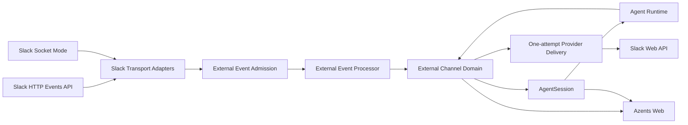
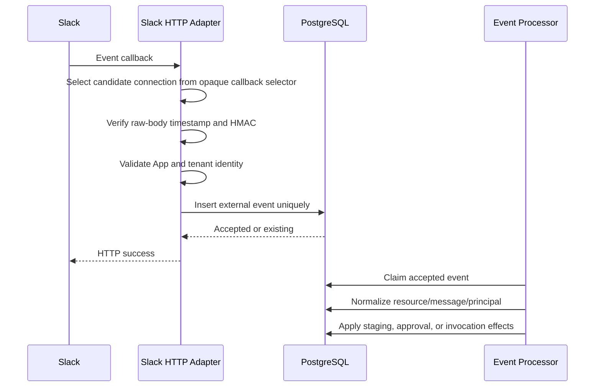
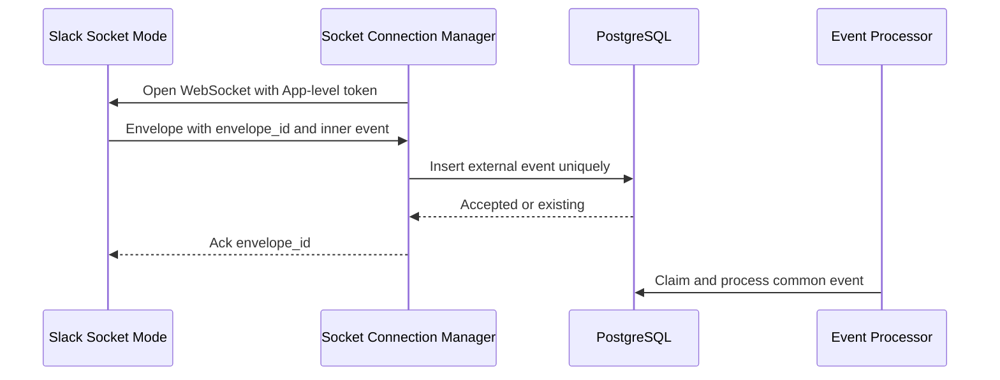
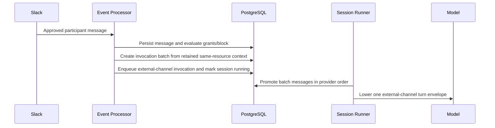

# External Channel Agent Conversation Design

- Snapshot: `slack-260721`
- Document reference: `slack-260721/DESIGN`
- Requirements: [External Channel Agent Conversation Requirements](../requirements/slack-260721-external-channel-conversation.md) (`slack-260721/REQ`)
- ADR: [External Channel Agent Conversation](../adr/slack-260721-external-channel-conversation.md) (`slack-260721/ADR`)

## Overview

This design introduces a first-class External Channel domain that connects AgentSessions to collaboration-provider resources without turning ordinary Agent output into an automatic relay. Slack is the first provider through manually created per-Agent dedicated Apps. The domain remains provider-generic so later Discord, GitHub comment, Jira, and other adapters can reuse connection, resource, participant, work, delivery, and disconnect lifecycles.

A dedicated Slack App may use either HTTP Events API or Socket Mode. Provider events are durably admitted before acknowledgement and processed asynchronously. Context-only messages remain in bounded resource-scoped pending context until an authorized Slack participant from the same resource invokes the Agent. At that point the retained context and authorized trigger are projected into one AgentSession turn while remaining individually inspectable in Web history.

The Agent communicates externally only through one atomic provider-generic channel action. Channel Work and Todo state are canonical Azents state. Slack replies and one mutable progress message are projections attempted once, with the actual delivered, failed, unknown, or not-attempted result returned transparently to the Agent and retained for management.

## Traceability

| Requirement | ADR decisions | Primary design mechanisms |
| --- | --- | --- |
| `slack-260721/REQ-1` | `slack-260721/ADR-D1`, `slack-260721/ADR-D2` | Workspace-owned connections, separate Agent routes, provider adapters |
| `slack-260721/REQ-2` | `slack-260721/ADR-D2`, `slack-260721/ADR-D9`, `slack-260721/ADR-D10` | Dedicated Slack connection setup, HTTP/Socket credentials, status and validation |
| `slack-260721/REQ-3` | `slack-260721/ADR-D2`, `slack-260721/ADR-D3`, `slack-260721/ADR-D7`, `slack-260721/ADR-D10` | Mention-triggered resource discovery, App-member channels, binding creation |
| `slack-260721/REQ-4` | `slack-260721/ADR-D3`, `slack-260721/ADR-D7`, `slack-260721/ADR-D10`, `slack-260721/ADR-D12` | External messages, bounded pending context, ordered authorized projection |
| `slack-260721/REQ-5` | `slack-260721/ADR-D3`, `slack-260721/ADR-D4`, `slack-260721/ADR-D7`, `slack-260721/ADR-D12` | External principals, authorization evaluation, context-only staging |
| `slack-260721/REQ-6` | `slack-260721/ADR-D4`, `slack-260721/ADR-D11` | Durable access requests, scoped grants, blocks, approval page |
| `slack-260721/REQ-7` | `slack-260721/ADR-D5`, `slack-260721/ADR-D8` | Atomic channel action and transparent one-attempt provider result |
| `slack-260721/REQ-8` | `slack-260721/ADR-D1`, `slack-260721/ADR-D5`, `slack-260721/ADR-D6` | Binding-scoped Channel Work, ordered tasks, always-visible active snapshots |
| `slack-260721/REQ-9` | `slack-260721/ADR-D5`, `slack-260721/ADR-D8`, `slack-260721/ADR-D11` | Desired progress projection, one create/update/delete attempt, Web drift state |
| `slack-260721/REQ-10` | `slack-260721/ADR-D5`, `slack-260721/ADR-D6`, `slack-260721/ADR-D8`, `slack-260721/ADR-D13` | Turn-time context enrichment, compaction enrichment, generic idle continuation, archive termination |
| `slack-260721/REQ-11` | `slack-260721/ADR-D3`, `slack-260721/ADR-D7`, `slack-260721/ADR-D9`, `slack-260721/ADR-D10` | Durable event admission, provider identities, ordered reconciliation |
| `slack-260721/REQ-12` | `slack-260721/ADR-D1`, `slack-260721/ADR-D2`, `slack-260721/ADR-D3`, `slack-260721/ADR-D8`, `slack-260721/ADR-D11`, `slack-260721/ADR-D12`, `slack-260721/ADR-D13` | Terminal binding disconnect, archive-triggered termination, pending-context purge, progress cleanup attempt |
| `slack-260721/REQ-13` | `slack-260721/ADR-D1`, `slack-260721/ADR-D2`, `slack-260721/ADR-D8`, `slack-260721/ADR-D9`, `slack-260721/ADR-D11`, `slack-260721/ADR-D13` | Connection lifecycle, transport stop, revocation, credential removal, Agent decommission fencing |
| `slack-260721/REQ-14` | `slack-260721/ADR-D3`, `slack-260721/ADR-D4`, `slack-260721/ADR-D11`, `slack-260721/ADR-D12` | Shared AgentSession with gated external projection and no Web relay |
| `slack-260721/REQ-15` | `slack-260721/ADR-D3`, `slack-260721/ADR-D11`, `slack-260721/ADR-D12` | Typed external events, explicit lowering envelope, collapsed source item and permalink |

## Current Behavior and Gaps

Current Azents provides reusable execution infrastructure but no active Slack implementation.

- AgentSession is the canonical conversation and serialized execution boundary.
- Input buffers provide durable accepted input and producer-owned wake scheduling.
- Canonical events provide append-only model and Web history.
- Goal provides successful-run idle continuation.
- Session Todo provides one session-scoped task list and compaction enrichment.
- Toolkit configuration provides encrypted credentials and model-visible tool binding.
- Web history and live state provide idempotent durable/live projection.
- Session archive and restore run inside locked root-tree transactions, but the current `SessionLifecycleOrchestrator` only validates the transition context and invokes the supplied AgentSession mutation; it does not yet dispatch participant archive or restore operations.
- The current registry rejects an archive `mutate` policy paired with restore `preserve`. External Channel therefore requires an explicit terminal-on-archive policy rather than weakening symmetry validation for ordinary reversible participants.
- Archived-session purge materializes immutable participant versions and durable prepare, cleanup, and verify checkpoints before the dedicated Session lifecycle finalizer deletes the root tree.
- Agent deletion is an asynchronous decommission flow that archives roots, waits for retention purge, obtains Runtime terminal-delete acknowledgement, and then uses a dedicated finalizer.

The missing behavior is the complete external-channel lifecycle: provider connections, event ingress, external resource and actor identities, pending authorization, resource-to-session binding, channel-specific work, explicit delivery, progress projection, and terminal disconnect.

The historical Slack implementation removed on 2026-06-15 remains useful only as bounded evidence for per-App authentication, Slack identity normalization, explicit Slack tools, and prior delivery deduplication. It does not satisfy the confirmed authorization, staging, Channel Work, explicit-publication, or disconnect contracts.

## Feasibility Validation

No requirement-level or accepted-ADR blocker remains. `conditional` means that the current repository has a credible extension path but no existing complete vertical slice for that product surface.

| Requirement | Result | Validated implementation evidence and missing surface |
| --- | --- | --- |
| `slack-260721/REQ-1` | feasible | Current Workspace and Agent foreign-key patterns support independent connections and routes; all External Channel models and APIs are new. |
| `slack-260721/REQ-2` | conditional | `CredentialCipher` and encrypted repository patterns are reusable; Slack manifest, credential validation, transport activation, and health APIs are new. |
| `slack-260721/REQ-3` | conditional | AgentSession locking and provider event admission can create one active binding; Slack membership, mention, thread filtering, and adapters are new. |
| `slack-260721/REQ-4` | conditional | Input-buffer promotion can append multiple canonical events atomically; pending storage, hydration, batch membership, and correction payloads are new. |
| `slack-260721/REQ-5` | conditional | Producer-owned wake scheduling supports context-only versus invocation input; principal, grant, block, and release services are new. |
| `slack-260721/REQ-6` | conditional | Existing Agent authorization can guard a durable approval route; external access requests, policy decisions, opaque links, and approval UI are new. |
| `slack-260721/REQ-7` | feasible | Client tools already separate explicit tool execution from ordinary assistant output; `channel_action` requires a new auto-bound provider and recovery integration. |
| `slack-260721/REQ-8` | conditional | Binding-owned tables avoid conflict with session-scoped Todo; Channel Work persistence, schema limits, and multi-binding tests are new. |
| `slack-260721/REQ-9` | conditional | Durable state plus provider projections is compatible with current service/repository layering; Slack delivery ledger and drift UI are new. |
| `slack-260721/REQ-10` | conditional | Dynamic Toolkit prompts, compaction hooks, and session-idle hooks are reusable; one-work-set continuation dedupe and Goal/Todo coexistence are new. |
| `slack-260721/REQ-11` | conditional | Input-buffer and transcript idempotency patterns are reusable; provider inbox, message reconciliation, and Socket degraded handling are new. |
| `slack-260721/REQ-12` | conditional | Locked archive/restore and checkpointed purge are reusable, but archive/restore participant dispatch, atomic binding termination, pending purge, cleanup intent, purge verification, and finalizer ordering are new. |
| `slack-260721/REQ-13` | conditional | Encrypted credential deletion and health-state patterns are reusable; uninstall/revocation handling, connection-wide cleanup, Agent-route decommission fencing, and Agent finalizer absence checks are new. |
| `slack-260721/REQ-14` | conditional | Existing session ACLs and chat history preserve Web isolation; source-aware external event mapping and no-relay tests are new. |
| `slack-260721/REQ-15` | conditional | The Agent-message event, lowering, live projection, and collapsed UI form the reference vertical slice; dedicated payloads, both lowerers, generated clients, semantic keys, and source UI are new. |

Repository evidence includes:

- `python/apps/azents/src/azents/rdb/models/event.py` and `rdb/models/input_buffer.py` for durable identity and session-owned ordering;
- `python/apps/azents/src/azents/services/input_buffer.py` for exhaustive kind promotion and multi-event append;
- `python/apps/azents/src/azents/engine/events/types.py`, `responses_lowering.py`, and `services/chat/live_events.py` for the Agent-message reference slice;
- `python/apps/azents/src/azents/engine/events/execution.py` for current client-tool execution and missing-result recovery;
- `python/apps/azents/src/azents/engine/events/tools.py`, `core/tools.py`, and `engine/hooks/` for Tool Catalog, dynamic prompt, compaction, and idle hooks; and
- `python/apps/azents/src/azents/services/session_lifecycle/`, `services/archived_session_purge.py`, and `repos/session_lifecycle_finalizer/` for archive/restore integration, purge participant checkpoints, and final Session deletion;
- `python/apps/azents/src/azents/services/agent_decommission.py` and `repos/agent_decommission_finalizer/` for irreversible Agent retirement and lifecycle-root absence validation; and
- `typescript/apps/azents-web/src/features/chat/` and `features/agents/` for live/durable identity, source-row interaction, Agent settings, and AgentSession navigation patterns.

## Architecture



### Ownership boundaries

#### External Channel domain

Owns:

- provider connections and transport health;
- Agent routes;
- external resources and messages;
- bounded pending context;
- session bindings;
- external principals, access requests, grants, and blocks;
- invocation batches;
- Channel Work and tasks;
- provider delivery attempts and projection status; and
- disconnect and cleanup lifecycle.

It does not own Agent model execution, canonical AgentSession transcript, Web authentication, or general Toolkit credentials.

#### AgentSession

Owns:

- projected external-message events;
- external invocation input and turn eligibility;
- model context and compaction;
- runs and serialized execution;
- Web conversation history; and
- ordinary Web user input.

#### Slack adapter

Owns:

- HTTP signature verification and URL verification;
- Socket Mode connection and envelope acknowledgement;
- Slack-specific identity normalization;
- Slack Web API calls;
- Slack error mapping;
- provider permalink validation; and
- Slack App capability and scope reporting.

It does not decide authorization, Agent routing, Channel Work completion, or AgentSession wake semantics.

## Proposed Persistence Model

The names below are design names; implementation may refine naming while preserving the accepted ownership and uniqueness rules.

### External connections

`external_channel_connections`

| Field | Purpose |
| --- | --- |
| `id` | Stable Azents connection identity |
| `workspace_id` | Owning Workspace |
| `provider` | `slack` initially |
| `transport` | `http` or `socket` |
| `status` | configuring, active, degraded, reconnect_required, disconnecting, disconnected |
| `provider_app_id` | Slack App identity used for routing |
| `provider_tenant_id` | Installed Slack Workspace identity |
| `provider_bot_user_id` | App bot identity used for self-message suppression |
| `http_callback_selector_hash` | Hash of an Azents-issued opaque callback selector used to choose the candidate connection before Slack signature verification |
| encrypted credential fields | Bot token, signing secret, Socket app-level token as applicable |
| `capabilities` | Resolved transport/provider capability snapshot |
| timestamps | Creation, verification, health, disconnect |

Provider-specific secrets use the current credential cipher and never appear in API responses, prompt context, logs, or external-message events.

### Agent routes

`external_channel_agent_routes`

| Field | Purpose |
| --- | --- |
| `id` | Stable route identity |
| `connection_id` | Provider installation |
| `agent_id` | Routed Agent |
| `status` | active or inactive |
| `route_mode` | dedicated initially; platform reserved |
| timestamps | Route lifecycle |

A dedicated connection has exactly one active route. The schema permits future platform connections to own multiple routes without changing connection credentials.

### External resources

`external_channel_resources`

| Field | Purpose |
| --- | --- |
| `id` | Stable provider-resource identity |
| `connection_id` | Provider installation boundary |
| `resource_type` | Slack thread initially |
| `provider_resource_key` | Provider-normalized unique key |
| provider labels | Workspace, channel, thread display metadata |
| `status` | active, unavailable, deleted |
| timestamps | Discovery and latest activity |

For Slack, the normalized key includes tenant, channel, and root thread timestamp. A top-level mention establishes its own root timestamp when it begins a new thread.

### External principals

`external_channel_principals`

| Field | Purpose |
| --- | --- |
| `id` | Stable external identity |
| `provider` | Slack initially |
| `provider_tenant_id` | Workspace or organization boundary |
| `provider_user_id` | Provider user identity |
| profile fields | Mutable display name, avatar, author type |
| timestamps | First and latest observation |

Display names and email addresses are never unique identity keys. Different providers are never merged implicitly.

### Provider events

`external_channel_events`

| Field | Purpose |
| --- | --- |
| `id` | Admission identity |
| `connection_id` | Routing and verification boundary |
| `provider_event_id` | Provider dedupe identity |
| `transport_envelope_id` | HTTP retry or Socket envelope diagnostics |
| `event_type` | Slack event type |
| provider routing identity | App, tenant/team, and enterprise identity when present |
| `resource_correlation_key` | Channel and root-thread identity available before full resource normalization |
| `eligibility_state` | unclassified, tracked, ignored, or processed |
| bounded envelope | Minimum normalization input for eligible events, not arbitrary raw retention |
| `status` | accepted, ignored_unlinked, processing, processed, failed |
| attempt and error metadata | Inbound processor recovery |
| timestamps | Provider, receipt, processing |

`(connection_id, provider_event_id)` is unique. Inbound processing is at-least-once and every domain mutation is idempotent.

### External messages and revisions

`external_channel_messages`

| Field | Purpose |
| --- | --- |
| `id` | Stable external message identity |
| `resource_id` | Parent external conversation |
| `provider_message_key` | Provider identity; Slack uses tenant/enterprise context, channel ID, and message `ts` |
| `provider_position` | Canonical provider ordering key |
| `principal_id` | Author identity when available |
| `author_type` | human, bot, app, system |
| `current_revision_id` | Latest normalized provider revision |
| `original_url` | Validated provider permalink when available |
| `lifecycle` | current, edited, deleted |
| `pending_size` | Retention accounting |
| timestamps | Provider and observation time |

`external_channel_message_revisions` stores the immutable normalized text, bounded attachment metadata, revision kind, source provider event, and observation time for the original message and each edit or deletion. The original revision key is stable across duplicate Slack event types for the same message; edit/delete revision keys use normalized provider lifecycle identity rather than arrival order. Edits and deletes update provider-current state while retaining the exact revision projected into each AgentSession. Already projected history remains append-only; a later authorized release appends a correction event rather than rewriting historical content.

### Session bindings

`external_channel_bindings`

| Field | Purpose |
| --- | --- |
| `id` | Model-visible Channel Action target |
| `resource_id` | External conversation |
| `route_id` | Agent route |
| `agent_session_id` | Linked AgentSession |
| `status` | active or disconnected |
| `projected_through_position` | Optimization watermark for released message creation order |
| truncation counters | Removed pending range/count |
| timestamps | Link and disconnect lifecycle |

One resource and route have at most one active binding. Reconnection creates a new binding and never reactivates a terminated relationship.

The watermark is never the sole projection source of truth. Invocation batch items record which message revision was projected to which binding, so an edit, delete, or late message at an older provider position remains eligible for a later authorized release.

### Invocation batches

`external_channel_invocation_batches`

| Field | Purpose |
| --- | --- |
| `id` | One released external turn |
| `binding_id` | Source binding |
| `trigger_message_id` | Authorized invocation |
| first/last provider positions | Deterministic membership |
| truncation metadata | Omitted pending-context marker |
| `input_buffer_id` | Session wake input |
| timestamps | Creation and projection |

`external_channel_invocation_batch_items` records the ordered message revision membership of each batch. Batch membership is durable so replay and lowering produce the same external turn, and one provider message can be projected into a later binding without mutating its prior projection. Individual external messages remain distinct canonical events for Web presentation.

### Access requests and policy

`external_channel_access_requests` stores pending, allowed, denied, blocked, and expired invocation requests with route, resource, source message, external principal, decision, approver, and decision policy snapshot. A pending request expires with its seven-day pending-context window or earlier when its route, connection, or resource becomes ineligible. A later eligible mention may create a new request.

`external_channel_access_grants` stores Session or Agent scope and external principal. Agent scope is independent from the connection and applies to the same provider-tenant principal through eligible routes.

`external_channel_blocks` stores the active Agent-and-principal block override. Deny remains request-local.

### Channel Work

`external_channel_works`

| Field | Purpose |
| --- | --- |
| `id` | Work identity |
| `binding_id` | Exactly one linked conversation |
| `status` | active or finished |
| `schema_version` | Task payload evolution |
| ordered task payload | content and pending/in_progress/completed status |
| desired progress revision | Latest Slack projection state |
| timestamps | Creation, updates, finish |

One binding has at most one active Channel Work. Completed Channel Work, actions, task revisions, and delivery outcomes have no independent TTL in the first release: they remain while the related AgentSession exists, including archive, and follow the session's permanent-deletion retention lifecycle. Session archive ends active Channel Work immediately and attempts Slack progress deletion once after the archive transaction commits.

### Channel actions

`external_channel_actions`

| Field | Purpose |
| --- | --- |
| `id` | Durable Agent decision identity |
| `agent_session_id` | Calling session |
| `run_id` and `client_tool_call_id` | Link to the canonical client-tool call and recovery path |
| `binding_id` | Target linked conversation |
| `mode` | finish or continue |
| state revision | Committed Channel Work transition |
| timestamps | Acceptance and completion |

`(agent_session_id, client_tool_call_id)` is unique. Re-entry of the same durable client-tool call returns the existing committed action and never creates another provider operation.

### Delivery attempts

`external_channel_delivery_attempts`

| Field | Purpose |
| --- | --- |
| `id` | One explicit provider operation identity |
| `origin_type` and `origin_id` | Channel action, access request, binding disconnect, connection disconnect, or manager operation |
| `channel_action_id` | Nullable direct link used by Channel Action recovery |
| `binding_id` | Target external conversation |
| `operation` | reply, progress_create, progress_update, progress_delete, control_message |
| payload snapshot | Validated provider request intent |
| `status` | pending, attempting, delivered, failed, unknown, not_attempted |
| provider message identity | Result mapping when delivered |
| error category and safe detail | Transparent Agent and manager result |
| timestamps | Commit, attempt, result |

Each record is attempted at most once automatically. No retry scheduler re-executes provider operations.

### Required uniqueness and ownership

The migration defines explicit named constraints for:

- connection installation identity `(workspace_id, provider, provider_tenant_id, provider_app_id)` when known;
- principal identity `(provider, provider_tenant_id, provider_user_id)`;
- resource identity `(connection_id, resource_type, provider_resource_key)`;
- message identity `(resource_id, provider_message_key)`;
- event admission `(connection_id, provider_event_id)`;
- one active binding per `(resource_id, route_id)`;
- one invocation batch per `(binding_id, trigger_message_id)`;
- one active Channel Work per binding;
- one channel action per `(agent_session_id, client_tool_call_id)`; and
- one operation identity per `(origin_type, origin_id, binding_id, operation)`.

Connection, canonical provider event, resource, message, revision, principal, and Agent-scoped access-policy records are owned independently from AgentSession event retention. Binding-scoped invocation batches, Session access decisions, Channel Work, actions, and delivery records are Session lifecycle resources: they are retained through archive and explicitly finalized during permanent Session purge. A binding references the session through a restrictive lifecycle-owned relationship; archive or final AgentSession deletion never cascades away state before disconnect, cleanup accounting, and purge verification complete.

### Session lifecycle ownership

The External Channel domain registers a `session.external-channel` participant in the immutable Session lifecycle registry.

- Archive policy is a new explicit `terminate` policy: the participant locks active bindings for the root tree, marks them disconnected, ends active Channel Work, removes never-projected pending context, and creates one cleanup delivery intent per projected progress message.
- Restore policy is `preserve`: it validates that no terminal binding, removed pending context, or ended Channel Work is reactivated.
- Purge policy is `required`: prepare resolves incomplete delivery bookkeeping without provider execution, cleanup removes Session-owned External Channel rows, and verify rejects finalization while actionable binding or work state remains.
- The participant depends on the Session execution fence so an active AgentRun remains a critical archive blocker while idle External Channel state does not.

`SessionLifecycleTransitionPolicy` and registry validation add the terminal-on-archive contract without allowing a generic asymmetric `mutate`/`preserve` pair. A terminal policy is valid only for archive with restore `preserve`; the orchestrator invokes its database operation during archive and never invokes an inverse during restore. Existing `mutate` participants remain required to declare symmetric restore mutation.

The current orchestrator does not execute archive or restore participant operations. Implementation extends that boundary so ordinary archive and Agent decommission invoke the same participant operation inside their existing locked transactions. Purge uses the existing immutable participant snapshot and checkpoint phases. The dedicated Session lifecycle finalizer remains the only component allowed to delete the AgentSession tree.

Canonical provider messages remain outside Session purge because a later binding may reference the same provider resource and message identities. Session-bound batch membership and projection records are deleted only after their binding cleanup is verified.

## Provider Ingress

### HTTP flow



Slack `url_verification` does not contain `api_app_id`. Each HTTP connection therefore receives an Azents-generated opaque callback selector in its Request URL. The handler hashes the selector, loads only the candidate connection, and verifies the raw-body Slack signature with that connection's signing secret before returning the challenge. Ordinary event callbacks additionally require the signed `api_app_id` and tenant identity to match the selected connection. The selector is a routing hint, not authentication, and the deprecated Slack verification token is not the security boundary.

The same handler and admission service support every connection even though each App has a connection-specific callback URL. Agent execution, Slack history reads, and approval decisions never run inside the callback request.

### Socket Mode flow



A Workspace connection uses one active socket owner lease in the first implementation. The lease and heartbeat are Azents ownership mechanisms, not Slack delivery guarantees. The manager handles refresh and reconnect signals and exposes degraded health. The Slack app-wide ten-socket limit is never used as the normal parallelism mechanism, and Slack may deliver any envelope to any active socket for the App. A connection does not auto-fallback to HTTP.

Acknowledging only after the inbox transaction commits is an Azents reliability policy. The admission transaction must remain bounded and must not include history hydration, authorization, or AgentSession work; otherwise delayed acknowledgement increases provider redelivery. A socket interruption may create a provider-delivery gap, and Slack does not guarantee replay for the disconnected interval. Azents records degraded state and does not claim complete HTTP parity. Already accepted events and active Channel Work remain durable.

## Slack Message Admission and Authorization

### Slack App scope and event boundary

The generated App configuration requests `app_mentions:read`, `channels:history`, `groups:history`, `chat:write`, and bounded user-profile access needed for source labels. Socket Mode additionally requires an App-level token with `connections:write`. It subscribes only to the required mention, public/private channel message, uninstall, and token-revocation events. It does not request `chat:write.public`, direct-message history, reactions, shortcuts, or user email.

Slack message subscriptions expose visible traffic beyond linked threads. Every subscribed event first enters the bounded provider inbox required by durable admission. The admission transaction extracts only the routing and thread correlation identity needed for later classification.

- an `app_mention` admission creates a provisional tracking claim for its connection, channel, and root thread before acknowledgement;
- a public/private channel message matching an active binding or provisional tracking claim is retained for External Message normalization without waiting for binding activation;
- a thread reply received before its corresponding mention is classified waits in a short-lived unclassified inbox state and is reconciled by the mention processor and initial history hydration; and
- an event that cannot be associated with an active binding, provisional claim, or eligible mention is marked ignored, has its message body purged from the inbox, and is never normalized into an External Message.

The connected App's own authored messages are recorded only when needed for known control, reply, or progress reconciliation and never create Agent invocation.

### Initial thread hydration

The first eligible mention persists the trigger and root identity, creates the access request when required, and schedules bounded thread hydration outside the HTTP or Socket acknowledgement path. Hydration uses cursor pagination, honors provider rate limits, and upserts message identities so events received concurrently do not duplicate history.

Hydration records a provider high watermark. Before activation, the reconciler combines:

- accessible root and prior replies through that watermark;
- every retained event matching the provisional thread after the trigger, including events that arrived while approval or hydration was pending; and
- late provider events already admitted for the same correlation key.

Activation does not complete until hydration is terminal and every admitted matching event through the recorded reconciliation boundary has been classified. Events arriving after that boundary continue through the provisional or active resource path. This prevents approval latency, event reordering, and history pagination from dropping same-thread context.

Approval may be decided while hydration is running, but the first invocation batch is created only after hydration reaches a recorded terminal state:

- `complete` when the accessible root and prior replies within the retention bounds were read;
- `bounded` when the seven-day, 100-message, or 256-KiB Azents limit was reached; or
- `incomplete` when provider access or a permanent provider error prevents completing the available range.

Temporary rate limiting delays hydration and may be retried by the inbound processor; it never delays provider event acknowledgement. A bounded or incomplete release includes a distinct source marker so the Agent does not infer that the imported thread is complete.

### Context-only message staging

Messages from bots, Apps, unapproved users, and blocked users are normalized into External Messages but remain outside AgentSession history.

Pending context limits are enforced lazily on insert and immediately before release:

- seven-day maximum age;
- 100-message maximum count; and
- 256 KiB maximum normalized body and metadata size.

Oldest content is removed first. The binding retains omitted count/range metadata. Binary attachment content is never downloaded during staging.

### Authorized participant in an existing binding



Web input, idle continuation, and activity from another binding never release pending context.

### Unknown participant initial mention

The processor creates or reuses an access request without creating an AgentSession. It stores the triggering message and resource-scoped pending context, then attempts one ordinary Slack control reply containing the Azents approval link. An ephemeral message may be added later as a convenience but is never the source of truth.

The approval page requires normal Azents authentication and rechecks the Agent's approver policy. Allow performs one recoverable database operation:

1. mark the request allowed and persist the approver decision;
2. create the AgentSession if absent;
3. create the active binding;
4. create the Session or Agent grant;
5. mark binding activation as waiting for bounded initial hydration when hydration is not terminal; and
6. mark the approval control projection resolved when possible.

The transaction never waits on Slack. An idempotent activation reconciler observes the committed Allow decision and terminal hydration state, then creates the invocation batch, enqueues it, wakes the session, and marks binding activation complete in one session-boundary operation. An already approved first mention follows the same hydration and activation gate without creating an access request.

Deny resolves only the request. Block creates or activates the Agent block and suppresses future approval projection. Blocked messages may remain pending context and can be released later only by an authorized message from the same resource.

Provider event identity alone does not own invocation idempotency. Slack may deliver distinct `app_mention` and channel-message events for the same source message. Access-request creation is unique by route, resource, principal, and source message; invocation-batch creation is unique by binding and trigger message. Reprocessing either event therefore reconciles the same External Message and cannot create a second approval request or Agent wake.

## AgentSession Event and Lowering Model

### Input and event taxonomy

Add an external-channel invocation input-buffer kind. Its payload contains an invocation-batch reference, not copied untrusted message bodies.

The External Event processor creates the durable invocation batch and input buffer but does not append AgentSession transcript events directly. The AgentSession InputBuffer processor loads the batch and promotes it through the existing transcript repository into:

- one individual `external_channel_message` event per released external message or correction; and
- one shared durable `invocation_batch_id` field carried by every promoted message event.

Each message event carries stable external message, resource, binding, batch, provider, sender, authorization, timestamp, lifecycle, and original-link references. Canonical events never contain provider credentials or arbitrary raw webhook envelopes.

Promotion appends the complete batch contiguously while holding the existing AgentSession input boundary. It does not reuse `TurnMarkerPayload` or `AgentMessagePayload`. The new input and event kinds are added exhaustively to the PostgreSQL enums, payload registry, input-buffer processor registry, inference scheduling rules, model-visible event filters, token accounting, Recent Transcript continuity, live projection, both supported model lowerers, OpenAPI schemas, generated clients, TypeScript unions, and tests.

Canonical projection identity is binding- and revision-aware:

- event `external_id`: `external-channel:{binding_id}:{external_message_id}:{revision_id}`;
- Web `event_render_key`: derived from that exact event external ID so a live projection is replaced by its durable event; and
- `projection_root_id`: `external-channel:{binding_id}:{external_message_id}` so the UI can associate later edit/delete corrections without overwriting the original event accidentally.

### Model lowering

Consecutive batch events lower into one explicit envelope:

```text
Message Type: EXTERNAL_CHANNEL_TURN
Provider: Slack
Resource: #incident / thread ...
Binding: <stable binding handle>
Truncated Context: <optional omitted count/range>

Messages:
1. Sender: ...
   Author Type: bot
   Authorization: context_only
   Timestamp: ...
   Body: ...
2. Sender: ...
   Author Type: external_human
   Authorization: authorized_invocation
   Timestamp: ...
   Body: ...
```

The provider-facing role remains `user` for model-provider compatibility, following the existing internal Agent-message pattern. A pre-lowering aggregation step converts each maximal contiguous sequence with the same invocation batch ID into one envelope. Batch promotion guarantees contiguity; a violated invariant is reported and preserves transcript order rather than silently moving events. The canonical event branch and explicit envelope prevent external content from masquerading as the current Azents Web user.

Edits and deletes lower as source-labeled corrections. The model is never instructed to treat a context-only message as an authorized command.

### Compaction and continuity visibility

`engine/events/filters.py` recognizes the dedicated external-message payload in both model-visible value and text paths. Token estimation, compaction input, and Recent Transcript continuity use a shared deterministic source renderer that preserves provider, resource, sender, authorization state, lifecycle, timestamp, and safe body. The renderer is shared with or snapshot-tested against model lowering so a newly supported external event cannot be visible before compaction and silently disappear afterward.

Batch grouping remains a model-lowering concern; compaction filters may serialize individual canonical events, but they retain the invocation batch ID and explicit source labels. Tests cover context measurement, compaction across an external invocation batch, and continuity history after the covered events are replaced.

### Web presentation

External messages use a dedicated source presentation while reusing the interaction family of Agent mailbox messages.

Collapsed row:

- provider icon and name;
- channel/resource label;
- sender display name and author type;
- provider timestamp;
- invocation status badge when useful; and
- accessible expansion chevron.

Expanded detail:

- safe Markdown body;
- full provider/resource/source metadata;
- authorization and lifecycle status;
- delivery or correction metadata when applicable; and
- dedicated `Open original message` action when a validated permalink exists.

The link opens a new tab with enforced `noopener noreferrer`. A missing or invalid permalink renders no action. The link is not inferred from arbitrary message Markdown.

The Slack adapter populates the nullable original URL only from a successful `chat.getPermalink` result for the same connection, channel, and message identity. Deletion, lost membership, or revoked credentials may make later generation or use unavailable; canonical message content remains visible.

Live and durable forms share the exact event render key described above. Durable history replaces live projection without duplicate rows. Revision root identity is separate from live/durable replacement identity. Expansion remains component-local state.

The collapsed control is a native button or an equivalently accessible control with an explicit label, `aria-expanded`, Enter/Space behavior, visible focus, and deterministic focus retention after collapse. The original-message action is a separate real anchor with an explicit accessible label. On narrow screens the row remains compact and expansion occupies the message column; metadata stacks vertically and the original-link action stays adjacent to the source details rather than moving to a global toolbar.

## Channel Action and Channel Work

### Runtime exposure

The External Channel runtime integration adds an auto-bound provider to `resolve_agent_tools`. It exposes one unprefixed, direct, root-execution-only `channel_action` tool when the owning AgentSession has at least one active binding. Its discriminated JSON schema and tool name are deterministic and covered by catalog snapshot tests. Subagents do not receive the tool directly; the owning root Agent remains responsible for external publication.

The tool targets an active binding handle from the Channel Work Snapshot. Provider-native IDs are not model-authored targets.

The provider's `get_dynamic_prompt()` queries canonical Channel Work by `TurnContext.session_id` on every turn and emits the current snapshot. A binding disconnected after catalog construction still fails closed in the handler before any action commit or provider call.

### Tool contract

Conceptual modes:

```text
finish:
  binding
  message?          # absent means no reply

continue:
  binding
  message?
  todo_update?
```

`continue` must leave at least one unfinished task. A message, task update, or both may be present. `finish` makes Channel Work terminal immediately, regardless of provider delivery result.

The exact API schema uses a closed discriminated union and distinguishes field omission from explicit clear operations.

### Durable state and one provider attempt

The tool validates the active route, connection, binding, and mode, then commits:

- the Channel Work transition;
- the latest desired progress projection;
- one channel-action record; and
- one delivery-attempt record for each required provider operation.

After commit the same tool handler attempts each provider operation once and records the result. The tool returns a structured result that separates committed state from delivery outcome.

Example:

```json
{
  "state": "finished",
  "deliveries": [
    {"operation": "reply", "status": "failed", "reason": "not_in_channel"},
    {"operation": "progress_delete", "status": "delivered"}
  ]
}
```

A failed, unknown, or not-attempted operation is never reported as delivered. There is no automatic retry. A later Agent or manager attempt is a new explicit operation.

Before each network call, the handler transitions that delivery row from `pending` to `attempting` in a separate committed transaction. It calls Slack only after that transition succeeds, then persists the terminal outcome. A timeout, transport loss, Slack internal ambiguity, or crash after `attempting` is `unknown`; a committed `pending` row that never began is `not_attempted`.

Current generic client-tool recovery appends a cancelled result when a durable tool call has no result event. Channel Action recovery runs before that generic finalization and never executes the provider operation:

- `pending` delivery rows become `not_attempted`;
- `attempting` rows without a terminal outcome become `unknown`; and
- the synthesized cancelled tool result includes the committed channel-action identity and recovered delivery outcomes.

The next dynamic Channel Work Snapshot and management projection also expose those outcomes. A crash after the provider accepted a request but before Azents recorded the response therefore remains conservatively `unknown`, never `failed`, delivered, or automatically retried.

### Progress projection

Active Channel Work has a desired progress message containing the current ordered task list. The first projection attempts `create`; later explicit changes attempt `update`; finish attempts `delete`.

Canonical Channel Work changes immediately even when Slack projection fails. Web management shows drift such as missing, stale, delete_failed, or unknown. A later explicit task change attempts the current desired state once; it does not replay old intermediate revisions.

## Channel Work Model Context and Continuation

### Turn-time enrichment

The auto-bound External Channel provider uses the existing dynamic Toolkit prompt path for current state. When active Channel Work exists, every model-producing turn includes a compact Channel Work Snapshot containing:

- each active binding handle;
- provider and resource label;
- ordered tasks and statuses;
- latest channel-action and delivery outcome relevant to the work; and
- projection drift state.

The snapshot contains no credentials or raw provider payloads. It is independent from the ordinary session Todo.

Task payloads are length-validated when Channel Work is written, and snapshot serialization is deterministic and bounded. It preserves every active binding identity, task order, and task status. Prompt assembly must not silently drop one active binding; an impossible context budget is an operator-visible run failure rather than forgotten external work.

### Compaction enrichment

The provider's `on_compaction_summary` hook appends the same bounded current active-work snapshot after the base summary. A stable heading and binding IDs prevent duplicate sections when compaction is retried. Turn-time dynamic enrichment always reloads canonical state, so a stale summary does not decide current completion. Tests cover coexistence and deterministic ordering with Goal and session Todo enrichment.

### Idle continuation

The idle hook emits one generic continuation when at least one active Channel Work remains after a successful run and no existing follow-up input is eligible. The continuation includes behavior guidance and the list of active binding handles but does not duplicate Todo content already present in model context.

The scheduler does not choose a focused binding or enqueue one continuation per work item. The Agent decides which binding to advance through `channel_action`. When no active work remains, no external-channel continuation is emitted.

The External Channel hook emits at most one continuation for a completed run, with an idempotency key derived from the provider, completed run, and active-work revision. Existing Goal continuation or accepted mailbox input retains the current FIFO/session-idle behavior. If another queued input completes all Channel Work before the external continuation is promoted, the dynamic snapshot is empty and the stale continuation performs no external action; it is never allowed to recreate finished work.

## Disconnect and Revocation

### Subscription disconnect

The session channel-management operation:

1. locks and marks the binding disconnected;
2. rejects future invocation and channel-action targeting;
3. makes active Channel Work terminal;
4. deletes never-projected pending context;
5. commits a one-attempt progress-delete operation when a progress message identity exists;
6. preserves projected AgentSession events and external-message references; and
7. retains access grants and blocks as independently managed policy.

A later eligible mention creates a new binding and new Channel Work. It does not resume the terminated binding.

Ingress, approval activation, Channel Action, and continuation all fence archived or otherwise non-runnable AgentSessions and non-active Agents. Every session-bound External Channel mutation follows the common lock order of AgentSession, binding, then work or delivery rows.

Session archive treats External Channel state as non-critical. After the existing Session execution checks pass, the archive transaction:

1. locks every binding in the root Session tree;
2. marks each binding terminally disconnected;
3. ends active Channel Work and clears continuation eligibility;
4. deletes never-projected pending context;
5. commits one progress-delete delivery intent for each projected progress message;
6. archives the Session tree and schedules retention purge; and
7. commits all canonical state before any provider network call.

After commit, cleanup operations are each attempted once. Failed, unknown, or not-attempted cleanup remains management-visible and never rolls back the archive. A process failure before the provider request maps the committed operation to `not_attempted`; a failure after the attempt begins maps an unresolved outcome to `unknown`.

An admitted provider event racing with archive may finish only under the same Session lock. An event observed before the disconnect fence cannot reactivate the terminated binding after archive. A later eligible provider invocation may create a new binding and AgentSession under the normal linking rules.

Restore changes the archived Session tree back to active but preserves every terminal External Channel state. It never reactivates old bindings, restores pending context, resumes Channel Work, or repeats cleanup.

### Connection disconnect

The Agent Settings operation:

1. marks the connection disconnecting and fences new ingress and actions;
2. stops the HTTP route eligibility or Socket owner;
3. terminates active routes, bindings, and Channel Work;
4. deletes never-projected pending context;
5. attempts each outstanding progress cleanup once while credentials remain;
6. records every cleanup outcome;
7. removes encrypted provider credentials; and
8. marks the connection disconnected.

Historical sessions and projected messages remain. Reconnecting credentials creates active transport state but never restores routes or bindings automatically.

### External revocation

`app_uninstalled`, `tokens_revoked`, invalid-auth responses, and Socket closure map to degraded, reconnect-required, or disconnected connection health. When credentials are already unusable, cleanup attempts are recorded failed or not-attempted and no history is removed.

### Agent decommission

Agent decommission fences External Channel activity as soon as the Agent enters `decommissioning`. Ingress processing, approval activation, Channel Action, continuation, and binding creation all require an active Agent and active route.

The decommission coordinator retires each root Session through the same archive participant, then waits for ordinary retention purge. After all Session roots are absent, it explicitly removes the Agent routes and verifies that no route-owned binding, Channel Work, delivery, or Session-scoped access root remains. Workspace-owned connections and canonical provider history are not deleted merely because the Agent is deleted.

The Agent decommission finalizer adds External Channel route and lifecycle-root absence checks. Foreign-key cascade must not bypass route fencing, provider cleanup accounting, or the dedicated Agent finalizer.

## APIs and Service Boundaries

Routes call services, services call repositories, and repositories own SQLAlchemy.

### Agent and connection APIs

- list Agent-visible External Channel connections and routes;
- create a Slack dedicated connection with selected transport;
- obtain or download the Slack App Manifest/configuration guidance;
- test and activate credentials;
- expose redacted capability and health state;
- switch transport explicitly, including the required Slack App configuration and activation handshake;
- disconnect the connection; and
- manage Agent-level grants and blocks.

### Session APIs

- list active and terminated bindings;
- expose Channel Work, desired progress, and delivery outcomes;
- disconnect one binding;
- manage Session grants; and
- expose safe provider/source metadata and validated original links.

### Approval APIs

- load a durable access request through an opaque request link;
- validate current approver authorization;
- Allow Session, Allow Agent, Deny, or Block idempotently; and
- return already-decided state for repeated decisions.

### Provider ingress

HTTP and Socket adapters call one internal External Event admission service. Provider payloads never call AgentSession repositories directly.

OpenAPI and generated public clients are regenerated for every added public route.

## Frontend Screen Flow

### Agent Settings — External Channels

Primary job: configure and operate provider connections for the Agent.

Use one structured list, not a card mosaic. Each row shows provider, App/Workspace label, transport, health, active route, and last successful event. Row actions stay local: configure, test, switch transport, reconnect, and disconnect. Destructive disconnect is separated visually and requires clear consequences.

A connection detail view contains:

- setup and Manifest guidance;
- redacted credentials and validation state;
- capability and scope summary;
- HTTP or Socket health details;
- Agent-level allowed and blocked principals; and
- cleanup or delivery drift warnings.

Empty state explains that the owner creates a dedicated Slack App and provides one primary `Connect Slack App` action.

### AgentSession — Channels

Primary job: inspect which external resources participate in the current session and recover communication failures.

Use a Channels tab or inspector with structured rows for each binding. Show provider/resource, connection, active/disconnected state, active Channel Work count, pending delivery failure, and last external activity. Expansion shows tasks, grants, progress message state, one-attempt delivery results, pending-context truncation, original-resource action, and terminal disconnect.

Do not compete with the chat timeline. Active failures and unfinished work receive compact badges in the tab label or session status area.

Active bindings and unfinished work appear first. Completed Channel Work is a paginated history ordered newest first, with delivery-outcome and binding filters; loading, empty, error, and narrow-screen states preserve the current binding and failure context.

Session archive confirmation remains available when External Channel state exists. It shows the number of active bindings that will be disconnected and explains that restoring the Session will not reconnect them. It does not require the user to visit Channels or complete provider cleanup first. Archived Session projections are read-only and distinguish preserved history, purged pending context, cleanup outcomes, and the Session retention deadline from connection and binding status.

### Approval page

Primary job: decide one external participant request without losing source context.

The page header identifies Agent, provider, Workspace/channel/thread, external participant, and request time. The primary pane shows a safe source-message preview and available original link. The decision area offers Session Allow, Agent Allow, Deny, and Block with concise scope copy. The page displays who may approve and explains that approval does not create an Azents account or Web access.

Already-decided, expired, disconnected, unauthorized, and missing states each provide a concrete result and next action. Destructive Block is visually distinct from Deny.

## Security and Privacy

- HTTP verifies Slack timestamp and signing signature using the raw body and constant-time comparison.
- Connection-specific callback selectors only select a candidate secret; they never replace Slack signature verification.
- Socket Mode trusts only the pre-authenticated App-level connection and persists inner event identity; no HTTP signature is fabricated.
- Bot, signing, and App-level tokens remain encrypted and redacted.
- External content is untrusted input even when its sender is authorized to invoke the Agent.
- Authorization affects invocation and release, not content trust.
- Pending external content is invisible to AgentSession, Web conversation, model input, and compaction until same-resource authorized release.
- Pending content uses bounded retention and no binary download.
- Provider permalinks are adapter-validated and rendered as navigation only; the server does not fetch arbitrary user-supplied URLs to create source links.
- Approval links are opaque, scoped to one durable request, and always require authenticated server-side authorization.
- Agent-level grants never imply Azents Web membership or inherit approver permissions.
- Logs and observability never include message body, credentials, approval tokens, or raw webhook payloads.

## Concurrency, Ordering, and Recovery

- Connection and provider event identity linearize inbound acceptance.
- External resource and provider message identity deduplicate normalization.
- AgentSession row locking linearizes invocation-batch admission with Web and other session input.
- Slack message `ts` establishes canonical create order within one channel; event observation time separately orders edit/delete lifecycle. Arrival order is diagnostic only.
- Access requests and invocation batches are idempotent by source message, not only provider event.
- A message arriving after an invocation batch commits is never inserted retroactively and remains pending for the next same-resource authorized invocation.
- Pending-context pruning and release use one resource lock or serializable repository operation.
- Session-bound ingress, archive, and Channel Action use AgentSession-first lock ordering; archive linearizes the terminal binding fence with the Session status transition.
- External bindings, pending context, Channel Work, and delivery drift never block an otherwise eligible archive; active Agent execution remains governed by the existing Session archive fence.
- Registry validation accepts only the explicit archive `terminate` plus restore `preserve` pair for irreversible non-critical state and continues rejecting accidental asymmetric ordinary mutations.
- Channel Action state commits before provider calls.
- Each delivery attempt commits `attempting` before one process-local provider call and is never automatically reclaimed for provider execution.
- Crash recovery maps pending to not-attempted and attempting to unknown without provider execution.
- Socket owners use connection leases and heartbeat; a replacement owner does not assume delivery affinity or exactly-once Socket transport.
- Inbound event processing may retry idempotently; outbound provider delivery does not retry automatically.

## Observability

Metrics and structured logs include identifiers and categories, never content.

- external events accepted, duplicate, processing, failed, and age;
- HTTP verification failure and unknown App identity;
- Socket connected, refresh, reconnect, degraded, and lease age;
- resources, messages, pending-context count/bytes, pruning, and truncation;
- approval pending age and decision outcome;
- invocation batches and projection latency;
- Channel Work active count and continuation count;
- provider delivery outcome by operation and failure category;
- progress projection drift and cleanup failure;
- connection and binding disconnect duration; and
- original-link validation failure.

Operator views must make accepted-but-unprocessed events, stale pending context, Socket degradation, failed deliveries, and cleanup drift discoverable.

## Migration, Rollout, and Rollback

### Migration

Create new migrations; never modify the executed historical Slack drop migration. There is no current Slack production data to migrate.

Migrations introduce the External Channel domain in dependency order:

1. connections and Agent routes;
2. resources, principals, events, and messages;
3. bindings, invocation batches, access policy, and restrictive Session lifecycle ownership;
4. Channel Work, delivery attempts, lifecycle participant registration, and finalizer validation; and
5. required enums, indexes, and uniqueness constraints.

### Rollout

Use server-side capability gating until required phases are deployed. Do not expose a connection as active before ingress, authorization, message projection, and explicit outbound action are all available.

### Rollback

Before the first External Channel event is written, application rollback may return to the pre-feature binary after disabling connection activation and stopping Socket owners. After new input/event enum values or payloads exist, rollback is operational: deploy a feature-disabled build that still understands the new schema and preserves the rows. Do not downgrade to a binary that cannot parse the new event kinds, delete historical AgentSession events, or fabricate provider delivery success. Connections requiring cleanup remain visible for a forward recovery.

## Test Strategy

### E2E primary verification matrix

| Behavior | Deterministic E2E | Optional live Slack |
| --- | --- | --- |
| Dedicated App connection and redacted status | Fixture credentials and validation server | Real test App HTTP and Socket |
| HTTP signature, duplicate admission, fast acknowledgement | Signed callback fixture and duplicate event ID | Real event callback |
| HTTP URL verification routing | Connection-specific callback selector, signature, wrong-App rejection | Real App Request URL setup |
| Socket envelope acknowledgement and reconnect | Fake Socket server, refresh and link-disabled | Real Socket Mode App |
| Initial unknown mention and approval link | External event + approval browser flow | Real public/private channel |
| Session and Agent Allow, Deny, Block | Full API/UI decisions and repeated requests | Spot verification |
| Pending context gated from Web input | Bot/unapproved events, Web turn, no projection | Real thread if practical |
| Authorized same-resource context release | Bounded staged batch and trigger | Real mixed-user thread |
| Asynchronous initial hydration | Pagination, rate limit, concurrent events, incomplete marker | Long thread when practical |
| Retention count/size/age truncation | Deterministic clock and oversized fixture | Not required live |
| External message UI and lowering | History/live projection, expansion, envelope assertion | Real permalink |
| Duplicate mention/message event | One message, access request, invocation batch, and wake | Spot verification |
| Channel Action finish/continue/no reply | Deterministic model/tool fixture | Real Slack replies |
| Progress create/update/delete | Fake Web API result sequence | Real progress message |
| Transparent failed/unknown delivery | Failure/timeout fixture, no retry assertion | Optional revoked token |
| Compaction and active-work context | Deterministic compaction fixture | Not required live |
| External-message compaction continuity | Token accounting, source renderer, summary boundary, Recent Transcript | Not required live |
| Generic continuation | Successful run boundary with active work | Not required live |
| Goal/Todo/channel continuation coexistence | FIFO, dedupe, stale no-op, compaction ordering | Not required live |
| Web input never releases pending context | Concurrent Web/external fixture | Not required live |
| Binding and connection disconnect | History retention, staging deletion, cleanup result | Real App disconnect |
| Session archive with active external state | Archive succeeds, binding/work terminate, pending context purges, cleanup outcome persists | Optional real progress deletion |
| Session restore after external disconnect | Session returns active without binding, context, work, or cleanup reactivation | Not required live |
| Agent decommission with External Channels | Route fence, ordinary Session purge, finalizer absence checks, connection preservation | Not required live |
| External token revocation | Lifecycle event and invalid-auth fixture | Optional live uninstall |
| Public and private App-member channels | Provider fixture membership matrix | One public and one private channel |
| Excluded DM and Slack Connect behavior | Negative fixtures | No live requirement |

### E2E plan

Build a deterministic Slack provider fixture that supports:

- signed HTTP event callbacks;
- Socket envelopes and acknowledgement capture;
- thread history and message identities;
- post, update, delete, failure, timeout, and unknown outcomes;
- App membership and public/private channel behavior;
- uninstall and token-revocation events; and
- validated or invalid original-message permalinks.

The deterministic runtime fixture must produce exact tool calls for no reply, immediate finish, follow-up tasks, Todo-only update, final finish, and failure reaction.

Browser E2E verifies connection setup, approval decisions, source-message collapse/expansion, original-link safety, Channels management, archive-triggered disconnect warnings, read-only archived outcomes, delivery drift, and disconnect warnings.

Backend and generated-client verification also asserts exhaustive enum/payload union updates, model-visible event filters, token accounting, Recent Transcript continuity, both OpenAI Responses and LiteLLM Responses lowering, contiguous batch aggregation, channel-action recovery, deterministic Tool Catalog exposure, terminal-on-archive policy validation, archive participant dispatch, purge checkpoints, Session and Agent finalizer absence checks, and archived-session fences. Frontend component coverage includes keyboard expansion, visible focus, mobile width, missing/invalid links, live-to-durable replacement, archive consequence copy, and edit/delete correction roots.

### Fixture and seed requirements

- Workspace, Agent, Agent admin, ordinary Azents user, and AgentSession seeds;
- multiple Slack connections and one dedicated route each;
- public/private resources, human/bot/blocked principals, staged messages, and truncation fixtures;
- active and disconnected bindings;
- active Channel Work with progress identity and failure states;
- HTTP and Socket transport health; and
- deterministic provider clock, event IDs, message positions, and Web API outcomes.

### Credential and prerequisite snapshot

Required CI uses only deterministic provider fixtures. Live Slack suites require explicitly configured disposable App credentials, Workspace/channel IDs, and cleanup permission. Token values are never included in evidence.

### Evidence format

- command and working directory;
- deterministic fixture scenario name;
- API and durable DB/event assertions;
- model-lowering snapshot;
- browser screenshot or component assertion for key UI states;
- provider call and acknowledgement trace without secrets or content; and
- live App/Workspace metadata identifiers only when approved for evidence.

### CI policy

- Unit, repository, API, lowering, frontend component, and deterministic E2E suites are required.
- Optional live Slack tests are not required for ordinary pull requests and run only in a protected credentialed environment.
- A live test skips when prerequisites are absent and fails when prerequisites exist but provider behavior violates the assertion.
- No test may silently pass after an unexpected provider failure.

## Alternatives Considered

The ADR records rejected domain, ownership, identity, authorization, tool, continuation, ingress, delivery, transport, scope, and UI alternatives. The complete design additionally rejects:

- storing pending unapproved context directly in AgentSession history;
- treating Slack history as the canonical Channel Work or message store;
- coupling Socket ownership to Agent Runtime lifetime;
- using current Session Todo as channel-specific work state;
- using external delivery failure to roll back canonical Channel Work; and
- making live Slack credentials a requirement for normal CI.

## Remaining Non-Blocking Assumptions and Risks

- Exact provider payload retention beyond normalized data is an operational policy and may be shorter than event metadata retention.
- Slack message edits and deletes require append-only correction events; the projection root is defined, while detailed frontend fold presentation remains implementation polish.
- A Socket disconnection can cause a provider event gap that Slack may not replay completely; the connection must remain visibly degraded rather than claiming completeness.
- Thread hydration may be delayed by provider pagination or rate limits; approval remains durable while first invocation waits for a terminal hydration state.
- One-attempt delivery favors transparency over automatic convergence. Users or Agents may need to issue a new explicit action after failure.
- The default pending-context limits may later become Agent- or Workspace-configurable through a new Requirements snapshot.
- Channel Work context injected every turn consumes model tokens. The representation must remain compact and be measured with many bindings and long task text.
- Approval control messages and progress cleanup can fail independently from the durable decision and work state.
- Session archive may leave an externally visible stale progress message when the one permitted cleanup attempt fails or is unknown; the archived Session remains canonical and management surfaces preserve the drift outcome.
