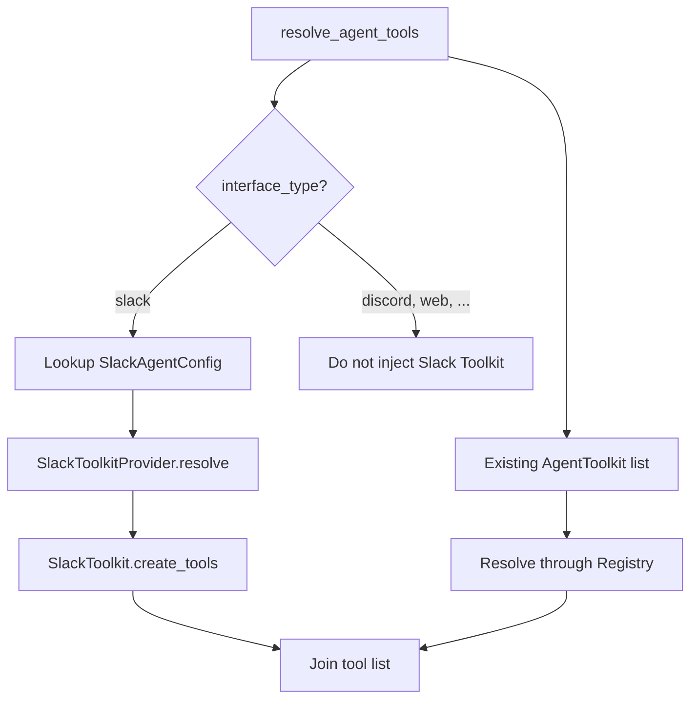
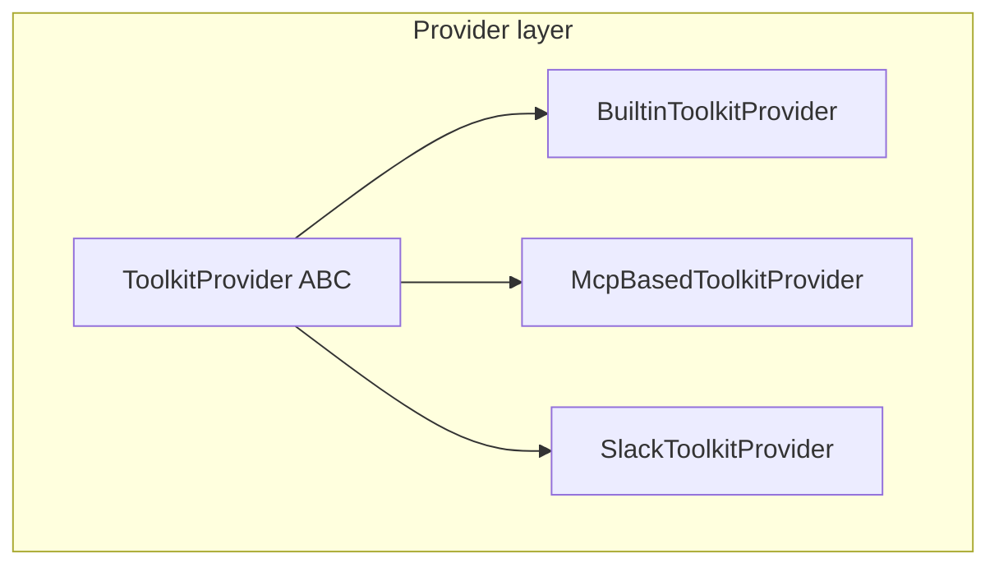
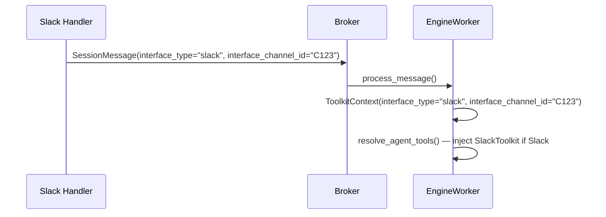
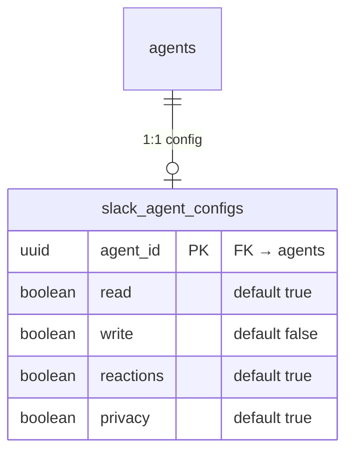
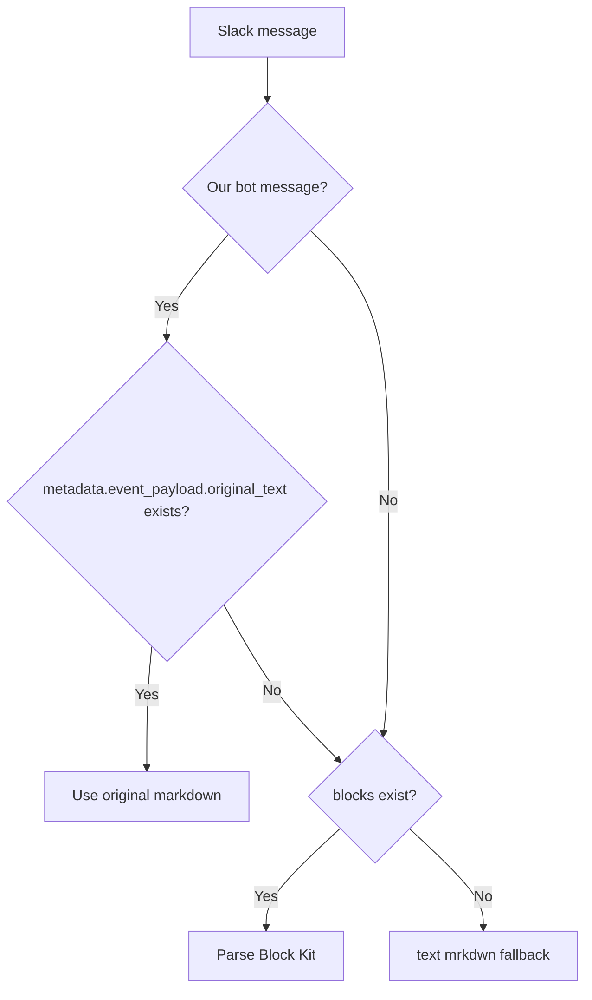
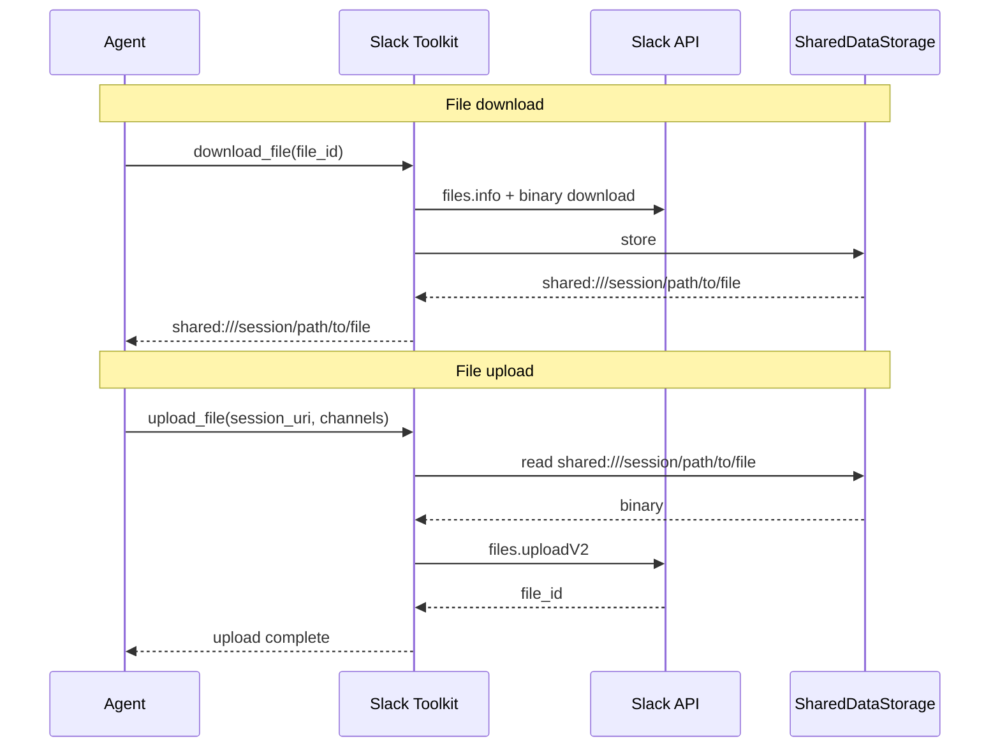
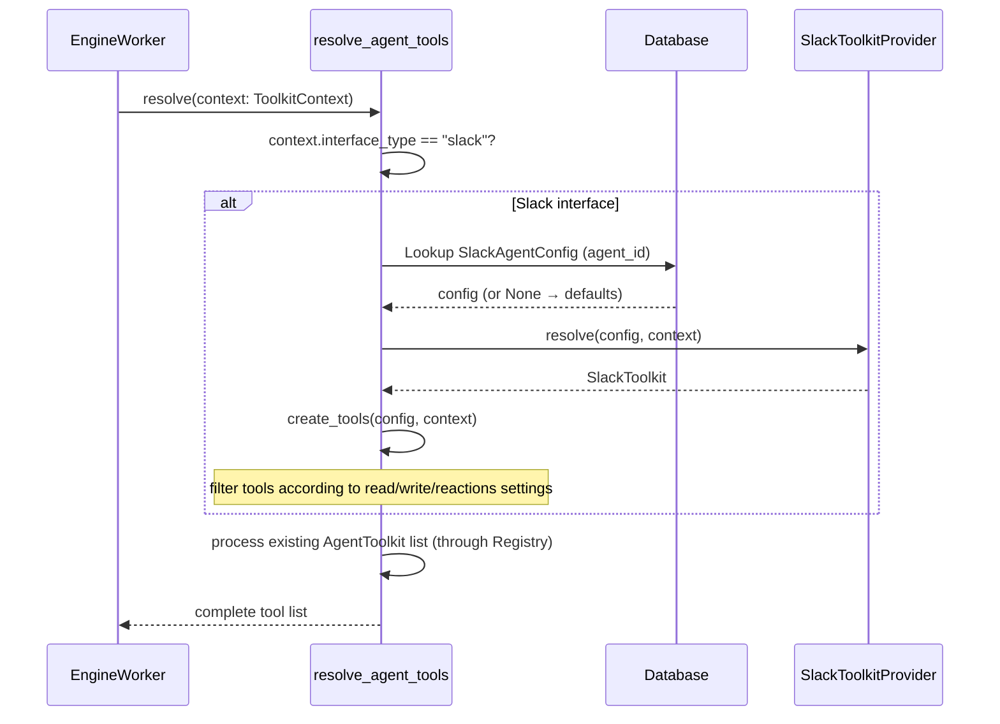

# Slack Toolkit Design

## Overview

Slack API Toolkit automatically bound to agents operating in Slack interface. Based on bot token, it provides channel history query, message sending, reactions, file handling, etc. as agent tools.

### Background

- Current Slack integration only handles message receive/send, and agent cannot actively use Slack API.
- It is unnatural for agent operating in Slack to not have Slack tools.
- Existing ToolkitConfig/AgentToolkit path is unsuitable for Slack integration (no reason for admin to manually assign).

### Custom implementation, not MCP-based

Slack official MCP (`https://mcp.slack.com/mcp`) is remote-only based on User Token OAuth. Bot Token based implementations only exist as community versions.

| | Bot Token (`xoxb-`) | User Token (`xoxp-`) |
|---|---|---|
| Sender | app name + bot icon | token owner themselves |
| Channel access | only channels bot is invited to | all channels/DMs user can access |
| Search | `search:read` unsupported | possible |
| Issuance | one per workspace on app install | per-user consent via OAuth flow |

This Toolkit is **custom bot-token-based implementation**. User Token OAuth based Slack MCP toolkit is planned separately, and that side follows MCP method stored in ToolkitConfig.credentials.

## Architecture

### Automatic binding — interface-dependent Toolkit

Slack Toolkit is a Toolkit that is **automatically bound when interface is Slack**, without going through ToolkitConfig/AgentToolkit.



- Automatically injected when `ToolkitContext.interface_type == "slack"` at `resolve_agent_tools()` time.
- Slack Toolkit cannot be selected in non-Slack interfaces.
- Not registered in Toolkit Registry, so it is not exposed in API toolkit list and cannot be manually assigned by admin.

### Reuse ToolkitProvider structure

`SlackToolkitProvider`/`SlackToolkit` implements existing `ToolkitProvider` ABC as-is. Only config source (SlackAgentConfig table) and binding method (automatic) differ.



### ToolkitContext extension

Current `ToolkitContext` has no interface information. Add optional fields for automatic binding.

```python
@dataclasses.dataclass(frozen=True)
class ToolkitContext:
    session_id: str
    workspace_id: str | None
    user_id: str | None
    run_id: str
    publish_event: Callable[[EngineEvent | DurableEvent], Awaitable[None]]
    # added
    interface_type: str | None = None        # "slack", "discord", "web", ...
    interface_channel_id: str | None = None  # Slack channel ID, etc.
```

Delivery flow:



## Data Model

### Bot token

Reuse bot token in existing `slack_installations` table. Same Slack app is used and only needed scopes are added.

### Config table

`slack_agent_configs` — per-agent Slack Toolkit config. 1:1 relationship with agent_id.



- If no row exists, operate with defaults (read ON, reactions ON, write OFF, privacy ON).
- If read/write/reactions are all OFF, zero tools → Toolkit itself is not bound.

### ToolkitType extension

```python
class ToolkitType(enum.StrEnum):
    SHELL = "shell"
    MCP = "mcp"
    SLACK = "slack"  # added
```

Separate type because it is custom implementation, not MCP-based. Future GitHub, Notion, etc. can also add their own types.

## Feature Categories

Can be enabled/disabled by category in settings.

| Category | Default | Tools | Required scopes |
|---------|------|------|-----------|
| **Read** | ON | channel history, thread query, channel list, user lookup, file download | `channels:history`, `groups:history`, `channels:read`, `users:read` |
| **Reactions** | ON | add/remove reaction | `reactions:write` |
| **Write** | OFF | send message, thread reply, file upload | `chat:write`, `files:write` |

## Privacy Mode

Even if bot has access permission, it must not disclose private channel/DM content elsewhere. Access scope is limited based on channel type of current conversation session.

### Privacy mode ON (default)

| Session channel type | Read | Write |
|--------------|------|------|
| public channel | all public channels | current channel only |
| private channel | all public + current private channel | current channel only |
| DM | all public + current DM | current channel only |

### Privacy mode OFF

Can read/write all channels bot is invited to.

### Implementation

Privacy mode limits channel access scope of tools at `SlackToolkit.create_tools()` stage based on `ToolkitContext.interface_channel_id`. Channel type is determined using Slack API `conversations.info` fields `is_channel`, `is_group`, `is_im`.

## Message Format

### Read: text extraction priority



1. **Our bot message + `metadata.event_payload.original_text`** → use original markdown
   - Messages sent with Slack stream API do not preserve markdown original in text/blocks.
   - Add `original_text` to `bot_metadata.event_payload` when handling `TextEnd` in `streaming.py`.
   - Message chunking is used, so metadata size limit is not an issue.
2. **`blocks` exists** → parse Block Kit (many bots put meaningful content only in blocks)
3. **`text` (mrkdwn)** fallback
4. sender/files/reactions remain metadata as before

### Write

Allow only mrkdwn text. No Block Kit generation.

### Block Kit parsing shared module

Implement shared parsing module in `services/slack/blocks.py`. Both Slack integration `history.py` and Slack Toolkit use this module.

```python
def extract_text_from_blocks(blocks: list[dict]) -> str:
    """Extract markdown-like text from Block Kit blocks."""
    ...
```

**Supported blocks:**

| Block type | Description |
|----------|------|
| `rich_text` | children: section, list (bullet/ordered), preformatted (code), quote |
| `section` | extract text field |
| `context` | extract elements text |
| `header` | extract plain_text |

**Inline elements:**

| Element | Handling |
|------|------|
| `text` | extract text (preserve bold/italic/strikethrough/code style) |
| `link` | preserve URL (`[text](url)` form) |
| `emoji` | preserve `:emoji_name:` |
| `user` | preserve `<@U123>` mention |
| `channel` | preserve `<#C123>` mention |
| `broadcast` | preserve `@here`, `@channel` |

## File Handling

Use Session Data Storage pattern.



- Images are handled multimodally with existing `read_image` tool.

### History file metadata integration

Currently `_msg_to_input()` in `history.py` puts only file names into metadata and does not pass `file_id`. To integrate with Toolkit `download_file(file_id)` tool, include `file_id`.

```python
# before: name only
metadata["files"] = ", ".join(f.get("name", "file") for f in files)

# after: name + file_id
metadata["files"] = ", ".join(
    f"{f.get('name', 'file')} (id: {f.get('id', '')})" for f in files
)
```

When agent finds file in history, it can call Toolkit download tool with `file_id`.

## History Query

| Parameter | Type | Description |
|---------|------|------|
| `limit` | int | default 10, max 100 |
| `oldest` | datetime (optional) | query start time |
| `latest` | datetime (optional) | query end time |

## Rate Limit

**TODO** — follow-up implementation with Redis-based distributed rate limit.

For now, return error on Slack API 429 response. Later, implement proactive rate limit with Redis.

## Binding Flow



## References

- [Toolkit assignment design](./toolkit-assignment.md) — existing Toolkit 3-layer structure
- [MCP Toolkit design](./mcp-toolkit.md) — MCP-based Toolkit design
- [Service Toolkit base implementation plan](./service-toolkit-base.md) — ToolkitProvider refactor
