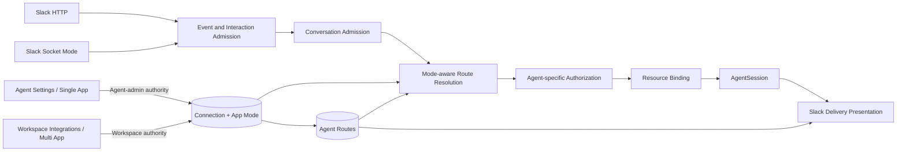

# Multi-Agent Slack App Routing Design

- Snapshot: `slackapp-260725`
- Document reference: `slackapp-260725/DESIGN`
- Requirements: [Multi-Agent Slack App Routing Requirements](../requirements/slackapp-260725-multi-agent-routing.md) (`slackapp-260725/REQ`)
- ADR: [Multi-Agent Slack App Routing](../adr/slackapp-260725-multi-agent-routing.md) (`slackapp-260725/ADR`)

## Overview

This design adds two intentionally separate Slack App product experiences on top of
one External Channel runtime model.

- A **Single App** is created and managed from Agent settings, has exactly one Agent
  route, and is owned by the current administrators of that Agent.
- A **Multi App** is created and managed from Workspace integration settings, may
  have zero or more Agent routes, and is owned by the Workspace administration
  permission boundary.

App mode is immutable. Sharing after Single App setup requires a separately created
Multi App. Existing dedicated Slack connections migrate in place as Single Apps.

Both modes reuse the current connection, route, resource, message, principal,
authorization, binding, AgentSession, Channel Work, and delivery lifecycle. Multi App
routing adds durable provider-interaction admission, route-neutral conversation
admission, channel defaults, explicit Agent selection, and resource-wide binding
uniqueness. No connection-only query may choose an arbitrary route.

## Traceability

| Requirement | ADR decisions | Design mechanism |
| --- | --- | --- |
| `slackapp-260725/REQ-1` | `ADR-D1`, `ADR-D4`, `ADR-D5`, `ADR-D7` | Immutable Multi App mode, Workspace management API/UI, Workspace permissions, and staged enablement |
| `slackapp-260725/REQ-2` | `ADR-D1`, `ADR-D3`, `ADR-D4`, `ADR-D5`, `ADR-D7` | Common Agent routes with mode-aware cardinality, durable catalog availability, and no mode conversion |
| `slackapp-260725/REQ-3` | `ADR-D1`, `ADR-D3`, `ADR-D4`, `ADR-D5`, `ADR-D7` | Existing Agent-scoped management becomes the Single App surface and preserves Agent-admin ownership |
| `slackapp-260725/REQ-4` | `ADR-D1`, `ADR-D4`, `ADR-D5`, `ADR-D7` | Separate Workspace Multi App creation, zero-Agent state, catalog management, and immutable mode |
| `slackapp-260725/REQ-5` | `ADR-D1`, `ADR-D2`, `ADR-D6`, `ADR-D8` | Available-route catalog, Agent-specific access projection, durable selector state, and minimal Agent presentation |
| `slackapp-260725/REQ-6` | `ADR-D2`, `ADR-D6`, `ADR-D8` | Message shortcut admission, retained source message, modal selection, and bold Agent-name output |
| `slackapp-260725/REQ-7` | `ADR-D2`, `ADR-D4`, `ADR-D6` | Connection/channel default record, Workspace-authorized Web management, and authenticated Slack handoff |
| `slackapp-260725/REQ-8` | `ADR-D2`, `ADR-D6` | Mention-origin conversation admission plus a provider control that opens the selector without creating a default |
| `slackapp-260725/REQ-9` | `ADR-D1`, `ADR-D2`, `ADR-D3`, `ADR-D6`, `ADR-D7` | Resource-wide active-binding constraint, canonical lock order, immutable selected route, and duplicate-safe callbacks |
| `slackapp-260725/REQ-10` | `ADR-D2`, `ADR-D6` | Route-neutral source retention followed by route-scoped access request and idempotent approval release |
| `slackapp-260725/REQ-11` | `ADR-D1`, `ADR-D3`, `ADR-D4`, `ADR-D5`, `ADR-D7` | Mode-specific impact preview, terminal affected bindings, invalidated defaults, and separate connection behavior |
| `slackapp-260725/REQ-12` | `ADR-D1`, `ADR-D3`, `ADR-D4`, `ADR-D5`, `ADR-D7`, `ADR-D8` | In-place Single App backfill, preserved identities, staged rollout, and optional icon fallback without reauthorization |
| `slackapp-260725/REQ-13` | `ADR-D1`, `ADR-D2`, `ADR-D3`, `ADR-D4`, `ADR-D6`, `ADR-D7`, `ADR-D8` | Connection-first provider authentication, route revalidation, principal isolation, Workspace fences, and fail-closed routing |
| `slackapp-260725/REQ-14` | `ADR-D8` | Bold current Agent name as first output content and capability-gated message icon override |

## Current Behavior and Gaps

- Every current Slack setup is Agent-qualified and creates one `dedicated` route.
- Connection persistence already contains the Workspace tenant, provider identity,
  encrypted credentials, capability snapshot, health, and Socket lease independently
  from the Agent route.
- The connection does not record whether its product owner is the Agent administrator
  boundary or the Workspace integration boundary.
- `route_mode = dedicated` has a partial connection-unique index. The reserved
  `platform` value is unused and does not express the accepted Single App/Multi App
  contract.
- Unbound event processing asks for one routable route by connection and orders with
  `limit(1)`. That is safe only while every connection has one route.
- Resources and canonical messages are already connection-scoped and route-neutral,
  but pending context and access requests require a route. Current processing chooses
  a route before persisting the canonical source message.
- Active binding uniqueness is `(resource_id, route_id)`, which would permit the same
  Slack thread to bind to different Agents through different routes.
- HTTP and Socket Events API admission already commit before acknowledgement. HTTP
  interaction parsing, Socket interactive-envelope handling, modal state, and
  shortcut configuration are absent.
- There is no channel-default persistence or Workspace Multi App management surface.
- Connection management, generated clients, tRPC, and Web UI are Agent-scoped.
- Existing delivery resolves the Agent through the binding route and can apply the
  new Agent-name wrapper without changing AgentSession execution authority.

## Architecture



### Ownership boundaries

#### Connection

The connection remains the durable provider-installation and credential root. Its
`workspace_id` is always the tenant boundary. A new immutable App mode determines the
product administration boundary:

- `single`: management is authorized through the sole route's Agent administrators;
- `multi`: management is authorized through Workspace External Channel permissions.

The individual who entered credentials is not a durable owner.

#### Agent route

The route remains the stable connection-to-Agent association used by bindings,
pending context, access requests, delivery, and retained history. Multi App catalog
availability is relationship state, not provider health or Agent lifecycle state.

#### External principal

Slack sender identity remains `ExternalChannelPrincipal` provenance. It is never
converted into an Azents User, including for shortcut selection or Slack-side channel
management. Workspace management mutations always complete in an authenticated
Azents request.

#### AgentSession execution

The selected route determines the Agent before Session creation. Once durable work is
released, execution authority remains the canonical AgentSession/Run snapshot. Slack
interaction payloads, requesters, approvers, connection owners, and broker wake-ups do
not carry execution User authority.

## Persistence Design

Names are design-level names. Implementation may refine identifiers while preserving
the ownership, uniqueness, and transition rules below.

### Connection App mode

Add an enum field to `external_channel_connections`:

| Field | Contract |
| --- | --- |
| `app_mode` | Immutable `single` or `multi` |

Every existing connection backfills to `single`. New Agent-scoped setup writes
`single`; new Workspace-scoped setup writes `multi`. No update operation changes this
field.

Do not reuse the reserved `platform` route mode to represent Multi Apps. During the
staged rollout, retain the current `route_mode` column only for old-runtime
compatibility. Mode-aware runtime reads connection App mode. A cleanup migration
removes the obsolete route mode after every runtime is mode-aware and before Multi App
creation is enabled.

### Mode-aware Agent route constraints

Extend `external_channel_agent_routes` with:

| Field | Contract |
| --- | --- |
| `connection_app_mode` | Constraint shadow of the owning connection mode |
| `catalog_status` | `available` or `removed` |
| `catalog_removed_at` | Removal timestamp when unavailable |
| `catalog_removed_by_user_id` | Authenticated administrator provenance when applicable |

The connection remains authoritative for App mode. The route shadow exists only to
make cardinality declaratively enforceable in PostgreSQL. A composite foreign key
from `(connection_id, connection_app_mode)` to a unique connection `(id, app_mode)`
prevents mismatch.

Required constraints:

- unique `(connection_id, agent_id)` for stable association reuse;
- partial unique `connection_id` where `connection_app_mode = 'single'`;
- route and Agent Workspace equality validated under a locked connection before
  insert; and
- Multi App selection requires `catalog_status = available` and active Agent
  lifecycle.

A removed Multi App association reuses its route row if the same Agent is added later.
Terminal bindings are never reactivated. A Single App route is never independently
removed from a live connection; its removal runs whole-connection disconnect.

### Channel defaults

Add `external_channel_channel_defaults`:

| Field | Contract |
| --- | --- |
| `id` | Stable default identity |
| `connection_id` | Multi App boundary |
| `provider_channel_id` | Slack channel identity |
| `route_id` | Selected available route |
| `status` | `active` or `invalidated` |
| `configured_by_user_id` | Authenticated Azents administrator |
| `invalidated_at` and `reason` | Relationship or connection lifecycle outcome |
| timestamps | Creation and change ordering |

Only one active default exists per `(connection_id, provider_channel_id)`. A composite
route/connection foreign key prevents cross-App defaults. Setting a default locks the
connection and route and rechecks Multi App mode, Workspace ownership, Agent lifecycle,
and catalog availability.

Removing a route invalidates its defaults in the same transaction. Resolution treats
missing, invalidated, removed-route, or inactive-Agent defaults as unconfigured and
never falls back to another route.

### Provider interaction admission

Add `external_channel_interactions` as the durable provider callback inbox for message
shortcuts, block actions, option requests, modal submissions, and channel-management
actions.

| Field | Contract |
| --- | --- |
| `id` | Opaque server interaction identity |
| `connection_id` | Authenticated provider connection |
| `transport` | HTTP or Socket |
| `provider_interaction_key` | Connection-scoped idempotency identity |
| `interaction_type` | Shortcut, block action, options, view submission, or management action |
| `callback_id` and `action_id` | Bounded provider routing identifiers |
| `principal_id` | Immutable Slack actor provenance when present |
| `resource_correlation_key` | Channel/thread source identity when present |
| `projection` | Bounded non-secret fields needed for processing |
| `status` | Accepted, processing, completed, expired, rejected, or failed |
| `expires_at` | Bounded interaction-state lifetime |
| timestamps and safe error fields | Retry and observability state |

`(connection_id, provider_interaction_key)` is unique. HTTP uses a digest of the
verified raw body. Socket Mode uses the provider envelope ID. Raw bodies,
`response_url`, tokens, and capability-bearing provider URLs are not stored.

### Conversation admission

Add `external_channel_conversation_admissions` as the route-neutral owner of an
unbound Slack conversation attempt.

| Field | Contract |
| --- | --- |
| `id` | Stable admission identity |
| `connection_id` | Receiving App installation |
| `resource_id` | Canonical Slack thread resource |
| `source_message_id` | Retained original request |
| `initiating_principal_id` | Slack participant provenance |
| `origin` | Single route, channel default, shortcut, or mention selector |
| `status` | Pending selection, selected, awaiting access, bound, expired, or rejected |
| `selected_route_id` | Nullable until resolved |
| `interaction_id` | Nullable provider interaction that initiated selection |
| `expires_at` | Selection lifetime independent from access-request lifetime |
| timestamps | Durable transition ordering |

A partial unique index permits at most one open admission per resource. The service
locks the resource before changing `selected_route_id` or creating a binding. An
existing resource-wide active binding always wins and makes later selection attempts
non-mutating.

The canonical resource, message, message revision, attachment metadata, and principal
exist before route selection. Route-scoped pending context is materialized from the
retained revision only after the route is selected.

### Resource-wide binding uniqueness

Replace the current active `(resource_id, route_id)` uniqueness with one active
binding per `resource_id` regardless of route. Retain route and Session references on
the binding.

A preflight migration verifies that no resource currently has more than one active
binding. Existing dedicated routing should make this invariant true; ambiguous data
fails migration rather than selecting a winner.

All mutations that may create or terminate a binding use one canonical lock order:

1. connection;
2. route when a route-specific transition is required;
3. resource;
4. current active binding;
5. conversation admission or access request; and
6. Session-owned dependent rows.

Connection disconnect, Multi App route removal, event processing, approval, and
initial binding creation must be refactored to this order. Sorted resource IDs are
used for bulk lifecycle transitions.

### Capability projection for Agent imagery

Extend the Slack connection capability snapshot with a message-customization flag.
Validation derives it from granted Slack scopes when the provider reports them.
Missing legacy capability is false.

The Agent image remains canonical Agent data. No presentation snapshot is stored on
the route, binding, or message. Delivery resolves the current Agent name and image
through the binding route. Only a provider-safe HTTPS image URL may be sent as an icon
override; any missing, private, invalid, or provider-rejected image falls back to the
App bot icon.

## Route Resolution

Every message first resolves its connection and canonical resource. Routing then
follows this strict order:

1. If the resource has an active binding, load its recorded route and Session. Do not
   inspect current defaults or selectors.
2. If the connection is a Single App, require exactly one eligible sole route and
   select it.
3. If the connection is a Multi App and an active channel default resolves to an
   available route, select that route.
4. Otherwise require explicit participant selection through a durable conversation
   admission.
5. Missing, ambiguous, removed, cross-Workspace, inactive-Agent, or conflicting state
   fails without creating an AgentSession or invoking an Agent.

No route lookup orders candidates or uses `limit(1)` as a routing decision.

## Slack Interaction and Conversation Flows

### HTTP and Socket admission

The existing fixed Slack callback route accepts both JSON Events API payloads and
form-encoded interaction payloads. A minimal untrusted parser extracts App and Team
identity to select an HTTP connection candidate; raw-body HMAC and timestamp
verification remain authoritative before interaction admission.

Socket Mode extends its envelope dispatcher from `events_api` to interactive payloads.
The active fenced connection lease is required. Both transports commit the durable
interaction row before acknowledgement.

Provider acknowledgement transactions do not load the full Agent catalog, hydrate
history, download files, authorize a participant, create a Session, or invoke an
Agent.

### Message shortcut

1. Slack sends `Ask an Azents Agent` for one visible source message.
2. Admission authenticates the connection and inserts or reuses the interaction.
3. The fast path persists the source resource/message identity and opens the Agent
   selector within Slack's interaction deadline.
4. Expensive reference lookup, attachment enrichment, and catalog preparation may
   continue asynchronously.
5. Modal metadata contains only the opaque interaction/admission identity.
6. Submission locks the admission and resource, revalidates the selected route and
   access state, and applies `pending_selection -> selected` once.
7. Duplicate callbacks return the existing state and cannot create another binding or
   invocation.

The selector never trusts an Agent ID merely because Slack returned it. The server
reloads the route through the authenticated connection and Workspace boundary.

### Multi App mention with a default

An eligible unbound App mention persists the canonical source and conversation
admission, resolves the channel default, and records the selected route. It then
enters normal Agent-specific authorization. The default is not copied into the
binding; the route selected at binding time is durable.

### Multi App mention without a default

An Events API mention has no participant interaction trigger for opening a modal.
Azents therefore persists the source and posts one idempotent thread control with an
Agent-selection action. The participant action supplies the interaction trigger and
opens the same selector used by the message shortcut.

Selecting an Agent affects only that conversation admission. It does not create a
channel default. A separate Workspace-authorized action may configure the channel.

### Single App invocation

A Single App never presents a multi-Agent selector. After route-neutral source
persistence, the service validates the sole route and follows the same authorization,
binding, hydration, invocation, and delivery paths used after Multi App selection.

### Existing binding and alternate selection

A shortcut or mention against an already bound resource returns the recorded Agent
identity and does not create a second admission. Requesting another Agent produces
instructions to start a separate top-level Slack conversation. No API changes the
binding route or Session.

### Approval continuity

Once a route is selected, the retained source revision becomes route-scoped pending
context and the existing access-request flow applies.

- No Session, binding, or run is created while access is pending.
- Allow locks the resource and rechecks the resource-wide active binding before
  creating the Session and binding.
- If another valid flow bound the resource first, the request resolves without
  rerouting or creating a second Session.
- Repeated decisions and callback retries reuse the existing request, grant, binding,
  and invocation batch.

## Catalog and Selector Projection

The Multi App catalog contains only `available` routes whose Agents are active and in
the same Workspace. For the initiating principal, each Agent projects one of:

- immediately available through an active grant;
- `Access required`; or
- no longer selectable because a concurrent lifecycle change occurred.

Blocked participants cannot invoke the Agent. The selector may display the Agent as
requiring access only when the current access policy permits a new request; a hard
block is presented as unavailable rather than allowing submission.

Provider UI limits must never silently truncate the catalog. The modal uses bounded
pages or provider-supported option loading, stable Agent IDs, and deterministic name
ordering. Search and pagination requery current available routes. Submission always
revalidates instead of trusting the displayed page.

## Management API Design

### Single App API

The existing Agent-scoped routes remain the formal Single App API:

```text
/workspaces/{handle}/agents/{agent_id}/external-channels/...
```

They list, create, validate, replace, and disconnect only `single` connections whose
sole route identifies the path Agent. Authorization uses the existing AgentAdmin
boundary. The service rejects a Multi App connection through these mutation routes.

Agent responses may include a sanitized read-only list of associated Multi Apps for
context, but they expose no Multi App credentials or mutations.

### Multi App API

Add Workspace-scoped operations under a separate collection such as:

```text
/workspaces/{handle}/external-channel-apps
/workspaces/{handle}/external-channel-apps/slack
/workspaces/{handle}/external-channel-apps/{connection_id}
/workspaces/{handle}/external-channel-apps/{connection_id}/agents/{agent_id}
/workspaces/{handle}/external-channel-apps/{connection_id}/channel-defaults
```

The exact route naming may follow Public API conventions, but the Agent path is not
reused. Operations include:

- list active Multi Apps with health, sanitized capability state, Agent count, and
  configured-default count;
- create and validate a zero-Agent or populated Multi App;
- replace complete App identity, transport, and credential set;
- add or re-enable an Agent association;
- preview and remove an Agent association;
- preview and disconnect the whole Multi App;
- list, set, replace, and clear channel defaults with pagination; and
- retrieve sanitized Agent associations and impact projections.

Add dedicated `EXTERNAL_CHANNELS_READ` and `EXTERNAL_CHANNELS_WRITE` permissions.
Workspace Owner has all permissions. Workspace Manager receives read/write. Ordinary
Members do not receive the Multi App management permission. Agent-context read-only
association projection continues through Agent visibility rather than granting
Workspace integration authority.

### Impact preview and mutation fencing

Relationship removal and connection disconnect expose a preview containing affected
channel defaults, active binding count, affected Agent Sessions, and sanitized Slack
channel/thread labels. The preview contains a connection or route generation token.

The destructive command locks current state, recomputes impact, and rejects a stale
expected generation. The UI refreshes the preview instead of applying a materially
different destructive result than the administrator confirmed.

### Slack-side channel management

A Slack message action for Multi Apps creates an opaque, expiring management handoff
bound to the connection and current provider channel. It returns a link to Azents.
After normal authentication, the Web route requires Workspace write permission and
reloads the handoff. The user may view or change the default from that focused page.

The Slack principal is retained only as interaction provenance. It is not matched to
the authenticated Azents User.

### Generated clients

Every public schema change is made in source API models, followed by the approved
OpenAPI and Python/TypeScript client generators. Generated files are never edited by
hand. The tRPC layer consumes generated operations and does not implement a parallel
untyped management client.

## Web Product Design

### Agent settings: Single Apps

The existing External Channel settings area becomes the Single App workspace for the
current Agent.

- Primary action: `Connect Slack`.
- No Single/Multi mode selector is shown.
- Each row shows App identity, transport, connection health, file/customization
  capabilities, and Agent-owned management actions.
- Disconnect preview states that removing the Agent connection also removes the
  Single App and terminates affected bound conversations.
- Associated Multi Apps may appear in a separate read-only subsection labeled as
  Workspace-managed, with a link to Workspace integrations only when the viewer has
  permission.

### Workspace integrations: Multi Apps

Add a Slack Apps operational table rather than a card mosaic. Each row shows:

- App name and Slack Team identity;
- transport and health;
- Agent count;
- configured channel-default count;
- setup-needed state for zero Agents;
- credential/capability warnings; and
- edit, validate, catalog, defaults, and disconnect actions.

The detail workspace keeps Agent catalog and channel defaults near the App identity
and health. Destructive actions use the impact preview. Large Agent and channel lists
are paginated and searchable.

### Required UI states

Both surfaces cover loading, empty, validation failure, reconnect required, permission
denied, mutation conflict, stale impact preview, zero-Agent Multi App, removed Agent,
invalidated default, and disconnected-history navigation. Mobile presentation
collapses tables into focused rows without hiding current mode, owner, or destructive
impact.

## Slack Agent Presentation

Every route-associated Agent output uses one shared renderer:

1. resolve the current canonical Agent name;
2. escape and bound it for Slack markup;
3. render it in bold as the first visible content;
4. begin top-level fallback text with the same name; and
5. render the rest of the existing answer, progress, control, error, or file message.

There is no additional Agent banner, `Azents Agent` label, connection notice,
description, access badge, or binding-time presentation snapshot.

For block-based output, the renderer prepends one minimal Agent-name section before
the existing answer, native `task_card`, native `plan`, action, or control blocks.
For file-bearing output, the completion comment starts with the same bold Agent-name
line. The existing provider-native content remains otherwise unchanged.

When the connection capability permits message customization and the Agent has a
provider-retrievable image URL, the Slack request includes an icon override. The bot
username and bot user identity are never changed. Missing capability, missing image,
private image, invalid URL, or provider rejection falls back to the App bot icon
without failing the underlying delivery.

New setup guidance includes Slack message-customization scope. Existing Single Apps
continue without reinstallation; their output still begins with the bold Agent name
and uses the default bot icon when the capability is absent.

## Lifecycle Behavior

### Single App removal

The Agent-admin command previews impact and then runs whole-connection disconnect.
It terminalizes the connection, sole route availability, resources, bindings, pending
work, and credentials through the existing connection lifecycle. Retained provider
and Session history remains. A new Single App connection is required for later use.

### Multi App Agent removal

The Workspace command locks the connection and route, terminalizes every active
binding for that route, invalidates its channel defaults, clears unreleased route
context according to existing lifecycle ownership, and marks the route catalog entry
removed. Other routes, credentials, transport, and connection health remain active.

Re-adding the Agent makes the preserved route available for new conversations. It
does not reactivate old bindings or defaults.

### Multi App disconnect

Whole-App disconnect terminalizes every route's active bindings and defaults, ends
connection-owned work, clears credentials and leases, and retains history. It is
idempotent and independent from whether the catalog currently contains zero or many
Agents.

### Agent decommission and Session lifecycle

Agent decommission fences new selection immediately. Multi App catalog rows for the
Agent become unavailable before direct route cleanup can proceed. Existing Session
archive, restore, and purge ownership remains unchanged: restore never reactivates a
binding, and restrictive lifecycle cleanup precedes final route or Agent removal.

## Migration, Rollout, and Rollback

### Phase 1: additive schema foundation

Create new migrations; never edit an executed migration.

- add connection App mode with a `single` server default suitable for old writers;
- backfill and validate every existing connection as Single App;
- add the route constraint shadow and backfill existing routes;
- add stable connection/Agent uniqueness;
- add catalog availability fields without changing current route eligibility;
- add interaction, conversation admission, and channel-default tables;
- add resource-wide active-binding uniqueness after a duplicate preflight;
- retain current route mode and Agent-scoped behavior for rolling compatibility; and
- keep Multi App creation unavailable.

The migration aborts on a connection without exactly one dedicated route, a route
whose Agent is outside the connection Workspace, duplicate connection/Agent routes,
or multiple active bindings for one resource. It never guesses ownership or deletes a
winner.

### Phase 2: mode-aware runtime

Deploy mode-aware code to every API and worker instance while only Single App data can
exist.

- replace connection-only route selection;
- split route-neutral source persistence from route-scoped projection;
- apply resource-wide binding locks;
- support interaction and conversation admission;
- support mode-specific management and lifecycle services;
- support optional message icon customization; and
- keep Workspace Multi App creation endpoints absent or disabled.

Verify that all running revisions are mode-aware before proceeding.

### Phase 3: Multi App product enablement

- remove obsolete runtime dependence on route mode and apply its cleanup migration;
- add and publish Workspace Multi App API schemas;
- regenerate public clients;
- deploy tRPC and Workspace UI;
- enable Slack shortcut/interactivity setup guidance and Socket interactive handling;
- enable Multi App creation and multiple routes only after the new runtime is fully
  deployed; and
- run deterministic end-to-end evidence before production enablement.

### Rollback

Before Multi App creation is enabled, application rollback is permitted because all
rows remain Single-compatible and schema changes are additive.

After a Multi App or multiple routes exist, rollback to any runtime containing
connection-only `limit(1)` routing is prohibited. Disable new Multi App mutations,
retain mode-aware workers, and forward-fix. Do not downgrade or stamp the production
database.

## Security and Failure Handling

- Provider App and Team identity selects only a connection candidate; HTTP HMAC or an
  owned Socket lease authenticates admission.
- Interaction payload Agent IDs, route IDs, channel IDs, and modal metadata are
  untrusted until reloaded through the authenticated connection.
- Every selection rechecks connection mode/status, Workspace, route availability,
  Agent lifecycle, resource state, principal block, and current binding.
- Workspace management never accepts Agent-scoped authority for Multi App mutations.
- Single App management never accepts a connection whose mode or sole route does not
  match the path Agent.
- Channel-management handoffs are opaque, expiring, connection/channel-bound, and
  consumed only after Azents authentication and Workspace permission checks.
- Slack sender/uploader provenance is immutable and never establishes an Azents User.
- Secrets, raw interaction payloads, response URLs, tokens, message bodies, file
  bytes, and private image URLs are excluded from logs and operational evidence.
- Catalog changes while a modal is open fail closed at submission and display a
  refreshed unavailable state.
- Duplicate provider callbacks, modal submissions, approval callbacks, and binding
  creation races converge through separate unique identities and locks.
- Icon customization failure never changes the durable delivery intent or retries an
  already attempted provider mutation; the request falls back before the attempt when
  capability or image validation fails.

## Observability

Add structured counters and latency histograms for:

- provider interaction admitted, deduplicated, expired, and rejected;
- shortcut/modal acknowledgement and open-deadline outcomes;
- conversation admissions by origin and terminal status;
- route resolution by Single, default, selector, existing binding, and fail-closed
  reason;
- catalog revalidation failures and stale modal submissions;
- resource-wide binding conflicts;
- invalidated channel defaults;
- Single removal, Multi route removal, and Multi disconnect impact counts;
- optional icon override used, unavailable, invalid, or provider-rejected; and
- phase-gated attempts to create Multi App data before enablement.

Logs contain durable IDs, mode, transition, and safe categorical outcomes. They do not
contain Slack message text, file bytes, access tokens, signing secrets, response URLs,
or full interaction bodies.

## Test Strategy

Product behavior verification is E2E-first. Repository/service tests prove state and
concurrency invariants; deterministic Slack-provider fixtures prove the observable
Slack and Web flow.

### E2E primary matrix

| Scenario | Required evidence |
| --- | --- |
| Existing dedicated migration | Existing connection appears as Single App with the same route, binding, Session, credentials, and working mention flow; no reauthorization occurs |
| Single App ownership | Agent admin creates, edits, validates, and removes a Single App; a non-admin cannot; removal disconnects the App and affected threads |
| Multi App ownership | Workspace-authorized user creates a zero-Agent Multi App, adds multiple Agents, and manages it; Agent-only admin cannot create or mutate it |
| Shortcut selection | Shortcut retains source text/files, displays all eligible Agents and access state, selects once, and starts the selected Agent conversation |
| Unconfigured mention | Mention creates one selection control and no default; duplicate event/action callbacks do not duplicate admission or execution |
| Channel default | Authorized Web and Slack-handoff flows show the same default; future unbound mentions use it; existing bindings do not change |
| Approval continuity | `Access required` selection retains source and files, creates no run before Allow, and releases exactly once after approval |
| Binding race | Concurrent default, shortcut, and modal submissions create at most one active binding and one Session for the resource |
| Relationship removal | Preview identifies defaults/bindings; Multi route removal leaves App/other Agents active; Single removal disconnects the whole App; old threads do not reroute |
| Provider transports | Signed HTTP interactions and Socket interactive envelopes both commit before acknowledgement and deduplicate retries |
| Agent presentation | Every Agent output begins with bold current Agent name; supported image capability captures icon override; missing scope/image uses default icon without delivery failure |
| Rollout gate | Multi App creation is unavailable before mode-aware enablement and becomes available only in the final phase fixture |

### Deterministic fixture requirements

Extend the Slack provider fake with:

- form-encoded signed shortcut, block action, option, and view-submission callbacks;
- Socket Mode interactive envelopes and acknowledgement capture;
- `views.open` and `views.update` with trigger expiry and view-hash conflict behavior;
- configurable Agent catalog pages and access states;
- duplicate and reordered callback injection;
- channel-default management handoff capture;
- message and file-delivery capture including first rendered content and optional
  icon override;
- capability variants with and without message customization;
- multiple App installations and separate Single/Multi connection fixtures; and
- provider errors, rate limits, expired state, removed route, and stale selection
  cases.

Fixtures use deterministic fake credentials and never record real tokens, Slack text,
file bytes, or response URLs. Large-catalog fixtures verify pagination/search without
silent truncation.

### Backend verification

- migration upgrade tests cover successful existing-data backfill and every ambiguity
  abort condition;
- repository tests cover mode/cardinality constraints, route reuse, default
  invalidation, interaction dedupe, open-admission uniqueness, and resource-wide
  binding uniqueness;
- concurrency tests cover selector/default/approval races under the canonical lock
  order;
- HTTP tests cover content-type routing, signature/replay verification, bounded
  projection, and acknowledgement after commit;
- Socket tests cover interactive dispatch, lease fencing, dedupe, and acknowledgement;
- lifecycle tests cover Single disconnect, Multi route removal, Multi disconnect,
  Agent decommission, archive, restore, and purge;
- presentation tests cover Slack escaping, fallback text, provider-safe image
  resolution, capability fallback, and file-bearing output; and
- authorization tests prove no Slack principal, requester, creator, owner, or approver
  becomes execution User authority.

### Web verification

- stories and component tests cover separate Agent and Workspace surfaces, zero-Agent
  setup, large catalogs, channel defaults, impact previews, stale conflicts, health,
  permission denial, and mobile layouts;
- generated-client and tRPC tests prove that Single and Multi mutations cannot cross
  their authorization paths; and
- modal copy and destructive confirmations identify scope and affected conversations
  without exposing credentials.

### CI and live-test policy

- run focused Ruff, Pyright, and Pytest for the Python app;
- regenerate OpenAPI and Python/TypeScript clients through generators and verify no
  drift;
- run TypeScript format, lint, typecheck, tests, and build sequentially;
- run deterministic E2E for both HTTP and Socket Mode fixtures;
- validate migration upgrade from a representative pre-feature snapshot; and
- validate documentation snapshot rules and generated indexes through normal hooks.

Live Slack tests are optional diagnostics, not required CI. They run only with an
explicit dedicated test Workspace, App credentials, and channel fixture. Missing live
credentials produce a declared skip; deterministic fixture failure is never skipped.
A live failure records only operation, status, safe Slack error code, durable IDs, and
timestamps.

## Implementation Phases

This is a large cross-cutting feature and should be delivered as a stacked series after
design approval.

1. **Schema and domain foundation** — App mode, route constraints/availability,
   admissions, defaults, binding uniqueness, migrations, and repository tests.
2. **Mode-aware runtime** — route-neutral persistence, resolution, locking,
   authorization/lifecycle integration, interaction adapters, and presentation.
3. **Single App product migration** — formalize existing Agent-scoped API/UI behavior
   and verify existing connection continuity while Multi creation remains disabled.
4. **Multi App management and Slack selection** — Workspace permissions/API/UI,
   catalog/defaults, shortcuts/modals, generated clients, and provider fixtures.
5. **Enablement and cleanup** — remove obsolete route-mode dependency, enable Multi
   creation after runtime verification, complete E2E evidence, and update living specs.

Implementation must use generated clients, never hand-edit them. Current living specs
are updated only with implemented behavior in the final phase.

## Alternatives Considered

The ADR records the rejected durable alternatives. The complete design also rejects:

- exposing a combined Single/Multi mode picker in one setup dialog;
- deriving Multi App authority from any associated Agent administrator;
- copying an existing Single connection or binding graph into Multi App ownership;
- using Slack payload metadata as selector or authorization source of truth;
- retaining per-route active-binding uniqueness in a multi-route connection;
- silently selecting the newest or first route when a default/selection is absent;
- requiring existing Apps to reinstall only for Agent icon customization; and
- adding presentation banners or stored identity snapshots beyond the requested Agent
  name and optional icon.

## Feasibility

| Requirement | Result | Repository evidence and condition |
| --- | --- | --- |
| `slackapp-260725/REQ-1` | feasible | Connection credentials, health, validation, disconnect, and sanitized management projections already exist; add Workspace permission/API/UI boundaries |
| `slackapp-260725/REQ-2` | feasible | Agent routes already provide stable connection/Agent identity; mode shadow and uniqueness constraints provide required cardinality |
| `slackapp-260725/REQ-3` | feasible | Current Agent-scoped setup, manifest, validation, edit, and disconnect become the Single App surface |
| `slackapp-260725/REQ-4` | feasible | Connection persistence already supports zero routes after creation; new Workspace management composes existing connection services with catalog operations |
| `slackapp-260725/REQ-5` | conditional | Access grants/blocks are reusable; deterministic Slack modal/catalog fixtures and provider-bounded large-list behavior must be added |
| `slackapp-260725/REQ-6` | conditional | Slack interaction and source-message fields support the flow; manifest, HTTP form parsing, Socket interactive dispatch, and modal client operations are new |
| `slackapp-260725/REQ-7` | feasible | Durable connection/channel defaults and authenticated opaque handoffs fit existing Workspace auth and Slack control-delivery patterns |
| `slackapp-260725/REQ-8` | feasible | Existing invocation event persistence and control delivery can create one selector action when no default resolves |
| `slackapp-260725/REQ-9` | conditional | PostgreSQL partial uniqueness and resource locks are available; all current binding mutation paths must adopt the new global lock order |
| `slackapp-260725/REQ-10` | feasible | Existing pending context, access request, grant, approval, hydration, batch, and wake lifecycles are reused after route selection |
| `slackapp-260725/REQ-11` | feasible | Existing connection/binding cleanup provides the terminal mechanics; add route-scoped bulk impact and default invalidation |
| `slackapp-260725/REQ-12` | conditional | Existing connection/route identity can backfill in place; migration preflight must prove one route per connection and one active binding per resource |
| `slackapp-260725/REQ-13` | feasible | Current connection authentication, restrictive FKs, Agent-specific authorization, routing-only wake, and durable reload boundaries remain authoritative |
| `slackapp-260725/REQ-14` | feasible | Agent name/avatar and Slack capability projection already exist conceptually; optional customization falls back without changing delivery availability |

### Decision feasibility

| ADR decision | Result | Evidence |
| --- | --- | --- |
| `ADR-D1` | feasible | Connection and Agent route are already separate durable records; declarative mode/cardinality constraints avoid a second runtime model |
| `ADR-D2` | feasible | Resource/message/revision are already route-neutral; pending context can move to a post-selection projection step |
| `ADR-D3` | feasible | Existing connection and binding terminalization can be composed with route-scoped Multi removal |
| `ADR-D4` | feasible | AgentAdmin and Workspace permission systems already exist; separate APIs prevent authority ambiguity |
| `ADR-D5` | feasible | Immutable creation-time mode removes transition and ownership migration requirements |
| `ADR-D6` | feasible | Existing HTTP/Socket durable event admission is the reusable transaction and acknowledgement pattern |
| `ADR-D7` | feasible | Additive migrations and a no-Multi intermediate runtime create a safe rolling-deployment boundary |
| `ADR-D8` | feasible | Outbound Slack rendering and capability checks are centralized enough to add a shared prefix and optional icon input |

No requirement-level or decision-level blocker remains.

## Remaining Non-Blocking Risks and Assumptions

- Slack interaction and modal provider limits may require bounded paging or option
  loading for unusually large Agent catalogs; the design requires discoverability and
  no silent truncation, not one fixed visual control.
- Agent avatar delivery depends on a Slack-retrievable provider-safe image URL. The
  bold Agent name remains authoritative when an image cannot be used.
- Existing Single Apps do not gain shortcut or icon customization capabilities without
  reinstalling; continuity takes precedence and fallback behavior is required.
- Route availability reintroduces relationship lifecycle state after the earlier
  removal of generic route status. Living specs must distinguish catalog availability
  from provider health, Agent lifecycle, and binding status.
- The resource-wide binding lock-order refactor touches admission, approval,
  disconnect, hydration, and decommission paths and requires focused concurrency
  evidence before Multi creation is enabled.
- Production enablement must prove that no old connection-only routing worker remains.
  Once Multi data exists, forward-fix is the only safe runtime recovery strategy.
