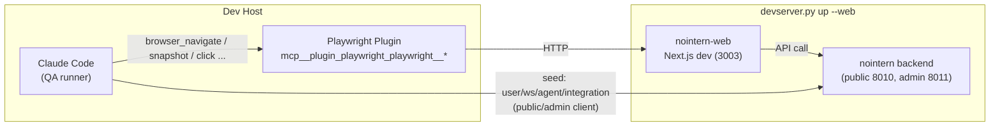

# Stage 4 — browser/web QA for nointern testenv

## Background

`testenv/nointern` is an isolated integration test environment for nointern backend + agent runtime. Stage 1~3 secured these outputs:

| Stage | Output |
|---|---|
| 1 | `devserver.py` lifecycle, public/admin ports, preflight checks |
| 2 | `live/chat.py` — chat session WS collection helper |
| 3 | `live/sandbox.py`, `live/tools.py`, `live/mcp.py`, shell-tool / sandbox-isolation / mcp-toolkit scenarios |

Stage 4 enables end-to-end QA including the **screen seen by human users (nointern-web Next.js)**.

## Error in Previous Design (closed #2430~#2436)

Previous stack attached Playwright MCP toolkit to **nointern agent** so agent would call `browser_navigate`, etc. In other words, it made a structure where "system under test (nointern) has a bot manipulating itself."

Problems with this structure:
- The test target tests itself, so verification loses meaning.
- Execution depends on LLM prompt and is non-deterministic.
- In actual run, nointern engine ↔ Playwright MCP HTTP streamable_http transport hangs permanently (same at 30s and 120s) — suspected structural problem.

Discussion #2441 identified the error and decided full redesign.

## Core Decisions (Discussion #2441)

| ID | Decision |
|---|---|
| **P1** | Caller of Playwright MCP is **Claude Code (QA runner)**. Do not touch nointern engine/toolkit code. |
| **P2** | Add only `devserver.py up --web`; do **not** add MCP server lifecycle such as `--playwright`. Enable Playwright plugin in `testenv/nointern/.claude/settings.json`. |
| **P3** | Scenarios use **runbook .md format**. Browser tests minimize API bypass and verify directly through UI. |
| **P4** | `seed/web.py` — storage state cache helper. Backend seed reuses existing helpers such as `seed/auth.py`. |
| **P5** | No need for browser_* matchers in `live/matchers.py` — Claude Code judges snapshot directly in its own context with natural language. |
| **P6** | Write all TC-WEB-001 ~ 005 (homepage smoke / login / chat / agent create / shell tool result). |

## Architecture



Core:
- **Playwright caller is Claude Code itself**. There is no browser-related toolkit inside nointern.
- nointern-web communicates with nointern backend as usual (no change).
- testenv seeds only backend state (user, workspace, agent, model integration, ...) through nointern public/admin client. All UI manipulation is done directly by Claude Code through Playwright.

## Scenario Format (runbook)

```markdown
---
test_id: TC-WEB-NNN
category: browser
severity: ...
created: YYYY-MM-DD
title: "..."
---

# TC-WEB-NNN — Title

## Purpose
User path / edge case to verify

## Preconditions
- devserver state (`devserver.py up --web`)
- backend state testenv must seed (user/ws/agent/model, etc.)

## Backend seed (Python, using testenv)
```python
client = build_client_from_env()
user = client.auth.create_user()
ws = client.workspace.create(user)
...
```

## QA runner steps
1. `browser_navigate("http://localhost:3003/...")`
2. `browser_snapshot()` → verify snapshot contains "..."
3. `browser_click(...)` → ...

## Expected result
Text/elements to confirm in snapshot
```

No separate Python runner file. QA runner (Claude Code) reads .md directly, executes, and reports result to PR/issue comment.

## Scenario Catalog

| test_id | severity | Core verification | Dependency |
|---|---|---|---|
| TC-WEB-001 | medium | homepage load smoke (logged out) | nointern-web only |
| TC-WEB-002 | critical | UI login flow (admin API code fetch) → storage state cache | + admin API |
| TC-WEB-003 | high | chat session → message → response UI rendering | + LLM key |
| TC-WEB-004 | high | agent creation form → appears in list | + nointern-web form |
| TC-WEB-005 | high | shell tool result is exposed in chat UI ToolCallCard | + Stage 3 sandbox |

## Feasibility Result Summary

All passed. The following 4 items are **facts** that must be reflected in scenario steps (Discussion #2441 feasibility comment):

1. Chat page path = `/w/[handle]/chat` (workspace handle is in path)
2. `ToolCallCard` is collapsed Accordion → TC-WEB-005 needs Accordion expand step
3. `auth_v1_get_email_verification_by_email(email, csrf_token)` is already called in `testenv/nointern/seed/auth.py:51-54` — reuse as-is
4. Stable anchor for TC-WEB-001: `"Stop delegating to humans."` (HeroSection headline)

Additional facts:
- Chat input is `Mantine Textarea`, placeholder `"Type a message…"`. Send button is IconSend (no aria-label — target IconSend location in accessibility tree).
- Logged-out access to `/w/[handle]/chat` → `LoginRequired` component.
- Required agent form fields: `name`, `llm_provider_integration_id`, `llm_provider_model_identifier`, `type`, `enabled`. After save, `router.push(/w/{handle}/agents)` redirects to list.

## Implementation Scope

### Add
- `testenv/nointern/.claude/settings.json` — `playwright@claude-plugins-official: true`
- `testenv/nointern/devserverlib/web.py` — `start_web` / `stop_web` / `is_web_running` / `wait_for_web_ready`
- `testenv/nointern/devserverlib/paths.py` — `WEB_SESSION_NAME`, `WEB_LOG_FILE`, `NOINTERN_WEB_DIR`, `TYPESCRIPT_DIR`, `DEFAULT_WEB_PORT=3003`
- `testenv/nointern/devserver.py` — `up --web` flag, web handling in `down`/`status`
- `testenv/nointern/checks/web.py` — checks node / pnpm / nointern-web deps / 3003 port
- `testenv/nointern/seed/web.py` — storage state cache helper (`StorageState.path / has / save / load`)
- `testenv/nointern/scenarios/browser/TC-WEB-001.md` ~ `TC-WEB-005.md` — runbook format
- `testenv/nointern/scenarios/INDEX.md` — add `### browser` section
- `testenv/nointern/README.md` — add Stage 4 section

### Explicitly Excluded (difference from previous design)
- Playwright MCP HTTP server lifecycle (`devserverlib/playwright.py`) — none
- `--playwright` flag — none
- Playwright-related preflight checks (8931 port, chromium, etc.) — none
- toolkit attach / chat / tools DI in `live/browser.py` — none
- `browser_*` matcher in `live/matchers.py` — none

## Risks

| Risk | Mitigation |
|---|---|
| Claude Code playwright plugin tool prefix changes in later version | Document "current tool prefix" in scenario .md and handle change with grep replace |
| nointern-web UI changes later and anchor text/path breaks | Run scenario directly once before each PR merge — runbook enables quick re-run |
| Storage state cache becomes stale and login reuse fails | TC-WEB-002 is responsible for creating cache again, so rerun it on invalidation |

## Alternatives Considered

| Alternative | Rejection reason |
|---|---|
| Attach Playwright MCP toolkit to nointern agent (previous design) | Test target tests itself, non-deterministic, structural hang in actual run |
| Python runner + assertion helper (reuse Stage 3 pattern) | Caller is Claude Code, so routing call result back through Python is unnatural. Runbook is clearer |
| devserver starts Playwright HTTP server | Claude Code has its own plugin, so duplicate. Previous design hang occurred on this path too |

## References

- Discussion: azents/azents#2441
- Issue: azents/azents#2327
- Preceding: Stage 3 #2426
- Previous (closed) stack: #2430, #2431, #2432, #2433, #2434, #2435, #2436
