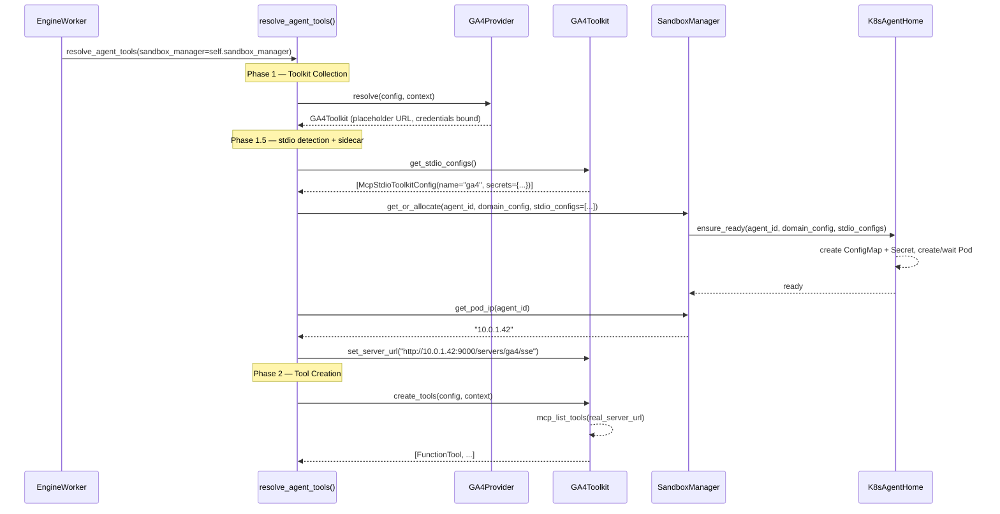

# stdio MCP Resolve Flow Integration Design

> Preceding design: [stdio MCP Infrastructure + GA4 Integration](stdio-mcp-ga4-integration.md)
> Implementation plan: [stdio MCP Implementation Plan](stdio-mcp-ga4-impl-plan.md)

## Overview

stdio MCP infrastructure (sidecar Pod spec, ConfigMap, Docker support) and GA4 Toolkit Provider are already implemented, but there is no **resolve flow orchestration** connecting them.

Design Phase 1.5 logic where `resolve_agent_tools()` detects stdio-based toolkits, creates sidecar Pod, and injects actual Pod-IP-based server_url into toolkit.

**Current state:**

```
resolve_agent_tools()
├── Phase 1: Toolkit Collection (resolve) ✅
│   └── GA4Provider.resolve() → placeholder localhost:9000
├── (Phase 1.5: stdio detection → sidecar → URL injection) ❌ missing
└── Phase 2: Tool Creation ✅
    └── GA4Toolkit.create_tools() → tries placeholder URL → fails
```

**Target state:**

```
resolve_agent_tools()
├── Phase 1: Toolkit Collection (resolve)
│   └── GA4Provider.resolve() → placeholder URL, stores credentials
├── Phase 1.5: stdio detection → sidecar Pod creation → URL injection (new)
│   ├── resolved.get_stdio_configs() → collect McpStdioToolkitConfig
│   ├── sandbox_manager.get_or_allocate(stdio_configs=...) → create Pod
│   ├── sandbox_manager.get_pod_ip() → get actual IP
│   └── resolved.set_server_url() → inject actual URL
└── Phase 2: Tool Creation
    └── GA4Toolkit.create_tools() → connect to actual Pod IP → succeeds
```

## Discussion Points and Decisions

### 1. Location of get_stdio_configs(): Toolkit vs Provider

Where should method exposing stdio config live?

**Options:**

| | Provider | Toolkit (resolved instance) |
|---|---|---|
| Pros | callable before resolve, static | credential access, instance context |
| Cons | cannot access per-request credentials | callable only after resolve |

**Decision: Toolkit (resolved instance)**

GA4 stdio config needs credential data to mount SA Key as sidecar Secret. Provider cannot access per-request credentials, but Toolkit binds credentials during resolve(), so `get_stdio_configs()` can include Secret data.

Phase 1.5 runs after Phase 1(resolve), so placing method on Toolkit is natural in timing too.

### 2. Credential delivery: add secrets field to McpStdioToolkitConfig

Existing `McpStdioToolkitConfig` has only `env` (non-sensitive env vars). There is no path to deliver sensitive data such as SA Key to sidecar.

**Decision: add `secrets: dict[str, str]` field**

```python
@dataclasses.dataclass(frozen=True)
class McpStdioToolkitConfig:
    name: str
    command: str
    args: tuple[str, ...] = ()
    env: dict[str, str] = dataclasses.field(default_factory=dict)
    secrets: dict[str, str] = dataclasses.field(default_factory=dict)  # new
    timeout: float = 30.0
```

- `secrets`: filename → content mapping. Mounted through K8s Secret / Docker bind mount.
- GA4 usage example: `{"sa-key.json": credentials_json}`
- Reference mount path from `env`: `{"GOOGLE_APPLICATION_CREDENTIALS": "/var/run/secrets/mcp-creds/sa-key.json"}`
- sandbox layer owns Secret/mount creation — resolve flow does not handle it.

### 3. server_url injection method

Pod IP is unknown at resolve() time. Phase 1.5 must inject it after IP acquisition.

**Options:**

A) `set_server_url(url)` — mutable setter
B) Toolkit reconstruction (re-resolve)
C) Add server_url parameter to create_tools()

**Decision: A — `set_server_url(url: str)` mutable setter**

Simple and effective. Toolkit already holds `_server_url` as mutable field. B has resolve() recall cost, C requires ABC change.

Add no-op default implementation to Toolkit ABC (`pass`). Phase 1.5 calls this only on toolkits whose `get_stdio_configs()` result is non-empty, so no-op default should not run, but guarantees type safety.

```python
# Toolkit ABC
def set_server_url(self, url: str) -> None:
    """Inject server_url based on sidecar Pod IP. Override only in stdio toolkit."""
    pass
```

### 4. Pod IP acquisition: new get_pod_ip() method

Current Pod IP is used only inside `get_file_storage()`. Phase 1.5 needs only IP, but calling `get_file_storage()` has unnecessary side effect of creating SandboxDaemonClient.

**Decision: add `get_pod_ip(agent_id)` abstract method to AgentHomeClient**

```python
# AgentHomeClient ABC
@abc.abstractmethod
async def get_pod_ip(self, agent_id: str) -> str | None:
    """Return Pod/Container IP address. Return None if absent."""
    ...
```

| Environment | Implementation |
|------|------|
| K8s | `_get_pod()` → `pod["status"]["pod_ip"]` |
| Docker | `container.show()` → `NetworkSettings.Networks[...].IPAddress` |

Add wrapper to AgentHomeSandboxManager too:
```python
async def get_pod_ip(self, agent_id: str) -> str | None:
    return await self._client.get_pod_ip(agent_id)
```

### 5. Conflict between Phase 1.5 and Shell domain config

If Phase 1.5 calls `sandbox_manager.get_or_allocate()`, later Shell toolkit lazy allocation returns cached sandbox. If Phase 1.5 creates sandbox with empty domain config, Shell domain restrictions are ignored.

**Decision: extract domain_config from Shell config in pending list during Phase 1.5**

```python
# Phase 1.5
domain_config = SandboxDomainConfig(allowed_domains=(), denied_domains=())
for provider, resolved, config, slug, prompt, use_prefix in pending:
    if isinstance(config, ShellToolkitConfig):
        domain_config = SandboxDomainConfig(
            allowed_domains=tuple(config.allowed_domains),
            denied_domains=tuple(config.denied_domains),
        )
        break

await sandbox_manager.get_or_allocate(
    agent_id, domain_config, stdio_configs=all_stdio_configs
)
```

If Shell is absent or domain config is default (empty list), it is equivalent to empty domain_config, so existing behavior does not change.

### 6. Subagent handling

**Decision: explicitly pass `sandbox_manager=None`**

Subagent shares parent sandbox and does not launch independent stdio sidecar. Passing `sandbox_manager=None` to `resolve_agent_tools()` naturally skips Phase 1.5.

## Architecture

### resolve_agent_tools() flow



### K8s Pod structure (see existing design)

```
Agent Home Pod (agent-home-{agent_id})
├── sandbox container — sandbox-daemon (:8081) + mitmproxy/socat
│   └── volumes: agent-data (EFS PVC)
└── mcp-proxy sidecar — mcp-proxy (:9000)
    ├── ConfigMap mount: /etc/mcp-proxy/config.json
    ├── Secret mount: /var/run/secrets/mcp-creds/sa-key.json
    └── subprocess: analytics-mcp (GA4 MCP server)
```

### Docker container structure (local development)

```
Docker Container (agent-home-{agent_id})
├── supervisord
│   ├── sandbox-daemon (:8081)
│   ├── mitmproxy + socat
│   └── mcp-proxy (:9000)  ← when ENABLE_MCP_PROXY=true
│       └── analytics-mcp subprocess
├── /etc/mcp-proxy/config.json      ← bind mount (host .mcp-proxy/)
└── /var/run/secrets/mcp-creds/     ← bind mount (host .mcp-creds/)
    └── sa-key.json
```

**Current Docker state and gaps:**

| Item | Current implementation | Additional needed |
|------|----------|----------|
| `ENABLE_MCP_PROXY` env var | ✅ true when stdio_configs exists | — |
| config.json creation + bind mount | ✅ `.mcp-proxy/config.json` | — |
| secrets file creation + bind mount | ❌ not implemented | `secrets` field → write file + bind mount |
| `get_pod_ip()` | ❌ not implemented | extract container IP (get_file_storage pattern) |

## Changed File List

### 1. `core/tools.py` — McpStdioToolkitConfig + Toolkit methods

```python
# Add secrets field to McpStdioToolkitConfig
@dataclasses.dataclass(frozen=True)
class McpStdioToolkitConfig:
    name: str
    command: str
    args: tuple[str, ...] = ()
    env: dict[str, str] = dataclasses.field(default_factory=dict)
    secrets: dict[str, str] = dataclasses.field(default_factory=dict)
    timeout: float = 30.0

# Add default method to Toolkit ABC
class Toolkit(ABC, Generic[ConfigT]):
    def get_stdio_configs(self) -> list[McpStdioToolkitConfig]:
        """Return stdio MCP server config. Default: empty list."""
        return []
```

### 2. `engine/tools/google_analytics.py` — implement Toolkit methods

```python
class GoogleAnalyticsToolkit(Toolkit[GoogleAnalyticsToolkitConfig]):
    def __init__(self, *, server_url: str, timeout: float,
                 proxy_url: str | None, credentials_json: str) -> None:
        self._server_url = server_url
        self._timeout = timeout
        self._proxy_url = proxy_url
        self._credentials_json = credentials_json

    def get_stdio_configs(self) -> list[McpStdioToolkitConfig]:
        """Return GA4 stdio MCP server config."""
        return [McpStdioToolkitConfig(
            name=_GA4_SERVER_NAME,
            command="analytics-mcp",
            env={
                "GOOGLE_APPLICATION_CREDENTIALS":
                    "/var/run/secrets/mcp-creds/sa-key.json",
            },
            secrets={"sa-key.json": self._credentials_json},
        )]

    def set_server_url(self, url: str) -> None:
        """Inject server_url based on sidecar Pod IP."""
        self._server_url = url


class GoogleAnalyticsToolkitProvider(ToolkitProvider[...]):
    async def resolve(self, config, context) -> GoogleAnalyticsToolkit:
        # ... SA Key validation ...
        return GoogleAnalyticsToolkit(
            server_url=f"http://localhost:{_MCP_PROXY_PORT}/servers/{_GA4_SERVER_NAME}/sse",
            timeout=config.timeout,
            proxy_url=context.mcp_proxy_url,
            credentials_json=context.credentials_json,  # added
        )
```

### 3. `runtime/sandbox/agent_home.py` — get_pod_ip() ABC

```python
class AgentHomeClient(abc.ABC):
    @abc.abstractmethod
    async def get_pod_ip(self, agent_id: str) -> str | None:
        """Return Pod/Container IP address."""
        ...
```

### 4. `runtime/sandbox/agent_home_k8s.py` — get_pod_ip() + Secret creation

```python
async def get_pod_ip(self, agent_id: str) -> str | None:
    """Return Pod IP."""
    pod = await self._get_pod(agent_id)
    if pod is None:
        return None
    return pod.get("status", {}).get("pod_ip") or None

async def _ensure_mcp_proxy_resources(self, agent_id, stdio_configs, v1):
    # existing: ConfigMap creation
    # added: Secret creation
    secret_data: dict[str, str] = {}
    for cfg in stdio_configs:
        for filename, content in cfg.secrets.items():
            secret_data[filename] = base64.b64encode(
                content.encode()
            ).decode()

    if secret_data:
        secret = V1Secret(
            metadata=V1ObjectMeta(
                name=f"mcp-stdio-creds-{agent_id}",
                namespace=self._namespace,
                labels={_AGENT_ID_LABEL: agent_id},
            ),
            data=secret_data,
        )
        # create or replace
```

### 5. `runtime/sandbox/agent_home_docker.py` — get_pod_ip() + mount secrets files

```python
async def get_pod_ip(self, agent_id: str) -> str | None:
    """Return Container IP.

    Reuse IP extraction logic from get_file_storage().
    """
    container = await self._get_container(agent_id)
    if container is None:
        return None
    info: dict[str, object] = await container.show()
    networks = info.get("NetworkSettings", {})
    if isinstance(networks, dict):
        net_details = networks.get("Networks", {})
        if isinstance(net_details, dict):
            for net_info in net_details.values():
                if isinstance(net_info, dict) and net_info.get("IPAddress"):
                    return str(net_info["IPAddress"])
    return None
```

**`_create_container()` change — add secrets file handling:**

```python
# Add after existing config.json creation code
if stdio_configs:
    # ... existing config.json creation ...

    # secrets file creation + bind mount (new)
    mcp_creds_dir = agent_data_dir / ".mcp-creds"
    mcp_creds_dir.mkdir(parents=True, exist_ok=True)
    for cfg in stdio_configs:
        for filename, content in cfg.secrets.items():
            (mcp_creds_dir / filename).write_text(content)
    if any(cfg.secrets for cfg in stdio_configs):
        binds.append(f"{mcp_creds_dir}:/var/run/secrets/mcp-creds:ro")
```

This makes credential file accessible in Docker at the same path as K8s Secret mount path (`/var/run/secrets/mcp-creds/`). `GOOGLE_APPLICATION_CREDENTIALS` env var of `analytics-mcp` works the same in both environments.

### 6. `runtime/sandbox/agent_home_manager.py` — get_pod_ip() wrapper

```python
async def get_pod_ip(self, agent_id: str) -> str | None:
    """Return Pod/Container IP."""
    return await self._client.get_pod_ip(agent_id)
```

### 7. `engine/run/resolve.py` — core change (Phase 1.5)

```python
async def resolve_agent_tools(
    agent_id: str,
    context: ToolkitContext,
    *,
    # ... existing parameters ...
    sandbox_manager: AgentHomeSandboxManager | None = None,  # added
) -> list[ResolvedToolkit]:

    # Phase 1: Toolkit Collection (existing)
    pending: list[...] = [...]

    # Phase 1.5: detect stdio toolkit → create sidecar Pod → inject URL
    if sandbox_manager is not None:
        stdio_toolkits: list[tuple[Toolkit, list[McpStdioToolkitConfig]]] = []
        all_stdio_configs: list[McpStdioToolkitConfig] = []

        for _provider, resolved, _config, _slug, _prompt, _use_prefix in pending:
            configs = resolved.get_stdio_configs()
            if configs:
                stdio_toolkits.append((resolved, configs))
                all_stdio_configs.extend(configs)

        if all_stdio_configs:
            # Extract Shell domain config
            domain_config = SandboxDomainConfig(
                allowed_domains=(), denied_domains=()
            )
            for _provider, _resolved, config, *_ in pending:
                if isinstance(config, ShellToolkitConfig):
                    domain_config = SandboxDomainConfig(
                        allowed_domains=tuple(config.allowed_domains),
                        denied_domains=tuple(config.denied_domains),
                    )
                    break

            # Notify user that sandbox initialization is in progress.
            await context.publish_event(SandboxInitializingEvent())
            try:
                await sandbox_manager.get_or_allocate(
                    agent_id, domain_config, stdio_configs=all_stdio_configs
                )
                pod_ip = await sandbox_manager.get_pod_ip(agent_id)
            except Exception:
                logger.exception(
                    "Failed to initialize stdio MCP sidecar",
                    extra={"agent_id": agent_id},
                )
                await context.publish_event(
                    SandboxErrorEvent(
                        message="Failed to initialize MCP sidecar. "
                        "stdio-based tools will be unavailable.",
                    )
                )
                # Remove stdio toolkit from pending and continue with the rest.
                stdio_resolved = {id(r) for r, _ in stdio_toolkits}
                pending = [
                    p for p in pending if id(p[1]) not in stdio_resolved
                ]
                pod_ip = None

            if pod_ip:
                await context.publish_event(SandboxReadyEvent())
                for resolved, configs in stdio_toolkits:
                    for cfg in configs:
                        url = (
                            f"http://{pod_ip}:{_MCP_PROXY_PORT}"
                            f"/servers/{cfg.name}/sse"
                        )
                        resolved.set_server_url(url)

    # Phase 2: Tool Creation (existing)
```

### 8. `worker/engine.py` — pass sandbox_manager

```python
resolved_toolkits = await resolve_agent_tools(
    invoke_input.agent_id,
    context,
    # ... existing parameters ...
    sandbox_manager=self.sandbox_manager,  # added
)
```

### 9. `engine/tools/subagent.py` — explicit sandbox_manager=None

```python
resolved_toolkits = await resolve_agent_tools(
    subagent_id,
    context,
    # ... existing parameters ...
    sandbox_manager=None,  # stdio unsupported (explicit)
)
```

## Feasibility

| Item | Status | Note |
|------|------|------|
| Add default method to Toolkit ABC | ✅ | checked 12 subclasses, backward compatible (same pattern as render_config_prompt) |
| McpStdioToolkitConfig.secrets field | ✅ | default empty dict, frozen dataclass |
| AgentHomeClient.get_pod_ip() | ✅ | IP extraction logic already exists internally in both K8s/Docker |
| Add resolve_agent_tools parameter | ✅ | keyword-only, default None — backward compatible |
| K8s Secret creation | ✅ | V1Secret import needed (V1SecretVolumeSource already exists) |
| ShellToolkitConfig import in resolve.py | ✅ | defined in core/tools.py, import path already exists — no circular dependency |
| Access config from pending list | ✅ | tuple[2] is config — isinstance check possible |
| get_or_allocate cache behavior | ✅ | first call creates Pod for same agent_id; later calls use cache |
| Docker secrets bind mount | ✅ | same pattern as config.json (host file → bind mount) |
| Docker get_pod_ip() | ✅ | reuse IP extraction from get_file_storage(), aiodocker API |
| _MCP_PROXY_PORT constant | ⚠️ | currently defined in google_analytics.py — resolve.py also needs it, so moving to core/tools.py is recommended |

## Risks and Existing Code Gaps

### Phase 1.5 own risks

| Risk | Impact | Mitigation |
|--------|------|------|
| Pod creation failure in Phase 1.5 | stdio toolkit unavailable (other toolkits normal) | publish SandboxErrorEvent + remove only stdio toolkit from pending |
| mcp-proxy not running in Docker env | get_pod_ip() returns IP but mcp-proxy process may not be started | `ENABLE_MCP_PROXY=true` + supervisord configuration needed. agent-runtime Dockerfile needs package preinstall |
| Docker secrets file permission | weaker security than K8s Secret because host file | development environment only; production uses K8s Secret |
| Secret contains sensitive data | SA Key exposure possibility | K8s RBAC, Pod-level access, automatic Secret deletion (idle cleanup) |

### Gaps found in existing code that must be solved with this design

| Gap | Severity | Description | Solution |
|----|--------|------|----------|
| **Existing Pod sidecar not detected** | HIGH | `ensure_ready()` checks only Pod phase(Running). If stdio_configs is added but existing Pod lacks sidecar, this is not detected | In `ensure_ready()`, check sidecar container existence. If absent, delete Pod and recreate |
| **ConfigMap/Secret not cleaned up** | MEDIUM | `delete_agent()` deletes only Pod. `mcp-proxy-config-{agent_id}` ConfigMap and `mcp-stdio-creds-{agent_id}` Secret remain | Add ConfigMap/Secret deletion to `delete_agent()` |
| **stdio_configs changes not reflected** | MEDIUM | When toolkit configuration changes between sessions, `_ensure_mcp_proxy_resources()` is not called again (returns immediately if Pod Running) | Compare ConfigMap content in `ensure_ready()`. On change, update ConfigMap + restart Pod |
| **create_tools() returns empty list on connection failure** | MEDIUM | `McpBasedToolkit.create_tools()` returns empty list on connection failure, no retry. If connected before mcp-proxy fully ready, tools are 0 | Need ensure_ready() daemon health check to include proxy socket. If insufficient, add direct mcp-proxy port 9000 probe in Phase 1.5 |
| **K8s Secret creation not implemented** | HIGH | `_ensure_mcp_proxy_resources()` docstring mentions Secret creation, but code creates only ConfigMap. V1Secret not imported | Solve with `secrets` field in this design |

### Resolution priority

1. **K8s Secret creation** — included in this design (secrets field + _ensure_mcp_proxy_resources reinforcement)
2. **Existing Pod sidecar detection** — need ensure_ready() improvement (included in this design scope)
3. **ConfigMap/Secret cleanup** — improve delete_agent() (included in this design scope)
4. **stdio_configs change detection** — ConfigMap comparison logic (possible follow-up)
5. **mcp-proxy readiness** — decide after checking whether daemon health includes it

## Alternatives Considered

### Alternative A: Direct sandbox call inside Provider.resolve() (previous impl plan Phase 3)

Original implementation plan had `GoogleAnalyticsToolkitProvider.resolve()` directly call `sandbox_manager.ensure_ready()`.

**Rejected because:**
- Requires injecting sandbox_manager dependency into Provider (pollutes Provider interface)
- If multiple stdio toolkits exist, each calls ensure_ready separately → inefficient
- resolve() should focus on config validation and credential binding

### Alternative B: place get_stdio_configs() on Provider

Original spec. Expose stdio config through Provider class method.

**Rejected because:**
- Provider cannot access per-request credentials
- Cannot fill secrets field (SA key JSON)
- Not extensible for future credential-dependent stdio config

### Alternative C: deliver server_url through ToolkitContext

Include server_url in ToolkitContext of create_tools().

**Rejected because:**
- ToolkitContext change affects all toolkits
- Putting stdio-toolkit-only concern into general-purpose context is inappropriate

## Implementation Details

### Phase A: Reinforce Sandbox infrastructure (solve existing gaps)

#### A-1. `agent_home_k8s.py` — detect sidecar in ensure_ready() (line 318)

Currently returns immediately if Pod is Running. If sidecar is required but absent, detect it:

```python
# Line 318-322 (current)
if phase == "Running":
    await self.update_last_used(agent_id)
    return

# Changed: check whether sidecar is needed
if phase == "Running":
    if stdio_configs and self._mcp_proxy_image:
        # Check whether "mcp-proxy" exists in Pod container list.
        pod_containers = pod.get("spec", {}).get("containers", [])
        has_sidecar = any(
            c.get("name") == "mcp-proxy" for c in pod_containers
        )
        if not has_sidecar:
            logger.info(
                "Agent Home pod missing mcp-proxy sidecar, recreating",
                extra={"agent_id": agent_id},
            )
            await self._delete_pod(agent_id)
            # fall through to creation below
        else:
            await self.update_last_used(agent_id)
            return
    else:
        await self.update_last_used(agent_id)
        return
```

#### A-2. `agent_home_k8s.py` — create Secret in _ensure_mcp_proxy_resources() (after line 630)

Currently only ConfigMap is created. Add Secret creation code:

```python
# Add after ConfigMap creation code (after line 630)
# 2. Secret — stdio MCP credentials
secret_data: dict[str, str] = {}
for cfg in stdio_configs:
    for filename, content in cfg.secrets.items():
        secret_data[filename] = base64.b64encode(content.encode()).decode()

secret_name = f"mcp-stdio-creds-{agent_id}"
if secret_data:
    secret = V1Secret(
        metadata=V1ObjectMeta(
            name=secret_name,
            namespace=self._namespace,
            labels={_AGENT_ID_LABEL: agent_id},
        ),
        data=secret_data,
    )
    try:
        await v1.replace_namespaced_secret(
            name=secret_name, namespace=self._namespace, body=secret
        )
    except ApiException as e:
        if e.status == 404:
            await v1.create_namespaced_secret(
                namespace=self._namespace, body=secret
            )
        else:
            raise
else:
    # Create empty Secret even when secrets are empty because Pod spec references it.
    secret = V1Secret(
        metadata=V1ObjectMeta(
            name=secret_name,
            namespace=self._namespace,
            labels={_AGENT_ID_LABEL: agent_id},
        ),
        data={},
    )
    try:
        await v1.create_namespaced_secret(namespace=self._namespace, body=secret)
    except ApiException as e:
        if e.status != 409:
            raise
```

Add required imports: `V1Secret` from `kubernetes_asyncio.client`, `base64` (stdlib).

#### A-3. `agent_home_k8s.py` — clean resources in delete_agent() (line 492)

```python
async def delete_agent(self, agent_id: str) -> None:
    """Delete agent Pod and related resources."""
    daemon_client = self._daemon_clients.pop(agent_id, None)
    if daemon_client is not None:
        await daemon_client.close()

    api_client = await self._get_api_client()
    v1 = CoreV1Api(api_client)

    # Delete ConfigMap/Secret (ignore missing resources).
    for delete_fn, name in [
        (v1.delete_namespaced_config_map, f"mcp-proxy-config-{agent_id}"),
        (v1.delete_namespaced_secret, f"mcp-stdio-creds-{agent_id}"),
    ]:
        try:
            await delete_fn(name=name, namespace=self._namespace)
        except ApiException as e:
            if e.status != 404:
                logger.warning(
                    "Failed to delete K8s resource",
                    extra={"name": name, "status": e.status},
                )

    await self._delete_pod(agent_id)
    logger.info("Agent Home pod deleted", extra={"agent_id": agent_id})
```

#### A-4. `agent_home_docker.py` — handle secrets in _create_container() (after line 154)

```python
# Add after existing config.json bind mount (after line 154)
# secrets file creation + bind mount
mcp_creds_dir = agent_data_dir / ".mcp-creds"
mcp_creds_dir.mkdir(parents=True, exist_ok=True)
has_secrets = False
for cfg in stdio_configs:
    for filename, content in cfg.secrets.items():
        (mcp_creds_dir / filename).write_text(content)
        has_secrets = True
if has_secrets:
    binds.append(f"{mcp_creds_dir}:/var/run/secrets/mcp-creds:ro")
```

### Phase B: Interface expansion

#### B-1. `core/tools.py` — McpStdioToolkitConfig.secrets (after line 519)

```python
@dataclasses.dataclass(frozen=True)
class McpStdioToolkitConfig:
    # ... existing fields ...
    secrets: dict[str, str] = dataclasses.field(default_factory=dict)
    #  ↑ filename → content. Mounted through K8s Secret / Docker bind mount.
```

#### B-2. `core/tools.py` — add Toolkit ABC methods (after line 150)

```python
class Toolkit(ABC, Generic[ConfigT]):
    # ... existing methods ...

    def get_stdio_configs(self) -> list[McpStdioToolkitConfig]:
        """Return stdio MCP server configuration.

        Override only in stdio-based toolkit. Default: empty list.
        """
        return []

    def set_server_url(self, url: str) -> None:  # noqa: ARG002
        """Inject server_url based on sidecar Pod IP.

        Override only in stdio-based toolkit. Default: no-op.
        """
```

Move `_MCP_PROXY_PORT` constant here too:

```python
MCP_PROXY_PORT = 9000  # default mcp-proxy sidecar port
```

#### B-3. `agent_home.py` — get_pod_ip() ABC (after line 165)

```python
@abc.abstractmethod
async def get_pod_ip(self, agent_id: str) -> str | None:
    """Return Pod/Container IP address.

    Return None if Pod/Container does not exist or IP is unknown.
    """
    ...
```

#### B-4. `agent_home_k8s.py` — implement get_pod_ip()

```python
async def get_pod_ip(self, agent_id: str) -> str | None:
    """Return Pod IP."""
    pod = await self._get_pod(agent_id)
    if pod is None:
        return None
    return pod.get("status", {}).get("pod_ip") or None
```

#### B-5. `agent_home_docker.py` — implement get_pod_ip()

```python
async def get_pod_ip(self, agent_id: str) -> str | None:
    """Return Container IP."""
    container = await self._get_container(agent_id)
    if container is None:
        return None
    info: dict[str, object] = await container.show()
    networks = info.get("NetworkSettings", {})
    if isinstance(networks, dict):
        net_details = networks.get("Networks", {})
        if isinstance(net_details, dict):
            for net_info in net_details.values():
                if isinstance(net_info, dict) and net_info.get("IPAddress"):
                    return str(net_info["IPAddress"])
    return None
```

#### B-6. `agent_home_manager.py` — get_pod_ip() wrapper

```python
async def get_pod_ip(self, agent_id: str) -> str | None:
    """Return Pod/Container IP."""
    return await self._client.get_pod_ip(agent_id)
```

#### B-7. `agent_home_test.py` — update FakeAgentHomeClient

```python
class FakeAgentHomeClient(AgentHomeClient):
    def __init__(self) -> None:
        # ... existing fields ...
        self.pod_ip_queries: list[str] = []
        self._pod_ip: str | None = "127.0.0.1"

    async def get_pod_ip(self, agent_id: str) -> str | None:
        self.pod_ip_queries.append(agent_id)
        return self._pod_ip
```

### Phase C: Resolve Flow + integration

#### C-1. `google_analytics.py` — store credentials + add methods

```python
class GoogleAnalyticsToolkit(Toolkit[GoogleAnalyticsToolkitConfig]):
    def __init__(
        self,
        *,
        server_url: str,
        timeout: float,
        proxy_url: str | None = None,
        credentials_json: str,  # added
    ) -> None:
        self._server_url = server_url
        self._timeout = timeout
        self._proxy_url = proxy_url
        self._credentials_json = credentials_json  # added

    def get_stdio_configs(self) -> list[McpStdioToolkitConfig]:
        """Return GA4 stdio MCP server config."""
        return [McpStdioToolkitConfig(
            name=_GA4_SERVER_NAME,
            command="analytics-mcp",
            env={
                "GOOGLE_APPLICATION_CREDENTIALS":
                    "/var/run/secrets/mcp-creds/sa-key.json",
            },
            secrets={"sa-key.json": self._credentials_json},
        )]

    def set_server_url(self, url: str) -> None:
        """Inject server_url based on sidecar Pod IP."""
        self._server_url = url
```

Provider.resolve() also passes credentials_json:
```python
# line 170 change
return GoogleAnalyticsToolkit(
    server_url=server_url,
    timeout=config.timeout,
    proxy_url=context.mcp_proxy_url,
    credentials_json=context.credentials_json,  # added (after confirming credentials_json is non-None)
)
```

#### C-2. `resolve.py` — Phase 1.5 (insert between line 521 and 523)

Add required imports:
```python
from nointern.core.tools import (
    # add to existing imports
    McpStdioToolkitConfig,
    MCP_PROXY_PORT,
    ShellToolkitConfig,
)
from nointern.runtime.events import (
    SandboxErrorEvent,
    SandboxInitializingEvent,
    SandboxReadyEvent,
)
from nointern.runtime.sandbox import SandboxDomainConfig
from nointern.runtime.sandbox.agent_home_manager import AgentHomeSandboxManager
```

Add parameter to function signature:
```python
async def resolve_agent_tools(
    # ... existing parameters ...
    sandbox_manager: AgentHomeSandboxManager | None = None,  # added
) -> list[ResolvedToolkit]:
```

Phase 1.5 body (insert after line 521):
```python
    # ── Phase 1.5: stdio toolkit detection → sidecar Pod → URL injection ──
    if sandbox_manager is not None:
        stdio_toolkits: list[
            tuple[Toolkit[Any], list[McpStdioToolkitConfig]]
        ] = []
        all_stdio_configs: list[McpStdioToolkitConfig] = []

        for _prov, resolved, _cfg, _slug, _prompt, _pfx in pending:
            cfgs = resolved.get_stdio_configs()
            if cfgs:
                stdio_toolkits.append((resolved, cfgs))
                all_stdio_configs.extend(cfgs)

        if all_stdio_configs:
            # Extract Shell domain config
            domain_config = SandboxDomainConfig(
                allowed_domains=(), denied_domains=()
            )
            for _prov, _res, cfg, *_ in pending:
                if isinstance(cfg, ShellToolkitConfig):
                    domain_config = SandboxDomainConfig(
                        allowed_domains=tuple(cfg.allowed_domains),
                        denied_domains=tuple(cfg.denied_domains),
                    )
                    break

            await context.publish_event(SandboxInitializingEvent())
            try:
                await sandbox_manager.get_or_allocate(
                    agent_id,
                    domain_config,
                    stdio_configs=all_stdio_configs,
                )
                pod_ip = await sandbox_manager.get_pod_ip(agent_id)
            except Exception:
                logger.exception(
                    "Failed to initialize stdio MCP sidecar",
                    extra={"agent_id": agent_id},
                )
                await context.publish_event(
                    SandboxErrorEvent(
                        message="Failed to initialize MCP sidecar. "
                        "stdio-based tools will be unavailable.",
                    )
                )
                stdio_resolved_ids = {id(r) for r, _ in stdio_toolkits}
                pending = [
                    p for p in pending if id(p[1]) not in stdio_resolved_ids
                ]
                pod_ip = None

            if pod_ip:
                await context.publish_event(SandboxReadyEvent())
                for resolved, cfgs in stdio_toolkits:
                    for cfg in cfgs:
                        resolved.set_server_url(
                            f"http://{pod_ip}:{MCP_PROXY_PORT}"
                            f"/servers/{cfg.name}/sse"
                        )
```

#### C-3. `engine.py` — pass sandbox_manager (after line 532)

```python
resolved_toolkits = await resolve_agent_tools(
    invoke_input.agent_id,
    context,
    # ... existing parameters ...
    sandbox_manager=self.sandbox_manager,  # added
)
```

#### C-4. `subagent.py` — sandbox_manager=None (after line 310)

```python
resolved_toolkits = await resolve_agent_tools(
    subagent_id,
    context,
    # ... existing parameters ...
    sandbox_manager=None,  # stdio unsupported (explicit)
)
```

### Tests

#### resolve_agent_tools Phase 1.5 tests

```python
async def test_resolve_stdio_toolkit_triggers_sandbox(self) -> None:
    """If stdio toolkit exists, sandbox ensure_ready is called."""
    fake_client = FakeAgentHomeClient()
    manager = AgentHomeSandboxManager(fake_client)
    # ... setup toolkit_registry with GA4 ...
    await resolve_agent_tools(
        "agent-1", context, ..., sandbox_manager=manager,
    )
    assert fake_client.ensured == ["agent-1"]
    assert fake_client.pod_ip_queries == ["agent-1"]

async def test_resolve_no_stdio_skips_sandbox(self) -> None:
    """If no stdio toolkit exists, sandbox is not called."""
    fake_client = FakeAgentHomeClient()
    manager = AgentHomeSandboxManager(fake_client)
    # ... setup toolkit_registry without GA4 ...
    await resolve_agent_tools(
        "agent-1", context, ..., sandbox_manager=manager,
    )
    assert fake_client.ensured == []

async def test_resolve_sandbox_failure_removes_stdio_toolkit(self) -> None:
    """On sandbox failure, remove only stdio toolkit and continue with rest."""
    # FakeAgentHomeClient.ensure_ready() raises
    # Verify stdio toolkit tools are empty, other toolkit tools present
```

## Differences from Original Spec

| Item | Original spec | This design | Reason |
|------|----------|---------|------|
| get_stdio_configs() location | ToolkitProvider | Toolkit | credential access needed (secrets field) |
| McpStdioToolkitConfig.secrets | absent | added | SA key delivery path needed |
| domain_config | empty SandboxDomainConfig() | extract from Shell config | prevent bypassing domain restriction |
| K8s Secret creation | not mentioned | add to _ensure_mcp_proxy_resources | fill existing implementation gap |
