# Runtime Stream Session Naming Cutover Design

- Snapshot: `stream-260916`
- Requirements: [stream-260916/REQ](../requirements/stream-260916-runtime-session-cutover.md)
- Decisions: [stream-260916/ADR](../adr/stream-260916-runtime-session-cutover.md)
- Document reference: `stream-260916/DESIGN`

## Current Behavior and Requirement Gaps

The current persistent bidirectional session transports HTTP and WebSocket logical
streams between Gateway, accepting Control, Owner Control, and Runner. Its protocol
and reusable implementation are named Runtime Web Session even though the session
framing, ownership epoch, relay, flow control, and bounded byte transport are
independent of the application protocol.

The gap is naming and cutover hygiene, not runtime behavior. File streaming is
intentionally a later snapshot and must not be smuggled into this rename.

## Requirements and Decision Traceability

| Requirement | Design mechanisms |
| --- | --- |
| `stream-260916/REQ-1` | M1 protocol symbol/module rename, M2 transport implementation rename, M3 adapter boundary |
| `stream-260916/REQ-2` | M3 unchanged Web adapters and M4 regression verification |
| `stream-260916/REQ-3` | M5 descriptor fingerprint cutover and absence checks |
| `stream-260916/REQ-4` | M6 explicit file-scope exclusion |

## Architecture and Ownership

The transport topology remains unchanged:

```mermaid
flowchart LR
    G[Runtime Web Gateway]
    A[Accepting Control]
    O[Owner Control]
    R[Runtime Runner]

    G -->|RuntimeStreamGatewaySession.Connect| A
    A -->|RuntimeStreamControlSession.Relay, optional one hop| O
    O -->|RuntimeRunnerStreamSession.Connect| R
    R -->|HTTP/WebSocket application adapter| L[127.0.0.1 loopback]
```

The renamed session layer remains responsible for:

- persistent peer handshakes and exact Owner epochs;
- logical stream multiplexing and stream identity;
- HTTP/WebSocket payload framing currently supported by the application adapters;
- bounded queues, hierarchical credit, fair scheduling, heartbeat, drain, and
  fail-closed teardown; and
- local-vs-relay forwarding without multi-hop discovery.

The Runtime Web Gateway, browser policy, service model, Owner route persistence, and
Runner loopback client remain the Web-specific application boundary.

## M1. Protocol and generated-surface rename

Rename the protobuf source from `runtime_web_session.proto` to
`runtime_stream_session.proto`. Rename the reusable protobuf symbols from
`RuntimeWebSession*` to `RuntimeStreamSession*`, including the envelope, handshake,
frame, direction, route, peer-role, protocol, and close-reason types/constants.

Rename the three RPC services to stream-neutral names:

- `RuntimeStreamGatewaySession`;
- `RuntimeStreamControlSession`; and
- `RuntimeRunnerStreamSession`.

Keep the existing HTTP and WebSocket enum members as the currently supported
application protocols. Preserve field numbers and message shapes unless a generated
name necessarily changes. Regenerate Python modules, stubs, and gRPC stubs using the
repository generator; do not hand-edit generated files.

## M2. Reusable transport implementation rename

Rename the shared runtime-control module and reusable transport files:

- `runtime_web_session.py` → `runtime_stream_session.py`;
- `runtime_web_flow.py` → `runtime_stream_flow.py`;
- `grpc_runner_web_session_client.py` → `grpc_runner_stream_session_client.py`;
- `web_session_relay.py` → `stream_session_relay.py`;
- `web_session_broker.py` → `stream_session_broker.py`;
- `web_session_owner.py` → `stream_session_owner.py`; and
- `runtime_web_session_server.py` → `runtime_stream_session_server.py`.

Rename transport-layer classes, protocols, functions, tests, and imports to match.
The implementation may retain `web` in adapter-local names only when the name
describes an HTTP/WebSocket application adapter rather than the shared session.

The Runner application dispatcher and loopback HTTP/WebSocket adapter are retained
as Web-specific modules where their responsibility is application translation, but
their session-client and session-manager dependencies use the generalized stream
client vocabulary.

## M3. Web-specific adapter boundary

Keep these names and behavior unchanged:

- Runtime Web public API and service-management modules;
- `RuntimeWebSessionRoute` and `runtime_web_session_routes`;
- Runtime Web browser Gateway policy and service URL handling;
- HTTP/WebSocket request-head and WebSocket frame translation;
- Runtime Web capacity metrics and product-facing configuration; and
- the existing Owner route/lease, local-vs-relay, Runner authentication, and numeric
  loopback rules.

Where these adapters refer to the shared protocol, they import the new
`runtime_stream_session` symbols and generated `runtime_stream_session_pb2` module.

## M4. Behavioral regression verification

Run the existing focused tests for:

- shared runtime-control session state and flow control;
- Runner stream client and offer handling;
- Runner dispatcher and loopback HTTP/WebSocket translation;
- Control Owner/relay/broker routing and capacity;
- Gateway session bridging and pool behavior; and
- runtime-control composition and E2E protocol wiring.

Add or update assertions that:

- the generated descriptor exposes only the new stream-neutral symbols;
- old module paths and symbols are absent from active source and generated output;
- HTTP and WebSocket payload behavior is unchanged; and
- the ordinary Runner Control channel, Owner epoch checks, and relay topology are
  still wired to the same runtime lifecycle.

## M5. Fingerprint-fenced hard cutover

The generated descriptor identity changes when the proto file and symbols change.
`RUNTIME_STREAM_PROTOCOL_FINGERPRINT` replaces the old constant and is used by every
session peer. Exact equality remains mandatory; a different fingerprint rejects the
hello or relay before stream admission.

No old constant, alias, parser, serializer, or compatibility branch remains.
Deployment rollout and rollback are whole-build operations because old and new
Runtime transport peers intentionally do not interoperate.

## M6. File-scope exclusion

Do not add file-specific protobuf messages, file stream modes, storage or transfer
state, resumability, checksums, file API routes, raw-byte file methods, or file E2E
coverage in this snapshot. The next file feature will consume the stream-neutral
session contract after this cutover is merged and verified.

## Security and Permissions

The cutover does not add a listener, credential, authority, or route. Existing
Gateway/Control trusted transport authentication, Runner credential checks, Owner
epoch validation, one-time join nonce, generation fencing, and loopback numeric-port
policy remain unchanged. Removing Web-only names from the reusable layer does not
make the session callable by a new peer.

## Failure, Retry, Rollout, and Recovery

- HTTP/WebSocket session failure, relay loss, Owner loss, generation replacement,
  drain, overload, and protocol violations retain existing fail-closed behavior.
- Mixed old/new builds fail at the exact fingerprint check; no retry or fallback
  translates between names.
- No database migration, data backfill, persisted compatibility state, or live
  infrastructure mutation is required.
- The file-stream feature is a separate subsequent snapshot and does not affect this
  rollout.

## Observability and Operational Risks

Content-free session, stream, route-class, close-reason, capacity, and process
pressure metrics remain semantically unchanged. Metric and log names are updated only
where they identify the reusable transport contract; Runtime Web product metrics
remain Web-specific.

Primary risks and controls:

- **Incomplete rename:** repository-wide source/generated absence searches and
  descriptor assertions cover every active protocol surface.
- **Accidental behavior change:** focused HTTP/WebSocket, relay, Runner, and
  composition tests run before PR creation.
- **Ambiguous adapter boundary:** product/domain and persisted Runtime Web names are
  explicitly retained and checked.
- **Fingerprint drift:** the regenerated descriptor and fingerprint tests prove the
  hard cutover.

## Test Strategy

### E2E primary verification matrix

- Existing Runtime Web HTTP endpoint behavior remains reachable through the
  generalized session protocol.
- Existing WebSocket bidirectional behavior remains reachable through the same
  endpoint.
- Existing Owner/relay topology and generation replacement behavior remain valid.

The existing required Runtime Web Gateway E2E suite remains the primary product
verification. No new file scenario is added. Live Kubernetes tests are not run and
no live infrastructure is mutated.

### Focused unit and integration verification

- Protobuf generation succeeds and generated Python imports use the renamed module.
- Session state, flow-control, relay, broker, Owner, Runner client, and server tests
  pass with the new names.
- Composition tests prove all three generated stream-session RPC services are
  registered and connected.
- Repository searches prove old transport symbols, module paths, and aliases are
  absent while Web-specific product names remain where required.
- Existing protocol fingerprint tests prove old/new peers fail closed.

Evidence consists of generator output, focused test commands and pass counts, Ruff,
type-check, pre-commit, and PR CI results. No new credential snapshot or fixture
state is needed.

## Alternatives and Non-Blocking Risks

The alternatives of renaming only protobuf, retaining internal Web names, or
renaming the entire Runtime Web product are rejected in `stream-260916/ADR`. The
remaining risk is that a future file design may discover a transport field that
needs a new generalized representation; that is intentionally handled as a new
design decision rather than anticipated here.

## Feasibility Evidence

- The repository owns the proto source and generated Python workflow.
- All current protocol consumers are in repository-controlled Python packages,
  Runner code, tests, and Runtime Web adapters.
- Existing HTTP/WebSocket behavior is covered by focused tests and the required
  Gateway E2E suite.
- The persisted Owner route and product API are independently named and can remain
  unchanged.
- No migration is required because this snapshot changes protocol/source names, not
  persisted schema or data.

No unresolved material feasibility blocker remains.

## Design Authority

- Design revision: `1`

| ID | Material design mechanism | Authority | Classification |
| --- | --- | --- | --- |
| M1 | Rename the persistent protobuf protocol and generated RPC surface to stream-neutral names | `stream-260916/REQ-1`; `stream-260916/ADR-D1` | `decided` |
| M2 | Rename reusable session, flow-control, relay, broker, Owner, Runner-client, and server implementation surfaces | `stream-260916/REQ-1`; `stream-260916/ADR-D1` | `decided` |
| M3 | Preserve Runtime Web product, adapter, route, and persistence names and semantics | `stream-260916/REQ-1`, `REQ-2`; `stream-260916/ADR-D2` | `decided` |
| M4 | Verify unchanged HTTP/WebSocket behavior and routing/lifecycle semantics | `stream-260916/REQ-2`; current Agent Runtime Control Spec | `existing` |
| M5 | Enforce the renamed descriptor's exact fingerprint with no compatibility path | `stream-260916/REQ-3`; `stream-260916/ADR-D3` | `decided` |
| M6 | Exclude all file-specific behavior from this snapshot | `stream-260916/REQ-4` | `required` |

## Removal and Replacement

| Existing unit or behavior | Removal authority | Replacement or remaining authority | Removal boundary | Absence verification |
| --- | --- | --- | --- | --- |
| `RuntimeWebSession*` protobuf messages, enums, constants, and services | `stream-260916/REQ-1`, `REQ-3`; `ADR-D1`, `ADR-D3` | `RuntimeStreamSession*` protocol surface | Proto source and generated Python modules/stubs | Descriptor and repository search |
| `runtime_web_session.proto` and generated module path | `stream-260916/REQ-1`; `ADR-D1` | `runtime_stream_session.proto` and generated modules | Proto generator input/output | Generator output and import search |
| Reusable `runtime_web_*session*` implementation names | `stream-260916/REQ-1`; `ADR-D1` | Stream-neutral session/flow/relay/broker/Owner/server modules | Runtime Control and shared library transport code | Active-source search and focused imports |
| Old protocol fingerprint constant and compatibility names | `stream-260916/REQ-3`; `ADR-D3` | New descriptor-derived stream fingerprint | Shared protocol validation | Fingerprint tests and absence search |
| Runtime Web product, route, and persistence names | None | Existing Runtime Web product authority | No removal | Product/API/schema search confirms retention |
| File-specific behavior | None | Future file-stream snapshot | Explicitly deferred | No file protocol/API/state additions |

## Design Approval

- Mode: `Autonomous`
- Decision owner: `Agent under requester-delegated implementation authority`
- Approved on: `2026-09-16`
- Approved Design revision: `1`
- Approved authority IDs: `M1, M2, M3, M4, M5, M6`
- Approved scope: `Hard-cut the reusable Runtime Web session transport to stream-neutral protocol and implementation names, preserve current HTTP/WebSocket and Runtime Web product behavior, and defer file support to a later change.`
