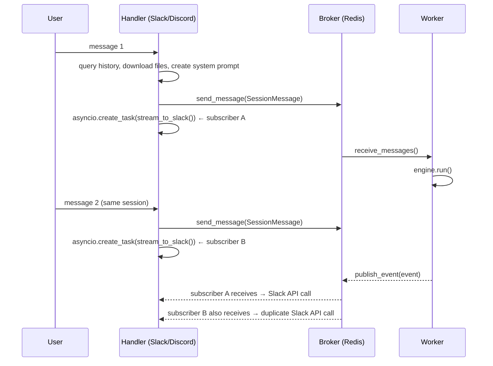
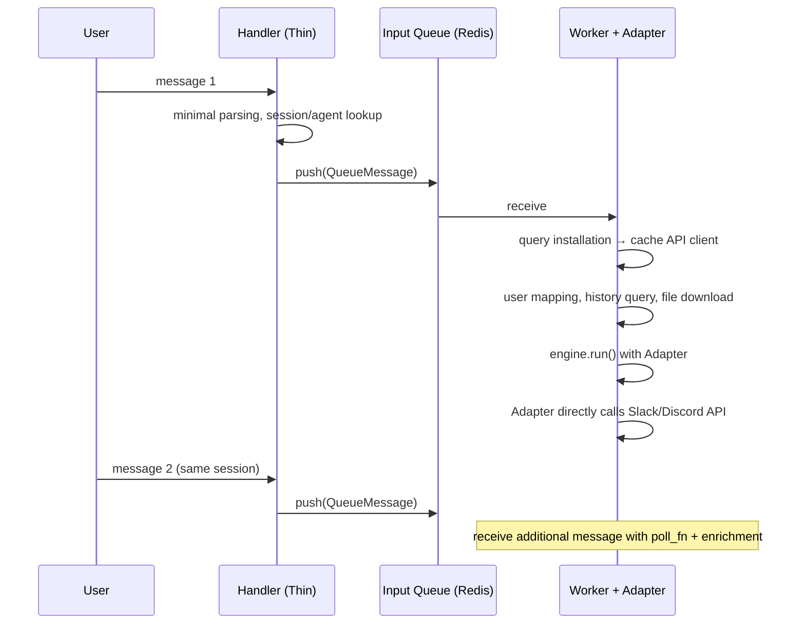
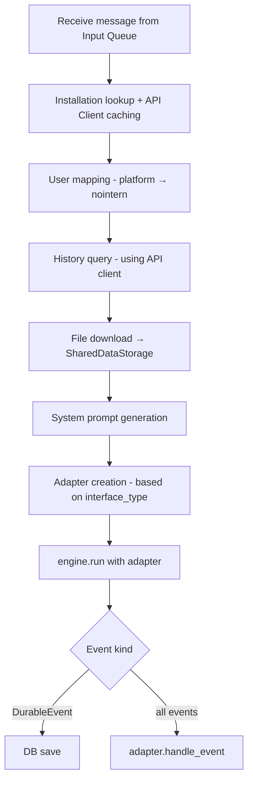
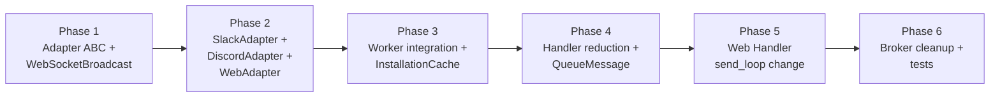

# Streaming Responsibility Migration — From Handler to Worker

## Overview

Currently Slack/Discord handlers each create streaming task, subscribe to Broker Redis Pub/Sub, and deliver responses. When messages arrive sequentially for same session, **duplicate subscribers are created** and **messages are sent multiple times** to Slack/Discord.

This document describes design that structurally solves the problem by migrating streaming responsibility from Handler to Worker.

## Problem Analysis

### Current Structure



### Root Cause

1. `handle_message()` calls `asyncio.create_task(stream_to_slack/discord())` **on every message**.
2. Each task creates **independent Redis Pub/Sub subscriber**.
3. Redis Pub/Sub **broadcasts to all subscribers** — no exclusive consumer concept.
4. Worker `_SessionRunner` is one per session, but handler streaming task is one per message.

## Target Structure



### Slack/Discord — unidirectional queue

```
Handler → Input Queue → Worker → direct Slack/Discord API call
```

### Web — WebSocketBroadcast

```
Client → WebSocket → Handler → Input Queue → Worker
                                Worker → WebSocketBroadcast (Redis Pub/Sub) → WebSocket → Client
```

For Web, WebSocket connection is bound to handler process, so Worker cannot directly deliver to client. It broadcasts event through `WebSocketBroadcast` (Redis Pub/Sub based), and WebSocket send_loop subscribes and delivers.

Pub/Sub is used because multiple WebSockets (multiple tabs) can be connected to same session and all must receive events. Redis List (BLPOP) is unsuitable for broadcast because only one consumer receives.

Unlike Slack/Discord, Web does not have duplicate subscriber problem. There is exactly one send_loop per WebSocket.

## Decisions

| Item | Decision | Reason |
|------|------|------|
| API Client injection | Worker queries installation + caches client | keep message lightweight |
| History Fetching | performed in Worker | keep handler as thin layer |
| Discord message ID storage | Worker directly stores in DB | callback pattern unnecessary |
| Stop button | received via Input queue, adapter manages control message | same as existing stop path |
| Deployment unit | directly add Slack/Discord SDK dependencies to Worker | same pyproject currently used |
| Migration | big-bang switch | simpler implementation than gradual migration |
| poll_fn | remove SessionRunner internal queue; adapter provides poll_fn | consistent message handling including enrichment |
| Web event delivery | WebSocketBroadcast (Redis Pub/Sub) | multi-tab support, broadcast semantics needed |
| Installation cache invalidation | invalidate cache on 401 then re-query | avoid unnecessary DB query, same pattern as GitHub toolkit |

## Component Design

### 1. Handler (Thin Layer)

Responsibilities **remaining** in handler:
- authentication/validation
- message parsing, bot mention check/strip
- Agent lookup (channel → agent_id)
- Session lookup/creation (thread → session_id)
- Discord: thread creation (response target must exist)

Responsibilities **removed** from handler:
- user mapping (platform user → nointern user)
- account linking guide DM
- history query (channel/thread history)
- file download
- system prompt generation
- entire `stream_to_slack/discord()` task

### 2. Input Queue Message — Discriminated Union

Lightweight message replacing current `SessionMessage`. Defines type-safe discriminated union per interface.

Handler passes only **data available only from broker/handler** (DB lookup result such as session_id, agent_id), and **adapter owns** platform-specific metadata/attachment extraction.

#### Platform-specific Payload Schemas

```python
# --- Slack ---
@dataclass(frozen=True)
class SlackEventPayload:
    """Type definition for fields needed from Slack Bolt event."""
    channel: str
    user: str
    text: str
    ts: str
    thread_ts: str | None
    team: str | None
    files: list[dict]  # Slack file object

# --- Discord ---
@dataclass(frozen=True)
class DiscordAuthorPayload:
    id: str
    username: str
    bot: bool

@dataclass(frozen=True)
class DiscordAttachmentPayload:
    url: str
    filename: str
    content_type: str | None

@dataclass(frozen=True)
class DiscordMessagePayload:
    """Type definition for fields needed from discord.Message."""
    id: str
    channel_id: str
    guild_id: str | None
    author: DiscordAuthorPayload
    content: str
    attachments: list[DiscordAttachmentPayload]
```

#### QueueMessage (Discriminated Union)

```python
@dataclass(frozen=True)
class SlackQueueMessage:
    type: Literal["slack"] = "slack"
    session_id: str
    agent_id: str
    was_created: bool       # whether session was newly created
    event: SlackEventPayload

@dataclass(frozen=True)
class DiscordQueueMessage:
    type: Literal["discord"] = "discord"
    session_id: str
    agent_id: str
    was_created: bool
    thread_id: str           # thread created by handler through Gateway
    message: DiscordMessagePayload

@dataclass(frozen=True)
class WebQueueMessage:
    type: Literal["web"] = "web"
    session_id: str
    agent_id: str
    text: str
    attachments: list[dict]

QueueMessage = SlackQueueMessage | DiscordQueueMessage | WebQueueMessage
```

Design principles:
- **Handler passes minimal data**: session_id, agent_id (DB lookup), was_created, platform original payload.
- **Adapter extracts from payload**: channel_id, thread_ts, user_id, file URLs, etc.
- **Type safety**: typed dataclass instead of `dict[str, str]`, branch with `match msg.type`.
- Discord `thread_id` is created by handler through Gateway, so it is only available in handler.

### 3. Worker (extended responsibility)



#### Installation cache

```python
class InstallationClientCache:
    """Caches API clients by Installation."""

    async def get_slack_client(self, team_id: str) -> AsyncWebClient:
        """Lookup installation by Slack team_id → return AsyncWebClient. Reuse on cache hit."""
        ...

    async def get_discord_client(self, guild_id: str) -> DiscordRESTClient:
        """Lookup installation by Discord guild_id → return REST client."""
        ...

    def invalidate(self, key: str) -> None:
        """Invalidate cache on 401."""
        ...
```

- call `invalidate()` on 401 then re-query
- in-memory cache inside Worker process (Redis unnecessary)

#### poll_fn — provided by Adapter

Remove internal queue of current `_SessionRunner`; adapter provides poll_fn:

```python
class InterfaceAdapter(ABC):
    @abstractmethod
    async def handle_event(self, event: EngineEvent | DurableEvent) -> None:
        """Deliver engine event to interface."""
        ...

    @abstractmethod
    async def poll_messages(self) -> list[UserInputEvent]:
        """Pop additional messages from queue and perform enrichment (file download, etc.)."""
        ...
```

poll_fn flow:
1. drain additional messages for same session_id from Input queue
2. download file URLs → convert to `session://` URI
3. convert to `UserInputEvent` list and return

First message and additional messages go through **same enrichment path**.

### 4. Adapter Implementation

#### InterfaceAdapter (ABC)

```python
class InterfaceAdapter(ABC):
    """Event delivery adapter by interface."""

    @abstractmethod
    async def handle_event(self, event: EngineEvent | DurableEvent) -> None: ...

    @abstractmethod
    async def poll_messages(self) -> list[UserInputEvent]: ...
```

#### SlackAdapter

```python
class SlackAdapter(InterfaceAdapter):
    """Directly delivers events through Slack API."""

    def __init__(
        self,
        client: AsyncWebClient,
        channel: str,
        thread_ts: str,
        session_id: str,
        storage: SharedDataStorage,
        broker: SessionBroker,  # for draining additional messages
    ) -> None:
        self._streamer: ChatStream | None = None
        self._last_text: str = ""
        self._control_msg_ts: str | None = None
        ...

    async def handle_event(self, event):
        match event:
            case RunStarted():
                # setStatus("Thinking…"), send Stop button message
            case ToolCallStart(tool_name=name):
                # setStatus(f"Running {name}…")
            case TextPartial(text=text):
                # calculate delta, streamer.append()
            case TextEnd(text=text):
                # streamer.stop(), file upload
            case RunComplete() | RunStopped():
                # delete control message, cleanup

    async def poll_messages(self):
        # drain additional messages from broker
        # download files + convert to session:// URI
        # return UserInputEvent list
```

Logic from existing `stream_to_slack()` moves as-is.

#### DiscordAdapter

```python
class DiscordAdapter(InterfaceAdapter):
    """Directly delivers events through Discord REST API."""

    def __init__(
        self,
        client: DiscordRESTClient,
        channel_id: str,
        session_id: str,
        storage: SharedDataStorage,
        broker: SessionBroker,
        discord_session_service: DiscordSessionService,  # for storing message ID
    ) -> None:
        self._status_msg = None
        self._typing_ctx = None
        ...

    async def handle_event(self, event):
        match event:
            case RunStarted():
                # start typing indicator, send status embed
            case TextEnd(text=text):
                # split by 2000 chars, send, store message ID in DB
            case RunComplete() | RunStopped():
                # stop typing, delete status embed

    async def poll_messages(self):
        # drain additional messages from broker
        # download files + convert to session:// URI
```

Logic from existing `stream_to_discord()` moves as-is. Instead of `on_bot_message_sent` callback, adapter directly stores in DB.

#### WebAdapter

```python
class WebAdapter(InterfaceAdapter):
    """Broadcasts events through WebSocketBroadcast."""

    def __init__(
        self,
        session_id: str,
        broadcast: WebSocketBroadcast,
        broker: SessionBroker,
    ) -> None: ...

    async def handle_event(self, event):
        serialized = serialize_event(event)
        await self._broadcast.publish(self._session_id, serialized)

    async def poll_messages(self):
        messages = drain_queue()
        for msg in messages:
            # broadcast user message to all WebSockets
            await self._broadcast.publish(self._session_id, {
                "type": "message", "role": "user",
                "content": msg.text, "status": "complete",
            })
        return [UserInputEvent(...) for msg in messages]
```

Reason poll_messages() also broadcasts user messages:
- so every tab sees new message in multi-tab
- sender also shows pending state until broadcast comes back
- broadcast is single source of truth — remove optimistic rendering

### 5. WebSocketBroadcast (independent class)

```python
class WebSocketBroadcast:
    """Worker → WebSocket event broadcast. Redis Pub/Sub based."""

    CHANNEL_PREFIX = "nointern:ws:{session_id}"

    def __init__(self, redis: Redis) -> None:
        self._redis = redis

    async def publish(self, session_id: str, event_json: dict) -> None:
        """Broadcast event to all WebSockets of that session."""
        channel = self.CHANNEL_PREFIX.format(session_id=session_id)
        await self._redis.publish(channel, json.dumps(event_json))

    @asynccontextmanager
    async def subscribe(self, session_id: str) -> AsyncIterator[AsyncIterator[dict]]:
        """Subscribe to session events. Used in WebSocket send_loop."""
        channel = self.CHANNEL_PREFIX.format(session_id=session_id)
        pubsub = self._redis.pubsub()
        await pubsub.subscribe(channel)
        try:
            async def _iterate() -> AsyncIterator[dict]:
                async for message in pubsub.listen():
                    if message["type"] == "message":
                        yield json.loads(message["data"])
            yield _iterate()
        finally:
            await pubsub.unsubscribe(channel)
            await pubsub.aclose()
```

- **Redis Pub/Sub based**: all multiple WebSockets (multiple tabs) receive events.
- **Channel key**: `nointern:ws:{session_id}` — separated from existing broker `nointern:session:{session_id}:events`.
- **Separated from Broker**: independent from `broker.publish_event()`/`subscribe_events()`. Clear responsibility.

### 6. Web Handler (after change)

```python
# Current: Pub/Sub subscription through broker.subscribe_events()
# Changed: WebSocketBroadcast subscription through broadcast.subscribe()

async def _run_session_loops(websocket, session_id, broker, broadcast):
    async with anyio.create_task_group() as tg:
        # receive loop: user message → input queue
        tg.start_soon(_receive_loop, websocket, broker)
        # send loop: broadcast → websocket
        tg.start_soon(_send_loop, websocket, session_id, broadcast)

async def _send_loop(websocket, session_id, broadcast):
    async with broadcast.subscribe(session_id) as events:
        async for event_json in events:
            await websocket.send_json(event_json)
```

**Client UX change**:
- message send → display pending/loading state
- when broadcast returns → transition to confirmed state
- remove optimistic rendering; broadcast is single source of truth for message display

## Integration with engine.run()

Current:
```python
# worker/engine.py - process_message
async for event in engine.run(run_request, poll_messages=poll_fn):
    if isinstance(event, DurableEvent):
        await store.append(session_id, [event])
    await broker.publish_event(session_id, event)  # ← Pub/Sub broadcast
```

Changed:
```python
async for event in engine.run(run_request, poll_messages=adapter.poll_messages):
    if isinstance(event, DurableEvent):
        await store.append(session_id, [event])
    await adapter.handle_event(event)  # ← Adapter directly delivers
```

`broker.publish_event()` is replaced with `adapter.handle_event()`. Adapter encapsulates delivery method per interface.

## Relationship with `event-260308-event-architecture-review.md`

Section E (multi-interface) in `event-260308-event-architecture-review.md` decided Adapter pattern:

> Adapter responsibility: Message → channel-specific format conversion, Streaming policy, auth/permission mapping

This design is concrete implementation of that decision. Differences:
- Event architecture assumed Message View (DB based) → Adapter flow
- This design uses **direct delivery** of Engine event → Adapter
- Message View layer can be added during event architecture refactor (separate work)

## Change Impact Scope

### Delete / greatly reduce

| File | Change |
|------|------|
| `services/slack/streaming.py` | delete (logic moves to SlackAdapter) |
| `services/discord/streaming.py` | delete (logic moves to DiscordAdapter) |
| `services/slack/handlers.py` | greatly reduced — remove history, files, system prompt, streaming task |
| `services/discord/handlers.py` | greatly reduced — same |
| `broker/redis.py` | reduce usage of `subscribe_events()`, `publish_event()` |

### New

| File | Content |
|------|------|
| `worker/adapters/base.py` | `InterfaceAdapter` ABC |
| `worker/adapters/slack.py` | `SlackAdapter` |
| `worker/adapters/discord.py` | `DiscordAdapter` |
| `worker/adapters/web.py` | `WebAdapter` |
| `broker/broadcast.py` | `WebSocketBroadcast` |
| `worker/installation_cache.py` | `InstallationClientCache` |

### Modified

| File | Change |
|------|------|
| `worker/engine.py` | remove `_SessionRunner` internal queue, create adapter + call `handle_event()` |
| `broker/types.py` | add `QueueMessage` type (or change `SessionMessage`) |
| `api/public/chat/v1/__init__.py` | change send_loop to `WebSocketBroadcast.subscribe()` |

## Implementation Order



- Phase 1~2: independently implementable without affecting existing code
- Phase 3~5: big-bang switch — apply at once
- Phase 6: clean up unused Pub/Sub-related code

## Risks

| Risk | Response |
|--------|------|
| Slack Rate Limit | Worker maintains rate limiter by installation. Same issue exists in current handler, so not worse |
| Discord Gateway dependency | Worker uses only REST API (Gateway unnecessary). Message send, embed edit, file upload all possible with REST |
| zero-downtime deploy | Big-bang switch may cause short downtime during deploy. Switch to new code after existing streaming tasks complete |
| event loss on WebSocket disconnect | Pub/Sub loses events while disconnected. On reconnect, history loaded through REST (same as current) |
