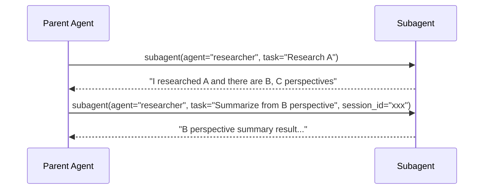

# Subagent

## Overview

Feature that lets Agent have other agents as subagents. User configures subagent in same way as existing agent, then connects it to parent agent for use.

### Core Principles

- **Agent-as-Tool**: subagent is exposed as tool of parent agent.
- **Depth 1**: subagent having its own subagent is not allowed.
- **Isolation**: subagent runs in its own session and does not share parent conversation history.
- **No user intervention**: subagent communicates only with parent and does not directly interact with user.

---

## Agent Role

Existing `AgentType` (`PUBLIC`/`PRIVATE`) is used as visibility, so add separate `role` field to distinguish agent/subagent.

```python
class AgentRole(enum.StrEnum):
    AGENT = "agent"       # can have subagents, can run independently
    SUBAGENT = "subagent" # cannot have subagents, can run independently
```

- Add `role` column to `agents` table (default: `AGENT`).
- Only agent with `role = AGENT` can connect subagent.
- Only agent with `role = SUBAGENT` can become another agent's subagent.
- Agent with `role = SUBAGENT` can also run independently (chat, etc.).

---

## Data Model

### agent_subagents Junction Table

```python
class RDBAgentSubagent(RDBModel):
    __tablename__ = "agent_subagents"

    id: Mapped[str]           # PK
    agent_id: Mapped[str]     # FK → agents.id (parent, role=AGENT)
    subagent_id: Mapped[str]  # FK → agents.id (child, role=SUBAGENT)
    description: Mapped[str]  # description exposed to LLM
    enabled: Mapped[bool]     # enabled flag

    # UNIQUE(agent_id, subagent_id)
    # CHECK(agent_id != subagent_id)
```

- `description`: used as ToolSpec.description in parent's tool list. Separate from Agent's own description; explains from parent perspective "when to call this subagent".
- Only agents within same workspace can be connected.

### Validation Rules

- Check `agent_id` role is `AGENT`.
- Check `subagent_id` role is `SUBAGENT`.
- Handle at Application level (DB cross-table constraint is complex).

### ConversationSession Extension

- Add `parent_session_id` (nullable FK) column.
- Cascade when Parent session is deleted.

---

## Tool Exposure

Subagent is converted into parent tool and exposed to LLM. Resolve together with toolkits inside `resolve_agent_tools()`.

```python
ToolSpec(
    name="subagent",
    description=junction.description,
    input_schema={
        "type": "object",
        "properties": {
            "agent": {
                "type": "string",
                "description": "The subagent to delegate the task to.",
                "enum": [...]
            },
            "task": {
                "type": "string",
                "description": "Task to delegate to this subagent"
            },
            "session_id": {
                "type": "string",
                "description": "Previous session ID to resume (optional)"
            }
        },
        "required": ["agent", "task"]
    }
)
```

- Unified as single `subagent` tool — target subagent selected by `agent` parameter. (It is single-instance builtin toolkit, so exposed without slug prefix.)
- `task`: delegation content written by parent LLM.
- `session_id`: used to resume previous subagent execution.

---

## Turn Model

### Single-run Default

Inject instruction into Subagent system prompt: "complete best-effort without asking back." Most calls finish in one execution.

### Resume Support

If Subagent returns incomplete result, parent LLM can judge and pass previous `session_id` to continue same session.



---

## Context Delivery

Subagent receives only its own system_prompt + content parent put into `task` parameter. Parent conversation history is not delivered.

Parent LLM sees whole conversation, so it can include necessary context in task.

---

## Sessions and Resources

### Session

- Create new `ConversationSession` for each Subagent execution (`parent_session_id` set, `type=SUBAGENT`).
- Because session directly owns events, **separate session = automatic isolation** — structurally separated from parent events.
- On Resume, continue previous history with same session_id.
- When Parent session is deleted, subagent sessions are cascade-deleted.

### Session Data (RustFS)

- Subagent accesses storage with parent session_id (fully shared).
- Parent and subagent can read/write same files.

### Sandbox

- Subagent shares parent's sandbox.
  - Specify parent sandbox with `BuiltinToolkit.set_sandbox_agent_id(parent_agent_id)`.
  - `AgentHomeSandboxManager` looks up cache by parent's agent_id → immediately returns already allocated sandbox.
  - Skill/memory lookup keeps subagent's own agent_id (`_agent_id` vs `_sandbox_agent_id` separation).
- Exclude `recreate_sandbox` tool from Subagent (protect parent environment).
- `AgentHomeSandboxManager.get_or_allocate()` immediately returns without lock on cache hit, and prevents race condition with per-agent_id lock only on new allocation.

### Credential/Model

- Subagent uses its own LLM provider/model/MCP credential.
- Per-user auth (MCP per-user OAuth2, etc.) is based on user who called parent.

---

## Engine Execution

Subagent directly calls `engine.run()` inside same worker process from tool handler. It does not go through Broker.

### check_stop Propagation

Wrap parent's check_stop with OR condition:

```python
async def subagent_check_stop() -> bool:
    # 1. user stop request (propagate parent check_stop)
    if parent_check_stop is not None and await parent_check_stop():
        return True
    # 2. whether parent engine died
    if parent_task.done():
        return True
    return False
```

### poll_messages

Not passed to Subagent. User messages are received only by parent, and subagent only performs content parent instructed as task.

---

## Streaming & Event Propagation

### Separate Channel Method

Subagent events are stored in subagent session and do not flow into parent stream. Parent stream propagates only start/end markers:

```
ToolCallStart(name="subagent", arguments={agent: "researcher", task: "..."})
DurableSubagentStart(subagent_id, subagent_name, subagent_session_id)
DurableSubagentEnd(subagent_id, subagent_session_id, final_result="...")
ToolCallEnd(result="...")
```

Add only `DurableSubagentStart` / `DurableSubagentEnd` events without changing existing WS structure. In Wire format (WS/Broker serialization), they are sent as `subagent_stream_start` / `subagent_stream_end` types respectively.

### FE V1 — Status Update

- `subagent_stream_start` → show loading "○○ agent is running...".
- `subagent_stream_end` → clear loading and show result.

### FE V2 — Subagent Detail Popup

Show subagent execution process in detail in modal popup. Reuse existing chat UI as-is to show messages from subagent session.

#### Data Loading

- **Lazy fetch**: load subagent session data only when user clicks.
- **Real-time streaming**: If subagent is running while popup is open, connect WebSocket with that `subagent_session_id` and display realtime events. Disconnect WebSocket when popup closes.
- **Completed execution**: When popup opens, fetch history with `GET /chat/v1/sessions/{subagent_session_id}/messages`. Use existing API as-is; no separate endpoint required.

#### UI

- **Modal popup**: use Mantine `Modal`.
  - mobile: fullScreen modal filling screen
  - desktop: appropriately sized centered modal
- **Entry point**: open popup when clicking subagent execution block (current `SubagentIndicator`) in parent chat. Completed subagent result is also clickable.
- **Internal UI**: reuse existing chat message rendering components as-is. Existing features such as token usage and thinking block are automatically included.

#### Access Control

- Existing `list_messages` API performs `user_id` check, so no additional work required.
- `user_id` of subagent session is set same as parent.

---

## Cost/Resource Control

### Execution Limit

Do not set max_turns. Safety is composed of three mechanisms:

1. **User stop**: can interrupt any time with stop button.
2. **Stop propagation**: stop on parent → propagated to subagent.
3. **Parent death detection**: if parent engine dies, subagent automatically terminates.

### Cost Transparency

- Because Subagent session is separate, token usage is naturally aggregated separately.
- Models may differ, so do not sum with parent.
- FE V2 (subagent detail view) exposes token usage.

---

## Compaction & Token Management

- **Parent side**: subagent result accumulates as tool result and existing `ENGINE_MAX_OUTPUT_CHARS` truncation applies. No additional processing needed.
- **Subagent side**: same compaction logic as parent automatically applies.

---

## Error Handling

- Subagent internal error (LLM, tool, etc.): same engine code, so existing handling applies as-is.
- If Subagent itself crashes: caught in parent's tool exception handling and returned to parent LLM as tool error.

---

## Reference: Major Framework Comparison

| Dimension | OpenAI SDK | Claude Code | CrewAI | nointern |
|------|-----------|-------------|--------|----------|
| Call method | Agent-as-Tool / Handoff | Task tool | Manager delegation | Agent-as-Tool |
| Context delivery | full history (default) | task only (isolated) | role+goal | task only (isolated) |
| Depth limit | max_turns only | force Depth 1 | allowed_agents | force Depth 1 |
| Session | shared | separate transcript | shared | separate session + resume |
| Tool inheritance | independent | configurable | independent | independent |
| Result return | Tool result | file-based | Manager verification | Tool result |
| Resume | none | supported | none | supported |

---

## Implementation Plan

### Phase 1 — Data Model & CRUD

Add `role` field to Agent and create `agent_subagents` junction table. Implement CRUD so Admin/Public API can manage subagent connections.

#### Scope

- Add `AgentRole` enum (`AGENT`, `SUBAGENT`).
- Add `role` column to `agents` table (migration).
- Create `agent_subagents` table (migration).
- Add `parent_session_id` column to `ConversationSession` (migration).
- AgentSubagent repository (CRUD).
- AgentSubagent service (including validation logic).
- Admin API: endpoint to manage subagent connections.
- Public API: include subagent list on agent lookup.

#### Completion Criteria

- Agent role can be specified when creating Agent.
- Agent with role=AGENT can connect/disconnect agent with role=SUBAGENT.
- Validation: prevent cross-role invalid connection, self-reference, cross-workspace.
- Tests pass.

---

### Phase 2 — Subagent Tool Exposure & Engine Execution

Convert Subagent into parent agent's tool and run subagent engine from tool handler. At end of this Phase, subagent actually works.

#### Scope

- Query `agent_subagents` in `resolve_agent_tools()` → convert to `Tool(spec, handler)`.
- Implement Subagent tool handler:
  - Load Subagent agent settings (LLM provider, model, system_prompt, toolkits).
  - Create new ConversationSession (`parent_session_id` set).
  - Directly call `engine.run()`.
  - Return final output as tool result.
- Inject "complete best-effort without asking back" instruction into Subagent system prompt.
- Exclude `recreate_sandbox` tool from Subagent.
- Exclude subagent tool from Subagent (force depth=1).
- Session data: storage access with parent session_id.
- Sandbox: shared access with parent session_id.

#### Completion Criteria

- Parent agent calls subagent as tool call based on LLM judgment.
- Subagent runs with its own settings (model, tools, system_prompt).
- Subagent result returns to parent as tool result.
- Parent receives result and continues conversation.

---

### Phase 3 — Stop Propagation & Safeguards

Ensure subagent safely terminates on user stop request or parent death.

#### Scope

- Implement `subagent_check_stop` callback (parent check_stop OR parent task done).
- Pass check_stop callback to Subagent engine.run().
- Add per-session_id `asyncio.Lock` to `SandboxManager.get_or_allocate()`.
- Verify sandbox race condition prevention on parallel subagent execution.

#### Completion Criteria

- user stop → parent + running subagent both stop.
- parent engine abnormal termination → subagent terminates automatically.
- No sandbox allocation conflict during parallel subagent execution.

---

### Phase 4 — Resume Support

Implement session_id-based resume so Subagent session can continue.

#### Scope

- Handle `session_id` parameter in Subagent tool handler:
  - if no `session_id`, create new session.
  - if `session_id` exists, load existing session and continue.
- On Resume, add new task as UserInputEvent on top of previous history.
- Include session_id in Subagent tool result (parent LLM can use when judging resume).

#### Completion Criteria

- Parent can call subagent, and if result is incomplete, resume with session_id.
- Previous context (tool result, LLM output, etc.) is kept on Resume.

---

### Phase 5 — Streaming Events & FE V1

Propagate subagent start/end events to parent stream and show status in FE.

#### Scope

- Define `SubagentStreamStart` / `SubagentStreamEnd` event types.
- Add Broker serialization/deserialization.
- Emit events from Subagent tool handler.
- Propagate subagent events from WS handler.
- FE: SubagentStreamStart → show loading "○○ agent is running...".
- FE: SubagentStreamEnd → clear loading and show result.
- Add i18n keys.

#### Completion Criteria

- FE shows loading state when Subagent runs.
- FE shows result when Subagent completes.
- Integrated naturally into existing conversation UX.

---

### Phase 6 — FE: Agent Settings UI

Allow selecting role and managing subagent connections in Agent settings screen.

#### Scope

- Select role (agent / subagent) when creating/updating Agent.
- Manage subagent connections in Agent settings (add/remove/edit description).
- When connecting subagent, filter only agents in same workspace with role=SUBAGENT.

#### Completion Criteria

- Agent role can be configured in UI.
- Subagent connections can be added/removed/description edited in UI.
- Validation errors displayed (role mismatch, self-reference, etc.).

---

### Future Improvements

- **FE V2 — Nested View**: fetch events by subagent_session_id and show collapsible details.
- **FE V2 — Token usage**: display token usage per subagent session.
- **Parallel subagent optimization**: improve UX during concurrent execution.
- **Subagent templates**: provide frequently used subagent patterns as templates.
