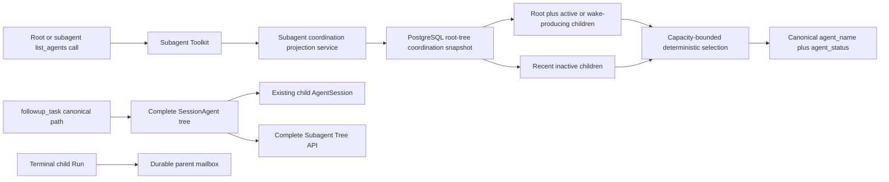

# Bounded Subagent Coordination Design

- Snapshot: `subagent-260820`
- Document reference: `subagent-260820/DESIGN`
- Requirements:
  [`subagent-260820/REQ`](../requirements/subagent-260820-bounded-agent-coordination.md)
- Decisions:
  [`subagent-260820/ADR`](../adr/subagent-260820-bounded-agent-coordination.md)

## Current Behavior and Requirement Gaps

`SubagentToolkit._list_agents_tool()` resolves the caller's root `SessionAgent`,
loads the complete root tree ordered by path, and projects each node separately.
Every retained node is returned with local `agent_name`, canonical `agent_path`,
projected `agent_status`, and `last_task_message`. Tree retention is intentionally
unbounded until root-session deletion, so both result count and task-preview bytes
grow across the root-session lifetime.

Active-subagent admission is already bounded independently. Spawn and follow-up
hold the root tree lock and count children whose `AgentSession.run_state` or latest
`AgentRun` is pending/running. Wake-producing mailbox input marks the target
Session running and is also treated as active by wait observation. Completed child
identity, transcript, mailbox, and canonical path remain durable and reusable.

Agent-to-agent spawn, message, follow-up, and terminal-result operations already
update `SessionAgent.last_message_at`. Terminal results are idempotently enqueued to
the direct parent's durable mailbox, and the parent observation cursor owns unread
state. The public Subagent Tree independently projects the complete tree, latest
task, terminal result, activity ordering, and unread state.

| Requirement | Current gap |
| --- | --- |
| `subagent-260820/REQ-1` | `list_agents` returns every retained node and has no capacity-derived bound. |
| `subagent-260820/REQ-2` | Active state can be derived, but the tool does not distinguish required coordination rows from history. |
| `subagent-260820/REQ-3` | Reuse already works; list membership must be separated from canonical path targeting without changing it. |
| `subagent-260820/REQ-4` | Terminal delivery is already independent but must remain outside the new list projection. |
| `subagent-260820/REQ-5` | `agent_path` duplicates identity and `last_task_message` is unbounded user content. |
| `subagent-260820/REQ-6` | The complete Subagent Tree already exists and must not adopt the model-facing bound. |

## Requirement and Decision Traceability

| Requirement | ADR authority | Primary design mechanisms |
| --- | --- | --- |
| `subagent-260820/REQ-1` | `subagent-260820/ADR-D1`, `ADR-D2` | M1, M2, M6 |
| `subagent-260820/REQ-2` | `subagent-260820/ADR-D1`, `ADR-D2` | M1, M2 |
| `subagent-260820/REQ-3` | Fixed durable-reuse outcome | M4 |
| `subagent-260820/REQ-4` | Fixed terminal-delivery outcome | M5 |
| `subagent-260820/REQ-5` | `subagent-260820/ADR-D3` | M3 |
| `subagent-260820/REQ-6` | Fixed complete-history outcome | M5 |

## Architecture and Ownership

The model-facing list becomes a read-only coordination projection. It owns no
subagent lifecycle state.



Ownership boundaries:

- `SessionAgent` remains the complete durable tree and canonical path authority.
- `AgentSession`, latest `AgentRun`, and wake-producing mailbox state remain the
  active-work authorities.
- `SessionAgent.last_message_at` remains durable collaboration recency evidence.
- A new backend coordination projection service owns classification, capacity, and
  selection for `list_agents` only.
- Canonical path resolution for `send_message`, `followup_task`, and
  `interrupt_agent` continues to query the complete tree, not the bounded list.
- Terminal delivery and the public Subagent Tree retain their existing services and
  schemas.

## M1. Root-Tree Coordination Snapshot

Add a typed repository projection dedicated to the model-facing coordination read.
The query accepts the resolved child capacity, classifies the caller's root tree,
and returns only the selected rows plus privacy-safe selection counts. Its bounded
row fields are:

- SessionAgent identity: `id`, `agent_session_id`, `kind`, `path`,
  `last_message_at`, `created_at`;
- linked `AgentSession.run_state`;
- latest `AgentRun.status`, when present; and
- whether any pending mailbox row for the child uses
  `scheduling_mode = wake_session`.

The repository resolves the caller's root from the current `AgentSession` and uses
one SQL statement with CTE/lateral or equivalent PostgreSQL constructs to:

1. select the latest Run by greatest `run_index` per Session;
2. classify required children with Run, Session, and mailbox `EXISTS` evidence;
3. count required children;
4. rank only inactive children by collaboration recency; and
5. return the root, all required children, and only the allowed recent inactive
   rank.

The result also returns configured capacity, required count, selected inactive
count, and omitted inactive count without returning omitted paths. The existing
indexes on root tree, Session Run index, and `(session_id, scheduling_mode)` support
the query. No new persisted column, index, or migration is required for the first
implementation.

One SQL statement gives one PostgreSQL statement snapshot, bounds application
materialization, and avoids the current per-agent latest-Run queries. The projection
is read-only and does not lock the root or block spawn, messaging, terminalization,
or mailbox promotion. As with any status query, work may change immediately after
the snapshot; the next tool call observes the later authoritative state.

Missing current/root identity is a tool error. Database invariants require every
SessionAgent to link an AgentSession; unexpected child inconsistency projects
`not_found` without inventing active work. Query failures propagate as tool errors
and never fall back to the complete historical list.

## M2. Deterministic Capacity-Bounded Selection

The projection service classifies every non-root row.

A child is **required** when any of these is true:

- its linked AgentSession has `run_state = running`;
- its latest AgentRun is `pending` or `running`; or
- it has pending `wake_session` mailbox input.

The service computes:

```text
configured_capacity = current resolved Agent max_subagents
required_count = number of required children
effective_capacity = max(configured_capacity, required_count)
inactive_slots = max(configured_capacity - required_count, 0)
```

The selected set is:

1. the root;
2. every required child; and
3. at most `inactive_slots` non-required children ordered by
   `last_message_at` newest first.

A stable fallback for equal or null activity uses creation time and canonical path.
The final emitted rows use root-first canonical-path order so identical snapshots
produce identical JSON independently of query plan order.

This preserves the temporary convergence behavior after an administrator lowers
`max_subagents`: all existing active children remain visible, no inactive history
fills the overflow, and existing spawn/follow-up admission rejects new activation
until required work falls below the configured value.

Spawn assignment, ordinary messages, follow-up assignment, and terminal-result
delivery already touch both participating SessionAgents. A recently completed child
therefore remains discoverable while capacity is available. Unread state is not an
additional selection authority.

The Toolkit refreshes the Agent and its `subagent_settings` together at the normal
turn context boundary. The list projection and spawn/follow-up admission within one
turn use the same resolved capacity snapshot. A setting change committed after that
boundary is observed by the next refreshed turn, matching existing Agent-policy
resolution behavior.

## M3. Canonical Bounded Tool and Web Contract

The `list_agents` input remains an empty object. Its output becomes:

```json
{
  "agents": [
    {
      "agent_name": "/root",
      "agent_status": "running"
    },
    {
      "agent_name": "/root/reviewer",
      "agent_status": "completed"
    }
  ]
}
```

`agent_name` is always the canonical absolute `SessionAgent.path`.
`agent_status` retains the existing bounded string projection:

- Session `run_state = running` projects `running`;
- latest Run `completed` projects `completed`;
- latest Run `failed` projects `errored`;
- latest Run `stopped`, `interrupted`, or `cancelled` projects `interrupted`;
- another latest Run status uses its bounded enum value;
- no latest Run projects `idle`; and
- missing linked state projects `not_found`.

No task, message, terminal-result text, or local-name duplicate is emitted.
`spawn_agent` and the public Subagent Tree contracts are unchanged.

The azents-web known-tool `agentListResultSchema` becomes a strict two-field item
schema. The specialized renderer keeps the collapsed count and renders each
canonical path as the title with status as its only semantic detail. Old four-field
results fail the strict specialized parser and use the existing Generic raw-data
fallback; no legacy semantic branch is added.

## M4. Historical Targeting and Reuse Remain Complete

`_resolve_target()` and repository canonical path resolution continue to use the
complete root `SessionAgent` tree. They do not consult the bounded coordination
projection.

`followup_task` for an omitted historical child therefore retains the current flow:

1. resolve the existing SessionAgent by canonical path;
2. enforce active capacity under the root lock;
3. enqueue wake-producing input to its existing child AgentSession;
4. update the existing last-task and message activity evidence; and
5. wake the existing Session.

No replacement SessionAgent, duplicate sibling path, resume operation, or resident
activation write is introduced. Once the follow-up is admitted, running/pending or
wake state makes the child required in the next list snapshot.

## M5. Terminal Results and User-Facing History Stay Independent

The terminal boundary continues to use `SubagentTerminalResultService` and
`AgentMailboxService.enqueue_terminal_result`. Delivery remains idempotent by Run,
records the parent-result delivery state, and updates the source and parent message
activity.

Mailbox promotion continues to advance the direct child's parent observation
cursor. The Subagent Tree service continues to calculate unread state, terminal
message, latest task, and complete children from the entire durable tree.

No Subagent Tree route, response model, WebSocket invalidation, generated client, or
frontend tree component is changed. A node omitted from `list_agents` remains
visible in that complete user-facing tree.

## Data Model and Configuration

No database schema change is required.

Retained fields and indexes provide all authority:

- `session_agents.root_session_agent_id`, `path`, `last_message_at`, and timestamps;
- `agent_sessions.run_state`;
- `agent_runs(session_id, run_index)` and Run status;
- `mailbox_items(session_id, scheduling_mode)`; and
- Agent `subagent_settings.max_subagents`.

No resident flag, eviction timestamp, list limit, Redis key, cache, background job,
or new administrator setting is added.

## Concurrency, Failure, Retry, and Recovery

- `list_agents` is a side-effect-free snapshot and is safe to retry.
- Concurrent spawn, follow-up, completion, or mailbox promotion may commit before
  or after the statement snapshot. The result represents one valid read boundary;
  the next call converges without repair work.
- Active admission remains serialized by the existing root-tree lock. The read
  projection does not become capacity authority and cannot admit work.
- Lowered-capacity overflow never interrupts existing work. Required rows are all
  returned and inactive rows receive zero slots until convergence.
- Process or worker restart changes no membership authority because all input state
  is PostgreSQL-backed.
- Query or decoding failures raise the ordinary FunctionTool error path. Returning
  the old unbounded list, a partial guessed list, or an empty success response is
  not a fallback.
- Terminal-result retry and repair behavior is unchanged and independent of list
  success.

## Security and Permissions

The tool remains available only inside the resolved subagent collaboration Toolkit
for the current AgentSession. Root resolution constrains the repository query to the
caller's own `root_session_agent_id`; no cross-root or cross-Workspace identifier is
accepted as input.

Removing `last_task_message` reduces model-visible replication of user-provided
content. The new result contains only canonical paths and bounded status enums. No
new public API, authorization rule, credential, Runtime access, or external-channel
surface is introduced.

## Migration, Rollout, and Rollback

There is no data migration or backfill. Existing root trees immediately produce the
new bounded projection from their current state.

Backend and azents-web changes ship in one PR. Mixed deployment is safe because the
known-tool presentation already has call-local Generic fallback:

- old frontend + new backend: the old specialized schema rejects the missing old
  fields and shows raw Generic data;
- new frontend + old backend: the strict new schema rejects old extra fields and
  shows raw Generic data.

After both are deployed, new calls use the specialized two-field renderer. Existing
historical four-field tool results display through Generic fallback.

Rollback restores the old backend and renderer without database action. Tool
history and complete Subagent Tree data remain intact. The rollback reintroduces
unbounded model output and is therefore operationally safe but does not satisfy the
new Requirements.

## Observability and Operations

Add privacy-safe structured counters or debug fields for each list call:

- configured child capacity;
- required child count;
- selected inactive count;
- omitted inactive count;
- total emitted count; and
- whether lowered-capacity convergence is active.

Do not log agent paths, task text, message text, or terminal content for this
projection. Existing FunctionTool failures remain visible through normal engine
error logging and monitoring.

A sustained convergence flag indicates that administrators lowered capacity while
work remains active; it is expected state, not an automatic stop or repair signal.

## Test Strategy

### Primary E2E verification matrix

| Scenario | Required evidence |
| --- | --- |
| Bounded recent set | Create and complete more uniquely named children than `max_subagents`; a model-issued `list_agents` result contains root plus at most the configured number of children, includes the newest inactive children, and omits the oldest. |
| Historical reuse | Send `followup_task` to the omitted canonical path; the existing Subagent Tree node and child AgentSession ID are reused, the child becomes required in the next list, and its next terminal result is delivered once. |
| Active completeness and lowered-capacity convergence | Hold multiple child Runs active with the existing release-barrier Toolkit, lower `max_subagents`, and verify `list_agents` includes every active child while a new activation is rejected; after release/completion, a later list contracts to the configured bound. |
| Complete user history | After omission from `list_agents`, the Subagent Tree still contains every child with latest-task, terminal, and unread projections. |
| Exact tool contract | Persisted `client_tool_result` JSON contains only `agent_name` and `agent_status` for each item and uses canonical absolute paths. |

Extend `testenv/azents/e2e/src/tests/required/public/test_subagents.py` and its
deterministic `agents_md_loader.json` mock responses. The existing required-public
suite, Docker Runtime Provider, deterministic OpenAI mock, release barrier, history
helpers, and Subagent Tree helpers are sufficient. No external credential snapshot
or new fixture provider is required.

These tests are required and must fail rather than skip when the local deterministic
fixture is unavailable. CI evidence is the required-public E2E lane's JUnit XML,
pytest output, timings, and Docker diagnostics.

### Backend and repository tests

- PostgreSQL repository tests cover latest-Run selection, wake-mailbox `EXISTS`,
  root scoping, nested paths, and one-row-per-SessionAgent output.
- Projection service tests cover normal capacity, zero capacity, active overflow,
  recent inactive fill, null/equal activity fallback, caller-as-child behavior, and
  every status mapping.
- Toolkit tests assert the exact two-field JSON shape, canonical paths, bounded
  count, no task text, and target reuse independent of list membership.
- Existing terminal-delivery and Subagent Tree tests remain unchanged and are run as
  regression coverage.

### Frontend tests

Update known-tool presentation tests to verify:

- the strict two-field result produces the specialized `listAgents` presentation;
- canonical path and status render without task content;
- old four-field and malformed results use Generic fallback; and
- the collapsed count remains correct.

No browser E2E is required for this renderer-only change because the pure parser and
presentation output are deterministic and the product behavior is covered by the
backend E2E tool result.

## Feasibility Validation

| Scope | Result | Repository evidence |
| --- | --- | --- |
| Bounded durable projection | Feasible | SessionAgent root/path/activity, AgentSession run state, latest AgentRun, and mailbox scheduling mode are already persisted and indexed. |
| Active completeness | Feasible | Current `_session_agent_active`, AgentWaitService, and wake-input transition already define the required signals. |
| Recent inactive selection | Feasible | AgentMailboxService already updates `last_message_at` for source and target on every collaboration operation. |
| Historical reuse | Feasible | `_resolve_target` uses the complete tree and `followup_task` reuses the existing child AgentSession. |
| Terminal and UI independence | Feasible | Terminal delivery, observation cursor, and Subagent Tree projection are separate from `list_agents`. |
| Two-field web rendering | Feasible | The known-tool renderer owns a local Zod schema and has Generic fallback; no generated API client changes are needed. |
| E2E verification | Feasible | Existing deterministic subagent E2E provides provider fixtures, release barriers, raw tool-result inspection, and complete tree inspection. |

The current `AgentRunRepository.list_latest_by_session_ids()` performs one query per
Session and is not the implementation path for the new list projection. The
repository-grounded solution is a dedicated batched SQL projection; this is a
bounded implementation obligation, not a feasibility blocker.

## Alternatives and Non-Blocking Risks

- A very large durable tree still requires PostgreSQL to classify historical rows.
  The returned model payload and application materialization are bounded. Query
  latency should be measured through the proposed counts before adding an index or
  retention policy not authorized by this snapshot.
- Historical specialized `list_agents` cards fall back to Generic after the strict
  schema change. Raw diagnostic data remains available, and no compatibility branch
  is authorized.
- Legacy children with null `last_message_at` use stable creation/path fallback and
  gradually become normally ranked after any new collaboration activity.
- The model can target an omitted historical agent only if it retains or receives
  the canonical path. A model-facing historical search tool is outside the
  confirmed Requirements.

## Design Authority

- Design revision: `1`

| ID | Material design mechanism | Authority | Classification |
| --- | --- | --- | --- |
| M1 | Read one root-scoped durable coordination snapshot with no membership writes. | `subagent-260820/REQ-1`, `REQ-2`; `subagent-260820/ADR-D1` | `decided` |
| M2 | Select root and all required children, then fill configured remaining capacity by recent interaction. | `subagent-260820/REQ-1`, `REQ-2`; `subagent-260820/ADR-D2` | `decided` |
| M3 | Emit strict canonical `agent_name` plus bounded `agent_status` and update the web specialized renderer. | `subagent-260820/REQ-5`; `subagent-260820/ADR-D3` | `decided` |
| M4 | Keep canonical targeting on the complete durable tree and reuse the existing child AgentSession. | `subagent-260820/REQ-3`; current Conversation and Toolkit Specs | `existing` |
| M5 | Keep terminal delivery, unread observation, and complete Subagent Tree independent of list membership. | `subagent-260820/REQ-4`, `REQ-6`; current Conversation Spec | `existing` |
| M6 | Use the current resolved Agent capacity, temporarily expand only to required active count after a reduction, and block new activation through existing admission. | `subagent-260820/REQ-1`; confirmed fixed constraint | `required` |
| M7 | Add no resident persistence, migration, new setting, or Redis authority. | `subagent-260820/ADR-D1`; confirmed fixed constraints | `decided` |

## Removal and Replacement

| Existing unit or behavior | Removal authority | Replacement or remaining authority | Removal boundary | Absence verification |
| --- | --- | --- | --- | --- |
| Full-tree unbounded `_list_agents_tool` loop and per-node status queries | `subagent-260820/REQ-1`, `REQ-2`; `ADR-D1`, `ADR-D2` | M1, M2 | Replace backend tool implementation in the feature PR. | Tests prove bounded count and no per-node list path remains. |
| `list_agents` local `agent_name`, duplicate `agent_path`, and `last_task_message` result fields | `subagent-260820/REQ-5`; `ADR-D3` | M3 | Remove from backend JSON and tool-specific frontend schema together. | Exact-shape backend/frontend tests reject the old specialized contract. |
| Specialized renderer task-preview content and path subtitle | `subagent-260820/ADR-D3` | M3; Generic raw fallback remains | Replace the `listAgents` semantic item mapping. | Presentation tests contain no specialized task-preview expectation. |
| Current `SessionAgent.last_task_message` storage and Subagent Tree projection | None; retained by `subagent-260820/REQ-6` | M5 | Retain unchanged. | Subagent Tree regression tests continue asserting latest-task behavior. |
| Canonical path resolution, terminal mailbox delivery, unread cursor, and child AgentSession reuse | None; retained by `subagent-260820/REQ-3`, `REQ-4`, `REQ-6` | M4, M5 | Retain unchanged. | Existing and new E2E verify reuse and exactly-once terminal observation. |
| Database schema, public REST/OpenAPI contracts, generated clients, and administrator settings | None; no approved replacement exists | M7 | No change. | Diff and generation checks show no migration, OpenAPI, generated-client, or settings field changes. |

## Design Approval

- Mode: `Collaborative`
- Decision owner: `requester`
- Approved on: `2026-08-20`
- Approved Design revision: `1`
- Approved authority IDs: `M1`, `M2`, `M3`, `M4`, `M5`, `M6`, `M7`
- Approved scope: deterministic PostgreSQL-backed bounded `list_agents` projection, recent inactive fill, canonical two-field tool and web contract, unchanged durable targeting, terminal delivery, and complete Subagent Tree history.
