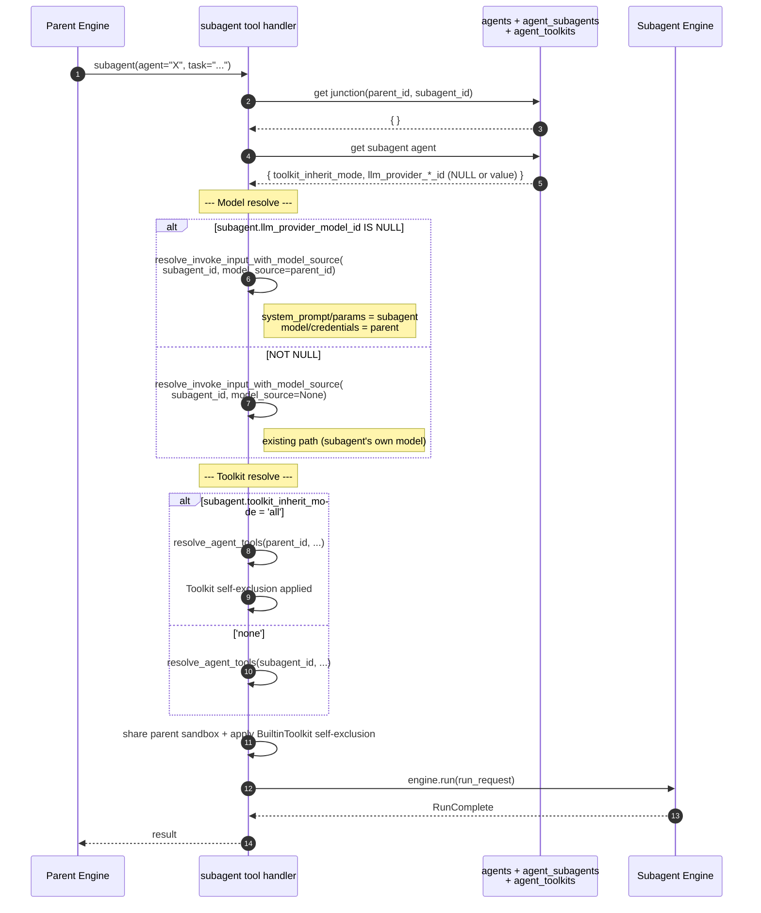

# Subagent Toolkit/Model Inherit Design

> **Implementation complete (2026-04-24)** — Related PRs: #2976 (design), #2984 (plan), #2985 (Phase A), #2987 (Phase B), #2989 (Phase C), #2991 (Phase D), #2993 (audit), #2994 (testenv QA). Final specs:
> - [`spec/domain/agent.md`](../../spec/domain/agent.md) (v2)
> - [`spec/domain/toolkit.md`](../../spec/domain/toolkit.md) (v3)
> - [`spec/flow/subagent-delegation.md`](../../spec/flow/subagent-delegation.md) (v2)
>
> **Changes from design**:
> - DP5 `model_inherit: bool` flag → changed to nullable `llm_provider_*_id` (NULL = inherit) reflecting review #2976.
> - DP6 merge/dedupe → changed to exclusive inherit reflecting review #2976.
> - `MAIN_ONLY_TOOLKIT_TYPES` is currently an empty frozenset — all main-only tools are already blocked through other paths (worker dynamic inject, `memory_enabled=False`, `shell_recreate_sandbox` in `MAIN_ONLY_TOOL_NAMES`). Only the constant placeholder was prepared.

## Overview

Current nointern subagent has independent **LLM model**, **toolkit bindings**, and **system prompt** from the parent agent. This independence fits the "specialist subagent" pattern (DB analyst, code reviewer, etc.), but makes it hard to create a "**general subagent** — a subagent that inherits the parent's tools and model as-is and only performs a specific role."

This design adds options for subagent to selectively **inherit** parent's toolkit and model. At the same time, tools that must remain parent-only (`memory`, `schedule`, `subagent` itself, etc.) are explicitly separated.

### Problems solved

1. **Repeated setup burden** — Parent uses GitHub, Sentry, Slack toolkits, and subagent needs same tools; each subagent must attach each toolkit. With 11 subagents this repeats 11 times.
2. **Model consistency** — Parent uses Opus but subagent defaults to Sonnet. Matching the same model requires explicit configuration each time.
3. **General-purpose subagent unavailable** — To create a Claude Code-like `general-purpose` subagent that can be asked to do any investigation, it must inherit parent's tools as-is. Current structure does not support this.

### User scenario

> Workspace owner creates a subagent named "Code Explorer". Only the system prompt is set to "codebase investigation expert", and options **inherit parent's toolkit and model** are enabled. Whichever parent it is attached to, it runs with the parent tools/model at call time. The same subagent can be reused across multiple parents.

## Discussion Points and Decisions

### DP1. Storage location for inherit setting

| Option | Location | Pros | Cons |
|---|---|---|---|
| **A** (adopted) | `agents.toolkit_inherit_mode` (subagent agent row) | Subagent itself declares "I inherit parent"; consistent with model inherit at same level | Same subagent cannot behave differently per parent |
| **B** | `agent_subagents.toolkit_inherit_mode` (junction row) | Different policy possible per parent → subagent pair | Adds attribute to junction |

**Adopted: A (agent row level)**

Rationale:
- No real use case needs "different policy by parent".
- Model inherit (DP5) is also agent row level, so toolkit inherit at agent row level gives consistency.
- Subagent's nature is itself either "inheriting type" or "independent type" — it should not vary by parent.
- Reviewer decision (#2976).

### DP2. Default value of inherit

| Option | Behavior | Pros | Cons |
|---|---|---|---|
| **A** | Default `none` (opt-in) | compatible with existing subagents | new users wonder "why no tools?" |
| **B** (adopted) | Default `all` (opt-out) | General-purpose works naturally | existing subagents opt out in migration with 'none' |

**Adopted: B (opt-out — default inherit)**

Rationale: default inherit is more natural. Since "general subagent" is the primary use case, newly created subagent should be able to use parent tools immediately. Existing subagents are opted out in migration with `UPDATE agents SET toolkit_inherit_mode = 'none' WHERE role = 'subagent'` to keep behavior compatible.

### DP3. Toolkit Inherit Granularity

| Option | Expression | Pros | Cons |
|---|---|---|---|
| **A** (adopted) | `toolkit_inherit_mode = 'none' \| 'all'` | simple UX, clear intent | cannot inherit only some |
| **B** | Per-toolkit flag on junction | fine-grained control | UI complexity, overkill in most cases |
| **C** | Allowlist (toolkit_id list on subagent) | explicit, inherit uses same mechanism | duplicates existing `agent_toolkits` |

**Adopted: A (mode enum)**

Rationale:
- The issue's "general subagent" is the primary use case — all-or-nothing is sufficient.
- B/C can be added later by extending enum value (`'explicit'`) if requirements appear.
- Claude Agent SDK `tools` allowlist/`disallowedTools` combination is a similar pattern, so future extension path exists.

### DP4. How to distinguish Main-Only Toolkit

**Problem**: some tools must remain parent-only.
- `subagent` (prevent recursion)
- `memory` (avoid polluting parent context; currently blocked with `memory_enabled=False`)
- `schedule` (subagent is not scheduler owner)
- `shell_recreate_sandbox` (prevent destroying parent sandbox; currently hardcoded in `_EXCLUDED_TOOL_NAMES`)
- `task_status` / `task_stop` (background task management, parent concern)

| Option | Expression | Pros | Cons |
|---|---|---|---|
| **A** | Toolkit-level DB flag `main_only: bool` | workspace manager can set per MCP instance | most are built-in tools, DB flag is overkill |
| **B** | Code constants `MAIN_ONLY_TOOLKIT_TYPES`, `MAIN_ONLY_TOOL_NAMES` | makes current hardcoded logic explicit and simple | not editable by workspace manager (intentional) |
| **C** (adopted) | Each Toolkit defines which tools to exclude in subagent | no dependency on external constant list; encapsulated | each Toolkit owns its responsibility |

**Adopted: C (Toolkit self-definition)**

Rationale:
- It is better encapsulation for each Toolkit to define which tools to exclude from subagent. Do not depend on external constant lists (`MAIN_ONLY_TOOL_NAMES`, `MAIN_ONLY_TOOLKIT_TYPES`).
- `BuiltinToolkit` already has `set_excluded_tools`, and applies `_SUBAGENT_EXCLUDED_TOOLS` internally when initialized for subagent.
- `MAIN_ONLY_TOOLKIT_TYPES` was actually an empty frozenset (no-op), so removing it changes no behavior. All main-only tools are already blocked through other paths (worker dynamic inject, `memory_enabled=False`, BuiltinToolkit self-excluded).
- If DB flag (A) becomes necessary later, extend Toolkit with an attribute.

### DP5. Model Inherit representation

| Option | DB expression | Pros | Cons |
|---|---|---|---|
| **A** (adopted, reflects review #2976) | nullable `agents.llm_provider_model_id` / `llm_provider_integration_id` (NULL pair = inherit) | concise DB, "inherit" is first-class in schema, isomorphic to Claude Agent SDK `model: "inherit"` | relax NOT NULL + add CHECK constraint requiring NOT NULL only when `role='agent'` |
| **B** | `agent_subagents.model_inherit: bool` (junction flag) | keep existing NOT NULL | flag and model_id coexist (fallback meaning), settings split when same subagent attaches to multiple parents |
| **C** | Sentinel string (`model_id = 'inherit'`) | similar to Claude SDK | breaks FK constraint, pollutes schema |

**Adopted: A (NULL = inherit)**

Rationale:
- Subagent's model should be "the same method regardless of which parent calls it". Junction-specific branching is excessive — model is property of subagent itself.
- In DB, `llm_provider_model_id IS NULL` directly means "inherit", making intent clear.
- Semantically isomorphic to Claude Agent SDK `model: "inherit"` (nointern RDB representation is NULL).
- Do **not** add `model_inherit` column to `agent_subagents` junction. Toolkit inherit and model inherit are both agent row level (DP1 A, DP5 A), because they are properties decided by subagent's own nature.

**DDL**:
```sql
ALTER TABLE agents
  ALTER COLUMN llm_provider_model_id DROP NOT NULL,
  ALTER COLUMN llm_provider_integration_id DROP NOT NULL,
  ADD CONSTRAINT ck_agents_model_not_null_when_role_agent
    CHECK (
      role = 'subagent' OR (
        llm_provider_model_id IS NOT NULL AND
        llm_provider_integration_id IS NOT NULL
      )
    );
```

Additional rules (reflected in agent domain spec):
- `[subagent-model-nullable]` — if `role='subagent'`, `llm_provider_*_id` may be NULL. Both NULL = use parent's values at runtime.
- `[subagent-model-pair]` — only one NULL is forbidden (integration-model pair validity). Validate at service layer.

**Model inherit scope**:
- Inherit pair `llm_provider_integration_id` + `llm_provider_model_id` (only when both NULL). Pair preserves provider consistency.
- `model_parameters` (temperature, reasoning_effort, etc.) are **not inherited** — keep subagent's own values. Rationale: parameters are subagent role personality, not something that should be shared with parent.
- `compaction_model_id` is outside inherit scope (session-level concern).

### DP6. Toolkit inherit is Exclusive (No Merge)

**Initial design**: merge parent and subagent toolkits by `toolkit_type` dedup; explicit subagent overrides.

**Change reflecting review #2976**: when `toolkit_inherit_mode='all'`, use **only parent toolkits**. Subagent's own `agent_toolkits` is **completely ignored** for that junction call. No merge/dedup logic.

| Option | Behavior | Rationale |
|---|---|---|
| **A** | Merge (subagent explicit + parent inherit, dedupe by type) | flexible but requires tracking which toolkit came from where |
| **B** (adopted) | Exclusive — when `inherit=all`, parent toolkit only; skip subagent's own `agent_toolkits` | clear semantics, minimal configuration cognitive load |

**Adopted: B (exclusive)**

Rationale (reviewer opinion):
- Purpose of inherit is to use "parent's as-is". If additional toolkit is needed, turn inherit off and manually attach.
- There is no requirement yet for "some from parent, some mine". If added later, absorb complexity then.
- UI: when inherit toggle is on, subagent toolkit section becomes "Inheriting N toolkits from parent" and direct attach is disabled (read-only list + parent link).

**API-level enforcement**: attaching toolkit to a subagent with `toolkit_inherit_mode='all'` is allowed, but ignored at runtime. Subagent `agent_toolkits` means "own tools when inherit=none".

### DP7. Recursion prevention

If subagent inherits parent's `subagent` toolkit, A → B → A cycle becomes possible?

**Decision**: `subagent` / `task_status` / `task_stop` / `schedule` / memory are toolkits **dynamically injected by worker engine**, so they have no row in `agent_toolkits` DB. Inherit target is **only `AgentToolkit` junction stored in DB**, so `subagent` toolkit is naturally not inherited.

Spec explicitly states: "**Inherit target: only toolkit stored in `agent_toolkits` table**. Worker dynamically injected builtin/subagent/schedule/background-task toolkits are not inherit targets."

Additional defense: each Toolkit self-defines tools excluded from subagent (DP4 C). This gives double defense: structural block + Toolkit encapsulation.

### DP8. Cross-Workspace constraint

Existing `[integration-same-workspace]` rule: subagent and parent are in same workspace. Inherit happens only within same workspace, so there is no scope validation problem.

## Architecture



**Change scope** (reflecting review #2976):
- DB:
  - add `agents.toolkit_inherit_mode` column (VARCHAR(10), NOT NULL, DEFAULT 'all') + update existing subagents with `UPDATE ... SET 'none'`
  - `agents.llm_provider_integration_id`, `llm_provider_model_id` NOT NULL → nullable + CHECK constraint
- Runtime:
  - `engine/tools/subagent.py` handler — branch model/toolkit source
  - add `toolkit_type` field to `ToolkitBinding` in `engine/engine.py`
  - add `resolve_invoke_input_with_model_source` helper in `engine/run/resolve.py`
- Service:
  - `services/agent/__init__.py` — pass `toolkit_inherit_mode` + allow subagent model NULL + pair validation
- API:
  - POST/PATCH agent (`toolkit_inherit_mode` + nullable llm_provider_*_id for subagent)
- Frontend:
  - Agent edit page (`AgentForm.tsx`) — "Inherit toolkits" + "Inherit model" checkboxes for subagent
- Spec: `domain/agent.md`, `domain/toolkit.md`, `flow/subagent-delegation.md`

## Data Model

### DDL changes

**`agents` table** (toolkit inherit — agent row level):
```sql
ALTER TABLE agents
  ADD COLUMN toolkit_inherit_mode VARCHAR(10) NOT NULL DEFAULT 'all',
  ADD CONSTRAINT ck_agents_inherit_mode
    CHECK (toolkit_inherit_mode IN ('none', 'all'));
```

**`agents` table** (model inherit — agent row level, NULL = inherit):
```sql
ALTER TABLE agents
  ALTER COLUMN llm_provider_model_id DROP NOT NULL,
  ALTER COLUMN llm_provider_integration_id DROP NOT NULL,
  ADD CONSTRAINT ck_agents_model_not_null_when_role_agent
    CHECK (
      role = 'subagent' OR (
        llm_provider_model_id IS NOT NULL AND
        llm_provider_integration_id IS NOT NULL
      )
    );
```

Pydantic model changes:

`repos/agent/data.py` — two fields nullable in Agent:
```python
class Agent(BaseModel):
    # ...
    llm_provider_integration_id: str | None  # changed: str → str | None
    llm_provider_model_id: str | None         # changed: str → str | None
```

`repos/agent_subagent/data.py`:
```python
class SubagentToolkitInheritMode(str, Enum):
    """Toolkit inherit mode enum. Used on Agent row."""
    NONE = "none"
    ALL = "all"


class AgentSubagent(BaseModel):
    id: str
    agent_id: str
    subagent_id: str
    description: str
    enabled: bool
    created_at: datetime.datetime
    updated_at: datetime.datetime


class AgentSubagentCreate(BaseModel):
    agent_id: str
    subagent_id: str
    description: str
    enabled: bool = True


class AgentSubagentUpdate(TypedDict, total=False):
    description: str
    enabled: bool
```

`repos/agent/data.py` — add `toolkit_inherit_mode` to Agent:
```python
class Agent(BaseModel):
    # ...
    toolkit_inherit_mode: SubagentToolkitInheritMode  # new

class AgentCreate(BaseModel):
    # ...
    toolkit_inherit_mode: SubagentToolkitInheritMode = SubagentToolkitInheritMode.ALL

class AgentUpdate(TypedDict, total=False):
    # ...
    toolkit_inherit_mode: SubagentToolkitInheritMode
```

Service-level validation (`[subagent-model-pair]`):
- On subagent create/update, `(integration_id, model_id)` must be either (both NULL) or (both NOT NULL). Partial NULL returns 400.

### Main-Only Toolkit — Toolkit self-encapsulation (DP4 C)

Instead of an external constant list, each Toolkit self-defines tools to exclude from subagent:

- **`BuiltinToolkit`**: has internal `_SUBAGENT_EXCLUDED_TOOLS = frozenset({"shell_recreate_sandbox"})` and applies it through `set_excluded_tools` when initialized for subagent
- **DB-registered toolkit**: worker dynamic inject (subagent, schedule, background_task, memory) has no DB row, so it is structurally not an inherit target
- **Remove `MAIN_ONLY_TOOLKIT_TYPES` / `MAIN_ONLY_TOOL_NAMES` constants**: they were empty frozenset (no-op), so behavior does not change. Also remove `filter_main_only_toolkits`

## Runtime Implementation

### Model inherit: `resolve_invoke_input` extension required

**Feasibility verification result (Phase 3)**: `resolve_invoke_input()` does not only load model. It determines `agent.system_prompt`, `agent.model_parameters`, `agent.workspace_id`, and `RunRequest.agent_id` together (`resolve.py:92-246`). Therefore, if `InvokeInput.agent_id = parent_agent_id`, the parent's system_prompt and params also come along, causing subagent to behave as parent.

**Reflect review #2976 DP5→A**: Model inherit is detected by `subagent.llm_provider_model_id IS NULL`. It is not a junction flag.

→ **Add new helper `resolve_invoke_input_with_model_source`**:

```python
async def resolve_invoke_input_with_model_source(
    invoke_input: InvokeInput,           # agent_id = subagent id (owns system_prompt, params)
    *,
    model_source_agent_id: str | None,   # None = subagent's own model, str = use this agent's model
    agent_repository: AgentRepository,
    integration_repository: LLMProviderIntegrationRepository,
    provider_model_repository: LLMProviderModelRepository,
    # ... same existing parameters
) -> Result[RunRequest, ResolveError]:
    """Resolve with model source overrideable to a separate agent.

    If model_source_agent_id is None, load model from invoke_input.agent_id (existing behavior).
    If specified: keep subagent's system_prompt/model_parameters/workspace_id,
    but load LLM provider integration + provider model from specified agent.
    """
    # 1. Load subagent (prompt, params, workspace_id)
    agent = await agent_repository.get_by_id(session, invoke_input.agent_id)
    # 2. Load model source agent (integration + provider_model source)
    model_agent = (
        await agent_repository.get_by_id(session, model_source_agent_id)
        if model_source_agent_id is not None
        else agent
    )
    # 3. Provider model + integration come from model_agent
    provider_model = await provider_model_repository.get_by_id(
        session, model_agent.llm_provider_model_id
    )
    integration = await integration_repository.get_by_id_with_secrets(
        session, model_agent.llm_provider_integration_id
    )
    # ... build RunRequest afterward — model/credential_kwargs/max_input_tokens by model_agent,
    # everything else (agent_prompt, model_parameters, workspace_id, agent_id) by agent
```

Keep `resolve_invoke_input` itself, and refactor so the helper behaves as the same internal logic when `model_source_agent_id=None`.

### `engine/tools/subagent.py` handler change

```python
async def handler(...) -> str:
    junction = subagent_junctions_by_name[agent_name]
    agent_subagent = junction.agent_subagent  # AgentSubagent
    subagent = junction.subagent              # Agent (toolkit_inherit_mode, llm_provider_*_id may be None)

    # --- Model resolve ---
    # If subagent.llm_provider_model_id is NULL, use parent's model.
    # (DP5 A — NULL = inherit)
    model_source = (
        ctx.parent_agent_id
        if subagent.llm_provider_model_id is None
        else None
    )
    resolved = await resolve_invoke_input_with_model_source(
        InvokeInput(agent_id=junction.subagent_id, session_id=session_id, ...),
        model_source_agent_id=model_source,
        agent_repository=ctx.agent_repository,
        # ...
    )

    # --- Toolkit resolve ---
    # If toolkit_inherit_mode='all', use only parent's toolkit.
    # Skip subagent own agent_toolkits. (DP6 — exclusive, no merge)
    if subagent.toolkit_inherit_mode == SubagentToolkitInheritMode.ALL:
        toolkit_source_agent_id = ctx.parent_agent_id
    else:
        toolkit_source_agent_id = junction.subagent_id

    toolkits = await resolve_agent_tools(
        toolkit_source_agent_id,                           # ← parent or subagent
        context,
        # ... existing parameters
        sandbox_domain_config=ctx.parent_domain_config,
        memory_enabled=False,
    )

    # BuiltinToolkit itself encapsulates subagent exclusion (DP4 C)
    for binding in toolkits:
        if isinstance(binding.toolkit, BuiltinToolkit):
            binding.toolkit.set_sandbox_agent_id(ctx.parent_agent_id)
            binding.toolkit.set_excluded_tools(BuiltinToolkit._SUBAGENT_EXCLUDED_TOOLS)
    # ... keep rest of existing logic
```

### `engine/run/resolve.py` changes

**Reflect DP6 change**: Because inherit is exclusive, merge/dedup logic is removed. Reuse existing `resolve_agent_tools(agent_id)` and only branch the `agent_id` argument to `parent_agent_id` or `subagent_id`.

**Inherit target**: only DB-registered toolkit stored in `agent_toolkits` junction. The following are not inherit targets (naturally excluded):
- **BuiltinToolkit (shell + memory)** — auto-bound. Subagent has `memory_enabled=False`; `builtin_toolkit_provider` is determined by subagent's `shell_enabled`.
- **Slack/Discord** — blocked at source because subagent `context.interface_type=None`.
- **Schedule** — not injected in subagent path.
- **Worker-level dynamic inject** (`subagent`, `background_task`) — absent from DB in the first place.

**Main-only application** (DP4 C): instead of external constant list (`MAIN_ONLY_TOOLKIT_TYPES`), each Toolkit defines its own tools to exclude from subagent. `BuiltinToolkit` encapsulates `shell_recreate_sandbox` as `_SUBAGENT_EXCLUDED_TOOLS`.

**Do not wrap `resolve_agent_tools` with a separate helper**. In handler:
```python
target_id = parent_agent_id if subagent.toolkit_inherit_mode == ALL else subagent_id
bindings = await resolve_agent_tools(target_id, ...)
# BuiltinToolkit itself encapsulates subagent excluded (DP4 C)
```

Small code path — no new common helper function needed.

**Implementation change**:
- Add `toolkit_type: str | None` field to `ToolkitBinding` (`toolkit_type=None` for builtin/slack/discord/schedule, `at.toolkit_type` for DB-registered toolkit)

## API

### Extend existing endpoints (no breaking change)

**POST** `/api/v1/workspaces/{handle}/agents/{agent_id}/subagents` — create junction

Request (unchanged — `toolkit_inherit_mode` moves to agent API):
```json
{
  "subagent_id": "...",
  "description": "...",
  "enabled": true
}
```

**PATCH** `/api/v1/workspaces/{handle}/agents/{agent_id}/subagents/{agent_subagent_id}`

```json
{
  "description": "...",
  "enabled": true
}
```

**Toolkit inherit + Model inherit are Agent API path**: both are properties of agent row, so they are set through existing agent create/update API (`POST/PATCH /workspaces/{handle}/agents`). Add `toolkit_inherit_mode` field; sending `llm_provider_*_id` as `null` means model inherit. Meaningful only for agents whose role is `subagent`.

Existing endpoint schema:
```json
// POST /workspaces/{handle}/agents (when creating subagent)
{
  "name": "general-explorer",
  "role": "subagent",
  "system_prompt": "...",
  "toolkit_inherit_mode": "all",         // new — "all" (default) or "none"
  "llm_provider_integration_id": null,   // NULL = inherit
  "llm_provider_model_id": null,         // NULL = inherit (both NULL or both value)
  // ...
}
```

Include fields in response body. Update OpenAPI spec and regenerate TS client with `openapi-client-gen`.

## Frontend (UI/UX)

### Agent edit page changes (`AgentForm.tsx` — agent row level)

When editing an agent with Subagent role, place toolkit inherit and model inherit checkboxes side by side:

```
┌─────────────────────────────────────────────────────────┐
│ Inherit Settings (shown only when role=subagent)        │
│ ☑ Inherit parent toolkits                               │
│ ☑ Inherit parent model                                  │
└─────────────────────────────────────────────────────────┘
```

**Toolkit inherit checkbox**:
- checked: send `toolkit_inherit_mode = "all"`
- unchecked: `toolkit_inherit_mode = "none"`
- Tooltip: "Uses the toolkit attached to the parent as-is. Toolkits attached to the subagent are ignored at runtime. Parent-only tools such as `memory` and `schedule` are excluded."

**Model inherit checkbox**:
- checked: disable provider/model select and send `llm_provider_integration_id`/`llm_provider_model_id` = `null`
- unchecked: select as usual (NOT NULL)
- Tooltip: "Use the model of the parent agent that invokes this subagent. Model parameters such as temperature keep the subagent values."

### `AgentSubagentSection.tsx` changes

- Remove UI related to `toolkit_inherit_mode` (no longer junction-level)
- Keep only existing description and enabled toggle

### tRPC router changes

`agentSubagent.ts` — remove `toolkit_inherit_mode` (no longer junction property):

```ts
z.object({
  subagentId: z.string(),
  description: z.string(),
  enabled: z.boolean(),
})
```

`agent.ts` (agent CRUD) — add `toolkit_inherit_mode` and nullable `llm_provider_*_id`:

```ts
llmProviderIntegrationId: z.string().nullable(),
llmProviderModelId: z.string().nullable(),
toolkitInheritMode: z.enum(["none", "all"]).default("all"),
```

## Infra

**No change**. No deployment configuration change needed beyond DB migration.

## Feasibility Verification

Result of comparing with actual code in Phase 3.

| Item | Verification method | Result |
|---|---|---|
| DB migration | Add `toolkit_inherit_mode` column to `agents` (default 'all') + UPDATE existing subagents to 'none', DROP NOT NULL on two `agents` columns + CHECK constraint | ✅ normal, alembic autogenerate needs manual adjustment |
| Reuse `resolve_invoke_input` | Changing `InvokeInput.agent_id` to parent also brings parent system_prompt/params (`resolve.py:230-244`) | ❌ separate helper needed (`resolve_invoke_input_with_model_source`) |
| No toolkit_type on `ToolkitBinding` | `engine/engine.py:144-157` — NamedTuple (toolkit, slug, use_prefix) | ⚠️ add `toolkit_type: str \| None` to `ToolkitBinding` |
| DP6 change removes merge/dedup | No need to depend on `[toolkit-type-unique-per-agent]` rule | ✅ design simplified |
| MCP per-user OAuth | When subagent inherits parent MCP toolkit, token is based on **calling user (ctx.user_id)** | ✅ existing `_SubagentToolContext.user_id` reused; no change |
| Recursive `subagent` toolkit injection | Worker dynamic inject (`worker/engine.py:971`) runs only when `subagent_junctions` exists. It is not injected in the path resolved by subagent handler | ✅ structurally blocked |
| Slack/Discord auto-binding inherit | `interface_type=None` in `subagent.py:289` — Slack/Discord are not resolved | ✅ naturally blocked |
| Shell enable/disable | if subagent `shell_enabled=False`, handled with builtin_toolkit_provider=None (`subagent.py:299-303`) | ⚠️ use **subagent's own** `shell_enabled` |
| Remove NOT NULL on `agents.llm_provider_*_id` | Can existing code (resolve_invoke_input, etc.) accept NULL? | ⚠️ `resolve_invoke_input` must receive only already-resolved custom model or parent model source branch |
| Cross-workspace | `[integration-same-workspace]` + `CrossWorkspace` validation in `services/agent_subagent` (`data.py:70-75`) | ✅ naturally guaranteed |
| Compaction model interpretation | fallback if subagent `model_parameters.compaction_model_id` not found in **parent provider** (line 193-207) | ⚠️ warning log then main model fallback acceptable |

### Risks

| Risk | Impact | Mitigation |
|---|---|---|
| Subagent indirectly uses secrets/credentials attached to parent | Security — wider permission scope | default inherit all (DP2 B), workspace manager can change to none. Document security meaning. |
| Parent toolkit change affects subagent behavior (side effect) | Maintenance — unexpected change | UI warning next to inherit toggle: "parent toolkit changes are reflected" |
| Subagent model NULL invoked without parent call | Runtime — clear error needed | if service layer has direct subagent invoke path, error "NULL model cannot be invoked without parent" |
| Existing code cannot handle `agents.llm_provider_model_id` NULL | Runtime — AttributeError etc. | Audit all access sites (Phase A). Main points: `services/agent/__init__.py`, `resolve_invoke_input`, frontend form |
| Infinite recursion (A → B → A cycle + inherit) | Runtime — stack overflow | subagent toolkit is not in DB, so not inherited (structural block). Additional defense with each Toolkit's self excluded definition (DP4 C). |

## testenv QA Scenarios

Common seed:

```python
# common setup
ws = c.workspace.create()
parent = c.agent.create(ws, name="parent", model="opus")
sub = c.agent.create(
    ws,
    name="general-explorer",
    role="subagent",
    model="sonnet",  # or null for inherit case
    toolkit_inherit_mode="all",
)
c.agent.add_subagent(parent, sub, description="general research")

gh_toolkit = c.toolkit.github(ws, credential="org-A")
c.agent.attach_toolkit(parent, gh_toolkit)  # attach only to parent
```

### TC1: Toolkit inherit all

1. Create Subagent with `toolkit_inherit_mode="all"`, attach toolkit to parent.
2. User message to parent: "Find ~~ in GitHub" + call `subagent(agent="general-explorer", task="...")`.
3. Expected: subagent tool list includes **`github_search`**, etc. (confirm in live.chat events)
4. Verification: `has_function_call(subagent_events, "github_search")` == True, subagent model remains Sonnet.

### TC2: Model inherit NULL

1. Create Subagent agent with `llm_provider_integration_id=None, llm_provider_model_id=None, toolkit_inherit_mode="none"`.
2. Parent is configured to Opus; subagent has above null settings.
3. Attach subagent to parent.
4. Invoke parent to call subagent.
5. Expected: subagent runs with Opus (induce distinguishable behavior with prompt and verify result).
6. Verification: model identifier recorded in subagent session `agent_events` equals parent's Opus model_id.

### TC3: Main-only toolkit excluded

1. Assume parent has (hypothetical) `memory` toolkit attached.
2. Invoke subagent with `toolkit_inherit_mode="all"`.
3. Expected: no memory-related tools in subagent tool list.
4. Verification: `has_function_call(events, "memory_write")` == False.

### TC4: Exclusive inherit — subagent's own toolkit ignored

1. Parent has `github:org-A`, subagent has `github:personal` + `notion:x`.
2. Set subagent `toolkit_inherit_mode="all"`.
3. Expected: subagent uses **only `github:org-A`**. `github:personal`, `notion:x` unavailable (exclusive inherit — no merge).
4. Verification: notion tool absent from callable tool list during subagent run, github credential is org-A.

### TC4-B: `toolkit_inherit_mode="none"` uses subagent's own toolkit

1. Same seed, set subagent `toolkit_inherit_mode="none"`.
2. Expected: subagent uses `github:personal`, `notion:x`. Parent `github:org-A` is unused (existing behavior).

### TC5: Default = all + existing subagent (regression prevention)

1. When creating new subagent and not sending inherit field → default `toolkit_inherit_mode="all"` saved.
2. Existing subagents are set to `toolkit_inherit_mode="none"` in migration — behavior same as current.
3. Verification: rerun existing testenv scenarios and confirm no regression.

## testenv Impact

- **New seed helper**: add optional `toolkit_inherit_mode` argument to `c.agent.create()` signature (backward compatible); model inherit is represented with `llm_provider_*_id=None`.
- **Existing scenario impact**: none (default value keeps existing behavior through migration).
- **docker-compose, .env, preflight**: no change.

## Implementation Plan

### Phase A — DB + Repo (1 PR)

1. Alembic migration
   - add `agents.toolkit_inherit_mode` column (VARCHAR(10), NOT NULL, DEFAULT 'all') + CHECK constraint + UPDATE existing subagents to 'none'
   - DROP NOT NULL on `llm_provider_integration_id`, `llm_provider_model_id`
   - add CHECK constraint to `agents` (if `role='agent'`, both NOT NULL)
2. `repos/agent_subagent/data.py` — keep `SubagentToolkitInheritMode` enum (imported elsewhere), remove `toolkit_inherit_mode` field from junction
3. `repos/agent/data.py` — add `toolkit_inherit_mode` field + make `llm_provider_*_id` `str | None`
4. Add `toolkit_inherit_mode` to SQLA model `rdb/models/agent.py`; remove from `rdb/models/agent_subagent.py`
5. Confirm existing tests pass with default values
6. **Audit existing callers**: add None guard or parent/subagent branch to every code path accessing `agent.llm_provider_model_id`

### Phase B — Service + Runtime (1 PR, stacked on Phase A)

1. Remove `toolkit_inherit_mode` field from `services/agent_subagent/__init__.py` CRUD
2. `services/agent/__init__.py` CRUD — pass `toolkit_inherit_mode`, allow nullable `llm_provider_*_id` on subagent create/update, add pair validation (`[subagent-model-pair]`)
3. Add `resolve_invoke_input_with_model_source` to `engine/run/resolve.py`
4. Add `toolkit_type: str | None` field to `ToolkitBinding` (`engine/engine.py`)
5. Update `engine/tools/subagent.py` handler:
   - if `subagent.llm_provider_model_id is None`, model_source=parent
   - if `subagent.toolkit_inherit_mode=='all'`, resolve target=parent + main-only filter
   - remove `MAIN_ONLY_TOOL_NAMES` / `MAIN_ONLY_TOOLKIT_TYPES` constants, encapsulate `_SUBAGENT_EXCLUDED_TOOLS` in BuiltinToolkit (DP4 C)

### Phase C — API + Frontend (1 PR, stacked on Phase B)

1. API router — remove `toolkit_inherit_mode` from junction (POST/PATCH subagent), add `toolkit_inherit_mode` to Agent (POST/PATCH)
2. Update OpenAPI spec, regenerate client
3. Remove inherit toggle from `AgentSubagentSection.tsx`; place toolkit inherit + model inherit checkboxes in `AgentForm.tsx`
4. tRPC router — remove `toolkitInheritMode` from `agentSubagent.ts`, add to `agent.ts`

### Phase D — Spec + QA (1 PR, stacked on Phase C)

1. `spec/domain/agent.md` — add subagent rules:
   - `[subagent-model-nullable]` — subagent may allow llm_provider_*_id NULL
   - `[subagent-model-pair]` — either both NULL or both NOT NULL
2. `spec/domain/toolkit.md` — reflect main-only toolkit section and BuiltinToolkit self-excluded definition (DP4 C)
3. `spec/flow/subagent-delegation.md` — update inherit branch sequence (toolkit_inherit_mode and model NULL branches separately)
4. Implement testenv scenarios (TC1-TC5, TC4-B)

## Alternatives Considered

### Alternative 1: Junction-level toolkit inherit (DP1 B — initially adopted → changed to A after review)

Put `toolkit_inherit_mode` field on `agent_subagents` junction row. Initially adopted, but changed in review #2976: "different policy per parent" is not actually needed, and model inherit (DP5 A) is also agent row level, so agent row is more consistent.

### Alternative 2: Default inherit=none (DP2 A — initially adopted → changed to B)

Opt-in approach. Good compatibility for existing subagents, but new users wonder "why no tools?" Changed to DP2 B (default all + migration opt-out), which is more natural.

### Alternative 3: Per-toolkit inherit allowlist (DP3 B)

Put `inherited_toolkit_ids: [uuid]` array on junction. Over-engineering for initial use case. Rejected; future support can extend enum.

### Alternative 4: DB flag `main_only` on ToolkitConfig (DP4 A)

Currently main-only are all built-in. DB flag can be added later if fine-grained control per MCP instance is needed. For now Toolkit self-definition is enough. Rejected.

### Alternative 5: `agent_subagents.model_inherit` bool flag (DP5 B — initially selected)

Control model inherit with junction-level flag. Rejected in review #2976. NULL (DP5 A) expresses intent more clearly. Agent row NULL has better schema consistency than spreading flag over junction.

### Alternative 6: Sentinel `model_id = 'inherit'` (DP5 C)

Breaks FK constraint and blurs schema meaning. Claude Agent SDK can do this because it is file-based config, but nointern uses RDB. Rejected.

### Alternative 7: Code constants `MAIN_ONLY_TOOLKIT_TYPES`, `MAIN_ONLY_TOOL_NAMES` (DP4 B — initially adopted → changed to C)

Explicit external constant lists. Simple, but each Toolkit does not know its own responsibility. Changed because DP4 C (Toolkit self-definition) fits encapsulation better.

### Alternative 8: Toolkit inherit merge (DP6 A — initially selected)

Merge parent + subagent toolkit by type dedup, subagent wins. Rejected in review #2976 — intent is "inherit means parent as-is", not "add a few extra toolkits to subagent".

### Alternative 9: Subagent inherits parent's `subagent` toolkit (allow recursion)

Nested subagent delegation. Current A → B → A cycle prevention relies on operational rule that `role=SUBAGENT` cannot have its own subagents. If `subagent` toolkit propagates through inherit, this rule can break. Structurally block by limiting inherit target to DB-registered toolkit only.

## References

- Claude Agent SDK: [`model: "inherit"` literal](https://platform.claude.com/docs/en/agent-sdk/subagents) — parent model inheritance through sentinel string
- Claude Code [issue #30161](https://github.com/anthropics/claude-code/issues/30161) — `denyMainOnly`/`allowForSubagents` feature request (not implemented yet)
- Mastra — `allowedWorkspaceTools` allowlist + auto-inherit (similar pattern)
- Existing nointern documents:
  - [`design/subagent.md`](./subagent.md) — integrated subagent tool adoption
  - [`spec/flow/subagent-delegation.md`](../spec/flow/subagent-delegation.md) — current runtime behavior
  - [`spec/domain/agent.md`](../spec/domain/agent.md) — agent domain
  - [`spec/domain/toolkit.md`](../spec/domain/toolkit.md) — toolkit domain
