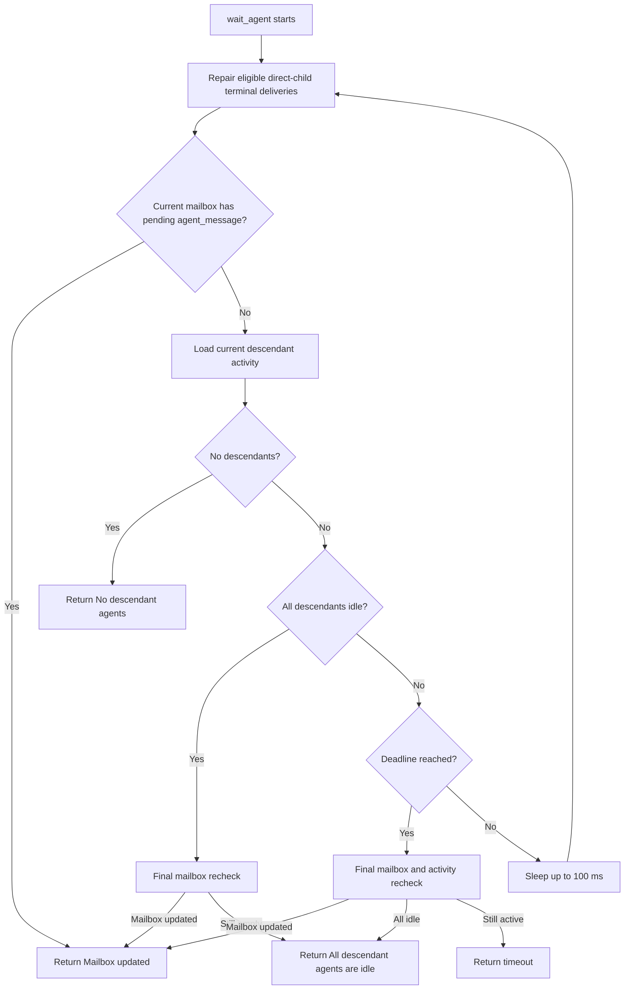
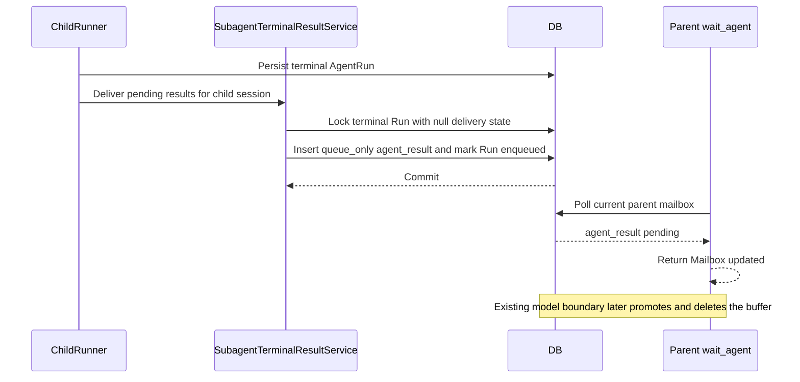

# Subagent Mailbox Activity Wait and Terminal Result Delivery

## Summary

This design implements [ADR-0168](../adr/0168-unify-subagent-communication-through-mailbox-activity.md) by making the current agent's mailbox the model-facing coordination path for both ordinary agent messages and terminal child results.

`wait_agent` becomes a targetless activity wait. Any pending mailbox message for the current `SessionAgent` ends the wait, regardless of sender. If no mailbox input is pending, the wait also ends when every descendant is idle. The tool reports only why the wait ended; it does not consume or repeat message content. Existing model-call boundary preparation promotes the mailbox input after the tool returns.

The existing wake contract remains unchanged:

- `send_message` is queue-only and does not start an idle target turn.
- terminal `agent_result` delivery is queue-only and does not start an idle parent turn.
- `spawn_agent` and `followup_task` retain their current target-session wake behavior.
- broker wake-up envelopes remain payload-free.

The implementation adds explicit scheduling intent to `input_buffers`, durable per-Run terminal delivery markers, a typed mailbox service, and consumption-time observation cursor advancement.

## Related Decisions and Current Specifications

- ADR-0168 defines mailbox activity as the new `wait_agent` coordination path and removes named wait targets.
- ADR-0096 remains authoritative for the `SessionAgent` tree, input-buffer-backed mailbox, context forking, collaboration tool surface, and source-owned wake policy except where ADR-0168 supersedes terminal-result waiting.
- Current behavior is specified in:
  - `docs/azents/spec/domain/conversation.md`
  - `docs/azents/spec/domain/toolkit.md`
  - `docs/azents/spec/flow/agent-execution-loop.md`
  - `docs/azents/spec/flow/chat-session-resync.md`

## Goals

- Let `wait_agent` react to any mailbox message delivered to the current agent.
- Deliver completed, failed, stopped, interrupted, and cancelled child Run results through the direct parent's mailbox.
- Preserve the queue-only behavior of `send_message` and terminal result delivery.
- Preserve the wake behavior of `spawn_agent` and `followup_task`.
- Prevent queue-only mailbox input from keeping a terminal session falsely `running`.
- Prevent duplicate terminal result delivery across retries, worker handover, and recovery.
- Keep Subagent Tree unread state meaningful by acknowledging a result only when the parent actually consumes it as model input.
- Provide an all-descendants-idle fallback when terminal result delivery cannot be completed.

## Non-goals

- Introduce a dedicated mailbox table or independent mailbox state machine.
- Add a new broker message type or wake an idle parent for a child result.
- Return mailbox content directly from `wait_agent`.
- Add sender or target filters back to `wait_agent`.
- Change `send_message`, `spawn_agent`, or `followup_task` wake semantics.
- Make new user input interrupt `wait_agent`; stop and shutdown cancellation continue to use the existing execution controls.
- Add background sweeping infrastructure solely for terminal result delivery.
- Remove `AgentRun.terminal_result_*` or Subagent Tree terminal projections.

## Current Behavior and Constraints

### `wait_agent`

`SubagentToolkit._wait_agent_tool()` currently resolves an optional `agent_name`, reads the latest Run for each selected child, returns unread terminal result text directly, and advances `SessionAgent.parent_observed_run_index` and `parent_observed_event_id` before returning.

This creates a separate communication path from ordinary `agent_message` mailbox input. A child can send an intermediate `send_message`, but a parent blocked in `wait_agent` does not observe it.

### Input buffers and session idle

`InputBufferService.has_pending_session_input_buffers()` treats every pending row equally. `SessionRunner._has_follow_up_work()` and `SessionLifecycle.mark_session_idle()` therefore refuse to close a terminal boundary while any input remains.

That rule is incorrect for queue-only input. A `send_message` or terminal result can remain pending after a Run finishes without being allowed to start another turn. Treating that row as follow-up work leaves the session in a running state with no broker wake-up that can process it.

### Model-call boundary behavior

`RunExecutor.poll_run_inputs()` drains the FIFO input buffer before the next model call. This behavior is useful and remains unchanged: when a later wake-producing input starts a turn, any older queue-only messages are promoted first and are included in the same prepared model context.

### Terminal state

Terminal state is persisted through several execution paths, including normal completion, failed-run finalization, user stop, interruption, cancellation during preparation, and recovery finalization. Those paths converge at `SessionRunner` as `RunExecutionResult.terminal_event_observed`, but the Run may already be terminal before that runner boundary is reached.

A terminal mailbox side effect performed only after terminal persistence therefore needs durable idempotency and recovery behavior.

## Proposed Design

## 1. Targetless `wait_agent`

### Tool schema

Remove `agent_name` from `WaitAgentInput`.

The final model-visible input is:

```json
{
  "timeout_seconds": 30
}
```

- `timeout_seconds` is optional and defaults to 30 seconds.
- Valid values are integers from 0 through 600.
- `0` performs one immediate observation without sleeping.
- Unknown fields, including the removed `agent_name`, fail tool-input validation instead of being silently ignored.

The output shape remains compatible:

```json
{
  "message": "Mailbox updated.",
  "timed_out": false
}
```

`wait_agent` never includes mailbox payload content in the tool result.

### Observation scope

The tool observes:

1. pending `agent_message` input for the current `SessionAgent`'s linked `AgentSession`;
2. the activity state of every descendant under the current `SessionAgent` subtree.

It does not observe siblings, ancestors, or another root tree when evaluating all-idle. Messages from those agents still end the wait if they were validly delivered into the current agent's mailbox.

### Polling algorithm

The initial implementation keeps the existing 100 ms database polling interval and introduces no broker notification.



Mailbox activity has priority over no-descendant, all-idle, and timeout results. A final recheck narrows commit races. If a message commits immediately after the final recheck, it remains durable and is still promoted at the next model boundary, so the race cannot lose content.

### Descendant activity definition

A descendant is active if any of these conditions is true:

- its `AgentSession.run_state` is `running`;
- it has a pending or running `AgentRun`;
- it has pending input whose scheduling mode is `wake_session`.

A terminal descendant with only queue-only mailbox input is idle. Completed descendants remain in the `SessionAgent` tree and count as idle rather than disappearing.

### Wait outcomes

| Condition | `message` | `timed_out` |
| --- | --- | --- |
| Current mailbox has pending input | `Mailbox updated.` | `false` |
| No descendants and mailbox is empty | `No descendant agents to wait for.` | `false` |
| Every descendant is idle | `All descendant agents are idle.` | `false` |
| Deadline expires while descendants remain active | `Wait timed out; active descendants: ...` | `true` |

The active-descendant timeout summary may include canonical paths for diagnosis. It does not imply that only those paths were being observed.

## 2. Explicit Input Scheduling Intent

### Data model

Add a required `scheduling_mode` column to `input_buffers` backed by a PostgreSQL enum:

```text
InputBufferSchedulingMode
- queue_only
- wake_session
```

The value records the source producer's scheduling decision. It does not cause `InputBufferService` to mutate Run state or send broker messages.

All `InputBufferEnqueue` callers must provide the value explicitly. The low-level writer remains responsible only for durable FIFO storage.

### Producer mapping

| Input source | Scheduling mode | Existing wake behavior |
| --- | --- | --- |
| User message | `wake_session` | Preserve current wake |
| Goal continuation | `wake_session` | Preserve current wake |
| Operation/action input | `wake_session` | Preserve current wake |
| `spawn_agent` initial task | `wake_session` | Preserve child wake |
| `followup_task` | `wake_session` | Preserve target wake |
| `send_message` | `queue_only` | No wake |
| terminal `agent_result` | `queue_only` | No wake |

A typed producer method owns this mapping. Callers do not pass a generic `wake=True/False` switch.

### Runner and lifecycle changes

Add separate queries for separate questions:

- `has_pending_session_input_buffers()` — any input exists; used by FIFO preparation and diagnostics.
- `has_pending_wake_session_inputs()` — at least one input can require an idle session turn.
- `has_pending_agent_messages()` — mailbox observation for `wait_agent`.

Use `has_pending_wake_session_inputs()` instead of the any-input query in:

- `SessionRunner._has_follow_up_work()`;
- post-stop wake-up requeue logic;
- the atomic pending-input check inside `SessionLifecycle.mark_session_idle()`.

The lifecycle transaction must still lock the target `AgentSession`, check for active Runs, and check wake-producing input before setting `run_state = idle`. Queue-only rows may remain while the session becomes idle.

### FIFO behavior

FIFO order does not change. If an idle session contains queue-only input and later receives a wake-producing input, the wake starts one Run and `poll_run_inputs()` drains all older and current buffers before the model call. The model therefore sees queued communication before or together with the event that caused the turn.

## 3. Typed Agent Mailbox Service

Move mailbox enqueue behavior out of the toolkit-private `_enqueue_agent_message()` helper into an injected `AgentMailboxService`.

The service exposes operation-specific methods rather than a caller-selected wake flag:

- enqueue spawn assignment;
- enqueue ordinary message;
- enqueue follow-up task;
- enqueue terminal result.

Each method fixes its scheduling mode and database-side Run-state behavior. Broker wake-up remains an after-commit orchestration step for spawn and follow-up operations. Ordinary and terminal messages neither mark the target running nor send a broker signal.

The service also owns shared mailbox invariants:

- source and target belong to the same root `SessionAgent` tree;
- metadata contains canonical source and target IDs and paths;
- message activity timestamps are updated for source and target;
- terminal results target only the source agent's direct parent;
- terminal content is user-safe.

## 4. Terminal `agent_result` Messages

### Message payload

Extend `agent_message` with a tagged terminal result variant:

```text
message_kind = agent_result
source_session_agent_id
source_path
target_session_agent_id
target_path
source_run_id
source_run_index
run_status
source_terminal_result_event_id
content
```

`source_terminal_result_event_id` is nullable because some stop or cancellation paths do not create a dedicated terminal result event.

Instruction messages and result messages should be represented as a closed tagged payload union, or by equivalent validation that requires result-only fields exactly when `message_kind = agent_result`.

### Model-visible envelope

All supported model-input lowerers render the same terminal envelope:

```text
Message Type: AGENT_RESULT
Task name: /root
Sender: /root/reviewer
Run status: completed
Payload:
The review found no blocking issues.
```

The source Run ID and event ID remain durable metadata for idempotency and diagnosis; they do not need to consume model context unless later debugging requirements justify exposing them.

### Status and content mapping

| Run status | Content source |
| --- | --- |
| `completed` | `terminal_result_message`, otherwise a fixed completion-without-message fallback |
| `failed` | sanitized `terminal_result_message`, otherwise a fixed failure fallback |
| `stopped` | sanitized terminal message when present, otherwise `The agent run was stopped.` |
| `interrupted` | sanitized terminal message when present, otherwise `The agent run was interrupted.` |
| `cancelled` | sanitized terminal message when present, otherwise `The agent run was cancelled before completing.` |

Internal exception text, provider credentials, raw stack traces, and retry internals must not enter the mailbox. Existing user-safe terminal projection rules remain the content boundary.

## 5. Durable Delivery and Idempotency

### AgentRun delivery fields

Add these fields to `AgentRun`:

- `parent_result_delivery_state`: nullable enum with `suppressed` and `enqueued`;
- `parent_result_input_buffer_id`: nullable `str(32)`, intentionally not a foreign key because promoted buffers are deleted;
- `parent_result_enqueued_at`: nullable timezone-aware timestamp.

For a non-legacy subagent Run, terminal status plus a null delivery state means delivery is eligible. Root Runs are excluded by joining through `SessionAgent.kind` and never become parent-delivery candidates.

### Transaction

`SubagentTerminalResultService` delivers eligible Runs in Run-index order.

For each Run it performs one transaction:

1. lock the `AgentRun` row;
2. verify that the Run is terminal, belongs to a subagent session, has a direct parent, and has no finalized delivery state;
3. lock the direct parent's `AgentSession`;
4. enqueue one queue-only `agent_result` using idempotency key `agent_result:{run_id}`;
5. update source and target message activity;
6. set delivery state to `enqueued`, save the buffer ID, and save the enqueue timestamp;
7. commit.

The Run lock is the primary concurrency guard. The InputBuffer idempotency key is a secondary guard for retry after a partial application-level attempt. Buffer creation and the durable Run marker commit together.



### Delivery triggers and repair

Attempt delivery at three boundaries:

1. **Normal terminal boundary** — after `RunExecutionResult.terminal_event_observed` and before the child runner decides whether the child can become idle.
2. **Parent wait repair** — before each `wait_agent` mailbox/activity observation, attempt delivery of eligible terminal Runs from the current agent's direct children.
3. **Source-session reuse repair** — before a subagent session starts a later Run, attempt delivery of any older eligible terminal Runs from that source session.

These boundaries repair a worker crash after terminal persistence but before mailbox enqueue without adding a background sweeper.

A delivery failure is recorded with structured Run, source session, and parent identifiers. It does not roll the Run back from terminal state and does not prevent the child session from becoming idle. `wait_agent` can therefore return through the all-idle fallback even when result delivery remains unavailable.

## 6. Observation Cursor and Subagent Tree

Retain `SessionAgent.parent_observed_run_index` and `parent_observed_event_id` during this migration, but redefine acknowledgment:

- `wait_agent` does not advance the cursor.
- Enqueueing `agent_result` does not advance the cursor.
- Promotion of `agent_result` into the parent's durable transcript advances the source child's cursor.

The cursor update occurs in the same transaction that appends or deduplicates the parent `agent_message` event and deletes the source InputBuffer. The update is monotonic: a lower Run index can never replace a higher observed index.

This preserves useful UI semantics:

- terminal result persisted but not delivered: unread;
- result queued in parent mailbox: unread;
- `wait_agent` returned but parent failed before the next model boundary: unread;
- result promoted into parent model input: read.

Input-buffer promotion returns the changed source `SessionAgent` IDs to the execution layer. After commit, the execution layer publishes `SubagentTreeChanged` invalidations so open Subagent Tree views clear unread state without polling.

`AgentRun.terminal_result_event_id` and `terminal_result_message` remain the Subagent Tree result preview and failure lookup projection. They are not deleted or repurposed.

## 7. Failure and Concurrency Behavior

### Message arrives while all-idle is being evaluated

`wait_agent` performs a final mailbox check before returning all-idle or timeout. A later commit is still durable and will be present at the model boundary, so no message is lost.

### Multiple mailbox messages arrive

The tool returns one generic mailbox-updated result. Input preparation drains all FIFO rows. The tool does not need to return sender lists or message counts for correctness.

### Multiple `wait_agent` calls run concurrently

Each call may observe the same pending mailbox row and return. Neither consumes it. The subsequent model boundary remains the single consumption point.

### Terminal delivery retries race

The first transaction holding the Run lock inserts the buffer and marks delivery `enqueued`. Later attempts observe the marker and no-op.

### Result Runs are repaired out of order

Candidate queries order by source session and `run_index`. Cursor updates remain monotonic as a secondary guard. A source session does not run multiple active Runs concurrently.

### Parent is idle

The result remains a queue-only InputBuffer. The parent stays idle and receives no broker wake-up. A later user message, goal continuation, spawn/follow-up operation, or other wake-producing input starts a Run and drains the queued result with the triggering input.

### Parent is executing `wait_agent`

The result commits while the parent Run is active. Polling observes the row, returns from the tool, and the existing model-call boundary promotes the result into the same active Run.

### Parent or tree is deleted

Normal foreign-key ownership removes child sessions with the root lifecycle. Delivery against a missing parent fails without recreating tree state. No cross-root fallback target is selected.

## 8. Database Migration and Rollout

### InputBuffer migration

1. Create the `input_buffer_scheduling_mode` PostgreSQL enum.
2. Add nullable `input_buffers.scheduling_mode`.
3. Backfill existing rows:
   - `agent_message` with `message_kind = send_message` becomes `queue_only`;
   - future `agent_result` rows are not present during migration;
   - `spawn_agent` and `followup_task` become `wake_session`;
   - all other current input kinds become `wake_session`.
4. Set the column `NOT NULL`.
5. Add a composite index supporting session-scoped scheduling checks, for example `(session_id, scheduling_mode)`.

Migration files must be generated through Alembic rather than written manually.

### AgentRun migration

1. Create the parent-result delivery state enum.
2. Add the three nullable delivery fields.
3. Backfill all already-terminal subagent Runs to `suppressed` so deployment does not replay historical results into parent mailboxes.
4. Advance each existing child `SessionAgent` observation cursor to its latest already-terminal Run during the same cutover, preventing a permanently unread legacy badge after direct terminal-result waiting is removed.
5. Leave active and pending subagent Runs with null delivery state so their future terminal transition remains eligible.

### Existing running-session repair

After scheduling backfill, reconcile sessions that are `running` but have no active Run, no pending command, and no `wake_session` input. They may be safely returned to idle even if queue-only input remains. The reconciliation must use the same locked lifecycle predicate as normal idle transition rather than a blind bulk state update racing active workers.

### Exposure order

1. Land scheduling mode and runner/lifecycle classification while preserving the existing tool behavior.
2. Land typed mailbox result payload, delivery fields, and terminal delivery service.
3. Switch cursor acknowledgment to promotion time and publish tree invalidations.
4. Remove `wait_agent.agent_name` and enable mailbox/all-idle waiting.
5. Update deterministic E2E fixtures and living specifications in the same final behavior phase.

No feature flag is required. Incomplete behavior stays unexposed until the tool schema switches in phase 4.

## 9. API, UI, and Prompt Impact

### Model-visible toolkit

- Remove `agent_name` from `wait_agent`.
- Update the tool description to state that it observes any current-agent mailbox update and all descendants.
- Update the subagent system guidance so agents do not attempt targeted waits.
- Add `AGENT_RESULT` to the documented mailbox envelope types.

### REST and generated clients

No public route shape needs to change. Subagent Tree terminal fields and unread boolean remain present. If the shared event payload schema is emitted through OpenAPI, regenerate public clients through the normal OpenAPI client generation workflow; do not edit generated clients manually.

### Chat timeline

`agent_result` uses the existing source-labeled, collapsed internal-agent timeline row. The row may display terminal status as secondary metadata, but a new timeline item family is not required.

### Subagent Tree

Status and terminal preview continue to come from the latest `AgentRun`. The unread badge changes only in acknowledgment timing: it clears when the parent consumes the mailbox event rather than when `wait_agent` returns a result string.

## 10. Security and Privacy

- Resolve every source and target inside one root `SessionAgent` tree.
- Terminal delivery always uses the persisted direct parent relation; callers cannot supply an alternate result recipient.
- `wait_agent` reads only the current AgentSession mailbox and current subtree activity.
- Use only sanitized terminal projection text or fixed status fallbacks.
- Do not include stack traces, internal provider errors, credentials, or unredacted retry metadata in `agent_result`.
- Preserve existing authorization boundaries for child history and Subagent Tree APIs.

## 11. Observability

Add structured logs or metrics for:

- wait outcome: mailbox, no descendants, all idle, timeout;
- wait duration and active descendant count;
- terminal delivery attempted, enqueued, already finalized, suppressed, and failed;
- delivery repair source: terminal boundary, parent wait, or source reuse;
- queue-only rows present during successful idle transition;
- stale running-session reconciliation.

Do not log terminal message content.

## Test Strategy

### Primary E2E verification matrix

| Scenario | Expected product behavior |
| --- | --- |
| Intermediate `send_message` during parent wait | `wait_agent` returns `Mailbox updated.` without message content; the next model input contains the actual message |
| Child completion during parent wait | one `AGENT_RESULT` is delivered; parent continues in the same Run; child unread clears after promotion |
| Two children, non-targeted wait | a message from either child ends the wait because no target filter exists |
| All descendants already idle | wait returns immediately with all-idle and does not time out |
| No descendants | wait returns immediately with the no-descendants summary |
| Wait timeout | active child remains active and the tool returns `timed_out = true` |
| Result delivered to idle parent | parent remains idle and no unsolicited turn starts; a later wake-producing input consumes the queued result |
| Queue-only input on terminal child | child reaches idle instead of remaining falsely running |
| Interrupted child | parent receives an `AGENT_RESULT` with `run_status = interrupted` and safe fallback content |
| Failed child | parent receives sanitized failure content, not internal exception text |

### E2E plan

Extend `testenv/azents/e2e/src/tests/azents/public/test_subagents.py` with deterministic AIMock conversations that explicitly inspect:

- `wait_agent` arguments contain no `agent_name`;
- the wait tool result is a generic activity summary;
- the later parent model request includes the exact `AGENT_RESULT` or ordinary message envelope;
- root and child `run_state` eventually become `idle` when only queue-only input remains;
- Subagent Tree `unread_result` stays true while queued and becomes false after promotion;
- no duplicate result event appears after a retry or later parent turn.

Completed and interrupted behavior should be covered end to end. The full five-status content matrix may use backend integration tests for statuses that are expensive or timing-sensitive to produce through deterministic public APIs.

### Backend unit and integration coverage

- `engine/tools/subagent_test.py`
  - schema rejects `agent_name`;
  - pending mailbox returns immediately;
  - any sender ends wait;
  - no-descendant, all-idle, timeout, and final-recheck branches;
  - wait never advances observation cursors.
- mailbox service tests
  - operation-specific scheduling modes;
  - same-tree and direct-parent validation;
  - no broker or Run-state mutation for ordinary/result messages.
- terminal result service tests
  - all five terminal statuses;
  - sanitized fallback mapping;
  - Run-lock idempotency and concurrent retry;
  - transaction rollback leaves delivery eligible;
  - repair by source session and direct parent.
- `services/input_buffer_test.py`
  - scheduling mode persists and backfills correctly;
  - `agent_result` promotion updates the cursor monotonically;
  - promotion returns tree invalidation IDs;
  - FIFO drains queue-only rows with a later wake-producing row.
- runner and lifecycle tests
  - queue-only rows do not block idle;
  - `wake_session` rows still block idle and preserve wake behavior;
  - stop requeue ignores queue-only-only state;
  - terminal delivery failure does not prevent idle.
- event lowering tests
  - every supported model-input lowerer renders `AGENT_RESULT` consistently;
  - ordinary `NEW_TASK` and `MESSAGE` envelopes do not regress.
- chat service tests
  - unread result remains until promotion and clears afterward;
  - terminal preview fields remain unchanged.
- repository and migration tests
  - scheduling queries use the new mode;
  - historical terminal Runs are suppressed;
  - existing pending input mapping is correct.

### Testenv fixture and seed requirements

Use the existing deterministic dummy-key/AIMock subagent fixture path. Add or update scripted model exchanges only where needed for the new targetless wait and intermediate mailbox message. No direct database writes are permitted in E2E scenarios.

No new external service, OAuth state, runtime-provider credential, or live prerequisite snapshot is required.

### Evidence format

Required evidence includes:

- pytest test names and pass/fail output;
- captured parent and child history payloads showing one terminal result event;
- tool call arguments and generic wait result;
- Subagent Tree snapshots before queueing, after queueing, and after promotion;
- session run-state snapshots proving queue-only idle behavior;
- structured logs for any intentionally injected delivery failure integration test.

### CI execution policy

All deterministic tests belong in the required credential-free E2E lane and normal backend test suite. No `live_external`, `runtime_provider`, or `web_surface` marker is needed unless a later UI-only presentation assertion is added.

Required deterministic tests fail when expected fixtures, result envelopes, cursor transitions, or idle states are missing. There are no optional credential-based cases in the base verification plan, so missing external credentials must not create skips.

## Required Living Spec Updates

Implementation must update these current-behavior documents in the same behavior-changing PR:

- `spec/domain/conversation.md`
  - InputBuffer scheduling mode;
  - `agent_result` payload;
  - delivery marker fields;
  - consumption-time cursor semantics.
- `spec/domain/toolkit.md`
  - targetless `wait_agent` schema and outcomes;
  - unchanged collaboration wake contract.
- `spec/flow/agent-execution-loop.md`
  - terminal delivery and repair boundaries;
  - queue-only idle transition;
  - promotion-time acknowledgment.
- `spec/flow/chat-session-resync.md`
  - terminal mailbox timeline rendering and unread transition.

Run `/spec-review` before the final QA phase.

## Alternatives Considered

### Filter mailbox activity by a selected agent

Rejected by the accepted option A. It would retain target coupling and would not model a single current-agent mailbox.

### Remove `agent_name` but wait only for terminal results

Rejected because intermediate `send_message` communication must also end the wait.

### Wake the parent whenever a child terminates

Rejected because it changes the source-owned wake contract and creates unsolicited parent turns.

### Derive queue-only behavior from `message_kind`

Rejected because runner lifecycle policy would be coupled to mailbox payload variants. A required scheduling mode records the producer decision explicitly and supports future input sources.

### Use only InputBuffer idempotency keys

Rejected because promoted InputBuffer rows are deleted. The same key could later create a new pending row and cause duplicate activity. The durable Run marker is the long-lived delivery boundary.

### Add a dedicated mailbox or outbox table

Deferred because the existing InputBuffer plus AgentRun marker provides the required durability and FIFO behavior. A background outbox becomes justified only if operational evidence shows that the activity-based repair boundaries are insufficient.

### Delete observation cursor fields immediately

Rejected because the Subagent Tree currently uses them for unread projection. Moving acknowledgment to promotion time improves their meaning without forcing a simultaneous public projection redesign.

## Implementation Phases

1. **Scheduling foundation** — schema migration, explicit producer modes, runner/lifecycle idle changes, and regression tests.
2. **Mailbox result delivery** — typed service, `agent_result` payload/lowering, Run delivery markers, normal and repair triggers.
3. **Consumption acknowledgment** — promotion-time cursor update and Subagent Tree invalidation.
4. **Targetless wait** — schema removal, mailbox/all-idle polling, prompt/tool descriptions, and unit tests.
5. **Spec and E2E completion** — living specs, deterministic fixtures, full QA, and migration verification.

The phases may be delivered as stacked PRs, but the model-visible `wait_agent` switch should not land before the scheduling and delivery foundations are available.

## Remaining Risks

- 100 ms database polling scales linearly with concurrent waits. It is acceptable for the first implementation because current `wait_agent` already polls at this interval, but metrics should inform a later event-driven optimization.
- Delivery can remain eligible after repeated database failures until a repair boundary runs. The all-idle fallback prevents the parent from blocking indefinitely, while the Subagent Tree continues to expose the terminal projection.
- Cutover suppresses historical terminal replay. Users retain the terminal result in the Subagent Tree, but old unread results are not injected into future model context.
- The scheduling migration touches every InputBuffer producer. Missing an explicit mode must fail tests or type checking rather than silently defaulting.

## Final Decision

Proceed with targetless option A: any current-agent mailbox input ends `wait_agent`, `agent_name` is removed, and all descendants idle is the non-message fallback. Preserve all existing source-owned wake semantics. Implement terminal result delivery through queue-only `agent_result` input with durable Run-level idempotency, explicit InputBuffer scheduling intent, and promotion-time observation acknowledgment.
