# system Docker Sandbox Provider Design

## Overview

`system-docker` provider is a system-level Docker provider for verifying provider-control runtime lifecycle in NoIntern devserver/testenv standalone mode without K8s. It reconstructs existing direct Docker sandbox backend as provider-control provider implementation, making local Docker container outbound-register to `sandbox-control` with existing `nointern-sandbox-client`.

Source decision: [ADR-0037](../adr/0037-system-docker-sandbox-provider.md)

## Problem

Even when heartbeat/lease/runtime allocation issues occur in production K8s provider, current local environment cannot sufficiently reproduce same provider-control path.

- legacy Docker backend makes worker process directly control Docker.
- fake provider E2E does not verify real container, sandbox-control runtime client, shell/file path.
- devserver standalone mode has no K8s, so provider-control production path is hard to run.

## Goals

- Add `system-docker` provider controller.
- Use provider-control protocol, heartbeat ack, runtime lease, runtime token, sandbox-control readiness path the same as K8s provider.
- Reuse container spec from existing `DockerSessionSandboxClient` as Docker runtime contract.
- Verify provider-control-based sandbox allocation, shell exec, file read/write in testenv/devserver without K8s.
- Enable separating K8s provider implementation problems from provider-control core problems.

## Non-goals

- customer/user-local Docker provider daemon implementation.
- `nointern-sandbox-provider login/start` UX.
- workspace-scoped provider credential, revoke UI, public TLS endpoint.
- Docker isolation hardening/rootless Docker policy for customer machine.
- provider-native hibernate/preserve_home implementation.

## Current State

### direct Docker backend

`DockerSessionSandboxClient` is direct backend for local dev. worker directly creates Docker container and injects sandbox-control env into container.

Main contract:

- container name: `nointern-agent-{runtime_id_prefix}`
- bind mount:
  - `{data_path}/agent-runtimes/{runtime_id}/home-sandbox -> /home/sandbox`
  - `{data_path}/agent-runtimes/{runtime_id}/tmp-agent -> /tmp/agent`
- env:
  - `SANDBOX_CONTROL_ENDPOINT`
  - `SANDBOX_CONTROL_AGENT_RUNTIME_ID`
  - `SANDBOX_CONTROL_AGENT_ID`
  - `SANDBOX_CONTROL_WORKSPACE_ID`
  - `SANDBOX_CONTROL_PROVIDER_ID`
  - `SANDBOX_CONTROL_CONNECTION_ID`
  - `SANDBOX_CONTROL_GENERATION`
  - `SANDBOX_CONTROL_AUTH_TOKEN`

### K8s provider controller

K8s provider controller opens outbound `ConnectProvider` stream through `SandboxProviderControlStreamClient`, and `SandboxProviderControllerService` forwards `allocate/delete/observe` command to K8s backend.

Current service is directly coupled to K8s provider.

## Target State

```mermaid
flowchart LR
    Manager[SessionSandboxManager]
    ProviderClient[ProviderControlSessionSandboxClient]
    Control[SandboxProviderControl service]
    DockerController[system-docker provider controller]
    DockerBackend[DockerSandboxProvider]
    Docker[(Docker daemon)]
    Runtime[agent-runtime container]
    RuntimeClient[nointern-sandbox-client]

    Manager --> ProviderClient
    ProviderClient --> Control
    DockerController -->|ConnectProvider| Control
    Control -->|allocate/delete/observe| DockerController
    DockerController --> DockerBackend
    DockerBackend --> Docker
    Docker --> Runtime
    Runtime --> RuntimeClient
    RuntimeClient -->|Connect| Control
```



## Name and Scope

| Name | Scope | Execution location | Purpose |
|---|---|---|---|
| `system-docker` | system | NoIntern devserver/testenv operator environment | provider-control reproduction without K8s and local dev sandbox |
| customer local Docker provider | workspace | user local machine | register customer compute as NoIntern workspace provider |

`system-docker` is registered as static system provider config. Default provider id is `system-docker`. Even if customer provider later uses user-visible name like `local-docker`, credential scope and provider id namespace must not collide.

## Design Decisions

### 1. provider backend abstraction

Make `SandboxProviderControllerService` receive provider backend protocol instead of direct K8s-only type.

```python
class SandboxProviderBackend(Protocol):
    async def allocate(request_id: str, allocation: RuntimeAllocation) -> tuple[RuntimeOperationResult, RuntimeObservation]: ...
    async def delete(request_id: str, *, agent_runtime_id: str, generation: int) -> tuple[RuntimeOperationResult, RuntimeObservation]: ...
    async def observe(agent_runtime_id: str, *, generation: int) -> RuntimeObservation: ...
```

Both K8s backend and Docker backend implement this protocol.

### 2. Docker provider reuses direct Docker runtime contract

Docker provider keeps mount/env/container labels from `DockerSessionSandboxClient`, but provider id, connection id, generation, and auth token use values received from provider-control allocation.

`preserve_home=true` is rejected in MVP. Host volume preservation in existing direct Docker backend was local-dev side effect, and provider-control persistence contract still uses checkpoint flow as source of truth, same as K8s.

### 3. Separate entrypoint

Separate K8s entrypoint and Docker entrypoint.

- existing: `python/apps/nointern/sandbox_provider_controller.py` → K8s provider controller
- new: `python/apps/nointern/sandbox_docker_provider_controller.py` → system Docker provider controller

Common stream client and service are shared. Docker entrypoint has only Docker-specific settings.

### 4. devserver/testenv integration

testenv standalone path starts following components together.

- sandbox-control
- worker/apiserver
- system Docker provider controller
- Docker daemon prerequisite

static provider config registers `system-docker` as default provider. K8s-related env is unnecessary.

## Data/API Changes

No DB schema change. Use existing models `sandbox_providers` and `sandbox_runtime_leases` as-is.

No Public API change. `SandboxSetting.sandbox_provider_id` already supports provider selection.

## Operations and Failure Modes

| Failure | Expected behavior |
|---|---|
| Docker daemon unavailable | provider controller startup or allocation failure, provider unavailable evidence |
| image missing | attempt Docker image pull; if fails, operation_result failure |
| container exists with mismatched generation/spec | delete/recreate |
| container exits before sandbox-control register | observation failure and manager readiness timeout |
| heartbeat ack timeout | remove provider readiness then reconnect |
| duplicate active lease | need prevent duplicate insert with lease reuse/reconcile path |

## Test Strategy

E2E primary is path that starts actual services and Docker provider controller in testenv/nointern E2E. Unit/integration tests are only supporting verification for provider backend contract and container spec.

### E2E Primary Verification Matrix

| Behavior | Primary verification |
|---|---|
| system Docker provider registers and heartbeats | E2E: confirm `system-docker` active in provider diagnostic evidence |
| allocation creates Docker runtime | E2E: confirm sandbox-control ready after agent runtime allocation |
| shell exec works | E2E: confirm shell output via public chat/tool path or worker command path |
| file read/write works | E2E: confirm file write/read round trip |
| K8s dependency absent | E2E: run standalone path without K8s env/cluster |
| provider-control bug reproduction | E2E: collect heartbeat/lease evidence with actual `SandboxProviderControlStreamClient` + Docker backend |

### Fixture and prerequisite support

- E2E fixture reuses existing testenv workspace/user/agent seed.
- sandbox setting selects `system-docker` provider or configures default provider to resolve to `system-docker`.
- testenv prerequisite checks Docker daemon, agent-runtime image, sandbox-control endpoint, provider-control token.
- If Docker daemon is absent or agent-runtime image cannot be prepared, deterministic CI treats it as fail. This is primary path for provider implementation, not optional/live.
- No external credentials needed. provider-control token and sandbox-control auth secret are generated as testenv fixture secrets, and raw token is not recorded in evidence.

### Evidence format

E2E evidence leaves following read-only snapshots.

- provider diagnostic: provider id, connection id, generation, heartbeat timestamp, capacity.
- lease diagnostic: agent runtime id, provider id, lease state, allocation generation.
- Docker runtime diagnostic: container name, labels, image, running state. Exclude raw env token values.
- sandbox-control readiness: runtime connection generation and ready verdict.
- shell/file result: command output and file round trip assertion.

### CI policy

- deterministic CI runs Docker provider E2E as required on runner with Docker daemon.
- In job without Docker daemon, do not manually skip this E2E; split into separate job so execution condition is explicit.
- production K8s live provider E2E is not acceptance evidence for this feature. Use only as diagnostic comparing K8s provider and system Docker provider.

### Optional/live policy

- customer/user-local Docker provider live scenario is not optional/live target of this feature.
- Verification requiring external public endpoint/TLS/device login is separated into #3906/#3916 follow-up scope.
- If provider-control heartbeat timeout reproduction experiment reproduces in deterministic E2E, treat as fail. If production-only condition, track separately as operational issue with evidence.

### testenv fixture/prerequisite support

system Docker provider verification needs Docker daemon and agent-runtime image, so declare as testenv prerequisite. prerequisite checks following.

- Docker daemon accessibility.
- Whether `nointern-agent-runtime:local` or runtime image built by testenv exists.
- Whether sandbox-control endpoint can be converted to host alias accessible inside Docker container.
- Whether provider-control token, sandbox-control auth secret, static provider config match each other.

This prerequisite is not customer local Docker provider credential snapshot. `system-docker` is system provider, so testenv fixture configures only operator/devserver env.

### fixture/seed requirements

- 1 workspace, 1 user, 1 sandbox-required agent.
- default `SandboxSetting` uses `sandbox_provider_id="system-docker"` or config where static default provider resolves to `system-docker` when default provider is unspecified.
- shell/file smoke creates agent through public API or testenv fixture helper user path without direct DB write.

### credential/prerequisite snapshot requirements

- raw value of provider-control token is not recorded in evidence.
- prerequisite snapshot records only provider id, provider mode, token presence, Docker availability, image tag.
- sandbox-control runtime auth token is injected only into runtime container env, and test evidence leaves only redacted marker.

### Evidence format

E2E evidence leaves following observations.

- provider diagnostic response: provider id, connection id, generation, heartbeat age, capacity.
- runtime lease response: agent runtime id, provider id, lease state, allocation generation.
- Docker container inspect summary: container name, labels, image, running state, redacted env presence.
- sandbox-control command result: shell stdout or file read response.

### CI execution policy

- Run as required E2E on deterministic CI runner where Docker daemon is provided.
- In general CI shard without Docker daemon, prerequisite check returns explicit skip reason.
- unit/static/typecheck always run as required supporting quality gates.

### optional/live skip/fail criteria

- Docker daemon unavailable: skip possible in local developer environment, fail in required Docker E2E shard.
- runtime image missing: fail in shard with image build fixture, skip as prerequisite missing in shard that does not build image.
- provider-control token mismatch: fail in every environment.
- Docker allocation succeeds but sandbox-control register does not: fail. Preserve evidence as core failure for provider-control reproduction goal.

## QA Checklist

### QA-1. system Docker provider registration

#### What to check
In testenv standalone, `system-docker` provider registers to provider-control and remains active.

#### Why it matters
To reproduce and separate provider-control liveness problem without K8s, actual provider controller stream is required.

#### How to check
Start devserver with Docker provider-enabled fixture in `testenv/nointern/e2e` and query provider diagnostic API.

#### Expected result
provider id `system-docker` is active and heartbeat/capacity evidence exists.

#### Execution result
TBD

#### Fixes applied
TBD

### QA-2. Docker runtime allocation and sandbox-control readiness

#### What to check
AgentRuntime allocation creates Docker container through provider-control, and sandbox-control runtime stream becomes ready.

#### Why it matters
Provider-control lifecycle path must work end-to-end, not direct Docker backend.

#### How to check
Create sandbox-required agent in E2E, then after allocation check runtime readiness and Docker container labels.

#### Expected result
container runs with `system-docker` provider id/generation/auth token env and reaches sandbox-control ready state.

#### Execution result
TBD

#### Fixes applied
TBD

### QA-3. Shell and file command round trip

#### What to check
In provider-backed Docker runtime, shell command and file read/write work through existing sandbox-control worker path.

#### Why it matters
Docker provider owns only lifecycle, and command/file plane must reuse existing sandbox-control.

#### How to check
Run shell exec smoke and `/home/sandbox` file write/read round trip in E2E.

#### Expected result
Command result and file content are confirmed by sandbox-control worker response.

#### Execution result
TBD

#### Fixes applied
TBD

### QA-4. Provider-control issue isolation evidence

#### What to check
system Docker provider and K8s provider share same provider-control core, and heartbeat/lease evidence can be collected on Docker path.

#### Why it matters
production K8s provider issue must be separable into provider-control core problem and K8s implementation problem.

#### How to check
Collect heartbeat ack, active provider registry, active lease, runtime observation evidence in E2E.

#### Expected result
Docker provider maintains heartbeat ack and allocation lease stably, and when failure occurs, evidence remains to classify it as core problem rather than K8s provider problem.

#### Execution result
TBD

#### Fixes applied
TBD

## Implementation Scope

1. Introduce provider backend protocol and clean up K8s service adapter.
2. Implement `DockerSandboxProvider`.
3. Add `sandbox_docker_provider_controller.py` entrypoint.
4. Add testenv/devserver static provider config and process startup.
5. Add E2E provider-control Docker scenario.
6. Update `docs/nointern/spec/flow/sandbox-provider-control.md` according to implementation result.

## Alternatives Considered

### Extend fake provider

Rejected because it cannot verify actual Docker lifecycle and sandbox-control runtime client.

### Add diagnostic logs to direct Docker backend

Rejected because it does not pass through provider-control path, so it is insufficient for root cause separation.

### Implement customer local Docker provider first

Rejected because product/security scope is much larger and would delay solving current problem.
