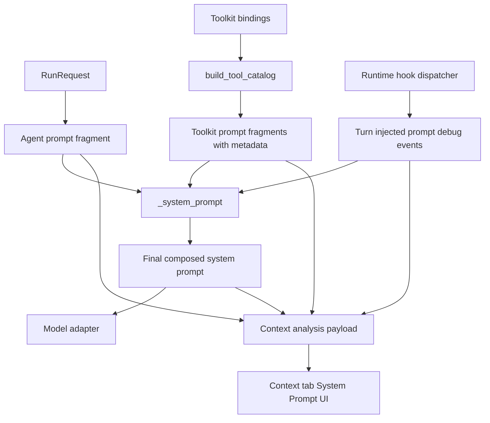

# System Prompt Context Inspector Design

## Overview

Related ADR: [ADR 0055 — System Prompt Context Inspector Fragment Metadata](../adr/0055-system-prompt-context-inspector.md)

Add system prompt analysis screen to Context tab. Instead of viewing one huge complete system prompt on one screen, users browse agent prompt and per-toolkit prompt as list and inspect only necessary items in detail screen.

Goal is to visualize which source fragments compose the system prompt delivered to model in current execution. This feature is foundation for investigating issues such as AGENTS.md inclusion, memory instructions, runtime file guidance, toolkit status prompt, and interface additional prompt. However, first implementation does not diagnose AGENTS.md missing cause or decompose toolkit internal sub-prompts.

## Problem

Current Context tab can show session usage and canonical events, but cannot show system prompt included in model request. Because system prompt is generated transiently during execution, users have difficulty answering following questions.

- Was system prompt configured on Agent actually included in request?
- Was Runtime/Shell toolkit prompt included?
- Were registered Project and project-scoped AGENTS.md included inside toolkit prompt?
- Was Memory prompt included?
- Were connected toolkit prompts such as Kubernetes, GA4, EnvVar included?
- Was prompt added by Turn-start hook mixed into final prompt?
- How long is final system prompt delivered to model?

If existing structure stores or displays only final system prompt string, source information disappears. Conversely, structuring every toolkit internal sub-prompt requires extending `ToolkitState` contract, which is too large for first implementation scope.

## Current System Prompt Sources

### Final assembly path

Final system prompt is assembled by canonical engine adapter by combining following fragments in order.

1. `RunRequest.agent_prompt`
2. `CanonicalToolCatalog.prompt_fragments`
3. injected prompt fragments returned by turn-start hook

Final string is passed to model adapter as `system_prompt`, and LiteLLM Responses lowerer lowers it to top-level instructions in provider request.

### Agent's own prompt

`resolve_invoke_input` family service reads `system_prompt` from Agent row and puts it into `RunRequest.agent_prompt`. Worker appends `additional_system_prompt` from interface message to same field if present. In subagent execution, subagent suffix is appended to subagent agent prompt.

Therefore, UI “Agent prompt” section displays `RunRequest.agent_prompt` unit in first implementation. Separating detailed sources such as Agent row, additional prompt, subagent suffix requires preserving additional source metadata, so it is follow-up scope.

### Per-toolkit prompt

Toolkit prompt actually included in model request is `ToolkitState.prompt` returned by `update_context()` of each resolved toolkit. Provider class `system_prompt` field is toolkit catalog/API display metadata and is not used as actual runtime prompt evidence.

Major runtime prompt producers are as follows.

| Module | Prompt nature |
|---|---|
| BuiltinToolkit in `engine/tools/builtin.py` | memory prompt, root AGENTS.md snapshot |
| RuntimeToolkit in `engine/tools/builtin.py` | runtime files guidance, registered projects, project AGENTS.md, domain config |
| `engine/tools/task.py` | background task guidance |
| `engine/tools/slack.py` | Slack interface/toolkit guidance |
| `engine/tools/discord.py` | Discord interface/toolkit guidance |
| `engine/tools/envvar.py` | runtime shell environment variable guidance |
| `engine/tools/google_analytics.py` | default GA4 property guidance |
| `engine/tools/kubernetes.py` | cluster, mode, denied resource guidance |
| `engine/tools/aws.py` | AWS toolkit loading/error/config prompt |
| `engine/tools/gcp.py` | GCP service loading/config prompt |
| `engine/tools/mcp_base.py` | MCP auth/loading/error prompt |
| `engine/tools/github.py`, `engine/tools/sentry.py`, `engine/tools/notion.py` | MCP-based prompt pass-through or setup prompt |

Multiple sub-prompts can be mixed inside toolkit prompt, but current common contract is single string. First implementation shows merged prompt at toolkit binding level.

### Turn injected prompt

Runtime hook `on_turn_start` can return `TurnInjectedPrompt`. This prompt is included in final system prompt. However, it is not included in primary system prompt navigation and is exposed in debug event list of Context tab. It can already be checked in final prompt detail as combined result.

## Requirements

### REQ-1. System prompt analysis data collection

Runtime must preserve source metadata of prompt fragments before final assembly, without parsing final string.

Related decisions: ADR-0055-D1, ADR-0055-D2

Acceptance criteria:

- agent prompt fragment is included in analysis payload.
- for every non-empty toolkit prompt, toolkit source metadata and content are included in analysis payload.
- turn injected prompt is included in analysis payload or debug event.
- final composed system prompt is included in analysis payload.
- Provider class `system_prompt` metadata is not used as runtime prompt evidence.

### REQ-2. Display toolkit prompt list

System Prompt screen in Context tab must show prompts by toolkit.

Related decisions: ADR-0055-D1, ADR-0055-D3, ADR-0055-D5

Acceptance criteria:

- List item is displayed per toolkit binding that generated prompt.
- List item shows label, source/type, character count, preview.
- Toolkit with empty prompt is hidden from list.
- Toolkit internal sub-prompt is not split into separate item.

### REQ-3. Display agent prompt and final prompt details

User must be able to inspect agent prompt and final assembled system prompt separately in detail screen.

Related decisions: ADR-0055-D1, ADR-0055-D5

Acceptance criteria:

- Agent prompt item displays empty state even when empty.
- Final prompt item displays character count and preview of full assembled result.
- Detail screen provides full prompt text and copy action.

### REQ-4. Turn injected prompt exposed as debug event

Turn injected prompt is collected as part of system prompt, but does not become primary navigation item.

Related decisions: ADR-0055-D4

Acceptance criteria:

- injected prompt is included in final prompt.
- when injected prompt exists, it can be inspected in Context debug event list.
- System Prompt primary navigation does not expose injected prompt section by default.

### REQ-5. Preserve existing Context tab UX for large data display

System prompt screen must not expand all prompt content on one page.

Related decisions: ADR-0055-D5

Acceptance criteria:

- Home screen and list screen are preview-oriented.
- full prompt is shown only in detail view.
- Even with long prompt, top-level Context tab screen does not become excessively long.

## Decision Table

| ADR decision | Requirements |
|---|---|
| ADR-0055-D1 | REQ-1, REQ-2, REQ-3 |
| ADR-0055-D2 | REQ-1 |
| ADR-0055-D3 | REQ-2 |
| ADR-0055-D4 | REQ-4 |
| ADR-0055-D5 | REQ-2, REQ-3, REQ-5 |

## Discussion Points and Decisions

### 1. Collection unit

Options:

- Parse final system prompt string by heading.
- Preserve toolkit prompt metadata at `build_tool_catalog()` stage.
- Extend `ToolkitState` itself to structured prompt parts.

Decision: preserve toolkit prompt metadata at `build_tool_catalog()` stage.

Rationale: final string parsing is fragile, and `ToolkitState` extension is larger than first implementation scope. Current goal is to stably show merged prompt by toolkit, so preserving fragment metadata before assembly is best fit.

Related decision: ADR-0055-D1

### 2. Distinguish Provider `system_prompt` and runtime prompt

Options:

- Include Provider `system_prompt` in analysis screen too.
- Include only actual runtime `ToolkitState.prompt`.

Decision: include only actual runtime `ToolkitState.prompt`.

Rationale: Provider `system_prompt` is exposed through API as toolkit definition metadata, but is not identical to prompt actually included in model request. Analysis tab must show “what was delivered to model”, so only runtime prompt is evidence.

Related decision: ADR-0055-D2

### 3. Decompose toolkit internal sub-prompts

Options:

- Decompose string based on heading.
- Show toolkit-level raw prompt in this scope.
- Extend `ToolkitState` to introduce structured sub-prompt.

Decision: Show toolkit-level raw prompt in this scope.

Rationale: In current common structure, sub-prompt source metadata is already gone. Heading parsing is not stable, and structured sub-prompt is follow-up scope requiring separate design.

Related decision: ADR-0055-D3

### 4. Display location of Turn injected prompt

Options:

- Put it as independent section in System Prompt navigation.
- Include in final prompt but let user inspect it in debug event list.
- Do not expose separately.

Decision: Include in final prompt but let user inspect it in debug event list.

Rationale: Turn injected prompt is part of system prompt, but has different nature from agent/toolkit prompt users primarily navigate. Context tab already has debug event list, so hook-based dynamic injection is simpler to inspect there.

Related decision: ADR-0055-D4

### 5. Long prompt display UX

Options:

- Expand all prompts on one page.
- Show only metadata and preview in list, and full prompt in detail screen.
- Show only preview even in detail screen and provide separate “view full”.

Decision: Show only metadata and preview in list, and full prompt in detail screen.

Rationale: system prompt can be very long. Top-level Context tab screen should act as diagnostic index, and full text inspection should happen in detail view.

Related decision: ADR-0055-D5

## Architecture

## Backend Design

### Prompt fragment metadata

`CanonicalToolCatalog` currently has only `prompt_fragments: list[str]`. Extend it to preserve source metadata.

Conceptual model:

- `PromptFragmentSource`: `agent`, `toolkit`, `turn_injected`, `final`
- `PromptFragment`:
  - `id`
  - `source`
  - `label`
  - `content`
  - `length`
  - `preview`
  - `toolkit_slug` optional
  - `toolkit_type` optional
  - `toolkit_display_name` optional

Existing string list can continue to be used for actual model request assembly. Analysis payload uses fragment including metadata.

### Tool catalog collection

`build_tool_catalog()` collects result of each binding's `toolkit.update_context()`. If prompt is non-empty, use it as model prompt fragment as before, and also create toolkit prompt fragment with binding metadata.

Source metadata candidates:

- `binding.slug`
- `binding.toolkit_type`
- `binding.toolkit.display_name`
- toolkit class name fallback

This change does not change toolkit internal implementation.

### Engine adapter analysis payload creation

`engine_adapter.py` can create following analysis payload immediately before final system prompt assembly.

- agent prompt fragment
- toolkit prompt fragments
- turn injected prompt fragments
- final prompt fragment

Turn injected prompt is included in final prompt, but is not used as primary navigation item. Instead, leave separate event metadata so it can be exposed as prompt injection event in debug event list.

### Storage and delivery method

First implementation should first consider adding system prompt analysis block to existing Context tab data path. Do not create separate persistent table.

Since current system prompt is generated transiently, Context tab needs run-time analysis artifact to accurately reconstruct past run. Therefore, implementation must choose one of following.

- Leave analysis payload durably as run event/debug event.
- Keep it as ephemeral diagnostic visible only in active run/live state and disappearing after refresh.

Recommended option in this design is durable debug event method. Since Context tab's purpose is post-execution root cause analysis, latest run's prompt composition should be inspectable after refresh.

## Frontend Design

### Navigation

Add System Prompt view under Context tab.

Screen structure:

- Context
  - Existing Summary / Breakdown / Raw Events screens
  - System Prompt
    - Agent Prompt
    - Toolkit Prompts
    - Final Prompt
    - Prompt Detail

Keep existing Context tab layout and visual style. Do not expand large text in top-level screen.

### System Prompt home

Home screen shows following cards or list items.

- Agent Prompt
  - empty status
  - character count
  - preview
- Toolkit Prompts
  - count of non-empty toolkit prompts
  - total character count
  - representative preview or “N toolkit prompts” summary
- Final Prompt
  - character count
  - preview

### Toolkit prompt list

Toolkit prompt list displays following per item.

- toolkit display label
- slug/type
- character count
- preview

Selecting item navigates to Prompt Detail.

### Prompt Detail

Detail screen displays following.

- title
- source metadata
- character count
- full prompt text
- copy button

Text should preserve line breaks and be readable close to monospace. Search, section folding, diff are excluded from this scope.

### Debug event list

If Turn injected prompt exists, display it in Context debug event list.

Display example:

- `turn_start_injected_prompt`
- source hook/provider label
- character count
- preview

User can expand event to see content.

## API / Data Contract

Consider adding system prompt analysis block to existing Context response.

Conceptual response:

- `system_prompt`:
  - `agent_prompt`: prompt item or null
  - `toolkit_prompts`: prompt item list
  - `injected_prompts`: prompt item list
  - `final_prompt`: prompt item or null
  - `debug_events`: optional prompt debug events

Common Prompt item fields:

- `id`
- `source`
- `label`
- `content`
- `preview`
- `length`
- `metadata`

Because response can grow large, separate detail endpoint can also be considered. First implementation applies max size limit consistent with current Context tab raw event limit policy.

## Security and Permission

- System prompt can include user input, memory, AGENTS.md, toolkit status messages, so it needs same level permission check as session raw events.
- Do not create new secret masking policy in this scope.
- Only users who can already see canonical/context inspector can see system prompt analysis.
- Apply response size limit and preview truncation.
- Do not expose entire Provider native request or raw credential kwargs.

## Feasibility Verification

| Item | Check | Result |
|---|---|---|
| final assembly point | `engine_adapter._system_prompt()` combines agent/toolkit/injected prompt | possible |
| toolkit prompt source | `build_tool_catalog()` can see binding and `ToolkitState.prompt` together | possible |
| toolkit internal decomposition | current `ToolkitState.prompt` single string, stable decomposition unavailable | excluded from this scope |
| Provider `system_prompt` | exists as API metadata but not runtime evidence | excluded |
| UI large text display | can add drill-down view to Context tab | possible |
| durable analysis | currently transient, storage point for event/artifact needs design | implementation decision needed |

## Test Strategy

Product behavior verification is E2E primary. Unit test, typecheck, lint are supporting verification and are not used alone as QA Checklist PASS evidence.

E2E primary verification matrix:

| Scenario | Verification target | Required |
|---|---|---|
| Session with only Agent prompt | Agent Prompt and Final Prompt display | required |
| Session with runtime toolkit | Shell/runtime prompt shown in Toolkit Prompts | required |
| Session with multiple toolkits | per-toolkit prompt list display | required |
| test hook session with turn injected prompt | Debug event and Final Prompt inclusion | required, test hook needed |
| agent without active session | empty state | required |

E2E plan:

1. Create user, workspace, agent, model config, active session with testenv fixture.
2. Set agent prompt, then complete chat run.
3. Navigate to Context tab System Prompt screen.
4. Verify Agent Prompt, Toolkit Prompt list, Final Prompt detail.
5. Verify shell/runtime prompt appears in toolkit list for agent with runtime toolkit enabled.
6. Create injected prompt with test-only turn-start hook or deterministic fixture and verify debug event list and final prompt inclusion.

Fixture requirements:

- agent fixture configurable with agent prompt
- shell/runtime toolkit enabled agent fixture
- minimal toolkit fixture producing non-empty toolkit prompt
- test-only hook or deterministic runtime hook fixture that emits turn injected prompt

Evidence format:

- E2E execution command
- Context tab screenshot or DOM assertion summary
- partial API response snapshot of system prompt analysis block
- assertion that final prompt includes expected fragment

CI policy:

- deterministic fixture based E2E is required CI target.
- live toolkit prompt verification requiring external credential is separated as optional/live and skipped when credential absent.

## QA Checklist

### QA-1. Agent Prompt display

#### What to check
Agent Prompt item and detail are displayed in System Prompt screen for session with Agent system prompt configured.

#### Why it matters
User must be able to confirm agent-level instruction they configured was included in actual system prompt analysis.

#### How to check
In Azents E2E, create agent with agent prompt, complete chat run, then navigate to Context > System Prompt > Agent Prompt detail.

#### Expected result
Agent Prompt item is non-empty, and full prompt text in detail screen includes configured agent prompt.

#### Execution result
TBD

#### Fixes applied
TBD

### QA-2. Toolkit Prompt list display

#### What to check
For session where Runtime toolkit or other toolkit returns non-empty prompt, per-toolkit items are displayed in Toolkit Prompts list.

#### Why it matters
Users must be able to diagnose inclusion of execution instructions such as AGENTS.md, memory, runtime files, registered projects, and toolkit status prompt at toolkit granularity.

#### How to check
Complete chat run with Shell/runtime toolkit enabled agent fixture and navigate to Context > System Prompt > Toolkit Prompts.

#### Expected result
Runtime/Shell toolkit prompt item is displayed, with label, slug/type, character count, preview. Detail screen displays full prompt.

#### Execution result
TBD

#### Fixes applied
TBD

### QA-3. Final Prompt detail display

#### What to check
Final Prompt detail displays final system prompt combining agent prompt and toolkit prompt.

#### Why it matters
User must be able to inspect both source-specific list and final assembly result.

#### How to check
Create session with both Agent prompt and runtime toolkit prompt and inspect Final Prompt detail.

#### Expected result
Final Prompt detail text includes both agent prompt and content corresponding to toolkit prompt preview.

#### Execution result
TBD

#### Fixes applied
TBD

### QA-4. Turn injected prompt debug event

#### What to check
For session where Turn injected prompt occurs, no separate injected prompt item appears in System Prompt primary navigation, but injected prompt event appears in debug event list.

#### Why it matters
Dynamic hook prompt must be included in final prompt but should not complicate default system prompt browsing UI.

#### How to check
Use test turn-start hook fixture to emit injected prompt and inspect Context debug event list and Final Prompt detail.

#### Expected result
Debug event list has injected prompt event, and Final Prompt detail includes injected prompt content. System Prompt home has no injected prompt primary card.

#### Execution result
TBD

#### Fixes applied
TBD

### QA-5. Empty state

#### What to check
Context tab shows empty state without error for agent/session without system prompt analysis data.

#### Why it matters
Context tab must not break even for new agent or agent before execution.

#### How to check
Navigate to Context > System Prompt for agent without active session or session without system prompt.

#### Expected result
Agent Prompt empty state, Toolkit Prompts empty state, Final Prompt empty state are clearly displayed.

#### Execution result
TBD

#### Fixes applied
TBD

## Implementation Plan

### Phase 1. Backend fragment metadata

- Add toolkit prompt metadata to `CanonicalToolCatalog`.
- Preserve binding metadata and prompt content together in `build_tool_catalog()`.
- Compose agent prompt, toolkit prompt, injected prompt, final prompt as system prompt analysis payload.

### Phase 2. Durable context analysis event

- Leave system prompt analysis payload as durable debug event or context artifact so Context tab can see it after run.
- Decide event type/source so injected prompt can be displayed in debug event list.

### Phase 3. Public API / tRPC integration

- Add system prompt analysis block to existing Context response or add detail endpoint.
- Check whether OpenAPI and generated client update is needed.
- Apply response size limit and preview truncation.

### Phase 4. Frontend UI

- Add System Prompt navigation to Context tab.
- Implement Agent Prompt, Toolkit Prompt list, Final Prompt, Prompt Detail screens.
- Add injected prompt event display to Debug event list.

### Phase 5. E2E verification

- Add deterministic fixture based E2E.
- Fill QA Checklist with execution results.

## Alternatives Considered

### Final string parsing

Rejected reason: cannot reliably restore source metadata and depends on heading wording.

### Introduce ToolkitState structured prompt parts

Rejected reason: suitable long-term but significantly expands first implementation scope. This feature starts by displaying toolkit-level raw prompt.

### Display Turn injected prompt in primary navigation

Rejected reason: it has different nature from agent/toolkit prompt users primarily browse, and Context tab already has debug event list.

### One-page full prompt display

Rejected reason: system prompt can be very long and harms Context tab navigability and performance.
