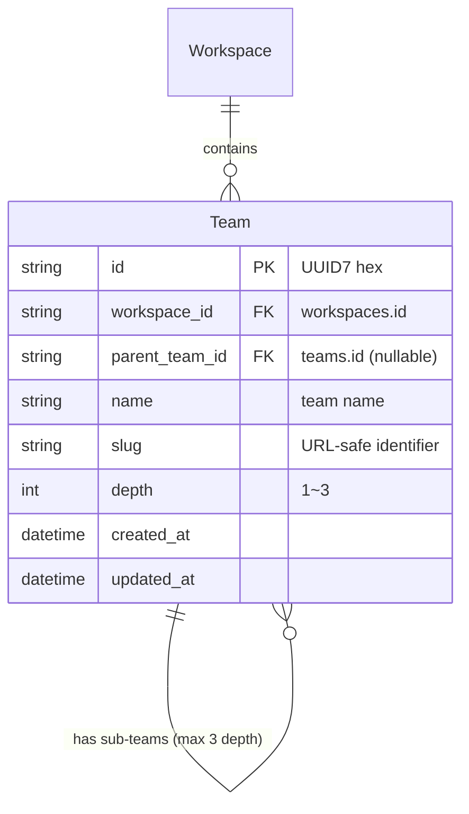
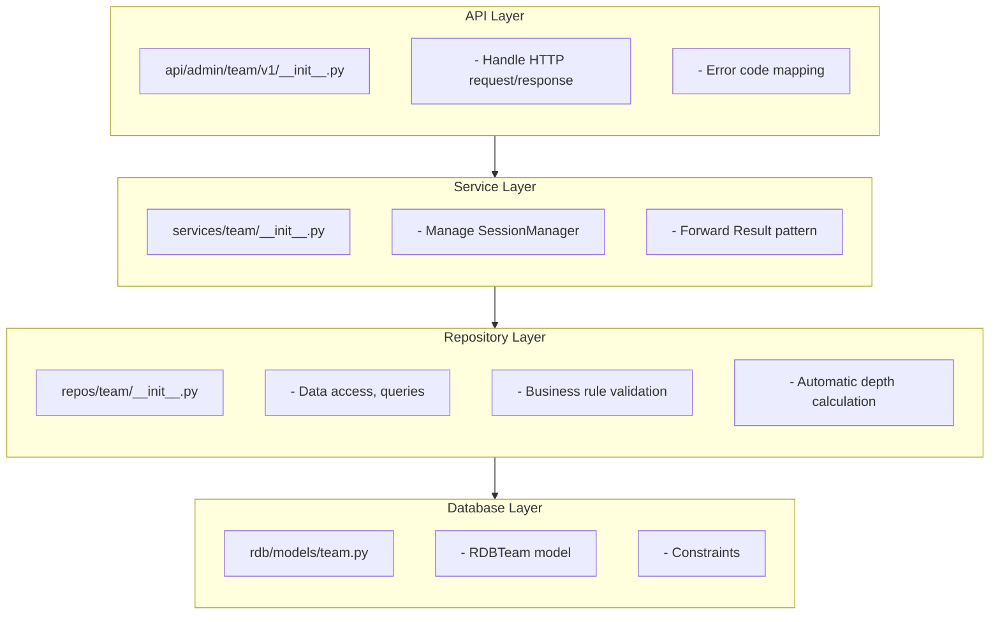
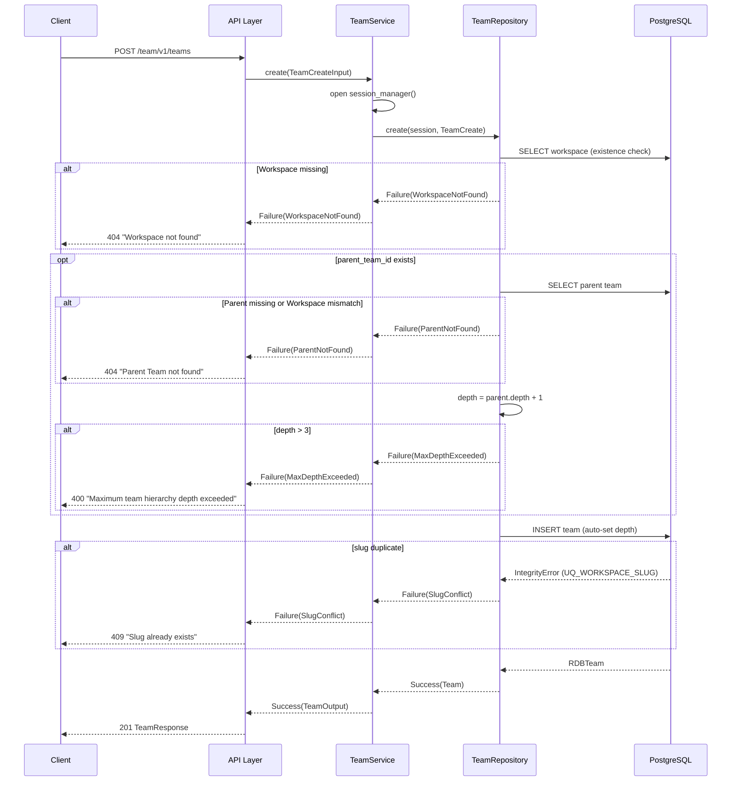

# Team CRUD Design Document

## Overview

This is Team CRUD API for managing hierarchical team structure within Workspace (up to 3 levels). It is implemented based on Team entity definition in [core-concepts.md](../design/core-concepts.md).

## Domain Model

### Team Entity

```python
class Team:
    id: str              # UUID7 hex (32 chars)
    workspace_id: str    # owning Workspace
    parent_team_id: str | None  # parent Team (None means root)
    name: str            # team name
    slug: str            # URL-safe identifier (unique in Workspace)
    depth: int           # hierarchy depth (1~3)
    created_at: datetime
    updated_at: datetime
```

### Hierarchy Structure

```
Workspace
├── Team A (depth 1)
│   ├── Sub-team A-1 (depth 2)
│   │   ├── Sub-sub-team A-1-1 (depth 3, max)
│   │   └── Sub-sub-team A-1-2 (depth 3, max)
│   └── Sub-team A-2 (depth 2)
└── Team B (depth 1)
```

### ER Diagram



## Design Decisions

| Item | Decision | Rationale |
|------|------|------|
| depth calculation | automatically calculated from parent_team_id | Prevent user input errors and ensure consistency |
| slug unique scope | unique within Workspace | Collision needs to be prevented only inside same organization |
| deletion strategy | CASCADE | Prevent child teams from becoming orphaned |
| list query | workspace_id required | Listing all teams is meaningless; Workspace context always needed |
| parent validation | check Workspace match too | Prevent accidental parent assignment to team from another Workspace |

## Architecture

### Layer Structure



### Creation Flow



## API Endpoints

| Method | Path | Description | Response codes |
|--------|------|------|-----------|
| POST | `/team/v1/teams` | Create team | 201, 400, 404, 409 |
| GET | `/team/v1/workspaces/{workspace_id}/teams` | List teams | 200 |
| GET | `/team/v1/teams/{team_id}` | Get single team | 200, 404 |
| PATCH | `/team/v1/teams/{team_id}` | Update | 200, 404, 409 |
| DELETE | `/team/v1/teams/{team_id}` | Delete (CASCADE) | 204 |

### List Query Filters

| Parameter | Type | Required | Description |
|----------|------|------|------|
| workspace_id | path | O | Workspace ID |
| parent_team_id | query | X | Parent Team ID filter |

### Error Response Mapping

| Domain error | HTTP code | Message |
|-------------|-----------|--------|
| `SlugConflict` | 409 | Slug already exists |
| `NotFound` | 404 | Team not found |
| `WorkspaceNotFound` | 404 | Workspace not found |
| `ParentNotFound` | 404 | Parent Team not found |
| `MaxDepthExceeded` | 400 | Maximum team hierarchy depth exceeded |

## DB Schema

### teams table

```sql
CREATE TABLE teams (
    id              VARCHAR(32)  PRIMARY KEY,
    workspace_id    VARCHAR(32)  NOT NULL REFERENCES workspaces(id) ON DELETE CASCADE,
    parent_team_id  VARCHAR(32)  REFERENCES teams(id) ON DELETE CASCADE,
    name            VARCHAR(255) NOT NULL,
    slug            VARCHAR(255) NOT NULL,
    depth           INTEGER      NOT NULL,
    created_at      TIMESTAMP WITH TIME ZONE NOT NULL DEFAULT now(),
    updated_at      TIMESTAMP WITH TIME ZONE NOT NULL DEFAULT now(),

    CONSTRAINT uq_teams_workspace_slug UNIQUE (workspace_id, slug),
    CONSTRAINT chk_teams_depth CHECK (depth >= 1 AND depth <= 3)
);

CREATE INDEX ix_teams_workspace_id ON teams (workspace_id);
CREATE INDEX ix_teams_parent_team_id ON teams (parent_team_id);
```

### Constraints

| Constraint | Name | Description |
|------|------|------|
| UNIQUE | `uq_teams_workspace_slug` | slug uniqueness within Workspace |
| CHECK | `chk_teams_depth` | depth range 1~3 |
| FK CASCADE | `workspace_id → workspaces.id` | delete teams when Workspace is deleted |
| FK CASCADE | `parent_team_id → teams.id` | delete child teams when parent team is deleted |

## File Structure

```
python/apps/nointern/src/nointern/
├── rdb/models/
│   └── team.py                   # RDBTeam model
├── repos/team/
│   ├── __init__.py               # TeamRepository
│   └── data.py                   # Domain model, error types
├── services/team/
│   ├── __init__.py               # TeamService
│   └── data.py                   # Input/Output models
└── api/admin/team/
    ├── __init__.py               # mount
    └── v1/
        ├── __init__.py           # CRUD endpoints
        └── data.py               # Request/Response schemas

db-schemas/rdb/migrations/versions/
└── a1628b972d3b_create_teams_table.py  # migration
```
