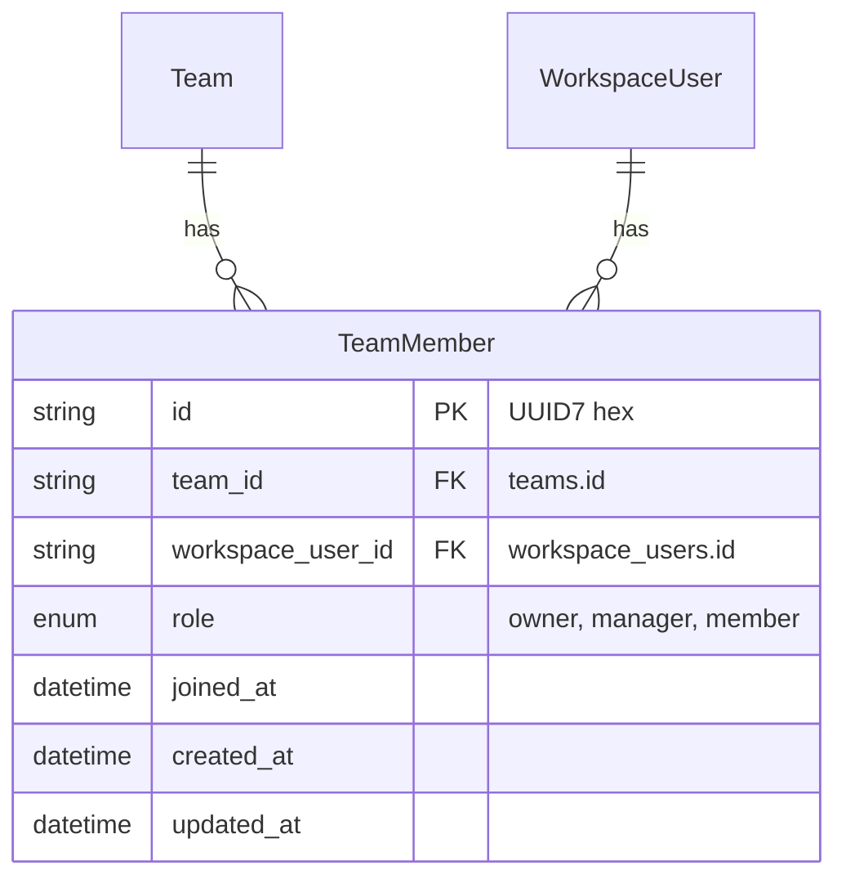

# TeamMember CRUD Design Document

## Overview

This is the TeamMember CRUD Admin API connecting Team and WorkspaceUser. This phase implements TeamMember create/read/update/delete and role enum definition. Detailed permission policy (allowed actions per role) is implemented in a later phase.

> **Note**: Authentication method (`WorkspaceUserIdentity`) is separate from TeamMember. TeamMember handles only membership relationship, not authentication information.

## Domain Model

### TeamMember Entity

```python
class TeamMemberRole(StrEnum):
    OWNER = "owner"
    MANAGER = "manager"
    MEMBER = "member"


class TeamMember:
    id: str              # UUID7 hex (32 chars)
    team_id: str         # Team membership
    workspace_user_id: str  # WorkspaceUser membership
    role: TeamMemberRole # owner | manager | member
    joined_at: datetime
    created_at: datetime
    updated_at: datetime
```

### ER Diagram



## Design Decisions

| Item | Decision | Rationale |
|------|------|------|
| role type | PostgreSQL ENUM (`team_member_role`) | Enforce valid values at DB level |
| role values | `owner`, `manager`, `member` | Reflect requested role system |
| prevent duplicate membership | UNIQUE(team_id, workspace_user_id) | Prevent duplicate joins to same Team |
| referential integrity | FK `team_id`, `workspace_user_id` + CASCADE | Clean up membership when Team/WorkspaceUser is deleted |
| workspace match validation | Team.workspace_id == WorkspaceUser.workspace_id | Prevent cross-workspace membership |
| permission policy | Not implemented | Provide API/schema first; permissions implemented later |

## API Endpoints

| Method | Path | Description | Response codes |
|--------|------|------|-----------|
| POST | `/team-member/v1/team-members` | Create team member | 201, 404, 409 |
| GET | `/team-member/v1/teams/{team_id}/team-members` | List members by team | 200 |
| GET | `/team-member/v1/team-members/{team_member_id}` | Get single member | 200, 404 |
| PATCH | `/team-member/v1/team-members/{team_member_id}` | Update role | 200, 404 |
| DELETE | `/team-member/v1/team-members/{team_member_id}` | Delete | 204 |

### Error Response Mapping

| Domain error | HTTP code | Message |
|-------------|-----------|--------|
| `TeamNotFound` | 404 | Team not found |
| `WorkspaceUserNotFound` | 404 | WorkspaceUser not found |
| `WorkspaceMismatch` | 400 | Team and WorkspaceUser Workspace do not match |
| `DuplicateMember` | 409 | User is already a member of Team |
| `NotFound` | 404 | TeamMember not found |

## DB Schema

```sql
CREATE TYPE team_member_role AS ENUM ('owner', 'manager', 'member');

CREATE TABLE team_members (
    id          VARCHAR(32) PRIMARY KEY,
    team_id     VARCHAR(32) NOT NULL REFERENCES teams(id) ON DELETE CASCADE,
    workspace_user_id VARCHAR(32) NOT NULL REFERENCES workspace_users(id) ON DELETE CASCADE,
    role        team_member_role NOT NULL,
    joined_at   TIMESTAMP WITH TIME ZONE NOT NULL DEFAULT now(),
    created_at  TIMESTAMP WITH TIME ZONE NOT NULL DEFAULT now(),
    updated_at  TIMESTAMP WITH TIME ZONE NOT NULL DEFAULT now(),

    CONSTRAINT uq_team_members_team_workspace_user UNIQUE (team_id, workspace_user_id)
);

CREATE INDEX ix_team_members_team_id ON team_members (team_id);
CREATE INDEX ix_team_members_workspace_user_id ON team_members (workspace_user_id);
```

## Implementation Status (2026-04-20)

- ✅ Repository / Service implemented
- ✅ RDBTeamMember model exists
- ⚠️ REST API endpoints not implemented (add in follow-up Phase if needed)
