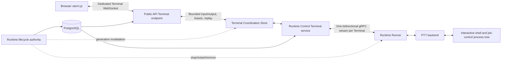
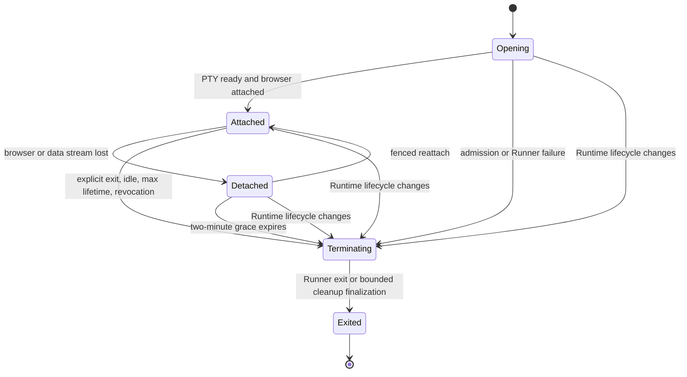

# Interactive Runtime Terminal Design

- Snapshot: `terminal-260901`
- Document reference: `terminal-260901/DESIGN`
- Requirements: [Interactive Runtime Terminal Requirements](../requirements/terminal-260901-interactive-runtime-terminal.md) (`terminal-260901/REQ`)
- Decisions: [Interactive Runtime Terminal ADR](../adr/terminal-260901-interactive-runtime-terminal.md) (`terminal-260901/ADR`)
- Mode: Collaborative
- Decision owner: Requester

## Summary

Azents will add one interactive browser Terminal per Chat Session, backed by the Session Agent's managed Runtime and authoritative Session working folder. Browser traffic uses a dedicated resource-bound WebSocket. Each active Terminal uses a dedicated outbound Runner gRPC stream, while live state, attachment fencing, bounded replay, and backpressure use a Terminal-specific volatile coordination contract with Redis and in-memory implementations.

Terminal policy is independently reducible at Provider infrastructure Profile, Workspace Runtime Profile, and Agent settings levels. The policy is live control-plane authority and never requires Runtime recreation. The existing Agent `shell_enabled` setting is removed independently; managed Runtime capability becomes the sole Agent Runtime Toolkit gate.

Runtime lifecycle remains authoritative. Active or reconnecting Terminals cannot retain, block, delay, or roll back Runtime stop, restart, reset, recreation, repair, or permanent removal. Terminal bytes are never durable product data.

## Current Behavior and Gaps

Current Runtime operations are bounded request/reply operations delivered through one authenticated Runner Control stream. Managed processes use pipes, separate stdout/stderr buffers, Session ownership, process-group termination, idle and maximum lifetime limits, and Runtime/Session quotas. They do not allocate a PTY, preserve one ordered terminal byte stream, expose resize, or support browser attachment and replay.

Current Chat WebSocket traffic is JSON-only and uses a short-lived HMAC ticket, Session access validation, subscription acknowledgement, health checks, and Chat-specific resync. It has no Terminal framing, binary byte flow, rate limits, attachment lease, or long-lived Terminal authorization revalidation.

Current Runtime coordination provides Redis-backed and in-memory request/reply streams, operation metadata, connection generations, bounded metrics, and atomic connection-generation-fenced mutations. Existing operation streams remain TTL-based bounded-operation infrastructure and do not provide Terminal queue capacity, acknowledgement, replay-ring, attachment, or slow-consumer semantics.

Runtime infrastructure Profiles and Workspace Runtime Profiles are versioned rows with strict physical `spec` and `policy` documents. Agents select one Workspace Runtime Profile. There is no first-class Terminal permission or effective Terminal projection. `shell_enabled` remains a cross-cutting Agent field used by Runtime capability resolution, API contracts, generated clients, Web forms, Worker Toolkit binding, transitions, tests, and Specs.

Main Web already owns the Chat/Workspace horizontal split, mobile Runtime drawer, per-Session Chat remount, Runtime lifecycle controls, and WebSocket ticket proxying. xterm.js is not installed. A temporary untracked Storybook harness demonstrates the accepted Terminal visual direction but is not connected to product state.

## Requirement and Decision Traceability

| Requirement | Accepted decisions | Design mechanisms |
| --- | --- | --- |
| `terminal-260901/REQ-1` | D1, D2, D3, D4, D5 | M1, M2, M3, M4, M5, M7 |
| `terminal-260901/REQ-2` | D1, D4, D5, D6 | M6, M7, M8, M12 |
| `terminal-260901/REQ-3` | D1, D5 | M9 |
| `terminal-260901/REQ-4` | D1, D2, D3, D5 | M2, M3, M4, M6 |
| `terminal-260901/REQ-5` | D2, D3, D5, D6 | M1, M3, M4, M6, M12 |
| `terminal-260901/REQ-6` | D1, D4, D6 | M7, M8, M12 |
| `terminal-260901/REQ-7` | D1, D2, D3, D4, D5, D6 | M2, M4, M7, M8, M10 |
| `terminal-260901/REQ-8` | D4, D6 | M7, M11, M12 |
| `terminal-260901/REQ-9` | D1, D2, D3, D5 | M2, M3, M4, M10 |
| `terminal-260901/REQ-10` | D1, D3, D5, D6 | M2, M4, M9, M12 |
| `terminal-260901/REQ-11` | D5, D6 | M6, M8, M12 |

## Architecture

The Public API may run on any replica. Runtime Control may run on another replica. Terminal Coordination is the only cross-replica live-data boundary. PostgreSQL remains authority for user, Session, Agent, Profile, Runtime lifecycle, and current policy. The Runner remains authority for the live PTY process and current operating-system process tree.

## Ownership and Sources of Truth

| Concern | Owner and source of truth |
| --- | --- |
| User and Chat Session access | Existing Chat Session and Agent authorization services in PostgreSQL |
| Runtime existence and lifecycle | Existing Agent Runtime lifecycle state and desired generation |
| Runner authority | Current registered Runner connection generation and configuration evidence |
| Session initial working directory | Current `SessionWorkingFolderBindingService` result using Runner-reported Workspace path |
| Raw Terminal settings | Provider infrastructure Profile row, Workspace Runtime Profile row, and Agent row |
| Effective Terminal permission | Server-side `TerminalPolicyResolver` reading current source rows |
| Terminal identity and lifecycle metadata | Volatile Terminal Coordination record |
| Browser input authority | Current attachment generation in Terminal Coordination |
| Live PTY and process descendants | Runner-local PTY registry and PTY backend |
| Terminal content | Volatile bounded queues only; no PostgreSQL or object-storage transcript |
| Runtime lifecycle priority | Existing Runtime lifecycle service and generation fencing |

## M1. Session Terminal Identity and Cardinality

A Terminal has an independent UUIDv7-compatible identifier and stores its Chat Session, Agent, Runtime, user, desired Runtime generation, Runner connection generation, and Session working-folder authority. The Terminal ID is never derived from the Session ID.

The Terminal service atomically creates or returns the one active Terminal for a Chat Session. A second open attaches to the existing Terminal. Final exit or termination releases the Session singleton so a later open creates a new Terminal. Coordination and protocol collections are keyed by Terminal ID so later named-Terminal support can raise cardinality without replacing ownership or transport contracts.

Admission checks the fixed Session limit of one, user limit of eight, and Runtime limit of sixteen. The Runner repeats the Session and Runtime limits before allocating a PTY so a stale or compromised Control request cannot bypass resource governance.

## M2. Public Terminal API and WebSocket Protocol

### REST projection and ticket

A dedicated Public API router exposes:

- `GET /terminal/v1/workspaces/{handle}/agents/{agent_id}/sessions/{session_id}` — current Terminal availability, Runtime state, effective denial reason, active Terminal summary, and allowed actions;
- `POST /terminal/v1/workspaces/{handle}/agents/{agent_id}/sessions/{session_id}/ticket` — a short-lived resource-bound `open_or_attach` ticket.

The ticket endpoint performs normal user authentication and validates Workspace, Agent, Session, managed Runtime, current Profile chain, effective Terminal policy, Session working-folder eligibility, current Runner readiness, `terminal.v1` support, and quotas. A stopped Runtime returns a typed `runtime_stopped` result and never starts it. Main Web invokes the existing Runtime start action only after the user selects Start, then retries the Terminal projection and ticket.

The Terminal ticket has the current 30-second issuance lifetime, contains or references user ID, authentication Session ID, Workspace ID, Agent ID, Chat Session ID, intent, expiry, and an unpredictable ticket identifier, and is consumable once through the volatile coordination store. It never contains the bearer access token. Normal logs redact the ticket and query string.

### WebSocket endpoint

The browser connects to:

`/terminal/v1/workspaces/{handle}/agents/{agent_id}/sessions/{session_id}/ws`

The endpoint consumes the ticket, revalidates current access and authority, accepts the socket, and waits for a typed `attach` control containing initial columns, rows, and an optional last output sequence. It atomically claims a new attachment generation and returns `accepted` with Terminal identity, lifecycle state, shell label, working-directory display path, replay range, and current Runtime/Runner generation evidence.

Control messages are closed JSON objects limited to 4 KiB. Client controls are `attach`, `resize`, `output_ack`, `heartbeat`, and `terminate`. Server controls are `accepted`, `input_ack`, `replay_begin`, `replay_truncated`, `replay_end`, `status`, `exit`, `revoked`, and `error`. Unknown types, fields, invalid transitions, oversized controls, or stale generations close the socket with a bounded Terminal-specific close code and English reason.

Input and output are binary frames with a fixed version, direction/type byte, unsigned 64-bit sequence, and at most 16 KiB payload. Input sequences are acknowledged only after the current Runner completely writes them to the PTY. The Runner retains the highest completely applied input sequence and any current partial-write offset for the lifetime of the PTY. A duplicate sequence is acknowledged without another PTY write, the next contiguous sequence resumes or starts exactly once, and a sequence gap fails closed. Output acknowledgement is cumulative. Browser code never decodes PTY bytes as JSON or UTF-8 before passing them to xterm.js.

The endpoint revalidates user/Session/Agent/policy/Runtime/Runner authority every five seconds and also reacts to coordination invalidation. The required revocation interval is at most ten seconds. Chat WebSocket code and Chat subscription state are unchanged.

## M3. Terminal-Specific Volatile Coordination

A new `RuntimeTerminalCoordinationStore` Protocol is separate from bounded operation coordination while sharing the deployed Redis client and in-memory dependency pattern. Both implementations must pass one contract test suite.

The store owns:

- one Terminal metadata record with lifecycle, identities, generation evidence, timestamps, deadlines, final reason, byte counters, and content-free diagnostics;
- one Session-active index;
- user and Runtime active-count indexes;
- one current browser attachment generation and heartbeat lease;
- one current Runner stream generation and heartbeat lease;
- a bounded input queue;
- a bounded live unacknowledged output window;
- a bounded replay tail;
- coalesced latest resize state;
- termination and invalidation signals;
- indexes by Agent, Runtime, Provider Profile, Workspace Profile, and user for bounded revocation.

All mutations validate exact Terminal lifecycle plus attachment or Runner stream generation. Redis uses Lua for multi-key fencing and exact transitions. Blocking reads use Redis Streams or equivalent notification keys. The in-memory implementation uses one lock plus `asyncio.Condition` objects and produces the same status taxonomy.

Code-owned initial bounds are:

- binary data chunk: 16 KiB;
- pending browser input: 64 KiB;
- Runner-to-Control unacknowledged output: 256 KiB;
- browser live unacknowledged output: 256 KiB;
- replay tail: 1 MiB represented by at most 64 fixed-size chunks;
- client control rate: 20 messages per second;
- input rate: 256 KiB per second with a 64 KiB burst;
- output rate: 2 MiB per second per Terminal and 16 MiB per second per Runtime.

The Terminal record TTL exceeds the eight-hour lifetime plus cleanup grace. Finalization shortens TTL to retain only bounded content-free final metadata needed for reconnect error reporting; byte queues are deleted at finalization. Redis restart or loss makes active Terminal coordination unavailable and causes streams to close and PTYs to terminate after bounded local grace. It does not affect Runtime or Workspace durable state.

## M4. Attachment, Replay, and Backpressure

One attachment generation owns input, resize, output acknowledgement, and termination. A newly authorized same-user, same-Session connection increments the attachment generation, invalidates the previous socket, and preserves the PTY.

Live output is lossless while the attachment is healthy. Runtime Control appends ordered output to the live window and replay tail. If the live window is full, Control stops acknowledging Runner output. The Terminal gRPC stream applies HTTP/2 backpressure; the Runner then removes the PTY master read callback until capacity returns, allowing the kernel PTY buffer to block the child process rather than consuming unbounded memory.

If an attached browser makes no output-ack progress for 30 seconds, the API relinquishes the attachment and starts the two-minute reattachment grace. While detached, output may fill the live window and then block the PTY. Grace expiry requests termination.

On attach, the API emits `replay_begin`, resets the browser emulator, streams the retained tail, emits `replay_truncated` when the requested history predates the retained minimum, then emits `replay_end`. New input is rejected until replay completes. The replay tail continues to trim old acknowledged output independently of live lossless delivery.

The Runner retains a bounded unacknowledged-to-Control output window. Runtime Control acknowledges a Runner output sequence only after coordination accepts it. If only the dedicated Terminal gRPC stream breaks, the Runner retains the PTY throughout the approved two-minute Terminal data-stream reattachment grace while the Control generation remains current. Each individual connection or health attempt has a 30-second deadline and may retry within that overall grace. Stream registration reports the last Control-acknowledged output sequence and the Runner's highest completely applied input sequence. Control resumes output acknowledgement and resends only contiguous unacknowledged input; the Runner deduplicates or resumes a partial write without executing bytes twice. Control stream replacement or Runtime generation change bypasses the grace and terminates the PTY.

## M5. Runner Terminal Protocol and PTY Backend

A new `runtime_runner_terminal.proto` service defines one bidirectional `ConnectTerminal` RPC. The Runner opens one RPC per active Terminal through an independently pooled authenticated channel. Registration includes Terminal ID, Runtime ID, current Runner connection generation, and stream generation. Runtime Control authenticates the Runner credential and atomically verifies the current Runner and Terminal records before accepting data.

The existing Runner Control protocol adds only bounded metadata messages:

- `RunnerTerminalOpenIntent` with Terminal ID, Session owner, exact working folder, initial size, lifetime deadlines, and a stream nonce;
- `RunnerTerminalTerminateIntent` with Terminal ID and reason.

The Runner advertises `terminal.v1`. It never opens a Terminal stream without a current admitted open intent. Old Servers ignore the capability. New Servers do not send an open intent to a Runner that lacks the capability.

A new PTY execution Protocol is separate from the existing pipe `ExecutionBackend` process handle. It exposes open, ordered byte read, ordered byte write, resize, wait, and complete-descendant terminate. The protocol and shared gRPC messages do not expose POSIX file descriptors, signals, process groups, `/proc`, or shell paths.

### Initial Linux implementation

The Linux backend launches a small Runner-owned child launcher process. The launcher creates a new POSIX session, opens and claims the PTY slave as controlling terminal, duplicates it onto standard input/output/error, changes to the validated Session working folder, applies the Runtime execution environment, and execs `/bin/bash --login`. The master file descriptor is nonblocking and integrated with the asyncio loop. The initial size is applied before shell execution.

The environment sets `TERM=xterm-256color` and preserves a UTF-8 locale. The Runner validates the supplied working folder against its current Workspace root and rejects a stale or outside path; it never substitutes the Workspace root or Provider mount path.

Interactive job control may move child jobs into process groups different from the shell. Termination therefore enumerates every process in the PTY shell's POSIX session, signals each distinct remaining process group with TERM, waits two seconds, signals remaining groups with KILL, waits two seconds, and records whether escalation or timeout occurred. A latest-main scratch probe verified UTF-8, resize, Ctrl-C, shell exit, and session-wide foreground/background cleanup.

## M6. Terminal Lifecycle and Runtime Priority

Lifecycle deadlines are:

- browser and Terminal data-stream reattachment grace: two minutes;
- Terminal data-stream reattachment grace while Control generation is unchanged: two minutes, with a 30-second deadline for each connection or health attempt;
- no input and no output activity: 30 minutes;
- maximum Terminal lifetime: eight hours;
- attachment heartbeat: every 15 seconds with a 45-second lease;
- authorization revalidation: every five seconds;
- TERM grace: two seconds;
- KILL grace: two seconds.

Runner-local timers and Control coordination timers independently enforce idle, maximum lifetime, and generation loss. The first final transition wins and all later frames are stale.

Runtime lifecycle actions do not acquire a Terminal lock and do not wait for output drainage, attachment acknowledgement, replay, grace, or successful PTY cleanup. The lifecycle service advances or clears Runtime authority through its existing transaction and generation rules, then emits best-effort Terminal invalidation. Current Runner connection closure terminates Runner-local PTYs. Provider workload teardown remains the final cleanup boundary if Runner cleanup cannot complete.

Terminal state never calls Runtime auto-start resolution. It uses an exact no-start Runtime target. Stop, restart, reset, recreation, repair, and removal behavior remains owned entirely by the current Runtime lifecycle services.

## M7. Hierarchical Terminal Policy

A generated Alembic migration adds non-null default-true `terminal_enabled` columns to:

- `runtime_infrastructure_profiles`;
- `workspace_runtime_profiles`;
- `agents`.

The values are first-class row fields, not members of physical `spec` or `policy` JSON. Create inputs default to true. Complete Profile replacement requests and Agent patch requests expose the owned value. Existing optimistic Profile versions fence changes. Physical Profile digests and Provider-required capabilities do not include the Terminal flag.

`TerminalPolicyResolver` reads the current Agent, selected Workspace Profile, referenced infrastructure Profile, Provider availability, and current Runner capability in one service-owned boundary. It returns:

- `available`;
- `reason_code`;
- `denied_scope` (`provider_profile`, `workspace_profile`, `agent`, `runtime`, `runner`, `session`, or `access`);
- source IDs and versions for internal fencing;
- user-safe management navigation hints where authorized.

Evaluation order fails closed for missing Agent/Session access, non-managed Runtime, missing or unavailable selected Profile chain, any false flag, inactive Runtime/Runner, stale generation, and missing `terminal.v1` capability. Historical applied configuration is not consulted.

Profile or Agent setting updates compare the previous physical digest. A Terminal-only Profile change increments the optimistic Profile version but does not enqueue physical Runtime reconciliation. After commit, the service publishes a source invalidation through Terminal Coordination. Active endpoints also detect the change through five-second revalidation, bounding revocation even if the notification is lost.

System Admin manages the infrastructure Profile flag, existing Workspace Profile managers manage the Workspace flag, and existing Agent managers manage the Agent flag. Terminal use itself needs only current Session and Agent access.

## M8. Terminal Capability Projection and Explicit Start

The Session Terminal projection distinguishes:

- `absent` — Runtime-free Agent or effective policy denial; no launcher;
- `stopped` — managed Runtime is stopped; launcher opens a stopped state with explicit Start;
- `starting` — existing Runtime lifecycle action is converging;
- `unavailable` — Profile, Provider, Runner capability, generation, or working-folder authority is unavailable;
- `ready` — open or attach is allowed;
- `active` — one Terminal exists and may be attached;
- `ended` — bounded final reason for the most recently visible Terminal.

The projection uses backend-owned action flags. Web does not reconstruct lifecycle state. The Start button calls the existing Runtime start mutation. Merely opening, expanding, focusing, restoring, or requesting a Terminal projection never starts a Runtime.

Policy-denied and Runtime-free Agents expose no Chat Terminal launcher. Management surfaces show the raw setting, effective result, and denial scope to authorized managers. Runner-version incompatibility is represented as `runner_terminal_unsupported` and fails closed.

## M9. Main Web Terminal Experience

Main Web adds `@xterm/xterm` and the fit addon through pnpm lock resolution. `useRuntimeTerminalContainer` owns the Session-scoped projection query, ticket issuance, dedicated WebSocket, terminal lifecycle ADT, connection retries, presentation state, xterm instance, input sequencing, output acknowledgement, resize, and cleanup. Pure components receive normalized state and callbacks.

The xterm instance and WebSocket host remain mounted while presentation changes. Desktop `ChatSessionView` becomes a vertical composition whose upper work area retains the existing horizontal Chat/Workspace split and whose lower row contains the Terminal bar or dock. `Collapsed`, `Docked`, and `Focused` change layout visibility without remounting the terminal host. Dock height uses Mantine local-storage hooks and a bounded vertical resize handle.

Focused desktop hides the Chat/Workspace work area but keeps the existing Session header and a clear return-to-dock action. Explicit Terminate is visually distinct from Collapse or Return. Collapsed state retains connection status, shell label, new-output indicator, and expand control without rendering a transcript outside xterm.

Below the `lg` breakpoint, the Session shows a compact bottom launcher and skips Docked. Focused mobile uses `100dvh`, safe-area padding, a compact Chat return action, explicit Terminate, horizontal software-key row (`Esc`, sticky `Ctrl`, sticky `Alt`, `Tab`, arrows), and a software-keyboard focus control. `ResizeObserver`, viewport, keyboard, and orientation changes call the fit addon and send a coalesced resize control.

The terminal input element remains keyboard and screen-reader reachable. Connection, stopped, starting, reconnecting, exited, revoked, replay-truncated, and error states have localized text. Runtime-free and policy-denied snapshots render the existing Chat layout unchanged.

The temporary visual-review story and temporary scope note are removed after equivalent real-component stories cover collapsed, docked, focused, stopped, reconnecting, replay-truncated, exited, policy-denied, Runtime-free, and mobile states.

## M10. Security, Authorization, and Privacy

Every REST and WebSocket admission validates user, authentication Session, Workspace, Agent, Chat Session, effective Terminal policy, Runtime identity, desired generation, Runner generation, and Session working folder. Ticket expiry, one-time consumption, attachment generation, Runner stream generation, input sequence, output sequence, and lifecycle state prevent replay across authority changes.

The Public API limits connections and rates before allocating a PTY. Binary and control parsers reject oversized, malformed, out-of-order, unknown-version, and stale frames. Resize values have bounded positive row/column limits. Close and error messages are fixed English strings and never echo input, output, environment, command, or path content.

Terminal content is excluded from PostgreSQL, object storage, ordinary logs, traces, Sentry payloads, metrics labels, audit metadata, and Web analytics. Structured lifecycle logs use logger integration only and contain Terminal ID, user ID, Session ID, Agent ID, Runtime ID, generation evidence, action, reason, duration, byte counts, truncation flag, quota outcome, and cleanup outcome. Working-directory paths and environment values are not logged.

Ticket values and WebSocket query parameters are redacted. CORS/origin checks use the configured Main Web origins. The endpoint sends and accepts only the declared WebSocket subprotocol version. Authorization is revalidated during the connection instead of relying on ticket lifetime.

## M11. Remove `shell_enabled`

The final cutover removes `shell_enabled` from:

- Agent RDB model and repository create/update/read contracts;
- Agent service create/update/output and Public API schemas;
- `RuntimeCapabilitySnapshot`, `RuntimeCapabilityDefinition`, and shell-gated catalog branching;
- Worker capability resolver and Runtime Toolkit binding;
- Runtime add/remove/finalizer transitions that set or require the field;
- Main Web Agent forms, settings summaries, schemas, tRPC payloads, stories, and localization;
- OpenAPI documents and generated Python/TypeScript public clients;
- testenv seeds and required E2E fixtures;
- active Living Specs and current tests.

After removal, `RuntimeCapabilityResolver` grants every declared Runtime-dependent capability exactly when the Agent is `managed` and the captured/current capability version matches. Runtime-free or removing Agents receive none. `terminal_enabled` affects only human browser Terminal access and is never read by Worker Toolkit resolution.

A generated Alembic revision drops `agents.shell_enabled`. The historical migration that introduced the column remains unchanged. The downgrade recreates the removed column with `true` because historical per-Agent values are intentionally not retained; rollback across the destructive cutover cannot reconstruct them.

## M12. Migration, Rollout, Rollback, and PR Stack

Implementation follows D6 as five stacked PRs. All five PRs are created before CI monitoring begins.

### PR 1 — Runner PTY and Terminal protocol

- shared Terminal proto and generated Runtime Control client/server code;
- Runner `terminal.v1` capability;
- PTY backend, Terminal registry, per-Terminal gRPC stream, lifecycle timers, session-wide cleanup;
- deterministic Runner/protocol tests;
- no Public Terminal API or Web affordance.

Old Server plus new Runner is safe because the capability is unused and no open intent exists. Rollback removes only unused additive capability.

### PR 2 — Policy, coordination, and Public Terminal backend

- add three default-true Terminal policy columns and management APIs;
- effective policy resolver and projections;
- Redis/in-memory Terminal coordination and parity tests;
- Terminal service, resource-bound ticket, WebSocket, Runtime Control open/terminate intents, and active revocation;
- retain `shell_enabled` temporarily.

New Server plus old Runner reports `runner_terminal_unsupported`. No fallback path exists.

### PR 3 — Main Web Terminal

- regenerate clients from the additive backend contract;
- add xterm.js dependencies and lock resolution;
- real Session Terminal container/components, responsive states, settings controls, localization, and component stories;
- remove the temporary visual-review harness only when equivalent real stories exist.

### PR 4 — `shell_enabled` cutover

- remove the field and all active code/client/Web/test surfaces;
- simplify Runtime capability resolution to managed state plus version;
- generate and apply the drop-column migration and update migration tests;
- regenerate OpenAPI clients in the same PR.

Rollback before the column drop is ordinary application rollback. Rollback after the drop requires migration downgrade, which recreates `shell_enabled=true`; prior values are unrecoverable by design. A forward fix is preferred after production cutover.

### PR 5 — E2E, Specs, and final cleanup

- required API and Web E2E matrix;
- Living Spec updates and spec review;
- Helm timeout/connection documentation and render tests where chart values change;
- removal/absence verification;
- Requirements and Design implementation dates only after complete verified behavior.

No PR is merged without separate explicit requester approval.

## Failure, Retry, and Recovery

| Failure | Required behavior |
| --- | --- |
| Ticket invalid, expired, replayed, or wrong resource | Reject before WebSocket admission; no PTY allocation |
| Runtime stopped | Return explicit stopped state; no auto-start |
| Runner lacks `terminal.v1` | Fail closed with `runner_terminal_unsupported` |
| Browser socket disconnect | Release attachment and start two-minute reattach grace |
| Browser slow consumer | Apply backpressure; detach after 30 seconds without ack progress |
| Terminal gRPC stream disconnect with current Control generation | Preserve the PTY for the two-minute data-stream grace; retry in 30-second attempts and resume from output and highest-applied-input sequence evidence |
| Runner Control disconnect or new Runner generation | Terminate old-generation PTYs and reject all stale frames |
| API replica loss | Browser reconnects through coordination and takes a new attachment generation |
| Runtime Control replica loss | Runner Terminal stream reconnects if Control generation remains; otherwise Runtime Runner reconnect boundary terminates PTY |
| Redis unavailable or state lost | Close Terminal paths and terminate PTY after bounded grace; preserve durable Runtime/Workspace state |
| Policy or access revoked | Reject new work immediately; active Terminal closes within ten seconds |
| Runtime lifecycle begins | Invalidate Terminal and continue Runtime transition without waiting for cleanup |
| PTY shell exits | Finalize with exit code/signal metadata and remove byte queues |
| TERM cleanup incomplete | Escalate complete POSIX session to KILL; report metadata only |
| Terminal output tail trimmed | Send `replay_truncated`; retain live PTY if otherwise healthy |
| Server deployment rolls between protocol versions | Capability and protocol version checks fail closed; no legacy downgrade |

## Observability and Operations

Metrics use bounded labels and no user-provided content:

- active Terminals by lifecycle;
- open, attach, takeover, detach, reattach, exit, terminate, revoke, and reject counts;
- admission rejection by bounded reason;
- input/output bytes and rate-limit rejection;
- live-window and replay-tail utilization;
- backpressure and slow-consumer duration;
- Runner stream reconnect count and duration;
- PTY idle and maximum-lifetime termination;
- cleanup TERM/KILL escalation and timeout;
- policy revocation latency;
- WebSocket and gRPC connection duration.

Structured logs bind Terminal, Session, Agent, Runtime, and generation identifiers once per lifecycle. Content is never logged. Sentry delivery occurs only through the existing logging integration.

Application heartbeat and reconnect behavior do not assume a specific Ingress controller. Helm documentation states that external WebSocket idle timeouts must exceed the heartbeat/lease interval and that proxy buffering must not alter bidirectional WebSocket traffic. Existing arbitrary Ingress annotations remain the operator-specific mechanism unless a controller-neutral chart value is found during implementation.

## Test Strategy

### E2E primary verification matrix

| Surface | Scenario | Required evidence |
| --- | --- | --- |
| Public API + real Docker Runtime | Open PTY in Session working folder | `pwd`, UTF-8 echo, shell PID, exit metadata |
| Public API + real Docker Runtime | Resize and Ctrl-C | `stty size` matches requested rows/columns; foreground sleep interrupted while shell survives |
| Public API + real Docker Runtime | Browser/stream reconnect | same shell PID after reconnect; bounded replay status and ordered output |
| Public API + real Docker Runtime | Runtime lifecycle priority | stop/restart proceeds with active Terminal; old PTY ends; Workspace sentinel persists according to existing lifecycle |
| Public API | Policy hierarchy | each Provider/Workspace/Agent deny blocks open; lower allow cannot override; raw and effective projections are correct |
| Public API | Active revocation | an open Terminal exits within the revocation bound after each policy/access change |
| Public API | Runtime-free Agent | no ticket, no Terminal state, no Runtime auto-start |
| Public API | Runner capability mismatch | old-capability Runner fails closed without PTY allocation |
| Main Web desktop | Collapsed/Docked/Focused | one PTY persists, dock resizes, terminate differs from collapse |
| Main Web reload | Reattach | same active Terminal and shell PID; truncation state is visible when forced |
| Main Web stopped Runtime | Explicit Start | no start before click; connect after lifecycle reaches ready |
| Main Web mobile | Focused-only flow | no Docked state, key accessory, viewport resize, Chat return, terminate |
| Main Web management | Three policy levels | authorized controls, effective denial scope, active launcher removal/revocation |

### E2E plan

The existing `required` Docker Runtime suite gains protocol-level Terminal journeys using the real Public API, Runtime Control, Docker Provider, Runner, and PTY. A typed Python WebSocket client verifies exact bytes and control frames without depending on browser renderer internals.

The existing `web` Runtime capability journey is extended using its product-created Workspace/Profile/Agent and Runtime lifecycle helpers. Selenium interacts with the xterm input textarea through stable accessible selectors and verifies product status, presentation, lifecycle, and policy surfaces. Byte-perfect PTY assertions remain in the protocol E2E; Web E2E proves browser wiring and user-visible flow.

All state is created through Public/Admin APIs or visible UI. Tests never write directly to PostgreSQL. No external credentials or live prerequisite snapshot is required. The existing Docker Runtime Provider, Web TLS gateway, and worktree-built images are sufficient.

### Deterministic lower-level coverage

- PTY backend: UTF-8 split bytes, control sequences, initial and repeated resize, Ctrl-C, EOF, exit, foreground/background process cleanup, TERM/KILL escalation, idle/max timers, quota races, and Runner close.
- Terminal protocol: protobuf conversion, exact generation checks, malformed/oversized frames, stream retry/resume, and capability mismatch.
- Coordination parity: ticket consume, singleton create, quotas, attachment takeover, stale writers, input/output sequences, backpressure, blocking wake-up, replay trim, finalization, expiry, revocation indexes, and Redis/in-memory equivalence.
- Policy: default migration, three-level precedence, missing/disabled/unavailable Profiles, current versus applied authority, Terminal-only no-reconcile updates, and effective reason projection.
- API: access control, explicit stopped response, ticket binding, one-time use, close codes, long-lived revalidation, and rate limits.
- Web: ADT transitions, stable xterm mounting, retry behavior, resize coalescing, software keys, localization parity, and meaningful component stories.
- Removal: static inventory proves no active `shell_enabled` source, API, generated client, Web, seed, test, or Living Spec reference remains outside immutable historical documents and migration history.

### CI policy

Every implementation PR runs its path-selected Python, TypeScript, migration, Docker build, Helm, required E2E, and Web E2E checks. The full stack is created first. CI is then monitored across all PRs with `gh`; failures are fixed on the owning branch and later branches are rebased with the repository stacked-PR script. Optional/live tests are not part of this feature and cannot substitute for required credential-free E2E.

## Removal and Replacement

| Existing unit or behavior | Removal authority | Replacement or remaining authority | Removal boundary | Absence verification |
| --- | --- | --- | --- | --- |
| `agents.shell_enabled` column | `terminal-260901/REQ-8`, D6 | Managed Runtime capability for Agent Runtime Toolkit; independent `terminal_enabled` for browser Terminal | PR 4 generated migration | Schema inspection and migration tests |
| Agent create/update/response `shell_enabled` | `REQ-8`, D6 | No replacement field for Toolkit authority; `terminal_enabled` has distinct semantics | PR 4 API/client cutover | OpenAPI and generated-client grep/tests |
| Runtime capability shell-gated catalog | `REQ-8`, D6 | Managed-state/version resolver | PR 4 | Resolver tests and static absence inventory |
| Worker Runtime Toolkit shell flag | `REQ-8`, D6 | Managed Runtime capability | PR 4 | Root/subagent execution tests |
| Runtime add/remove/finalizer shell mutations | `REQ-8`, D6 | Existing Runtime capability transitions only | PR 4 | Transition/removal tests |
| Main Web Shell switch and summary | `REQ-8`, D6 | No Toolkit switch; separate Terminal switches on approved management surfaces | PR 4 | Component tests, localization parity, generated client build |
| Seeds and fixtures setting `shell_enabled` | `REQ-8`, D6 | Runtime capability/profile creation paths | PR 4/5 | testenv static inventory and E2E |
| Living Specs describing shell gating | `REQ-8`, D6 | Updated managed Runtime Toolkit and independent Terminal policy behavior | PR 5 | `/spec-review` and spec grep |
| Temporary Runtime Terminal visual-review scope note and story | Accepted UI direction, D6 | Real product components and colocated stories | PR 3 or PR 5 after equivalent coverage | Git absence plus Storybook test/build |
| Existing Chat WebSocket Terminal reuse possibility | D1 | Dedicated Terminal WebSocket; Chat remains unchanged | PR 2 | Chat protocol tests and no Terminal frame types in Chat transport |
| Existing operation streams as Terminal transport | D2, D3 | Terminal-specific coordination and gRPC stream | PR 2 | Interface tests and no PTY bytes in operation events |
| Existing pipe process abstraction as PTY implementation | `REQ-1`, D5 | Separate PTY backend; pipe processes remain for Agent tools | PR 1 | PTY tests plus unchanged process operation tests |
| Durable Terminal transcript storage | `REQ-9`, D3 | None; bounded volatile queues and metadata-only logs | All phases | Schema/object-store inventory and log-capture tests |
| Immutable historical Requirements/ADR/Design references to `shell_enabled` | Documentation immutability constraint | Historical records remain unchanged | None | Current Living Specs and active source are clean; historical docs excluded |

## Feasibility Validation

| Requirement | Result | Repository evidence |
| --- | --- | --- |
| REQ-1 | Feasible | Runner workspace, Session working-folder authority, outbound Control connection, and verified Linux PTY primitives exist; new PTY boundary is isolated |
| REQ-2 | Feasible | Existing Runtime projections and explicit Start UI/API already implement no-auto-start behavior |
| REQ-3 | Feasible | `ChatSessionView` owns the complete work area and can retain one mounted Session-scoped host across layout states |
| REQ-4 | Feasible | Current connection generations plus new volatile attachment/stream generations provide exact reattach and invalidation fences |
| REQ-5 | Feasible | Independent Terminal IDs and coordination indexes support one now and multiple later |
| REQ-6 | Feasible | Provider/Workspace/Agent rows and existing management authority/version paths accept first-class default-true settings |
| REQ-7 | Feasible | Current Agent/Session access services can be reused; five-second revalidation and source invalidation meet bounded revocation |
| REQ-8 | Feasible | Active `shell_enabled` inventory is broad but closed; managed capability resolver already centralizes the replacement authority |
| REQ-9 | Feasible | Terminal state can remain in Redis/in-memory and structured logs; no durable content store is required |
| REQ-10 | Feasible | Accepted Storybook exploration, current responsive Chat shell, xterm fit/textarea APIs, and Selenium Web E2E substrate exist |
| REQ-11 | Feasible | Runtime lifecycle already owns desired generation and Runner teardown; Terminal can observe authority without becoming a lifecycle lock |

Overall feasibility: **feasible**. No confirmed Requirement or accepted ADR decision conflicts with the latest `origin/main` implementation. The PTY cleanup probe identified and validated a complete-session Linux cleanup mechanism. Remaining risks are implementation and operational risks, not authority or feasibility blockers.

## Authority Audit

- Every `terminal-260901/REQ-N` has one or more material mechanisms and E2E evidence in this Design.
- Every material mechanism is authorized by a confirmed Requirement, accepted `terminal-260901/ADR-DN`, unchanged current Spec, or repository constraint.
- Terminal policy, Terminal content, Runtime lifecycle, and Agent Runtime Toolkit remain separate authorities.
- No browser, Provider, applied historical Profile, or Terminal record becomes a second Runtime lifecycle authority.
- No durable Terminal content store, legacy `shell_enabled` fallback, Chat protocol extension, or Runtime-start side effect remains.
- Removal obligations identify replacement or intentional absence and a concrete verification boundary.
- Agent-owned local details do not add a new product mode, state authority, compatibility branch, or configuration surface.

Authority audit result: **pass for Design revision 1**.

## Non-Blocking Risks and Assumptions

- `/proc` session enumeration is Linux-specific and can race with process exit or spawn; the backend must rescan during TERM/KILL phases and test PID/session identity before signalling.
- WebSocket behavior depends on external ingress idle timeout and buffering settings; application heartbeat and Helm guidance reduce but cannot control every operator environment.
- Bounded replay can reconstruct only the retained tail, not the exact historical screen. The explicit truncation state is intentional.
- Backpressure can pause a process that writes without reading input. Slow-consumer detachment and reattach expiry bound this state.
- Large Profile fan-out can make immediate invalidation notification expensive. Source indexes plus periodic authorization revalidation bound revocation without durable fan-out operations.
- The Web renderer may not expose terminal text to Selenium. Protocol E2E owns byte correctness; Web E2E uses accessible interaction and lifecycle/status evidence.
- Rollback after dropping `shell_enabled` cannot restore historical false values. This is accepted because the setting is intentionally removed and not migrated.

## Design Authority

- Design revision: `1`

| ID | Material design mechanism | Authority | Classification |
| --- | --- | --- | --- |
| M1 | Independent Session-owned Terminal identity, singleton admission, and future multiple cardinality | `REQ-1`, `REQ-5`; D2, D3, D5 | `derived` |
| M2 | Dedicated resource-bound Public Terminal WebSocket and typed binary/control protocol | `REQ-1`, `REQ-4`, `REQ-7`, `REQ-9`; D1 | `decided` |
| M3 | One outbound Runner gRPC stream per active Terminal | `REQ-1`, `REQ-4`, `REQ-5`; D2 | `decided` |
| M4 | Fenced attachment, lossless live flow, bounded replay, Redis/in-memory parity | `REQ-4`, `REQ-9`; D3; Redis parity constraint | `decided` |
| M5 | OS-neutral PTY contract and Linux interactive shell/session cleanup backend | `REQ-1`, `REQ-11`; D5; Runtime portability constraint | `derived` |
| M6 | Two-minute reattach, slow-consumer, idle/max lifetime, quota, and termination lifecycle | `REQ-4`, `REQ-5`, `REQ-11`; D5 | `decided` |
| M7 | First-class three-level Terminal policy and server effective resolver | `REQ-6`, `REQ-7`, `REQ-8`; D4 | `decided` |
| M8 | Explicit Start projection, no auto-start, fail-closed availability, and Runtime-priority invalidation | `REQ-2`, `REQ-6`, `REQ-11`; D4, D5 | `derived` |
| M9 | Stable mounted desktop/mobile xterm experience and presentation state model | `REQ-3`, `REQ-10`; accepted UI direction | `required` |
| M10 | Content-free security, logging, metrics, rate limits, and bounded revocation | `REQ-7`, `REQ-9`; D1, D3, D5 | `derived` |
| M11 | Complete independent removal of `shell_enabled` and managed-only Runtime Toolkit authority | `REQ-8`; D4, D6 | `decided` |
| M12 | Five-phase additive stacked rollout, fail-closed mixed versions, migrations, and no final fallback | `REQ-6`, `REQ-8`, `REQ-11`; D6 | `decided` |
| M13 | E2E-first verification across protocol, real Docker Runtime, Web, policy, lifecycle, and removal | Every `REQ-N`; project test strategy constraint | `derived` |

## Design Approval

- Mode: `Collaborative`
- Decision owner: Requester
- Approved on: `2026-09-01`
- Approved Design revision: `1`
- Approved authority IDs: `M1`, `M2`, `M3`, `M4`, `M5`, `M6`, `M7`, `M8`, `M9`, `M10`, `M11`, `M12`, `M13`
- Approved scope: One Session-owned interactive browser Terminal per Chat Session with dedicated browser and Runner transports, volatile fenced coordination, bounded replay/backpressure, hierarchical live Terminal policy, Runtime-priority lifecycle, responsive Web UX, complete `shell_enabled` removal, metadata-only observability, and the five-phase fail-closed stacked rollout defined by this Design.

The requester approved Design revision `1` and requested implementation on 2026-09-01.
