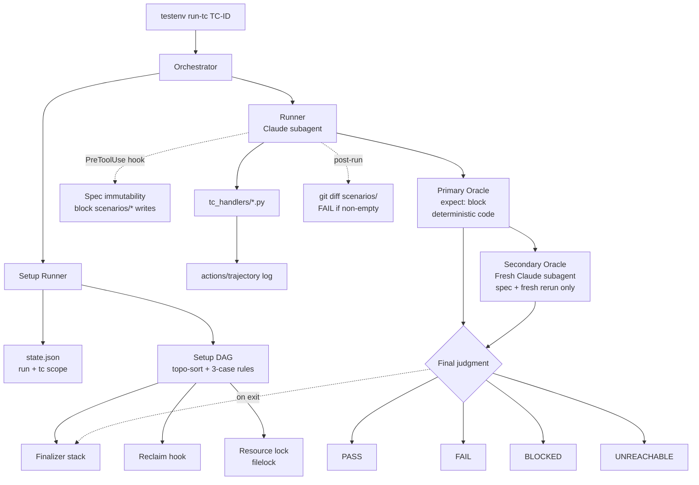

# testenv Framework Redesign

Discussion document: [`docs/nointern/adr/testenv-260414-testenv-runner-redesign.md`](../adr/testenv-260414-testenv-runner-redesign.md)

## Overview

Redesign AI-agent QA platform `testenv/nointern/` to solve **three axes of problems** at once:

1. **Reliability** — block false PASS (frontier LLM reward hacking / spec drift / sycophancy)
2. **Reproducibility** — remove orphans, channel accumulation, token expiration, state contamination
3. **Speed** — target TC 1 from 5-10 min → 1-2 min, full 8 TCs from 2 hours → 30 min

**Core principles**:
- **Oracle separation**: Agent execution, deterministic code judgment
- **Spec immutability**: block TC modification with `PreToolUse` hook
- **Fresh-context Verifier**: separate Claude subagent independently re-verifies
- **4-state terminal**: PASS/FAIL/BLOCKED/UNREACHABLE
- **Stronger Fixture DAG**: remove orphan/race with Finalizer + Reclaim + Lock
- **Run-scope caching + DB template-clone**: remove repeated setup cost
- **Lock-based shard scheduler**: safe parallelism
- **LLM calls default live + only VCR interface prepared** (can switch later, Hardtack decision 2026-04-14)

**Expected quantitative goals**:
- false PASS single-digit % (current perceived 20-40%)
- TC 1 from 5-10 min → 1-2 min
- full 8 TC from 2-3 hours → under 30 min
- human verification intervention from 5 min per TC → 0 min (random sampling only)

## Architecture

### Overall Flow



### Directory Structure

```
testenv/nointern/
├── testenv/                          # new Python package
│   ├── __init__.py
│   ├── cli.py                        # `testenv` CLI entry (Click/Typer)
│   ├── orchestrator.py               # execution orchestration
│   ├── setup_runner.py               # Setup DAG resolver
│   ├── tc_runner.py                  # TC execution
│   ├── verifier.py                   # Fresh-context verifier agent
│   ├── state.py                      # state.json management (run + tc scope)
│   ├── assertions.py                 # expect block execution
│   ├── finalizer.py                  # Teardown stack
│   ├── reclaim.py                    # Orphan cleanup hook
│   ├── lock.py                       # Resource lock (filelock)
│   └── fs_guard.py                   # PreToolUse hook
│
├── setup_handlers/                   # Python code executing Setup
│   ├── test_user_workspace.py
│   ├── agent_dummy_key.py
│   ├── llm_provider_bedrock.py
│   ├── slack_byoa_installation.py
│   ├── slack_platform_installation.py
│   └── ...
│
├── tc_handlers/                      # Python code executing TC
│   ├── tc_int_slack_005.py
│   ├── tc_int_byoa_001.py
│   └── ...
│
├── _helpers/                         # reusable helper library
│   ├── __init__.py
│   ├── slack.py                      # slack_open_im, poll_bot_reply, etc.
│   ├── playwright.py                 # CHROMIUM, stealth, OAuth flow
│   ├── state.py                      # restore_from_state, etc.
│   └── http.py                       # signed event builders, etc.
│
├── setup/                            # existing Markdown + extended frontmatter
├── scenarios/                        # existing Markdown + extended frontmatter
└── recipes/                          # keep existing Markdown
```

### Core Class Design

```python
# testenv/tc_runner.py
@dataclass
class TCSpec:
    id: str
    handler: Path              # tc_handlers/tc_xxx.py
    requires_setup: list[str]
    locks: list[str]
    expect: ExpectBlock        # assertion DSL
    llm_key_required: bool

@dataclass
class TCResult:
    tc_id: str
    state: Literal["PASS", "FAIL", "BLOCKED", "UNREACHABLE"]
    reason: str
    assertions: list[AssertionResult]
    verifier_verdict: VerifierVerdict | None
    artifacts: dict[str, str]  # logs, Slack links, etc.
```

### Execution Flow

```python
def run_tc(tc_id: str) -> TCResult:
    spec = load_tc_spec(tc_id)

    # 1. Acquire locks (if needed)
    with resource_locks(spec.locks):
        # 2. Setup DAG resolve
        setup_result = resolve_and_run_setups(spec.requires_setup)
        if setup_result.state == "BLOCKED":
            return TCResult(tc_id, "BLOCKED", setup_result.reason)

        try:
            # 3. Invoke Runner Claude subagent
            runner_output = run_with_fs_guard(
                handler=spec.handler,
                state_file=state_file,
                blocked_paths=["scenarios/", "setup/", "recipes/"],
            )

            # 4. Primary Oracle — deterministic assertion
            assertion_results = run_expect_block(spec.expect, runner_output)
            if any(a.failed for a in assertion_results):
                return TCResult(tc_id, "FAIL", "assertion failed",
                                assertions=assertion_results)

            # 5. Secondary Oracle — Fresh-context Verifier
            verifier_verdict = run_verifier(
                spec=spec.spec_path,  # original markdown
                fresh_logs=runner_output.logs,
                # intentionally do not pass runner trajectory
            )

            # 6. post-run git diff check
            if has_modified_specs():
                return TCResult(tc_id, "FAIL",
                                "spec files modified — goalpost moving detected")

            # 7. Final judgment
            return finalize_verdict(assertion_results, verifier_verdict)

        finally:
            # 8. Run Finalizer stack in reverse
            run_finalizers(setup_result.finalizers)
```

## Data Model

### Setup Frontmatter (extended)

```yaml
---
id: slack-byoa-installation
summary: Create BYOA Slack App installation
handler: setup_handlers/slack_byoa_installation.py    # new
requires:
  - test-user-workspace
  - agent-dummy-key
provides:
  - byoa.installation_id
  - byoa.slack_app_id
scope: tc                    # new (run | tc)
idempotent: true
verify: |
  python3 -c "..."
reclaim: |                   # new — cleanup real residue even without state
  nointern-db-debug.sh -c "DELETE FROM slack_installations WHERE slack_app_id = '$SHARED_TEST_APP_ID'"
teardown: |                  # new — push to finalizer stack after success
  curl -X DELETE "$NI_URL/.../slack-installations/$INSTALLATION_ID"
locks:                       # new — shared unique resource lock
  - slack-byoa-app
llm_key_required: false
---
```

### TC Frontmatter (extended)

```yaml
---
test_id: TC-INT-BYOA-005
category: integrations
severity: high
handler: tc_handlers/tc_int_byoa_005.py    # new
runner: claude                             # new (claude | direct)
llm_key_required: true
requires_setup:
  - tailscale-funnel-active
  - llm-provider-bedrock
  - agent-with-shell
  - slack-byoa-installation
  - slack-account-session
locks:                                     # new
  - slack-byoa-app
expect:                                    # new — declarative assertion
  bot_reply:
    status: posted
    latency_s: {max: 30}
    text:
      not_contains:
        - AuthenticationError
        - invalid_api_key
        - BoltError
        - "Traceback"
      matches_semantics: "natural language response to DM message"   # for verifier
created: 2026-04-14
title: "BYOA DM message → agent response"
---
```

### state.json Structure (2-tier)

```json
{
  "_meta": {
    "run_id": "2026-04-14/run-abc123",
    "started_at": "2026-04-14T00:00:00Z"
  },
  "run": {
    "user": { "email": "...", "access_token": "..." },
    "ws": { "handle": "ws-xxx", "id": "..." }
  },
  "tc": {
    "TC-INT-BYOA-005": {
      "byoa": { "installation_id": "..." },
      "_finalizers": [
        {"setup_id": "slack-byoa-installation", "registered_at": "..."}
      ]
    }
  }
}
```

## CLI Design

```bash
# Run one TC
uv run testenv run-tc TC-INT-BYOA-005

# Run category batch
uv run testenv run-tcs --category integrations --pattern TC-INT-BYOA-*

# Run Setup only (debugging)
uv run testenv run-setup slack-byoa-installation

# Manually run finalizer of current run (cleanup)
uv run testenv teardown --run-id 2026-04-14/run-abc123

# List TCs
uv run testenv list-tcs --category integrations

# Orphan check + cleanup
uv run testenv reclaim --all
```

## Major Component Details

### 1. Spec Immutability — `fs_guard.py`

Use Claude Agent SDK `PreToolUse` hook:

```python
def fs_guard_hook(tool_name: str, tool_input: dict) -> dict:
    """Block spec file path on write."""
    if tool_name in ("Write", "Edit", "MultiEdit"):
        path = tool_input.get("file_path", "")
        for protected in BLOCKED_PATHS:
            if path.startswith(str(Path("testenv/nointern") / protected)):
                return {
                    "allow": False,
                    "reason": f"Write to spec path {protected} is forbidden. "
                              "Emit BLOCKED if criteria are unreachable."
                }
    return {"allow": True}
```

As post-check, force FAIL if `git diff --name-only scenarios/` is not empty.

### 2. Fresh-context Verifier — `verifier.py`

Implementation strategy: **spawn Claude Code CLI as subprocess** (`claude -p <prompt>` headless mode). Does not separately manage LLM API key and reuses developer's Claude Code authentication (subscription / OAuth / env). New subprocess = new session, so fresh context is automatically guaranteed and runner trajectory is isolated.

```python
# testenv/verifier.py — core structure summary
@dataclass
class ClaudeCodeVerifier(Verifier):
    binary: str = "claude"          # detect from PATH, fallback to NullVerifier if absent
    timeout_s: float = 180.0
    extra_args: list[str] = field(default_factory=list)

    def verify(self, *, tc_id, spec_markdown, fresh_logs) -> VerifierVerdict:
        prompt = PROMPT_TEMPLATE.format(tc_id=tc_id, spec=spec_markdown, logs=fresh_logs)
        proc = subprocess.run(
            [self.binary, "-p", prompt, *self.extra_args],
            capture_output=True, text=True, timeout=self.timeout_s, check=False,
        )
        # non-zero rc / timeout / missing binary → BLOCKED (conservative)
        return parse_verdict_response(proc.stdout)
```

Prompt rules (`PROMPT_TEMPLATE`):

- Does **not see** Runner trajectory — only (1) original TC spec, (2) fresh logs.
- Bot reply containing `AuthenticationError` / `invalid_api_key` / `BoltError` → FAIL
- Server returns 500 + TC expects 200 → FAIL
- Missing prerequisite setup → BLOCKED
- TC spec contradicts environment (OAuth impossible, etc.) → UNREACHABLE
- Suspected spec drift → FAIL — criteria modification is never accepted.
- Response format: single-line JSON `{"state": "...", "reason": "..."}`.

**Environment variables** (all optional):

| Variable | Meaning | Default |
|---|---|---|
| `TESTENV_VERIFIER_DISABLED=1` | Disable Verifier and use `NullVerifier` | - |
| `TESTENV_VERIFIER_CLAUDE_BIN` | claude binary path | `claude` (PATH detection) |
| `TESTENV_VERIFIER_MODEL` | model override (passed through to claude CLI) | (CLI default) |
| `TESTENV_VERIFIER_TIMEOUT_S` | wall-clock limit (seconds) | 180 |

**Fallback**: If `claude` binary is not in PATH or `TESTENV_VERIFIER_DISABLED=1`, fallback to `NullVerifier` — secondary oracle is disabled, but primary oracle (pydantic expect block) still blocks significant spec drift. CI environment must install `claude` binary to enable secondary oracle.

### 3. Assertion DSL — `assertions.py`

```python
@dataclass
class ExpectBlock:
    http_status: int | None = None
    response_body: ResponseBodyExpect | None = None
    bot_reply: BotReplyExpect | None = None
    # ... extend as needed

@dataclass
class BotReplyExpect:
    status: Literal["posted", "not_posted"] = "posted"
    latency_s: LatencyRange | None = None
    text: TextExpect | None = None

@dataclass
class TextExpect:
    contains: list[str] | None = None
    not_contains: list[str] | None = None   # key false PASS prevention means
    matches_regex: str | None = None
    matches_semantics: str | None = None    # passed to LLM verifier
    min_length: int | None = None
```

### 4. Finalizer + Reclaim — `finalizer.py`, `reclaim.py`

```python
# Push teardown into state on Setup success
def register_teardown(state: State, setup_id: str, teardown_cmd: str):
    state.push_finalizer(setup_id, teardown_cmd)
    state.save()

# Run in reverse order on Run exit (success/failure/crash independent)
def run_finalizers(state: State):
    for setup_id, cmd in reversed(state.finalizers):
        try:
            run_shell(cmd, check=False, timeout=60)
        except Exception as e:
            logger.warning("finalizer failed", setup_id=setup_id, error=e)

# Reclaim — when reality residue exists but state does not
def try_reclaim(setup: Setup, state: State) -> bool:
    if state.has(setup.provides):
        return False  # state-based, already owned
    if not setup.reclaim_cmd:
        return False
    run_shell(setup.reclaim_cmd, check=False)
    return True
```

### 5. Resource Lock — `lock.py`

```python
# testenv/lock.py
from filelock import FileLock

LOCK_DIR = Path(os.environ["TESTENV_RUN_ROOT"]) / "locks"

@contextmanager
def resource_locks(tags: list[str], timeout: int = 300):
    """Acquire multiple tags in stable order. sorted to prevent deadlock."""
    LOCK_DIR.mkdir(parents=True, exist_ok=True)
    locks = [FileLock(str(LOCK_DIR / f"{t}.lock"), timeout=timeout)
             for t in sorted(tags)]
    acquired = []
    try:
        for lk in locks:
            lk.acquire()
            acquired.append(lk)
        yield
    finally:
        for lk in reversed(acquired):
            lk.release()
```

## Feasibility Verification

| Item | Status | Note |
|---|---|---|
| Claude Agent SDK `PreToolUse` hook | ✅ officially supported | [docs](https://code.claude.com/docs/en/agent-sdk/hooks) |
| Fresh subagent without parent context | ✅ officially supported | Claude Code subagent already works that way |
| `filelock` Python lib | ✅ PyPI standard | verified in pytest-xdist |
| 3rd party such as `RuleBasedStateMachine` | ❌ unnecessary | self-implementation |
| Markdown frontmatter parsing (YAML) | ✅ pyyaml | already in use |
| Click / Typer CLI | ✅ both standard | choose Typer (type hint based) |
| Slack `apps.uninstall` / `auth.revoke` | ✅ official API | token needed |
| pgtestdb pattern (DB cloning) | ⏳ separate issue | outside this redesign scope |

### Risks

| Risk | Mitigation |
|---|---|
| Verifier agent has same bias as runner | separate system prompt + role persona, do not pass conversation log |
| PreToolUse hook bypassed | double defense with post-run `git diff` check |
| Finalizer not run on run crash | manual `testenv teardown` CLI + periodic `testenv reclaim` |
| filelock remains after crash | due to TTL / fcntl advisory lock characteristics, released when process dies |

## testenv QA Scenarios

Meta QA: how to verify new framework itself.

### Scenario 1: Prove false PASS blocking

```
1. Run runner intentionally manipulated to "PASS even with LLM error response"
2. Runner subagent tries to edit TC → PreToolUse hook blocks → error
3. Runner subagent tries bypass with "dummy key used" → bot response contains AuthenticationError → FAIL in primary assertion (not_contains)
4. Verifier reaches same conclusion
```

### Scenario 2: Normal TC execution

```
1. Run `testenv run-tc TC-INT-BYOA-005`
2. Setup DAG resolve (acquire lock → run setup chain)
3. Runner subagent collects actual Slack DM + LLM response
4. Assertion PASS → Verifier PASS → final PASS
5. Run Finalizer in reverse order (BYOA uninstall + cookie revoke)
6. Clean up state.json
```

### Scenario 3: Orphan reclaim

```
1. Previous run crashed without finalizer and BYOA installation remains in DB
2. New run starts
3. `slack-byoa-installation` setup verify fails (no state)
4. Run Reclaim cmd → delete remaining installation
5. Create again → success
```

### Scenario 4: Parallel race

```
1. Run TC-INT-BYOA-004, 005 (both locks: [slack-byoa-app]) in parallel
2. 004 acquires lock first → 005 waits
3. 004 completes + finalizer runs → lock release
4. 005 acquires lock → runs normally
```

## testenv Impact

| Item | Impact |
|---|---|
| existing setup/TC markdown | all need migration to new frontmatter |
| existing runner scripts (scripts/run-tc-int-*.py) | move to `tc_handlers/` + remove boilerplate with `_helpers/` import |
| existing recipe | can be imported as actual `_helpers/` implementation. recipe markdown remains documentation |
| docker-compose | no change |
| preflight.py | no change (complementary) |
| testenv usage docs (CLAUDE.md, AGENTS.md) | need update with new rules |

## Implementation Plan

### Phase 1: Core framework
- `testenv/` Python package skeleton
- `setup_runner.py`, `tc_runner.py`, `state.py`, `assertions.py`, `finalizer.py`, `reclaim.py`, `lock.py`, `fs_guard.py`, `verifier.py`
- `testenv` CLI entry (Typer)

### Phase 2: `_helpers/` implementation (parallel)
- `_helpers/slack.py` (recipe based)
- `_helpers/playwright.py` (stealth + OAuth)
- `_helpers/state.py`, `_helpers/http.py`

### Phase 3: Migration (subagent parallel)

**Scope**: every setup + every scenario category in `testenv/nointern/`.

TC count by category:
- `admin-api/` — 1
- `agent-crud/` — 1
- `browser/` — 5
- `chat-streaming/` — 2
- `integrations/` — 20 (Slack 12 + BYOA 8)
- `mcp-toolkit/` — 2
- `sandbox-isolation/` — 3
- `shell-tool/` — 2
- `workspace-crud/` — 1

Total migration of ~37 TCs + 14 setups.

Subagent assignment by category:
- One subagent per category (9 parallel)
- extend frontmatter (`handler:`, `expect:`, `locks:`, etc.)
- keep existing markdown body, extract execution code to `tc_handlers/<category>/<tc_id>.py`
- extract 14 setups to `setup_handlers/<setup_id>.py`

### Phase 4: Meta QA
- Verify 4 scenarios above
- Attempt false PASS reproduction + confirm blocking

### Phase 5: Full TC re-verification
- Run all ~37 nointern TCs with new framework
- Attempt false PASS reproduction + confirm blocking
- Confirm no regression for previously passing TCs
- Prepare BYOA restoration work

## Alternatives Considered

| Alternative | Rejection reason |
|---|---|
| replace everything with pytest | loses agent-as-runner advantage, test_id concept disappears |
| TC markdown format → YAML only | lower human readability, harder review |
| Single runner (no verifier) | LLM monitor alone 42-65% → insufficient |
| Keep binary PASS/FAIL | no abort option → cheating remains 54% |
| Reclaim only without Finalizer | orphan remains until next run, 404 in parallel run |
| Create per-TC Slack app | Slack rate limit + admin API burden, unrealistic |
| Mock Slack API | cannot test webhook signature verification path |
