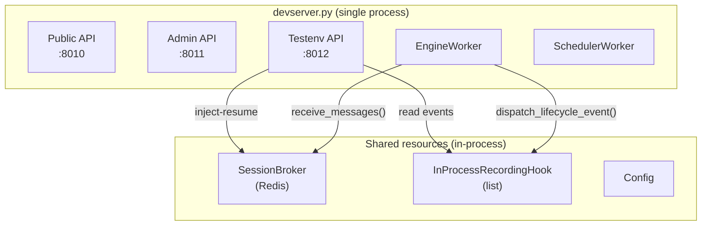
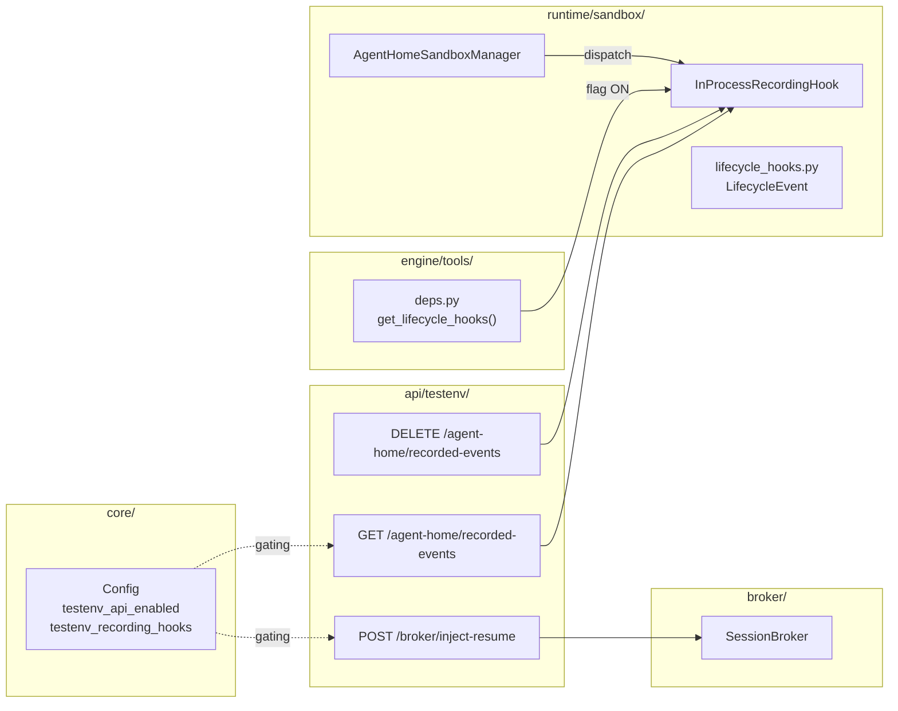

# Testenv Devtools Extension — Upgrade TC-LCY-002/003/004 to Live

> Parent issue: #2623
> Prerequisite: #2609 (Phase 1 — Activity Tracking + Lifecycle Hook)
> Prior QA: #2614 (Phase 1 testenv QA — closed 3 TCs as audit-only)

## 1. Overview

In Phase 1 (#2609) testenv QA, three scenarios TC-LCY-002 / 003 / 004 were closed as **audit-only PASS**. Their blockers:

| TC | Blocker | Resolution |
|---|---|---|
| TC-LCY-002 | No path to externally inject `SessionMessageKind.RESUME` into broker | Testenv API: broker inject endpoint |
| TC-LCY-003 | Cannot backdate `last_activity_at` + trigger cleanup | Minimize idle timeout / cleanup interval with config override + wait real time |
| TC-LCY-004 | Cannot inject recording hook with `get_lifecycle_hooks` DI override | Testenv API: recording hook flag + event query endpoint |

### Design Principles (reflecting feedback)

1. **Complete separation from Admin API** — run separate testenv-only API server on separate port (:8012). Keep Admin API only for CRUD management tools.
2. **No DB write API** — testenv API does not provide path that directly manipulates DB. All state changes pass through actual system paths (broker → engine, config override → real time passing). Structurally prevents LLM from cheating to pass tests.
3. **Observation-only read** — recording hook only accumulates events in process and does not change system behavior. Query endpoint is read-only.

## 2. Architecture

### 2.1 Process Model

devserver runs Public API + Admin API + Engine Worker in single process (`cli/devserver.py`). Add Testenv API server as third uvicorn.



**Core**: Because it is single process, testenv API → broker send → engine receive shares same Redis. In-process list of Recording hook is also same instance referenced by engine and testenv API.

### 2.2 Component Placement



## 3. Part A — Broker RESUME Inject (TC-LCY-002)

### 3.1 Endpoint

```
POST /broker/inject-resume
Content-Type: application/json

{
  "session_id": "abc123",
  "agent_id": "agent-xyz"
}
```

Response: `200 OK` `{"ok": true}`

### 3.2 Implementation

```python
@router.post("/broker/inject-resume")
async def inject_resume(
    body: InjectResumeRequest,
    broker: Annotated[SessionBroker, Depends(get_broker)],
) -> InjectResumeResponse:
    message = SessionMessage(
        agent_id=body.agent_id,
        session_id=body.session_id,
        messages=[],
        user_id=None,
        additional_system_prompt=None,
        interface=None,
        workspace_id=None,
        workspace_handle=None,
        kind=SessionMessageKind.RESUME,
    )
    await broker.send_message(message)
    return InjectResumeResponse(ok=True)
```

**Path**: actual Redis LIST → EngineWorker.receive_messages() → activity tracking branch → because `kind != RESUME`, `touch_last_activity_at` is not called.
**No cheating**: this endpoint does not touch DB directly and passes through actual engine pipeline.

### 3.3 DI: broker access

devserver creates DI container with `run_with_container(config)` and resolves worker with `container.solve(get_engine_worker)`. When creating Testenv API app, resolve and inject broker dependency from same container.

## 4. Part B — Idle Cleanup Config Override (TC-LCY-003)

### 4.1 Strategy to avoid DB write without changes

Verification goal of TC-LCY-003: "Is agent home actually deleted after idle timeout?"

Instead of original approach (DB backdate):
1. Set idle threshold to 5 seconds with `NI_AGENT_HOME_IDLE_TIMEOUT_SECS=5`.
2. Promote cleanup loop interval (`_CLEANUP_INTERVAL_SECS`) to config and set to 2 seconds.
3. TC handler: create session with chat (allocate agent home) → wait 7 seconds → verify container removed.

### 4.2 Config Change

```python
# Settings (env: NI_AGENT_HOME_CLEANUP_INTERVAL_SECS)
agent_home_cleanup_interval_secs: int = 60

# AgentHomeConfig
cleanup_interval_secs: int = 60

# Config.from_settings()
cleanup_interval_secs=settings.agent_home_cleanup_interval_secs,
```

Add `cleanup_interval_secs` parameter to `AgentHomeSandboxManager.__init__`, and use `self._cleanup_interval_secs` instead of `_CLEANUP_INTERVAL_SECS` constant in `_cleanup_loop`.

### 4.3 testenv .env settings

```env
NI_AGENT_HOME_IDLE_TIMEOUT_SECS=5
NI_AGENT_HOME_CLEANUP_INTERVAL_SECS=2
```

When TC handler runs, wait 7 seconds (idle 5s + cleanup 2s), then judge by container existence.

## 5. Part C — Recording Hook + Query API (TC-LCY-004)

### 5.1 InProcessRecordingHook

```python
class InProcessRecordingHook:
    """Accumulate LifecycleEvent in process-local list.

    Observation-only — does not change system behavior.
    """

    def __init__(self) -> None:
        self._events: list[LifecycleEvent] = []

    async def __call__(self, event: LifecycleEvent) -> None:
        self._events.append(event)

    def get_events(self, *, agent_id: str | None = None) -> list[LifecycleEvent]:
        if agent_id is None:
            return list(self._events)
        return [e for e in self._events if e.agent_id == agent_id]

    def clear(self) -> None:
        self._events.clear()
```

### 5.2 DI Override

When `NI_TESTENV_RECORDING_HOOKS=1`, override `get_lifecycle_hooks` dependency:

```python
# when creating testenv app
recording_hook = InProcessRecordingHook()

def get_lifecycle_hooks_with_recording() -> tuple[LifecycleHookHandler, ...]:
    return (recording_hook,)

app.dependency_overrides[get_lifecycle_hooks] = get_lifecycle_hooks_with_recording
```

**Note**: This override must apply not only to testenv API app but also to **other apps in same process**. In devserver, public/admin/testenv apps must share same `recording_hook` instance through container-level injection.

### 5.3 Production Guard

```python
# config validation
if config.runtime_env == RuntimeEnvironment.DEPLOYED:
    if config.testenv_recording_hooks:
        raise SystemExit(
            "NI_TESTENV_RECORDING_HOOKS must not be set in production"
        )
    if config.testenv_api_enabled:
        raise SystemExit(
            "NI_TESTENV_API_ENABLED must not be set in production"
        )
```

### 5.4 Query Endpoint

```
GET /agent-home/recorded-events?agent_id={id}
→ 200 OK [{"type": "after_start", "agent_id": "...", "reason": "...", "metadata": {...}}, ...]

DELETE /agent-home/recorded-events
→ 200 OK {"ok": true}
```

## 6. Part D — Rewrite TC Handlers

### 6.1 TC-LCY-002: Verify RESUME does not update

```
1. start_session → collect("hello") → verify last_activity_at updated (t1)
2. inject-resume via testenv API
3. sleep(2)  # wait engine processing
4. DB SELECT last_activity_at → same as t1 (not updated by RESUME)
```

### 6.2 TC-LCY-003: Verify idle cleanup

```
1. start_session → collect("hello") → verify agent home allocated
2. sleep(7)  # idle_timeout(5s) + cleanup_interval(2s)
3. check container existence → must be deleted
```

Container existence check: `docker ps --filter name=agent-home-{agent_id}` or testenv `live/sandbox.py` helper.

### 6.3 TC-LCY-004: Verify lifecycle hook order

```
1. clear recorded events via testenv API
2. start_session → collect("hello") → allocate agent home (AFTER_START occurs)
3. GET /agent-home/recorded-events?agent_id={id} → [AFTER_START]
4. induce sandbox deletion (idle timeout wait or separate path)
5. GET /agent-home/recorded-events?agent_id={id} → [AFTER_START, BEFORE_STOP, ...]
```

**Deletion induction method**: wait idle timeout (7 seconds), or same path as TC-LCY-003.

## 7. Part E — Testenv API Infrastructure

### 7.1 Add Config

```python
class Settings:
    # Testenv-only flags
    testenv_api_enabled: bool = False      # NI_TESTENV_API_ENABLED
    testenv_recording_hooks: bool = False  # NI_TESTENV_RECORDING_HOOKS

class Config:
    testenv_api_enabled: bool = False
    testenv_recording_hooks: bool = False
```

### 7.2 Devserver Integration

```python
# cli/devserver.py
if config.testenv_api_enabled:
    testenv_server = uvicorn.Server(
        uvicorn.Config(
            "devserver:testenv_app",
            factory=True,
            host="0.0.0.0",
            port=8012,
            ...
        )
    )
    tasks.append(asyncio.create_task(testenv_server.serve()))
```

### 7.3 Module Structure

```
nointern/api/testenv/
├── __init__.py          # mount() function
├── broker/
│   └── v1/__init__.py   # inject-resume endpoint
└── agent_home/
    └── v1/__init__.py   # recorded-events endpoints
```

## 8. Security Guardrail Summary

| Protection layer | Mechanism |
|---|---|
| production startup fail | `runtime_env == DEPLOYED` + testenv flag → `SystemExit` |
| separate port | testenv API is :8012, not mapped to production LB/ingress |
| no DB write | no DB write path in testenv API (broker inject / read-only observation) |
| flag defaults | `testenv_api_enabled=False`, `testenv_recording_hooks=False` |

## 9. Risks & Mitigations

| Risk | Severity | Mitigation |
|---|---|---|
| 7-second wait in TC-LCY-003 is slow in CI | low | testenv is local-only, not run in CI |
| Recording hook accidentally enabled in production | medium | startup fail guard + code review |
| Broker inject sends wrong message to engine | low | testenv-only, allow only RESUME kind |
| DI override affects other tests | low | override only when testenv API is enabled |

## 10. Non-goals

- Production admin API extension (testenv-only)
- Actual lifecycle hook handler implementation (Phase 2+)
- Durable workflow introduction (Phase 3)
- Snapshot / hibernation (Phase 4)
- DB-write-capable testenv API (structurally excluded)
