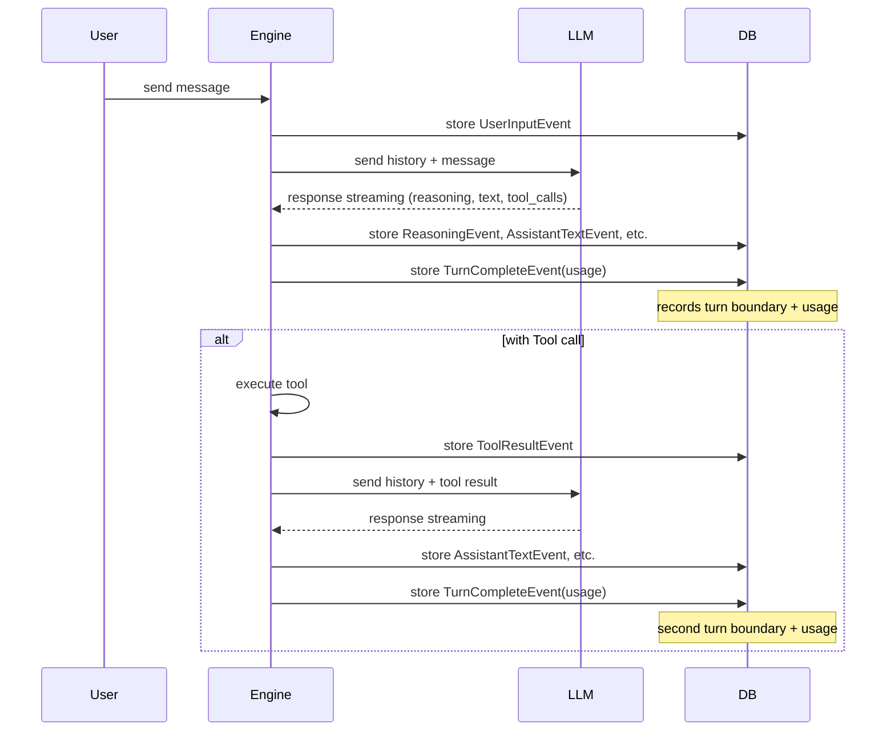

# Token Usage Storage Design

## 1. Background

### Current Structure

LLM response token usage (`usage`) is delivered through `StreamEnd` → `RunComplete` → WebSocket, but **is not persisted in DB.** Current `TokenUsage` includes only 3 fields:

```python
@dataclasses.dataclass(frozen=True)
class TokenUsage:
    prompt_tokens: int
    completion_tokens: int
    total_tokens: int
```

### Problems

1. **No turn boundary**: event stream does not explicitly represent turn boundary. Multiple events (reasoning + text + tool_call) are stored in one turn, but it is impossible to know where the turn ends.
2. **Usage not stored**: token usage by turn is absent from DB, so usage analysis, cost tracking, context window management are impossible.
3. **Provider information loss**: detailed usage information provided by provider (cached tokens, reasoning tokens, etc.) is lost.
4. **Context window management impossible**: when conversation grows long, current history's occupancy in context window is unknown, so compaction trigger timing cannot be determined.

### Goals

- **Turn completion marker**: explicitly represent turn boundary in event stream.
- **Store token usage**: persist usage by turn in DB.
- **Preserve provider original**: store normalized common fields + provider raw fields together.
- **Provide context window estimation basis**: use stored usage to estimate context size of next turn.

---

## 2. Design

### Core Idea

> Store **`TurnCompleteEvent`** marker when each LLM turn completes.
> Marker includes token usage for that turn.



### Token Usage Structure

Token information differs by provider:

| Item | OpenAI | Anthropic | Gemini |
|------|--------|-----------|--------|
| input_tokens | O | O | O |
| output_tokens | O | O | O |
| cache_read_tokens | O | O | O |
| cache_creation_tokens | X | **O (separate category)** | X |
| reasoning_tokens | O (`completion_tokens_details`) | O (separate field) | X |

Use **normalized + raw side-by-side storage** strategy:

```
TokenUsage (normalized common fields)
├── prompt_tokens          — total input token count
├── completion_tokens      — total output token count
├── total_tokens           — prompt_tokens + completion_tokens
├── cached_tokens          — cache read among prompt_tokens (discount 0.1×), nullable
├── cache_creation_tokens  — cache create among prompt_tokens (surcharge 1.25×, Anthropic), nullable
├── reasoning_tokens       — subset of completion_tokens (thinking/reasoning), nullable
├── cost_usd               — dollar cost calculated by litellm (_hidden_params.response_cost), nullable
├── raw                    — provider original usage dict, nullable
└── raw_hidden_params      — litellm _hidden_params original (provider meta/latency/ID, etc.), nullable
```

Token category relationship:

```
prompt_tokens (= entire input)
├── cached_tokens          (cache read: discount 0.1×)
├── cache_creation_tokens  (cache create: surcharge 1.25×, Anthropic only)
└── normal processing tokens (= prompt_tokens - cached_tokens - cache_creation_tokens)

completion_tokens (= entire output)
├── reasoning_tokens (thinking/reasoning part)
└── normal output tokens
```

> **Note**:
> - `cached_tokens` / `cache_creation_tokens` do not affect context window occupancy (only cost calculation).
> - Anthropic prices read/create differently, so both must be stored separately to reproduce real cost.
> - `cost_usd` is a snapshot precomputed by litellm with model price table, so safe against retroactive price changes.
> - `raw_hidden_params` includes `response_cost`, `_response_ms`, `model_id`, `custom_llm_provider`, etc. and is useful for post-hoc debugging/analysis.

---

## 3. Data Model Changes

### Extend TokenUsage type

```python
@dataclasses.dataclass(frozen=True)
class TokenUsage:
    """Token usage by turn.

    Stores normalized common fields together with provider original.
    """

    prompt_tokens: int
    completion_tokens: int
    total_tokens: int
    cached_tokens: int | None = None           # cache read only
    cache_creation_tokens: int | None = None   # cache create only (Anthropic)
    reasoning_tokens: int | None = None
    cost_usd: float | None = None              # litellm _hidden_params.response_cost
    raw: dict[str, object] | None = None
    raw_hidden_params: dict[str, object] | None = None
```

### TurnCompleteEvent (new SessionEvent type)

```python
@dataclasses.dataclass(frozen=True)
class TurnCompleteEvent:
    """Turn completion marker.

    Emitted when one LLM call completes.
    Includes usage information and records turn boundary plus token usage.
    """

    usage: TokenUsage | None
```

- Add to `SessionEvent` union.
- Not passed as input to LLM (filtered when loading history).

### Extend MessageRole enum

```python
class MessageRole(enum.StrEnum):
    USER = "user"
    ASSISTANT = "assistant"
    TOOL = "tool"
    TURN_COMPLETE = "turn_complete"  # new
```

### DB schema: `events` table

Add `usage` JSONB column.

| Column | Type | Purpose | Change |
|------|------|------|------|
| `id` | String(32) PK | UUID7 | — |
| `channel_id` | String(32) FK | channel reference | — |
| `role` | ENUM | user / assistant / tool / **turn_complete** | **changed** |
| `content` | Text | text content | — |
| `tool_calls` | JSONB | tool call list | — |
| `tool_call_id` | Text | tool result call_id | — |
| `metadata` | JSONB | user metadata | — |
| `attachments` | JSONB | file attachment list | — |
| `reasoning` | Text | reasoning text | — |
| `model` | Text | generation model name | — |
| `raw_output` | JSONB | Responses API original output item | — |
| `usage` | **JSONB** | **token usage by turn** | **new** |
| `created_at` | TimestampTZ | creation time | — |

### TurnCompleteEvent → DB Row mapping

| Field | DB column | Value |
|------|---------|-----|
| role | `role` | `turn_complete` |
| usage | `usage` | normalized fields + raw serialized to JSONB |
| remaining columns | — | all NULL |

`usage` JSONB structure:
```json
{
  "prompt_tokens": 15000,
  "completion_tokens": 500,
  "total_tokens": 15500,
  "cached_tokens": 12000,
  "cache_creation_tokens": 1500,
  "reasoning_tokens": null,
  "cost_usd": 0.012345,
  "raw": { ... },
  "raw_hidden_params": {
    "response_cost": 0.012345,
    "model_id": "claude-sonnet-4",
    "custom_llm_provider": "bedrock",
    "_response_ms": 1234.5
  }
}
```

Optional fields are omitted from JSON when absent (`serialize_usage` drops None keys).

---

## 4. Major Changes

### 4.1 Extend TokenUsage

Add `cached_tokens`, `reasoning_tokens`, `raw` fields to `TokenUsage` in `engine/types.py`.

### 4.2 Add TurnCompleteEvent

Add `TurnCompleteEvent` to `engine/types.py` and include it in `SessionEvent` union.

### 4.3 Extend LLM client usage parsing

Extend `_parse_response_usage()` in `runtime/llm.py` to map provider-specific detailed token information to normalized fields and preserve original in `raw` / `raw_hidden_params`.

```
Responses API usage structure (OpenAI baseline):
  input_tokens                                     → prompt_tokens
  output_tokens                                    → completion_tokens
  total_tokens                                     → total_tokens
  input_tokens_details.cached_tokens               → cached_tokens
  input_tokens_details.cache_creation_tokens       → cache_creation_tokens  (Anthropic, currently missing in Responses API conversion path)
  output_tokens_details.reasoning_tokens           → reasoning_tokens
  entire usage                                     → raw

Anthropic top-level fallback (Chat Completions native path):
  cache_read_input_tokens                          → cached_tokens
  cache_creation_input_tokens                      → cache_creation_tokens

response._hidden_params:
  response_cost                                    → cost_usd
  entire                                           → raw_hidden_params
```

### 4.4 Store TurnCompleteEvent in engine

Store `TurnCompleteEvent` immediately after each LLM response save in ReAct loop in `engine/engine.py`.

```python
# current: store only response events
await self._store.append(sid, events_to_store, model=request.model)

# changed: store response events + turn completion marker
await self._store.append(sid, events_to_store, model=request.model)
await self._store.append(
    sid, [TurnCompleteEvent(usage=usage)], model=request.model
)
```

### 4.5 EventStore save/load

**Save**: add `TurnCompleteEvent` case to `_event_to_rdb_kwargs()`.
Store `role=TURN_COMPLETE`, serialized usage JSONB in `usage` column.

**Load**: restore as `TurnCompleteEvent` when `role=TURN_COMPLETE` in `_to_session_event()`.

### 4.6 Filtering on history load

`TurnCompleteEvent` is not included in LLM input.
Skip `TurnCompleteEvent` in `_build_input_items()`.

### 4.7 WebSocket serialization

Do not serialize `TurnCompleteEvent` in `broker/serialization.py`.
`RunComplete` already delivers usage to client, so role overlaps.
`TurnCompleteEvent` is DB-only marker.

### 4.8 REST API exposure

Include `TurnCompleteEvent` in REST API message list.
Add `usage` field to `ChatMessage` and deliver usage of `role=turn_complete` row to client.

UI displays turn divider and delete button at message position where `role=turn_complete`.

### 4.9 Truncate API — turn boundary constraint

Restrict existing truncate API (`DELETE /sessions/{id}/messages/{message_id}/after`) basis to **`TurnCompleteEvent` only**.

- Verify target `message_id` has `role=turn_complete`.
- Return `400 Bad Request` for other roles.

**Reason**: If truncated mid-turn, event sequence without `TurnCompleteEvent` (usage) appears and context window estimation becomes impossible. Cutting history only by turn keeps invariant that every event sequence ends with `TurnCompleteEvent`.

---

## 5. Context Window Estimation (future use)

Strategy for context window estimation using stored usage. Compaction implementation uses this data to decide trigger.

### Estimation formula

```
Expected prompt_tokens for next turn
  ≈ last TurnCompleteEvent.usage.prompt_tokens
  + last TurnCompleteEvent.usage.completion_tokens
  + estimate(newly added events)
```

- User message: `len(text) / 4` (rough estimate is enough because input character count is limited)
- tool result: size unpredictable → use proactive estimate + error catch fallback together

### Estimation time

At start of every ReAct loop iteration (integrated regardless of user message / tool result distinction):

```python
while True:
    history = store.list(sid)
    last_usage = find_last_turn_complete(history)

    if last_usage is not None:
        estimated = (
            last_usage.prompt_tokens
            + last_usage.completion_tokens
            + estimate_new_events(new_events)
        )
        if estimated > context_window_threshold:
            compact(sid)
            history = store.list(sid)

    try:
        stream = llm.stream(history)
    except ContextWindowExceeded:
        # fallback: safety net against estimation error
        compact(sid)
        history = store.list(sid)
        stream = llm.stream(history)
```

---

## 6. Migration Strategy

### DB changes

1. Add `turn_complete` value to `message_role` ENUM.
2. Add nullable `usage` JSONB column to `events` table.

### Existing data compatibility

- Existing rows have `usage` NULL → work normally.
- Existing history without `turn_complete` role → `find_last_turn_complete()` returns None → skip estimation.
- New turns store `TurnCompleteEvent` row.

### Rollback safety

- `usage` column is nullable addition, so can be ignored on rollback.
- If `turn_complete` role removed, ignoring those rows leaves existing functionality normal.

---

## Implementation Plan

### Phase 1: Extend TokenUsage + add TurnCompleteEvent type

**Goal**: Add extended TokenUsage and TurnCompleteEvent to runtime type system. Only define types without DB/engine change.

#### 1-1. Extend TokenUsage

**File:** `nointern/engine/types.py`

```python
@dataclasses.dataclass(frozen=True)
class TokenUsage:
    """Token usage by turn.

    Stores normalized common fields and provider original together.
    """

    prompt_tokens: int
    completion_tokens: int
    total_tokens: int
    cached_tokens: int | None = None
    cache_creation_tokens: int | None = None
    reasoning_tokens: int | None = None
    cost_usd: float | None = None
    raw: dict[str, object] | None = None
    raw_hidden_params: dict[str, object] | None = None
```

Existing code compatibility is preserved because optional fields are added after existing fields.

#### 1-2. Add TurnCompleteEvent

**File:** `nointern/engine/types.py`

```python
@dataclasses.dataclass(frozen=True)
class TurnCompleteEvent:
    """Turn completion marker.

    Emitted when one LLM call completes.
    Includes usage information and records turn boundary plus token usage.
    """

    usage: TokenUsage | None
```

Add `TurnCompleteEvent` to `SessionEvent` union:

```python
SessionEvent = (
    UserInputEvent
    | AssistantTextEvent
    | AssistantToolCallEvent
    | ToolResultEvent
    | ReasoningEvent
    | UnknownEvent
    | TurnCompleteEvent  # new
)
```

#### 1-3. Extend LLM client usage parsing

**File:** `nointern/runtime/llm.py`

`_parse_response_usage()` reads not only detailed fields of usage but also `_hidden_params` of response object and fills `cost_usd` / `raw_hidden_params`. Anthropic top-level fields (`cache_read_input_tokens` / `cache_creation_input_tokens`) are used as fallback when `input_tokens_details` is empty.

**Note**:
- litellm Responses API usage type is `ResponseAPIUsage`, and support of `input_tokens_details`/`output_tokens_details` differs by provider, so use defensive `getattr`.
- `_hidden_params` is extra attr opened by `BaseLiteLLMOpenAIResponseObject` with `extra="allow"`.
  Value is `HiddenParams` pydantic object (or dict). Use `model_dump` if available, otherwise dict conversion.
- In Anthropic Responses API conversion path, cache_control is not passed to prompt, so `cache_creation_tokens` actually always arrives as None. Source fix (or bypass routing) for this issue must happen together for meaningful value.

#### 1-4. Filter TurnCompleteEvent in _build_input_items

**File:** `nointern/runtime/llm.py`

Skip `TurnCompleteEvent` in `_build_input_items()` function.
Since it is added to `SessionEvent` union, add case to match branch:

```python
case TurnCompleteEvent():
    continue  # not included in LLM input
```

#### Verification

- Existing tests all pass (optional field addition preserves existing `TokenUsage(...)` calls).
- `uv run ruff check --fix . && uv run ruff format . && uv run pyright && uv run pytest`

---

### Phase 2: DB schema + EventStore change

**Goal**: Enable storing and loading TurnCompleteEvent in DB. Engine is not changed yet.

#### 2-1. Extend MessageRole enum

**File:** `nointern/core/enums.py`

```python
class MessageRole(enum.StrEnum):
    """Conversation message role."""

    SYSTEM = "system"
    USER = "user"
    ASSISTANT = "assistant"
    TOOL = "tool"
    TURN_COMPLETE = "turn_complete"  # new
```

#### 2-2. Change RDBEvent model

**File:** `nointern/rdb/models/message.py`

Add nullable JSONB `usage` column:

```python
usage: Mapped[dict[str, Any] | None] = mapped_column(
    JSONB, nullable=True, default=None
)
```

#### 2-3. DB migration

**File:** `nointern/db-schemas/rdb/migrations/versions/` — new Alembic migration

2 steps:
1. Add `turn_complete` value to `message_role` ENUM.
2. Add nullable JSONB `usage` column to `events` table.

```python
def upgrade() -> None:
    # 1. add turn_complete to ENUM
    op.execute("ALTER TYPE message_role ADD VALUE IF NOT EXISTS 'turn_complete'")
    # 2. add usage column
    op.add_column("events", sa.Column("usage", JSONB, nullable=True))

def downgrade() -> None:
    op.drop_column("events", "usage")
    # Removing ENUM value is complex in PostgreSQL, so leave it.
```

Reference pattern: `20279d111590_add_model_column_to_events.py`

#### 2-4. EventStore save logic

**File:** `nointern/repos/message/store.py`

Add `TurnCompleteEvent` case to `_event_to_rdb_kwargs()`:

```python
case TurnCompleteEvent(usage=usage):
    return {
        "role": MessageRole.TURN_COMPLETE,
        "usage": _serialize_usage(usage),
    }
```

`_serialize_usage()` helper:

```python
def _serialize_usage(usage: TokenUsage | None) -> dict[str, Any] | None:
    """Convert TokenUsage to dict for JSONB storage."""
    if usage is None:
        return None
    d: dict[str, Any] = {
        "prompt_tokens": usage.prompt_tokens,
        "completion_tokens": usage.completion_tokens,
        "total_tokens": usage.total_tokens,
    }
    if usage.cached_tokens is not None:
        d["cached_tokens"] = usage.cached_tokens
    if usage.cache_creation_tokens is not None:
        d["cache_creation_tokens"] = usage.cache_creation_tokens
    if usage.reasoning_tokens is not None:
        d["reasoning_tokens"] = usage.reasoning_tokens
    if usage.cost_usd is not None:
        d["cost_usd"] = usage.cost_usd
    if usage.raw is not None:
        d["raw"] = usage.raw
    if usage.raw_hidden_params is not None:
        d["raw_hidden_params"] = usage.raw_hidden_params
    return d
```

#### 2-5. EventStore load logic

**File:** `nointern/repos/message/store.py`

Add `TURN_COMPLETE` case to `_to_session_event()`:

```python
case MessageRole.TURN_COMPLETE:
    return TurnCompleteEvent(usage=_deserialize_usage(rdb.usage))
```

`_deserialize_usage()` helper:

```python
def _deserialize_usage(raw: dict[str, Any] | None) -> TokenUsage | None:
    """Restore TokenUsage from JSONB dict."""
    if not raw:
        return None
    return TokenUsage(
        prompt_tokens=raw["prompt_tokens"],
        completion_tokens=raw["completion_tokens"],
        total_tokens=raw["total_tokens"],
        cached_tokens=raw.get("cached_tokens"),
        cache_creation_tokens=raw.get("cache_creation_tokens"),
        reasoning_tokens=raw.get("reasoning_tokens"),
        cost_usd=raw.get("cost_usd"),
        raw=raw.get("raw"),
        raw_hidden_params=raw.get("raw_hidden_params"),
    )
```

#### 2-6. Tests

**File:** `nointern/repos/message/store_test.py` (existing or new)

Tests to add:
1. **TurnCompleteEvent save/load round-trip**: with usage → DB → restore → same as original
2. **TurnCompleteEvent with usage None**: save/load usage=None
3. **Existing events unaffected**: existing role (user, assistant, tool) events work normally

#### Verification

- Apply migration: `cd db-schemas/rdb && uv run alembic upgrade head`
- All tests pass
- `uv run ruff check --fix . && uv run ruff format . && uv run pyright && uv run pytest`

---

### Phase 3: Store TurnCompleteEvent in engine

**Goal**: Store TurnCompleteEvent in DB whenever each LLM turn completes in ReAct loop.

#### 3-1. Change engine run()

**File:** `nointern/engine/engine.py`

Add additional storage of `TurnCompleteEvent` immediately after LLM response event storage in ReAct loop.

**No tool call case (final response, `engine.py:449-453`):**

```python
# current
await self._store.append(sid, events_to_store, model=request.model)
yield RunComplete(usage=usage)
return

# changed
await self._store.append(sid, events_to_store, model=request.model)
await self._store.append(
    sid, [TurnCompleteEvent(usage=usage)], model=request.model
)
yield RunComplete(usage=usage)
return
```

**Tool call case (`engine.py:455-456`):**

```python
# current
await self._store.append(sid, events_to_store, model=request.model)

# changed
await self._store.append(sid, events_to_store, model=request.model)
await self._store.append(
    sid, [TurnCompleteEvent(usage=usage)], model=request.model
)
```

Store `TurnCompleteEvent` in both paths, so if one user message repeats tool call 3 times, 3 `TurnCompleteEvent`s are stored.

#### 3-2. Add imports

**File:** `nointern/engine/engine.py`

Import `TurnCompleteEvent` from `nointern.runtime.types`.

#### 3-3. WebSocket serialization

**File:** `nointern/broker/serialization.py`

Do not deliver `TurnCompleteEvent` through WebSocket.
`RunComplete` already delivers usage to client, so role overlaps.

Do not handle `TurnCompleteEvent` in `serialize_event()` (it does not arrive because engine does not yield it).
No separate handling needed.

#### 3-4. Update existing tests

**File:** `nointern/engine/engine_test.py`

Since `_FakeEventStore` `list()` return includes `TurnCompleteEvent`, existing test assertions must consider `TurnCompleteEvent`.

Updates:
- Confirm `TurnCompleteEvent` included when verifying events stored in store.
- Confirm `TurnCompleteEvent` is filtered from history passed to LLM.

#### 3-5. Add new tests

**File:** `nointern/engine/engine_test.py`

Tests to add:
1. **single turn**: user message → text response → confirm 1 TurnCompleteEvent stored
2. **multi-turn (tool call)**: user message → tool call → tool result → text response → confirm 2 TurnCompleteEvents stored
3. **usage delivery check**: TurnCompleteEvent usage matches LLM response usage
4. **LLM input filtering**: even if store has TurnCompleteEvent, it is not passed to LLM

#### Verification

- All tests pass.
- After real LLM call with nointern shell, check DB:
  `SELECT role, usage FROM events WHERE channel_id = '...' AND role = 'turn_complete'`
- `uv run ruff check --fix . && uv run ruff format . && uv run pyright && uv run pytest`

---

### Phase 4: REST API exposure + Truncate constraint

**Goal**: Expose `TurnCompleteEvent` in message list and restrict truncate to turn boundary.

#### Background

Existing truncate API (`DELETE /sessions/{id}/messages/{message_id}/after`) can delete events after arbitrary message ID. If truncated mid-turn, event sequence without `TurnCompleteEvent` (usage) appears.

**Change**: restrict truncate criterion to `TurnCompleteEvent` so history can only be cut by complete turn. UI shows delete button only at message position where `role=turn_complete`.

#### 4-1. Add usage field to ChatMessage

**File:** `nointern/repos/message/data.py`

```python
class ChatMessage(BaseModel):
    """Message domain model (for REST response)."""

    id: str = Field(description="Message ID")
    channel_id: str = Field(description="Channel ID")
    role: MessageRole = Field(description="Message role")
    content: str | None = Field(description="Message content")
    tool_calls: list[ToolCall] | None = Field(description="Tool call list")
    tool_call_id: str | None = Field(description="Tool call ID")
    attachments: list[Attachment] = Field(
        default_factory=list[Attachment], description="Attachment list"
    )
    reasoning_summary: str | None = Field(
        default=None, description="Reasoning summary text"
    )
    usage: dict[str, object] | None = Field(
        default=None, description="Token usage by turn (only for turn_complete role)"
    )  # new
    created_at: datetime.datetime = Field(description="Creation time")
```

#### 4-2. Include TurnCompleteEvent in MessageRepository

**File:** `nointern/repos/message/__init__.py`

Map `usage` field to `ChatMessage` in `_build()` method:

```python
def _build(self, rdb: RDBEvent) -> ChatMessage:
    ...
    return ChatMessage(
        ...
        usage=rdb.usage,  # new: value only in turn_complete row
        created_at=rdb.created_at,
    )
```

Do not treat `turn_complete` role as empty message in `_is_empty()` method:

```python
def _is_empty(self, msg: ChatMessage) -> bool:
    """Whether this is an empty message with nothing to display."""
    if msg.role == MessageRole.TURN_COMPLETE:
        return False  # turn_complete is always included
    return (
        msg.role == MessageRole.ASSISTANT
        and not msg.content
        and msg.tool_calls is None
        and msg.reasoning_summary is None
        and len(msg.attachments) == 0
    )
```

#### 4-3. Truncate API — add turn boundary constraint

**File:** `nointern/services/chat/__init__.py`

Change `truncate_session()`: verify message_id has `role=turn_complete`.

```python
async def truncate_session(
    self,
    session_id: str,
    message_id: str,
    *,
    user_id: str,
) -> Result[None, TruncateSessionError]:
    ...
    async with self.session_manager() as session:
        message = await self.message_repository.get_by_id(session, message_id)
        if message is None or message.channel_id != conv.channel_id:
            return Failure(MessageNotFound())

        # Turn boundary validation: allow only turn_complete role as truncate criterion.
        if message.role != MessageRole.TURN_COMPLETE:
            return Failure(NotTurnBoundary())

        await self.message_repository.delete_after_id(
            session, conv.channel_id, message_id
        )

    return Success(None)
```

#### 4-4. Add error type

**File:** `nointern/services/chat/data.py`

```python
@dataclasses.dataclass(frozen=True)
class NotTurnBoundary:
    """truncate criterion is not turn_complete event."""

TruncateSessionError = SessionNotFound | SessionAccessDenied | MessageNotFound | NotTurnBoundary
```

#### 4-5. API route error handling

**File:** `nointern/api/public/chat/v1/__init__.py`

Handle `NotTurnBoundary` error in `truncate_session` endpoint:

```python
case NotTurnBoundary():
    raise HTTPException(
        status_code=400,
        detail="Truncation is only allowed at turn boundaries (turn_complete events).",
    )
```

#### 4-6. Tests

Tests to add:
1. **truncate with turn_complete ID**: confirm normal operation
2. **truncate with assistant/user/tool ID**: confirm `NotTurnBoundary` error
3. **turn_complete included in message list**: confirm usage field exposed correctly

#### Verification

- Confirm REST API `/sessions/{id}/messages` response includes `role=turn_complete` + `usage`.
- Confirm truncate API allows only `turn_complete` role.
- Existing tests pass.
- E2E tests pass.
- `uv run ruff check --fix . && uv run ruff format . && uv run pyright && uv run pytest`
