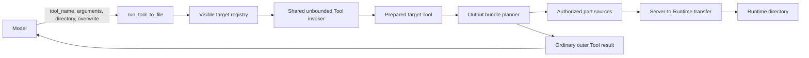

# Run Tool Output Directly to Runtime Design

- Snapshot: `tool-260905`
- Document reference: `tool-260905/DESIGN`
- Requirements: [tool-260905/REQ](../requirements/tool-260905-run-tool-to-file.md)
- Decisions: [tool-260905/ADR](../adr/tool-260905-run-tool-to-file.md)

## Current Behavior and Gaps

The current Engine builds one per-turn client Tool Catalog, projects compatible
wire dialects, applies Tool Search visibility, lowers visible declarations to the
model, and executes model-produced client Tool calls through:

1. prepared-name allowlisting;
2. deferred Tool working-set recency;
3. before-Tool hooks;
4. the selected `FunctionTool` handler;
5. after-Tool hooks;
6. the global 30,000-character text cap; and
7. durable `client_tool_result` admission.

This path always prepares a model-visible result. A successful Tool that returns a
20,000-character HTML document therefore sends the HTML to the model even when the
Agent only intends to write it to Runtime. The Agent must then repeat the HTML in a
`write` call, consuming tokens twice and risking a non-identical copy.

The current Runtime Toolkit already provides absolute-path validation, directory
creation, per-file writes, and verified Server-to-Runtime transfer. Exchange and
Artifact output parts have authorized transfer-source resolvers. ModelFile has
same-session authority-checked body resolution. Generated client files remain
available as transient validated bytes until their outer Tool result is admitted.
These boundaries can materialize the complete output without adding a new
product-storage entity.

The missing mechanisms are:

- an ordinary direct Runtime Tool that can invoke another visible prepared client
  Tool;
- an internal unbounded invocation result before the Engine text cap;
- a planner that maps every output body to deterministic Runtime files;
- part-level transfer results and a Runtime-local manifest; and
- a bounded outer result that suppresses stored bodies while returning only failed
  parts.

## Requirement and Decision Traceability

| Requirement | ADR decisions | Design mechanisms |
| --- | --- | --- |
| `tool-260905/REQ-1` | `ADR-D1`, `ADR-D2`, `ADR-D5` | Engine-assembled direct Runtime Tool, visible-target registry, ordinary outer call/result |
| `tool-260905/REQ-2` | `ADR-D1`, `ADR-D2` | Shared unbounded invocation pipeline, existing hooks, recency, handler dialect, and cancellation |
| `tool-260905/REQ-3` | `ADR-D3` | Pre-cap normalized output, UTF-8 text sources, target-owned limit preservation |
| `tool-260905/REQ-4` | `ADR-D3`, `ADR-D4`, `ADR-D5` | Success summary and failed-part-only outer result |
| `tool-260905/REQ-5` | `ADR-D3`, `ADR-D4` | Directory preflight, deterministic names, per-file atomic transfer, part-status manifest |
| `tool-260905/REQ-6` | `ADR-D2`, `ADR-D4`, `ADR-D5` | Target failure gate, partial storage projection, final execution-success notice |
| `tool-260905/REQ-7` | `ADR-D3`, `ADR-D4` | Closed output-source adapters for text, Exchange, Artifact, ModelFile, and generated bytes |
| `tool-260905/REQ-8` | `ADR-D1`, `ADR-D4` | Runtime capability gating, exact operation target, per-part authority revalidation |

## Architecture and Ownership



### Runtime Toolkit ownership

`run_tool_to_file` is owned by Runtime Toolkit and is exposed as one unprefixed
direct client Tool only when the current capability snapshot grants:

- Agent Workspace access;
- Runtime filesystem access; and
- Runtime transfer access.

The Tool remains Engine-assembled because only the Engine owns the complete
per-turn Tool Catalog. `RuntimeToolkit` supplies the Runtime filesystem, transfer,
file-source, authority, and operation-target dependencies. It does not receive
peer Toolkit objects or become a Tool Catalog owner.

### Catalog assembly sequence

The Engine uses this order:

1. build the ordinary candidate catalog from active Toolkit bindings;
2. compatibility-project every target Tool to one selected wire dialect;
3. add `tool_search` when enabled;
4. add `run_tool_to_file` as a direct Runtime-owned Tool with a one-shot
   late-bound target executor;
5. run the existing declaration-budget and working-set visibility projection;
6. create the shared unbounded invocation pipeline over the final prepared
   catalog;
7. bind the higher-order Tool exactly once to the visible prepared client Tools
   other than itself; and
8. create the ordinary capped client Tool executor for model-produced calls.

The frozen target registry prevents name guessing from bypassing Tool Search,
model compatibility, capability availability, or the per-turn prepared catalog.
Provider-hosted Tools never enter this registry.

### Shared unbounded invocation pipeline

Refactor the current execution layers so one internal invocation result exists
before model-result capping:

```text
PreparedToolInvocation
  → visible-name admission
  → deferred recency touch
  → before-Tool hooks
  → selected JSON-function or plaintext-custom handler
  → after-Tool hooks
  → UnboundedClientToolResult
```

`UnboundedClientToolResult` is an internal frozen value containing:

- target status;
- normalized `ToolOutput`;
- existing result metadata;
- pending generated files;
- terminal-run intent;
- whether target execution reached an ordinary completed handler result; and
- the selected target identity required for cancellation and diagnostics.

The normal direct Tool executor converts this value to
`ClientToolResultPayload` and applies the existing global text cap. The higher-order
Tool consumes the same value before that cap. This keeps direct Tool behavior
unchanged while avoiding a duplicate target execution implementation.

The outer `run_tool_to_file` call still passes through the ordinary prepared
allowlist and hook pipeline. Its inner target invocation also passes through the
target's ordinary recency, hooks, selected handler, capability guards, and cancel
handler.

### Input-validation gate

Target JSON decoding and Pydantic schema validation retain an internal
input-validation classification. A validation failure, before-hook denial, or
handler failure produces a failed target invocation and never enters the bundle
planner.

The higher-order handler maps that failed invocation back to the ordinary failed
Tool result. Error text cannot be mistaken for successful output and cannot be
written to Runtime. An after-hook may alter the model-visible failure text under
its existing contract, but it does not authorize bundle storage after target input
validation or execution failed.

### Cancellation

The higher-order handler reads the ordinary outer execution context and keeps
request-local active target state. Its cancel handler forwards the outer call's
cancellation to the active target's existing cancel handler. Task cancellation
then cancels the target await or the active Runtime transfer; the existing
transfer service requests bounded coordinator cancellation.

No nested durable call ID, Tool Event, or recovery record is introduced.

## Tool Contract

### Model-visible description

```text
Run one currently visible client tool and save its output parts to a Runtime
directory. Use this when Runtime commands or scripts will consume the output; call
the target tool directly when the model must inspect it. Activate deferred tools
first. Saved parts are summarized. Parts that fail to save are returned normally
with notice that the target already ran.
```

### Input

`RunToolToFileInput` is one provider-compatible top-level object:

- `tool_name: str` — exact visible client Tool name;
- `arguments: str` — exact target input; a JSON object string for JSON-function
  Tools and raw text for plaintext-custom Tools;
- `directory: str` — absolute Runtime output directory; and
- `overwrite: bool` — whether exact conflicting files may be replaced.

The Toolkit adds no static or dynamic prompt. Stable selection and argument
guidance remains in the Tool and field descriptions.

### Target invocation

The handler rejects before target execution when:

- `directory` is relative or outside writable Runtime scope;
- the current Runtime operation target or capability authority is unavailable;
- `tool_name` is absent from the frozen visible target registry;
- `tool_name` is `run_tool_to_file`; or
- the target's prepared wire dialect is unavailable.

The target receives `arguments` without model-side reinterpretation. JSON-function
Tools perform their normal JSON object parsing and input-model validation.
Plaintext-custom Tools receive the raw string through their selected custom
handler.

## Output Bundle

### Part planning

The planner assigns one stable manifest index to each source body:

- a plain string becomes one `OutputTextPart`;
- `OutputTextPart` values retain their current order;
- `AttachmentOutputPart` and `ArtifactOutputPart` retain their source metadata and
  authorized URI;
- `FileOutputPart` retains its ModelFile ID and normalized media type; and
- pending generated files retain their existing output index, filename, media
  type, size, hash, and validated transient body.

Target-owned output limiting has already happened before planning. For example,
the planner receives the bounded stdout/stderr returned by
`exec_command.max_output_bytes`; it does not invoke the process again or attempt
to recover omitted bytes.

### File names

The directory reserves a safe selected name for each part:

- one text body uses `output.txt`;
- multiple text bodies use `output-1.txt`, `output-2.txt`, and so on;
- named file parts retain a sanitized basename;
- unnamed file parts use a deterministic type-and-index name;
- `manifest.json` is reserved for the manifest; and
- deterministic numeric suffixes resolve duplicate names and preserve existing
  files when `overwrite=false`.

With `overwrite=true`, an existing exact selected file may be atomically replaced.
Duplicate names within the same new result still receive suffixes so one part
never replaces another.

### Source adapters

Use one closed internal output-source union:

- **Text source:** UTF-8 bytes computed from the unbounded returned string.
- **Exchange source:** existing authority-checked Exchange transfer resolver and
  managed S3 copy.
- **Artifact source:** existing authority-checked Artifact transfer resolver and
  managed S3 copy.
- **ModelFile source:** same-session `SessionResourceAuthority` validation plus a
  managed source for the normalized ModelFile object.
- **Generated source:** validated transient bytes and declared hash from
  `GeneratedFileOutput`.

Each adapter supplies bounded metadata, prepares an immutable verified transfer
object, and revalidates authority before dispatch. Existing Exchange, Artifact,
and ModelFile resources are copied, not consumed.

### Manifest

After part attempts finish, write `manifest.json` through the ordinary Runtime
file-write boundary. It contains:

- schema version;
- target Tool name;
- ordered entries with original part index and kind;
- original media type and safe display name when available;
- selected relative Runtime path;
- `stored` or `failed` status;
- committed byte count and SHA-256 for stored files; and
- a bounded stable failure category for failed files.

The manifest contains no Tool arguments, output text, credentials, storage keys,
provider URLs, raw exception messages, or file bodies. It is an operational index,
not a transaction or durable product authority.

## Result Projection

### Complete storage success

When every part and the manifest are stored, return one ordinary short text
result containing:

- target Tool name;
- destination directory;
- manifest path;
- stored part count;
- aggregate stored bytes; and
- a deterministic digest of ordered manifest entries.

No target output body or file URI is returned to the model.

### Target failure

When target argument decoding, schema validation, policy, hook admission, handler
execution, or target cancellation fails:

- do not plan or transfer output;
- clean up an invocation-created empty directory when practical;
- return the target's ordinary bounded failure result; and
- state that no Runtime output was stored.

This is not a storage failure and receives no target-success notice.

### Part-level storage failure

When the target succeeds and one or more part writes fail:

1. keep every successfully committed Runtime file;
2. include a bounded summary of stored and failed part counts;
3. include only failed original output parts in their normal representation;
4. retain failed generated files in the outer pending-generated-file list so the
   existing outer result materializer can present them normally;
5. append one final text notice stating that the target Tool already executed
   successfully and only the listed Runtime storage operations failed; and
6. do not execute the target again or remove successful files.

The ordinary outer executor applies the existing global text cap to failed text
parts. Because the notice is the final text part and the cap preserves the output
tail, the execution-success/storage-failure statement remains visible.

If manifest storage alone fails, return the stored-part summary plus a manifest
failure notice. Stored files remain available at their reported paths.

## Runtime and State Boundaries

- The destination bundle exists only in the current Agent Runtime filesystem and
  follows normal Runtime persistence, reset, hibernation, and removal behavior.
- No ExchangeFile, Artifact, ModelFile, database row, or Event file body is created
  solely for a successfully stored bundle.
- Existing source entities retain their current owners, retention, expiry, and
  purge behavior.
- The outer call/result remains the only durable Tool execution record.
- No public REST or WebSocket schema changes are required.
- No database migration is required.

## Failure, Retry, and Recovery

- Pre-target Runtime or target-admission failure invokes no target Tool.
- Target failure invokes no output transfer.
- Per-part transfer failure uses the current verified transfer failure categories
  and leaves the previous exact destination file unchanged.
- A successful part is not retried or rolled back because another part fails.
- The handler does not automatically re-execute the target after any storage
  failure.
- A later model-selected invocation is a new Tool call and may repeat target side
  effects; the partial-failure notice therefore states that the previous target
  already ran.
- User stop and shutdown preserve existing cancellation semantics. A shutdown that
  interrupts target execution before a result exists follows existing Tool
  recovery. Once target success exists, interruption during transfer does not
  replay the target automatically.
- Manifest failure does not invalidate independently committed files.

## Security and Permissions

- Only current model-visible prepared client Tools are callable, preventing the
  higher-order Tool from bypassing Tool Search, disabled Toolkit state, model
  compatibility, or unavailable capabilities.
- Target Tools retain existing authorization and credentials. The higher-order
  Tool receives no credential material.
- File source adapters validate the current Workspace, Agent, Session, root
  Session, Run, owner generation, and source identity before transfer.
- Runtime destination resolution uses the current Runner-reported Agent Workspace
  authority and the existing writable path policy.
- The manifest and logs exclude arguments, content, credentials, storage keys,
  provider URLs, raw exception text, and hashes that current logging policy treats
  as sensitive.
- Saving output to Runtime is an explicit model action. The feature does not make
  Runtime files public; `present_file` remains the separate publication boundary.

## Observability

Emit structured logs and metrics at the existing Tool and transfer boundaries:

- outer call ID and `run_tool_to_file` name;
- target Tool name and Toolkit source identity;
- part counts by kind;
- stored and failed counts;
- aggregate bytes;
- bounded per-part failure category;
- target duration, transfer duration, and total duration; and
- cancellation phase.

Do not log target arguments, output text, file bodies, source URIs containing
storage keys, credentials, raw provider errors, or Runtime file contents.

The ordinary Tool result and Runtime-local manifest are the Agent-visible evidence.
No new public diagnostics API is added.

## Migration, Rollout, and Rollback

No data migration or generated client update is required. The feature is a
backend/Runner-capability-preserving addition:

- Engine catalog and invocation refactor;
- Runtime-owned higher-order Tool;
- output-source adapters;
- manifest writer; and
- tests and Living Spec updates.

Existing Runtime Transfer and Runner file operations are sufficient; no protocol,
Provider, Helm, or Runtime image capability change is required.

Ship the invocation refactor and `run_tool_to_file` in one focused PR so a mixed
internal version cannot expose the Tool without its unbounded target invocation
path. Rollback removes the Tool and restores the direct executor composition.
Persisted Events and Runtime files remain valid ordinary history and filesystem
state.

## Test Strategy

### Primary verification matrix

| Scenario | Expected evidence |
| --- | --- |
| 20,000-character HTML | Runtime `output.txt` matches the fixture byte-for-byte; successful Tool result contains no HTML body |
| Text above 30,000 characters | Runtime file contains the complete target-returned text; normal direct call remains capped |
| Tool-owned truncation | Target `exec_command` output stored exactly as returned under `max_output_bytes`; omitted process bytes are not recovered |
| JSON-function validation failure | Target is not treated as successful output; no file is created; ordinary validation failure is returned |
| Plaintext-custom target | Raw input reaches the selected custom handler and its output is stored |
| Tool Search target | Deferred target is rejected before activation and accepted after it becomes visible |
| Hook denial and replacement | Denial writes nothing; successful replacement output follows the existing hook contract and is stored |
| Mixed output | Text, Exchange, Artifact, FilePart, and generated file bodies appear in the directory and ordered manifest |
| One part transfer failure | Successful files remain; only failed parts and the target-success/storage-failure notice enter model context |
| Destination collisions | `overwrite=false` preserves existing files through deterministic suffixes; `overwrite=true` atomically replaces selected files |
| Cancellation | Active target cancel handler or transfer cancellation is invoked once; target is not automatically replayed |
| Runtime unavailable | Tool is absent or fails pre-target under capability/authority drift |

### E2E plan

Add required credential-free E2E coverage using the Docker Runtime Provider and a
deterministic local client Toolkit fixture. The fixture exposes:

- a schema-validated HTML Tool returning a known 20,000-character document;
- a Tool returning text above 30,000 characters;
- a mixed-output Tool with text and file-backed parts; and
- a deterministic validation failure.

Use the normal public Agent/session path and model fixture to select
`run_tool_to_file`. Verify:

1. the Tool is visible only with Runtime capability;
2. the target is visible or Tool Search-activated in the same prepared turn;
3. Runtime commands compute expected file sizes and hashes;
4. `manifest.json` contains the expected ordered part statuses;
5. successful bodies are absent from the durable model-visible outer result; and
6. a forced part collision or transfer failure returns only the failed part plus
   the final partial-success notice.

### Fixtures and prerequisites

Extend the existing credential-free test Toolkit or mock MCP fixture rather than
requiring a live external service. Add deterministic source bodies and expected
hashes to the fixture. Reuse the current Docker Runtime, Agent basic fixture,
Tool Search model fixtures, Runtime hook fixtures, and transfer storage
infrastructure.

No external credential or browser storage-state snapshot is required.

### Evidence and CI policy

Primary evidence consists of:

- public transcript Events;
- Runtime `sha256`, byte-count, and file-list observations;
- the Runtime-local manifest;
- structured unit/integration assertions for invocation phase and failed-part
  projection; and
- required E2E JUnit and runtime diagnostics artifacts.

Run backend Ruff, the configured type checker, targeted Engine/Runtime pytest,
the relevant backend suite, testenv quality checks, documentation validation, and
required E2E CI. Deterministic tests do not skip. Optional live-provider tests are
not required for this feature.

## Removal and Replacement

Repository analysis found no authoritative removal obligation. Existing direct
Tool calls, `write`, `import_file`, `present_file`, Tool Search, Tool output
capping, file publication, and Runtime Transfer remain valid independent
capabilities.

The implementation refactors the narrow client Tool invocation/executor unit so
the pre-cap result can be reused. The current direct executor's behavior is
replaced by an equivalent capped adapter over the shared invoker; source search
and existing executor tests verify that no duplicate handler execution path
remains.

| Existing unit or behavior | Removal authority | Replacement or remaining authority | Removal boundary | Absence verification |
| --- | --- | --- | --- | --- |
| Capping embedded directly in the sole target handler-execution path | `tool-260905/REQ-2`, `REQ-3`; `ADR-D2`, `ADR-D3` | Shared unbounded invoker plus ordinary capped direct executor | `ToolCatalogClientToolExecutor` result construction | Direct Tool regression tests and source search for duplicate handler invocation |
| Existing direct Tool, write/import/presentation, and Runtime transfer behavior | Current Toolkit and file-exchange Specs | Retained unchanged | None | Existing unit and E2E suites |
| Database, public API, provider, and Runtime protocol state | `tool-260905/REQ`; `ADR-D1` through `ADR-D4` | Retained unchanged | None | Migration, OpenAPI, protobuf, and generated-client diff absence |

## Feasibility

- **REQ-1 — feasible.** The Engine already owns a complete prepared Tool Catalog
  and can add direct JSON-function Tools after compatibility projection, as shown
  by Tool Search.
- **REQ-2 — feasible.** Current allowlist, recency, hook, handler-dialect, execution
  context, and cancel layers are separable into a shared internal invoker without
  changing durable Events.
- **REQ-3 — feasible.** Handler return values exist before
  `enforce_tool_output_text_hard_cap`; Tool-owned limits have already been applied.
- **REQ-4 — feasible.** The outer Tool returns a newly constructed bounded result
  and need not expose successfully stored source parts.
- **REQ-5 — feasible.** Existing Runtime transfer commits one file atomically and
  Runtime file operations can create directories and write the bounded manifest.
  Directory-level atomicity is not required.
- **REQ-6 — feasible.** Internal invocation status distinguishes target failure
  from later part-transfer failure. The current tail-preserving cap keeps a final
  notice visible.
- **REQ-7 — feasible.** Exchange and Artifact already have transfer sources;
  ModelFile has same-session body authority; generated files retain validated
  transient bytes; text exists in memory.
- **REQ-8 — feasible.** Runtime Toolkit already gates filesystem and transfer
  Tools through current capability versions and exact operation targets.

No blocker requires a database migration, public API change, provider protocol
change, Runner protocol change, or new persistent file resource. The main
implementation risk is preserving every direct Tool hook/cancellation regression
while extracting the shared unbounded invocation unit; focused executor tests
bound that risk.

## Design Authority

- Design revision: `1`

| ID | Material design mechanism | Authority | Classification |
| --- | --- | --- | --- |
| M1 | Runtime Toolkit owns one unprefixed direct `run_tool_to_file` Tool assembled by the Engine | `tool-260905/ADR-D1`, `tool-260905/REQ-8` | `decided` |
| M2 | Eligible targets are the same-turn model-visible prepared client Tools excluding the higher-order Tool | `tool-260905/REQ-1`, `REQ-2`; `tool-260905/ADR-D1` | `decided` |
| M3 | One shared unbounded invocation pipeline preserves target recency, hooks, handler dialect, validation, and cancellation | `tool-260905/REQ-2`, `REQ-3`; `tool-260905/ADR-D2` | `decided` |
| M4 | Only the ordinary outer client Tool call/result is durable | `tool-260905/ADR-D2` | `decided` |
| M5 | Completed target output is planned into text, Exchange, Artifact, ModelFile, and generated-byte sources | `tool-260905/REQ-3`, `REQ-7`; `tool-260905/ADR-D3` | `decided` |
| M6 | Destination is a deterministic Runtime directory bundle with a part-status manifest | `tool-260905/REQ-5`, `REQ-7`; `tool-260905/ADR-D3`, `ADR-D4` | `decided` |
| M7 | Each part uses independent verified transfer and atomic file commit without directory rollback | `tool-260905/REQ-5`, `REQ-6`; `tool-260905/ADR-D4`; current Runtime Transfer Spec | `derived` |
| M8 | Successful parts are suppressed and failed parts alone use normal bounded output with a final target-success notice | `tool-260905/REQ-4`, `REQ-6`; `tool-260905/ADR-D4` | `decided` |
| M9 | Input validation and target execution failure gate storage before output planning | `tool-260905/REQ-2`, `REQ-6`; `tool-260905/ADR-D2` | `required` |
| M10 | Usage guidance lives only in the concise Tool and field descriptions | `tool-260905/ADR-D5`; Toolkit prompt-placement convention | `decided` |
| M11 | No new database, public API, product file entity, or Runtime protocol | `tool-260905/REQ`; `tool-260905/ADR-D1` through `ADR-D4`; current file-exchange and Runtime Control Specs | `derived` |

## Assumptions and Non-Blocking Risks

- Text parts carry no trustworthy filename or media type, so deterministic `.txt`
  names are used. The Agent may rename files with ordinary Runtime tools.
- Existing handlers materialize complete return values in server memory. Very
  large text still creates an encoding-time byte copy before transfer; a future
  streaming Tool-return contract would require a separate snapshot.
- A generated-file part that fails Runtime storage is handed to the existing outer
  result materializer so its normal user/model output remains available.
- Existing directory contents can influence collision suffixes when
  `overwrite=false`; the manifest records the actual selected paths.
- Partial bundle success is intentional. Callers must treat the manifest and outer
  result together rather than infer completeness from directory existence.

## Design Approval

- Mode: `Collaborative`
- Decision owner: `건우`
- Approved on: `2026-09-05`
- Approved Design revision: `1`
- Approved authority IDs: `M1`, `M2`, `M3`, `M4`, `M5`, `M6`, `M7`, `M8`,
  `M9`, `M10`, `M11`
- Approved scope: Add the Runtime-owned `run_tool_to_file` higher-order client
  Tool, preserve ordinary target execution semantics, materialize all successful
  output parts independently into a Runtime directory, suppress stored bodies,
  and return only failed parts with an explicit target-success/storage-failure
  notice.
