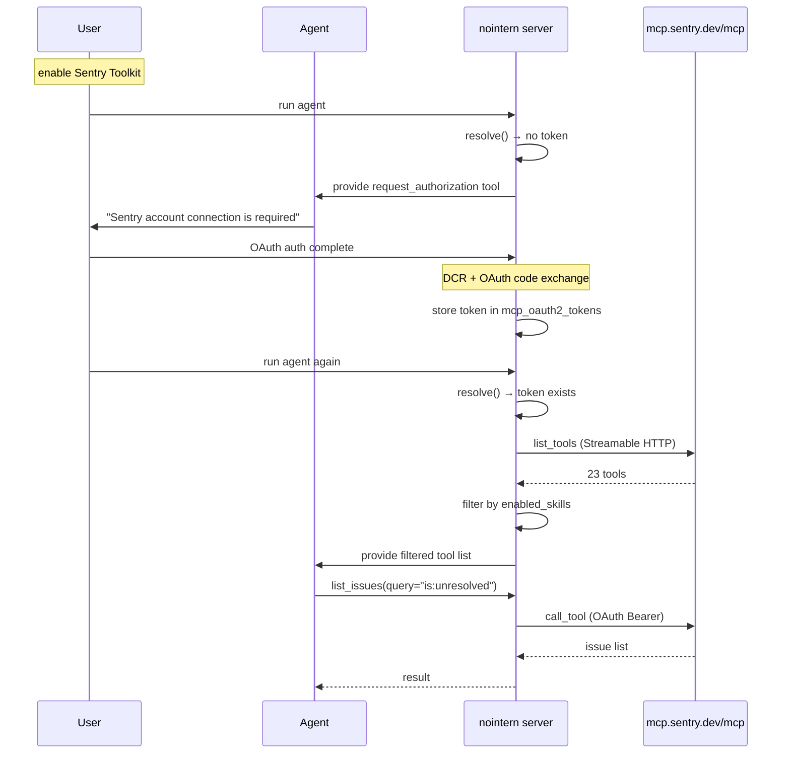
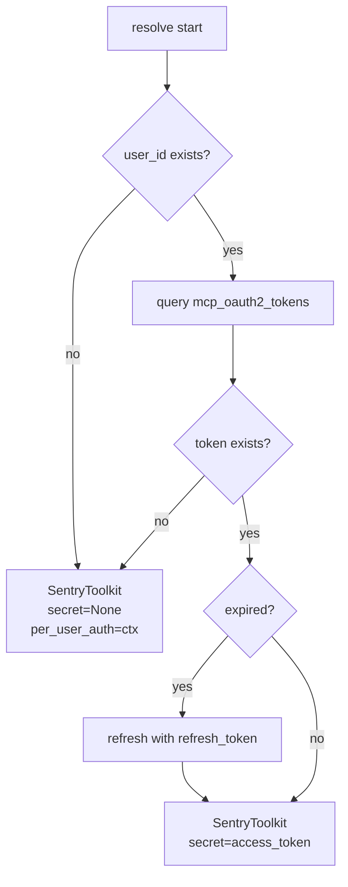

# Sentry Toolkit Design

## Overview

Service Toolkit using Sentry official MCP server (`@sentry/mcp-server`). Enables agent to query Sentry issues, events, traces, and perform AI-based root cause analysis (Seer).

**Usage scenarios:**
- When agent receives bug report, query related issues/events in Sentry and analyze cause based on stacktrace.
- When errors spike after deploy, search Sentry issues and understand impact scope.
- Use Seer AI for automatic root cause analysis + code fix suggestions.

**Implementation Phases:**
- **Phase 1 (this document)**: per-user OAuth mode — reuse Notion pattern, no infra change
- **Phase 2**: access_token mode — stdio via mcp-proxy sidecar ([separate document](sentry-260327-sentry-toolkit-stdio.md))

## Discussion Points and Decisions

### 1. MCP server selection

| Option | Tool count | Maintenance | License |
|--------|---------|----------|----------|
| **A) `@sentry/mcp-server` (official)** | 23 | Sentry team (v0.30.0, active) | FSL-1.1-ALv2 |
| B) `mcp-sentry` (community, Python) | 2 | individual (v0.6.2) | none |
| C) `sentry-selfhosted-mcp` (community, JS) | 6 | individual | MIT |

**Decision: A** — overwhelming tool count (23), directly maintained by Sentry team, Seer AI integration, supports skill group control.

### 2. Transport and auth method (Phase 1)

| Option | Transport | Auth | Infra change |
|--------|-----------|------|------------|
| **A) Remote HTTP + per-user OAuth** | Streamable HTTP | OAuth2 + DCR | none |
| B) Remote HTTP + workspace bearer | Streamable HTTP | Bearer token | none |
| C) stdio + mcp-proxy sidecar | stdio→HTTP | API Token | mcp-proxy image modification |

**Decision: A** — same pattern as Notion. Connect to remote endpoint (`https://mcp.sentry.dev/mcp`) with per-user OAuth2 + DCR. Zero infra change.

> **Rejection rationale for option B (directly verified):** Passing Sentry User Auth Token (`sntryu_...`) as bearer to remote endpoint returns `invalid_token` error. Remote endpoint accepts only OAuth access token.
>
> **Option C moved to Phase 2:** implement stdio via mcp-proxy when access_token mode is needed.

**Feasibility verification (confirmed by direct API calls):**

```
# OAuth Protected Resource Metadata
GET https://mcp.sentry.dev/.well-known/oauth-protected-resource/mcp
→ { "bearer_methods_supported": ["header"], "scopes_supported": ["org:read", ...] }

# OAuth Authorization Server Metadata
GET https://mcp.sentry.dev/.well-known/oauth-authorization-server
→ { "registration_endpoint": "https://mcp.sentry.dev/oauth/register", ... }

# DCR test
POST https://mcp.sentry.dev/oauth/register
→ { "client_id": "eYMYRV1IhZqJl8S2", "client_secret": "lQ5MJ-..." } ✅ success

# Sentry User Auth Token → remote endpoint test
POST https://mcp.sentry.dev/mcp  (Bearer sntryu_...)
→ { "error": "invalid_token" } ✗ failed — OAuth access token only
```

### 3. ToolkitType

**Decision: dedicated "sentry" type** — dedicated Provider like GitHub and Notion. Provide Sentry domain-specific config (enabled_skills) and UI guide.

### 4. Skill Groups Control

Official server provides 5 skill groups:

| Skill Group | Default | Tool count | Note |
|-------------|--------|---------|------|
| `inspect` | enabled | 14 | issue/event query (read-only) |
| `seer` | enabled | 1+ | AI root cause analysis |
| `docs` | disabled | 2 | SDK docs query |
| `triage` | disabled | 1+ | issue state change (write) |
| `manage` | disabled | 5 | project/team/DSN management (write) |

**Decision:** enable/disable by skill group with `enabled_skills` field. Default is `["inspect", "seer"]`.

> In Remote mode, server provides full tool list and client filters. `enabled_skills` is used to filter tool list during `create_tools()`.

## Architecture



## Data Model

### SentryToolkitConfig

Non-secret settings stored in `ToolkitConfig.config` (JSONB):

```python
class SentryToolkitConfig(BaseModel):
    """Sentry MCP tool settings."""

    timeout: float = Field(default=30.0)
    enabled_skills: list[str] = Field(
        default=["inspect", "seer"],
        description="List of skill groups to enable",
    )
```

`server_url` and `auth_type` are fixed inside Provider like Notion:
- `server_url = "https://mcp.sentry.dev/mcp"`
- `auth_type = "oauth2_per_user"`

### Credential Model

| State | Stored type |
|------|-----------|
| initial | `null` |
| DCR complete | `McpSecretsOAuth2Dcr` |
| user OAuth complete | `mcp_oauth2_tokens` table |

### Reuse Existing Tables

| Table | Purpose |
|--------|------|
| `toolkits` | store SentryToolkitConfig + encrypted_credentials |
| `mcp_oauth2_tokens` | per-user token for per_user mode |
| `mcp_auth_requests` | auth request rate limit / mute tracking |

> Reuse existing MCP infra without separate new table.

## MCP Server Connection

- **URL**: `https://mcp.sentry.dev/mcp` (fixed)
- **Auth**: OAuth2 + DCR (RFC 9728 + RFC 7591)
- **Protocol**: Streamable HTTP

## Resolve Flow

Same as Notion:



## Tool Creation Flow

Add skill group filtering based on `McpBasedToolkit.create_tools()`:

| State | Result |
|------|------|
| autonomous behavior mode (system session) | empty list → toolkit excluded |
| user unlinked (user_id = None) | `link_account` tool |
| no token | `request_authorization` tool |
| token exists | Sentry MCP tools (skill group filter applied) |

### Skill Group Filtering

```python
# tool name → skill group mapping
_TOOL_SKILL_MAP: dict[str, str] = {
    # inspect
    "find_organizations": "inspect",
    "find_projects": "inspect",
    "find_releases": "inspect",
    "find_teams": "inspect",
    "get_event_attachment": "inspect",
    "get_issue_tag_values": "inspect",
    "get_sentry_resource": "inspect",
    "list_events": "inspect",
    "list_issue_events": "inspect",
    "list_issues": "inspect",
    "whoami": "inspect",
    # seer
    "analyze_issue_with_seer": "seer",
    # docs
    "get_doc": "docs",
    "search_docs": "docs",
    # triage
    "update_issue": "triage",
    # manage
    "create_dsn": "manage",
    "create_project": "manage",
    "create_team": "manage",
    "find_dsns": "manage",
    "update_project": "manage",
    # ai_search (separate control — excluded in Phase 1)
    "search_events": "ai_search",
    "search_issues": "ai_search",
    "search_issue_events": "ai_search",
}

def _filter_by_skills(
    tools: list[McpBaseTool],
    enabled_skills: list[str],
) -> list[McpBaseTool]:
    """Return only tools in skill groups included in enabled_skills."""
    return [
        tool for tool in tools
        if _TOOL_SKILL_MAP.get(tool.name, "inspect") in enabled_skills
    ]
```

Same pattern as GitHub's `_filter_by_toolsets()`. Tools not in mapping are allowed by default (forward compatibility).

## Frontend Design

### SentryConfigFields Component

Phase 1 supports only per_user OAuth, so keep simple without auth mode selection:

```
┌─────────────────────────────────────────────┐
│  🔗 Sentry                                  │
│                                             │
│  Each user connects their Sentry account.   │
│  Not available in autonomous behavior mode. │
│                                             │
│  Features to enable                         │
│  ┌─────────────────────────────────────────┐ │
│  │ ☑ Issue/Event lookup (inspect)          │ │
│  │ ☑ AI analysis (seer)                    │ │
│  │ ☐ SDK docs (docs)                       │ │
│  │ ☐ Issue management (triage)             │ │
│  │ ☐ Project/team management (manage)      │ │
│  └─────────────────────────────────────────┘ │
│                                             │
│                              [Save]         │
└─────────────────────────────────────────────┘
```

## Provider Implementation

### SentryToolkitProvider

```python
class SentryToolkitProvider(ToolkitProvider[SentryToolkitConfig]):
    """Sentry MCP-based Toolkit Provider."""

    slug: ClassVar[str] = "sentry"
    name: ClassVar[str] = "Sentry"
    description: ClassVar[str] = "Sentry error tracking and performance monitoring via MCP"
    system_prompt: ClassVar[str] = (
        "You have access to Sentry error tracking tools. "
        "Use these to investigate issues, search events, analyze errors, and view traces. "
        "When investigating a bug, start by searching for relevant issues using list_issues, "
        "then drill into specific events and stacktraces using get_sentry_resource."
    )
    config_model: ClassVar[type[BaseModel]] = SentryToolkitConfig

    def __init__(
        self,
        *,
        token_repo: MCPOAuth2TokenRepository | None = None,
        auth_request_repo: MCPAuthRequestRepository | None = None,
        session_manager: SessionManager[AsyncSession] | None = None,
        toolkit_repo: ToolkitRepository | None = None,
    ) -> None:
        # internally delegate to McpToolkitProvider (Notion pattern)
        self._mcp_provider = McpToolkitProvider(
            token_repo=token_repo,
            auth_request_repo=auth_request_repo,
            session_manager=session_manager,
            toolkit_repo=toolkit_repo,
        )

    async def resolve(
        self,
        config: SentryToolkitConfig,
        context: ResolveContext,
    ) -> Toolkit[SentryToolkitConfig]:
        mcp_config = _build_mcp_config(config)
        toolkit = await self._mcp_provider.resolve(mcp_config, context)
        return SentryToolkit(
            inner=toolkit,
            enabled_skills=config.enabled_skills,
        )
```

### Config Conversion Function

```python
_SENTRY_REMOTE_URL = "https://mcp.sentry.dev/mcp"

def _build_mcp_config(config: SentryToolkitConfig) -> McpToolkitConfig:
    """Same OAuth2 + DCR settings as Notion."""
    return McpToolkitConfig(
        server_url=_SENTRY_REMOTE_URL,
        auth_type="oauth2_per_user",
        timeout=config.timeout,
    )
```

### SentryToolkit (tool filtering)

```python
class SentryToolkit(Toolkit[SentryToolkitConfig]):
    """Sentry MCP Toolkit — filter tools by skill group."""

    def __init__(
        self,
        *,
        inner: McpToolkit,
        enabled_skills: list[str],
    ) -> None:
        self._inner = inner
        self._enabled_skills = enabled_skills

    async def create_tools(
        self,
        config: SentryToolkitConfig,
        context: ToolkitContext,
    ) -> list[FunctionTool]:
        mcp_config = _build_mcp_config(config)
        all_tools = await self._inner.create_tools(mcp_config, context)
        return _filter_by_skills(all_tools, self._enabled_skills)
```

## Infrastructure

**No change.** Reuse existing MCP OAuth2 + DCR infra.

## Feasibility Verification

| Item | Result | Note |
|------|------|------|
| Sentry remote endpoint exists | ✅ | `https://mcp.sentry.dev/mcp` |
| Streamable HTTP support | ✅ | compatible with existing transport layer |
| OAuth2 + DCR support | ✅ verified | `POST /oauth/register` → client_id + client_secret issued normally |
| Existing McpToolkitProvider delegation | ✅ | Notion pattern verified |
| Skill group filtering | ✅ | apply GitHub toolset filtering pattern |

### Risks

| Risk | Impact | Mitigation |
|--------|------|------|
| AI search tools depend on LLM | search_* tools disabled | excluded in Phase 1, list_* tools are enough |
| autonomous behavior mode unsupported | Sentry tools unavailable in system session | solve in Phase 2 (access_token mode) |

## Implementation Plan

### Phase 1 (this document): per-user OAuth

| Component | Description | Reference pattern |
|-----------|------|-----------|
| `SentryToolkitConfig` | Pydantic config model | `NotionToolkitConfig` |
| `SentryToolkit` | MCP-based Toolkit + skill filtering | `McpToolkit` + `GitHubToolkit._filter_by_toolsets` |
| `SentryToolkitProvider` | resolve (per_user OAuth) | `NotionToolkitProvider` |
| `ToolkitType.SENTRY` | add enum | `ToolkitType.NOTION` |
| Registry registration | add "sentry" to `deps.py` | `deps.py` |
| `SentryConfigFields.tsx` | frontend settings UI | `NotionConfigFields.tsx` |

### Phase 2 (separate document): access_token via stdio

- bundle `@sentry/mcp-server` into mcp-proxy sidecar
- authenticate with workspace-level API token
- support autonomous behavior mode
- details: [sentry-260327-sentry-toolkit-stdio.md](sentry-260327-sentry-toolkit-stdio.md)

### Reused Existing Infra

| Component | Purpose |
|-----------|------|
| `McpBasedToolkit` | MCP connection, tool list, wrapping, auth headers |
| `McpToolkitProvider` | resolve delegation (per-user OAuth) |
| `mcp_oauth2_tokens` | token storage for per_user mode |
| `mcp_auth_requests` | auth request tracking |
| `request_authorization` tool | prompt user to OAuth login |
| `discover_oauth_metadata()` | OAuth2 AS discovery |
| `register_client()` | DCR (Dynamic Client Registration) |
| OAuth authorize/exchange API | reuse existing MCP OAuth endpoint |
| `/oauth/mcp/callback` page | OAuth callback handling |
| `McpPerUserAuthContext` | per-user auth context |
| `_filter_by_toolsets()` pattern | skill group filtering |

## Alternatives Considered

### Alternative 1: use community MCP server
- **Rejection reason**: insufficient tool count (2~9), unclear license, uncertain long-term maintenance

### Alternative 2: Remote endpoint + Sentry API token (bearer)
- **Rejection reason**: direct test showed remote endpoint accepts only OAuth access token. Sentry User Auth Token (`sntryu_...`) → `invalid_token` error.

### Alternative 3: Handle as Generic MCP type (without dedicated ToolkitType)
- **Rejection reason**: cannot provide Sentry domain-specific settings such as Skill group filtering. Cannot show Sentry guide in UI.

### Alternative 4: workspace-level OAuth App (client_credentials)
- **Rejection reason**: Sentry OAuth supports only authorization_code grant. client_credentials grant unsupported.
