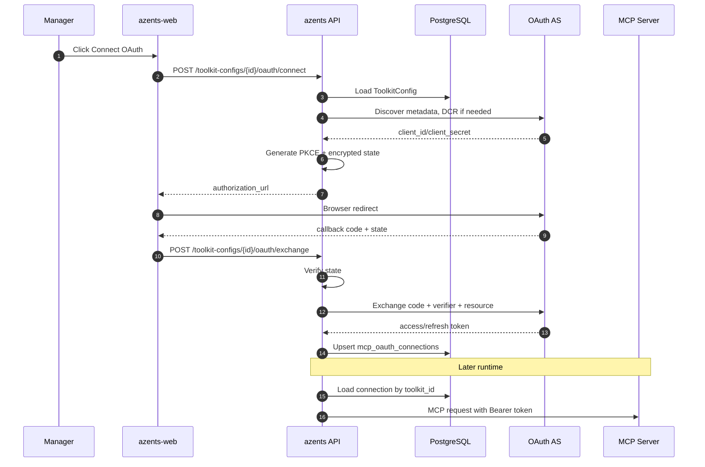
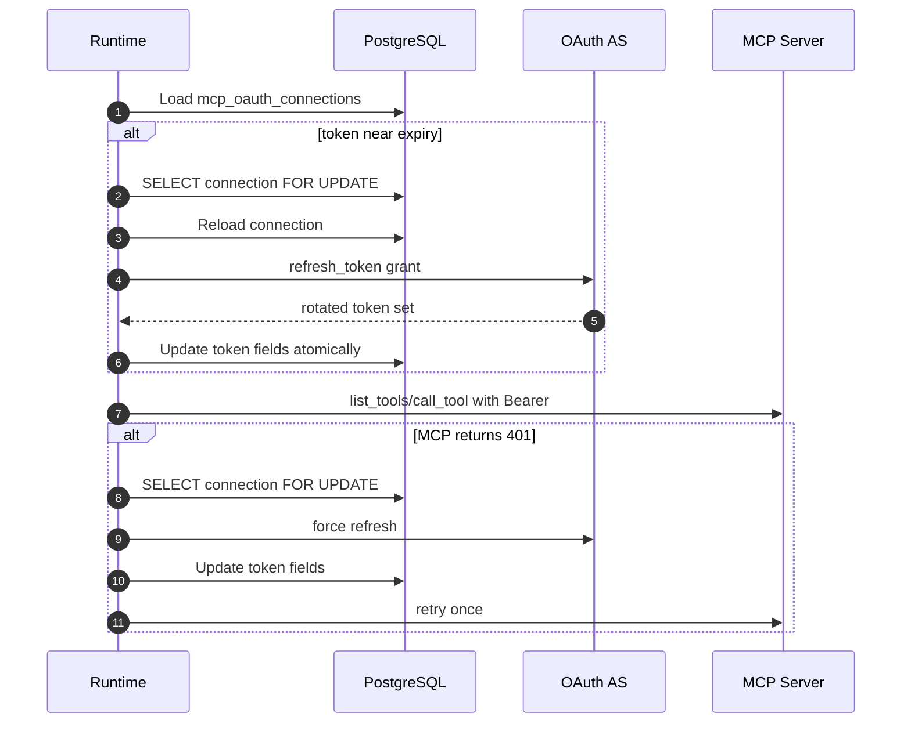

# MCP Toolkit OAuth Connections

## Overview

Azents will remove MCP per-user OAuth and replace it with toolkit-level OAuth connections for generic MCP, Notion, and Sentry toolkits. A workspace manager connects OAuth once for a `ToolkitConfig`; agent runs using that toolkit use the same connection regardless of the current actor.

The feature keeps OAuth standards compatibility: authorization code, PKCE S256, RFC 8414 metadata discovery, RFC 7591 Dynamic Client Registration (DCR), and RFC 8707 resource indicator. It removes user-specific authorization request events and stores connection state in a new `mcp_oauth_connections` table.

## Requirements

### REQ-1. Remove per-user MCP OAuth

Remove `oauth2_per_user`, per-user token lookup, `MCPAuthRequest`, per-user authorize tools/events, and per-user OAuth APIs.

Related decisions: [toolkit-260623/ADR-D1](../adr/toolkit-260623-toolkit-level-mcp-oauth.md)

Acceptance criteria:

- `oauth2_per_user` is not a valid MCP auth type.
- Runtime never looks up `(toolkit_id, user_id)` OAuth tokens for MCP.
- `mcp_oauth2_tokens` and `mcp_auth_requests` are dropped by migration.
- Regular users cannot start an MCP OAuth connection flow.

### REQ-2. Add toolkit-level MCP OAuth under `auth_type=oauth2`

Generic MCP, Notion, and Sentry use `auth_type=oauth2` for toolkit-level OAuth connections.

Related decisions: [toolkit-260623/ADR-D2](../adr/toolkit-260623-toolkit-level-mcp-oauth.md)

Acceptance criteria:

- Generic MCP configuration can select `oauth2`.
- Notion and Sentry providers resolve to MCP configs using `auth_type=oauth2`.
- Runtime uses a toolkit-owned OAuth connection, not user-bound credentials.

### REQ-3. Persist OAuth connection in `mcp_oauth_connections`

Store OAuth endpoints, client registration, encrypted tokens, expiration, scope, and status in a dedicated connection table owned by `ToolkitConfig`.

Related decisions: [toolkit-260623/ADR-D3](../adr/toolkit-260623-toolkit-level-mcp-oauth.md)

Acceptance criteria:

- Each toolkit has at most one MCP OAuth connection.
- Access/refresh tokens are encrypted with `CredentialCipher`.
- Connection status can represent `connected` and `reconnect_required`.
- Toolkit deletion cascades to the OAuth connection.

### REQ-4. Provide manager-only OAuth connection APIs

Expose connect, exchange, and disconnect APIs for toolkit OAuth connection management.

Related decisions: [toolkit-260623/ADR-D4](../adr/toolkit-260623-toolkit-level-mcp-oauth.md)

Acceptance criteria:

- Manager+ can start connect, exchange a callback code, and disconnect.
- Non-managers receive 403.
- The state payload binds toolkit, workspace, redirect URI, and PKCE verifier.
- Exchange stores/updates `mcp_oauth_connections`.

### REQ-5. Refresh tokens lazily with row locking

Refresh near-expiry tokens and 401 failures using a row lock on the OAuth connection.

Related decisions: [toolkit-260623/ADR-D5](../adr/toolkit-260623-toolkit-level-mcp-oauth.md)

Acceptance criteria:

- Runtime refreshes when `expires_at <= now + 5 minutes`.
- Concurrent refresh for the same toolkit is serialized.
- A 401 retries once after a forced refresh.
- `invalid_grant` transitions the connection to `reconnect_required`.

### REQ-6. Show OAuth connection status/actions in toolkit UI

The toolkit form shows connection status and connect/reconnect/disconnect actions without warning copy.

Related decisions: [toolkit-260623/ADR-D6](../adr/toolkit-260623-toolkit-level-mcp-oauth.md)

Acceptance criteria:

- UI shows not connected / connected / reconnect required.
- UI shows issuer, resource, scope, and expiration when available.
- UI exposes connect/reconnect/disconnect actions.
- No warning paragraph is added.

## Decision Table

| ADR decision | Requirements |
| --- | --- |
| [toolkit-260623/ADR-D1](../adr/toolkit-260623-toolkit-level-mcp-oauth.md) | REQ-1 |
| [toolkit-260623/ADR-D2](../adr/toolkit-260623-toolkit-level-mcp-oauth.md) | REQ-2 |
| [toolkit-260623/ADR-D3](../adr/toolkit-260623-toolkit-level-mcp-oauth.md) | REQ-3 |
| [toolkit-260623/ADR-D4](../adr/toolkit-260623-toolkit-level-mcp-oauth.md) | REQ-4 |
| [toolkit-260623/ADR-D5](../adr/toolkit-260623-toolkit-level-mcp-oauth.md) | REQ-5 |
| [toolkit-260623/ADR-D6](../adr/toolkit-260623-toolkit-level-mcp-oauth.md) | REQ-6 |

## Discussion Points and Decisions

### OAuth owner

Decision: the OAuth connection belongs to `ToolkitConfig`.

Reason: this matches current toolkit lifecycle and avoids introducing workspace-provider connection entities.

### Support scope

Decision: generic MCP supports `auth_type=oauth2`; Notion and Sentry use the same infrastructure as presets.

Reason: generic MCP is the power-user path and should support standard remote MCP OAuth servers.

### Per-user removal

Decision: hard-delete per-user OAuth and disable/migrate existing per-user configs without token promotion.

Reason: per-user grants must not silently become toolkit-level credentials.

### API shape

Decision: use manager-only connect/exchange/disconnect endpoints under toolkit config routes.

Reason: this gives clear API semantics and avoids preserving legacy per-user endpoint names.

### Storage

Decision: add `mcp_oauth_connections`.

Reason: row locking, status, and token rotation are first-class needs.

### Refresh

Decision: request-time lazy refresh with row lock.

Reason: it is safe enough for rotating refresh tokens without adding background jobs.

### UI

Decision: show status/actions but no warning copy.

Reason: operators need connection controls, but warning text is intentionally omitted.

## Architecture



### Runtime refresh



## Data Model

### `mcp_oauth_connections`

| Column | Type | Notes |
| --- | --- | --- |
| `id` | string(32) | uuid7 hex primary key |
| `toolkit_id` | string(32) | FK `toolkit_configs.id`, unique, cascade delete |
| `issuer` | text nullable | AS issuer when known |
| `resource` | text nullable | RFC 8707 resource indicator, default MCP server URL |
| `server_url` | text | MCP server URL at connection time |
| `authorization_endpoint` | text | OAuth authorize endpoint |
| `token_endpoint` | text | OAuth token endpoint |
| `registration_endpoint` | text nullable | DCR endpoint |
| `encrypted_client_id` | text | encrypted client ID |
| `encrypted_client_secret` | text nullable | encrypted client secret when issued/required |
| `token_endpoint_auth_method` | string(64) | `none`, `client_secret_basic`, or `client_secret_post` |
| `scope` | text nullable | granted/requested scope string |
| `encrypted_access_token` | text nullable | encrypted access token |
| `encrypted_refresh_token` | text nullable | encrypted refresh token |
| `expires_at` | timestamptz nullable | access-token expiration |
| `status` | PostgreSQL ENUM | `connected`, `reconnect_required` |
| `created_at` | timestamptz | server default |
| `updated_at` | timestamptz | server default/on update |

### Removed tables

- `mcp_oauth2_tokens`
- `mcp_auth_requests`

### Existing ToolkitConfig data

Migration disables existing `oauth2_per_user` toolkit configs. It does not promote per-user grants.

## Provider and Runtime Implementation

### Auth type model

`McpToolkitConfig.auth_type` keeps existing `oauth2` as the only OAuth auth type for authorization-code MCP OAuth. `per_user_oauth_mode` is removed. DCR is attempted when an OAuth connection does not already have a client registration and metadata exposes `registration_endpoint`; otherwise manager-supplied client metadata must be present in connection setup.

### Connection repository

`McpOAuthConnectionRepository` owns:

- `get_by_toolkit_id`
- `get_by_toolkit_id_for_update`
- `upsert_connected`
- `mark_reconnect_required`
- `delete_by_toolkit_id`

The repository decrypts token/client fields on read and encrypts them on write.

### Runtime resolve

MCP provider resolve flow:

1. Validate `McpToolkitConfig`.
2. If `auth_type != oauth2`, use existing static credential behavior.
3. If `auth_type == oauth2`, load `McpOAuthConnection` by toolkit id.
4. If missing or `reconnect_required`, return toolkit state with no tools and a setup-required prompt.
5. Ensure an access token through lazy refresh if needed.
6. Bind access token as `_secret` for `Authorization: Bearer`.
7. Install `on_auth_failure` callback for forced refresh on 401.

### Notion and Sentry

Notion and Sentry providers convert their service-specific configs into `McpToolkitConfig` with `auth_type=oauth2` and the official MCP server URL defaults. They no longer inject token/auth-request repositories.

## API

### Connect

```http
POST /toolkit/v1/workspaces/{handle}/toolkit-configs/{toolkit_config_id}/oauth/connect
```

Response:

```json
{
  "authorization_url": "https://provider.example/authorize?..."
}
```

Requires `TOOLKITS_WRITE`.

### Exchange

```http
POST /toolkit/v1/workspaces/{handle}/toolkit-configs/{toolkit_config_id}/oauth/exchange
```

Request:

```json
{
  "code": "authorization-code",
  "state": "encrypted-state"
}
```

Response: `204 No Content`.

Requires `TOOLKITS_WRITE`.

### Disconnect

```http
DELETE /toolkit/v1/workspaces/{handle}/toolkit-configs/{toolkit_config_id}/oauth/connection
```

Response: `204 No Content`.

Requires `TOOLKITS_WRITE`.

### Toolkit response fields

Toolkit config read responses include OAuth connection summary for MCP OAuth toolkits:

```json
{
  "oauth_connection": {
    "status": "connected",
    "issuer": "https://mcp.notion.com",
    "resource": "https://mcp.notion.com/mcp",
    "scope": "...",
    "expires_at": "2026-06-23T12:00:00Z"
  }
}
```

## Frontend (UI/UX)

`McpConfigFields` exposes `oauth2` in the auth type list. When selected, it shows OAuth metadata fields needed for custom MCP servers, such as scopes and optional discovery/auth/token URL overrides.

Toolkit edit view shows an OAuth connection panel:

```text
OAuth connection

Status: Connected
Issuer: https://mcp.notion.com
Resource: https://mcp.notion.com/mcp
Scope: ...
Expires: 2026-06-23 12:00 UTC

[Reconnect] [Disconnect]
```

No warning paragraph is shown.

## Infrastructure

No Kubernetes or cloud infrastructure change is required.

## Feasibility Verification

| Item | Result |
| --- | --- |
| Notion supports hosted remote MCP OAuth + DCR + PKCE | Confirmed in Notion MCP docs |
| Sentry remote MCP exposes OAuth metadata, DCR, PKCE | Confirmed through Sentry MCP metadata/docs |
| Existing code has reusable PKCE/state/discovery/DCR helpers | Confirmed in `core/oauth2.py` and `core/mcp_discovery.py` |
| Existing runtime uses MCP bearer headers | Confirmed in `engine/tools/mcp_base.py` |
| Existing per-user path is removable | Confirmed by grep across repos/tests/docs |

## Test Strategy

Product behavior verification is E2E-first. Unit and integration tests are implementation checks, not QA evidence.

### E2E primary verification matrix

| Behavior | Primary verification |
| --- | --- |
| Manager connects generic MCP OAuth toolkit | azents E2E creates toolkit, uses mock MCP/OAuth server, calls connect/exchange, asserts connected summary |
| Agent uses toolkit OAuth connection | azents E2E attaches toolkit to agent, runs tool, asserts mock MCP receives bearer token |
| Token refresh | azents E2E or testenv mock forces expired token and verifies refresh + retry |
| Reconnect required | azents E2E mock returns invalid_grant and asserts toolkit status/prompt |
| UI connection controls | Playwright/component E2E verifies connect/reconnect/disconnect states if frontend E2E harness supports toolkit pages |

### Fixture and prerequisite requirements

- Mock remote MCP/OAuth server fixture with metadata, DCR, authorize, token, list_tools, and call_tool endpoints.
- User/workspace/agent seed.
- No live Notion/Sentry credential required for deterministic CI.

### Credential/prerequisite snapshot requirements

Live Notion/Sentry verification is optional and must use prerequisite snapshots if added later. Deterministic CI uses only mock credentials and must not require external OAuth accounts.

### Evidence format

- E2E command output.
- Mock server request log summary showing Authorization bearer use.
- API response snippets with connection status.

### CI policy

Deterministic E2E runs in normal CI. Live external OAuth tests, if added, are opt-in only.

### Optional/live skip/fail criteria

- Deterministic mock OAuth tests must pass.
- Live Notion/Sentry tests may skip when credentials are absent.
- Requested live verification fails if credentials are configured but OAuth flow fails.

## QA Checklist

### QA-1. Manager connects an OAuth MCP toolkit

#### What to check

A manager can start connect, complete exchange, and observe a connected OAuth connection on the toolkit.

#### Why it matters

This is the replacement for per-user OAuth setup and validates the new manager-owned connection model.

#### How to check

Run azents E2E against a mock MCP/OAuth server. Create toolkit with `auth_type=oauth2`, call connect, simulate provider callback, call exchange, then read toolkit config.

#### Expected result

Toolkit response includes `oauth_connection.status == "connected"`, issuer/resource/scope fields, and encrypted token data exists only in DB.

#### Execution result

TBD

#### Fixes applied

TBD

### QA-2. Agent runtime uses toolkit OAuth bearer token

#### What to check

After connection, agent runtime calls MCP list/call with the toolkit OAuth access token.

#### Why it matters

This proves runtime no longer depends on per-user token lookup.

#### How to check

Attach the connected toolkit to an agent and run an E2E tool call. Inspect mock MCP request log.

#### Expected result

Mock MCP receives `Authorization: Bearer <access_token>` and the tool call succeeds.

#### Execution result

TBD

#### Fixes applied

TBD

### QA-3. Refresh is serialized and updates rotated tokens

#### What to check

An expired token is refreshed under lock and rotated refresh token is stored.

#### Why it matters

Notion-style refresh token rotation can break without single-flight refresh.

#### How to check

Seed an expired connection, issue two concurrent runtime calls in E2E or integration-backed testenv, and have the mock token endpoint count refresh calls.

#### Expected result

Only one refresh is accepted for the old token; both calls complete with the new access token or one waits and reuses the refreshed token.

#### Execution result

TBD

#### Fixes applied

TBD

### QA-4. invalid_grant requires reconnect

#### What to check

Refresh `invalid_grant` transitions the connection to `reconnect_required`.

#### Why it matters

Revoked/rotated-away tokens must not loop or silently fail.

#### How to check

Seed an expired connection and configure mock AS to return `invalid_grant`.

#### Expected result

Connection status becomes `reconnect_required`; runtime does not expose MCP tools until reconnect.

#### Execution result

TBD

#### Fixes applied

TBD

### QA-5. Per-user OAuth is unavailable

#### What to check

`oauth2_per_user` cannot be configured or executed.

#### Why it matters

This confirms the removal is complete and no legacy fallback remains.

#### How to check

Attempt to create/update a toolkit with `auth_type=oauth2_per_user` through public API and run migration-backed checks for old configs.

#### Expected result

API validation rejects the auth type or migration disables existing configs; no per-user tables are used.

#### Execution result

TBD

#### Fixes applied

TBD

## Implementation Plan

### Phase 1. Documentation

- Add [toolkit-260623/ADR](../adr/toolkit-260623-toolkit-level-mcp-oauth.md).
- Add this design document.

### Phase 2. Backend data layer

- Add `RDBMCPOAuthConnection` and enum.
- Generate migration for `mcp_oauth_connections` and per-user table removal.
- Add repository and data model.

### Phase 3. Backend OAuth API

- Add connect/exchange/disconnect endpoints.
- Replace state payload with toolkit/workspace/verifier binding.
- Reuse discovery/DCR/PKCE/token helpers.

### Phase 4. Runtime

- Remove per-user OAuth contexts and request authorization tool.
- Resolve `auth_type=oauth2` through `McpOAuthConnectionRepository`.
- Implement lazy locked refresh and 401 retry.
- Convert Notion/Sentry to `auth_type=oauth2`.

### Phase 5. Frontend/API clients

- Regenerate OpenAPI clients.
- Update MCP toolkit form auth type choices.
- Add OAuth connection status/action UI.
- Remove per-user OAuth messages.

### Phase 6. Spec and validation

- Update toolkit domain spec and MCP OAuth flow spec.
- Run quality checks and E2E/mock tests.

## Alternatives Considered

### Keep per-user OAuth as deprecated fallback

Rejected by [toolkit-260623/ADR-D1](../adr/toolkit-260623-toolkit-level-mcp-oauth.md). It preserves the complexity the feature aims to remove.

### Store tokens in `ToolkitConfig.encrypted_credentials`

Rejected by [toolkit-260623/ADR-D3](../adr/toolkit-260623-toolkit-level-mcp-oauth.md). A dedicated connection row better supports locking and status.

### Workspace-level provider connections

Rejected for this phase. ToolkitConfig-level ownership is enough and smaller.

### Background refresh

Rejected by [toolkit-260623/ADR-D5](../adr/toolkit-260623-toolkit-level-mcp-oauth.md). Lazy refresh is simpler and sufficient.

### OAuth warning copy in UI

Rejected by [toolkit-260623/ADR-D6](../adr/toolkit-260623-toolkit-level-mcp-oauth.md). Status/actions are shown without warning copy.
