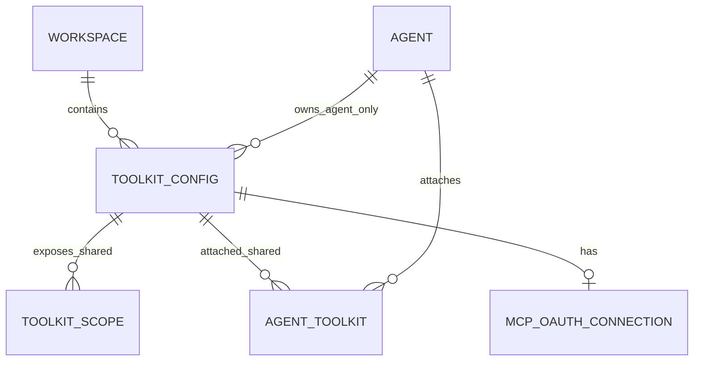

# Agent-Scoped Toolkit Management Design

- Snapshot: `toolkit-260907`
- Document reference: `toolkit-260907/DESIGN`
- Requirements:
  [`toolkit-260907/REQ`](../requirements/toolkit-260907-agent-scoped-management.md)
- Decisions:
  [`toolkit-260907/ADR`](../adr/toolkit-260907-agent-scoped-management.md)

## Scope

This Design adds Agent-owned persisted Toolkit configurations to the saved Agent
settings flow while preserving Workspace-shared Toolkit management and the existing
non-administrator attachment contract.

An Agent-owned Toolkit remains a normal `ToolkitConfig` for provider validation,
credential encryption, OAuth connection state, revisioning, and runtime construction.
Its nullable owning-Agent foreign key is the ownership and automatic availability
source of truth. `AgentToolkit` continues to represent only explicit attachments of
Workspace-shared ToolkitConfigs.

The snapshot does not add Toolkit setup to Agent creation, Chat guidance, automatic
attachment, a draft resource, a new provider, Session- or user-scoped selection,
ownership conversion, or a replacement for the current user-configured slug model.

## Current Behavior and Gaps

`ToolkitConfig` is currently Workspace-owned, every create operation adds a Workspace
`ToolkitScope`, and `(workspace_id, slug)` is unique. Workspace Toolkit CRUD and most
provider setup routes authorize `TOOLKITS_WRITE`, which Workspace Managers possess.
Agent settings list `AgentToolkit` attachment rows and allow current users with
`TOOLKITS_READ` to attach or detach enabled Workspace-scoped configurations.

Runtime resolution and managed VFS eligibility both treat `AgentToolkit` as the complete
persisted Toolkit source. Platform GitHub App impact reporting also counts only Agents
referenced by `AgentToolkit`. MCP OAuth state and callbacks bind Workspace and Toolkit
context and return to Workspace Toolkit management.

These assumptions cannot represent an Agent-only Toolkit because:

- Workspace Manager authority would be broader than the confirmed Agent-only authority;
- Workspace and available lists would disclose an Agent-owned object;
- an AgentToolkit projection would duplicate ownership and could drift or become
  orphaned;
- Workspace-wide slug uniqueness would prevent unrelated Agents from using the same
  natural prefix; and
- current OAuth and callback context cannot prove the owning Agent or return to the
  Agent settings flow.

## Requirements and ADR Traceability

| Requirement | Design mechanisms | ADR authority |
| --- | --- | --- |
| `toolkit-260907/REQ-1` | M4, M6 | D4 |
| `toolkit-260907/REQ-2` | M4, M6 | D2, D4 |
| `toolkit-260907/REQ-3` | M1, M4, M5, M6 | D1, D2, D4 |
| `toolkit-260907/REQ-4` | M4, M5, M7 | D1, D4 |
| `toolkit-260907/REQ-5` | M4, M6 | D4 |
| `toolkit-260907/REQ-6` | M5, M6 | D4 |
| `toolkit-260907/REQ-7` | M1, M4, M5, M6 | D1, D2, D4 |
| `toolkit-260907/REQ-8` | M1, M2, M3, M7 | D1, D2, D3 |
| `toolkit-260907/REQ-9` | M2, M4, M6, M7, M8 | D2, D4 |
| `toolkit-260907/REQ-10` | M6 | D4 |

## Architecture and Ownership



A `ToolkitConfig` has exactly one ownership interpretation:

- `owner_agent_id IS NULL`: Workspace-shared. Existing Workspace Toolkit CRUD,
  Workspace scope, availability, and `AgentToolkit` attachment semantics apply.
- `owner_agent_id IS NOT NULL`: Agent-only. The referenced Agent owns management and
  lifecycle; no ToolkitScope or AgentToolkit row is created for availability.

`workspace_id` remains required for every ToolkitConfig. It retains tenant isolation,
provider validation context, Workspace deletion behavior, and runtime Workspace
identity. The authoritative Agent-owned create/update transaction verifies that the
owner Agent belongs to the same Workspace. Ownership is immutable after creation.

Runtime contains no configuring Human identity. After an authorized management
operation stores the ToolkitConfig, later execution depends only on Workspace, Agent,
ToolkitConfig, enabled/readiness state, and existing provider runtime behavior.

## M1. Agent Ownership Schema and Lifecycle

Add nullable `toolkit_configs.owner_agent_id` with a named index and a foreign key to
`agents.id` using `ON DELETE CASCADE`.

Replace `uq_toolkit_configs_workspace_slug` with two partial unique indexes:

- Workspace-shared: unique `(workspace_id, slug)` where `owner_agent_id IS NULL`;
- Agent-owned: unique `(owner_agent_id, slug)` where `owner_agent_id IS NOT NULL`.

Every existing ToolkitConfig receives `owner_agent_id = NULL` and therefore retains its
current Workspace-shared meaning. No data is copied and no AgentToolkit or ToolkitScope
row is synthesized.

Shared Toolkit creation continues to create a Workspace ToolkitScope. Agent-owned
creation creates no ToolkitScope. Workspace list, available-list, scope, Workspace CRUD,
Workspace provider-setup, and shared attach repository operations explicitly require
`owner_agent_id IS NULL`; they never rely only on `workspace_id` after this migration.
Agent-owned item operations require both `owner_agent_id = path_agent_id` and matching
Workspace context.

Deleting an Agent-owned ToolkitConfig cascades its MCP OAuth connection and other
existing ToolkitConfig-owned rows, including encrypted credentials stored on the
ToolkitConfig itself. Agent decommission ultimately deletes the Agent; the owner foreign
key then cascades every Agent-owned ToolkitConfig and its credential/OAuth state. The
existing finalizer continues to remove shared AgentToolkit attachments explicitly before
deleting the Agent. Workspace deletion continues to delete all ToolkitConfigs through
the required `workspace_id` foreign key.

PATCH contracts do not expose `owner_agent_id`, `workspace_id`, or `toolkit_type`.
Conversion or copying between ownership models is not supported.

## M2. Canonical Effective Toolkit Relation

The Toolkit repository owns one canonical effective relation for an Agent. Its shared
branch joins `AgentToolkit` to enabled ToolkitConfigs with `owner_agent_id IS NULL`. Its
Agent-owned branch selects enabled ToolkitConfigs with `owner_agent_id = agent_id`.
Both branches require the expected Workspace ID and return one typed projection with:

- ToolkitConfig data, including decrypted credentials only inside trusted backend
  service/runtime boundaries;
- source kind: `shared_attachment` or `agent_owned`;
- shared AgentToolkit ID when applicable; and
- the persisted ToolkitConfig revision.

The relation is deterministic with shared attachments first in their existing attachment
creation order, followed by Agent-owned configs in config creation order, with
ToolkitConfig ID as the final tie-breaker. It uses the ToolkitConfig's canonical
`toolkit_type` rather than the denormalized attachment copy. The shared branch ignores
any out-of-band AgentToolkit row that points to an Agent-owned ToolkitConfig.

The repository exposes typed operations backed by this same relation:

1. list effective ToolkitConfigs for one Agent and Workspace;
2. build provider release-source eligibility for managed VFS; and
3. count or list distinct effective Agents for a set of ToolkitConfig IDs for Platform
   GitHub App impact reporting.

`resolve_agent_tools()` and `VfsProjectionService._eligible_provider_specs()` stop
assembling the effective set independently from `AgentToolkitRepository.list_by_agent()`.
Platform GitHub App impact counting unions shared attachment Agent IDs with direct
`owner_agent_id` values. Future consumers that mean "Toolkits usable by this Agent" must
use the canonical relation rather than querying AgentToolkit directly.

Agent settings attachment APIs remain attachment APIs and continue to read
`AgentToolkit` directly because they represent only Workspace-shared attachment state,
not the complete runtime-effective set.

## M3. Serialized Effective Slug Integrity

The configured ToolkitConfig slug remains the model-visible prefix. Local partial unique
indexes enforce each ownership domain, while application transactions enforce uniqueness
across the two effective sources for each Agent.

All effective-membership mutations use one lock order:

1. lock an existing affected ToolkitConfig row first when the operation has one;
2. resolve all affected Agent IDs;
3. lock Agent rows with `SELECT ... FOR UPDATE` in ascending Agent-ID order; and
4. read the resulting canonical effective relation and validate unique enabled slugs
   before mutation commit.

The operation-specific boundaries are:

- shared attach: lock the shared ToolkitConfig, then the target Agent, validate the
  resulting set, and insert AgentToolkit in the same transaction;
- Agent-owned create: lock the owner Agent, validate the candidate slug when enabled,
  and insert the ToolkitConfig in the same transaction;
- Agent-owned slug update or disabled-to-enabled transition: lock the ToolkitConfig and
  owner Agent, then validate the resulting set;
- shared slug update or disabled-to-enabled transition: lock the shared ToolkitConfig,
  resolve attached Agent IDs, lock those Agents in deterministic order, and validate
  every resulting set; and
- detach, disable, and delete use the same ordering where they overlap another effective
  mutation, although removal alone cannot introduce a duplicate.

Locking the shared ToolkitConfig before reading attachments prevents a concurrent attach
from being omitted by a shared slug update. Agent locks serialize cross-source changes
for the same effective namespace. Local unique-index violations and effective conflicts
map to distinct typed repository/service errors and a `409 Conflict` response.

Conflict responses state that the slug conflicts with another Toolkit available to the
Agent. A shared update rejected because of an Agent-owned conflict does not identify the
Agent-owned Toolkit, its owner, credentials, or configuration.

The canonical runtime list defensively verifies that enabled slugs are unique before
resolving any provider. An invariant violation raises an internal typed resolution error,
logs Workspace, Agent, duplicate slug, and involved Toolkit IDs without credentials, and
fails the run/VFS construction before publishing a partial tool catalog.

## M4. Agent-Nested Management and Shared API Isolation

Add an Agent-nested Public API route family under:

```text
/toolkit/v1/workspaces/{handle}/agents/{agent_id}/toolkit-configs
```

The family contains:

- `GET` collection: authorized Agent Toolkit management projection;
- `POST` collection: create an Agent-owned ToolkitConfig;
- `POST /test-connection`: test unsaved Agent-owned form values;
- `GET /{toolkit_config_id}`: read one Agent-owned config;
- `PATCH /{toolkit_config_id}`: update, enable, or disable it;
- `DELETE /{toolkit_config_id}`: delete it;
- `POST /{toolkit_config_id}/test-connection`: test saved state;
- Agent-nested GitHub Platform App install URL, user OAuth URL, and installation-list
  operations needed by GitHub configuration; and
- the OAuth routes defined in M5.

Every boundary resolves an active Agent in the path Workspace and checks current
Workspace Owner or explicit AgentAdmin authority. Collection/create requests that lack
management authority return a generic `403` describing the required role. Item requests
that are missing, cross-Workspace, owned by another Agent, or requested without current
management authority return the same `404` boundary so they do not reveal existence.

The management collection returns a redacted discriminated projection:

- `workspace_shared`: attached shared config summary, AgentToolkit attachment ID,
  ownership label, known readiness, and the Workspace management boundary;
- `agent_only`: full non-secret Agent-owned config, ownership label, known readiness,
  and Agent-owned management actions; and
- eligible unattached Workspace-shared candidates grouped by Toolkit type.

Credentials are represented only by `has_credentials`; no plaintext or ciphertext is
returned. Known readiness is derived from persisted facts:

- `disabled` when the ToolkitConfig is disabled;
- `authorization_required` when the existing MCP or GitHub authorization projection is
  missing, disconnected, or requires reconnect;
- `ready` when enabled and no persisted setup blocker is known; and
- immediate `validation_failed` or `connection_failed` form state for a failed create,
  update, or connection-test request.

`ready` does not add a durable provider-health claim. Live provider failures continue to
use existing connection-test and runtime behavior.

Existing Workspace routes keep their current permission contracts, response shapes, and
operation IDs, but become shared-only through ownership-aware service lookups. Existing
`/agents/{agent_id}/toolkits` list/attach/detach routes remain Workspace-shared
attachment routes with `TOOLKITS_READ`; attach rejects Agent-owned Toolkit IDs. Existing
non-administrator responses never include the new management projection or Agent-owned
items.

The Agent response exposes one requester-relative boolean indicating whether enhanced
Agent Toolkit management is available. It is derived from the already-computed Workspace
Owner or explicit AgentAdmin authority and contains no Toolkit existence or state. The
frontend uses it only to choose the enhanced management flow; users without the flag
retain the current shared attachment UI and behavior.

Routes call an authorization-aware service boundary; provider setup logic and
repositories are not invoked directly from new route handlers. Shared routes that load a
ToolkitConfig for OAuth or testing also move through the same ownership-aware service
boundary so an ID guess cannot bypass the shared-only filter.

## M5. Agent-Scoped Provider Setup and OAuth Context

Provider-specific config validation, credential validation/encryption, connection
testing, GitHub installation validation, MCP discovery, DCR, PKCE, token exchange, and
MCP OAuth connection storage remain common services. Agent and Workspace routes supply
different authorized ownership contexts to those services.

Agent-owned MCP OAuth uses explicit nested routes:

```text
POST   /workspaces/{handle}/agents/{agent_id}/toolkit-configs/{id}/oauth/connect
POST   /workspaces/{handle}/agents/{agent_id}/toolkit-configs/{id}/oauth/exchange
DELETE /workspaces/{handle}/agents/{agent_id}/toolkit-configs/{id}/oauth/connection
```

The Agent OAuth state is a typed payload distinct from the existing Workspace Toolkit
state. It binds:

- state kind;
- Workspace ID;
- Agent ID;
- ToolkitConfig ID;
- initiating User ID;
- exact redirect URI;
- PKCE verifier;
- nonce; and
- a bounded callback target identifying the Agent Toolkit settings context.

The provider redirect URI includes the Workspace handle, Agent ID, and ToolkitConfig ID
needed by the Web callback. Exchange verifies the encrypted state, path identities,
current authenticated User, exact redirect URI, Toolkit ownership, active Agent, and
current Owner/AgentAdmin authority before exchanging or storing tokens. Disconnect
performs the same current authority and ownership checks. A signed start state is never
accepted as continuing authorization after an administrator is removed.

The MCP callback page chooses the Workspace-shared or Agent-owned exchange operation from
its explicit callback context. Agent-owned completion notifies the opener and provides a
fallback return target to the owning Agent's saved settings Toolkit section. Callback
parameters and postMessage payload contain identifiers and success state only; tokens,
credentials, state plaintext, and provider secrets are never rendered.

Unsaved connection testing has no ToolkitConfig and creates no resource. A saved Toolkit
that still needs external OAuth uses the existing absent/reconnect-required connection
state. Cancelling or failing external authorization leaves the saved ToolkitConfig in
that state and permits a new connect attempt.

Agent-nested GitHub Platform App setup operations revalidate Agent authority while still
validating selected installations against the initiating User's synchronized GitHub
installation access. Platform App identity and credential binding remain server-owned.

## M6. Saved Agent Settings Flow

The existing Toolkit section in saved Agent settings becomes a container/component flow
with a discriminated UI state rather than embedding query and mutation state in the
presentational component.

For an authorized Agent administrator:

1. `Add Toolkit` opens Toolkit type selection using the existing persisted provider
   catalog.
2. After type selection, the administrator chooses an eligible Workspace-shared
   candidate or `Configure for this Agent`.
3. Shared selection shows its `Workspace shared` ownership and management boundary and
   attaches only after explicit confirmation.
4. Agent-only selection reuses the applicable existing provider config, credential,
   connection-test, GitHub setup, and OAuth controls inside Agent settings.
5. Save creates the ToolkitConfig only after local and server validation succeeds.
6. Saved cards show `Workspace shared` or `This Agent only`, text readiness, and only the
   ownership-correct next actions.

A Workspace-shared card supports detach. Workspace object edit, disable, reauthorization,
and deletion remain Workspace management actions; the UI links there only when the
requester has the existing Workspace permission and otherwise identifies a Workspace
Manager or Owner as the request target. An Agent-only card supports edit, test,
enable/disable, reconnect, and delete for current Agent managers.

Agent-only deletion uses an explicit confirmation that the Toolkit is removed from this
Agent and stored credentials are deleted. Shared detach copy does not imply object or
credential deletion.

Before the first successful save, form values remain client state. Server validation and
connection-test errors stay associated with their fields and preserve entered values.
Closing or cancelling the unsaved flow clears the state and creates no ToolkitConfig.
The setup flow is rendered only for an existing Agent ID; Agent creation remains
unchanged.

Users without Agent Toolkit management authority retain the current shared attachment
section and receive no Agent-only list item, label, readiness state, action, or new
permission prompt. Chat and Session surfaces are unchanged.

The management component provides:

- keyboard-reachable type, ownership, candidate, save, retry, reconnect, detach, and
  delete-confirmation controls;
- visible focus on failed fields and dialog return focus;
- text status independent of color and icons;
- a mobile order of type, ownership, readiness, then primary action; and
- aligned English, Korean, Japanese, and French message keys using established Toolkit
  terminology.

Meaningful pure UI states receive colocated Storybook stories. Browser E2E covers
keyboard and narrow-layout task order.

## M7. Isolation and Credential Safety

Agent-owned list/read/write operations always begin from path Agent authority and an
ownership-filtered ToolkitConfig lookup. Workspace-shared routes always begin from a
shared-only lookup. This prevents a Workspace Manager, another Agent administrator, or a
non-administrator from discovering an Agent-owned resource by ID through existing
Workspace APIs.

Repository and service outputs separate trusted credential-bearing models from Public
API response models. Existing `CredentialCipher` encryption, redacted
`has_credentials`, MCP OAuth encryption, GitHub Platform App binding, and provider
credential validation remain authoritative. Structured logs and expected conflict/error
responses contain no credential body, ciphertext, OAuth state, token, private key, or
client secret.

Disabling or deleting an Agent-owned Toolkit removes it from the next effective relation
read. Subsequent run construction and VFS projection therefore omit its tools, prompt,
credentials, and provider release resources. Existing immutable AgentRun VFS projections
and already-prepared call catalogs retain their normal snapshot semantics; this snapshot
does not retroactively rewrite an active persisted run.

No configuring User or Agent administration role is copied into ToolkitConfig runtime
state. Runtime execution remains Team-scoped and ownership-independent after management
authorization has completed.

## M8. Compatibility-First Rollout Boundary

Rollout is ordered so no deployed reader that assumes every Workspace ToolkitConfig is
shared can observe an Agent-owned row.

1. **Foundation release:** add the nullable owner column and partial indexes; update all
   Workspace/shared list, item, scope, provider-setup, attach, effective-relation, and
   impact queries to apply explicit ownership semantics. No Agent-owned create route is
   exposed yet.
2. **Capability release:** expose Agent-nested CRUD/setup/OAuth APIs, generated client
   operations, and backend effective consumers.
3. **Product release:** enable the saved Agent settings management flow and required E2E
   coverage.

This ordering is an implementation/deployment boundary, not a user-selectable feature
mode or persistent feature flag. The first release is the minimum rollback target after any
Agent-owned row has been created. Rolling back to code from before shared-only filtering
would be unsafe because it could expose Agent-owned rows through Workspace management.

Schema downgrade is permitted only while every `owner_agent_id` is null. It must fail
rather than delete, detach, or convert Agent-owned rows. Full removal after production
use requires a later confirmed snapshot because automatic Agent-only-to-Workspace
conversion and destructive fallback are outside this authority.

## API and Generated Client Surface

The backend adds typed request/response models for:

- Agent Toolkit management projection and ownership-discriminated items;
- Agent-owned create and partial update;
- known readiness and redacted credential/authorization summaries;
- Agent-owned test connection;
- Agent-owned GitHub Platform App setup; and
- Agent-owned OAuth connect/exchange/disconnect.

OpenAPI is regenerated from the Public API application, then
`@azents/public-client` is regenerated. azents-web tRPC adds distinct Agent-owned
procedures and continues using generated client functions. Existing Workspace and shared
attachment tRPC procedure inputs remain compatible.

Expected API errors are:

- `400` for unsupported Toolkit types or invalid OAuth state/context;
- `403` for an unauthorized collection/create/setup request where no item existence is
  disclosed;
- `404` for missing, cross-Workspace, cross-Agent, ownership-mismatched, or unauthorized
  item access;
- `409` for local or effective slug conflicts and current-state conflicts; and
- `422` for invalid provider config, credentials, or rejected connection/OAuth input.

## Failure, Retry, and Recovery

- Local or provider validation failure before create stores no ToolkitConfig and leaves
  the form editable.
- Unsaved connection-test failure stores no ToolkitConfig, credential, or OAuth row.
- Duplicate local or effective slug returns `409`; the form retains the candidate slug
  for correction.
- OAuth connect or exchange failure leaves the Toolkit disconnected or
  reconnect-required and can be restarted.
- Authority removed between OAuth start and exchange prevents token storage.
- Provider connection failure after save is shown as an immediate test error; no new
  durable health or draft lifecycle is created.
- Disabled Agent-owned Toolkits remain editable but are absent from later effective
  Toolkit reads.
- Delete is terminal for the Agent-owned ToolkitConfig and its stored credentials; there
  is no restore or ownership conversion path.
- Shared detach removes only AgentToolkit and leaves the Workspace ToolkitConfig and its
  credentials unchanged.
- Runtime duplicate-slug invariant failure stops resolution before partial tools or VFS
  sources are published and requires data remediation through an authoritative
  management path.

## Observability and Operations

Management operations emit structured logs with operation, Workspace ID, Agent ID,
ToolkitConfig ID, ownership kind, Toolkit type, result, and conflict category. OAuth logs
add callback kind and authority outcome. Runtime invariant failures log duplicate slug
and involved internal Toolkit IDs. No log includes config credentials, token material,
private keys, OAuth state, authorization codes, or decrypted provider responses.

Expected `4xx` validation, authority, and conflict responses are not reported as internal
service failures. Unexpected repository, encryption, provider, or migration failures
propagate through existing error handling and monitoring.

Operational verification after rollout checks:

- count of non-null `owner_agent_id` rows by Workspace without credential fields;
- absence of Agent-owned rows from Workspace and available-list APIs;
- effective relation counts matching shared attachments plus direct owners; and
- no duplicate enabled effective slugs for any Agent.

No background job, cache, Redis dependency, or infrastructure resource is added.

## Migration and Implementation Boundaries

The schema revision is generated through the repository Alembic workflow and updates
`python/apps/azents/db-schemas/rdb/revision`. Migration verification covers upgrade from
representative existing Workspace Toolkits and a downgrade precondition with and without
Agent-owned rows.

Primary backend boundaries include:

- Toolkit RDB, repository, service, and Public API data models;
- Agent administration authority and active-Agent lookup reuse;
- runtime Toolkit resolution and worker dependency wiring;
- VFS effective provider eligibility;
- Platform GitHub App impact counting;
- MCP OAuth state/service/routes and callback context;
- Agent decommission cascade tests; and
- Public OpenAPI output.

Primary frontend boundaries include:

- generated Public API client;
- Toolkit tRPC procedures;
- saved Agent settings Toolkit container, pure components, provider form reuse, dialogs,
  and Storybook states;
- MCP callback dispatch and Agent-settings return context; and
- all supported locale message files.

Implementation updates the Toolkit domain Spec, MCP OAuth flow Spec, Agent execution-loop
references to effective persisted Toolkits, and Agent domain settings references after
verified code behavior exists.

## Test Strategy

Product behavior verification is E2E-first. Repository, service, migration, concurrency,
and component tests support the E2E evidence but do not replace it.

### E2E primary verification matrix

| Behavior | Primary verification |
| --- | --- |
| Saved-Agent Agent-only setup | Browser E2E opens saved Agent settings, selects a type, configures for this Agent, tests, saves, and sees `This Agent only` plus readiness text |
| Workspace-shared reuse | Browser/API E2E selects an existing candidate, confirms `Workspace shared`, attaches explicitly, and detaches without deleting the shared object |
| Owner and explicit AgentAdmin authority | Public API E2E proves both can manage Agent-owned state while a Workspace Manager or Member without explicit AgentAdmin cannot |
| Non-disclosure | Public API E2E guesses an Agent-owned ID through Workspace and other-Agent routes and receives the common not-found boundary; browser E2E shows no new Agent-only UI to non-admins |
| Runtime and VFS isolation | Required public E2E runs the owning Agent with a deterministic Toolkit, confirms its tool/VFS source, and confirms another Agent and the Workspace available list cannot resolve it |
| Disable and delete | E2E disables then deletes Agent-only state and confirms later owning-Agent runs omit it while a Workspace-shared Toolkit remains unchanged |
| OAuth context and reauthorization | Deterministic mock MCP/OAuth E2E completes Agent-nested connect/exchange, returns to Agent settings, and rejects exchange after AgentAdmin authority is removed |
| Cancellation and validation recovery | Browser E2E preserves inputs after validation/test failure, cancels unsaved setup, re-enters with no created resource, and retries saved authorization |
| Responsive and keyboard flow | Browser E2E completes selection, save, retry, detach, and delete confirmation by keyboard at desktop and narrow viewport widths |

### Backend and concurrency verification

- Migration tests prove existing rows become shared, partial indexes permit equal slugs
  across unrelated Agents, and each local scope rejects duplicates.
- Repository tests cover the canonical effective relation, shared-only filters,
  owner/Workspace consistency, impact aggregation, deterministic order, and defensive
  duplicate detection.
- Transactional integration tests run concurrent shared attach, Agent-owned create,
  shared slug update, and enable operations and prove one conflicting operation returns
  `409` without deadlock or committed duplicate.
- Service/API tests cover Owner, explicit AgentAdmin, Workspace Manager, Member,
  cross-Agent, cross-Workspace, decommissioning Agent, credential redaction, and shared
  route compatibility.
- OAuth tests verify the complete typed state binding, initiating-User equality, current
  authority revalidation, callback dispatch, and no token storage after rejected
  exchange.
- Agent deletion tests verify owner cascade removes ToolkitConfig, encrypted credentials,
  OAuth connection, and dependent rows.
- Runtime and VFS unit tests use the same effective repository projection and fail closed
  on a deliberately corrupted duplicate-slug fixture.

### Frontend verification

- Container tests cover the discriminated loading, legacy shared-only, authorized
  management, setup, validation error, OAuth-required, reconnect-required, disabled,
  deleting, and mutation-failure states.
- Pure component tests and stories cover ownership labels, text readiness, action
  boundaries, delete confirmation, and mobile order.
- tRPC tests verify generated Agent-nested operations and invalidate the management
  projection plus affected shared attachment queries after successful mutations.
- Locale structure tests require aligned keys in English, Korean, Japanese, and French.

### Fixtures and prerequisites

Extend the existing credential-free Toolkit E2E substrate with a deterministic local
Toolkit/MCP/OAuth server supporting metadata discovery, DCR when needed, authorization,
token exchange, connection test, tool listing/call, and request logging. Seed users for
Workspace Owner, Workspace Manager, Member, explicit AgentAdmin, two Agents, one shared
Toolkit, and conflicting/non-conflicting Agent-owned Toolkit cases through public product
APIs only.

No live GitHub, Notion, Sentry, cloud, or Kubernetes credential is required for the
required suite. A future live provider run must consume an explicitly prepared
prerequisite snapshot and must not place secrets in evidence.

### Evidence format

- Required public and browser E2E command output with JUnit artifacts;
- screenshots and page HTML for failed browser cases;
- redacted API response excerpts proving ownership and readiness discriminators;
- mock provider request summaries proving the owning Toolkit was used without exposing
  tokens; and
- migration, concurrency, backend quality, frontend format/lint/typecheck/build, and
  documentation validation output.

### CI and skip/fail policy

All deterministic migration, backend, required public E2E, browser E2E, and frontend
checks are required and must fail rather than skip when their local fixture is available.
Live external-provider verification is optional and skips only when its prepared
credential prerequisite is absent. If a live prerequisite is declared present, provider
setup or OAuth failure fails that requested run.

## Rollout and Rollback

The implementation should ship as reviewable phases following M8:

1. schema, ownership-aware shared filters, effective relation, concurrency primitives,
   and backend compatibility tests;
2. Agent-nested management/setup/OAuth APIs, OpenAPI/client generation, runtime/VFS and
   impact consumer cutover;
3. saved Agent settings UI, callback routing, localization, browser E2E, and Living Spec
   updates; and
4. final cross-layer QA and removal/absence verification.

Each later phase depends on the earlier phase and records `Design delta: None` in its
implementation plan. A material mechanism change returns to Requirements/ADR/Design as
applicable.

Rollback after Agent-owned creation returns to the foundation release, retains the owner
column and rows, and hides the product write surface while preserving isolation. It does
not deploy pre-foundation readers, downgrade the schema, or convert/delete Agent-owned
resources.

## Removal and Replacement

| Existing unit or behavior | Removal authority | Replacement or remaining authority | Removal boundary | Absence verification |
| --- | --- | --- | --- | --- |
| `ToolkitConfig` has no Agent owner | `toolkit-260907/REQ-3`, `REQ-8`; `ADR-D1` | M1 nullable canonical owner | RDB model, repository/domain models, Alembic schema | Schema inspection and migration tests |
| Workspace-wide slug uniqueness includes every ToolkitConfig | `toolkit-260907/ADR-D3` | M1 partial local indexes plus M3 effective checks | Constraint/index declarations and migration | Constraint-name search, index inspection, collision tests |
| Workspace list/item/setup paths treat every same-Workspace ToolkitConfig as shared | `toolkit-260907/REQ-4`, `REQ-8`, `REQ-9`; `ADR-D1`, `ADR-D4` | M1/M4 shared-only and owner-filtered service lookups | Toolkit repository, service, CRUD/scope/OAuth/test routes | Cross-route non-disclosure tests and repository search |
| Runtime and VFS build persisted eligibility only from AgentToolkit | `toolkit-260907/REQ-8`; `ADR-D2` | M2 canonical effective relation | `engine/run/resolve.py`, `services/vfs.py`, dependency wiring and tests | Direct consumer search and owning-Agent runtime/VFS E2E |
| Platform GitHub App impact counts only AgentToolkit attachments | `toolkit-260907/REQ-7`, `REQ-8`; `ADR-D2` | M2 shared-attachment plus direct-owner aggregate | GitHub Platform setting repository/service | Aggregate tests with both ownership kinds |
| MCP OAuth state and callback have Workspace Toolkit context only | `toolkit-260907/REQ-3`, `REQ-4`, `REQ-6`; `ADR-D4` | M5 distinct Agent state, nested exchange, and Agent return target; shared flow remains | OAuth core/service/API, Web callback and tRPC | State-field tests, revoked-authority E2E, callback tests |
| Agent Toolkit UI is a query-coupled shared attach/detach selector | `toolkit-260907/REQ-1` through `REQ-7`, `REQ-10`; `ADR-D4` | M6 container/component ownership-aware setup flow; legacy non-admin behavior remains | Agent settings Toolkit feature, messages, stories | Component/story/browser E2E and non-admin comparison |
| OAuth and connection-test routes directly assemble ownership-sensitive repository access | Project layered-architecture constraint; `toolkit-260907/REQ-4`, `REQ-9`; `ADR-D4` | M4/M5 authorization-aware service boundary | Public Toolkit route modules and service layer | Route dependency tests and no direct Toolkit repository use in affected handlers |
| AgentToolkit projection for Agent-owned Toolkits | None exists and none is authorized | M1 canonical ownership plus M2 direct resolution | No schema/service/UI projection is added | Schema/repository search and Agent-owned E2E with zero AgentToolkit row |
| Pre-feature application rollback after Agent-owned writes | `toolkit-260907/REQ-4`, `REQ-9`; M8 derived isolation requirement | Foundation release is the minimum rollback target | Deployment plan and migration downgrade guard | Rollback runbook review and downgrade precondition test |

## Feasibility

- **REQ-1 — feasible:** the current saved Agent capability settings already render an
  Agent Toolkit section only after an Agent ID exists, so the flow can be expanded
  without changing Agent creation.
- **REQ-2 — feasible:** current available-list and AgentToolkit attach/detach contracts
  already implement explicit Workspace-shared reuse and remain compatible.
- **REQ-3 — feasible:** every persisted provider already resolves from common
  ToolkitConfig config/credential inputs; a canonical owner adds isolation without a
  new provider runtime contract.
- **REQ-4 — feasible:** Agent Runtime, Memory, and other services already derive
  Workspace Owner or explicit AgentAdmin authority from WorkspaceMember context and an
  AgentAdmin repository check.
- **REQ-5 — feasible:** enabled state, MCP OAuth summary, GitHub authorization state,
  redacted credential presence, and immediate test errors provide the required known
  readiness states without inventing durable live health.
- **REQ-6 — feasible:** current forms and test endpoints already support unsaved values;
  separating Agent routes preserves client state while resource creation remains the
  first durable boundary.
- **REQ-7 — feasible:** ToolkitConfig owns encrypted credentials and MCP OAuth rows, and
  existing foreign keys provide deterministic item/Agent/Workspace deletion cascades.
- **REQ-8 — feasible:** runtime, VFS, and GitHub impact have bounded identifiable
  AgentToolkit-only consumers that can move to one canonical effective relation.
- **REQ-9 — feasible:** separate nested routes plus shared-only repository filters retain
  existing operation shapes and prevent Agent-owned projection through non-admin APIs;
  Chat has no dependency on Toolkit management routes.
- **REQ-10 — feasible:** the current Mantine/next-intl application supports keyboard
  dialogs, responsive stacking, all required locales, component stories, and a real
  browser E2E suite.

Overall feasibility is **feasible**. No approved requirement or ADR is blocked by the
current persistence, authorization, provider, runtime, Web, migration, or E2E
boundaries.

## Assumptions and Non-Blocking Risks

- Updating or enabling a popular Workspace-shared Toolkit locks every attached Agent;
  deterministic ordering prevents deadlock, but transaction duration grows with the
  attachment count. Implementation should keep provider/network work outside the locked
  transaction and measure lock duration.
- The owner/Workspace consistency invariant is enforced by authoritative service
  transactions as selected by D1. Defensive effective queries also require the expected
  Workspace so out-of-band corruption fails closed instead of crossing tenants.
- `ready` means enabled with no known persisted authorization blocker. It is not a
  continuous external service-health guarantee.
- Existing reachable persistence permits multiple ToolkitConfigs of the same type for an
  Agent when slugs differ. This snapshot adds no stronger one-per-type constraint.
- Active run and VFS snapshots retain existing immutable lifecycle semantics after a
  Toolkit is disabled or deleted; new runs and later reconciliation use current state.
- Full schema downgrade after Agent-owned data exists is intentionally unsupported
  without a later confirmed data-disposition decision.

## Design Authority

- Design revision: `1`

| ID | Material design mechanism | Authority | Classification |
| --- | --- | --- | --- |
| M1 | Nullable canonical Agent owner, shared/owned local slug indexes, and owner-cascade lifecycle | `toolkit-260907/REQ-3`, `REQ-4`, `REQ-7`, `REQ-8`; `toolkit-260907/ADR-D1`, `ADR-D3` | `decided` |
| M2 | Canonical direct effective relation unions shared attachments and Agent-owned ToolkitConfigs for runtime, VFS, and impact | `toolkit-260907/REQ-3`, `REQ-7`, `REQ-8`, `REQ-9`; `toolkit-260907/ADR-D2` | `decided` |
| M3 | Deterministic ToolkitConfig/Agent locking and effective-slug validation with defensive runtime failure | `toolkit-260907/REQ-3`, `REQ-5`, `REQ-8`, `REQ-9`; `toolkit-260907/ADR-D3` | `decided` |
| M4 | Separate Agent-nested management/setup routes with Owner/AgentAdmin authority and shared-only existing routes | `toolkit-260907/REQ-1` through `REQ-5`, `REQ-7`, `REQ-9`; `toolkit-260907/ADR-D4` | `decided` |
| M5 | Agent-bound provider/OAuth state, current authority revalidation, and Agent-settings callback return | `toolkit-260907/REQ-3`, `REQ-4`, `REQ-6`, `REQ-7`; `toolkit-260907/ADR-D4`; existing MCP OAuth Spec | `derived` |
| M6 | Saved-Agent ownership-first management flow with no draft and unchanged non-admin/Chat experience | `toolkit-260907/REQ-1` through `REQ-7`, `REQ-9`, `REQ-10`; `toolkit-260907/ADR-D4` | `required` |
| M7 | Ownership-filtered non-disclosure, encrypted credential boundaries, and no Human runtime identity | `toolkit-260907/REQ-4`, `REQ-7`, `REQ-8`, `REQ-9`; `toolkit-260907/ADR-D1`, `ADR-D2`, `ADR-D4`; current Toolkit and Team Session Specs | `derived` |
| M8 | Shared-reader hardening precedes Agent-owned writes and remains the minimum rollback target | `toolkit-260907/REQ-4`, `REQ-8`, `REQ-9`; `toolkit-260907/ADR-D1`, `ADR-D4` | `derived` |

## Authority Audit

- Every `toolkit-260907/REQ-N` maps to at least one material mechanism in the
  traceability table.
- M1 through M4 are the direct implementation forms of accepted ADR-D1 through ADR-D4.
- M5, M7, and M8 combine accepted ownership/API decisions with unchanged security,
  OAuth, Team Session, and compatibility constraints; they introduce no second
  ownership or authorization mode.
- M6 contains only the confirmed saved-Agent flow, states, scope labels, recovery,
  compatibility, and accessibility outcomes.
- No mechanism introduces Agent creation setup, Chat behavior, automatic selection,
  draft state, a new provider, Session/user ownership, ownership conversion, a namespace
  claim table, or an AgentToolkit projection for Agent-owned state.
- Every removal has an approved replacement or an explicit retained boundary in
  `Removal and Replacement`.

## Design Approval

- Mode: `Collaborative`
- Decision owner: `Requester`
- Approved on: `2026-09-07`
- Approved Design revision: `1`
- Approved authority IDs: `M1, M2, M3, M4, M5, M6, M7, M8`
- Approved scope: Add Agent-owned ToolkitConfig management from saved Agent settings
  through canonical direct ownership, serialized effective namespaces, separate
  Agent-authorized API/OAuth boundaries, and compatibility-first rollout without
  changing shared non-administrator or Chat behavior.
