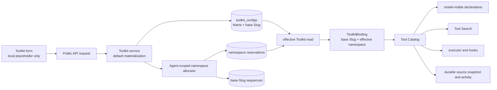

# User-Friendly Toolkit Identifiers Design

- Snapshot: `toolkit-261001`
- Document reference: `toolkit-261001/DESIGN`
- Requirements: [`toolkit-261001/REQ`](../requirements/toolkit-261001-friendly-identifiers.md)
- Decisions: [`toolkit-261001/ADR`](../adr/toolkit-261001-friendly-identifiers.md)
- Design revision: `1`

## Summary

ToolkitConfig `name` and `slug` become backend-materialized values whose create and
update inputs may request provider defaults. The Web form presents the same result as a
local placeholder without persisting preview state. Persisted Slug remains a visible,
non-unique base alias.

A PostgreSQL namespace reservation relation becomes the authority for the prefix used by
one ToolkitConfig inside one Agent. It covers Workspace-shared attachments and
Agent-owned ToolkitConfigs uniformly. The first available allocation normally uses the
base Slug; later allocations use compact monotonic ordinals such as `mcp_2`. Durable
reservation rows prevent a retired final namespace from being assigned to a different
Toolkit in the same Agent.

The Engine carries stored Slug and effective namespace as separate values. Catalog
construction applies only the effective namespace to final model-visible tool names.
Tool Search, execution routing, hooks, durable call source snapshots, and activity
projection consume the selected catalog entry rather than independently deriving a
Toolkit from stored Slug or parsing a final tool name.

Delivery is split into a duplicate-safe **Foundation** release and a duplicate-writing
**Capability** release. Capability rollback retains the forward schema and can return
only to Foundation-compatible readers.

## Current Behavior and Gaps

1. `toolkit_configs` stores non-null Name and Slug. Partial unique indexes enforce Slug
   uniqueness for Workspace-shared rows and Agent-owned rows.
2. Toolkit create schemas and the Web form require Name and Slug. The form currently
   copies the selected Provider slug and name into editable values rather than showing
   non-authoritative placeholders.
3. Attach, enable, create, and Slug update paths reject an effective Slug conflict.
   `ToolkitRepository.list_effective_for_agent()` also asserts that enabled effective
   Slugs are unique before returning a runtime projection.
4. `resolve_agent_tools()` places `ToolkitConfig.slug` in `ToolkitBinding.slug`, and
   `build_tool_catalog()` prefixes every registered tool with `{slug}__`.
5. Catalog source snapshots retain ToolkitConfig ID, Type, Name, and stored Slug, but the
   current binding does not distinguish stored Slug from the final effective namespace.
6. Tool Search and executor routing already operate on final catalog entries, and
   Session Toolkit lifecycle keys already prefer ToolkitConfig ID. These are reusable
   boundaries, but every path that treats stored Slug as the final namespace must be
   replaced before duplicate writes are enabled.
7. Existing MCP HTTP fixtures can expose deterministic tools for cross-layer E2E tests,
   but current required E2E coverage creates only unique Slugs.

## Requirement and Decision Traceability

| Requirement | Design mechanisms | Accepted decisions |
| --- | --- | --- |
| `toolkit-261001/REQ-1` | M1, M2 | `ADR-D1` |
| `toolkit-261001/REQ-2` | M1, M2 | `ADR-D1` |
| `toolkit-261001/REQ-3` | M3, M4, M7 | `ADR-D2`, `ADR-D3`, `ADR-D4` |
| `toolkit-261001/REQ-4` | M3, M4, M5, M6, M8 | `ADR-D2`, `ADR-D3`, `ADR-D4` |
| `toolkit-261001/REQ-5` | M1, M5, M7, M8 | `ADR-D1`, `ADR-D2`, `ADR-D4` |

## Architecture and Ownership

Ownership boundaries are:

- **Toolkit Provider registry:** canonical Provider Name and Type metadata.
- **Toolkit service:** canonical Name and Slug materialization and provider-specific
  validation.
- **Toolkit mutation operation:** one transaction covering Toolkit relation changes and
  namespace allocation or retirement.
- **PostgreSQL namespace reservation relation:** canonical effective namespace for one
  Agent and ToolkitConfig.
- **Engine effective read:** completed database snapshot joining ToolkitConfig and its
  active namespace reservation.
- **Tool Catalog:** canonical mapping from final model-visible name to executable handler
  and Toolkit source for one prepared Run.
- **Web form:** local, replaceable preview only; a create response is authoritative.

No management API or form lets an administrator choose or edit the effective namespace.

## M1. Canonical Name and Slug Materialization

The backend uses one pure identifier policy before creating a ToolkitConfig and before
applying an explicit Name or Slug reset in an update.

### Name resolution

1. Trim leading and trailing whitespace from a submitted Name.
2. For generic MCP, reject an omitted or blank Name as a field validation error.
3. For every non-MCP Provider, replace an omitted or blank Name with the canonical
   Provider Name from the registered Toolkit Provider.
4. Preserve existing stored Names unless the update request includes the Name field.

### Default Slug resolution

The default slugifier is deterministic and language-neutral:

1. normalize the effective Name with Unicode NFKD;
2. remove combining marks through ASCII projection;
3. lowercase ASCII letters;
4. replace each run outside `[a-z0-9]` with one underscore;
5. remove leading and trailing underscores;
6. truncate to 100 characters and remove a trailing underscore created by truncation.

If this produces an empty value, repeat the algorithm with the canonical Provider Name.
Every registered Provider must have a canonical Name whose fallback result is non-empty;
a registry conformance test enforces that invariant.

An explicit Slug is normalized by trimming surrounding whitespace, lowercasing ASCII,
converting whitespace and hyphen runs to one underscore, and collapsing repeated
underscores. The normalized value must then match `^[a-z0-9_]+$`, be non-empty, and be
at most 100 characters. Other characters are rejected rather than silently removed.

A versioned language-neutral JSON corpus defines Provider defaults, ASCII and accented
examples, separators, length boundaries, non-Latin fallback, generic MCP rejection,
and preservation of already-valid explicit values. Python backend tests and TypeScript
preview tests consume the same corpus.

## M2. API and Web Form Contract

### Public API

Create requests allow `name` and `slug` to be omitted or sent as blank strings. The
service resolves both fields before constructing the non-null repository create model.
Responses continue returning non-null persisted `name` and `slug`.

Patch requests retain field-omission semantics:

- omitted Name or Slug means leave the stored value unchanged;
- an included blank Name requests the Provider default and is invalid for generic MCP;
- an included blank Slug requests derivation from the update's effective Name, where an
  omitted Name means the current stored Name;
- an included non-blank value is normalized and validated explicitly.

Existing clients that send valid Name and Slug values remain valid. OpenAPI is dumped
from the updated Python schemas, and the Python and TypeScript public clients are
regenerated rather than edited manually.

### Web form

The common field order becomes Toolkit Type, Name, Slug, Description, Prompt, then
Provider-specific fields.

Create form state keeps Name and Slug empty until the administrator types. It tracks
whether each input has user content independently from the computed preview:

- non-MCP Name placeholder is the canonical Provider Name;
- generic MCP Name uses instructional copy and remains required;
- Slug placeholder is computed from the current effective Name and Provider fallback;
- changing Toolkit Type recomputes untouched placeholders but never changes typed Name
  or Slug values;
- untouched empty Name and Slug values are omitted from create mutations;
- the returned persisted values replace preview state after success.

Edit forms load persisted values as actual inputs. Clearing Name or Slug deliberately
submits a blank field and invokes the patch reset semantics above. Form validation uses
the shared conformance rules, while backend validation remains authoritative.

Storybook interaction coverage owns placeholder, touched-field, Type-switch, MCP-required,
non-Latin fallback, and responsive form behavior. Browser E2E retains the persisted
cross-boundary outcomes.

## M3. Durable Namespace Reservation Data Model

Foundation adds two PostgreSQL tables. Exact class and repository names remain local
implementation details.

### Namespace reservation

One row represents an allocated final namespace and, while active, its Agent+Toolkit
mapping:

- `id`: immutable reservation ID;
- `agent_id`: required FK to Agent, `ON DELETE CASCADE`;
- `toolkit_id`: nullable FK to ToolkitConfig, `ON DELETE SET NULL`;
- `base_slug`: stored Slug at allocation time;
- `ordinal`: positive allocation ordinal;
- `namespace`: final prefix;
- `created_at`.

Constraints:

- unique `(agent_id, namespace)` across active and retired rows;
- partial unique `(agent_id, toolkit_id)` where `toolkit_id IS NOT NULL`;
- unique `(agent_id, base_slug, ordinal)`.

A row with non-null `toolkit_id` is the canonical active mapping. Retirement clears
`toolkit_id`, preserving the final namespace permanently within that Agent. Detach and
disable do not retire the row.

### Base-Slug sequence

One row per `(agent_id, base_slug)` stores the highest consumed ordinal. It has an Agent
FK with `ON DELETE CASCADE` and a unique `(agent_id, base_slug)` constraint. Sequence
rows survive Toolkit deletion and reservation retirement until the Agent is deleted.

The reservation table, rather than a mutable value on `agent_toolkits`, supports both
Workspace-shared and Agent-owned ToolkitConfigs through one authority and preserves
retired identities.

## M4. Allocation and Namespace Lifecycle

Every namespace-changing mutation locks the Agent row. Multi-Agent shared Toolkit Slug
updates lock affected Agents in stable Agent-ID order. Sequence increment, reservation
insert or retirement, Toolkit mutation, and attachment mutation occur in one database
transaction with no external I/O.

Allocation for base Slug `s` is:

1. lock or create the `(agent_id, s)` sequence row;
2. consume the next ordinal;
3. use `s` for ordinal `1`, otherwise `s_<ordinal>`;
4. if the candidate is already reserved by any base Slug, consume the next ordinal and
   retry;
5. insert the reservation as the active mapping for the ToolkitConfig.

The database uniqueness constraints are the final race-safety check. A uniqueness race
retries inside the bounded allocator transaction; exhaustion or an unexpected invariant
violation aborts the product mutation rather than publishing a Toolkit without a
namespace.

Lifecycle behavior is:

| Operation | Namespace behavior |
| --- | --- |
| Create Agent-owned Toolkit | Allocate immediately, including when disabled. |
| Attach Workspace-shared Toolkit | Reuse its active reservation for that Agent when its `base_slug` still matches; otherwise retire it and allocate from the current Slug. |
| Disable or enable | Keep the active reservation unchanged. |
| Detach or reattach | Keep and reuse the active reservation unless Slug changed while detached. |
| Change Agent-owned Slug | Retire the old reservation and allocate from the new base in the same mutation. |
| Change Workspace-shared Slug | For every currently attached Agent, retire and reallocate in the same mutation; detached historical mappings refresh on later attach. |
| Delete ToolkitConfig | FK retirement clears the active mapping but keeps the reservation; sequence state remains. |
| Delete Agent | Delete all reservations and sequences for that Agent. |

An allocation is required for the persisted relation independent of enablement, so later
enablement never becomes the first namespace-writing path.

## M5. Effective Read and Engine Binding Contract

The canonical persisted Agent-to-Toolkit relation continues to union Workspace-shared
attachments and Agent-owned ToolkitConfigs, including an `enabled_only` choice. It now
joins exactly one active namespace reservation for every relation row.

Foundation removes the duplicate-Slug assertion. Missing, duplicate, or mismatched
active namespace mappings are invariant failures with Agent and Toolkit IDs in
structured logs. Runtime resolution does not allocate, repair, or choose a fallback.

`EffectiveToolkitConfig`, `ToolkitBinding`, and catalog source metadata carry distinct
fields for:

- persisted base Slug;
- effective namespace;
- ToolkitConfig ID, Type, Name, and revision.

Registered Toolkit lifecycle identity remains ToolkitConfig-ID-based. A namespace or
Slug change changes the ToolkitConfig revision and causes the next Session reconciliation
to replace the binding, while an already-prepared Run catalog remains immutable.
Auto-bound Toolkits keep their existing unprefixed behavior and do not require namespace
reservation rows.

## M6. Catalog, Search, Routing, Hooks, and Events

For a registered Toolkit binding, catalog construction prefixes a local tool with
`{effective_namespace}__`; it never prefixes with stored Slug. Before catalog publication,
construction rejects any duplicate final name and reports both source ToolkitConfig IDs.
It must not use dictionary overwrite as collision handling.

`ToolCatalogSource` retains both `base_slug` and `effective_namespace`. Its display name
is the persisted ToolkitConfig Name rather than only the canonical Provider Name. A
Provider may contribute a bounded, ordered connection-identity projection from validated
non-secret config. That projection is allowlist-only: it never serializes arbitrary
config, credentials, authorization headers, tokens, query secrets, or provider response
payloads. The effective namespace is always included, so equal Names remain
unambiguous; Provider fields add useful context such as an approved redacted endpoint or
account label when available.

Catalog binding adds one compact, bounded source qualifier to every registered tool's
provider-visible description and Tool Search document. It contains ToolkitConfig Name,
effective namespace, and approved connection identity, so direct and deferred tools have
the same source explanation. Exact punctuation and truncation are local formatting
details and do not alter the provider's input schema or handler description body.

Every downstream path uses the catalog-selected source:

- executor lookup remains keyed by final model-visible name;
- Tool Search indexes and rehydrates the final catalog entry, ToolkitConfig Name,
  effective namespace, approved connection identity, and original local tool name
  without reconstructing a prefix;
- runtime hooks receive the selected source namespace and Toolkit identity;
- durable `ToolkitSourceSnapshot` adds `toolkit_namespace` and the bounded safe identity
  projection while retaining Name, stored Slug, Type, and ToolkitConfig ID;
- tool activity labels remain based on Toolkit Name, while namespace and safe identity
  are diagnostic metadata;
- known-tool presentation rules that intentionally classify built-in stored Slugs keep
  using `toolkit_slug`, not the effective namespace.

New registered calls never parse the prefix from the final tool name to discover their
Toolkit source. Historical events lacking `toolkit_namespace` remain readable through an
optional compatibility field; no old event payload is rewritten.

## M7. Foundation Release and Backfill

The Foundation schema migration creates sequence and reservation tables while retaining
both current Slug unique indexes.

The migration backfills every persisted Agent-owned relation and every Workspace-shared
attachment, including disabled Toolkits. Because current constraints and service checks
already prevent effective collisions, each existing relation receives its unchanged
stored Slug as ordinal `1` and effective namespace. Sequence rows are initialized to at
least the highest inserted ordinal.

If legacy data violates the assumed uniqueness or a relation cannot receive exactly one
reservation, migration fails before Foundation application deployment. It does not
rewrite ToolkitConfig Name, Slug, ownership, enabled state, credentials, or settings.

Foundation application code:

- materializes namespace rows on every relation-creating mutation;
- refreshes reservations on explicit Slug changes;
- reads only from the joined namespace authority;
- is duplicate-safe in the Engine and all downstream consumers;
- retains explicit local and effective duplicate-write rejection;
- serializes those write guards by locking the Workspace for shared local Slugs and the
  affected Agent or Agents for Agent-owned and effective relations, so the guards remain
  race-safe after the indexes are later removed;
- retains the database Slug unique indexes; and
- keeps the current required Name and Slug request and Web form contracts.

The Capability release is blocked until the migration reports no missing or duplicate
active mappings and the complete API and Worker fleet runs Foundation-compatible code.

## M8. Capability Release and Rollback

The Capability schema migration drops:

- `uq_toolkit_configs_shared_workspace_slug`;
- `uq_toolkit_configs_owner_agent_slug`.

Capability application code removes local/effective Slug conflict checks and related
product errors from create, update, attach, and enable paths, relaxes the Name and Slug
request schemas, and allows duplicate stored Slugs. During rolling deployment, older
Foundation writers may still conservatively reject a duplicate request, but every reader
is already safe. The existing Web form continues sending explicit Name and Slug values
until the complete API fleet is Capability-compatible; the placeholder UI is deployed
last so omitted values never reach an older API pod. The active namespace uniqueness
constraint remains permanent.

Capability rollback deploys Foundation-compatible application code against the forward
schema and existing reservation data. It does not remove namespace tables, recreate Slug
unique indexes, or return to readers that use stored Slug as the final prefix. Foundation
write guards reject newly introduced duplicate Slug relationships while existing
duplicates remain readable and executable.

A schema downgrade that would recreate Slug unique indexes first runs a duplicate
preflight and fails when duplicates exist. Operators must never delete or rewrite
ToolkitConfig rows to force a downgrade. Pre-Foundation application rollback is
unsupported after Foundation becomes the database authority.

## Failures, Retry, and Recovery

- Defaulting validation failures return field-scoped 422 responses and do not open a
  namespace transaction.
- Namespace allocation is transactionally coupled to the mutation. A failed allocator
  leaves neither a partial Toolkit relation nor an active mapping.
- Runtime reads are side-effect-free. Missing allocation is an invariant failure, not a
  lazy-repair path.
- A Slug update affecting multiple Agents is all-or-nothing. Stable lock ordering avoids
  inter-Agent deadlocks; database deadlock/serialization errors follow the existing
  transaction retry boundary rather than partial recovery.
- An already-prepared catalog is immutable. A concurrent Slug or attachment mutation is
  visible only on the next reconciliation or Run preparation.
- Tool Search results remain tied to their prepared catalog identity. Retired namespaces
  are never reassigned within the Agent, preventing stale result identity from routing to
  an unrelated Toolkit.

## Security and Permissions

Existing authorization remains unchanged. Workspace managers administer shared
ToolkitConfigs; authorized Agent administrators administer Agent-owned ToolkitConfigs
and attachments. Namespace rows are internal implementation state and are never writable
through Public API fields.

Namespace metadata contains no credentials. Credential encryption, redaction, OAuth,
connection test, and provider authorization flows are unchanged. Database mutations
perform only database work while transactions are open; provider and network validation
remain outside the namespace transaction.

## Observability and Operations

Foundation and Capability emit structured fields for `agent_id`, `toolkit_id`,
`base_slug`, `effective_namespace`, allocation ordinal, mutation kind, and rollout stage.
They never log credentials or provider config payloads.

Required operational signals are:

- count of persisted effective relations without exactly one active reservation;
- namespace allocation success, retry, and invariant-failure counts;
- duplicate final-name catalog rejection count;
- default/fallback resolution counts by Toolkit Type, including non-Latin fallback;
- Foundation backfill row counts and relation/reservation parity;
- Capability preflight count of duplicate stored Slug groups.

Normal duplicate stored Slugs are not warnings after Capability. Alerts target missing
namespace authority, unexpected final-name collisions, or sustained allocation failures.

## Migration and Delivery Sequence

1. **Foundation schema:** generate an Alembic revision, add the two namespace tables,
   backfill all persisted relations, and update the RDB revision pointer.
2. **Foundation application:** ship namespace-aware repositories, services, Engine,
   Search, hooks, events, tests, and compatibility readers while retaining duplicate
   rejection and unique Slug indexes.
3. **Foundation verification:** prove relation/reservation parity, zero runtime fallback,
   and complete API/Worker fleet adoption.
4. **Capability schema:** generate the next Alembic revision and drop only the two Slug
   unique indexes.
5. **Capability application:** remove Slug conflict errors/checks, relax create/update
   schemas, regenerate clients, and enable placeholder UI and duplicate writes.
6. **Spec synchronization:** update the Toolkit living Spec and affected execution-flow
   Specs in the implementation PR immediately before final QA.

This sequence should be implemented as reviewable phases or stacked PRs because
Foundation must be deployable and verifiable independently from Capability.

## Test Strategy

### E2E primary verification matrix

| Scenario | Surface | Required result |
| --- | --- | --- |
| Non-MCP create with omitted Name and Slug | Public API and Web | Persist canonical Name and derived Slug; placeholder matches response. |
| Generic MCP create without Name | Public API and Web | Field validation failure; no Toolkit or namespace row. |
| Non-Latin MCP Name with omitted Slug | Public API and Web | Persist explicit Name and Provider fallback Slug. |
| Explicit valid Name and Slug | Existing API client path | Values remain compatible after normalization. |
| Duplicate shared Slugs | Public API plus Agent attachment | Both persist and attach; distinct stable namespaces are allocated. |
| Duplicate Agent-owned Slugs | Saved-Agent Web/API | Both persist; cards keep the same base Slug; executable tools are distinct. |
| Shared plus Agent-owned duplicate | Agent Run | Final tool names are unique and invoke the intended MCP fixture instance. |
| Disable, enable, detach, reattach | Management plus Agent Run | The same Toolkit keeps the same effective namespace. |
| Slug change | Management plus Agent Run | Next catalog uses a newly allocated namespace; old prepared catalog remains valid. |
| Toolkit deletion then replacement | Management plus Agent Run | Retired namespace is not reused by an unrelated Toolkit. |
| Tool Search deferred invocation | Agent Run | Search result, execution, hooks, and activity point to the same ToolkitConfig. |
| Existing unique Toolkit | Agent Run | Existing `{slug}__{tool}` final name remains unchanged. |

### E2E plan and fixtures

Extend the required public Toolkit and saved-Agent Toolkit E2E suites. Use the existing
`testenv/azents/fixtures/mock_mcp_server.py` and live MCP helper as the deterministic
execution prerequisite. The fixture must expose distinguishable instance metadata in a
safe tool result so two ToolkitConfigs with the same stored Slug can prove correct
routing, not merely distinct declarations.

No real external credential is required. Seed/setup creates ToolkitConfigs through the
Public API and records only IDs, base Slugs, returned final tool names, and redacted
activity metadata. Evidence consists of pytest assertions and, for the Web flow, browser
assertions against persisted cards and activity. CI artifacts retain normal failure
screenshots and logs without secrets.

Required E2E tests fail when the local MCP prerequisite is unavailable; they are not
skipped. Optional live-provider connection tests remain outside this feature matrix and
keep their existing credential-based skip policy.

### Lower-level coverage

- migration tests for backfill parity, disabled relations, retirement, guarded downgrade,
  and index removal;
- repository concurrency tests for same-Agent attach/create/Slug-update races and
  cross-base candidate collisions such as base `mcp` ordinal `2` versus base `mcp_2`;
- service tests for create/update defaulting, MCP validation, and unchanged fields;
- shared JSON conformance tests in Python and TypeScript;
- catalog tests proving explicit collision rejection and source preservation;
- Tool Search, hook, event serialization, old-event compatibility, and executor routing
  tests;
- Storybook play tests for placeholders and touched-field transitions;
- OpenAPI snapshot and generated-client checks.

## Feasibility Evidence

| Requirement | Status | Repository evidence and condition |
| --- | --- | --- |
| `REQ-1` | Feasible | Provider Name/Type metadata is already returned by `/toolkit/v1`; `ToolkitForm` and its container own field order and hydration. Backend create/update services are the existing persistence boundary. |
| `REQ-2` | Feasible | Slug validation is centralized in Toolkit service/API types and Web schema. A shared conformance corpus can test two pure implementations without adding a runtime dependency. |
| `REQ-3` | Feasible through M7/M8 | Current uniqueness is isolated to two named PostgreSQL indexes plus explicit repository/service conflict paths, so reader-first replacement and later index removal are bounded. |
| `REQ-4` | Feasible through M3–M6 | Effective Toolkit reads, `ToolkitBinding`, `build_tool_catalog`, Tool Search entries, executor lookup, hooks, and `ToolkitSourceSnapshot` are explicit source-carrying boundaries. Session lifecycle already keys registered Toolkits by ToolkitConfig ID. |
| `REQ-5` | Feasible through M7 | Backfill can enumerate the canonical `enabled_only=False` shared/owned relation. Existing Name, Slug, credentials, ownership, and provider config do not need mutation. |

No feasibility blocker requires a new product decision or a fifth ADR decision. The
largest implementation risk is the breadth of Engine source propagation; Foundation
contains that risk before duplicate writes become possible.

## Assumptions and Non-Blocking Risks

- Canonical Provider Names continue to be available from the Toolkit registry and remain
  valid fallback inputs. CI enforces this rather than adding a runtime fallback mode.
- Agents with many shared Toolkit attachments make a shared Slug update lock multiple
  Agents. Stable ordering makes this correct; load evidence during implementation should
  determine whether batching is needed in a later snapshot.
- Historical source snapshots do not contain effective namespace. They remain readable,
  but diagnostics for old calls can show only stored Slug and ToolkitConfig ID.
- Provider function-name limits are unchanged by this snapshot. The compact ordinal adds
  few characters, but existing maximum Slug length already requires the current catalog
  compatibility checks to remain authoritative.

## Design Authority

- Design revision: `1`

| ID | Material design mechanism | Authority | Classification |
| --- | --- | --- | --- |
| M1 | Backend resolves and persists optional Name and Slug values using one deterministic policy and shared conformance corpus. | `toolkit-261001/REQ-1`, `REQ-2`; `toolkit-261001/ADR-D1` | `decided` |
| M2 | Web locally previews untouched defaults, omits preview-only create values, and treats backend responses as authoritative. | `toolkit-261001/REQ-1`, `REQ-2`; `toolkit-261001/ADR-D1` | `decided` |
| M3 | Durable PostgreSQL reservation and per-base sequence state owns one Agent+Toolkit effective namespace across shared and Agent-owned Toolkits. | `toolkit-261001/REQ-3`, `REQ-4`; `toolkit-261001/ADR-D2`, `ADR-D3` | `decided` |
| M4 | Agent-serialized monotonic allocation, retirement, and lifecycle reuse prevent namespace reassignment. | `toolkit-261001/REQ-4`, `REQ-5`; `toolkit-261001/ADR-D2`, `ADR-D3` | `decided` |
| M5 | Effective reads and Engine bindings carry stored Slug and effective namespace separately and fail on missing authority. | `toolkit-261001/REQ-4`; `toolkit-261001/ADR-D2` | `decided` |
| M6 | Catalog construction is the single final-name/source boundary for execution, Tool Search, hooks, events, and activity. | `toolkit-261001/REQ-4`; `toolkit-261001/ADR-D2` | `decided` |
| M7 | Foundation adds and backfills namespace authority while retaining duplicate-write rejection and Slug unique indexes. | `toolkit-261001/REQ-5`; `toolkit-261001/ADR-D4` | `decided` |
| M8 | Capability removes Slug uniqueness/conflict rejection only after every reader is duplicate-safe; rollback remains Foundation-compatible. | `toolkit-261001/REQ-3`, `REQ-5`; `toolkit-261001/ADR-D4` | `decided` |

## Authority Audit

- Every Requirement maps to at least one material mechanism in the traceability table.
- Every material mechanism is authorized by confirmed Requirements and accepted ADR
  decisions; no mechanism relies on feasibility, convention, or approval as authority.
- Namespace reservation retention is the necessary synthesis of stable execution
  identity and ADR-D3's no-reuse decision; it does not add administrator-visible state or
  choice.
- The Web preview is not a second persistence authority because omitted create values and
  backend responses preserve D1 ownership.
- No optional compatibility mode, lazy runtime allocation, or pre-Foundation fallback is
  introduced.
- Local identifiers, helper boundaries, JSON fixture location, and exact repository class
  names remain agent-owned implementation details.

## Removal and Replacement

| Existing unit or behavior | Removal authority | Replacement or remaining authority | Removal boundary | Absence verification |
| --- | --- | --- | --- | --- |
| Shared Workspace and Agent-owned Slug unique indexes | `REQ-3`, `ADR-D4` | Agent namespace uniqueness from M3 | Capability schema migration | Schema inspection and duplicate-Slug E2E |
| `DuplicateSlug`, `EffectiveSlugConflict`, effective conflict queries, and duplicate-Slug runtime assertion | `REQ-3`, `ADR-D4` | Transactional namespace allocator and joined invariant from M3–M5 | Capability services/repos; Foundation keeps write guards until fleet gate | Repository search plus create/update/attach/enable duplicate E2E |
| Stored Slug as registered Toolkit final prefix | `REQ-4`, `ADR-D2` | Effective namespace in M5–M6 | Foundation binding and catalog code | Catalog tests assert prefix uses namespace while source retains base Slug |
| Prefix parsing as registered Toolkit source authority | `REQ-4`, `ADR-D2` | Catalog-selected source in M6 | Foundation hooks/events/executor paths | Source propagation tests and repository search for registered fallback use |
| Create-form prefilled Name and Slug values | `REQ-1`, `REQ-2`, `ADR-D1` | Empty editable values plus local placeholders in M2 | Capability Web form | Storybook play tests and Web E2E inspect empty inputs/placeholders |
| Required create Name/Slug generated client fields | `REQ-1`, `REQ-2`, `ADR-D1` | Optional request fields with non-null response fields | Capability OpenAPI/client generation | OpenAPI snapshot and generated type tests |
| Tests that expect duplicate Slug conflicts | `REQ-3`, `ADR-D4` | Foundation compatibility tests plus Capability success/routing tests | Corresponding service/repo/E2E test suites | Test-name/content search and full suite pass |
| Toolkit living Spec statements that Slug is locally/effectively unique | `REQ-3`, `REQ-4` | Implemented namespace behavior | Final implementation spec-sync phase | `/spec-review` and updated `last_verified_at` |

Existing credentials, authorization, Toolkit ownership, `AgentToolkit` attachment
identity, ToolkitConfig revisioning, Provider configuration, and unaffected local tool
names remain authoritative and are not removed.

## Design Approval

- Mode: `Collaborative`
- Decision owner: `Requester`
- Approved on: `2026-10-01`
- Approved Design revision: `1`
- Approved authority IDs: `M1, M2, M3, M4, M5, M6, M7, M8`
- Approved scope: Backend-authoritative Toolkit Name and Slug defaults, Web preview,
  durable Agent namespace reservations, catalog-wide source propagation, and the
  Foundation-to-Capability compatibility rollout defined in this Design.
