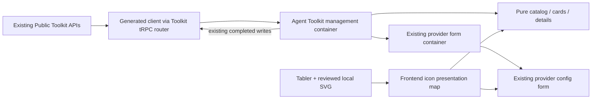
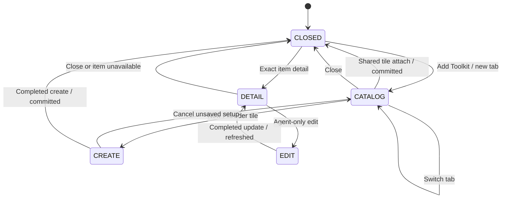

# Agent Toolkit Catalog and Compact Connection Management Design

- Snapshot: `toolkit-261008`
- Document reference: `toolkit-261008/DESIGN`
- Design revision: `1`
- Requirements: [toolkit-261008/REQ](../requirements/toolkit-261008-catalog-ux.md)
- Decisions: [toolkit-261008/ADR](../adr/toolkit-261008-catalog-ux.md)
- Mode: Collaborative
- Decision owner: Requester
- Research baseline: main `beedc9089bb7a5e1804da384919848386d30afaf`, 2026-10-08.

## 1. Scope and Current-System Evidence

This is a Main Web presentation and interaction replacement for the authorized saved-Agent Toolkit management surface. It preserves the current server operations and runtime contracts. It does not implement provider-specific wizards, initial Agent creation setup, a new icon service, permission introspection, or general Agent autosave.

### Existing ownership and data

The [Toolkit domain Spec](../spec/domain/toolkit.md) and [MCP OAuth flow Spec](../spec/flow/mcp-oauth.md) remain authoritative for ownership, credential storage, OAuth, readiness, attachments, and runtime execution.

- `AgentForm.tsx` renders `AgentToolkitSection` after the closing parent `<form>` and only for a saved Agent in the applicable capabilities settings context.
- `toolkit_management_available` selects the enhanced surface only for a Workspace Owner or explicit administrator of the exact Agent. Other users retain the existing shared attachment section.
- `useAgentToolkitManagementContainer.ts` loads `listAgentManagement`, `listToolkits`, and the current Workspace member.
- `ToolkitService.list_agent_management()` returns authorized `items` with ownership/readiness plus `available_shared`. It already excludes attached shared Toolkit IDs and retains current server-side eligibility.
- `ToolkitResponse` describes available Provider types. `ToolkitConfigResponse` includes Name, Type, description, stored Slug, non-credential config, enablement, tool-exposure preference, and redacted OAuth/platform authorization evidence.
- `attachToAgent` already commits the attachment immediately. `createAgentConfig` already creates a persisted Agent-owned Toolkit and refreshes the management projection. Neither depends on submitting the parent Agent form.
- `ToolkitFormPage` connects a reusable container to a pure `ToolkitForm`, supports `agentId`, `embedded`, and an initial selected Toolkit type, and routes provider setup/test/OAuth to the owning context.

The requested elimination of a second Agent save is therefore implemented as an explicit UX completion contract and regression coverage, not a new backend autosave mechanism. The precise deployed surface that caused the earlier impression has not been reproduced; current main's operation boundary is verified directly.

### Existing gap and replacement

The managed `SELECT_TYPE` screen currently uses a type `Select`, filters shared candidates to that type, and then asks for shared attachment or Agent-only configuration. Connected cards expose several controls inline. Replace that entire narrow discovery/summary surface with the confirmed catalog and compact list/details, instead of wrapping the old control flow with another set of flags.

## 2. Requirement Traceability

| Requirement | Mechanisms | Observable verification |
| --- | --- | --- |
| REQ-1 two tabs | M1, M2 | Default New tab, tab switching, loading/empty/error stories and browser entry |
| REQ-2 new type tiles/setup | M1, M2, M4 | Provider tile opens the locked type's existing form; cancellation creates nothing |
| REQ-3 shared tiles/navigation | M1, M2, M5 | Exact shared ID attaches; attached candidates disappear; Workspace creation link navigates |
| REQ-4 immediate durable addition | M3, M5 | Create/attach followed by reload without parent save; dirty Agent field remains independent |
| REQ-5 compact list | M1, M2, M4 | Card field/visibility assertions; only detail opens extended data |
| REQ-6 details and management | M2, M4, M5 | Safe detail projection, ownership-correct action matrix, credential non-disclosure |
| REQ-7 recognition/responsive/accessibility | M1, M2, M6 | Same icon/type, keyboard and focus assertions, mobile/light/dark/locales renders |
| REQ-8 existing policy/data | M3, M4, M5 | Existing Public API isolation tests and no server/schema/runtime diff |

## 3. Design Authority

- Design revision: `1`

| ID | Material design mechanism | Authority | Classification |
| --- | --- | --- | --- |
| M1 | Server-authoritative Provider/candidate discovery with frontend-owned Tabler/local service-icon presentation | REQ-1, REQ-2, REQ-3, REQ-7; ADR-D1; unchanged Toolkit available-list contracts | derived |
| M2 | Replace the managed selector with the two-tab catalog, separate current setup form, compact list, and identity-bound details | REQ-1, REQ-2, REQ-3, REQ-5, REQ-6 | required |
| M3 | Immediate addition through existing completed mutations, isolated from the parent Agent form, with truthful pending/success/error and refresh handling | REQ-4, REQ-8; existing attach/create operations | derived |
| M4 | Allowlisted detail projections from current public data; no credential/raw config dumps or fabricated external permissions | REQ-5, REQ-6, REQ-8; unchanged Toolkit credential/API boundary | derived |
| M5 | Preserve existing ownership-specific management, non-administrator surface, Workspace navigation authority, and OAuth callback boundary | REQ-3, REQ-6, REQ-8; Toolkit and MCP OAuth Specs | existing |
| M6 | Same interaction model across responsive layouts, with localized names/status/actions, readable icons, and accessible selection/detail controls | REQ-7; current Main Web theme/localization/component conventions | required |

No remaining material mechanism depends on an unresolved choice. Local component names, render-slot props, ADT field names, equivalent Mantine layouts, and test fixture identifiers are not additional authorities. Icon source selection is accepted ADR-D1, not an implicit library or API change.

## 4. Architecture and Ownership

### Reused boundaries

- Keep `features/agents/containers/useAgentToolkitManagementContainer.ts` as the API, editor state, mutation, and OAuth orchestration owner.
- Keep the reusable provider form container's credential hydration, validation, identifier placeholders, tests, and ownership-specific setup endpoints.
- Keep generated `@azents/public-client` functions and the current tRPC router; do not add hand-written fetch URLs.
- Keep backend Provider registry and available shared list as the availability authority.
- Keep parent Agent form values entirely outside the Toolkit container's mutation payloads.

### Candidate local components

Names and exact file layout are implementation details, but a reviewable decomposition is:

- `ToolkitTypeIcon` and a small Provider presentation module under `features/toolkits/` for reusable visual metadata.
- `AgentToolkitCatalog` for two tabs and selectable type/instance tiles.
- `AgentToolkitConnectionCard` for compact administrator-visible summaries.
- `AgentToolkitDetails` for safe detail content and ownership-correct management actions.
- A management shell to render catalog, existing `ToolkitFormPage`, or details without destroying the parent Agent form.

Use Container/Component boundaries. Pure components receive typed state/action props and are represented by static Storybook fixtures. They do not call APIs, fetch assets, inspect browser credential storage, or recreate backend permission logic.

A Mantine dialog shell with content scrolling can express the approved catalog/setup/detail progression on desktop and mobile. Its precise geometry is a reversible presentation detail, not a new URL/history mode. Reuse Mantine focus trapping, scroll handling, and responsive props rather than copying the standalone concept HTML into production. Keep only one active management dialog. The Agent page stays mounted. Provider popup OAuth remains a separate existing browser flow.

## 5. Provider and Icon Presentation

### One service-identity component

ADR-D1 establishes one bounded map keyed by stable `toolkit_type`. Do not use user-editable Name or Slug to choose an icon. Two distinct configurations of the same type get the same service mark and retain their distinct Names and Toolkit IDs.

The map provides only presentation: icon source and localized brief provider-purpose key. It does not provide availability, allowed ownership, credential schemas, execution features, or permissions. Iterate the server's returned definitions/candidates, joining visual metadata by type. Neutral presentation for a valid unrecognized type must not hide a server-discovered entry. Existing test-only Providers remain representable.

### Source inventory

| Toolkit type | Initial rendering source | Notes |
| --- | --- | --- |
| `github` | Tabler `IconBrandGithub` | Existing package |
| `notion` | Tabler `IconBrandNotion` | Existing package |
| `sentry` | Tabler `IconBrandSentry` | Existing package |
| `aws` | Tabler `IconBrandAws` | Existing package |
| `google_analytics` | Tabler `IconBrandGoogleAnalytics` | Existing package |
| `gcp` | Reviewed local Google Cloud service mark | Do not substitute the generic Google G without intent |
| `brave_search` | Reviewed local Brave mark | Official monotone source candidate exists |
| `kubernetes` | Reviewed local Kubernetes mark | Preserve upstream mark/proportions |
| `mcp` | Reviewed local MCP mark | Generic MCP connection still requires a meaningful Name |
| `envvar` | Existing Tabler semantic variable glyph | Not a third-party service brand |
| Other valid types | Neutral Toolkit glyph | Preserve server-provided name and type |

The source inventory is not a new configurable fallback mode. It is a static rendering contract for known and unrecognized types. Do not add a new icon dependency for this set.

### Look and feel

- Use a common 24-unit optical envelope and existing Mantine `rem()`/spacing tokens for the actual display size. Tile/list/detail variants vary size, not identity or style ownership.
- Use the same subtle theme background, border, padding, and radius around the mark. Do not add per-brand gradients or unrelated icon backgrounds.
- Use theme `currentColor` only for source-approved monochrome assets. Preserve official variants and source geometry where required.
- Preserve Tabler's outline stroke; do not add an outline to a filled SVG just to imitate it. Normalize the visual framing rather than deforming brand silhouettes.
- Keep aspect ratio; source-specific optical padding adjustments are bounded presentation metadata, not per-instance data.
- Render marks as decorative when a readable service name is adjacent. Status icons have accompanying text. Color and icon alone never convey authority or readiness.

### Local SVG admission

Local assets live with frontend source and are converted into fixed trusted SVG nodes/components; original source notices/provenance are kept alongside them. This avoids dynamic SVG string injection and keeps `currentColor`/theme sizing controlled.

Before inclusion, inspect source bytes for scripts, event handlers, external resources, `foreignObject`, active links, unnecessary metadata, and unexpected raster content. Remove nonvisual unsafe content without altering the mark; preserve viewBox and aspect ratio. No runtime `dangerouslySetInnerHTML`, arbitrary asset URL, external favicon fetch, or user-uploaded SVG path is introduced.

Record a source URL, source revision or retrieval date, license/trademark guideline link, and transformation summary per local asset. Preserve third-party notices. Package-level MIT/CC0 does not by itself resolve brand usage rights. The specific source files must pass this review before the implementation is accepted; this is an admission check within ADR-D1, not an unapproved remote alternative.

## 6. Catalog, Setup, and Detail State

The management editor ADT replaces managed `SELECT_TYPE` and selected shared `Select` state with these conceptual states:

| State | Identity/input | Visible content |
| --- | --- | --- |
| CLOSED | none | Compact connected list |
| CATALOG | active tab `new` or `workspace` | Two-tab tile catalog |
| CREATE | selected stable Provider type | Existing Agent-owned form with type locked |
| DETAIL | exact ToolkitConfig ID | Current selected item's safe projection and actions |
| EDIT | exact Agent-owned ToolkitConfig ID | Existing owning-Agent edit form |

Mutation/loading state remains independent of editor selection. Store selected identity, not a second persisted Toolkit detail snapshot. Detail content is derived from the latest authorized management query. A removed selected item cannot remain as a stale editable card; close the detail or show the existing unavailable boundary and refresh the list. Authorization loss likewise removes management access through existing projection/errors.

### New tab

Use current user-configurable definitions; Shell and auto-bound platform capabilities are not made persistent catalog types. Each type tile has mark, server-provided name, and brief localized purpose where available. Selecting the tile opens the existing provider form directly. There is no extra ownership choice and no automatically selected shared candidate.

The reusable form continues to own Provider configuration; a future wizard can replace its selected-type setup surface without reinterpreting the catalog. Do not add empty wizard implementations, new wizard mode flags, a dynamic server component registry, or unused abstraction layers now.

### Workspace tab

Use `available_shared` as returned by the server, without filtering it by a separately chosen Provider type. Each tile is keyed by ToolkitConfig ID and uses the saved Name, Type icon/name, and short existing description if useful. Do not automatically attach anything merely because the tab opens.

A tile click passes its exact ID to `attachToAgent`. While attachment is pending, prevent repeated additions and display pending feedback on that candidate. On confirmed success, invalidate the management query and return to the list. The final Workspace-create entry links to `/w/{handle}/toolkits/new`. Existing route authorization remains authoritative; this link is not a permission grant. No `returnTo` parameter, draft handoff, automatic post-create return, or implicit attach is added.

Loading/error/empty state uses the current query boundary with a readable action to retry a read. An empty Workspace tab retains the navigation entry. Already attached or otherwise ineligible items remain excluded by existing candidate semantics; no new global eligibility policy is introduced.

## 7. Immediate Persistence and Failure Boundaries

### Server success is the completion boundary

Retain the existing attach/create/update operations. Do not collect additions in parent Agent form state or add Toolkit IDs to its update payload. Do not optimistically present a local list entry as durably complete before server success.

| Event | Handling |
| --- | --- |
| Tile/config submission pending | Keep context; disable repeat submission; show pending indicator |
| Create/attach rejected | Preserve input/catalog context; show operation error; no success entry |
| Create/attach acknowledged | Operation is committed; invalidate the related management query and show completion/list state |
| Post-success read fails | Preserve committed outcome; show list refresh error with read retry, not a failed create with a second create button |
| Transport result ambiguous | Do not automatically replay a non-idempotent create/attach; reconcile through the existing read before another user action |
| OAuth still missing after creation | Keep saved item with authorization-required state and existing permitted authorization actions |
| OAuth callback success/failure | Preserve existing popup-source/origin checks and management invalidation/error handling |

Separate mutation errors from subsequent refresh errors. The current form's create-success callback fetches the management projection; reorganize that callback so an acknowledged saved resource cannot be reclassified as an unsaved form solely because refresh failed. A committed-resource ID returned by the create mutation is enough to retain the known completion outcome; it does not require new durable client state.

There is no new idempotency key, retry queue, durable draft, browser storage, or background autosave. Lost HTTP acknowledgment is not claimed to be solved as exactly-once writes. Pending guards prevent repeated clicks for the same live request; existing server duplicate/eligibility semantics remain. Read reconciliation and explicit retry preserve the user's context without inventing a second write authority.

Canceling an unsaved form discards that form only. It does not submit or reset other Agent settings. Modal mounting/unmounting must not recreate `useAgentFormContainer` or reset its dirty values. A successful Toolkit addition does not imply that unsaved model/profile settings were saved.

## 8. Compact Cards and Safe Details

### Compact card content

List cards contain service mark, saved Name, Provider name, optional one-line description, ownership badge, concise readiness, and detail entry. Applicable reconnect/authorization stays near an authorization-required card, subject to existing authority.

Do not expand configured capability tags, connection targets, auth method, Slug, OAuth expiration/scope, or permission paragraphs in every card. Do not add the earlier concept's repetitive status explanation boxes. All management controls remain reachable through details or current ownership-specific edit surfaces rather than being removed.

### Detail projection

Project `ToolkitConfigResponse` into typed view data at the container/presentation boundary. Whitelist meaningful safe fields per Provider; do not render the whole `config`, credentials, system prompt, or arbitrary provider JSON.

Common detail fields are persisted Name, Type, description, stored Slug, ownership, enabled/readiness, and the applicable current configuration or redacted OAuth summary. Display current config fields only after typed decoding. Optional absent data remains absent; do not derive external account identity from Name, creator, Workspace owner, or a configuring requester.

| Provider | Examples of existing safe detail data | Important exclusion/meaning |
| --- | --- | --- |
| MCP | Server URL, configured auth type, configured scopes, applicable OAuth issuer/resource/granted scope/expiry | Never header/token/client-secret values; configured scopes are not granted scope; redact URL userinfo/query material rather than dumping opaque text |
| GitHub | Auth method, configured toolsets, Runtime environment injection setting | Installation/account targets are stored in credentials and not in current public response; do not expose them or invent the mock's organization |
| Sentry | Configured feature groups, redacted OAuth summary | Feature group is selected UI capability, not proved provider grant |
| Notion | Fixed provider identity and redacted OAuth summary | No fabricated connected account identity |
| GCP | Known project/service selections in config | No service-account JSON/key data |
| AWS | Known region/service connection config fields | No access-key/session-token/secret data |
| Google Analytics | Known configured property/selection fields, when present | Do not claim access to an unreturned property or grant |
| Kubernetes | Known cluster display names and applicable non-secret policy fields | No kubeconfig, private key, certificate credential blob, bearer token, or username/password |
| EnvVar | Configured entry names | Never values, even for entries labeled unmasked |
| Brave Search | Country/language/safe-search defaults | No API key or live quota claim |
| Other valid Provider | Common identity/ownership/readiness only | No generic raw config inspection |

Source each field from the actual current schema/config after implementation-time verification. Extending known projection schemas for presentation is a frontend-local decode, not a Public API contract change. Unsupported optional capability fields do not become fake live tool lists.

Access explanations describe the distinction between configured features and external grants. Use `oauth_connection.scope` as existing token scope evidence where present, not as a guarantee of every downstream resource permission. Do not fetch remote scopes, MCP `list_tools`, organization installations, or live cloud policy merely to populate details.

### Ownership-correct actions

| Item/requester | Detail actions |
| --- | --- |
| Agent-only + exact authorized Admin/Owner | Edit, enable/disable, applicable OAuth actions, existing test through editor, confirmed deletion |
| Shared + Workspace Owner/Manager | Local detach; Workspace edit/manage link; applicable direct OAuth authorize/reconnect |
| Shared + AgentAdmin without Workspace write | Local permitted detach and descriptive detail; no shared object mutation or OAuth grant action |
| Non-admin legacy surface | Existing shared attachment UX only; no newly exposed owned list/details |
| Authorization-required non-OAuth type | Existing owning-context editor guidance, not the MCP OAuth endpoint |

Keep exact response `agent_toolkit_id` for shared detach and exact ToolkitConfig ID for Agent-owned actions. Never infer ownership or permission from icon, Slug, final tool name, or client-selected tab. Preserve existing confirmed Agent-only deletion copy and credential removal contract.

## 9. Responsive, Accessibility, and Localization

Use the real Main Web Mantine provider/theme and Geist font environment, not the concept mock's CSS or font substitution. Use tokenized spacing/color/size and standard Mantine components.

- Desktop and narrow layouts retain the same two tabs and type-versus-instance meaning.
- Tiles may change column count; form inputs become a readable single column on narrow layouts. Scroll long catalog/detail/form content vertically without horizontal overflow.
- Dialog controls remain reachable with long content; respect mobile viewport/safe-area behavior using existing component facilities.
- Use semantic tabs and button tiles with accessible names. Do not use a generic clickable `div` or nested click targets that block keyboard selection.
- Details use focus management and return focus to the originating card action. Switching setup/detail does not trap a user in an invisible tab or discarded form.
- Long saved Names, technical Provider names, localization expansion, and small viewport widths receive static fixtures.
- Preserve EN/KO/JA/FR locale key structure and established Toolkit terminology. Provider names remain canonical; short purpose, state, and actions are localized.
- Preserve light/dark/system theme behavior. Icon tint/background and status text come from theme tokens.

No mobile-only workflow, additional navigation mode, or different ownership policy is added.

## 10. API, Persistence, Runtime, and Security Impact

**API/events:** Existing Toolkit tRPC/generated client operations remain sufficient. No Public/Admin route, OpenAPI change, new live event, or client generation is required by this Design.

**Persistence:** No schema change, DB migration, Toolkit backfill, credential copy, namespace allocation change, or persisted UI-state versioning.

**Runtime:** No change to tool selection, Tool Search, Toolkit lifecycle, static/dynamic prompts, OAuth refresh, executable namespaces, Runtime injection, or VFS eligibility.

**Security:** Existing backend authority checks remain effect admission. New detail display is a narrower allowlist projection over already authorized data, never a credential/source-grant expansion. Bundled SVG admission replaces any runtime remote content acquisition. Management UI does not execute provider discovery to decorate cards.

If implementation evidence requires a new API, stored grant projection, permission policy, or new persisted state to meet the approved Requirements, return that exact material change to design rather than silently adding it.

## 11. Removal and Replacement

| Existing unit or behavior | Removal authority | Replacement or remaining authority | Removal boundary | Absence verification |
| --- | --- | --- | --- | --- |
| Managed SELECT_TYPE/type Select followed by shared/owned choice cards | REQ-1, REQ-2, REQ-3 | CATALOG with two tabs, direct type setup or shared instance attach | Authorized managed branch | No managed SELECT_TYPE screen/type-filtered shared-selection step in stories/E2E |
| Managed selectedToolkitId/shared Select state and handlers tied to the old flow | REQ-3; M2 | Direct exact-ID tile action plus pending operation state | Managed container/state projection | Search for dead managed handlers/props; frontend typecheck and state tests |
| Managed inline action-heavy connection card | REQ-5, REQ-6 | Compact summary with details and authorized next actions | Managed connected list | Stories assert detailed fields are absent from compact cards and present in details |
| Independent service-icon choices within new Toolkit surfaces | ADR-D1; REQ-7 | One type-keyed presentation wrapper | Catalog, cards, details, setup title where used | Same-type story/coverage assertions; no remote icon URL requests |
| Create callback that can mix committed write and later read failure | REQ-4; M3 | Distinct committed mutation outcome and projection refresh handling | Form completion callback only | Unit/component error-path test; no repeated create on refresh failure |
| Old enhanced Storybook fixtures and web selectors expecting type dropdown/shared Select | REQ-1 to REQ-6 | New catalog/compact/detail state fixtures and browser journey | Tests of replaced enhanced surface | Required E2E exercises new selectors and retains create/attach/isolation/deletion coverage |
| Current UI descriptions in Toolkit/Agent/MCP OAuth Living Specs | Implemented REQ-1 to REQ-8 | Update same implementation PR to describe new reachable flow | Only after implementation | Spec review and code-path freshness |

**Retained:** non-administrator legacy shared branch, standalone Workspace form/list, existing Provider config fields, current endpoints/clients/schema, credential policies, saved-Agent entry, runtime namespaces, OAuth popup verification, and ownership-specific services.

**No removal required:** backend routes, persisted state, runtime modes, feature flags, operational configuration, generated clients, or Provider availability. No new legacy fallback is introduced; the pre-existing non-administrator behavior is an explicit compatibility boundary, not a fallback for the new managed experience.

## 12. Migration, Delivery, Rollback, and Operations

One focused frontend feature PR can include icons, UI/state replacement, forms callback adjustment, stories/unit tests, existing browser journey update, and Living Spec synchronization. The scope does not require a multi-release schema cutover or a large stacked feature plan.

Suggested implementation order within that PR:

1. Review/source local marks and build the common icon/purpose presentation; add coverage fixtures.
2. Replace managed catalog selection/state; reuse the current selected-type setup form.
3. Replace connected cards and add safe details/management actions.
4. Separate acknowledged mutation success from query-refresh failure and verify parent-form isolation.
5. Complete local component/Storybook, browser/Public API verification, localization/theme checks, and Spec updates.

Deploy through the normal Main Web release. No live Kubernetes action, credential rotation, or migration is part of this work. A frontend rollback uses the previous Main Web bundle against unchanged APIs/data; existing created Toolkits and attachments remain valid. No namespace or grant cleanup is necessary.

Use existing API/error reporting. Do not add new telemetry, provider calls, runtime logs, or secret-bearing diagnostics for this UX change. Optional usability instrumentation or new metrics are separate scope, not an implicit requirement.

## 13. Test Strategy

### E2E-first product verification

Extend `testenv/azents/e2e/src/tests/web/public/test_agent_toolkits.py` rather than replacing it with a standalone mock test. Reuse its product-created owner/member Workspace, saved Agent, deterministic model-listing prerequisite, and existing Public API setup.

| Journey | Evidence required |
| --- | --- |
| New catalog entry | Real browser opens Add Toolkit with New selected and chooses MCP/type tile without an ownership intermediary |
| New Agent-only setup | Existing form creates the exact instance; no parent save is invoked; browser reload still shows it |
| Shared catalog attach | Workspace tab selects the exact saved shared instance; reload retains attachment; candidate is no longer offered |
| Parent form independence | A dirty non-Toolkit Agent capability field remains dirty/unchanged through addition; server Agent value remains the original value |
| Unsaved cancellation | Canceling setup produces no extra Toolkit resource |
| Compact/detail boundary | List remains concise; selected item's details/actions appear; close returns correctly |
| Ownership lifecycle | Existing disable/enable/delete and shared detach semantics still work through new details/actions |
| Workspace creation navigation | Final Workspace catalog entry reaches the existing creation route without implicit creation/attachment |
| Member non-disclosure | Existing member/legacy assertions still exclude Agent-only data and managed Add Toolkit |

Use existing Public API `test_toolkit.py` cases as the authority/isolation regression lane, including exact AgentAdmin/Owner access and Manager/Member denial. Do not add redundant backend tests for unchanged serialization.

Use a locally deterministic MCP/no-auth configuration for the create/attach journey. No billable Brave test or live OAuth grant is needed to prove catalog persistence. Existing controlled OAuth fixtures/stories exercise direct reconnection/popup semantics; preserve any existing real-browser popup boundary tests rather than reclassifying remote success as catalog coverage.

### Component/state verification

Colocated stories and `play` assertions cover the exhaustive UI states that do not require independently deployed services:

- New/Workspace tabs, no candidates, query error, long names, direct tile action.
- Pending attach/create guard, rejected write, committed write plus read-refresh error, cancellation.
- Ready/authorization-required/disabled cards; no detail-field expansion in list.
- Allowlisted per-provider detail data, absent grant/account information, malicious/raw config fields not rendered, EnvVar values never rendered.
- Shared manager versus AgentAdmin action differences; other authorization warnings use the proper editor.
- Icon mapping coverage for current stable types, neutral valid unknown/test-only type, common rendering identity, no arbitrary remote SVG.
- Keyboard tab/tile/detail navigation, focus trapping/return, destructive confirmation.
- Narrow layout overflow/scroll/controls, light/dark, representative localized expansion.

Pure state/unit tests cover identity-bound editor transitions, removal/authorization loss, Provider projection safety, per-type icon metadata coverage, and mutation/refresh distinction. Keep typed decoding at ingress; do not bypass this with assertions/casts over raw config.

### Fixtures and prerequisites

The existing testenv supports the browser/API boundary and deterministic model selection. It is fixture/prerequisite support for real E2E, not a substitute for product verification. Use only synthetic non-secret Provider config values. Runtime startup and actual provider network discovery are not required for the selected catalog journey.

A reproducible prerequisite record includes base/feature SHA, fixture type, locale/theme, viewport/DPR, browser build, and actual required-CI run identifiers. Store screenshots/render reports without tokens, credential JSON, signed URLs, or raw OAuth codes.

### CI and failure policy

Required checks include frontend tests, typecheck, lint, format, Storybook/component interactions, existing required Public API/browser lanes, docs catalog validation, and targeted Spec review. A fixture-dependent required test failure or absent primary browser result is not a skip or a pass. Optional live-provider tests, if explicitly run, are reported separately with their missing prerequisite/skip reason; they cannot replace the deterministic required journey.

Actual visual QA renders real components with application theme/fonts. Desktop and mobile captures use explicit viewport, DPR, 100% scale, font readiness, and no artificial resizing. The approved concept mocks are intent evidence, not implementation screenshots or performance measurements.

## 14. Authority and Feasibility Validation

### Bidirectional authority audit

- REQ-1 through REQ-8 each map to M1 through M6 and the concrete verification matrix.
- M1 relies on accepted ADR-D1 and current server discovery, not a second Provider availability authority.
- M2 is the approved surface replacement, with no new product path or initial-create/Chat scope.
- M3 reuses persisted operations; pending/refresh separation is necessary for REQ-4's truthful completion without a new persistence or retry mode.
- M4 obeys existing redaction and REQ-6; it adds no credential read or permission introspection endpoint.
- M5 retains exact existing authorization, including the pre-existing non-administrator branch, rather than broadening Workspace Manager access.
- M6 is the same workflow at different layouts, not a separate mobile behavior.
- Every removal in section 11 has replacement/retained authority and an absence check. No runtime/backend/schema authority is removed.
- Local presentation dimensions, helper boundaries, and names are not material state/contracts. No optional asset/network mode, new versioning feature, or approval-derived source of truth is hidden in the Design.

### Requirement/mechanism-level feasibility

| Scope | Finding | Concrete evidence / prerequisite |
| --- | --- | --- |
| Catalog and provider setup, M1/M2 | Feasible | Server Provider definitions and `available_shared` exist; embedded selected-type `ToolkitFormPage` already routes by Agent |
| Immediate durable add, M3 | Feasible | attach/create mutations already persist; AgentToolkitSection is outside parent form; current container invalidation and refresh are reusable |
| Compact cards/details, M2/M4 | Feasible | Current management item includes identity/config/readiness; use allowlisted view projections instead of raw config |
| Existing grant/account identity limits, M4 | Feasible within confirmed scope | GitHub installations are credential-backed and absent from public response; Requirements prohibit fabrication and new introspection |
| Ownership/OAuth, M5 | Feasible | Current response flag, exact Agent-owned routes, shared role gates, callback origin/source validation and API isolation tests |
| Responsive/localized presentation, M6 | Feasible | Existing Mantine/theme/locale providers and stories; mock renders demonstrated geometry only, production render still required |
| Icon approach, M1 / ADR-D1 | Feasible approach; exact-file admission required before shipping | Tabler 3.48.0 exports/license inspected; official/upstream local source candidates identified; source-specific legal/content and actual visual review must accompany file inclusion |
| Verification/delivery | Feasible | Existing Public API and browser Toolkit journeys plus colocated Storybook infrastructure; no new paid external prerequisite |

There is no system feasibility blocker or unresolved material technical choice. Exact asset selection/legal review and real component render/CI are implementation acceptance work, not claimed complete by this design research. If a particular brand source fails local-use admission, resolve it before shipping rather than adding remote fetching or silently claiming a fabricated logo is official.

### Non-blocking risks

- Local service marks have mixed original outline/filled geometry. Unified visual framing must be verified in actual light/dark component renders; do not over-normalize paths.
- A create acknowledgment and subsequent query failure must remain separate or users may create duplicates.
- A modal remount or callback can accidentally discard unrelated parent dirty values; the dedicated browser assertion protects this.
- Available management fields differ by Provider. Optional display fields must not be filled using credential data or assumed grants.
- A later server Provider not in the presentation map must remain renderable with neutral identity rather than disappear.

## 15. Design Approval

- Mode: `Collaborative`
- Decision owner: `Requester`
- Complete Design revision presented: `1`
- Authority IDs presented: `M1, M2, M3, M4, M5, M6`
- Requirements confirmation and ADR-D1 choice: received on `2026-10-08`.
- Approved on: `2026-10-08`.
- Approved Design revision: `1`.
- Approved authority IDs: `M1, M2, M3, M4, M5, M6`.
- Approved scope: the confirmed two-tab catalog, immediate existing mutations, compact cards and allowlisted details, Tabler/local icon presentation, unchanged ownership/OAuth/runtime boundaries, and responsive verification.
- Product implementation authorization: received on `2026-10-08` when the requester instructed proceeding through design and implementation, after the implementation scope and icon/data/API boundaries were briefed.

The requester explicitly authorized proceeding without another equivalent UX decision round. This approval does not cover a new API, persistence authority, permission policy, live grant introspection, or rollout mode. Return any material delta to design. Do not set `implemented` until the feature is implemented and verified.
