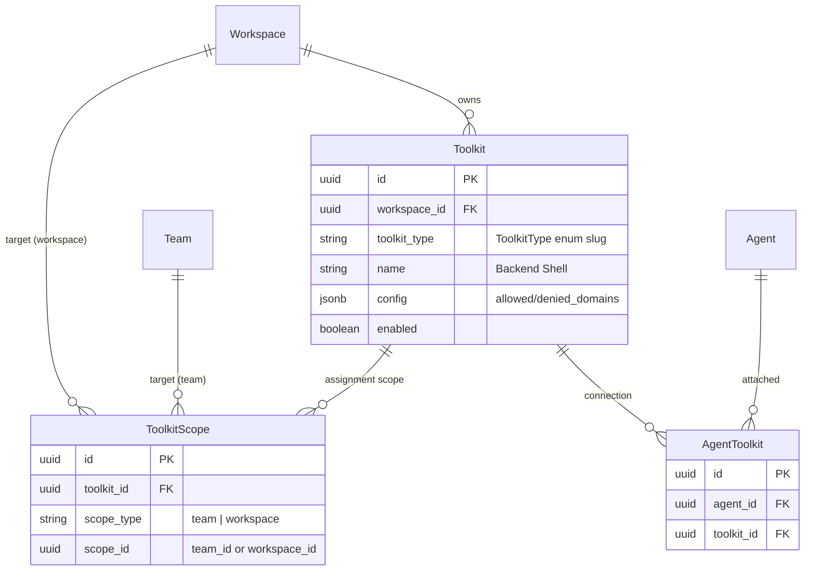
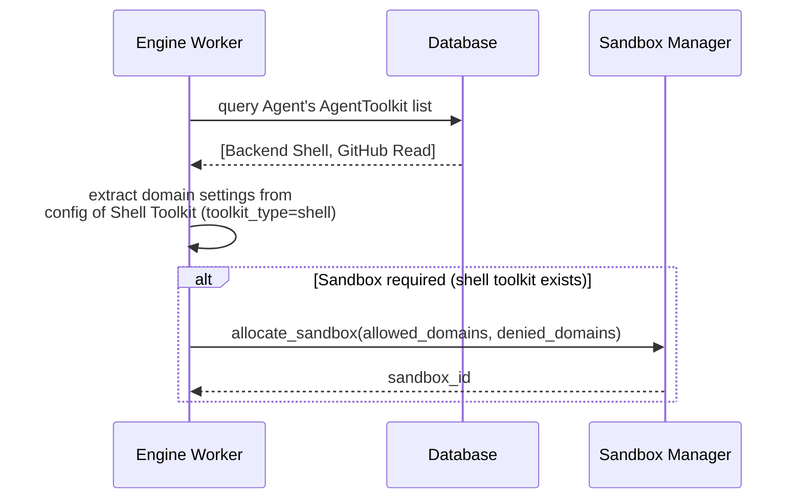
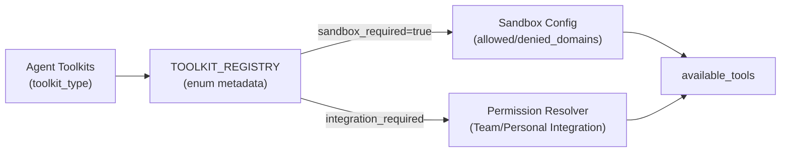
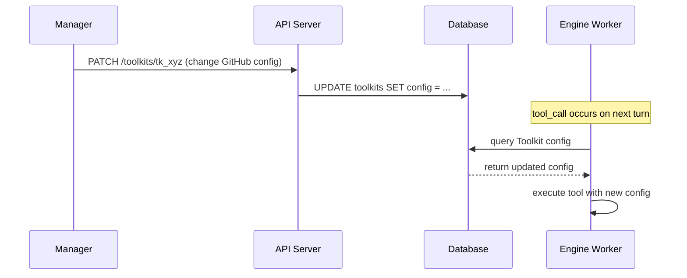
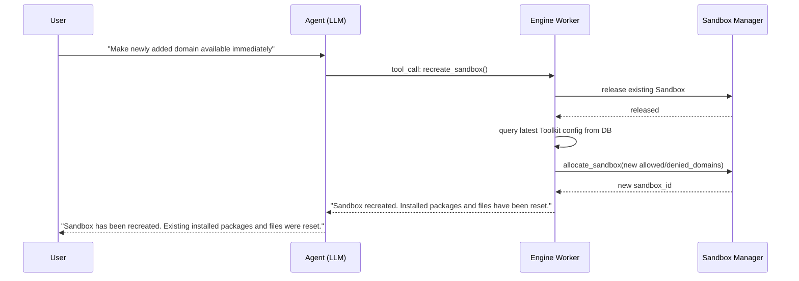

# Toolkit Assignment Design

## Overview

In nointern, **anyone (Member or above) can create an agent**, but **which tools can be attached is controlled by Manager**.

Core flow:

```
Manager creates Toolkit (tool + settings)
  → assign to Team/Workspace
    → Members in that scope freely attach it to agent
```

### Why Toolkit

Directly connecting tools to Agent creates two problems:

1. **Configuration duplication**: when attaching same tool to 10 agents, domain whitelist must be entered 10 times
2. **Scattered permission**: impossible to track who attached which tool where

Toolkit is **reusable unit of "tool + settings"**. Manager creates it once, multiple agents share it, and setting changes apply in bulk.

## Domain Model

### Entity Relationship



> **ToolkitType is not in ER diagram.** It is hardcoded Python enum in code, not DB table. Toolkit `toolkit_type` references this enum.

### ToolkitType — hardcoded enum in code

ToolkitType is hardcoded as **Python enum, not DB table**. Tool slug, metadata, config_schema, implementation reference all live in code.

```python
class ToolkitType(enum.StrEnum):
    """List of tools provided by platform. Hardcoded in code and not stored in DB."""

    SHELL = "shell"
    MCP = "mcp"
```

`ToolkitProvider` subclass corresponding to each enum value is managed in separate registry. Classes, not instances, are registered and used for static metadata lookup (slug, name, config_schema, etc.):

```python


TOOLKIT_REGISTRY: dict[ToolkitType, type[ToolkitProvider[Any]]] = {
    ToolkitType.SHELL: BuiltinToolkitProvider,
    ToolkitType.MCP: McpToolkitProvider,
}
```

**Workspace-specific tool availability**: Structure can determine tools allowed in workspace based on enum, but **currently all tools are allowed everywhere**. Workspace-specific tool restriction is implemented later if needed.

**Hardcoded list:**

| enum | slug | name | sandbox_required | Description |
|------|------|------|-----------------|------|
| `SHELL` | `shell` | Shell execution | true | execute code in Sandbox |
| `MCP` | `mcp` | MCP server | false | integrate external MCP server (see [MCP Toolkit design](./mcp-toolkit.md)) |

**Future candidates:**

| slug | name | sandbox_required | Description |
|------|------|-----------------|------|
| `web_search` | Web Search | false | internet search |
| `github` | GitHub | false | GitHub API integration |
| `jira` | Jira | false | Jira API integration |
| `slack` | Slack | false | Slack API integration |
| `calendar` | Calendar | false | Google/Outlook calendar |

**config_schema example — Shell tool:**

```json
{
  "type": "object",
  "properties": {
    "allowed_domains": {
      "type": "array",
      "items": { "type": "string" },
      "default": [],
      "description": "List of allowed domains. If empty, allow all (only denied_domains applies)"
    },
    "denied_domains": {
      "type": "array",
      "items": { "type": "string" },
      "default": [],
      "description": "List of denied domains. Always blocked regardless of allowed_domains"
    }
  }
}
```

**Domain filtering logic:**

| allowed_domains | denied_domains | Result |
|----------------|---------------|------|
| `[]` (empty) | `[]` | allow all |
| `[]` (empty) | `["evil.com"]` | block only evil.com, allow rest |
| `["pypi.org"]` | `[]` | allow only pypi.org |
| `["pypi.org", "npm.org"]` | `["npm.org"]` | allow only pypi.org (npm.org blocked by denied) |

> `denied_domains` always has priority. Even if included in `allowed_domains`, domain is blocked when included in `denied_domains`.

### Toolkit — workspace-specific tool instance

Bundle of **"tool + settings"** created by Manager. Similar pattern to LLM Provider Integration.

```python
class RDBToolkit(Base):
    """Workspace-specific tool settings bundle. Created by Manager and assigned to Team/Workspace."""

    __tablename__ = "toolkits"

    id: Mapped[uuid.UUID]
    workspace_id: Mapped[uuid.UUID]          # FK → workspaces
    toolkit_type: Mapped[str]                   # ToolkitType enum value ("shell", "github", ...)
    name: Mapped[str]                        # "Backend Shell", "Frontend Shell", ...
    description: Mapped[str | None]
    config: Mapped[dict]                     # actual settings matching config_schema
    enabled: Mapped[bool]
```

> `toolkit_type` is stored as string value of `ToolkitType` enum, not DB FK. Enum validity is checked at application level.

**Toolkit examples:**

| Toolkit name | Base tool | config |
|-------------|----------|--------|
| Backend Shell | `shell` | `{"allowed_domains": ["pypi.org", "registry.npmjs.org", "api.github.com"]}` |
| Frontend Shell | `shell` | `{"allowed_domains": ["registry.npmjs.org", "cdn.jsdelivr.net"]}` |
| Open Shell | `shell` | `{"denied_domains": ["malware.com"]}` |

Even for same `shell` tool, **different domain settings mean separate Toolkit**.

### ToolkitScope — assignment scope

Determines where Toolkit can be used.

```python
class RDBToolkitScope(Base):
    """Available scope of Toolkit. Assigned to Team or entire Workspace."""

    __tablename__ = "toolkit_scopes"

    id: Mapped[uuid.UUID]
    toolkit_id: Mapped[uuid.UUID]            # FK → toolkits
    scope_type: Mapped[ToolkitScopeType]     # TEAM | WORKSPACE
    scope_id: Mapped[uuid.UUID]              # team_id or workspace_id
```

```python
class ToolkitScopeType(enum.StrEnum):
    TEAM = "team"
    WORKSPACE = "workspace"
```

**Scope decision logic:**

```
scope_type = WORKSPACE  → all Members in workspace can use
scope_type = TEAM       → only Members in that Team can use
```

Multiple Scopes can be assigned to one Toolkit:

```
"Backend Shell" → [#backend team, #devops team]
"Open Shell"    → [entire workspace]
```

### AgentToolkit — attach to agent

Member attaches Toolkit to agent. Only Toolkits visible to that member can be attached.

```python
class RDBAgentToolkit(Base):
    """Toolkit attached to agent. Member selects from own available Toolkits."""

    __tablename__ = "agent_toolkits"
    __table_args__ = (
        UniqueConstraint("agent_id", "toolkit_id"),  # prevent duplicate same toolkit connection
    )

    id: Mapped[uuid.UUID]
    agent_id: Mapped[uuid.UUID]              # FK → agents
    toolkit_id: Mapped[uuid.UUID]            # FK → toolkits
    toolkit_type: Mapped[str]                   # ToolkitType enum value (denormalized)
```

Multiple different Toolkit configs of same ToolkitType can be attached (e.g. 2 GitHub Toolkits for different orgs). Tool name prefix is based on Toolkit `slug`, so no collision.

## Permission Matrix

### Permissions by role

| Operation | Owner | Manager | Member |
|------|-------|---------|--------|
| **Create/update/delete Toolkit** | O | O | X |
| **Assign/unassign ToolkitScope** | O | O | X |
| Query Toolkit list (available) | O | O | O |
| **Attach/detach Toolkit to Agent** | O | O | O |
| Create Agent | O | O | O |

**Core: Manager is gatekeeper, Member is consumer.**

> ToolkitType is hardcoded in code, so there is no Admin toggle. Currently all tools are allowed globally.

### Available Toolkit Resolution (by user)

Toolkit list visible to user:

```sql
-- available toolkit list for user_id
SELECT DISTINCT t.*
FROM toolkits t
JOIN toolkit_scopes ts ON ts.toolkit_id = t.id
WHERE t.workspace_id = :workspace_id
  AND t.enabled = true
  AND (
    -- workspace-wide assignment
    (ts.scope_type = 'workspace' AND ts.scope_id = :workspace_id)
    OR
    -- assignment to a team the user belongs to
    (ts.scope_type = 'team' AND ts.scope_id IN (
      SELECT tm.team_id
      FROM team_members tm
      JOIN workspace_users wu ON wu.id = tm.workspace_user_id
      WHERE wu.user_id = :user_id
        AND wu.workspace_id = :workspace_id
    ))
  )
```

**Example:**

```
Workspace: Acme Corp
├── Team: #backend (Gunwoo, teammate A)
├── Team: #frontend (teammate B, teammate C)
└── Team: #devops (Gunwoo)

Toolkits:
  "Backend Shell"  → scope: [#backend]
  "Frontend Shell" → scope: [#frontend]
  "GitHub Read"    → scope: [entire workspace]
  "Open Shell"     → scope: [#devops]
```

| User | Available Toolkit |
|------|-------------|
| Gunwoo | Backend Shell, GitHub Read, Open Shell |
| teammate A | Backend Shell, GitHub Read |
| teammate B | Frontend Shell, GitHub Read |
| teammate C | Frontend Shell, GitHub Read |

## API Design

### Toolkit CRUD (Manager+)

```
POST   /workspaces/{handle}/toolkits
GET    /workspaces/{handle}/toolkits
GET    /workspaces/{handle}/toolkits/{toolkit_id}
PATCH  /workspaces/{handle}/toolkits/{toolkit_id}
DELETE /workspaces/{handle}/toolkits/{toolkit_id}
```

**POST /workspaces/{handle}/toolkits**

```json
{
  "toolkit_type": "shell",
  "name": "Backend Shell",
  "description": "Shell for backend team. Allows PyPI, npm, GitHub",
  "config": {
    "allowed_domains": ["pypi.org", "registry.npmjs.org", "api.github.com"],
    "allowed_languages": ["python", "bash"],
    "max_execution_time": 30
  }
}
```

- `toolkit_type` must be value present in `ToolkitType` enum.
- `config` is validated against corresponding tool's `config_schema` (TOOLKIT_REGISTRY).
- Only Manager/Owner can call.

### ToolkitScope Management (Manager+)

```
POST   /workspaces/{handle}/toolkits/{toolkit_id}/scopes
GET    /workspaces/{handle}/toolkits/{toolkit_id}/scopes
DELETE /workspaces/{handle}/toolkits/{toolkit_id}/scopes/{scope_id}
```

**POST /workspaces/{handle}/toolkits/{toolkit_id}/scopes**

```json
{
  "scope_type": "team",
  "scope_id": "team-uuid-here"
}
```

Or workspace-wide assignment:

```json
{
  "scope_type": "workspace"
}
```

- when `scope_type=workspace`, `scope_id` is automatically current workspace_id

### Query Available Toolkit (Member+)

```
GET /workspaces/{handle}/toolkits/available
```

Returns list of Toolkits available to current user based on team membership. Used to render Toolkit options in agent create/edit UI.

### AgentToolkit Management (Agent Admin / Member+)

Add Toolkit management endpoints to existing Agent API:

```
GET    /workspaces/{handle}/agents/{agent_id}/toolkits
POST   /workspaces/{handle}/agents/{agent_id}/toolkits
DELETE /workspaces/{handle}/agents/{agent_id}/toolkits/{agent_toolkit_id}
```

**POST /workspaces/{handle}/agents/{agent_id}/toolkits**

```json
{
  "toolkit_id": "toolkit-uuid-here"
}
```

- Verify requester can access that Toolkit (based on ToolkitScope)
- Attach allowed only for Agent Admin or Agent creator

## Runtime Integration

### Toolkit → Sandbox settings mapping in Agent Runtime

When Engine Worker starts session, derives Sandbox settings from Agent's Toolkit list:



### Sandbox settings derivation

Because there is one Shell Toolkit per agent, read config from single Toolkit without merge logic:

```python
def resolve_sandbox_config(toolkits: list[Toolkit]) -> SandboxConfig | None:
    """Derive Sandbox settings from Agent Toolkit list. Return None if no Shell Toolkit."""
    for tk in toolkits:
        if tk.toolkit_type == ToolkitType.SHELL:
            return SandboxConfig(
                allowed_domains=tk.config.get("allowed_domains", []),
                denied_domains=tk.config.get("denied_domains", []),
            )
    return None
```

### Permission Resolver Integration

Add Toolkit-based tool filtering to existing Permission Resolver:

```
available_tools(session) =
  agent.toolkits
    → lookup metadata in TOOLKIT_REGISTRY by toolkit_type for each toolkit
    → inject Sandbox config for sandbox_required tools
    → bind Integration token based on session.type
```



## Comparison with LLM Provider Integration

Existing LLM Provider Integration pattern and Toolkit pattern are similar 3-layer structure:

| Layer | LLM Integration | Toolkit |
|------|----------------|---------|
| **Global catalog** | LLM Model (gpt-4o, claude-sonnet) | ToolkitType **enum** (shell, github, jira) |
| **Workspace instance** | LLM Provider Integration (API Key) | Toolkit (config: allowed/denied_domains) |
| **Agent connection** | Agent.llm_provider_integration_id | AgentToolkit (M:N) |

Differences:

| Item | LLM Integration | Toolkit |
|------|----------------|---------|
| Catalog storage | DB (LLM Models) | **code enum** (ToolkitType) |
| Agent relationship | 1:1 (FK) | M:N (join table, one per tool type constraint) |
| Scope restriction | none (entire workspace) | **ToolkitScope (team/workspace)** |
| Setting validation | provider-specific hardcoded | **dynamic validation with TOOLKIT_REGISTRY config_schema** |

## Shell Toolkit E2E Scenario

### 1. Manager creates Toolkit

```
POST /workspaces/acme/toolkits
{
  "toolkit_type": "shell",
  "name": "Backend Shell",
  "config": {
    "allowed_domains": ["pypi.org", "registry.npmjs.org", "api.github.com"],
    "denied_domains": []
  }
}
→ 201 Created, toolkit_id: "tk_abc"
```

### 2. Manager assigns to Team

```
POST /workspaces/acme/toolkits/tk_abc/scopes
{
  "scope_type": "team",
  "scope_id": "team_backend_uuid"
}
→ 201 Created
```

### 3. Member checks available Toolkits

```
GET /workspaces/acme/toolkits/available
→ [
    {
      "id": "tk_abc",
      "name": "Backend Shell",
      "toolkit_type": "shell",
      "tool_name": "Shell execution",
      "config": {"allowed_domains": ["pypi.org", "registry.npmjs.org", "api.github.com"], "denied_domains": []},
      "scopes": [{"scope_type": "team", "team_name": "#backend"}]
    },
    {
      "id": "tk_xyz",
      "name": "GitHub Read",
      "toolkit_type": "github",
      "tool_name": "GitHub",
      "scopes": [{"scope_type": "workspace"}]
    }
  ]
```

### 4. Member attaches to Agent

```
POST /workspaces/acme/agents/agent_123/toolkits
{"toolkit_id": "tk_abc"}
→ 201 Created

POST /workspaces/acme/agents/agent_123/toolkits
{"toolkit_id": "tk_xyz"}
→ 201 Created
```

### 5. Runtime resolves

```
Agent "Backend Bot":
  Toolkits: [Backend Shell, GitHub Read]

→ execute_code tool enabled (shell toolkit exists)
→ Sandbox allowed_domains: ["pypi.org", "registry.npmjs.org", "api.github.com"], denied_domains: []
→ github tool enabled (Permission Resolver binds Team Integration token)
```

### 6. Member tries attaching Toolkit outside permission

```
POST /workspaces/acme/agents/agent_123/toolkits
{"toolkit_id": "tk_frontend_shell"}
→ 403 Forbidden: "Toolkit not available for your teams"
```

## Setting Change Propagation

When Manager edits Toolkit config, it is reflected in all agents using that Toolkit. However, **reflection timing differs by tool type.**

### Non-Sandbox tools (github, jira, etc.): next turn

Tools that do not require Sandbox query Toolkit config from DB on each turn, so changes apply from the next turn immediately.



### Sandbox tools (shell): when Sandbox is recreated

Sandbox preserves session-local state (installed packages, generated files), so config change is not applied immediately. Changed config applies **when Sandbox is released by idle timeout and recreated**.

If immediate reflection is needed, provide `recreate_sandbox` tool to agent:



`recreate_sandbox` tool:

```python
ToolSpec(
    name="recreate_sandbox",
    description="Destroy the current sandbox and create a new one with latest config. "
    "WARNING: All installed packages and generated files will be lost.",
    input_schema={"type": "object", "properties": {}},
)
```

- Automatically registered only for agents with Shell Toolkit attached
- Called after agent communicates state-loss warning to user
- After call, new Sandbox uses latest `allowed_domains`, `denied_domains` settings

### Propagation Rule Summary

| Tool type | Reflection timing | Reason |
|----------|----------|------|
| `sandbox_required=false` (github, etc.) | **next turn** | Stateless, immediate reflection through DB query |
| `sandbox_required=true` (shell) | **when Sandbox is recreated** | automatic after idle timeout or immediate with `recreate_sandbox` tool |

- **Audit log**: trackable by recording config change history (future)
