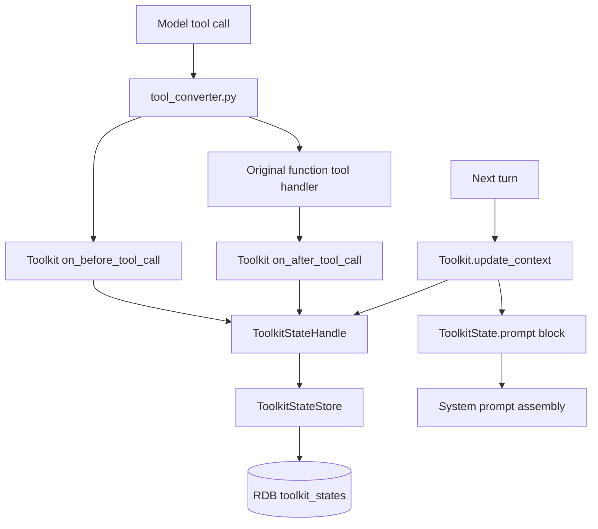
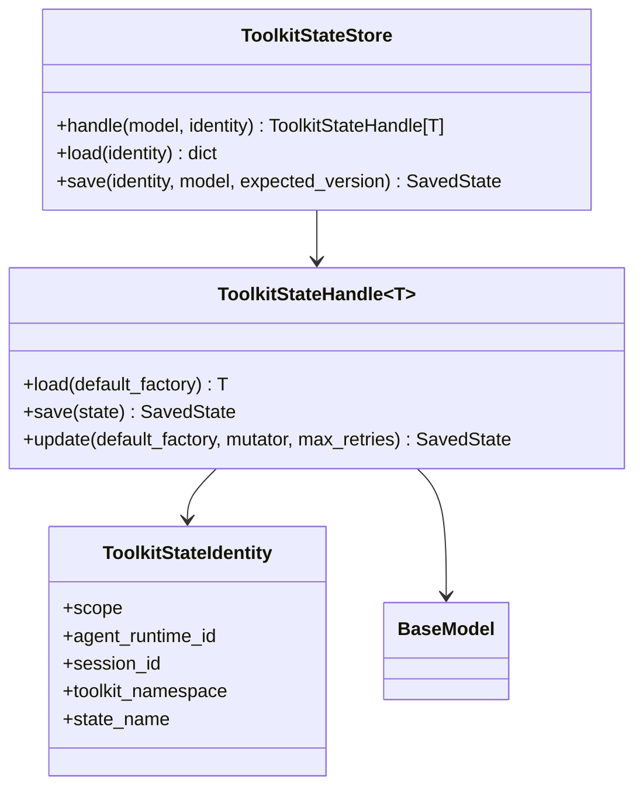

# Design for Toolkit Hooks and Toolkit State based AGENTS.md loading

## Problem Definition and Background

nointern runtime assembles tool bundle, prompt, credential, and runtime context through Toolkits on every turn. In this structure, AGENTS.md loader needs two capabilities.

1. Observe file tool usage paths and decide which AGENTS.md instructions should be included in next turn prompt.
2. Reliably reuse previously discovered instruction snapshots without reading sandbox filesystem every turn.

Initial design considered AGENTS.md-specific S3 persistent state, but that creates storage specialized only for AGENTS.md and does not solve general Toolkit runtime state problem. This design uses AGENTS.md as first consumer but introduces **Toolkit State** mechanism reusable across runtime.

Decision basis:

- [ADR-0032: Adopt Toolkit Hooks and Toolkit State](../adr/0032-toolkit-hooks-for-agents-md.md)

## Goals

- Add generalized `ToolkitStateStore` / typed `ToolkitStateHandle[T]` abstraction to nointern runtime.
- Keep Python API generic + Pydantic model based, so Toolkit state payload can be loaded/saved type-safely.
- Allow one Toolkit namespace to own multiple named states.
- Define state identity as `scope + agent_runtime_id + optional session_id + toolkit_namespace + state_name`.
- Keep scope as general concept, and support at least `session`, `agent_runtime` in MVP.
- Use RDB table `toolkit_states` as backend.
- Restrict save semantics to whole-state replace + optimistic locking. `version` column is immediately used as compare-and-swap expected version, and ordinary consumers use `update()` retry loop to reapply mutation to latest state.
- Keep Toolkit hooks observation-only: `on_before_tool_call` / `on_after_tool_call`.
- Prompt assembly happens through existing `update_context()` path.
- Implement AGENTS.md loader as first consumer of Toolkit State.
- Store AGENTS.md full content snapshot as cache snapshot to avoid sandbox read every turn.

## Non-goals

- Do not introduce external arbitrary plugin runtime, plugin manifest, or plugin capability sandbox.
- Do not support tool call deny, args mutation, output mutation in hooks.
- MVP does not provide partial JSON patch or field-level DB merge. Instead it provides typed state-level reload/mutate/CAS retry.
- Do not store Toolkit State in S3 object or `agent_runtimes.runtime_state` blob.
- Do not promote AGENTS.md snapshot to canonical source of truth. canonical source is sandbox file.
- Do not use shell command parsing as correctness basis for AGENTS.md discovery.
- Detailed phase-by-phase implementation plan is not included in this document.

## Current State

Related code paths:

- `python/apps/nointern/src/nointern/core/tools.py`
  - defines `Toolkit`, `ToolkitState`, `TurnContext`, `ToolkitProvider`.
  - current Toolkit returns `tools` and `prompt` through `update_context()` every turn.
- `python/apps/nointern/src/nointern/engine/sdk/agent.py`
  - `DynamicAgent.get_all_tools()` calls each Toolkit's `update_context()` every turn.
  - `build_dynamic_instructions()` combines base prompt and Toolkit prompt.
- `python/apps/nointern/src/nointern/engine/sdk/tool_converter.py`
  - `_invoke_nointern_handler()` wraps nointern function tool call.
- `python/apps/nointern/src/nointern/engine/tools/builtin.py`
  - location of builtin toolkit family. Keep `engine/tools/builtin.py` rename because builtin toolkit has broader responsibility than shell.
- `python/apps/nointern/src/nointern/services/session_workspace_project/__init__.py`
  - defines `/home/sandbox` root and Project direct child rule.

Current structure has no official interface for Toolkit to update state before/after tool calls, and no common API for Toolkit to store durable named state per runtime scope.

## Target State

Toolkit separates three responsibilities.

1. Observe tool call in `on_before_tool_call` / `on_after_tool_call` and perform required state update.
2. Load/save its namespace/name state through `ToolkitStateHandle[T]`.
3. Return prompt block and tools by reading stored state in `update_context()`.

AGENTS.md loader is first consumer of this mechanism. It updates active AGENTS chain through file tool path observation and stores AGENTS full content snapshot in `toolkit_states.state_json`. This snapshot is used as next-turn prompt fast path, but source of truth is sandbox file.

## User-visible Behavior

- If user writes root instruction to `/home/sandbox/AGENTS.md`, it is reflected in following turn system prompt.
- If user places `AGENTS.md` inside registered loaded Project and reads or modifies file in that Project subtree, corresponding instruction chain is reflected in following turn prompt.
- `AGENTS.md` outside registered Project or inside `loaded=false` Project is not automatically loaded.
- If AGENTS.md is written/edited/deleted by file tool, next turn prompt changes based on latest snapshot.
- Even if sandbox is inactive/hibernated, already stored session-scoped AGENTS snapshot can be used for prompt fast path without sandbox restore.
- In situations where snapshot may be stale, refresh cadence or later file-tool access reconciles with sandbox canonical file.

## Target Architecture



### Toolkit hook contract

`on_before_tool_call` and `on_after_tool_call` are observation-only hooks. Hook can update Toolkit State, but does not block original tool call or change input/output.

```python
@dataclasses.dataclass(frozen=True)
class ToolCallHookContext:
    tool_name: str
    toolkit_slug: str
    args_json: str
    agent_runtime_id: str
    session_id: str | None
    run_id: str


@dataclasses.dataclass(frozen=True)
class ToolCallHookOutcome:
    output: str | None
    error: str | None


class Toolkit(...):
    async def on_before_tool_call(self, context: ToolCallHookContext) -> None: ...

    async def on_after_tool_call(
        self,
        context: ToolCallHookContext,
        outcome: ToolCallHookOutcome,
    ) -> None: ...
```

Hook failure logs and fails open. `asyncio.CancelledError` is re-raised to propagate normal cancellation.

### Toolkit State concept



Toolkit State is runtime facility for Toolkit-specific durable JSON state. Toolkit uses typed handle injected by runtime without depending directly on table schema.

## Data Model

### State identity

| Field | Description |
|---|---|
| `scope` | state lifetime. MVP supports `session`, `agent_runtime`. |
| `agent_runtime_id` | AgentRuntime identity. required in all scopes. |
| `session_id` | required when `scope=session`, null when `scope=agent_runtime`. |
| `toolkit_namespace` | state owner namespace. e.g. `builtin`, `sandbox`, `github`. |
| `state_name` | named state inside namespace. e.g. `root_agents_instruction`. |

Same Toolkit can have multiple states if needed. For example, names can be separated as `builtin/root_agents_instruction`, `builtin/project_agents_instructions`, `builtin/memory_prompt_cache`.

### Backend table sketch

```sql
CREATE TABLE toolkit_states (
    id UUID PRIMARY KEY,
    scope TEXT NOT NULL,
    agent_runtime_id UUID NOT NULL,
    session_id UUID NULL,
    toolkit_namespace TEXT NOT NULL,
    state_name TEXT NOT NULL,
    state_json JSONB NOT NULL,
    schema_version INTEGER NOT NULL,
    version INTEGER NOT NULL,
    created_at TIMESTAMPTZ NOT NULL,
    updated_at TIMESTAMPTZ NOT NULL,
    UNIQUE (scope, agent_runtime_id, session_id, toolkit_namespace, state_name)
);
```

Constraints:

- if `scope=session`, `session_id` must exist.
- if `scope=agent_runtime`, `session_id` must be null.
- `state_json` is Pydantic model dump result.
- `schema_version` is Toolkit-owned payload schema version.
- `version` is optimistic lock row version. Version read by `load()` is used as expected version of low-level `save()`, and if DB row version differs, save fails with conflict instead of overwriting.
- Ordinary Toolkit updates use `ToolkitStateHandle.update()`. `update()` reloads latest row, reapplies caller's typed mutator, then performs CAS save. On conflict, it reloads/mutates/saves again with bounded retry.

## Python API sketch

```python
from enum import StrEnum
from typing import Annotated, Generic, Literal, TypeVar

from pydantic import BaseModel, ConfigDict, Field


class ToolkitStateScope(StrEnum):
    SESSION = "session"
    AGENT_RUNTIME = "agent_runtime"


class SessionToolkitStateIdentity(BaseModel):
    scope: Literal[ToolkitStateScope.SESSION]
    agent_runtime_id: str
    session_id: str
    toolkit_namespace: str
    state_name: str


class AgentRuntimeToolkitStateIdentity(BaseModel):
    scope: Literal[ToolkitStateScope.AGENT_RUNTIME]
    agent_runtime_id: str
    session_id: None = None
    toolkit_namespace: str
    state_name: str


ToolkitStateIdentity = Annotated[
    SessionToolkitStateIdentity | AgentRuntimeToolkitStateIdentity,
    Field(discriminator="scope"),
]


class ToolkitStateModel(BaseModel):
    model_config = ConfigDict(extra="forbid")

    schema_version: int


StateT = TypeVar("StateT", bound=ToolkitStateModel)


class ToolkitStateHandle(Generic[StateT]):
    async def load(self, default: StateT) -> StateT: ...

    async def save(self, state: StateT) -> None: ...

    async def update(
        self,
        default_factory: Callable[[], StateT],
        mutator: Callable[[StateT], StateT],
        *,
        max_retries: int = 3,
    ) -> SavedToolkitState: ...


class ToolkitStateStore:
    def handle(
        self,
        model_type: type[StateT],
        identity: ToolkitStateIdentity,
    ) -> ToolkitStateHandle[StateT]: ...
```

AGENTS consumer model sketch:

```python
class AgentsInstructionSnapshot(BaseModel):
    path: str
    content: str
    content_hash: str
    refreshed_at_turn: int | None


class RootAgentsInstructionState(ToolkitStateModel):
    schema_version: int = 1
    snapshot: AgentsInstructionSnapshot | None = None


class ProjectAgentsInstructionState(ToolkitStateModel):
    schema_version: int = 1
    active_project_paths: list[str]
    project_snapshots: dict[str, AgentsInstructionSnapshot]
```

Do not represent missing state with empty string, empty id, or magic default. If state is absent, express it with explicit default in handle load or `None` field.

## AGENTS.md consumer behavior

### State usage

AGENTS.md loader separates root instruction and Project-scoped instruction into different named states.

Root instruction state:

| Field | Value |
|---|---|
| `scope` | `agent_runtime` |
| `agent_runtime_id` | current AgentRuntime id |
| `session_id` | `null` |
| `toolkit_namespace` | `builtin` |
| `state_name` | `root_agents_instruction` |

Project instruction state:

| Field | Value |
|---|---|
| `scope` | `session` |
| `agent_runtime_id` | current AgentRuntime id |
| `session_id` | current AgentSession id |
| `toolkit_namespace` | `builtin` |
| `state_name` | `project_agents_instructions` |

Root instruction belongs to AgentRuntime sandbox root and applies to same runtime workspace across sessions, so `agent_runtime` scope is appropriate. Active Project path and Project-scoped snapshot are closer to user's current session workspace flow, so use `session` scope.

### Root instruction

- Path: `/home/sandbox/AGENTS.md`
- Scope of application: all turns
- snapshot storage: `RootAgentsInstructionState.snapshot`
- canonical source: sandbox file
- prompt source fast path: content snapshot in `toolkit_states.state_json`
- live reconcile: if active sandbox exists, compare sandbox file and snapshot by non-allocating read at run start or refresh interval boundary.
- inactive/hibernated fallback: use stored snapshot, and do not start sandbox restore for root instruction load.
- on successful file tool write/edit/delete, `on_after_tool_call` immediately updates or removes snapshot.

### Project-scoped instruction

If target path is `/home/sandbox/<project>/frontend/src/App.tsx` and `<project>` is loaded Project, candidate chain order is:

1. `/home/sandbox/<project>/AGENTS.md`
2. `/home/sandbox/<project>/frontend/AGENTS.md`
3. `/home/sandbox/<project>/frontend/src/AGENTS.md`

Root `/home/sandbox/AGENTS.md` is rendered separately as root block, and Project chain is rendered as Project block. Prompt ordering is root → Project root → nested ancestor.

### Tool path extraction

| Tool | Path source |
|---|---|
| `read_text` / `read_image` / `write` / `edit` / `delete_file` | `path` |
| `grep` | `path` |
| `glob` | extract directory prefix before glob metacharacter from `pattern` |
| `import_file` | destination `path` if explicit |
| `present_file` | `paths[]` |
| `shell_execute_code` | excluded from MVP correctness basis |

If AGENTS.md is modified by shell, it is reflected on next file tool access or refresh interval reconcile. Shell command parsing has high accuracy and security risk, so it is not correctness basis of MVP.

### Snapshot semantics

AGENTS.md full content snapshot is not prohibited. It is necessary to avoid sandbox read every turn and to construct same prompt even when worker/pod changes. However snapshot is cache, not source of truth. Source of truth is sandbox file, and snapshot is reconciled by events below.

- file tool write/edit/delete success hook
- refresh on active sandbox run start
- refresh interval boundary
- best-effort refresh when possible in sandbox lifecycle hook

### Prompt budget and overflow

AGENTS.md snapshot is preserved in storage, but prompt assembly applies separate budget.

- Each AGENTS.md file content is truncated by per-file cap before snapshot storage.
- Total AGENTS instruction rendered in one turn also has total prompt cap.
- Render order is root → Project root → nested ancestor.
- If total cap exceeded, preserve root instruction first, and include Project-scoped instructions only until items fit budget in path sort order.
- If Project instruction omitted, explicitly include omitted count and truncation marker in prompt.
- Active path set and snapshots are not deleted due to overflow. They can render again in next turn if target path or budget changes.

This policy prevents large AGENTS.md or too many active Project paths from consuming model context, while Toolkit State itself keeps cache snapshot needed for next reconcile/prompt assembly.

## Subagent behavior

If subagent also calls tools through Toolkit in same AgentRuntime/Session execution context, it uses same Toolkit State identity. Therefore parent agent and subagent share AGENTS active chain snapshot when handling same Project subtree in same session.

If topology runs isolated subagent runtime or separate session, rows are separate according to that runtime/session identity. Cross-session AGENTS state sharing is not MVP goal in this case, and if needed, it requires separate decision adding `agent_runtime` scope named state.

## Permission and External System Integration Changes

- No Public API change.
- No Frontend change.
- RDB migration required.
- No S3 persistence permission added. Direct S3 store for AGENTS.md persistent state is rejected design.
- Runtime DB access path follows existing nointern RDB repository/service convention.
- Project boundary source of truth is Session Workspace Project registry.

## Operational prerequisite, migration, rollout

- `toolkit_states` table migration must be deployed before runtime can use Toolkit State.
- If mixed deployment exists before/after migration, align migration application order with point where new runtime code assumes table existence.
- Existing S3 AGENTS state was pre-implementation design, so there is no data to migrate.
- Feature rollout must be able to start from empty state even after AGENTS.md loader consumer is enabled.
- On rollback, `toolkit_states` row can become orphan cache; because source of truth is sandbox file, it is not data loss.

## Failure Modes

| Failure | Behavior | Mitigation |
|---|---|---|
| hook exception | original tool call continues. only cancellation propagates. | observe hook failure with structured log and metric. |
| DB read failure during `update_context` | proceed without AGENTS prompt block or leave degraded warning log. | source of truth is sandbox file, so later refresh can recover. |
| DB write failure during hook | tool output remains, but next turn prompt can be stale. | recover with hook failure metric and refresh reconcile. |
| stale snapshot | AGENTS.md modified by shell may not reflect immediately. | file tool invalidation and refresh cadence. |
| prompt bloat | large AGENTS.md content pressures prompt budget. | file size cap, active file count cap, truncation marker. |
| Project boundary bypass | instruction from unregistered path can enter prompt. | perform loaded Project registry matching first. |
| concurrent hook writes | `ToolkitStateHandle.update()` reloads latest state, reapplies typed mutator, then CAS retries. | conflict error propagates to caller only after retry exhausted. |

## Alternatives Considered

### AGENTS.md-specific S3 AgentsInstructionStore

Enables sharing across workers, but does not solve general Toolkit State problem. Makes AGENTS.md look like separate source of truth, and schema version/scope identity are hard to reuse. Not adopted.

### `agent_runtimes.runtime_state` JSON blob

Fast without adding table, but difficult to separate state ownership and named states of multiple Toolkits. AgentRuntime row contention and JSON blob migration burden also grow. Not adopted.

### worker-local memory cache only

Works on single worker, but breaks prompt continuity between turns in distributed worker/pod environment. Also fails inactive/hibernated sandbox fast path. Not adopted.

### tool output mutation

Instruction channel and tool result channel become mixed. nointern consistently handles through system prompt assembly via `ToolkitState.prompt`.

### prohibit full content snapshot

Would require sandbox read every turn, increasing latency and inactive sandbox recovery problem. Requirement fits storing AGENTS.md content as cache snapshot while keeping sandbox file as canonical source.

## Acceptance Criteria

- `ToolkitStateStore` and typed `ToolkitStateHandle[T]` abstraction are described as Pydantic generic API.
- state identity includes scope, agent runtime, optional session, namespace, state name.
- scope is generalized to at least `session`, `agent_runtime`, not session-only.
- backend is described as RDB `toolkit_states` table; S3 and `agent_runtimes.runtime_state` blob remain only rejected alternatives.
- row fields include `state_json`, `schema_version`, `version`, timestamps.
- save is whole-state replace + optimistic locking, and `update()` retry loop reapplies changes to latest state without overwriting lost updates.
- AGENTS.md loader is described as first consumer using `scope=agent_runtime`, `namespace=builtin`, `state_name=root_agents_instruction` and `scope=session`, `namespace=builtin`, `state_name=project_agents_instructions`.
- AGENTS.md full content snapshot is explicitly allowed and necessary as cache snapshot.
- hook decision remains before/after observation-only and `update_context()` prompt assembly.
- Need for `engine/tools/builtin.py` rename is preserved.

## Test Strategy

### E2E primary verification matrix

| Behavior | E2E primary verification |
|---|---|
| root AGENTS prompt reflected | create Agent session → write `/home/sandbox/AGENTS.md` → confirm instruction reflected in next turn response or model request journal |
| registered Project AGENTS reflected | loaded Project fixture → project file read → confirm next turn prompt/response reflected |
| unregistered folder ignored | write `/home/sandbox/tmp/AGENTS.md` → read tmp file → confirm instruction not reflected |
| registered but unloaded Project ignored | `loaded=false` Project fixture → internal file read → confirm instruction not reflected |
| AGENTS modify/delete reflected | active AGENTS write/edit/delete → confirm content change or block removal in next turn |
| inactive snapshot fast path | stored Toolkit State snapshot fixture → confirm prompt reflected without sandbox restore |
| Toolkit State RDB persistence | confirm prompt snapshot restored from same `toolkit_states` row even when turn worker changes |

### E2E primary verification plan

- Create Agent, Workspace, Session fixture in testenv/nointern E2E.
- OpenAI-compatible mock/AIMock fixture returns deterministic tool call and verifies through actual WebSocket session → engine worker → sandbox runtime → tool execution path.
- Observe unique token in next-turn model request journal or assistant response to confirm prompt reflection.
- Prepare Project registry fixture with both loaded=true/false.
- Verify Toolkit State persistence by next-turn behavior, not only DB row existence.

### Fixture / prerequisite support

- Workspace admin user, AgentRuntime, active AgentSession required.
- loaded Project `/home/sandbox/project-a` and unloaded Project or unregistered folder required.
- AGENTS.md content includes unique token to observe prompt reflection.
- test database with RDB migration applied required.
- external credentials not required.

### Evidence format

- E2E command, session id, agent runtime id
- mock LLM request journal or testenv agentic run artifact
- related tool call event excerpt
- `toolkit_states` row identity excerpt and schema/version metadata
- final assistant response excerpt
- hook warning/error log excerpt on failure

### CI execution policy

- QA pass/fail is judged by nointern E2E or testenv based agentic test result running actual services.
- sandbox E2E follows existing nointern E2E CI policy.
- inactive/hibernated snapshot test can be split into optional/live if environment prerequisites are absent.

## QA Checklist

### QA-1. Toolkit State identity and persistence are generalized

#### What to check

Verify `toolkit_states` row is stored by `scope`, `agent_runtime_id`, optional `session_id`, `toolkit_namespace`, `state_name` combination, and named states can be separated in same Toolkit namespace.

#### Why it matters

It must be runtime state mechanism reusable by multiple Toolkit consumers, not AGENTS.md dedicated store.

#### How to check

Check `builtin/root_agents_instruction` and `builtin/project_agents_instructions` row identity in repository/integration test and E2E artifact, and verify session scope and agent_runtime scope validation behave as intended.

#### Expected result

Identity unique constraint and scope/session validation apply, root AGENTS state is stored as `scope=agent_runtime`, `toolkit_namespace=builtin`, `state_name=root_agents_instruction`, and Project AGENTS state is stored as `scope=session`, `toolkit_namespace=builtin`, `state_name=project_agents_instructions`.

#### Execution result

PASS — dedicated E2E QA verified actual nointern server/WebSocket/engine worker/sandbox-control/LLM Responses/tool execution path. Mock OpenAI Responses server created `/home/sandbox/AGENTS.md` with `write` tool call in first turn, and confirmed `ROOT_AGENTS_E2E_MARKER_3542` included in second turn model request payload.

#### Fixes applied

After Phase 1 code review, fixed issue where disabled/failed Toolkit was included in hook dispatch target. `DynamicAgent.get_all_tools()` records only active bindings surviving `update_context()` into `NointernRunContext.toolkit_bindings`.

### QA-2. Pydantic typed handle validates state schema

#### What to check

Verify `ToolkitStateHandle[AgentsInstructionsState]` load/saves JSONB payload as Pydantic model and does not silently allow fields absent from schema or wrong types.

#### Why it matters

Toolkit State uses JSONB but must provide type safety in Python API.

#### How to check

In E2E, confirm stored row `schema_version`, state identity, and prompt behavior together.

#### Expected result

Valid state round-trips as typed model, and invalid state is observed as explicit validation failure.

#### Execution result

TBD

#### Fixes applied

TBD

### QA-3. Toolkit hook dispatch applies to every function tool

#### What to check

Verify Toolkit hook is called before/after nointern function tool calls such as `read_text`, `write`, `edit`, `grep`, `glob`.

#### Why it matters

If AGENTS loader accidentally attaches only to specific tool, instruction discovery and invalidation are incomplete.

#### How to check

In testenv/nointern E2E, have mock LLM return actual tool calls sequentially and let engine worker execute tools through WebSocket session. After each tool call, check next model request journal and hook log/metric.

#### Expected result

Before/after hook is recorded in order for each tool call, and hook failure does not break original tool output.

#### Execution result

TBD

#### Fixes applied

TBD

### QA-4. AGENTS.md snapshot is stored as cache and used for prompt fast path

#### What to check

Verify AGENTS.md full content is stored as snapshot in `toolkit_states.state_json`, and next turn prompt is constructed from that snapshot without reading sandbox every turn.

#### Why it matters

Full content snapshot is core requirement to avoid sandbox read load and inactive sandbox restore.

#### How to check

After root AGENTS write, confirm token is included in next turn model request journal and same content hash/content snapshot exists in DB row `state_json`. Reproduce inactive snapshot fast path without sandbox restore when possible.

#### Expected result

Snapshot content is reflected in prompt, and neither docs nor code treats snapshot as canonical source.

#### Execution result

TBD

#### Fixes applied

TBD

### QA-5. Only AGENTS inside registered Project is reflected in prompt

#### What to check

Target path access inside loaded Project activates project AGENTS, while access to unregistered folder and `loaded=false` Project does not activate it.

#### Why it matters

General folders and Projects coexist in Session Workspace, so Project registry boundary is security boundary of active configuration discovery.

#### How to check

Prepare Project registry loaded=true, loaded=false in testenv/nointern E2E. Use mock LLM tool calls to access loaded Project internal file, loaded=false Project internal file, and unregistered folder file, then confirm only loaded Project chain is reflected in next turn model request journal or assistant response.

#### Expected result

Only loaded Project chain is included in prompt block.

#### Execution result

PASS — dedicated E2E QA verified through actual WebSocket execution from `AGENTS.md` write to next-turn prompt reconstruction. loaded Project, `loaded=false` Project, unregistered folder, nested ancestor `AGENTS.md`, and directory tool path access are recorded only as E2E scenario evidence.

#### Fixes applied

After Phase 2 code review, fixed issue where directory tools such as `grep`/`glob` missed nested ancestor `AGENTS.md`. Project boundary remains based on loaded Project.

### QA-6. AGENTS.md modify/delete invalidation works

#### What to check

Verify after already active AGENTS file is written/edited/deleted, next turn prompt and Toolkit State snapshot change to latest state.

#### Why it matters

Stale instruction makes Agent behave differently from rules modified by user.

#### How to check

In testenv/nointern E2E, execute active `AGENTS.md` with mock LLM tool call sequence write → edit → delete. After each phase, check next turn model request journal, assistant response, `toolkit_states.state_json`.

#### Expected result

New content reflected after write/edit, and block plus snapshot entry removed after delete.

#### Execution result

PASS — dedicated E2E QA confirmed root `AGENTS.md` marker included in second turn model request payload after first turn `write` tool call succeeded, verifying end-to-end hook → snapshot/cache update → next context rendering path.

#### Fixes applied

After Phase 2 code review, fixed issue where root snapshot did not reflect `edit` result and snapshot size cap was bypassed. In shared sandbox for subagent, snapshot key aligns to parent agent/session identity.

### QA-7. prompt ordering follows root → project → leaf

#### What to check

Verify system prompt order is stable when root instruction, Project root instruction, and nested instruction are all active.

#### Why it matters

Lower-scope instruction specifies higher-scope instruction. If order is unstable, model interpretation becomes unstable.

#### How to check

In testenv/nointern E2E, create root, Project root, nested directory `AGENTS.md`, then read nested target file. In next model request journal system prompt, verify prompt blocks appear in root → Project root → nested ancestor order.

#### Expected result

Always render as root → Project root → nested ancestor.

#### Execution result

PASS — dedicated E2E QA confirmed root instruction block delivered to actual model request payload. Root → Project → nested ancestor ordering evidence is recorded only in E2E model request journal.

#### Fixes applied

Prompt renderer was split into root block and project block, and project instruction list keeps path-based sorting.

## Open Questions

- `ToolkitStateHandle.update()` is common reload/mutate/CAS retry helper. If Toolkit-specific semantic merge is needed, handle it inside mutator against latest state.
- Need decision on where Toolkit State cleanup/retention policy attaches among session end, AgentRuntime deletion, workspace deletion lifecycle.
- Need confirmation whether inactive/hibernated snapshot fast path can always be mandatory in CI or should be optional/live depending on environment prerequisites.
- Schema migration/compatibility policy for first non-AGENTS consumer using `agent_runtime` scope needs separate design.
