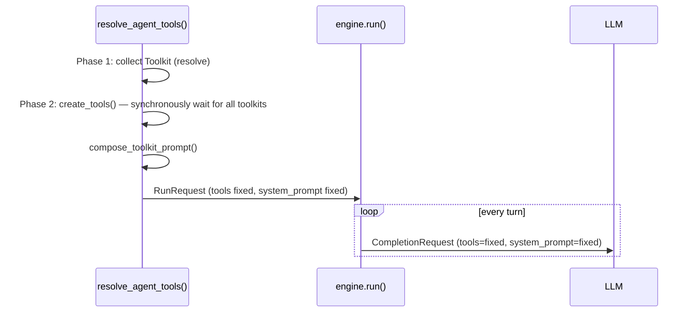
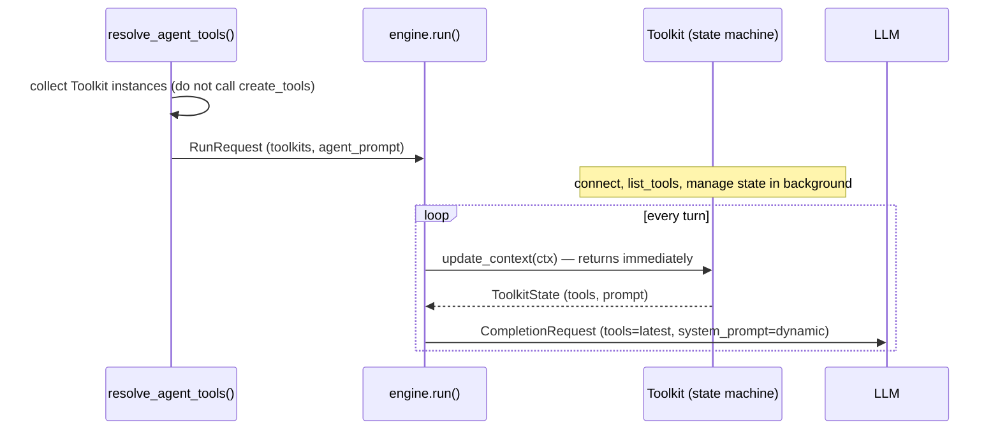

# Toolkit State Machine Design

## Overview

### Problem

Engine synchronously waits for `create_tools()` of all toolkits at run start, finalizes tool list and system prompt, then starts LLM call.

1. **First response blocking**: one slow MCP server delays entire run start. User waits even when asking question unrelated to MCP.
2. **sandbox dependency**: stdio MCP sidecar Pod must be ready to list_tools. Engine depends on sandbox lifecycle.
3. **No dynamic change**: tool additions/removals are not reflected during run. New tools after OAuth completion, MCP list_changed, etc.

All three problems derive from one constraint: **"tool list is finalized at run start"**.

### Solution

Convert toolkit into state machine that manages its own state, and change engine to **passive loading** structure where it only reads current state of toolkit on every turn.

## Discussion Points and Decisions

### 1. Should tool collection be separated from run start?

**Decision: Passive loading.** toolkit loads itself in background. Engine does not wait.

- Active (current): Engine calls `create_tools()` → waits for result → starts run after completion. Engine drives.
- Passive (adopted): toolkit is state machine that manages its own state. Engine only reads current state on every turn.

Reference: Deferred loading (Anthropic's `defer_loading: true` + Tool Search) is problem of different layer (how to efficiently deliver collected tools to LLM context). It is independent of passive loading and can be introduced separately if needed.

### 2. Should tool list be able to change in middle of turn?

**Decision: Yes.** naturally reflected with per-turn `update_context()` call. Prompt cache break is acceptable (tool change is rare event).

### 3. Should system prompt also change dynamically?

**Decision: Yes.** toolkit returns prompt every turn, so dynamic prompt is natural.

### 4. Should MCP connection change to long-lived?

**Decision: toolkit internal implementation detail.** Engine does not know. First establish state machine structure, and individual toolkits can gradually migrate.

### 5. Tool count scaling strategy

**Decision: discuss later.** It can become problem (accuracy drop at 30+ tools).

### 6. sandbox dependency of stdio MCP

**Decision: solved with state machine.** Pod creation is background, toolkit state transitions loading → ready.

### 7. built-in tool integration

**Decision: Build state machine system first, then migrate to built-in toolkit.** Model information is also included in TurnContext, so built-in toolkit can determine "available on this model".

### 8. Toolkit interface change method

**Decision: directly modify existing Toolkit ABC.** Switch at once without adapter wrapping.

### 9. TurnContext composition

**Decision: minimal context + injected on toolkit creation.** Context includes only per-turn changing information (user_id, model, etc.). Infrastructure dependencies such as DB session are injected into toolkit constructor.

### 10. Background loop lifecycle

**Decision: `_SessionRunner` unit.** Start toolkit background when runner is created, clean up on runner idle timeout/termination. `_SessionRunner` needs idle timeout addition (currently missing).

### 11. engine.py loop change

**Decision: engine directly receives toolkit list and calls `update_context()` every turn.** Engine directly knows toolkit without unnecessary abstraction.

### 12. RunRequest change

**Decision:** remove `tools: list[FunctionTool]` + `system_prompt` → replace with `toolkits: list[Toolkit]` + `agent_prompt`. Resolve step becomes light.

## Architecture

### Current



### After Change



## Data Model

### ToolkitState

```python
@dataclasses.dataclass(frozen=True)
class ToolkitState:
    """Current state of toolkit. Returned every turn."""

    tools: list[FunctionTool]
    prompt: str
```

### TurnContext

```python
@dataclasses.dataclass(frozen=True)
class TurnContext:
    """Context passed to toolkit every turn."""

    user_id: str
    workspace_id: str
    model: str
    publish_event: Callable[..., Awaitable[None]]
```

- Include only information that changes every turn.
- Infrastructure dependencies such as DB session are injected into toolkit constructor.

### Toolkit ABC Change

```python
# Before
class Toolkit(ABC, Generic[ConfigT]):
    @abstractmethod
    async def create_tools(self, config: ConfigT, context: ToolkitContext) -> list[FunctionTool]:
        ...

    def render_config_prompt(self, config: ConfigT) -> str | None:
        return None

# After
class Toolkit(ABC, Generic[ConfigT]):
    @abstractmethod
    async def update_context(self, context: TurnContext) -> ToolkitState:
        """Receive current turn context and immediately return state.
        Does not perform heavy I/O."""
        ...

    async def __aenter__(self) -> "Toolkit[ConfigT]":
        """Start background work (optional)."""
        return self

    async def __aexit__(self, *exc: object) -> None:
        """Clean background work (optional)."""
        pass
```

### RunRequest Change

```python
# Before
@dataclasses.dataclass(frozen=True)
class RunRequest:
    system_prompt: str | None
    tools: list[FunctionTool]
    builtin_tools: list[BuiltinToolSpec]
    ...

# After
@dataclasses.dataclass(frozen=True)
class RunRequest:
    agent_prompt: str | None          # only agent base prompt (fixed)
    toolkits: list[Toolkit[Any]]      # toolkit instances
    builtin_tools: list[BuiltinToolSpec]  # integrated into builtin toolkit in future
    ...
```

## State Examples

Engine does not need to structurally know toolkit internal state. toolkit expresses state in natural language prompt.

| Situation | tools | prompt |
|------|-------|--------|
| MCP connecting | [] | "Loading Slack tools..." |
| MCP connected | [post_message, ...] | "Connected to Slack workspace 'nointern'." |
| MCP connection failed | [] | "Slack MCP server connection failed: connection refused" |
| OAuth auth required | [request_authorization] | "Slack integration is required." |
| OAuth auth complete | [post_message, ...] | "Connected to Slack workspace 'nointern'." |
| sidecar Pod preparing | [] | "Sandbox preparing..." |

### State Change Triggers

**Known internally** (background loop, starts in `__aenter__`):
- MCP server connection success/failure
- list_tools completion
- sidecar Pod ready
- token expiration → refresh

**External events** (checked in `update_context`, light DB query):
- user completed OAuth auth
- admin changed toolkit settings
- user completed account linking

## engine.py Change

```python
# core loop of engine.run() after change (pseudocode)
async def run(self, request: RunRequest):
    while True:
        history = await self._store.list(sid)

        # every turn: collect toolkit state
        turn_ctx = TurnContext(user_id=..., workspace_id=..., model=..., ...)
        states = [await tk.update_context(turn_ctx) for tk in request.toolkits]
        tools = [t for s in states for t in s.tools]
        toolkit_prompt = "\n\n".join(s.prompt for s in states if s.prompt)
        tool_map = {t.spec.name: t for t in tools}

        system_prompt = request.agent_prompt
        if toolkit_prompt:
            system_prompt = f"{system_prompt}\n\n{toolkit_prompt}"

        # LLM call
        async for event in self._llm.stream(
            CompletionRequest(
                model=request.model,
                events=history,
                system_prompt=system_prompt,
                tools=[t.spec for t in tools],
            )
        ):
            ...

        # tool execution
        if function_calls:
            await self._execute_function_calls(function_calls, tool_map)
            continue
        break
```

## resolve_agent_tools() Change

```python
# Before
async def resolve_agent_tools(...) -> list[ResolvedToolkit]:
    # Phase 1: toolkit collection + resolve
    # Phase 2: create_tools() + render_config_prompt()
    # → finalize tools and prompt

# After
async def resolve_agent_tools(...) -> list[Toolkit[Any]]:
    # Phase 1: toolkit collection + resolve (same as current)
    # Phase 2: removed — do not call create_tools/compose_toolkit_prompt
    # → return only Toolkit instances
```

## _SessionRunner Change

```python
class _SessionRunner:
    def __init__(self, host: SessionHost) -> None:
        ...
        self._toolkits: list[Toolkit[Any]] | None = None

    async def _loop(self) -> None:
        while True:
            # wait for message or idle timeout
            try:
                message = await asyncio.wait_for(
                    self._queue.get(),
                    timeout=_IDLE_TIMEOUT,  # new
                )
            except asyncio.TimeoutError:
                break  # idle timeout → runner termination

            ...

    async def _ensure_toolkits(self, message) -> list[Toolkit[Any]]:
        """Collect toolkit + call __aenter__ on first message in session."""
        if self._toolkits is None:
            self._toolkits = await resolve_agent_tools(...)
            for tk in self._toolkits:
                await tk.__aenter__()
        return self._toolkits

    async def _cleanup_toolkits(self) -> None:
        """Call toolkit __aexit__ when runner terminates."""
        if self._toolkits is not None:
            for tk in self._toolkits:
                await tk.__aexit__(None, None, None)
```

## Existing Toolkit Conversion Pattern

Most toolkits are mechanical conversion:

```python
# Before
class ShellToolkit(Toolkit[ShellToolkitConfig]):
    async def create_tools(self, config, context):
        return [shell_tool, ...]

    def render_config_prompt(self, config):
        return f"Allowed domains: {config.domains}"

# After
class ShellToolkit(Toolkit[ShellToolkitConfig]):
    def __init__(self, config: ShellToolkitConfig, ...):
        self._config = config
        self._tools = [shell_tool, ...]
        self._prompt = f"Allowed domains: {config.domains}"

    async def update_context(self, context: TurnContext) -> ToolkitState:
        return ToolkitState(tools=self._tools, prompt=self._prompt)
```

- Move `create_tools()` logic to constructor or `__aenter__`.
- Move `render_config_prompt()` logic to prompt build in constructor.
- `update_context()` immediately returns cached value.

Only MCP toolkit needs real state machine (background connection, dynamic state change).

## Implementation Plan

### PR 1: Interface switch + bulk conversion of all toolkits

1. Add `ToolkitState`, `TurnContext` types (`core/tools.py`).
2. Change `Toolkit` ABC: `create_tools()` + `render_config_prompt()` → `update_context()` + `__aenter__/__aexit__`.
3. Change `RunRequest`: `tools` + `system_prompt` → `toolkits` + `agent_prompt`.
4. Change `engine.py` loop: call `update_context()` every turn.
5. Change `resolve_agent_tools()`: remove Phase 2, return only toolkit instances.
6. Change `_SessionRunner`: add idle timeout + manage toolkit lifecycle.
7. Bulk-convert all toolkits (mechanical conversion).
8. Update tests.

This PR alone completes per-turn tool recollection structure. However, existing toolkits return cached values from `update_context()`, so behavior remains same as current.

### PR 2: MCP toolkit state machine

1. Implement background connection loop in MCP toolkit (start in `__aenter__`).
2. Check OAuth token state in `update_context()` (light DB query).
3. Return dynamic (tools, prompt) depending on connection success/failure.
4. Switch to long-lived connection (optional).
5. Receive list_changed (optional).

## Alternatives Considered

| Alternative | Rejection reason |
|------|----------|
| gradual migration with adapter pattern | even with many toolkits, mechanical conversion is more efficient done at once |
| inject callback into RunRequest (engine does not know toolkit) | wrong abstraction; toolkit is core concept of engine |
| run-level toolkit lifecycle | MCP tool is lazy-loaded on every run, so first turn always has no tools |
| lazy handling in update_context without background loop | error handling of fire-and-forget task is hard, retry logic becomes messy |

## Feasibility Verification

### Call Site Analysis

| Method | Call location | External call | Change impact |
|--------|----------|----------|----------|
| `create_tools()` | only inside `resolve_agent_tools()` | none | low |
| `render_config_prompt()` | only inside `resolve_agent_tools()` | none | low |
| `RunRequest.tools` injection | one place: `process_message()` | none | low |
| `RunRequest.system_prompt` injection | one place: `process_message()` | none | low |

→ Change impact scope is limited, and there are no direct external calls, so safe to change.

### Conversion Difficulty by Toolkit Implementation

| toolkit | Conversion method | Notes |
|---------|----------|---------|
| GitHub, Notion, Sentry | mechanical | McpBasedToolkit inheritance, simple |
| MCP (Raw) | mechanical | McpBasedToolkit inheritance |
| Slack, Discord | mechanical | render_config_prompt() → prompt build in constructor |
| Google Analytics | mechanical | stdio MCP, has render_config_prompt() |
| Shell (BuiltinToolkit) | mechanical | skill/memory collection is light I/O → run every turn in `update_context()` |
| GCP | needs `__aenter__` | multiple MCP connections + JWT auth → move to `__aenter__` |
| AWS | needs `__aenter__` | SigV4 auth + MCP connection → move to `__aenter__` |
| Kubernetes | needs `__aenter__` | cluster-specific tool creation → move to `__aenter__` |

→ 9 out of 12 are mechanical conversion. 3 (GCP, AWS, Kubernetes) need moving async init (server connection/auth) to `__aenter__`, but logic itself is same.

### Subagent Impact

- Subagent also uses `resolve_agent_tools()` to resolve parent toolkit.
- If toolkit instance lives per session, same instance can be shared in subagent, which is improvement.
- However, subagent runs independent run, so need concurrency caution if sharing toolkit.

### Risks

| Risk | Mitigation |
|--------|----------|
| lack of unit tests per individual toolkit | add per-toolkit unit tests in this work |
| Shell toolkit skill/memory change detection | collect every turn in `update_context()` (light I/O) |
| concurrent toolkit access from subagent | safe because update_context() is read-only. Be careful only with background state mutation |
