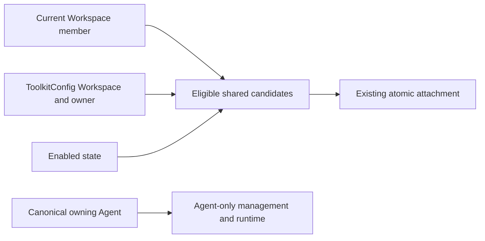

# Remove Obsolete Toolkit Visibility Scopes Design

- Requirements: [toolkitscope-261008/REQ](../requirements/toolkitscope-261008-remove-visibility-scopes.md)
- Decisions: [toolkitscope-261008/ADR](../adr/toolkitscope-261008-remove-visibility-scopes.md)
- Design revision: `1`
- Mode: Collaborative
- Decision owner: Requester
- Research baseline: main `bf7f009ea5267aa3568bb2d5b676e1fa7764ac7c`, 2026-10-08.
- Implements complete teardown under ADR-D1 and the requester's confirmed removal scope and explicit implementation request. Live migration/deployment is not authorized.

## Current System and Requirement Gaps

`ToolkitScopeType` contains only `workspace`. A shared ToolkitConfig has `owner_agent_id = NULL` and its own `workspace_id`; creation additionally stores a matching ToolkitScope. Agent-owned configuration has a canonical non-null `owner_agent_id` and no shared attachment or visibility assignment.

Workspace management already lists shared configs independently of scope. Available-list discovery requires membership, the requested Workspace, shared ownership, enabled state, and a scope-table join. Attachment atomically reuses that available-list result. Deleting the scope hides a Toolkit from new attachment candidates without removing existing attachments or effective runtime use. This hiding behavior is expressly removed by the confirmed Requirements.

The Workspace edit form exposes a Scopes section, raw Workspace ID, delete action, and Add Workspace scope. Scope management routes require Toolkit write permission. There are no Team-specific scope types in the current implementation.

## Architecture and Authority

No replacement visibility entity is introduced. Existing ToolkitConfig ownership and Workspace membership remain the only relevant ownership/visibility sources. Existing services and repositories retain their layering and transaction ownership.

### Shared availability

Replace the scope join in `ToolkitRepository.list_available_for_workspace_user` with the existing direct predicates:

- WorkspaceUser membership exists for the requester and requested Workspace;
- ToolkitConfig belongs to that Workspace;
- `owner_agent_id IS NULL`;
- `enabled = TRUE`.

Preserve ordering and response identity. Scope-driven `distinct` becomes unnecessary when no duplicate-producing join remains. Do not synthesize rows or default visibility, and do not implement a hidden flag as a replacement.

Attachment continues to claim the actual shared config, validate its Workspace and the target Agent's Workspace, and revalidate membership/availability in the existing write transaction. Exact-ID attachment and duplicate-attachment handling remain unchanged. Ownership is not inferred from a client-selected catalog tab or Slug.

### Agent-only and runtime

Preserve Agent-only exclusion from shared list/item/attachment surfaces and its exact owning-Agent Admin/Owner checks. Keep effective runtime assembly, encrypted credential reads, OAuth connections, attachments, and namespace reservation paths unchanged. The existing effective relation already resolves enabled attached shared configs and owned configs without checking ToolkitScope.

`SessionToolkitScope` is a lifecycle registry and remains. `ownership_scope` is a response ownership label and remains. MCP `config.scopes`, OAuth token scope, and configured-versus-granted detail projections remain.

## API and Frontend Contracts

Remove the three Public scope-management operations and their request/response enum/model definitions. Remove corresponding tRPC procedures and generated imports. The removed routes cease to exist; there is no success-shaped no-op endpoint, compatibility adapter, or replacement capability.

Workspace editing loses ToolkitScopeSection and related props/state/actions. Remove ScopeListState, listScopes query, scope mutations and invalidations, and callbacks. Remove only the four visibility-specific locale keys: `scopesSection`, `noScopes`, `scopeWorkspace`, and `addWorkspaceScope`. Provider OAuth labels and ownership badges remain untouched.

Preserve all other form controls, embedded state, pending guards, read retries, persistence, layout, and recent mobile overflow fixes. Static ToolkitForm stories remove obsolete scope props and add an editing assertion that the visibility section is absent. Browser E2E retains the approved catalog journey and existing ownership boundaries.

ScopeNotFound is currently reused for a missing Agent attachment during detach. Replace that use with an attachment-specific domain failure, mapping it to the existing 404 response; this does not change externally observable error status. Remove only actual scope-specific error variants and tests.

Regenerate Public OpenAPI and Python/TypeScript clients using the existing generation workflow. Do not hand-edit generated output. The TypeScript client generated directory is untracked in the current repository; regenerate it for verification, not as a new tracked surface. Python generated files, docs/tests, and exports must cease to expose scope endpoints/models.

## Data Removal and Migration

Under accepted D1 complete teardown, generate one new Alembic revision on current head `95521a5a1bbc`, update `db-schemas/rdb/revision`, and use a forward migration to drop `toolkit_scopes` followed by `toolkit_scope_type`. Read the current migration head again before generation; maintain one linear chain if main advances.

Do not modify the immutable operational baseline. Its historical table/enum definitions remain valid migration history; a fresh migration to the new head ends without those objects.

The migration operates only on obsolete visibility storage. It does not delete or rewrite ToolkitConfig, credential ciphertext, OAuth connections, Agent attachments, namespace reservations, Name/Slug values, ownership, revision, or enabled state. It does not convert removed hiding assignments into a new flag or create duplicate Toolkit resources.

No incoming FK to the scope table was found in current schema/migrations. Verify the actual isolated test DB dependency graph before dropping; fail rather than using broad CASCADE to remove unrelated objects. The outgoing ToolkitConfig FK disappears with its own table and cannot delete a parent ToolkitConfig.

The downgrade explicitly rejects automatic reconstruction of deleted scope data. Recreating every shared scope would not restore the historical hidden state; retaining a fake rollback path would misrepresent data recovery. Operational restoration, if later explicitly requested, needs a matching previous schema/data state or a forward fix.

## Failure, Rollout, and Recovery

This PR does not migrate or deploy any live environment. Any future rollout must coordinate the schema and server replacement:

1. Stop old application writers/readers that depend on scope INSERT/JOIN/CRUD.
2. Apply the new forward migration through the established deployment process.
3. Start the new server and matching regenerated frontend.
4. Verify shared discovery/attachment, ownership isolation, and existing attached runtime resources.

Old server binaries are incompatible with the dropped table and must not run alongside the migrated schema. A rollback to the old binary alone is not supported. The new code does not add a dual-reader/writer mode or fallback table probe. A frontend cache with removed tRPC procedures must refresh; it must not create a second API contract.

Migration failure remains a real failure and prevents proceeding as if teardown succeeded. No exception is converted into a successful scope response. Existing attach/read errors keep their current status meanings except that missing scope is no longer an availability condition. No new retry queue or background repair exists.

## Security and Observability

The intentional policy change is restricted to enabled shared configs previously hidden only by a missing Workspace visibility assignment. It is confirmed product authority, not an accidental permission bypass. Preserve same-Workspace member checks, shared-versus-owned predicates, exact Agent authorization, and current credential redaction.

No remote provider query, credential rotation, grant rewrite, telemetry feature, or new secret-bearing log is required. Existing error reporting remains sufficient. Logs and test outputs must not print ciphertext, decrypted credentials, or authorization tokens.

## Removal and Replacement

| Existing unit or contract | Removal authority | Replacement or remaining authority | Boundary | Verification |
| --- | --- | --- | --- | --- |
| Visibility scope UI, state, callbacks, four locale keys | REQ-1 | Normal Toolkit edit controls remain | Workspace Toolkit editor and stories | Current-source absence search; edit-story absence assertion |
| Public scope CRUD routes/models and tRPC procedures | REQ-1 | None | Current API/OpenAPI and regenerated clients | Route/schema/client symbol absence; remaining API tests |
| ToolkitScope enum, data models, repository/service CRUD and injected collaborator | REQ-1 | ToolkitConfig Workspace/ownership authority | Current backend code | Typecheck and absence search |
| Scope-based available/attach filtering | REQ-2 | Same-Workspace member + shared owner + enabled predicates | Shared candidate reads and atomic attach | Member/disabled/cross-Workspace/owned exclusion E2E |
| Scope table, enum, constraints and index | REQ-1, REQ-4, ADR-D1 | None; preserve Toolkit resources | New migration only | Isolated DB before/after evidence and parent-resource equality |
| Scope-specific tests and outdated comments | REQ-1, REQ-2 | Ownership/availability/preservation regressions | Narrow unit and representative E2E | New behavior assertion without weakening isolation coverage |
| ScopeNotFound misuse for missing Agent attachment | REQ-1; unchanged 404 contract | Attachment-specific missing failure | Detach error path | Missing attachment 404 regression |
| Current Toolkit Living Spec entity/ER/routes/glossary/behavior | REQ-1 to REQ-5 | Current ownership-based availability | Living Spec only | Catalog validation and implementation/spec comparison |

Historical migrations, implemented Requirements/ADR/Design snapshots, and historical changelog descriptions are not erased. They describe earlier contracts, not a retained runtime authority. Ordinary OAuth, ownership, runtime, memory, and database transaction scope terminology is explicitly retained.

## Test Strategy

### Representative E2E first

Update `testenv/azents/e2e/src/tests/required/public/test_toolkit.py` and reuse its product-created Workspace/member/Agent/Toolkit fixtures. Remove obsolete auto-created/delete-scope assertions and the 403-on-scope-deletion policy test. Replace them with ownership-based shared availability and new attachment assertions.

Retain representative cases for disabled Toolkit exclusion, members, cross-Workspace requests, Agent-only exclusion/exact-Agent isolation, manager versus explicit AgentAdmin authority, attach/detach, and exact instance identity when Slugs duplicate. Existing runtime/namespace tests continue to prove attached resource validity; narrower repository tests cover predicate details.

Update the existing web suite only where scope UI assertions are relevant. Add static component assertions for the editor without Scopes and continue existing OAuth/ownership and mobile form stories. Exhaustive error/state permutations remain narrow frontend or backend tests.

### Narrow verification

- Backend unit tests cover simplified candidate predicate, shared create without scope writes, retained atomic attach validation, and meaningful detach errors.
- Isolated migration integration creates data through the prior product API where practical, records safe IDs/counts and ciphertext equality without displaying secrets, upgrades to the new head, and confirms that only scope storage disappeared while existing Toolkit resources and attachments remain. Migration metadata checks may inspect the DB; product E2E/fixtures do not directly write it.
- A fresh empty DB upgrades from the historical baseline to the new head and has no scope table/enum.
- Removed scope routes/schema/client exports are absent; OAuth scopes and ownership labels remain present.
- Public clients regenerate, full backend Ruff/typecheck/targeted tests pass, frontend format/lint/typecheck/tests/Storybook pass, and documentation catalog validates.

### Fixtures, prerequisites, evidence, and CI

Existing local PostgreSQL and product-created credential-free Toolkit fixtures are sufficient. No live GitHub/MCP/cloud credential, OAuth grant introspection, provider expense, or production data snapshot is required. Testenv is fixture support only; it does not become a standalone scope-removal verifier.

Record baseline/head, commands, exit statuses, JUnit, schema absence, safe resource identity preservation, and review/CI URLs in the PR/report. Required credential-free API and Web suites run through their current CI planner. Missing required fixtures fail instead of silently skipping; optional live provider tests are not introduced.

## Authority and Feasibility Audit

| Requirement | Mechanism/evidence | Assessment |
| --- | --- | --- |
| REQ-1 | Scope UI/routes/DTO/repository/table are individually identified; clients generated from OpenAPI | Feasible; teardown boundary recorded in accepted ADR-D1 |
| REQ-2 | Repository already contains all retained predicates; atomic attach calls that repository | Feasible |
| REQ-3 | Owned configs already have canonical Agent authority and are excluded by owner predicate | Feasible |
| REQ-4 | Scope table has no found incoming references; existing effective runtime relation ignores scope | Feasible with isolated migration preservation verification |
| REQ-5 | Provider OAuth and Session lifecycle symbols are separate and explicitly excluded | Feasible |

No new product actor, permission grant, persistence authority, runtime mode, or visibility mechanism is introduced. Source-grounded authority and feasibility audit found no contradiction in preservation or ownership claims. Complete scope teardown is authorized by confirmed removal and the explicit implementation mandate; its old-binary incompatibility and inability to reconstruct obsolete assignments are disclosed removal consequences. No unapproved live operational action is included. Isolated migration preservation and generated-contract absence remain required execution evidence.

## Design Authority

- Design revision: `1`

| ID | Material mechanism | Authority | Classification |
| --- | --- | --- | --- |
| M1 | Remove visibility scope UI/API/domain authority and generated contracts | REQ-1 | required |
| M2 | Shared eligibility uses existing Workspace membership, ownership and enabled state without scope | REQ-2 | required |
| M3 | Drop obsolete scope storage; disclose coordinated schema/server replacement and unsupported automatic downgrade | REQ-1, REQ-4; ADR-D1 | decided |
| M4 | Retain exact owning-Agent isolation, grants/credentials/attachments/namespaces and non-visibility scope meanings | REQ-3, REQ-4, REQ-5; current Toolkit/MCP OAuth Specs | existing |

## Design Approval

- Mode: Collaborative
- Decision owner: Requester
- Approved on: 2026-10-08
- Approved Design revision: `1`
- Approved authority IDs: `M1`, `M2`, `M3`, `M4`
- Authority basis: the requester confirmed removing the hiding feature/specification itself and then explicitly requested implementation. The implementation briefing disclosed full UI/API/backend/storage removal, preservation boundaries, unsupported reconstruction of removed hiding assignments, old-binary incompatibility, and no live rollout.
- Approved scope: implement complete visibility-scope removal in one reviewed PR, preserving Workspace/Agent ownership, OAuth permissions, and existing Toolkit resources. This direct implementation mandate is not an authorization for live migration, deployment, or restoration of old policy data.
