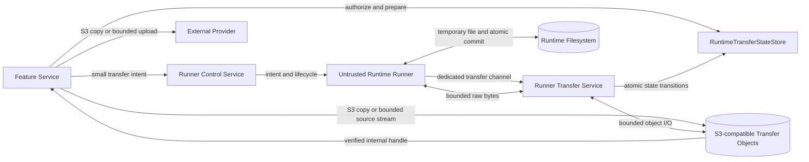
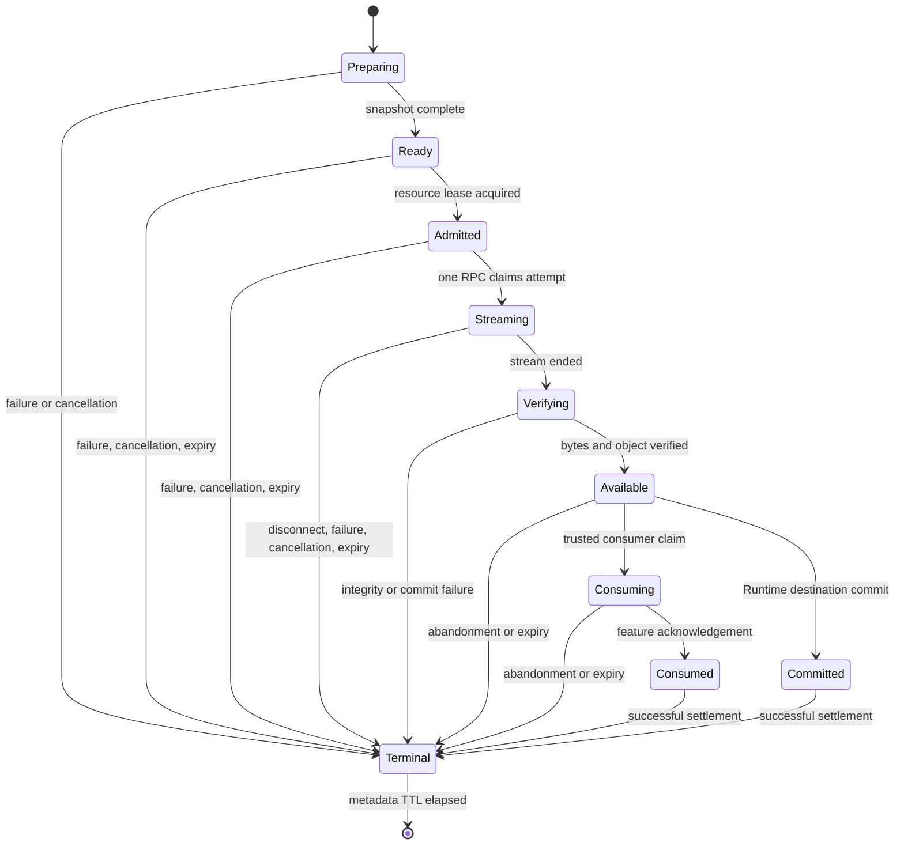
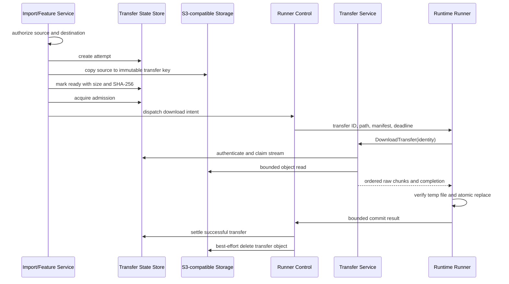
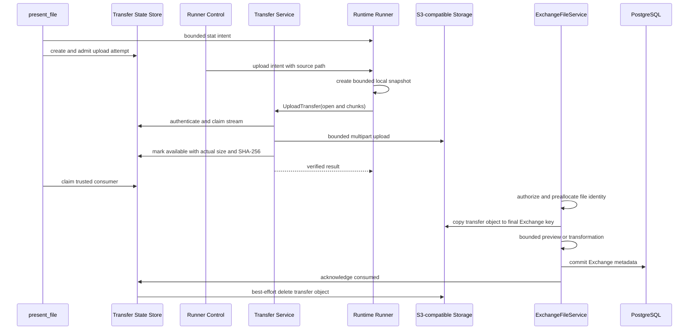

# transfer-260725/DESIGN: Runtime File Transfer

## Requirements and Decisions

This design implements the confirmed [Runtime File Transfer Requirements](../requirements/transfer-260725-runtime-file-transfer.md) (`transfer-260725/REQ`) under the accepted [Runtime File Transfer ADR](../adr/transfer-260725-runtime-file-transfer.md) (`transfer-260725/ADR`).

The design does not redefine user-visible attachment selection, External Channel authorization, Exchange or Artifact identity, provider file-size policy, ordinary file tools, or product file retention. It replaces only the complete-file transport and the unchanged object-to-object relay paths identified by the snapshot.

## Design Summary

Runtime file transfer uses three distinct planes:

- **Control plane:** existing Runner Control carries authenticated transfer intent, Runtime path, authorization correlation, cancellation, progress, and terminal operation status. It carries no file bytes.
- **Runtime data plane:** a separate `RuntimeRunnerTransfer` gRPC service carries bounded raw byte chunks between Runtime Control and Runner over a dedicated Runner channel.
- **Internal object plane:** the existing S3-compatible workspace bucket stores one immutable attempt object. Existing S3 sources enter that namespace through object-store-native copy. Verified Runtime uploads leave it through object-store-native copy or a bounded provider stream.

Runtime Control remains the trusted Runtime boundary. Runner knows a transfer ID, attempt ID, direction, Runtime path, size, checksum, deadline, and protocol fields. It never receives bucket names, object keys, presigned URLs, credentials, provider URLs, or storage SDK operations.



## Current Behavior and Gaps

| Current path | Current behavior | Requirement gap | Replacement |
| --- | --- | --- | --- |
| Slack inbound | HTTP chunks are accumulated into one `bytearray`, converted to `bytes`, then sent through `FileStorage.put()` | Whole-file Worker memory and one proportional Runner Control message | Slack stream to immutable transfer object, then typed download RPC |
| Exchange and Artifact import | Resolver downloads S3 object to `bytes`, then calls Runtime `file.write` | S3 download/re-upload relay and large control message | Authorized S3 copy to transfer object, then typed download RPC |
| Current-run `azents://` import | VFS entry decodes to complete `bytes`, then calls Runtime `file.write` | Additional complete binary materialization and large control message | Incremental Base64 decode into transfer object, then typed download RPC |
| `present_file` | Runtime `file.read(max_bytes=None)` returns complete bytes, then Exchange uploads them | Base64 operation events and Server memory relay | Typed upload RPC to transfer object, then S3 copy to Exchange key |
| External Channel outbound | Repeated bounded `file.read` control operations stream to provider | Runtime boundary still uses ordinary control RPC repeatedly | One typed upload RPC to transfer object, then provider adapter stream |
| Runner write body | Redis stores Base64 chunks, Runner gRPC bridge rebuilds all chunks into one protobuf message | Redis byte relay and 4 MiB gRPC limit | No transfer bytes in coordination store or Runner Control protobuf |
| Runner read body | Runner emits Base64 file events and operation client joins them | Whole-file aggregation in Runner Control result path | Independent raw-byte transfer stream |

The current gRPC server and client use default message limits. This design intentionally keeps each new message bounded below that limit rather than raising the global limit as the primary solution.

## Ownership Boundaries

| Component | Owns | Must not own |
| --- | --- | --- |
| Feature service | Source and destination authorization, product identity, product metadata, final publication, provider delivery | Runner streaming protocol or transfer object cleanup implementation |
| Runtime transfer coordinator | Attempt creation, admission, state transitions, object lease, cancellation, consumer handoff | Exchange, Artifact, ModelFile, FilePart, or provider product semantics |
| Runtime Control transfer service | Runner authentication, transfer authorization, object streaming, actual byte count and SHA-256 | Public file identity, user-visible URI, or Runner filesystem policy outside the admitted intent |
| Runtime Runner | Authorized Runtime source read, destination temporary file, independent checksum, atomic local commit | S3 authority, transfer selection, source product authorization, or terminal server result authority |
| Transfer state store | Bounded manifests, attempt fencing, admission lease, phase, outcome, cleanup state | File-body chunks or product file metadata |
| S3-compatible storage | Immutable attempt bytes and final product objects | Transfer authorization or operation state machine |
| Exchange/Artifact service | Final object key, preview or transformation, DB metadata, retention and compensation | Runner credentials or data RPC details |
| External Channel adapter | Provider credential, provider transfer, provider result semantics | Runner Control byte payloads or durable transfer content |

## Transfer Domain Model

### Transfer identity

A logical feature operation receives one `transfer_id`. Each byte-transfer try receives a distinct `attempt_id`.

```text
transfer_id  = stable correlation for one feature operation
attempt_id   = immutable identity for one byte-transfer try
object key   = runtime-transfers/v1/{runtime_id}/{transfer_id}/{attempt_id}/body
```

The key format is internal and never crosses the Runner RPC contract. Object metadata may contain non-secret attempt identity, creation time, logical expiration, actual size, and SHA-256 to support cleanup verification. It does not contain user IDs, bearer material, provider URLs, or public URIs.

### Transfer record

`RuntimeTransferRecord` is a frozen domain value containing at least:

- transfer and attempt identity;
- direction;
- Runtime ID, desired generation, accepted Runner connection generation;
- owner operation and optional owner Session correlation;
- admitted Runtime path and overwrite policy;
- expected size and optional trusted expected SHA-256;
- actual size and SHA-256 when known;
- phase, terminal outcome, cancellation and deadline timestamps;
- admission lease identity and expiration;
- object handle owned by the transfer service;
- consumer claim and acknowledgement metadata;
- one-hour absolute content expiration;
- terminal metadata expiration;
- cleanup status and bounded error classification; and
- creation and update timestamps.

The record never contains file bytes, S3 credentials, presigned URLs, provider credentials, or bearer headers.

### State model

Transfer phase, terminal outcome, and cleanup status are separate fields. Cleanup failure therefore does not replace a successful feature outcome.



Terminal outcome is one of `succeeded`, `failed`, `cancelled`, `expired`, or `superseded`. Cleanup status is one of `not_required`, `pending`, `complete`, or `retryable_failure`.

A transition includes the expected attempt ID, Runtime generation, current phase, and state revision. The store applies it atomically or returns the current record without allowing a stale caller to overwrite newer state.

## Transfer State Store

### Contract

A dedicated `RuntimeTransferStateStore` Protocol exposes domain operations rather than Redis commands:

- create an immutable attempt;
- get the current record;
- acquire or reject admission;
- claim the one data RPC allowed for an attempt;
- refresh bounded heartbeat and progress evidence;
- request cancellation;
- move into verification and available state;
- claim and acknowledge a trusted consumer;
- settle a terminal outcome;
- record cleanup progress;
- release admission idempotently; and
- list expired or cleanup-pending records in bounded pages.

No API accepts or returns file chunks.

### Redis implementation

`RedisRuntimeTransferStateStore` provides shared atomic state for multi-replica Runtime Control. It uses compare-and-set scripts or transactions for attempt claims, state revisions, admission counters, cancellation, terminal settlement, and lease release. Progress is coalesced by byte or time thresholds rather than written for every chunk.

Redis keys expire from the terminal metadata TTL. Admission counters are lease-backed so replica loss does not permanently consume capacity. Transfer state serialization is adapter-private.

### In-memory implementation

`InMemoryRuntimeTransferStateStore` implements the same contract under an `asyncio.Lock` and uses an injected clock for deterministic TTL and cleanup tests. It actively purges expired records and admission leases rather than ignoring TTL values.

The in-memory backend is supported only when one Runtime Control process owns all transfer state. Helm and runtime configuration reject `replicas > 1` with a process-local backend. Process restart fails active attempts closed; the S3 cleanup boundary handles any orphan object.

### Runtime Control composition

Runtime Control selects `memory` or `redis` through configuration. Business services receive only the Protocol. The existing hard-coded `RedisRuntimeCoordinationStore` construction is replaced by configured composition where standalone operation is supported. Existing coordination and transfer stores may share one Redis client lifecycle, but they keep separate domain interfaces and key namespaces.

## Internal Object Storage

### S3 service extensions

The shared S3 library gains bounded interfaces in addition to the current eager `download_bytes()` method:

- object metadata lookup returning size, checksum metadata, content type, and existence;
- async bounded object-body iteration with explicit close behavior;
- immutable copy with source and destination identity and metadata policy;
- multipart upload create, part write, complete, and abort operations;
- optional multipart copy for objects above a backend's single-copy limit;
- bounded deletion and prefix reconciliation; and
- checksum-capable final object verification.

The transfer path does not call `download_bytes()`.

Runtime Control constructs an async S3 client for its full process lifespan using the existing workspace bucket, endpoint, and ambient or configured credentials. Runner never receives this configuration.

### Snapshot creation

An attempt becomes `ready` only after its immutable object exists and its manifest is known.

- **Existing S3 source:** the feature owner authorizes the product object and uses S3 copy into the transfer namespace. It supplies the trusted product size and SHA-256. The destination object is checked before the attempt becomes ready.
- **External provider source:** the provider adapter streams response bytes into multipart upload, computes actual size and SHA-256, enforces declared and actual limits, and completes the object only on success.
- **Current-run VFS source:** the resolver validates the existing projection identity and incrementally decodes Base64 into multipart upload. The canonical projection may already hold encoded content in memory, but the transfer path does not create a second whole-file binary buffer.
- **Runtime source:** Runtime Control creates the attempt object only through `UploadTransfer` and completes it after trusted actual-byte verification.

A failed copy or upload never advances the attempt to ready or available.

### One-hour validity and cleanup

Every object has an absolute logical expiration at:

```text
min(attempt_created_at + 1 hour, authoritative_source_expires_at when present)
```

Normal settlement immediately invalidates the attempt and starts best-effort deletion or multipart abort. A physical delete failure records cleanup evidence but does not reverse a committed Runtime file, product publication, or provider delivery.

Authorization always checks logical expiration. An object that remains physically present after expiration cannot be reopened by Runner or a feature consumer.

A bounded cleanup loop retries cleanup-pending and expired records. An object-store lifecycle rule on the transfer prefix uses the shortest portable backend interval as a final defense for orphan objects and incomplete multipart uploads. It is deliberately coarser than the one-hour authorization contract.

## Runner Transfer RPC

A new protobuf file, `runtime_runner_transfer.proto`, defines a separate service in the existing Runtime Control package and generation pipeline.

```protobuf
service RuntimeRunnerTransfer {
  rpc DownloadTransfer(DownloadTransferRequest)
      returns (stream DownloadTransferFrame);

  rpc UploadTransfer(stream UploadTransferFrame)
      returns (UploadTransferResult);
}
```

### Shared identity

```protobuf
message TransferIdentity {
  string transfer_id = 1;
  string attempt_id = 2;
  string runtime_id = 3;
  uint64 runner_generation = 4;
}
```

The authenticated credential remains authoritative for Runtime ID and desired generation. Repeating identity in the request allows strict mismatch rejection and bounded diagnostics; it does not let the payload choose its authority.

### Download RPC

`DownloadTransferRequest` contains only identity. The destination path, overwrite policy, expected size, expected SHA-256, and deadline arrive through the authenticated Runner Control intent and must match Runner's pending transfer slot.

`DownloadTransferFrame` is direction-specific:

```protobuf
message DownloadTransferFrame {
  oneof payload {
    TransferChunk chunk = 1;
    DownloadTransferComplete complete = 2;
  }
}

message TransferChunk {
  uint64 offset = 1;
  bytes data = 2;
}

message DownloadTransferComplete {
  uint64 actual_size = 1;
  string sha256 = 2;
}
```

Runtime Control sends the completion frame only after the complete object read satisfies the manifest. A stream error or missing completion frame cannot publish a Runtime destination.

### Upload RPC

The first `UploadTransferFrame` must be one opening frame with identity. Later frames are chunks followed by one completion declaration. Runtime Control rejects any chunk before open, repeated open, repeated completion, data after completion, offset mismatch, or exceeded size.

`UploadTransferResult` returns the actual size, authoritative SHA-256, and bounded terminal classification. It contains no object identity.

### Authentication and authorization

Every transfer RPC:

1. authenticates the Runtime-bound bearer credential through the existing Runner credential verifier;
2. rechecks the credential against current durable Runtime desired generation;
3. loads the attempt from `RuntimeTransferStateStore`;
4. matches Runtime ID, Runner connection generation, direction, attempt, deadline, and admissible phase;
5. atomically claims the one stream allowed for the attempt; and
6. fails closed before reading or sending a file byte on mismatch.

Transfer authorization does not depend only on the long-lived `ConnectRunner` connection. A reconnect can use a new transfer RPC only if the current transfer record and generation allow it.

### Error mapping

The gRPC layer maps bounded domain failures consistently:

| Condition | gRPC status | Domain classification |
| --- | --- | --- |
| Missing or invalid credential | `UNAUTHENTICATED` | `runner_unauthenticated` |
| Runtime or transfer scope mismatch | `PERMISSION_DENIED` | `transfer_access_denied` |
| Unknown or expired attempt | `NOT_FOUND` or `FAILED_PRECONDITION` | `transfer_unavailable` |
| Duplicate active stream | `ALREADY_EXISTS` | `attempt_already_claimed` |
| Admission or actual-size limit | `RESOURCE_EXHAUSTED` | `transfer_resource_exhausted` |
| Deadline | `DEADLINE_EXCEEDED` | `transfer_deadline_exceeded` |
| Caller or operation cancellation | `CANCELLED` | `transfer_cancelled` |
| Offset, length, or checksum mismatch | `DATA_LOSS` | `transfer_integrity_failed` |
| Invalid frame state | `FAILED_PRECONDITION` | `transfer_protocol_violation` |

A known data-path error is immediately correlated to the initiating control operation and must not surface only as a later generic operation timeout.

## Runner Local File Handling

### Server-to-Runtime destination

Runner resolves and validates the authorized path through the existing workspace policy. It creates an attempt-owned temporary file in the destination directory so the final operation remains on one filesystem.

Runner writes chunks only at the next expected offset and computes SHA-256 incrementally. It flushes and synchronizes the temporary file before commit. After receiving and validating the completion frame, it rechecks path and overwrite policy and uses an atomic replacement primitive. Existing `file.edit` and patch staging already demonstrate same-directory temporary files and `os.replace()` in Runner.

Failure, cancellation, disconnect, checksum mismatch, or deadline removes only the temporary path. With `overwrite=true`, the previous destination remains available until verified atomic replacement. With `overwrite=false`, a destination that appears before commit causes failure.

### Runtime-to-server source

Runner validates that the source is a regular readable file and not an unsupported symlink target. To avoid streaming a path that changes while it is read, Runner creates an attempt-owned local snapshot through a bounded disk copy, records source identity and metadata before and after snapshot creation, and fails if the source changed during that operation. It computes the snapshot size and SHA-256 and streams from the snapshot file.

The local snapshot avoids whole-file memory and isolates the upload from later Runtime writes. It is removed through the same success, failure, cancellation, and one-hour local cleanup policy.

Runner-provided size and SHA-256 remain validation inputs. Runtime Control independently computes the authoritative result from received bytes.

## End-to-End Flows

### Existing S3 object to Runtime



The Feature service never downloads the source body. Runtime Control never sees the product source key; it reads the transfer-owned object only.

### External provider to Runtime

Slack metadata and credentials remain owned by the External Channel service. The Slack client exposes an async byte iterator rather than a complete `bytes` result. The adapter streams to multipart upload, enforces declared and actual configured limits, computes SHA-256, and marks the attempt ready. The Runtime portion then uses the same download flow.

Provider authentication failures, rate limiting, source disappearance, actual-size excess, and stream interruption settle source preparation before Runner receives an intent.

### Runtime to Exchange through `present_file`



`present_file` reports success only after Exchange metadata commits. A completed Runtime upload followed by Exchange failure is a failed `present_file` operation, even though the transfer object may remain consumable until its one-hour lease expires.

### Runtime to External Channel provider

External Channel preflight continues to authorize the binding, paths, per-file limit, and action limit. Each selected Runtime source uses one Runtime upload attempt. The provider adapter claims the verified object and streams it through the provider-native API. Provider success acknowledges consumption. Provider failure abandons or retries consumption only within the same unexpired attempt; retry after acknowledgement or expiration creates a new transfer.

No Exchange, Artifact, ModelFile, or FilePart resource is created for this relay.

### Runtime to Artifact or future internal destination

Artifact and future internal file services consume the same verified-object handle and use their own preallocated key, S3 copy, DB metadata, authorization, and compensation contracts. Adding a consumer does not change Runner protobuf.

## Feature Service Interface Changes

### Complete-file transfer abstraction

Ordinary `FileStorage.get()` and `put(bytes)` remain for bounded filesystem tool behavior. Complete-file flows stop using those methods and depend on a separate `RuntimeFileTransferService`.

Conceptual methods:

```python
async def download_to_runtime(
    *, source: AuthorizedTransferSource, runtime: RuntimeTarget,
    destination_path: str, overwrite: bool, deadline: datetime
) -> RuntimeTransferResult: ...

async def upload_from_runtime(
    *, runtime: RuntimeTarget, source_path: str,
    expected_size: int, deadline: datetime
) -> VerifiedTransferObject: ...
```

`VerifiedTransferObject` is an internal opaque handle. Only trusted server services can consume it. The Runner, model, public API, and event transcript never receive it.

### Authorized object sources

Exchange and Artifact resolution split metadata authorization from body download. Import resolvers return an `AuthorizedTransferSource` containing display name, media type, size, SHA-256, source expiration, and an internal source-object handle. The handler passes that source to transfer staging instead of accessing `body: bytes`.

The current `ImportResolvedFile.body` model is replaced for complete-file imports. The `azents://` resolver exposes a bounded source iterator or staging callback after its current ownership and hash validation.

### Product creation from verified object

Exchange and Artifact services gain object-source creation methods. They preserve the existing short-DB-session pattern:

1. authorize and preallocate identity and final key;
2. close the DB session;
3. copy the verified transfer object to the final key;
4. perform bounded preview or transformation work;
5. reopen the DB session and revalidate ownership;
6. commit metadata; and
7. compensation-delete only the uncommitted final object on failure.

The transfer object is not deleted by product compensation. The feature service acknowledges consumption only after its own contract commits.

### Bounded preview handling

Text preview uses an incremental UTF-8 decoder and scans the complete stream for invalid bytes or unsupported control characters while retaining only the configured preview prefix. Image thumbnail generation uses a bounded-memory temporary or spooled file because image decoders require seekable content. Other file types require no content read during unchanged publication.

These feature-owned reads are deliberate inspection or transformation and do not re-upload unchanged bodies through application memory.

## Cancellation, Deadline, and Reconciliation

Control-operation cancellation atomically marks the transfer cancel-requested, cancels the active data RPC, stops provider or S3 reads, aborts incomplete multipart upload, releases admission, and schedules best-effort cleanup.

Every blocking boundary uses the earlier of the operation deadline and one-hour transfer expiration:

- source HTTP request;
- S3 copy or multipart operation;
- admission lease;
- Runner data RPC;
- Runtime local snapshot and commit;
- trusted consumer lease; and
- cleanup retry.

A replacement Runtime generation invalidates the credential and attempt. A reconnect from the same desired Runtime generation may observe terminal metadata but cannot reopen an already claimed or terminal byte stream. An interrupted nonterminal stream requires a new attempt from byte zero.

A bounded reconciler handles:

- expired active attempts;
- stale admission leases;
- cleanup-pending objects;
- consumer leases that expired without acknowledgement;
- incomplete multipart uploads known to the state store; and
- bounded transfer-prefix orphan scans for records lost by the memory backend or exceptional state loss.

Object listing and cleanup are paginated. Reconciliation never interprets an object as successful transfer state.

## Admission and Backpressure

Admission occurs before object allocation or Runner intent dispatch. The service applies existing product and provider size limits and separate configurable budgets for:

- active transfers per Runtime;
- admitted bytes per Runtime;
- upload and download streams per replica;
- total transfer streams per deployment;
- S3 copy requests;
- multipart uploads and in-flight parts; and
- checksum and feature-consumer work.

A rejected admission returns a concrete retryable transfer error. Runtime Control does not keep an unbounded queue.

The byte pipeline uses a fixed maximum chunk size below the ordinary gRPC message limit. Download reads the next S3 range or body chunk only when the prior bounded buffer can advance. Upload aggregates only enough data for one bounded multipart part and caps concurrent part requests. Exact sizes and concurrency defaults are configuration validated against a maximum process-memory calculation.

Transfer semaphores are separate from Runner Control heartbeat, operation start, cancellation, Provider lifecycle, and reconciliation budgets.

## Configuration and Deployment

### Runtime Control settings

The design adds configuration equivalent to:

- transfer endpoint, defaulting to the Runner Control endpoint;
- transfer state backend: `memory` or `redis`;
- transfer TTL, validated as positive and at most 3,600 seconds;
- terminal metadata TTL, at most 3,600 seconds;
- chunk, multipart, stream, per-Runtime, per-replica, and deployment budgets;
- cleanup interval and bounded page size; and
- transfer object prefix under the existing workspace bucket.

The existing workspace S3 bucket, endpoint, credentials, TLS, Runner credential root, and Runtime database configuration are reused.

### Helm

Runtime Control and Runner receive a separately configurable transfer endpoint. The default points to the current Runtime Control Service and port. Runner still creates a distinct transfer channel and connection.

When the selected state backend is memory, Helm requires one Runtime Control replica and disables autoscaling above one replica. Redis-backed state permits the existing multi-replica and HPA configuration.

The chart adds no Runner S3 credentials, presigned URL, bucket, or object key. Runtime Runner NetworkPolicy needs only the transfer endpoint it already reaches through Runtime Control.

The transfer object prefix receives the shortest portable lifecycle rule for object expiration and incomplete multipart abort. Application authorization continues to enforce one hour synchronously.

## Protocol Cutover

This snapshot uses one coordinated cutover without backward compatibility.

1. Stop or drain the single user's active Runtime work.
2. Deploy Runtime Control with the new protobuf service, object store, state backend, and feature consumers.
3. Deploy or recreate Runtime with the new Runner image and protocol version.
4. Require exact supported Runner protocol registration and `file.transfer.v1`.
5. Resume Runtime work and execute deterministic transfer smoke tests.

Old Runner registration is rejected. Existing `file.upload` and `file.download` inline semantics are not a fallback. Ordinary bounded `file.read`, `file.write`, edit, patch, and process operations remain.

Rollback is also coordinated across Control, Runner, and consumers. Any attempt object left by either direction remains inaccessible after its one-hour logical expiration and is removed by cleanup or lifecycle defenses.

## Security

- Runner is authenticated on every data RPC with the existing Runtime-bound signed credential.
- Durable desired generation, accepted Runner generation, attempt identity, direction, phase, deadline, and admission are revalidated before bytes move.
- Runner cannot select an object, provider, user, Session, Agent, or transfer by supplying a path or storage identity.
- Runtime Control has only internal object-store access; Runner has none.
- The transfer prefix can receive narrower object-storage permissions than product prefixes because feature owners perform source and final copies.
- File paths, sizes, hashes, offsets, completion claims, and local filesystem results from Runner are untrusted inputs.
- Actual Runtime-to-server size and SHA-256 are computed by Runtime Control.
- Malformed frames, invalid offsets, oversized data, stale attempts, and late completion settle only the affected attempt.
- Logs and metrics exclude bytes, credentials, private URLs, bearer metadata, and public download tokens.
- Failed or rejected Runner content is not retained for debugging.
- Logical expiration is checked on every access even if physical deletion failed.

## Observability

Every transfer log and metric uses bounded identifiers and includes as applicable:

- transfer and attempt ID;
- Runtime ID and generation;
- direction and phase;
- source category and consumer category, without object key or provider URL;
- expected and actual bytes;
- checksum outcome, without file content;
- admission wait or rejection classification;
- chunk and multipart counts;
- stream, source, object-store, consumer, and total duration;
- cancellation, timeout, integrity, protocol, source, destination, and cleanup outcome; and
- initiating control operation correlation.

Metrics distinguish control-plane and data-plane failure. Alerts should identify message-size errors, transfer `RESOURCE_EXHAUSTED`, checksum mismatch, stale cleanup, orphan detection, and control heartbeat degradation during transfer load.

A transfer-specific terminal failure is appended promptly to the initiating operation result. The generic Runtime operation timeout remains only a last-resort watchdog, not the expected signal for a known transfer failure.

## Test Strategy

### E2E primary verification matrix

| Scenario | Expected evidence |
| --- | --- |
| 6 MiB Slack attachment to Runtime | Complete bytes and SHA-256 at destination; default gRPC message limit unchanged; Control stream remains connected |
| Exchange and Artifact import above 4 MiB | S3 copy into transfer prefix; no `download_bytes()` call; destination matches source |
| `present_file` above 4 MiB | Runner upload stream, verified transfer object, S3 copy to Exchange key, attachment available |
| External Channel outbound above 4 MiB | One Runtime upload attempt and bounded provider stream; no repeated `file.read` body relay |
| Concurrent process operation during transfer | Heartbeat and bounded process operation complete without data-stream starvation |
| Cancellation | Data RPC stops, admission releases, attempt invalidates, cleanup attempted, explicit cancellation result |
| Oversized actual upload | `RESOURCE_EXHAUSTED`, multipart abort, no available object |
| Corrupt or out-of-order frames | `DATA_LOSS`, no Runtime commit or S3 complete |
| Unauthorized transfer identity | `PERMISSION_DENIED` before first byte |
| Stale Runner generation | Authentication or precondition failure; newer attempt unaffected |
| Duplicate attempt stream | One claim succeeds; duplicate receives deterministic rejection |
| Destination appears before `overwrite=false` commit | Original remains, transfer fails explicitly |
| Feature publication failure | Transfer object remains only within unacknowledged lease; no product metadata success |
| One-hour logical expiry with failed physical delete | Every access rejects expired attempt; cleanup metric and lifecycle evidence remain |
| Memory backend restart | Active attempt fails closed; orphan is not inferred successful |
| Redis backend replica handoff | Shared state fences duplicate stream and preserves terminal result |

### Test layers

- **State-store contract tests:** run the same transition, admission, cancellation, expiry, consumer, cleanup, and fencing suite against memory and Redis.
- **S3 integration tests:** use RustFS for bounded reads, immutable copy, multipart upload, abort, checksum metadata, object verification, and cleanup.
- **gRPC integration tests:** use the generated service and real default message limits. Assert no individual message is proportional to the complete file.
- **Runner filesystem tests:** verify same-directory temporary files, fsync, atomic replacement, overwrite races, local source snapshot, source-change detection, cancellation, and cleanup.
- **Feature service tests:** prove Exchange and Artifact object-source publication preserves authorization, metadata, preview, transaction, and compensation behavior.
- **External Channel tests:** extend the deterministic Slack proxy to stream a file above the old message limit and record request and result evidence.
- **E2E tests:** cover the primary scenario and user-visible import and presentation flows through the real Worker, Runtime Control, Runner, RustFS, and browser or API surface.

### Fixtures and prerequisites

The E2E RustFS fixture creates the transfer prefix and cleanup policy where supported. Time-dependent one-hour behavior uses an injected clock and explicit reconciler execution rather than waiting in CI. The Slack fixture serves deterministic streaming bodies and declared sizes. Test artifacts record hashes and sizes but never credentials or file contents beyond synthetic fixture bytes.

Redis-backed contract tests require the existing Redis fixture. Memory-backed tests are mandatory and do not skip. Live Slack verification is optional and diagnostic; the deterministic provider fixture is the required CI path.

### CI policy and evidence

Core unit, contract, RustFS integration, gRPC integration, and deterministic E2E tests must pass without optional live credentials. A missing required RustFS or Runner prerequisite fails rather than skips the core transfer suite. Optional live-provider tests may skip only when their explicit credential snapshot is absent.

Evidence includes operation result, transfer phase and terminal classification, expected and actual size, SHA-256 equality, destination or product visibility, Control connection continuity, object cleanup attempt, and absence of a `RESOURCE_EXHAUSTED` message-size failure.

## Traceability

| Requirement | ADR decisions | Design mechanisms | Verification |
| --- | --- | --- | --- |
| `transfer-260725/REQ-1` | D1, D2, D6, D7, D8, D9 | Immutable staging, download RPC, atomic Runtime commit | Slack and object import E2E |
| `transfer-260725/REQ-2` | D1, D2, D3, D6, D7, D8, D9 | Upload RPC, verified object, feature-owned publication | `present_file` and outbound E2E |
| `transfer-260725/REQ-3` | D1, D6, D8, D9 | Separate service, channel, messages, semaphores | Concurrent Control/data integration test |
| `transfer-260725/REQ-4` | D2, D4, D5, D7, D8 | Bounded chunks, multipart parts, admission, no Redis bytes | Memory-bound and overload tests |
| `transfer-260725/REQ-5` | D2, D3, D4, D7 | SHA-256, exact size, temp file, atomic replace, object complete | Corruption and destination-race tests |
| `transfer-260725/REQ-6` | D1, D3, D4, D5, D6, D7, D8 | Cancellation propagation, fail-closed state, explicit errors | Cancellation, timeout, reconnect tests |
| `transfer-260725/REQ-7` | D2, D3, D6, D9 | Common transfer service and opaque verified object | All feature flow tests |
| `transfer-260725/REQ-8` | D1, D3, D4, D5, D6, D7, D8, D9 | Structured phases, error taxonomy, metrics | Log and metric assertions |
| `transfer-260725/REQ-9` | D1 through D9 | Per-RPC auth, scoped attempt, no Runner storage access | Adversarial protocol tests |
| `transfer-260725/REQ-10` | D2, D3, D5, D7 | S3 copy staging and final publication | Spy/integration assertion of no eager download |
| `transfer-260725/REQ-11` | D4, D5, D8 | Store Protocol, memory and Redis implementations, replica validation | Shared contract suite and config tests |
| `transfer-260725/REQ-12` | D2, D3, D4, D5, D7, D8 | One-hour authorization TTL, best-effort delete, cleanup reconciler | Injected-clock expiry and orphan tests |

## Feasibility Validation

| Requirement | Result | Repository evidence and required work |
| --- | --- | --- |
| REQ-1 | Feasible | Slack already exposes `aiter_bytes`; S3 staging and transfer RPC are missing but fit existing service and proto boundaries. |
| REQ-2 | Feasible | Runtime file stat/read operations and product consumers exist; replace complete operation events with the new upload service. |
| REQ-3 | Feasible | Runtime Control already hosts gRPC services and Runner creates outbound channels; add a separate service and channel. |
| REQ-4 | Feasible | Async HTTP, aioboto3, gRPC async streaming, and bounded ranged reads exist; add multipart and admission abstractions. |
| REQ-5 | Feasible | Runner already uses same-directory temporary files, fsync, and `os.replace()` for atomic edits; generalize the pattern for transfer. |
| REQ-6 | Feasible | Control operations already support cancellation, deadlines, generation fencing, and terminal metadata; bridge them to data RPC and object cleanup. |
| REQ-7 | Feasible | All identified consumers depend on `FileStorage` or direct bytes today and can move to one separate complete-file service without changing ordinary tools. |
| REQ-8 | Feasible | Structured logging and correlated operation IDs already exist; add transfer phases, metrics, and direct error mapping. |
| REQ-9 | Feasible | Runner bearer authentication is Runtime and desired-generation bound; add transfer and attempt authorization to each RPC. |
| REQ-10 | Feasible | `S3Service.copy()` already exists. Exchange and Artifact need object-source creation APIs and bounded inspection paths. |
| REQ-11 | Feasible | Runtime coordination already has a Protocol, Redis and in-memory implementations, and shared contract tests. Runtime Control composition currently hard-codes Redis and must become configurable. |
| REQ-12 | Feasible | State-store TTL, injected clocks, explicit cleanup, and S3 lifecycle defenses provide the required logical and physical split. |

No requirement or accepted ADR decision is blocked. Conditional items are implementation work, not unresolved architecture choices.

## Implementation Impact

Expected primary code areas:

- `proto/azents/runtime_control/v1/` for the new transfer service;
- `python/libs/azents-runtime-control/` for generated modules and transfer client contracts;
- `python/apps/azents/src/azents/runtime/` for state, store adapters, coordinator, gRPC service, S3 lifespan, reconciliation, and control correlation;
- `python/apps/azents-runtime-runner/` for the transfer client, local snapshot, temporary destination, checksum, and atomic commit;
- `python/libs/az-common/` for bounded S3 read, multipart write, copy, verification, and cleanup primitives;
- `python/apps/azents/src/azents/engine/tools/` for import and presentation migration;
- `python/apps/azents/src/azents/services/external_channel/` for provider stream adapters;
- `python/apps/azents/src/azents/services/exchange_file/` and `services/artifact.py` for object-source publication;
- `infra/charts/azents/` for endpoint, backend, limits, replica validation, and lifecycle contract; and
- `testenv/azents/` for deterministic large-file, RustFS, Runner, and mixed-control evidence.

Implementation should be phased because the work spans a shared S3 library, external Runner protocol, Runtime Control, Runner filesystem behavior, multiple feature consumers, Helm, and E2E fixtures. The coordinated protocol cutover occurs only after all phases are integrated and verified.

## Living Spec Updates Required at Implementation

- `docs/azents/spec/flow/agent-runtime-control.md`
  - replace Runner inline complete-file body semantics with the transfer service;
  - document state-store backend selection, transfer auth, admission, and protocol cutover.
- `docs/azents/spec/flow/file-exchange-storage.md`
  - replace `FileStorage.put/get` and repeated `read_range` complete-file flows;
  - document S3-native staging and publication, one-hour retention, and bounded preview handling.
- External Channel flow sections and code paths must describe the common transfer service and remove the current inaccurate `iter_chunks` wording where implementation uses repeated `read_range`.

## Remaining Non-Blocking Risks

- S3-compatible backends may differ in multipart copy, checksum metadata, and lifecycle timing. Contract tests against RustFS and production S3 configuration must validate the common subset.
- Same-process co-location shares CPU and event-loop failure even with separate channels and budgets. Metrics determine when to move the configured transfer endpoint to a separate deployment.
- Runtime source files can be modified by uncooperative processes. Local bounded snapshot creation plus before/after identity checks provides the strongest contract available without filesystem snapshot support.
- Image preview generation may require disk-backed spooling and can become a separate resource bottleneck. It remains feature-owned and independently budgeted.
- A process-local state backend loses cleanup records on restart. Logical object inaccessibility, orphan scanning, and storage lifecycle prevent that loss from becoming successful transfer state.
