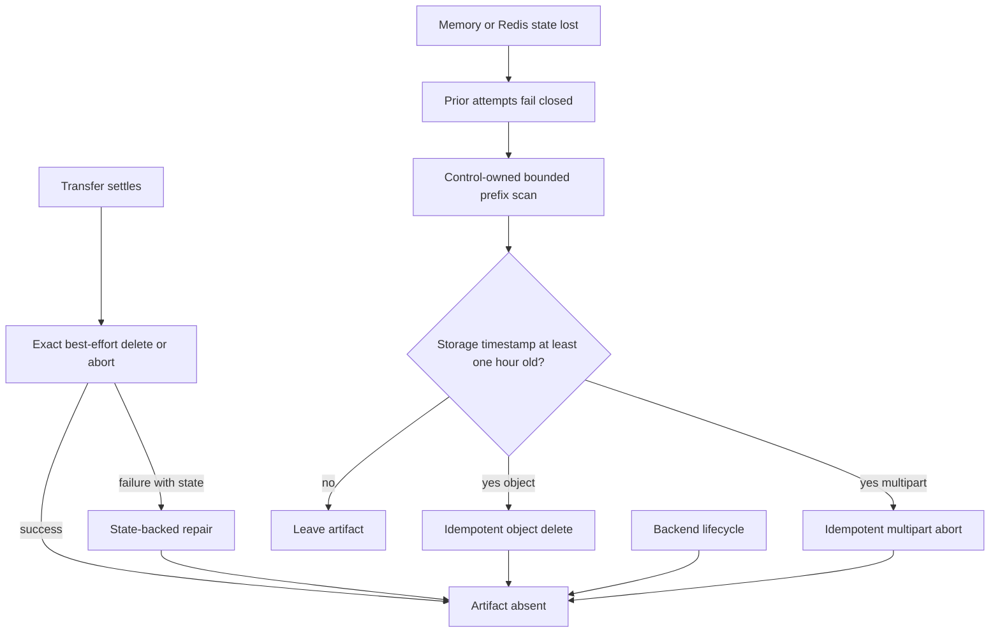

# transfer-260728/DESIGN: Runtime Transfer Lifespan Recovery

## Inputs

- Requirements:
  [transfer-260728/REQ](../requirements/transfer-260728-runtime-transfer-lifespan-recovery.md)
- Decisions:
  [transfer-260728/ADR](../adr/transfer-260728-runtime-transfer-lifespan-recovery.md)
- Current Runtime behavior:
  [Agent Runtime Control](../spec/flow/agent-runtime-control.md)
- Current file behavior:
  [File Exchange Storage](../spec/flow/file-exchange-storage.md)
- Historical implementation snapshot:
  [transfer-260725/DESIGN](./transfer-260725-runtime-file-transfer.md)

## Current Behavior and Requirement Gaps

`RuntimeTransferConfig` derives every admitted attempt's logical expiration from
its admission time and caps it at one hour. Memory and Redis stores enforce the
same state contract. The coordinator rejects expired records and settlement
invokes `RuntimeTransferS3Cleanup` with exact trusted object and multipart
evidence.

`repair_transfer_once` repairs terminal correlations, pending dispatches,
generation state, and stale stream claims. Every category begins from transfer
state. If the in-memory store restarts or Redis returns empty, the repair loop has
no record from which to recover an orphan object handle or multipart upload ID.
The implemented historical design's bounded transfer-prefix orphan scan is
therefore missing.

The chart's external-storage gate validates only a
`lifecycleAcknowledgement` value object. Runtime Control does not consume it and
the values do not configure the storage backend. A deployment can provide
invented evidence while having no policy, while a correctly configured backend
cannot render without the values. The current Home change also uses a separate
Job and one-day values that do not represent the fixed one-hour authority.

## Proposed Architecture



The normal path remains exact state-backed cleanup. The new orphan path uses only
the configured transfer prefix and storage-provided age evidence. It cannot
restore a transfer or authorize bytes.

## S3 Listing Contract

Extend `azcommon.infra.s3.service` with immutable bounded listing records:

- `S3ListedObject`
  - exact `S3ObjectIdentity`;
  - timezone-aware `last_modified_at`.
- `S3ObjectSummaryPage`
  - ordered listed objects;
  - optional `next_continuation_token`.
- `S3ListedMultipartUpload`
  - exact `S3MultipartUpload`;
  - timezone-aware `initiated_at`.
- `S3MultipartUploadPage`
  - ordered uploads;
  - optional next key and upload-ID markers.

Add one bounded object-page operation using `ListObjectsV2` and one bounded
multipart-page operation using `ListMultipartUploads`. Both validate a positive
page size no greater than the S3 page maximum and discard malformed entries
rather than manufacturing timestamps or identities.

Existing `list_page` and `delete_prefix_bounded` behavior remains available for
callers that only need identities. The new orphan listing methods preserve age
evidence instead of forcing one `HeadObject` request per listed object.

## Runtime Transfer Orphan Sweeper

`RuntimeTransferS3Cleanup` gains process-local object and multipart cursors and:

```text
repair_orphans(now, maximum_age, page_size) -> RuntimeTransferOrphanRepairResult
```

The result is a frozen bounded count structure:

- listed objects;
- deleted objects;
- listed multipart uploads;
- aborted multipart uploads; and
- failed cleanup operations; and
- storage entries skipped because their age evidence is missing or invalid.

The method:

1. validates a timezone-aware `now`, positive `maximum_age`, and S3-compatible
   page size;
2. calculates `cutoff = now - maximum_age`;
3. lists one object page under the exact normalized transfer prefix;
4. deletes each object whose `last_modified_at <= cutoff`;
5. advances or resets the object continuation token;
6. lists one multipart page under the same prefix;
7. aborts each upload whose `initiated_at <= cutoff`;
8. advances or resets the multipart key/upload markers; and
9. returns counts without retaining object keys in logs or transfer state.

Per-artifact delete or abort failures increment the failure count and allow the
remaining page to continue. Listing failure raises so the outer repair loop logs
the failed iteration with its existing stack-preserving error path. A listing
entry with missing or invalid timezone-aware age evidence is not deleted; it
increments the skipped-entry count and emits a structured aggregate warning for
its artifact kind.

The exact transfer prefix ends with `/` before listing so a configured
`v1/runtime-transfer` namespace cannot match sibling keys such as
`v1/runtime-transfer-archive`.

## Repair Loop Integration

`_run_transfer_repair` already owns a process-lifetime cleanup collaborator and
an injected interval. Pass the injected UTC clock and call
`repair_orphans` after state-backed repair categories in
`repair_transfer_once`.

The age threshold is the same one-hour constant used by `logical_expiry`, not the
terminal metadata TTL and not a Helm-provided duration. The configured transfer
list page size bounds both state-store lists and each S3 list.

The repair observation count includes listed orphan candidates so a non-empty
pass produces the existing structured repair log. Add structured fields only if
separate deleted/aborted/failure counters are needed operationally; never log
object keys or upload IDs.

Every Runtime Control replica may scan. S3 object delete is idempotent and
`abort_multipart_upload` already treats not-found and no-such-upload as success.
No Redis leader, lock, or cursor is introduced.

## Startup and Helm Contract

Remove `server.runtimeControl.transfer.lifecycleAcknowledgement` from:

- chart defaults;
- JSON schema;
- Runtime Control deployment render guard;
- NOTES;
- render fixtures and assertions.

Keep the strict schema so the removed object cannot silently remain deployment
authority. The external-storage render test supplies functional S3 and Runner
configuration and verifies:

- Runtime Control renders;
- transfer bucket and endpoint are present;
- Control-only S3 credential aliases are present;
- Runner transfer endpoint is present; and
- Runner receives no S3 credentials.

The memory backend test continues to require exactly one Runtime Control replica
with HPA disabled. This preserves Redis-optional operation while rejecting
divergent process-local authority.

The Home deployment overlay removes the rejected acknowledgement values before
using the strict chart schema. The separate lifecycle Job and its one-day
documentation are removed. This correction does not install or mutate live
storage policy.

## State Loss and Failure Semantics

### Empty memory or Redis

When volatile transfer state is empty:

- status, claim, stream, acknowledgement, and settlement calls for prior
  identities fail closed;
- existing S3 objects do not recreate records or success;
- new admissions use the empty store normally;
- the orphan sweeper independently removes old prefix artifacts; and
- current objects younger than one hour remain untouched until a later pass.

The behavior does not distinguish why the store is empty. An intentional Redis
flush, Redis replacement, memory-process restart, or state expiry uses the same
path.

### Cleanup failure

Exact settlement cleanup preserves its existing retryable state evidence.
State-independent cleanup treats one object failure independently and continues
the page. A later full cursor cycle retries it. Backend lifecycle remains the
last defense if Control cannot reach storage for an extended period.

### Clock and backend evidence

Runtime Control uses a timezone-aware injected UTC clock. S3 timestamps are
normalized as timezone-aware values before comparison. Missing or malformed
timestamps are not guessed and are not eligible for deletion.

Storage timestamps can make physical deletion occur later than admission plus one
hour, especially for an object completed near its logical deadline. This does not
extend logical validity. Exact cleanup remains responsible for prompt removal,
while the orphan sweeper and backend lifecycle provide convergent physical
defense.

## Migration, Rollout, and Rollback

No database, protobuf, or public API migration is required.

Roll out as one Azents PR plus a coordinated Home configuration correction:

1. remove the Home lifecycle acknowledgement and rejected standalone lifecycle
   Job;
2. merge and publish the Azents chart/runtime change;
3. update the Home chart revision through its normal GitOps process; and
4. verify Runtime Control readiness and a deterministic `present_file` smoke
   test.

This work stops at PR creation and CI. Live Argo synchronization, rollout
restart, storage mutation, and PR merge require separate explicit approval.

Rollback selects the previous chart and matching previous overlay together.
Because the old chart gate is declaration-only, rollback values do not improve
lifespan enforcement. Orphan bytes remain inaccessible and can be cleaned by a
forward fix or backend policy.

## Observability

Retain existing transfer identifiers only for state-backed cleanup. Orphan
metrics and logs contain aggregate counts:

- object and multipart entries listed;
- objects deleted;
- multipart uploads aborted;
- per-artifact failures;
- page completion or cursor continuation; and
- repair iteration failure.

Do not log keys, upload IDs, file contents, hashes, credentials, or private
endpoints.

## Test Strategy

### E2E primary verification matrix

| Scenario | Expected evidence |
| --- | --- |
| External S3 `present_file` after chart rollout | Runtime Control is ready without lifecycle acknowledgement; publication succeeds |
| Memory backend restart | Prior attempt fails closed; new `present_file` succeeds; old artifact becomes orphan-cleanup eligible |
| Redis reset to empty | Service resumes without restoring Redis data; prior attempt is not revived; new transfer succeeds |
| Object older than one hour | One bounded repair pass deletes it |
| Object younger than one hour | Repair leaves it unchanged |
| Multipart upload older than one hour | One bounded repair pass aborts it |
| Multipart upload younger than one hour | Repair leaves it active |
| Duplicate replica cleanup | Delete/abort converges without a transfer-state or Redis lock |
| Storage cleanup failure | Remaining page continues; failure is observable; later scan can retry |

### Unit and integration coverage

- `az-common` service tests validate object and multipart listing pagination,
  timestamps, malformed-entry filtering, and marker propagation.
- Runtime transfer cleanup tests use an injected clock and fake S3 collaborator
  to prove the exact one-hour cutoff, prefix confinement, cursor progression,
  idempotent duplicate cleanup, and per-artifact failure continuation.
- Runtime Control composition tests prove `repair_transfer_once` runs orphan
  repair even when state-backed categories return no records.
- State-store contract tests continue running identically for memory and Redis.
- Helm render tests use external object storage without lifecycle
  acknowledgement and reject removed values through the strict schema.
- The RustFS integration fixture creates old and young objects and multipart
  uploads where its test API permits deterministic timestamps or injected
  cleanup time. Backend-native lifecycle timing is not awaited in CI.

### CI policy and evidence

Core unit, contract, Runtime Control composition, S3 service, and Helm render
tests must pass without live storage credentials. Deterministic RustFS
integration is required where the existing transfer storage fixture is
available. Live backend lifecycle execution remains optional because it is not
the one-hour authority.

## Traceability

| Requirement | ADR decisions | Design mechanism | Verification |
| --- | --- | --- | --- |
| `transfer-260728/REQ-1` | D4, D5 | Strict chart without acknowledgement; coordinated overlay update | Helm render and Home render |
| `transfer-260728/REQ-2` | D1, D2 | Existing logical expiry and exact cleanup plus one-hour orphan cutoff | Injected-clock cleanup tests |
| `transfer-260728/REQ-3` | D2, D3 | State-independent object and multipart page scans | Empty-store composition and S3 tests |
| `transfer-260728/REQ-4` | D1, D4, D5 | Runtime authority separated from infrastructure lifecycle | Schema, docs, and deployment diff review |

## Feasibility Validation

| Requirement | Result | Repository evidence |
| --- | --- | --- |
| REQ-1 | Feasible | The chart gate is template-only; Runtime Control already consumes functional S3 values and renders correctly when the gate is removed. |
| REQ-2 | Feasible | `logical_expiry`, exact verified delete, and idempotent multipart abort already exist. |
| REQ-3 | Feasible | `S3Service` already has bounded object listing and exact cleanup primitives; multipart listing and age-preserving summaries are bounded additions. |
| REQ-4 | Feasible | No Runtime Control code consumes lifecycle acknowledgement fields; lifecycle remains an external storage concern. |

No requirement is blocked. The main operational risk is backend timestamp and
pagination variation, which is covered by contract tests and repeated scan
cycles.

## Living Spec Updates Required at Implementation

- `docs/azents/spec/flow/agent-runtime-control.md`
  - state that transfer state is optional volatile authority;
  - document state-independent bounded object and multipart orphan cleanup; and
  - distinguish one-hour logical validity from physical cleanup timing.
- `docs/azents/spec/flow/file-exchange-storage.md`
  - clarify that `present_file` remains available after empty volatile-state
    recovery and that orphan storage never recreates a publishable handle.
